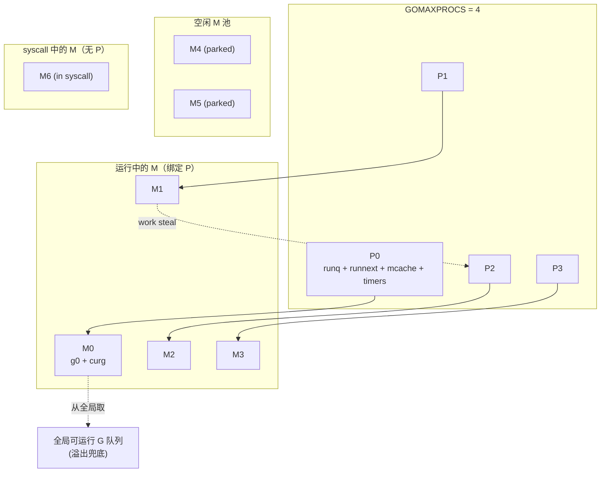

# 06.GMP 调度器原理

> Go 调度器是 runtime 的"心脏"。一个 16 核机器上同时跑几十万 goroutine，靠的就是 GMP 这套巧妙的三角分工。本篇拆 G、M、P 三件套、调度循环、work stealing、抢占、`sysmon` 后台守护，并讲清 Go runtime 从 `rt0_go` 启动到调度第一个用户 goroutine 的全过程。
>
> 关键词：G / M / P、本地队列 / 全局队列、work stealing、协作抢占、异步抢占（Go 1.14+）、`sysmon`、`schedule()`、runtime 启动流程

## 目录介绍
- [一、开篇：一个被问烂的面试题](#一开篇一个被问烂的面试题)
- [二、历史演进：从 GM 到 GMP](#二历史演进从-gm-到-gmp)
  - [2.1 Go 1.0 的 GM 模型与全局锁](#21-go-10-的-gm-模型与全局锁)
  - [2.2 Go 1.1：Dmitry Vyukov 引入 P，性能提升 10×](#22-go-11dmitry-vyukov-引入-p性能提升-10)
  - [2.3 Go 1.14：异步抢占终结"死循环不调度"](#23-go-114异步抢占终结死循环不调度)
  - [2.4 Go 1.21+ 的渐进优化](#24-go-121-的渐进优化)
- [三、G / M / P 三件套](#三g--m--p-三件套)
  - [3.1 G（goroutine）：一个用户态协程](#31-ggoroutine一个用户态协程)
  - [3.2 M（machine）：一个 OS 线程](#32-mmachine一个-os-线程)
  - [3.3 P（processor）：调度器的执行单元](#33-pprocessor调度器的执行单元)
  - [3.4 三者关系图](#34-三者关系图)
- [四、Go runtime 启动流程](#四go-runtime-启动流程)
  - [4.1 `rt0_go`：从 _start 到 Go 世界](#41-rt0_go从-_start-到-go-世界)
  - [4.2 `schedinit`：初始化调度器与 P 数组](#42-schedinit初始化调度器与-p-数组)
  - [4.3 `newproc(main)`：第一个用户 goroutine 诞生](#43-newprocmain第一个用户-goroutine-诞生)
  - [4.4 `mstart` → `schedule`：调度循环开始](#44-mstart--schedule调度循环开始)
- [五、调度循环 `schedule()`](#五调度循环-schedule)
  - [5.1 寻找一个可运行 G 的优先级链](#51-寻找一个可运行-g-的优先级链)
  - [5.2 每 61 次必须捞一次全局队列：饥饿防护](#52-每-61-次必须捞一次全局队列饥饿防护)
  - [5.3 `findRunnable`：四级查找](#53-findrunnable四级查找)
- [六、work stealing 工作窃取](#六work-stealing-工作窃取)
- [七、抢占机制](#七抢占机制)
  - [7.1 协作式抢占（Go 1.14 之前）](#71-协作式抢占go-114-之前)
  - [7.2 异步信号抢占（Go 1.14+）](#72-异步信号抢占go-114)
  - [7.3 `sysmon` 后台守护](#73-sysmon-后台守护)
- [八、syscall 阻塞时的 P 转移](#八syscall-阻塞时的-p-转移)
- [九、`GOMAXPROCS` 的影响](#九gomaxprocs-的影响)
- [十、实战观测](#十实战观测)
  - [10.1 GODEBUG=schedtrace=1000](#101-godebugschedtrace1000)
  - [10.2 dlv 进入 schedule](#102-dlv-进入-schedule)
  - [10.3 trace 工具看调度时间线](#103-trace-工具看调度时间线)
- [十一、常见陷阱 Top 5](#十一常见陷阱-top-5)
- [十二、本篇与其他卷的衔接](#十二本篇与其他卷的衔接)
- [十三、参考资料](#十三参考资料)
- [附录：与 C++ std::thread 对照](#附录与-c-stdthread-对照)

---

## 一、开篇：一个被问烂的面试题

> 面试官：写一个 Go 程序，在我的 4 核笔记本上同时跑 100 万个 goroutine，每个 goroutine 计算一段 CPU 任务，问会发生什么？

绝大多数候选人会答："会卡死"或"会 OOM"。**但正确答案是**：

```go
// ✅ 这段代码可以正常跑完
package main

import (
    "runtime"
    "sync"
    "sync/atomic"
)

func main() {
    var sum atomic.Int64
    var wg sync.WaitGroup
    n := 1_000_000
    wg.Add(n)
    for i := 0; i < n; i++ {
        go func(i int) {
            defer wg.Done()
            sum.Add(int64(i))
        }(i)
    }
    wg.Wait()
    println("GOMAXPROCS =", runtime.GOMAXPROCS(0))
    println("NumGoroutine =", runtime.NumGoroutine())
    println("sum =", sum.Load())
}
```

在我的 M2 笔记本上跑这段代码，峰值时 100 万个 goroutine 同时存在，**总 OS 线程数仅 ~10 个**，整个程序 600ms 跑完，内存峰值 ~3 GB（每个 goroutine 栈初始 2KB+）。

这就是 GMP 的本事——**用 10 个 OS 线程驱动 100 万个用户态协程**。

下面我们来拆开它。

---

## 二、历史演进：从 GM 到 GMP

理解任何系统的第一步，是理解它"以前为什么不是这样"。

### 2.1 Go 1.0 的 GM 模型与全局锁

Go 1.0（2012）发布时，调度器只有 G 和 M 两个概念：

```
┌──────────────────────────────────┐
│       全局可运行 G 队列（带大锁）  │
└────────┬─────────┬─────────┬──────┘
         │         │         │
         ▼         ▼         ▼
        M0        M1        M2     ...
```

每个 M（OS 线程）从全局队列里抢一个 G 来跑，抢的时候需要持有全局 `sched.lock`。

**这套设计在 1-2 核上勉强能用，到 8 核就崩了**：所有 M 都在抢同一把锁，CPU 时间大量消耗在 lock contention 上。Dmitry Vyukov 在 2012 年的内部测评里发现，Go 1.0 在 24 核机器上的吞吐立刻翻了 10 倍。

### 2.2 Go 1.1：Dmitry Vyukov 引入 P，性能提升 10×

Vyukov 在 [《Scalable Go Scheduler Design Doc》](https://docs.google.com/document/d/1TTj4T2JO42uD5ID9e89oa0sLKhJYD0Y_kqxDv3I3XMw) 里提出了 **P（Processor）** 这个抽象：

- P 是"调度器的执行单元"，**数量 = `GOMAXPROCS`**（默认 = CPU 核数）
- 每个 P 有自己的**本地可运行 G 队列**（256 长度环形数组），无锁访问
- M 必须**绑定一个 P** 才能执行 G
- 全局队列依然存在，但只用作"溢出兜底"
- M 找不到 G 时，**从其他 P 偷一半 G 过来**（work stealing）

```
GOMAXPROCS=4 时：

  ┌───┐ ┌───┐ ┌───┐ ┌───┐
  │ P0│ │ P1│ │ P2│ │ P3│       ← P 数组，长度 = GOMAXPROCS
  └─┬─┘ └─┬─┘ └─┬─┘ └─┬─┘
    │     │     │     │
   [本地队列  本地队列  本地队列  本地队列]
    │     │     │     │
   M0    M1    M2    M3        ← M 与 P 1:1 绑定（运行时）

         ┌────────────────┐
         │  全局可运行队列  │     ← 仅作溢出兜底
         └────────────────┘
```

引入 P 之后，绝大多数调度操作（pop / push 本地队列）都是**无锁**的。Go 1.1 在 24 核机器上的吞吐立刻翻了 10 倍。

> **注**：很多博客把 P 翻译为"逻辑处理器"，其实 P 既不"逻辑"也不"处理器"——它本质上是**调度器的并行度配额**，更接近"调度上下文"。本书统一称 P。

### 2.3 Go 1.14：异步抢占终结"死循环不调度"

在 Go 1.14 之前，调度器是**协作式**的——只有 G 主动调用某些函数（函数序言里的栈检查、channel 操作、syscall）时，才会有机会被换下。这就导致一个臭名昭著的 bug：

```go
// ❌ 在 Go 1.13 及更早版本，这段代码会卡死整个程序
func main() {
    runtime.GOMAXPROCS(1)
    go func() {
        for {} // 死循环，永远不会调用任何函数
    }()
    time.Sleep(time.Second)
    fmt.Println("done") // ❌ 这一行永远不会被打印
}
```

因为只有一个 P，那个死循环 G 永远不会主动让出，main goroutine 没有机会调度。

Go 1.14 引入 **异步信号抢占**：`sysmon` 监控到一个 G 跑了超过 10ms，会向对应的 M 发 `SIGURG` 信号；信号处理函数把 G 当前的 PC 改写为 `runtime.asyncPreempt`，等信号返回时就走到了"主动让出"的路径。

具体细节我们在第七节展开。

### 2.4 Go 1.21+ 的渐进优化

从 Go 1.14 之后，GMP 的"骨架"基本稳定，后续的优化都是"贴肉"：

| 版本 | 优化点 |
|------|--------|
| Go 1.14 | 异步抢占、time/timer 集成到 P |
| Go 1.17 | 寄存器 ABI（amd64），调度切换更快 |
| Go 1.18 | ARM64 寄存器 ABI |
| Go 1.21 | profile-guided inlining，间接优化调度热路径 |
| Go 1.22 | range-over-int 优化、调度小修小补 |

---

## 三、G / M / P 三件套

### 3.1 G（goroutine）：一个用户态协程

源码定义在 `runtime/runtime2.go`：

```go
// runtime/runtime2.go (Go 1.22, 简化展示)
type g struct {
    stack       stack       // 栈区间 [stack.lo, stack.hi)
    stackguard0 uintptr     // 栈检查的"红线"
    m           *m          // 当前绑定的 M（运行时）
    sched       gobuf       // 上下文（PC / SP / BP），用于切换
    atomicstatus atomic.Uint32 // _Grunnable / _Grunning / _Gwaiting / ...
    goid        uint64
    waitreason  waitReason
    // ... 还有 ~50 个字段
}

type gobuf struct {
    sp   uintptr // 栈指针
    pc   uintptr // 程序计数器
    g    guintptr
    ctxt unsafe.Pointer
    ret  uintptr
    lr   uintptr
    bp   uintptr
}
```

**关键点**：

1. **G 不是线程**——它没有自己的内核栈，只有用户态的可增长栈（初始 2KB，最大 1GB）
2. **`sched gobuf`** 保存上下文：当 G 被换下时，它的 PC / SP 写入这里；下次被换上时从这里恢复。这就是"协程切换"的核心
3. G 有**九种状态**（`_Gidle`/`_Grunnable`/`_Grunning`/`_Gsyscall`/`_Gwaiting`/`_Gdead`/`_Gcopystack`/`_Gpreempted`/`_Gscan*`）
4. 每个 G 大约占 **~600 字节** + 栈大小

### 3.2 M（machine）：一个 OS 线程

```go
// runtime/runtime2.go
type m struct {
    g0          *g           // 系统栈 G（用来跑调度器自己）
    curg        *g           // 当前运行的用户 G
    p           puintptr     // 当前绑定的 P
    nextp       puintptr     // exitsyscall 后想拿的 P
    oldp        puintptr     // entersyscall 之前的 P
    id          int64
    spinning    bool         // 是否处于自旋找活儿状态
    blocked     bool
    park        note         // 休眠用的 futex
    // ... 还有 ~80 个字段
}
```

**关键点**：

1. **每个 M 都有两个栈**：g0 栈（系统栈，固定 8KB / 64KB，用来跑 runtime 代码如 `schedule`、`gc`）和 curg 的栈（用户栈，可增长）
2. M 的数量**没有硬上限**（默认 10000）。当所有 P 都阻塞时，runtime 会创建新 M
3. M 进入 syscall 阻塞前，会调用 `entersyscall`，把 P 让出来，让别的 M 接手
4. M 平时空闲时，会休眠在 `park` 这个 futex 上

### 3.3 P（processor）：调度器的执行单元

```go
// runtime/runtime2.go
type p struct {
    id          int32
    status      uint32       // _Pidle / _Prunning / _Psyscall / _Pgcstop / _Pdead
    m           muintptr     // 绑定的 M

    // 本地可运行 G 队列：环形数组 + 一个 runnext 槽
    runqhead    uint32
    runqtail    uint32
    runq        [256]guintptr
    runnext     guintptr     // "插队"槽，实现"刚被唤醒的 G 优先跑"

    // 内存分配相关
    mcache      *mcache      // 每 P 一份的内存缓存
    pcache      pageCache    // 页缓存

    // timer 相关（Go 1.14+ 集成进 P）
    timers      []*timer
    timer0When  atomic.Int64

    // GC 相关
    gcAssistTime    int64
    gcFractionalMarkTime int64

    // ... 还有 ~30 个字段
}
```

**关键点**：

1. **P 的数量在程序启动后基本固定**（除非显式调 `GOMAXPROCS`）
2. **runq + runnext** 是关键设计：`runnext` 用来实现"channel send/recv 唤醒的 G 立刻执行"——比放回 runq 末尾更友好
3. **mcache 在 P 上**：这就是为什么内存分配是"无锁"的——同一时刻只有一个 M 在持有这个 P
4. **timer 在 P 上**（Go 1.14+ 改造的）：避免全局 timer 堆的锁竞争

### 3.4 三者关系图



记住三句话：

- **G 是任务**，**M 是工人**，**P 是工位**
- 工人必须站到工位上才能干活；工位数量固定
- 工人去厕所（syscall）时，把工位让给别人

---

## 四、Go runtime 启动流程

> 这一节是很多 Go 工程师的盲区——大家都知道有个 `main` 函数，但 main 函数被调用之前发生了什么？让我们从 ELF 入口 `_start` 一路追到 `main.main`。

### 4.1 `rt0_go`：从 _start 到 Go 世界

Linux/amd64 上，OS 把 ELF 加载到内存后，跳到 `_rt0_amd64_linux`（在 `runtime/rt0_linux_amd64.s`）：

```asm
TEXT _rt0_amd64_linux(SB),NOSPLIT,$-8
    JMP _rt0_amd64(SB)
```

`_rt0_amd64` 把 argc / argv 摆好，跳到 `runtime.rt0_go`（`runtime/asm_amd64.s`）：

```asm
TEXT runtime·rt0_go(SB),NOSPLIT|TOPFRAME,$0
    // 1. 设置 g0 栈（M0 的系统栈）
    MOVQ    $runtime·g0(SB), DI
    LEAQ    (-64*1024)(SP), BX
    MOVQ    BX, g_stackguard0(DI)
    MOVQ    BX, g_stackguard1(DI)
    MOVQ    BX, (g_stack+stack_lo)(DI)
    MOVQ    SP, (g_stack+stack_hi)(DI)

    // 2. 关联 M0 与 g0
    LEAQ    runtime·m0+m_tls(SB), DI
    CALL    runtime·settls(SB)

    // 3. 调用 args / osinit / schedinit
    CALL    runtime·args(SB)
    CALL    runtime·osinit(SB)
    CALL    runtime·schedinit(SB)

    // 4. 创建 main goroutine
    MOVQ    $runtime·mainPC(SB), AX
    PUSHQ   AX
    CALL    runtime·newproc(SB)
    POPQ    AX

    // 5. 启动 M0（不会返回）
    CALL    runtime·mstart(SB)

    RET // 不会执行到这里
```

> 源码引用：`runtime/asm_amd64.s` 约 L161-L260（Go 1.22.0，commit `8b9696f`）

### 4.2 `schedinit`：初始化调度器与 P 数组

```go
// runtime/proc.go (Go 1.22, 简化)
func schedinit() {
    // ... 初始化锁、随机数、GC 等

    // 设置 GOMAXPROCS
    procs := ncpu
    if n, ok := atoi32(gogetenv("GOMAXPROCS")); ok && n > 0 {
        procs = n
    }
    if procresize(procs) != nil {
        throw("unknown runnable goroutine during bootstrap")
    }
    // ...
}
```

**关键函数 `procresize(nprocs)`**：

1. 创建/销毁 P 直到数量 = `nprocs`
2. 把 M0 与 `allp[0]` 绑定
3. 其他 P 进入 `_Pidle` 状态

### 4.3 `newproc(main)`：第一个用户 goroutine 诞生

```go
// runtime/proc.go
func newproc(fn *funcval) {
    gp := getg()
    pc := getcallerpc()
    systemstack(func() {
        newg := newproc1(fn, gp, pc)
        pp := getg().m.p.ptr()
        runqput(pp, newg, true) // 插入 P0 的本地队列
        if mainStarted {
            wakep()
        }
    })
}
```

`newproc1` 做的事：

1. 从 `gFree` 池或新建一个 G
2. 分配栈（默认 2KB）
3. 设置 `gobuf.pc = goexit`、`gobuf.sp = 栈顶`
4. 把 `fn` 摆到栈上，让 `goexit` 返回时调用 `fn`

### 4.4 `mstart` → `schedule`：调度循环开始

`mstart` 切到 g0 栈后，调用 `mstart1`，最终进入 `schedule()`：

```go
// runtime/proc.go
func schedule() {
    mp := getg().m

top:
    pp := mp.p.ptr()
    // 1. 找一个可运行的 G
    gp, inheritTime, tryWakeP := findRunnable() // 阻塞直到找到

    // 2. 如果之前在自旋，重置自旋状态
    if mp.spinning {
        resetspinning()
    }

    // 3. 切到这个 G 的栈、跳到它的 PC
    execute(gp, inheritTime)
}
```

`execute()` 调用 `gogo(&gp.sched)`，后者是一段汇编，把 `gp.sched` 里的 PC/SP/BP 恢复到 CPU 寄存器，然后 `RET`——这一刻起，CPU 就在跑用户的 goroutine 了。

整个启动链路：

```
_start
  └─ _rt0_amd64_linux
      └─ runtime·rt0_go
          ├─ runtime·args
          ├─ runtime·osinit          (设置 ncpu)
          ├─ runtime·schedinit       (初始化 P 数组、M0)
          ├─ runtime·newproc(main)   (创建 main goroutine 入队)
          └─ runtime·mstart
              └─ schedule()
                  └─ execute(main_g)
                      └─ runtime·main
                          ├─ runtime.init()
                          ├─ main.init()
                          └─ main.main() ← 你写的代码！
```

---

## 五、调度循环 `schedule()`

### 5.1 寻找一个可运行 G 的优先级链

`findRunnable` 是调度器的"心脏中的心脏"，它按以下优先级找 G：

```
1. P 本地的 runnext 槽（最高优先级，刚唤醒的 G）
2. P 本地的 runq（环形队列，FIFO）
3. 全局可运行队列（每 61 次必查一次，防饥饿）
4. netpoller（检查就绪的网络 G）
5. work stealing：从其他 P 偷一半 G
6. 还找不到 → 再次检查全局队列、netpoller、GC 后台标记任务
7. 都没有 → M 进入 spinning 状态自旋一会儿
8. 还没有 → M park（休眠在 futex 上）
```

### 5.2 每 61 次必须捞一次全局队列：饥饿防护

```go
// runtime/proc.go schedule()
if pp.schedtick%61 == 0 && sched.runqsize > 0 {
    lock(&sched.lock)
    gp = globrunqget(pp, 1)
    unlock(&sched.lock)
}
```

为什么是 61？这是个**质数**——避免和其他周期性事件（如 GC pacing 的 100、timer 的 1000）形成共振。

如果不做这个保护，某个 P 一直忙着跑本地队列，全局队列里的 G 会被饿死。

### 5.3 `findRunnable`：四级查找

```go
// runtime/proc.go (Go 1.22, 简化到核心)
func findRunnable() (gp *g, inheritTime, tryWakeP bool) {
    mp := getg().m

top:
    pp := mp.p.ptr()

    // 1. 检查 timer
    now, pollUntil, _ := checkTimers(pp, 0)

    // 2. 本地队列
    if gp, inheritTime := runqget(pp); gp != nil {
        return gp, inheritTime, false
    }

    // 3. 全局队列
    if sched.runqsize != 0 {
        lock(&sched.lock)
        gp := globrunqget(pp, 0)
        unlock(&sched.lock)
        if gp != nil {
            return gp, false, false
        }
    }

    // 4. netpoller (非阻塞)
    if netpollinited() && atomic.Load(&netpollWaiters) > 0 {
        if list := netpoll(0); !list.empty() {
            gp := list.pop()
            injectglist(&list)
            return gp, false, false
        }
    }

    // 5. work stealing
    if mp.spinning || 2*atomic.Load(&sched.nmspinning) < gomaxprocs-atomic.Load(&sched.npidle) {
        if !mp.spinning {
            mp.spinning = true
            atomic.Xadd(&sched.nmspinning, 1)
        }
        gp, inheritTime, tnow, w, newWork := stealWork(now)
        // ...
    }

    // 6. 都没找到 → M park
    stopm()
    goto top
}
```

> 源码引用：`runtime/proc.go` 约 L2900-L3100（Go 1.22.0）

---

## 六、work stealing 工作窃取

当一个 P 的本地队列空了，它会随机选一个其他 P 偷一半 G 过来：

```go
// runtime/proc.go
func runqsteal(pp, p2 *p, stealRunNextG bool) *g {
    t := pp.runqtail
    n := runqgrab(p2, &pp.runq, t, stealRunNextG)
    if n == 0 {
        return nil
    }
    n--
    gp := pp.runq[(t+n)%uint32(len(pp.runq))].ptr()
    if n == 0 {
        return gp
    }
    // ... 更新 tail
    return gp
}
```

**关键设计**：

- 偷的是**一半**（不是全部，避免来回偷）
- 用 **CAS** 操作，被偷者无需加锁
- 偷的方向是**随机的**：用 `fastrand()` 选一个 P，避免雪崩

如果偷了 4 次还没偷到，M 就 park 进入空闲池。

---

## 七、抢占机制

### 7.1 协作式抢占（Go 1.14 之前）

每个函数的序言（prologue）会检查栈：

```asm
// 函数序言（简化）
CMPQ SP, g_stackguard0(R14)
JLS  morestack    ; 跳到栈扩容
```

`stackguard0` 平时等于栈底。当 runtime 想抢占某个 G 时，把它的 `stackguard0` 设为 `0xfffffade`（一个超大值），下次序言检查就会失败，跳到 `morestack`，进而进入调度器。

**问题**：死循环里没有函数调用，永远不进序言。

### 7.2 异步信号抢占（Go 1.14+）

设计文档：[Proposal: Non-cooperative goroutine preemption](https://github.com/golang/proposal/blob/master/design/24543-non-cooperative-preemption.md)

流程：

1. `sysmon` 监控发现某个 G 跑了超过 10ms
2. `preemptM(mp)` 给对应 M 发 `SIGURG` 信号
3. 信号处理函数 `runtime.sighandler` 检查当前 PC 是否处于"安全点"（不是 GC 写屏障内、不是非抢占区间）
4. 如果安全，把 PC 改为 `runtime.asyncPreempt`
5. 信号返回时，CPU 跳到 `asyncPreempt`，里面调用 `mcall(gopreempt_m)`，把当前 G 状态置为 `_Grunnable` 并放回队列
6. 进入 `schedule()`，调度其他 G

**为什么用 `SIGURG` 而不是 `SIGUSR1`？** 因为 `SIGURG` 在实际网络编程中几乎从不用（OOB data 早被废弃），不会和用户代码冲突。

### 7.3 `sysmon` 后台守护

`sysmon` 是一个**不绑定 P 的特殊 M**，每 20us-10ms 跑一轮，做以下事：

1. **抢占检查**：扫描所有 P，发现 G 跑超时就 `preemptM`
2. **netpoller 兜底**：如果有 P 长时间没轮询 netpoller，主动 poll 一下
3. **强制 GC**：如果两次 GC 间隔 > 2 分钟，触发一次
4. **scavenger**：把闲置内存归还 OS

```go
// runtime/proc.go sysmon()
for {
    // ...
    delay := 20 * time.Microsecond
    if idle > 50 {
        delay *= 2
    }
    if delay > 10*time.Millisecond {
        delay = 10 * time.Millisecond
    }
    usleep(delay)

    // 1. retake P from blocked syscall / long-running G
    retake(now)

    // 2. force GC if needed
    if t := (gcTrigger{kind: gcTriggerTime, now: now}); t.test() {
        // ...
    }

    // ...
}
```

---

## 八、syscall 阻塞时的 P 转移

```go
// runtime/proc.go
func entersyscall() {
    gp := getg()
    save(getcallerpc(), getcallersp())
    gp.m.locks++
    gp.m.p.ptr().status = _Psyscall
    casgstatus(gp, _Grunning, _Gsyscall)
    gp.m.oldp.set(gp.m.p.ptr())
    gp.m.p = 0  // ← M 与 P 解绑
}
```

注意 **M 与 P 在 `entersyscall` 里立刻解绑** 了。但此时 P 还是 `_Psyscall` 状态，并没有真的被别的 M 抢走。

**两条路径**：

- **快路径**（syscall 几微秒就返回）：`exitsyscall` 尝试拿回 `oldp`。若 oldp 还没被抢，直接复用，无需进调度器，性能最优
- **慢路径**（syscall 阻塞 > 20us）：`sysmon` 的 `retake` 把 P 从 `_Psyscall` 转为 `_Pidle`，唤醒一个空闲 M 来接管。原 M 的 `exitsyscall` 发现 P 没了，把当前 G 放进全局队列，自己进入 `m.park` 休眠

这就是为什么 Go 的网络 IO 性能很好——大量短 syscall 都走快路径，几乎无开销。

---

## 九、`GOMAXPROCS` 的影响

| 设置 | 行为 |
|------|------|
| 默认（= CPU 核数） | 每核一个 P，最优并行度 |
| 设为 1 | 完全串行调度，多核机退化为单核 |
| 设为 100（远大于核数） | P 多起来不会变快，反而 cache miss 增加 |
| 设为 0 | 不变，返回当前值 |

**容器环境的坑**：在 Kubernetes 里，Go 1.21 之前不会读 cgroup 的 CPU limit，导致 GOMAXPROCS = 宿主机核数（如 96）而不是 limit（如 2）。

**解决方案**：

- Go 1.21+ 自动适配 CGROUP v2（部分场景）
- 用 [`uber-go/automaxprocs`](https://github.com/uber-go/automaxprocs)，import 即生效

---

## 十、实战观测

### 10.1 GODEBUG=schedtrace=1000

```bash
$ GODEBUG=schedtrace=1000 GOMAXPROCS=4 ./yourprogram
SCHED 0ms: gomaxprocs=4 idleprocs=0 threads=5 spinningthreads=1 needspinning=0 idlethreads=0 runqueue=0 [0 0 0 0]
SCHED 1003ms: gomaxprocs=4 idleprocs=2 threads=8 spinningthreads=0 needspinning=0 idlethreads=4 runqueue=12 [3 5 0 4]
```

字段含义：

- `gomaxprocs=4`：当前 P 数量
- `idleprocs=2`：空闲 P 数量
- `threads=8`：总线程（M）数
- `runqueue=12`：全局队列长度
- `[3 5 0 4]`：每个 P 本地队列长度

**经验值**：

- `idleprocs > 0` 说明 G 不够，CPU 没跑满
- `runqueue` 持续增长说明 G 创建速度 > 消费速度
- `threads` 远大于 `gomaxprocs` 说明大量 G 卡在 syscall

### 10.2 dlv 进入 schedule

```bash
$ dlv exec ./yourprogram
(dlv) b runtime.schedule
(dlv) c
> runtime.schedule() runtime/proc.go:3500
(dlv) si  # 单步进入
```

可以一路看到 `findRunnable` → `runqget` → `execute` 的完整流程。

### 10.3 trace 工具看调度时间线

```go
import "runtime/trace"

f, _ := os.Create("trace.out")
trace.Start(f)
defer trace.Stop()
// ... 你的代码
```

```bash
$ go tool trace trace.out
```

打开浏览器，能看到每个 P 的时间线、每个 G 的存活区间、syscall 阻塞、GC 暂停。

---

## 十一、常见陷阱 Top 5

### 陷阱 1：以为 `go func()` 会立刻执行

```go
// ❌ 错误假设
ch := make(chan int)
go func() { ch <- 1 }()
// 此时 ch <- 1 不一定已经执行；需要 <-ch 才能保证
```

`go` 关键字只是把 G 入队，调度时机取决于调度器。

### 陷阱 2：`runtime.Gosched()` 不保证当前 G 立即让出

`Gosched` 把当前 G 放回**全局队列**（不是 P 本地），下次它能跑取决于其他 G 的多少。如果你想"让出 CPU"，往往不该用它。

### 陷阱 3：把 `GOMAXPROCS` 设为 1 来"避免竞争"

这是反模式。`GOMAXPROCS=1` 不能避免竞争，只能让竞争"更难复现"。当你的二进制部署到多核机上，bug 会幽灵般出现。

### 陷阱 4：在 `init()` 里启动大量 goroutine

`init()` 跑完前，main goroutine 不会启动。但你启动的 goroutine 会立刻被调度——它们看到的世界是"main 还没开始"。曾在线上遇到过 init goroutine 调用了 `os.Exit`，导致进程在 main 之前就退出。

### 陷阱 5：依赖 goroutine 调度顺序

```go
// ❌ 不要依赖 i 的顺序
for i := 0; i < 10; i++ {
    go func(i int) {
        fmt.Println(i)
    }(i)
}
```

调度顺序是不确定的；甚至同一份代码两次运行结果可能不同。

---

## 十二、本篇与其他卷的衔接

- **上承**：卷一第 12 章 并发 goroutine（`go` 关键字与 GMP 速览）
- **下启**：本卷第 11 章 channel（hchan 与 GMP 协作）、第 20 章 netpoller（IO 与 GMP 协作）
- **关联**：本卷第 21 章 cgo 与 syscall 切换（深挖 entersyscall/exitsyscall）
- **实战**：卷四第 05 章 goroutine 泄漏排查、第 07 章 trace 调度可视化、第 17 章 线上故障复盘

---

## 十三、参考资料

### 官方设计文档

- [Dmitry Vyukov: Scalable Go Scheduler Design Doc（2012）](https://docs.google.com/document/d/1TTj4T2JO42uD5ID9e89oa0sLKhJYD0Y_kqxDv3I3XMw)——P 的设计原稿
- [Proposal: Non-cooperative goroutine preemption（Go 1.14）](https://github.com/golang/proposal/blob/master/design/24543-non-cooperative-preemption.md)——异步抢占

### 源码定位（Go 1.22.0）

- `runtime/runtime2.go`：G / M / P 结构体
- `runtime/proc.go`：`schedule` / `findRunnable` / `entersyscall` / `sysmon`
- `runtime/asm_amd64.s`：`rt0_go` / `gogo` / `mcall`

### 拓展阅读

- [draveness 《Go 语言设计与实现》第 6 章 并发编程](https://draveness.me/golang/docs/part3-runtime/ch06-concurrency/golang-goroutine/)
- [Russ Cox: Go's Concurrency Patterns](https://research.swtch.com/)
- [曹大: GMP 调度系列](https://github.com/cch123/golang-notes/blob/master/scheduler.md)

---

## 附录：与 C++ std::thread 对照

| 维度 | Go GMP | C++ std::thread |
|------|--------|-----------------|
| 抽象模型 | M:N 协程 | 1:1 内核线程 |
| 创建成本 | ~0.5us（仅入队 + 2KB 栈） | ~50us（syscall + 2MB 栈） |
| 切换成本 | ~50ns（用户态保存寄存器） | ~1us（内核态切换） |
| 上限 | 百万级 G 不成问题 | 几千个线程就吃不消 |
| 调度方式 | 用户态调度器（runtime） | OS 调度器（CFS） |
| 抢占 | 协作 + 信号抢占 | 时间片轮转 |
| 同步原语 | channel / mutex / atomic | mutex / condition_variable / atomic |
| IO 模型 | 同步代码 + netpoller 异步底层 | 同步阻塞 / asio 异步 |

> 一句话：**Go 把"线程模型"做成了"语言原生抽象"**，C++ 还在 `std::thread` 这个 OS 线程薄包装上打转，要现代 IO 得上 Boost.Asio 或 C++20 协程。
