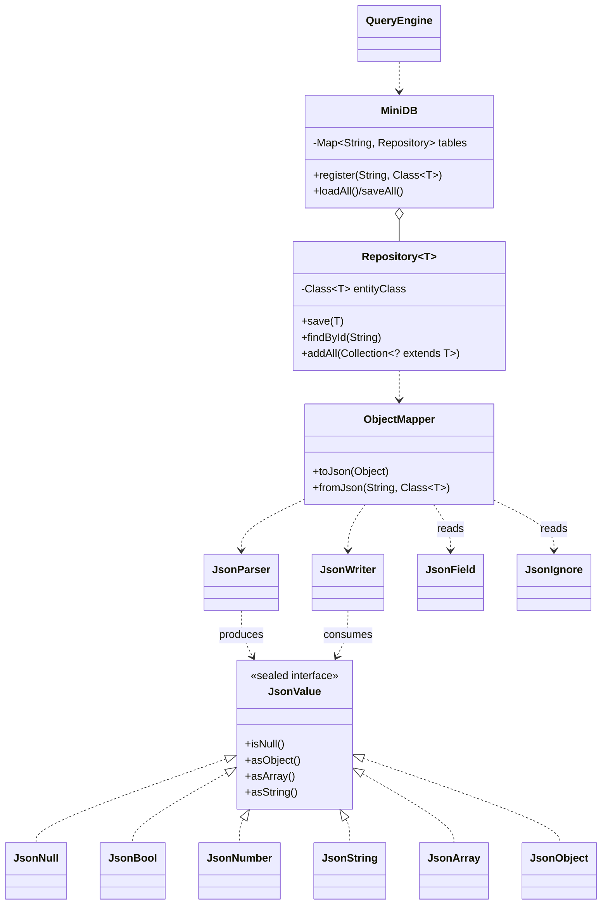

# 第四章：Java JSON 与内存数据库

本章是综合案例的**第四关·现代 Java 大考**——从 [03.校园身份预约](https://blog.csdn.net/m0_37700275/article/details/103627302) 的"`fromCsv` 一字段一字段 set" 跃迁到工业级框架基础设施：**反射 + 注解 + 泛型 + 设计模式**四件套，手写一个零依赖的 mini Jackson + mini MyBatis 雏形。

本案例做 **6 件事**：

1. **手写递归下降 JSON 解析器**：单文件 ~ 250 行，支持 6 种 JSON 类型（null/bool/number/string/array/object）+ Unicode `\uXXXX` 转义 + 行列号错误定位 —— **不用任何第三方库**。
2. **`sealed interface` + `record` 表达 JSON 类型代数**：JDK 17 最重要的语言特性组合，配合 `switch` 模式匹配实现"穷尽性检查"。
3. **自定义注解 `@JsonField` 自动映射**：`@JsonField(name = "user_name")` 让字段映射到不同 JSON key，`@JsonField(required = true)` 强制非空 —— 这就是 Jackson / Gson / FastJSON 的核心机制。
4. **反射 `ObjectMapper` 突破类型擦除**：`Field.getGenericType()` + `ParameterizedType.getActualTypeArguments()` 让 `List<Student>` 反序列化时**真的还原成 `List<Student>`** 而不是 `List<Map>`。
5. **泛型仓储 `Repository<T>` + 通配符 `? extends T`**：演示如何让一个类持有 T 的 Class、绕过 `new T[]` 限制、用 PECS 原则设计 API。
6. **MiniDB 内存数据库 + REPL CLI**：动态注册多种实体表、扫描 `data/` 目录批量加载、简易 `SELECT WHERE` 查询语法 —— 像 SQLite 一样的玩具数据库。

**学习方式**：本案例是综合案例里**第一道框架级硬菜**，按"灵魂三问 → 写最小骨架 → 故意造 BUG → 修复升级 → 阶段小结"循环。共 9 个阶段、约 12 小时，建议**分 3-4 天**完成（第 1 天 §02-§04 解析器、第 2 天 §05-§07 反射映射、第 3 天 §08-§09 数据库 + REPL）。**全程边读边敲，千万别复制粘贴**——本案例代码量大但每一行都有教学价值。

---

## 渐进学习节奏

先读这段，再开始敲代码！本案例**严格按真实工程师的开发节奏推进**：

```text
阶段 ① JsonValue 类型表达（§03）· 45 min
   └ Step 1.0: 🤔 灵魂三问 #1（JSON 6 种类型用什么 Java 类型？）
   └ Step 1.1: sealed interface JsonValue + 6 个 record 实现
   └ Step 1.2: JsonObject 用 LinkedHashMap 保留字段顺序
   └ Step 1.3: asString / asInt / asObject 类型守卫

阶段 ② JsonException 异常体系（§04）· 30 min
   └ Step 2.1: JsonException 基类 + 3 个派生
   └ Step 2.2: 解析异常带 line / column 行列号

阶段 ③ JsonParser 递归下降（§05）· 120 min  【全案例最高峰⭐⭐】
   └ Step 3.0: 🤔 灵魂三问 #2（为什么不用 split？为什么递归下降？）
   └ Step 3.1: 单字段 src + pos + line + column
   └ Step 3.2: peek / next / skipWhitespace 工具方法
   └ Step 3.3: parseValue 路由派发
   └ Step 3.4: parseString 处理 \n \t \" \\ \uXXXX 转义
   └ Step 3.5: parseNumber 长整型优先策略
   └ Step 3.6: parseObject / parseArray 递归调用
   └ Step 3.7: ⚠️ 造 BUG #1（不处理 \u → 中文乱码）
   └ Step 3.8: 修复（4 位 hex 解析）

阶段 ④ JsonWriter 序列化（§06）· 60 min
   └ Step 4.0: 🤔 灵魂三问 #3（pretty print？StringBuilder 复用？）
   └ Step 4.1: write 入口 + 6 个 writeXxx
   └ Step 4.2: indent 计数 + 缩进
   └ Step 4.3: round-trip 测试

阶段 ⑤ 自定义注解 @JsonField（§07）· 45 min
   └ Step 5.0: 🤔 灵魂三问 #4（@Retention 不写 RUNTIME 会怎样？）
   └ Step 5.1: @interface JsonField + name / required / format
   └ Step 5.2: @JsonIgnore 标记跳过

阶段 ⑥ ObjectMapper 反射映射器（§08）· 120 min  【框架雏形⭐⭐】
   └ Step 6.0: 🤔 灵魂三问 #5（setAccessible 必要性？泛型还原？）
   └ Step 6.1: toJson 反射读字段
   └ Step 6.2: fromJson 反射写字段
   └ Step 6.3: 处理基本类型 / 包装类 / String / Enum / Date
   └ Step 6.4: 处理 List<T> / Map<K,V> 泛型集合
   └ Step 6.5: ⚠️ 造 BUG #2（用 Class<?> → List<Student> 变 List<Map>）
   └ Step 6.6: 修复（Field.getGenericType() + ParameterizedType）
   └ Step 6.7: 嵌套对象 + 循环引用检测

阶段 ⑦ Repository<T> 泛型仓储（§09）· 45 min
   └ Step 7.0: 🤔 灵魂三问 #6（如何绕过类型擦除？new T[] 为何禁止？）
   └ Step 7.1: Repository<T> 持有 Class<T> entityClass
   └ Step 7.2: 4 个 CRUD + 通配符 ? extends T 演示

阶段 ⑧ MiniDB 内存数据库（§10）· 60 min
   └ Step 8.1: register 动态注册表
   └ Step 8.2: 启动批量加载 data/*.json
   └ Step 8.3: ⚠️ 造 BUG #3（required 字段缺失 → NPE）
   └ Step 8.4: 修复（@JsonField(required=true) + 行列号报错）

阶段 ⑨ REPL 查询界面（§11）· 45 min
   └ Step 9.1: SELECT entity WHERE field op value 简易语法
   └ Step 9.2: 5 个内置命令端到端跑通
```

🎯 **每个 Step 必须做的三件事**：

> 1. **看 🎯 阶段目标卡片**：明确做什么、不做什么、验收标准
> 2. **写一小段代码就编译运行一次**（看到 ✏️ 标志立刻动手）
> 3. **看到预期输出再写下一个 Step**（绝不一口气抄完整段代码）

> 🎯 **本案例的 6 处"灵魂三问"**（动手前先想清楚）：
> - **§03 JsonValue 前**：JSON 6 种类型用什么 Java 类型？为什么要 `JsonValue` 而不是直接 `Object`？类型擦除会带来什么问题？
> - **§05 解析器前**【🔥 高峰】：为什么不用 `String.split`？为什么用递归下降？解析器和 lex/yacc 工具有什么区别？
> - **§06 序列化前**：是否要支持 pretty print？字符串特殊字符如何转义回去？为什么要复用 StringBuilder？
> - **§07 注解前**：注解为什么需要 `@Retention(RUNTIME)`？`@Target(FIELD)` 不写会怎样？注解能实现"魔法"的原理是什么？
> - **§08 反射前**【🔥 高峰】：为什么 `setAccessible(true)` 是必要的（封装哲学）？泛型 List 字段如何还原元素类型？为什么需要无参构造方法？
> - **§09 泛型仓储前**：泛型类如何持有 T 的 Class（绕过类型擦除）？为什么 `new T[size]` 不允许？通配符上下界什么场景用？

> ⚠️ **本案例的 3 处"陷阱预警"**（亲眼看一次记一辈子）：
> - **§05 Unicode 转义 BUG**：JSON 里的 `"\\u4f60\\u597d"` 不处理 → 解析出来全是反斜杠 + u + hex，中文丢失
> - **§08 类型擦除真实代价**：用 `Class<?>` 而非 `ParameterizedType` → `List<Student>` 反序列化变成 `List<HashMap>`，下游 ClassCastException
> - **§10 必填字段缺失 BUG**：JSON 缺 `name` 字段 → 反序列化得到 null Student → 下游 NPE，但报错位置完全找不到

---

## 案例元信息

| 项目 | 说明 |
|------|------|
| 难度 | ★★★★☆（全书第二难，仅次于 06 KV 引擎）|
| 预估时长 | 12 小时（建议分 3-4 天）|
| 前置章节 | 入门第 10 章 异常 / 第 11 章 集合 / 第 12 章 IO 流 / 第 14 章 泛型 / 第 15 章 注解反射 |
| 覆盖知识点 | `sealed interface` / `record` / 模式匹配 switch / 自定义 `@interface` / `@Retention` / `@Target` / `Class<T>` / `Field` / `Method` / `setAccessible` / `getGenericType` / `ParameterizedType` / 泛型类 / 泛型方法 / 通配符 PECS / 类型擦除 / `IdentityHashMap` 循环引用 / 递归下降解析器 / 行列号错误定位 |
| 设计亮点 | **零第三方依赖**手写 mini Jackson + mini MyBatis 雏形 / **sealed + record + switch 模式匹配三件套** / **反射突破类型擦除** |
| ⚠ 已知局限 | 单机内存版，未做 B+ 树索引（留给 06 案例）/ 反射性能未优化（生产可用 MethodHandle / LambdaMetafactory）/ 不支持 JSON5 / 不支持流式解析（大文件全加载内存）|
| 最终产物 | 5 包 Java 项目（~ 1500 行）+ 多个示例 JSON 文件 |
| JDK 版本 | JDK 17（必须 17+，因 sealed interface）|

### 项目结构

```text
mini-json-db/
└── src/
    └── com/
        └── minijson/
            ├── json/                 # JSON AST + 解析 + 序列化
            │   ├── JsonValue.java    # sealed interface
            │   ├── JsonNull.java     # record（也可放 JsonValue 内）
            │   ├── JsonBool.java     # record
            │   ├── JsonNumber.java   # record
            │   ├── JsonString.java   # record
            │   ├── JsonArray.java    # record（含 List<JsonValue>）
            │   ├── JsonObject.java   # record（含 LinkedHashMap<String, JsonValue>）
            │   ├── JsonParser.java   # 递归下降解析器
            │   └── JsonWriter.java   # 序列化（pretty / compact）
            ├── exception/            # 异常体系
            │   ├── JsonException.java
            │   ├── JsonParseException.java   # 含 line / column
            │   ├── JsonTypeException.java
            │   └── JsonKeyMissingException.java
            ├── annotation/           # 注解
            │   ├── JsonField.java    # @interface
            │   └── JsonIgnore.java
            ├── mapper/               # 反射映射框架
            │   └── ObjectMapper.java # mini Jackson 雏形
            ├── db/                   # 数据库层
            │   ├── Repository.java   # 泛型仓储
            │   └── MiniDB.java
            ├── entity/               # 演示实体
            │   ├── Student.java
            │   └── Course.java
            └── cli/
                └── Main.java         # REPL 入口
```

### 编译运行命令

```bash
cd mini-json-db
javac -d out -encoding UTF-8 --release 17 $(find src -name "*.java")
java  -cp out com.minijson.cli.Main
```

> 📌 **build.sh 一键脚本**：
>
> ```bash
> #!/bin/bash
> rm -rf out && mkdir out
> javac -d out -encoding UTF-8 --release 17 $(find src -name "*.java") \
>   && echo "✅ 编译成功" \
>   && java -cp out com.minijson.cli.Main
> ```

---

## 目录快速导航

> 点击以下条目即可跳转到对应节。【🔑 重点节】推荐优先阅读。

- [渐进学习节奏](#渐进学习节奏) 【🔑 必读】
- [案例元信息](#案例元信息)
- [01.项目需求和功能](#01项目需求和功能)
  - [1.1 需求介绍](#11-需求介绍)
  - [1.2 功能要求](#12-功能要求)
  - [1.3 设计思路](#13-设计思路)
  - [1.4 涉及知识点](#14-涉及知识点)
- [02.项目骨架与包初始化](#02项目骨架与包初始化)
- [03.JsonValue 类型表达](#03jsonvalue-类型表达) 【阶段①】
  - [3.0 灵魂三问 1](#30-灵魂三问-1) 【🤔】
  - [3.1 sealed interface 6 种类型](#31-sealed-interface-6-种类型)
  - [3.2 类型守卫与转换](#32-类型守卫与转换)
- [04.JsonException 异常体系](#04jsonexception-异常体系) 【阶段②】
  - [4.1 4 个异常类](#41-4-个异常类)
  - [4.2 行列号定位](#42-行列号定位)
- [05.JsonParser 递归下降](#05jsonparser-递归下降) 【阶段③高峰⭐⭐】
  - [5.0 灵魂三问 2](#50-灵魂三问-2) 【🤔🔥】
  - [5.1 解析器骨架与游标](#51-解析器骨架与游标)
  - [5.2 parseValue 路由派发](#52-parsevalue-路由派发)
  - [5.3 parseString 转义处理](#53-parsestring-转义处理)
  - [5.4 parseNumber 长整型优先](#54-parsenumber-长整型优先)
  - [5.5 parseObject parseArray 递归](#55-parseobject-parsearray-递归)
  - [5.6 Unicode 转义 BUG 修复](#56-unicode-转义-bug-修复) 【⚠️ 造 BUG】
- [06.JsonWriter 序列化](#06jsonwriter-序列化) 【阶段④】
  - [6.0 灵魂三问 3](#60-灵魂三问-3) 【🤔】
  - [6.1 6 种类型 writeXxx](#61-6-种类型-writexxx)
  - [6.2 pretty print 缩进](#62-pretty-print-缩进)
  - [6.3 round-trip 验证](#63-round-trip-验证)
- [07.自定义注解 @JsonField](#07自定义注解-jsonfield) 【阶段⑤】
  - [7.0 灵魂三问 4](#70-灵魂三问-4) 【🤔】
  - [7.1 @JsonField 三参数](#71-jsonfield-三参数)
  - [7.2 @JsonIgnore](#72-jsonignore)
- [08.ObjectMapper 反射映射器](#08objectmapper-反射映射器) 【阶段⑥框架雏形⭐⭐】
  - [8.0 灵魂三问 5](#80-灵魂三问-5) 【🤔🔥】
  - [8.1 toJson 反射读字段](#81-tojson-反射读字段)
  - [8.2 fromJson 反射写字段](#82-fromjson-反射写字段)
  - [8.3 类型擦除 BUG 修复](#83-类型擦除-bug-修复) 【⚠️ 造 BUG】
  - [8.4 嵌套对象与循环引用](#84-嵌套对象与循环引用)
- [09.Repository 泛型仓储](#09repository-泛型仓储) 【阶段⑦】
  - [9.0 灵魂三问 6](#90-灵魂三问-6) 【🤔】
  - [9.1 持有 Class T 字段](#91-持有-class-t-字段)
  - [9.2 通配符 PECS 演示](#92-通配符-pecs-演示)
- [10.MiniDB 内存数据库](#10minidb-内存数据库) 【阶段⑧】
  - [10.1 register 动态注册](#101-register-动态注册)
  - [10.2 启动批量加载](#102-启动批量加载)
  - [10.3 必填字段缺失 BUG](#103-必填字段缺失-bug) 【⚠️ 造 BUG】
- [11.REPL 查询界面](#11repl-查询界面) 【阶段⑨】
  - [11.1 SELECT WHERE 简易语法](#111-select-where-简易语法)
  - [11.2 5 个内置命令](#112-5-个内置命令)
- [12.项目总结分析](#12项目总结分析)
- [13.项目技术思考](#13项目技术思考)
  - [13.1 反射性能与替代方案](#131-反射性能与替代方案)
  - [13.2 类型擦除决策树](#132-类型擦除决策树)
  - [13.3 卷一章节回扣表](#133-卷一章节回扣表)
- [14.衔接与延伸](#14衔接与延伸)

---

## 01.项目需求和功能

### 1.1 需求介绍

工业级 Java 应用几乎都依赖 Jackson / Gson / FastJSON 等 JSON 库。这些库底层只用了 **JDK 自带的反射 + 注解 + 泛型** 三件套——本章用 **1500 行纯 JDK 代码** 还原它们的核心机制，让你**真正理解"框架"是怎么写的**，而不是把它们当黑盒。

**和真实开源框架的对应关系**：

| 真实框架机制 | 本案例对应 |
|---|---|
| Jackson `ObjectMapper.readValue` | 本案例 `ObjectMapper.fromJson` |
| Jackson `@JsonProperty("user_name")` | 本案例 `@JsonField(name = "user_name")` |
| Jackson 处理 `List<Student>` | 本案例 `ParameterizedType.getActualTypeArguments()` |
| MyBatis `Mapper<T>` 泛型仓储 | 本案例 `Repository<T>` |
| Spring 启动扫描 + 注入 | 本案例 `MiniDB.register(name, Class<T>)` |
| SQLite REPL 查询 | 本案例 `SELECT student WHERE age > 18` |

### 1.2 功能要求

**核心 12 项功能**：

**JSON 解析/序列化**：
1. 解析任意嵌套 JSON 字符串 → `JsonValue` AST
2. AST 序列化回 JSON 字符串（compact / pretty 两种模式）
3. round-trip 完整保真（解析后再序列化结果等价）

**对象映射**：
4. POJO → JSON：`mapper.toJson(student)` 返回 JSON 字符串
5. JSON → POJO：`mapper.fromJson(json, Student.class)` 还原对象
6. 注解驱动字段名映射（`@JsonField(name = "user_name")`）
7. `@JsonField(required = true)` 必填校验
8. `@JsonIgnore` 跳过字段
9. 嵌套对象 + 集合 + Map 自动还原

**数据库**：
10. 多种实体表动态注册
11. 启动加载 + 关闭保存
12. REPL 查询：`SELECT student WHERE age > 18`

### 1.3 设计思路

**关键决策一：用 `sealed interface + record` 表达 JSON 类型代数**

❌ **传统继承层次**：

```java
abstract class JsonValue {}
class JsonNull   extends JsonValue {}
class JsonBool   extends JsonValue { boolean v; }
class JsonNumber extends JsonValue { double v; }
// ...
// 处理：
if (v instanceof JsonNull)      { ... }
else if (v instanceof JsonBool) { ... }
else { /* 不知道还有没有其他子类，只能给个 default */ }
```

**问题**：

1. **不知道有几个子类**：编译器无法穷尽性检查
2. **加新子类原有 if 链不报错**：忘改一处就 BUG

✅ **sealed interface + 模式匹配**：

```java
sealed interface JsonValue permits JsonNull, JsonBool, JsonNumber,
                                   JsonString, JsonArray, JsonObject {}

record JsonNull() implements JsonValue {}
record JsonBool(boolean value) implements JsonValue {}
// ...

// 处理（编译器强制穷尽 6 个分支）：
String r = switch (v) {
    case JsonNull n      -> "null";
    case JsonBool b      -> String.valueOf(b.value());
    case JsonNumber n    -> String.valueOf(n.value());
    case JsonString s    -> "\"" + s.value() + "\"";
    case JsonArray a     -> writeArray(a);
    case JsonObject o    -> writeObject(o);
    // ⭐ 不需要 default，编译器知道 sealed 子类已穷尽；漏一个直接编译失败
};
```

**好处**：

- **穷尽性检查**：编译器把"以后加新子类"的风险硬性挡住
- **零样板**：record 自动生成 getter / equals / hashCode / toString
- **不可变**：record 字段隐式 final，符合 JSON AST 不可变语义

**关键决策二：递归下降解析器，不依赖任何第三方**

JSON 文法是上下文无关、左递归友好的，**递归下降解析器**是最自然的实现：

```text
parseValue   → parseObject | parseArray | parseString | parseNumber | parseBool | parseNull
parseObject  → "{" (parseString ":" parseValue ("," parseString ":" parseValue)*)? "}"
parseArray   → "[" (parseValue ("," parseValue)*)? "]"
```

**核心思想**：每个文法规则对应一个 Java 方法，方法之间互相调用 = 递归下降。

**关键决策三：反射 `ParameterizedType` 突破类型擦除**

类型擦除是 Java 泛型的"原罪"——`List<Student>` 在运行时只是 `List`。但**字段声明的泛型信息**保留在 `Field.getGenericType()` 里：

```java
class Course {
    List<Student> students;
}

Field f = Course.class.getDeclaredField("students");
Type t = f.getGenericType();                          // ParameterizedType: List<Student>
ParameterizedType pt = (ParameterizedType) t;
Type elementType = pt.getActualTypeArguments()[0];    // Student.class ⭐
```

**这就是 Jackson 的核心魔法**——本案例 §08.3 完整复现。

### 1.4 涉及知识点

| 入门章节 | 知识点 | 在本案例的位置 |
|---|---|---|
| 第 9 章 接口与抽象 | sealed interface（JDK 17）| §03 JsonValue |
| 第 9 章 | record（JDK 16）| §03 6 个 record |
| 第 9 章 | switch 模式匹配（JDK 21）| §06 writeValue |
| 第 10 章 异常 | 自定义异常 + 异常链 | §04 JsonException |
| 第 11 章 集合 | LinkedHashMap 保留顺序 | §03 JsonObject |
| 第 11 章 | IdentityHashMap | §08 循环引用检测 |
| 第 12 章 IO 流 | Files.readString / writeString | §10 MiniDB |
| 第 14 章 泛型 | 泛型类 / 泛型方法 / 通配符 PECS | §09 Repository<T> |
| 第 14 章 | 类型擦除 | §08 ObjectMapper（突破擦除）|
| 第 15 章 注解 | `@interface` / @Retention / @Target | §07 @JsonField |
| 第 15 章 反射 | `Class<T>` / Field / setAccessible / getGenericType | §08 ObjectMapper |
| 第 15 章 | `Method.invoke` | §11 REPL 查询 |
| 第 15 章 | `ParameterizedType` | §08 还原泛型集合 |

---

## 02.项目骨架与包初始化

```text
┌─ 🎯 阶段 ⓪ 目标 ────────────────────────────────────────┐
│ 完成什么：建好 7 个包目录 + 跑通 Hello World            │
│ 不做什么：不写任何业务（全部待实现）                      │
│ 验收标准：javac --release 17 通过                         │
│ 预计耗时：10 分钟                                        │
└─────────────────────────────────────────────────────────┘
```

```bash
mkdir -p mini-json-db/src/com/minijson/{json,exception,annotation,mapper,db,entity,cli}
cd mini-json-db
```

新建 `src/com/minijson/cli/Main.java`：

```java
package com.minijson.cli;

public class Main {
    public static void main(String[] args) {
        System.out.println("Mini JSON DB 启动 (JDK " + Runtime.version() + ")");
    }
}
```

✏️ **立刻验证 JDK 17**：

```bash
javac --release 17 -d out -encoding UTF-8 $(find src -name "*.java")
java  -cp out com.minijson.cli.Main
# 预期输出：Mini JSON DB 启动 (JDK 17.x.x)
```

> ⚠️ **JDK 版本检查**：如果你的 `java -version` 显示低于 17，sealed interface 编译会报错。本案例**必须 JDK 17+**。

---

## 03.JsonValue 类型表达

```text
┌─ 🎯 阶段 ① 目标 ────────────────────────────────────────┐
│ 完成什么：sealed interface JsonValue + 6 个 record       │
│ 不做什么：不写解析器（阶段③）                            │
│ 验收标准：main 里手动构造 AST + toString 打印             │
│ 预计耗时：45 分钟                                        │
└─────────────────────────────────────────────────────────┘
```

### 3.0 灵魂三问 1

🎯 **Step 1.0**：动手前先想清楚 JSON 类型表达的设计选择。

❓ **问题一：JSON 6 种类型用什么 Java 类型表示？**

JSON 标准类型 → Java 自然映射：

| JSON 类型 | Java 表示 | 选型理由 |
|---|---|---|
| null | `JsonNull`（空 record）| 比 Java null 更明确语义（区分"字段不存在" vs "字段值为 null"）|
| true/false | `JsonBool(boolean)` | 一个 boolean 字段就够 |
| 数字 | `JsonNumber(double)` 或 `(long)` | **难点**：JS 不分整数/浮点，Java 区分 |
| 字符串 | `JsonString(String)` | 平凡 |
| 数组 | `JsonArray(List<JsonValue>)` | ArrayList 内部 |
| 对象 | `JsonObject(LinkedHashMap<String, JsonValue>)` | LinkedHashMap 保留字段顺序 |

❓ **问题二：为什么要 `JsonValue` 而不是直接 `Object`？**

❌ **用 `Object`**：

```java
Map<String, Object> json = new HashMap<>();
json.put("name", "Tom");
json.put("age", 18);
json.put("scores", List.of(90, 85));

// 取值时：
Object x = json.get("scores");
List<?> scores = (List<?>) x;        // 强转
// scores.get(0) 是什么？Object，得再强转
```

**问题**：

1. **类型不安全**：到处 `(List<?>)` `(Integer)` 强转，运行时才报错
2. **没有共同方法**：想给"所有 JSON 值"加 `prettyPrint()`，没法挂在 Object 上
3. **switch 不能穷尽**：因为 Object 有无数子类

✅ **用 `JsonValue` 封闭接口**：

```java
JsonValue v = parser.parse(...);
String r = switch (v) {
    case JsonString s -> s.value();
    case JsonArray a  -> a.items().toString();
    // 编译器强制写完 6 种
};
```

**好处**：类型安全 + 模式匹配穷尽 + 公共方法挂在接口上。

❓ **问题三：类型擦除会带来什么问题？**

```java
record JsonArray(List<JsonValue> items) implements JsonValue {}
```

运行时 `JsonArray` 里的 `items` 只是 `List`，**不知道里面是 `JsonValue`** —— 这就是擦除。

**但本案例不受影响**，因为：

- 我们的 `JsonArray.items` 是**自己写的字段声明**，泛型信息留在 `Field.getGenericType()` 里
- `ObjectMapper` 处理用户 POJO 时（如 `Course.students: List<Student>`），同样能拿到泛型信息

🔑 **三问连起来**：sealed interface + record + LinkedHashMap = JSON AST 的最佳 Java 表达。

### 3.1 sealed interface 6 种类型

🎯 **Step 1.1**：新建 `src/com/minijson/json/JsonValue.java`：

```java
package com.minijson.json;

/**
 * JSON 6 种类型的封闭代数：JDK 17+ sealed interface
 * 编译器强制穷尽：增加新子类不在 permits 列表中无法编译。
 */
public sealed interface JsonValue
        permits JsonNull, JsonBool, JsonNumber, JsonString, JsonArray, JsonObject {

    /** 是否为 null（JSON 语义，非 Java null）*/
    default boolean isNull() { return this instanceof JsonNull; }
}
```

`src/com/minijson/json/JsonNull.java`：

```java
package com.minijson.json;

public record JsonNull() implements JsonValue {
    private static final JsonNull INSTANCE = new JsonNull();
    public static JsonNull instance() { return INSTANCE; }   // 单例化（同一对象复用）
    @Override public String toString() { return "null"; }
}
```

`src/com/minijson/json/JsonBool.java`：

```java
package com.minijson.json;

public record JsonBool(boolean value) implements JsonValue {
    public static final JsonBool TRUE  = new JsonBool(true);
    public static final JsonBool FALSE = new JsonBool(false);
    public static JsonBool of(boolean b) { return b ? TRUE : FALSE; }
    @Override public String toString() { return String.valueOf(value); }
}
```

`src/com/minijson/json/JsonNumber.java`：

```java
package com.minijson.json;

/**
 * JSON 数字。同时承载整数和浮点：
 *   • 整数走 longValue（精确 64 位）
 *   • 浮点走 doubleValue（IEEE 754 双精度）
 * isInteger 标记区分两者。
 */
public record JsonNumber(long longValue, double doubleValue, boolean isInteger)
        implements JsonValue {

    public static JsonNumber ofLong(long v) {
        return new JsonNumber(v, v, true);
    }
    public static JsonNumber ofDouble(double v) {
        return new JsonNumber(0L, v, false);
    }

    public int asInt()       { return isInteger ? (int) longValue : (int) doubleValue; }
    public long asLong()     { return isInteger ? longValue : (long) doubleValue; }
    public double asDouble() { return isInteger ? longValue : doubleValue; }

    @Override
    public String toString() {
        return isInteger ? String.valueOf(longValue) : String.valueOf(doubleValue);
    }
}
```

`src/com/minijson/json/JsonString.java`：

```java
package com.minijson.json;
import java.util.Objects;

public record JsonString(String value) implements JsonValue {
    public JsonString {                                   // 紧凑构造：校验
        Objects.requireNonNull(value, "JsonString.value 不能为 null");
    }
    @Override public String toString() { return "\"" + value + "\""; }
}
```

`src/com/minijson/json/JsonArray.java`：

```java
package com.minijson.json;
import java.util.ArrayList;
import java.util.Collections;
import java.util.List;

public record JsonArray(List<JsonValue> items) implements JsonValue {
    public JsonArray {                                    // 紧凑构造
        items = List.copyOf(items);                       // ⭐ 防御性拷贝 + 不可变
    }
    public static JsonArray empty() { return new JsonArray(Collections.emptyList()); }
    public static JsonArray of(JsonValue... vs) {
        return new JsonArray(new ArrayList<>(List.of(vs)));
    }
    public int size() { return items.size(); }
    public JsonValue get(int i) { return items.get(i); }
}
```

`src/com/minijson/json/JsonObject.java`：

```java
package com.minijson.json;
import java.util.*;

public record JsonObject(Map<String, JsonValue> fields) implements JsonValue {

    public JsonObject {                                   // 紧凑构造
        // ⭐ 防御性拷贝 + 保留插入顺序
        fields = Collections.unmodifiableMap(new LinkedHashMap<>(fields));
    }

    public static JsonObject empty() { return new JsonObject(new LinkedHashMap<>()); }

    /** 流式构建器（链式 add 风格）*/
    public static Builder builder() { return new Builder(); }

    public static class Builder {
        private final LinkedHashMap<String, JsonValue> map = new LinkedHashMap<>();
        public Builder add(String key, JsonValue v)   { map.put(key, v); return this; }
        public Builder add(String key, String v)      { return add(key, new JsonString(v)); }
        public Builder add(String key, long v)        { return add(key, JsonNumber.ofLong(v)); }
        public Builder add(String key, double v)      { return add(key, JsonNumber.ofDouble(v)); }
        public Builder add(String key, boolean v)     { return add(key, JsonBool.of(v)); }
        public JsonObject build()                     { return new JsonObject(map); }
    }

    public boolean has(String key)        { return fields.containsKey(key); }
    public JsonValue get(String key)      { return fields.get(key); }
    public Set<String> keys()             { return fields.keySet(); }
}
```

> 💡 **record 紧凑构造方法**：`public JsonString { ... }`（没有参数列表的构造）—— 是 record 特有的语法糖，在自动生成的赋值之前执行校验/转换。**这是 record 用来"嵌入业务约束"的标准技巧**。

### 3.2 类型守卫与转换

🎯 **Step 1.2**：在 `JsonValue.java` 加上"类型守卫"工具方法（可选，便于业务调用）：

```java
public sealed interface JsonValue
        permits JsonNull, JsonBool, JsonNumber, JsonString, JsonArray, JsonObject {

    default boolean isNull() { return this instanceof JsonNull; }

    default JsonObject asObject() {
        if (this instanceof JsonObject o) return o;
        throw new com.minijson.exception.JsonTypeException("JsonObject", this.getClass().getSimpleName());
    }
    default JsonArray asArray() {
        if (this instanceof JsonArray a) return a;
        throw new com.minijson.exception.JsonTypeException("JsonArray", this.getClass().getSimpleName());
    }
    default String asString() {
        if (this instanceof JsonString s) return s.value();
        throw new com.minijson.exception.JsonTypeException("JsonString", this.getClass().getSimpleName());
    }
    default long asLong() {
        if (this instanceof JsonNumber n) return n.asLong();
        throw new com.minijson.exception.JsonTypeException("JsonNumber", this.getClass().getSimpleName());
    }
    default double asDouble() {
        if (this instanceof JsonNumber n) return n.asDouble();
        throw new com.minijson.exception.JsonTypeException("JsonNumber", this.getClass().getSimpleName());
    }
    default boolean asBool() {
        if (this instanceof JsonBool b) return b.value();
        throw new com.minijson.exception.JsonTypeException("JsonBool", this.getClass().getSimpleName());
    }
}
```

> **注意**：这里依赖 `JsonTypeException`（下一阶段写）。如果先编译报错，可以暂时注释掉守卫方法，或先跳到 §04 写完异常类再回来。

✏️ **测试** —— 修改 `Main.java`：

```java
package com.minijson.cli;

import com.minijson.json.*;

public class Main {
    public static void main(String[] args) {
        // 手动构建 AST：{"name":"Tom","age":18,"scores":[90,85,77]}
        JsonObject obj = JsonObject.builder()
                .add("name",   "Tom")
                .add("age",    18L)
                .add("scores", JsonArray.of(
                        JsonNumber.ofLong(90),
                        JsonNumber.ofLong(85),
                        JsonNumber.ofLong(77)))
                .build();

        System.out.println("name = " + obj.get("name").asString());
        System.out.println("age  = " + obj.get("age").asLong());
        System.out.println("score[0] = " + obj.get("scores").asArray().get(0).asLong());
    }
}
```

预期输出：

```text
name = Tom
age  = 18
score[0] = 90
```

```text
┌─ 📌 阶段 ① 小结 ────────────────────────────────────────┐
│ ✅ sealed interface + 6 个 record + 类型守卫              │
│ 🔑 紧凑构造 / 防御性拷贝 / LinkedHashMap 保留顺序         │
│ 📌 git commit -m "stage1: JsonValue ADT"                  │
└─────────────────────────────────────────────────────────┘
```

---

## 04.JsonException 异常体系

```text
┌─ 🎯 阶段 ② 目标 ────────────────────────────────────────┐
│ 完成什么：4 个异常类（基类 + 3 派生）                      │
│ 不做什么：不写解析器（阶段③）                              │
│ 验收标准：异常带行列号 / 期望-实际类型 / 缺失 key          │
│ 预计耗时：30 分钟                                          │
└─────────────────────────────────────────────────────────┘
```

### 4.1 4 个异常类

🎯 **Step 2.1**：

`src/com/minijson/exception/JsonException.java`：

```java
package com.minijson.exception;

/** JSON 体系所有异常的根 */
public class JsonException extends RuntimeException {
    public JsonException(String msg)               { super(msg); }
    public JsonException(String msg, Throwable t)  { super(msg, t); }
}
```

`src/com/minijson/exception/JsonParseException.java`：

```java
package com.minijson.exception;

/** 语法解析错误：携带行列号方便定位 */
public class JsonParseException extends JsonException {
    private final int line;
    private final int column;

    public JsonParseException(String msg, int line, int column) {
        super(String.format("解析错误 [行 %d, 列 %d]: %s", line, column, msg));
        this.line = line;
        this.column = column;
    }
    public int getLine()   { return line; }
    public int getColumn() { return column; }
}
```

`src/com/minijson/exception/JsonTypeException.java`：

```java
package com.minijson.exception;

/** 类型不匹配（期望 X 实际 Y）*/
public class JsonTypeException extends JsonException {
    private final String expected;
    private final String actual;

    public JsonTypeException(String expected, String actual) {
        super(String.format("类型不匹配：期望 %s，实际 %s", expected, actual));
        this.expected = expected;
        this.actual = actual;
    }
    public String getExpected() { return expected; }
    public String getActual()   { return actual; }
}
```

`src/com/minijson/exception/JsonKeyMissingException.java`：

```java
package com.minijson.exception;

/** 必填字段缺失 */
public class JsonKeyMissingException extends JsonException {
    private final String key;
    public JsonKeyMissingException(String key) {
        super("必填 JSON 字段缺失：" + key);
        this.key = key;
    }
    public String getKey() { return key; }
}
```

### 4.2 行列号定位

为什么解析异常要带行列号？因为**错误信息能直接告诉用户哪行哪列写错了**，比"语法错误"友好 100 倍：

❌ 没有行列号：

```text
解析错误：unexpected character
```

✅ 有行列号：

```text
解析错误 [行 17, 列 23]: 期望 ',' 或 '}'，实际 ':'
```

> 🔑 **生产级解析器都会带行列号** —— 编译器报错、Jackson 报错、SQL 报错都遵循这一规范。

```text
┌─ 📌 阶段 ② 小结 ────────────────────────────────────────┐
│ ✅ 4 个异常类 + 行列号定位                                 │
│ 🔑 RuntimeException 体系 + 业务字段（line/column/key）    │
│ 📌 git commit -m "stage2: exception hierarchy"            │
└─────────────────────────────────────────────────────────┘
```

---

## 05.JsonParser 递归下降

```text
┌─ 🎯 阶段 ③ 目标【全案例最高峰⭐⭐】 ────────────────────┐
│ 完成什么：递归下降解析器（~250 行单文件）                  │
│ 不做什么：不写序列化（阶段④）                              │
│ 验收标准：能解析任意嵌套 JSON 字符串到 JsonValue AST       │
│ 预计耗时：120 分钟（建议留足 2 小时不被打断）               │
└─────────────────────────────────────────────────────────┘
```

### 5.0 灵魂三问 2

🎯 **Step 3.0**：

❓ **问题一：为什么不用 `String.split(",")`？**

来看反例：

```java
String json = "{\"name\":\"Tom, Jr\", \"tags\":[\"a,b\", \"c\"]}";
String[] parts = json.split(",");
// 错位结果：
//   {"name":"Tom
//    Jr"
//    "tags":["a
//    b"
//    "c"]}
```

**问题**：

1. **字段含逗号** → split 切碎
2. **嵌套数组** → 内层逗号被外层错切
3. **字符串里的特殊字符**（`\"`、`\\`、`\n`）需要状态跟踪

✅ **正解**：必须**逐字符扫描 + 维护"当前是否在字符串/对象/数组内"的状态机**——这就是解析器要做的事。

❓ **问题二：为什么用递归下降？**

JSON 文法是**上下文无关 + 左递归友好**的，结构如下：

```text
value     := object | array | string | number | "true" | "false" | "null"
object    := "{" (pair ("," pair)*)? "}"
pair      := string ":" value
array     := "[" (value ("," value)*)? "]"
string    := "\"" char* "\""
number    := -? digit+ ("." digit+)? (e digit+)?
```

每个文法规则对应一个 Java 方法：

| 文法规则 | Java 方法 |
|---|---|
| value | `parseValue()` |
| object | `parseObject()` |
| pair（隐含在 parseObject 里）| `parseObject` 内部 |
| array | `parseArray()` |
| string | `parseString()` |
| number | `parseNumber()` |

**方法之间互相调用**——`parseObject` 调 `parseValue`，`parseValue` 调 `parseObject`——**这就叫递归下降**。

❓ **问题三：解析器和 lex/yacc 工具的区别？**

| 维度 | 手写递归下降 | lex/yacc / ANTLR |
|---|---|---|
| 学习曲线 | 低（写 Java 即可）| 高（学一门 DSL）|
| 文法复杂度 | 简单文法 OK，复杂文法痛苦 | 任意复杂文法 |
| 性能 | 直接编译为 Java 字节码 | 生成代码也是字节码，差不多 |
| 错误信息 | 可定制行列号 / 期望 token | 默认信息 |
| 适用场景 | JSON / 简单 DSL | SQL / 编程语言 |

✅ **JSON 文法极简，手写递归下降是最佳选择**。FastJSON / Jackson / Gson 三大库底层都是手写递归下降。

🔑 **三问连起来**：递归下降 = 文法规则 → 方法 → 互相调用 = 工业级 JSON 解析器的标准实现。

### 5.1 解析器骨架与游标

🎯 **Step 3.1**：新建 `src/com/minijson/json/JsonParser.java`：

```java
package com.minijson.json;

import com.minijson.exception.JsonParseException;
import java.util.*;

public class JsonParser {

    private final String src;
    private int pos;            // 当前游标
    private int line;           // 当前行号（从 1 开始）
    private int column;         // 当前列号（从 1 开始）

    public JsonParser(String src) {
        this.src = Objects.requireNonNull(src, "JSON 源串不能为 null");
        this.pos = 0;
        this.line = 1;
        this.column = 1;
    }

    /** 入口：解析整个 JSON 字符串 */
    public static JsonValue parse(String src) {
        JsonParser p = new JsonParser(src);
        p.skipWhitespace();
        JsonValue v = p.parseValue();
        p.skipWhitespace();
        if (p.pos != p.src.length()) {
            throw p.error("JSON 末尾还有多余字符: '" + p.peek() + "'");
        }
        return v;
    }

    // ===== 工具方法 =====
    private char peek() {
        if (pos >= src.length()) {
            throw error("JSON 意外结束");
        }
        return src.charAt(pos);
    }

    private char next() {
        char c = peek();
        pos++;
        if (c == '\n') { line++; column = 1; } else { column++; }
        return c;
    }

    private boolean match(char expected) {
        if (pos < src.length() && src.charAt(pos) == expected) {
            next();
            return true;
        }
        return false;
    }

    private void expect(char expected) {
        if (!match(expected)) {
            throw error("期望 '" + expected + "'，实际 '" + (pos < src.length() ? src.charAt(pos) : "EOF") + "'");
        }
    }

    private void skipWhitespace() {
        while (pos < src.length()) {
            char c = src.charAt(pos);
            if (c == ' ' || c == '\t' || c == '\r' || c == '\n') next();
            else break;
        }
    }

    private JsonParseException error(String msg) {
        return new JsonParseException(msg, line, column);
    }
}
```

> 💡 **游标 + 行列同步推进**：`next()` 每读一个字符就更新行列号，`'\n'` 时换行 —— 这是错误定位的基础。

### 5.2 parseValue 路由派发

🎯 **Step 3.3**：在 `JsonParser` 类内追加：

```java
    private JsonValue parseValue() {
        skipWhitespace();
        char c = peek();
        return switch (c) {
            case '{'                  -> parseObject();
            case '['                  -> parseArray();
            case '"'                  -> parseString();
            case 't', 'f'             -> parseBool();
            case 'n'                  -> parseNull();
            case '-', '0', '1', '2', '3',
                 '4', '5', '6', '7', '8', '9' -> parseNumber();
            default -> throw error("非法 JSON 起始字符: '" + c + "'");
        };
    }

    private JsonValue parseNull() {
        if (src.regionMatches(pos, "null", 0, 4)) {
            for (int i = 0; i < 4; i++) next();
            return JsonNull.instance();
        }
        throw error("期望 'null'");
    }

    private JsonValue parseBool() {
        if (src.regionMatches(pos, "true", 0, 4)) {
            for (int i = 0; i < 4; i++) next();
            return JsonBool.TRUE;
        }
        if (src.regionMatches(pos, "false", 0, 5)) {
            for (int i = 0; i < 5; i++) next();
            return JsonBool.FALSE;
        }
        throw error("期望 'true' 或 'false'");
    }
```

> 🔑 **switch 表达式（JDK 14+）**：`->` 后是表达式，自动跳出，不会 fall-through —— 比传统 `case ... break` 安全 10 倍。

### 5.3 parseString 转义处理

🎯 **Step 3.4**：

```java
    private JsonString parseString() {
        expect('"');
        StringBuilder sb = new StringBuilder();
        while (pos < src.length()) {
            char c = next();
            if (c == '"') {
                return new JsonString(sb.toString());
            }
            if (c == '\\') {
                char esc = next();
                switch (esc) {
                    case '"'  -> sb.append('"');
                    case '\\' -> sb.append('\\');
                    case '/'  -> sb.append('/');
                    case 'b'  -> sb.append('\b');
                    case 'f'  -> sb.append('\f');
                    case 'n'  -> sb.append('\n');
                    case 'r'  -> sb.append('\r');
                    case 't'  -> sb.append('\t');
                    case 'u'  -> sb.append(parseUnicodeEscape());      // ⭐ §5.6 才补
                    default   -> throw error("非法转义字符: \\" + esc);
                }
            } else {
                sb.append(c);
            }
        }
        throw error("字符串未闭合（缺 '\"'）");
    }

    /** 解析 \uXXXX 4 位 hex（先空着，§5.6 修复 BUG 时补） */
    private char parseUnicodeEscape() {
        if (pos + 4 > src.length()) throw error("\\u 后不足 4 位 hex");
        StringBuilder hex = new StringBuilder(4);
        for (int i = 0; i < 4; i++) hex.append(next());
        try {
            return (char) Integer.parseInt(hex.toString(), 16);
        } catch (NumberFormatException e) {
            throw error("非法 \\u hex: " + hex);
        }
    }
```

### 5.4 parseNumber 长整型优先

🎯 **Step 3.5**：

```java
    private JsonNumber parseNumber() {
        int start = pos;
        if (peek() == '-') next();
        while (pos < src.length() && Character.isDigit(src.charAt(pos))) next();

        boolean isFloat = false;
        if (pos < src.length() && src.charAt(pos) == '.') {
            isFloat = true;
            next();
            while (pos < src.length() && Character.isDigit(src.charAt(pos))) next();
        }
        if (pos < src.length() && (src.charAt(pos) == 'e' || src.charAt(pos) == 'E')) {
            isFloat = true;
            next();
            if (pos < src.length() && (src.charAt(pos) == '+' || src.charAt(pos) == '-')) next();
            while (pos < src.length() && Character.isDigit(src.charAt(pos))) next();
        }

        String text = src.substring(start, pos);
        try {
            // ⭐ 优先策略：能用 long 就用 long（精确）；溢出或带小数才用 double
            return isFloat
                    ? JsonNumber.ofDouble(Double.parseDouble(text))
                    : JsonNumber.ofLong(Long.parseLong(text));
        } catch (NumberFormatException e) {
            throw error("非法数字: " + text);
        }
    }
```

> 💡 **整数 vs 浮点优先策略**：`123` 走 `long`（精确）、`123.456` 走 `double`、`1e10` 走 `double`。**这避免了 `int id = (int)(double)18` 这种丢精度坑**。

### 5.5 parseObject parseArray 递归

🎯 **Step 3.6**：

```java
    private JsonObject parseObject() {
        expect('{');
        skipWhitespace();
        LinkedHashMap<String, JsonValue> map = new LinkedHashMap<>();
        if (match('}')) return new JsonObject(map);   // 空对象

        while (true) {
            skipWhitespace();
            JsonString key = parseString();
            skipWhitespace();
            expect(':');
            JsonValue value = parseValue();           // ⭐ 递归调用
            map.put(key.value(), value);
            skipWhitespace();
            if (match(',')) continue;
            if (match('}')) break;
            throw error("期望 ',' 或 '}'，实际 '" + peek() + "'");
        }
        return new JsonObject(map);
    }

    private JsonArray parseArray() {
        expect('[');
        skipWhitespace();
        List<JsonValue> items = new ArrayList<>();
        if (match(']')) return new JsonArray(items);  // 空数组

        while (true) {
            items.add(parseValue());                  // ⭐ 递归调用
            skipWhitespace();
            if (match(',')) continue;
            if (match(']')) break;
            throw error("期望 ',' 或 ']'，实际 '" + peek() + "'");
        }
        return new JsonArray(items);
    }
}
```

✏️ **立刻测试** —— Main：

```java
String json = """
    {
      "name": "Tom",
      "age": 18,
      "scores": [90, 85, 77.5],
      "address": {"city": "Beijing", "zip": "100000"},
      "tags": null,
      "active": true
    }
    """;

JsonValue v = JsonParser.parse(json);
JsonObject obj = v.asObject();
System.out.println("name    = " + obj.get("name").asString());
System.out.println("age     = " + obj.get("age").asLong());
System.out.println("scores  = " + obj.get("scores").asArray().items());
System.out.println("zip     = " + obj.get("address").asObject().get("zip").asString());
System.out.println("isNull  = " + obj.get("tags").isNull());
System.out.println("active  = " + obj.get("active").asBool());
```

预期：

```text
name    = Tom
age     = 18
scores  = [90, 85, 77.5]
zip     = "100000"
isNull  = true
active  = true
```

### 5.6 Unicode 转义 BUG 修复

🎯 **Step 3.7**：⚠️ **造 BUG #1** —— 演示不处理 `\uXXXX` 的中文乱码。

❌ **反例**：`\u4f60\u597d` 应是"你好"，但若 parseString 里没处理 `\u`，会怎样？

假设我们把 `case 'u' -> sb.append(parseUnicodeEscape())` 注释掉，改为 `default -> sb.append('\\').append(esc)`：

```java
String json = "{\"greet\":\"\\u4f60\\u597d\"}";
JsonObject obj = JsonParser.parse(json).asObject();
System.out.println(obj.get("greet").asString());
// ⚠️ 输出：\u4f60\u597d  （6 个字符 + 6 个字符，不是"你好"两个汉字）
```

🎯 **Step 3.8**：✅ 修复——`parseUnicodeEscape()` 上面已经写好，确认 `case 'u' -> sb.append(parseUnicodeEscape())` 已经在 switch 中。

✏️ **测试**：

```java
String json = "{\"greet\":\"\\u4f60\\u597d\"}";
JsonObject obj = JsonParser.parse(json).asObject();
System.out.println(obj.get("greet").asString());      // 你好
```

> 🔑 **Unicode 转义规则**：JSON 标准允许把任意 BMP 字符写成 `\uXXXX`（4 位 hex），解析时必须 `Integer.parseInt(hex, 16)` 转成 `char`。**这是 JSON 标准里最容易漏掉的细节**——不写就遇到中文 / emoji 直接挂。

```text
┌─ 📌 阶段 ③ 小结 ────────────────────────────────────────┐
│ ✅ 递归下降解析器 250 行 / 6 种类型全支持                  │
│ ⚠️ \u 转义不处理 → 中文乱码 → 4 位 hex 解析修复            │
│ 🔑 文法规则 ↔ Java 方法 / switch 表达式 / 行列号错误       │
│ 📌 git commit -m "stage3: recursive descent parser"       │
└─────────────────────────────────────────────────────────┘
```

---

## 06.JsonWriter 序列化

```text
┌─ 🎯 阶段 ④ 目标 ────────────────────────────────────────┐
│ 完成什么：JsonValue → JSON 字符串（compact / pretty）      │
│ 不做什么：不写注解（阶段⑤）                                │
│ 验收标准：round-trip 完整保真                              │
│ 预计耗时：60 分钟                                          │
└─────────────────────────────────────────────────────────┘
```

### 6.0 灵魂三问 3

🎯 **Step 4.0**：

❓ **问题一：是否要支持 pretty print？**

| 模式 | 用途 | 例 |
|---|---|---|
| compact | 网络传输 / 存储节省 | `{"name":"Tom","age":18}` |
| pretty  | 人眼调试 / 日志 | 多行缩进 |

✅ **结论**：两种都要 —— 一个 `boolean pretty` 参数即可切换，**核心写入逻辑不重复**。

❓ **问题二：字符串特殊字符如何转义回去？**

解析时 `\n` → 换行符 `\n`，序列化要反过来：换行符 → `\n` 两个字符。

```java
private static String escape(String s) {
    StringBuilder sb = new StringBuilder(s.length() + 8);
    for (int i = 0; i < s.length(); i++) {
        char c = s.charAt(i);
        switch (c) {
            case '"'  -> sb.append("\\\"");
            case '\\' -> sb.append("\\\\");
            case '\b' -> sb.append("\\b");
            case '\f' -> sb.append("\\f");
            case '\n' -> sb.append("\\n");
            case '\r' -> sb.append("\\r");
            case '\t' -> sb.append("\\t");
            default -> {
                if (c < 0x20) {
                    sb.append(String.format("\\u%04x", (int) c));   // 控制字符走 \u
                } else {
                    sb.append(c);
                }
            }
        }
    }
    return sb.toString();
}
```

❓ **问题三：为什么要复用 StringBuilder？**

❌ 反例：每次 `+ "..."` 拼字符串：

```java
String r = "{";
for (var e : map.entrySet()) {
    r = r + "\"" + e.getKey() + "\":" + writeValue(e.getValue()) + ",";
    // ⚠️ 每次拼接产生新 String，O(n²) 内存抖动
}
```

✅ 正解：**一个 StringBuilder 贯穿所有递归层**：

```java
StringBuilder sb = new StringBuilder(1024);
writeValue(sb, root, 0, pretty);
return sb.toString();
```

> 💡 **JDK 9+ 优化**：`String + String` 已经被 JIT 优化为 StringBuilder 拼接，但**循环内 + 嵌套递归** JIT 不一定优化得动，**显式 StringBuilder 仍是最佳实践**。

🔑 **三问连起来**：一个 boolean pretty + 转义函数 + 复用 StringBuilder = 工业级序列化。

### 6.1 6 种类型 writeXxx

🎯 **Step 4.1**：新建 `src/com/minijson/json/JsonWriter.java`：

```java
package com.minijson.json;

import java.util.Map;

public final class JsonWriter {

    private JsonWriter() {}

    /** 入口 */
    public static String write(JsonValue v) { return write(v, false); }

    public static String write(JsonValue v, boolean pretty) {
        StringBuilder sb = new StringBuilder(1024);
        writeValue(sb, v, 0, pretty);
        return sb.toString();
    }

    private static void writeValue(StringBuilder sb, JsonValue v, int indent, boolean pretty) {
        // ⭐ JDK 21 模式匹配 switch（JDK 17 用 instanceof + cast 等价）
        switch (v) {
            case JsonNull   ignore -> sb.append("null");
            case JsonBool   b      -> sb.append(b.value());
            case JsonNumber n      -> sb.append(n.toString());
            case JsonString s      -> sb.append('"').append(escape(s.value())).append('"');
            case JsonArray  a      -> writeArray(sb, a, indent, pretty);
            case JsonObject o      -> writeObject(sb, o, indent, pretty);
        }
    }

    private static void writeArray(StringBuilder sb, JsonArray a, int indent, boolean pretty) {
        if (a.size() == 0) { sb.append("[]"); return; }
        sb.append('[');
        if (pretty) sb.append('\n');
        for (int i = 0; i < a.size(); i++) {
            if (pretty) appendIndent(sb, indent + 1);
            writeValue(sb, a.get(i), indent + 1, pretty);
            if (i < a.size() - 1) sb.append(',');
            if (pretty) sb.append('\n');
        }
        if (pretty) appendIndent(sb, indent);
        sb.append(']');
    }

    private static void writeObject(StringBuilder sb, JsonObject o, int indent, boolean pretty) {
        if (o.fields().isEmpty()) { sb.append("{}"); return; }
        sb.append('{');
        if (pretty) sb.append('\n');
        int i = 0, n = o.fields().size();
        for (Map.Entry<String, JsonValue> e : o.fields().entrySet()) {
            if (pretty) appendIndent(sb, indent + 1);
            sb.append('"').append(escape(e.getKey())).append('"').append(':');
            if (pretty) sb.append(' ');
            writeValue(sb, e.getValue(), indent + 1, pretty);
            if (i < n - 1) sb.append(',');
            if (pretty) sb.append('\n');
            i++;
        }
        if (pretty) appendIndent(sb, indent);
        sb.append('}');
    }

    private static void appendIndent(StringBuilder sb, int level) {
        sb.append("  ".repeat(level));    // 2 空格缩进
    }

    private static String escape(String s) {
        StringBuilder sb = new StringBuilder(s.length() + 8);
        for (int i = 0; i < s.length(); i++) {
            char c = s.charAt(i);
            switch (c) {
                case '"'  -> sb.append("\\\"");
                case '\\' -> sb.append("\\\\");
                case '\b' -> sb.append("\\b");
                case '\f' -> sb.append("\\f");
                case '\n' -> sb.append("\\n");
                case '\r' -> sb.append("\\r");
                case '\t' -> sb.append("\\t");
                default -> {
                    if (c < 0x20) sb.append(String.format("\\u%04x", (int) c));
                    else          sb.append(c);
                }
            }
        }
        return sb.toString();
    }
}
```

### 6.3 round-trip 验证

🎯 **Step 4.4**：解析 → 序列化 → 再解析 → 比较，验证保真。

✏️ **测试**：

```java
String src = "{\"name\":\"Tom\",\"age\":18,\"scores\":[90,85,77.5],\"tags\":null}";

JsonValue v1 = JsonParser.parse(src);
String compact = JsonWriter.write(v1);
String pretty  = JsonWriter.write(v1, true);

System.out.println("---- compact ----");
System.out.println(compact);
System.out.println("\n---- pretty ----");
System.out.println(pretty);

// round-trip 验证
JsonValue v2 = JsonParser.parse(compact);
JsonValue v3 = JsonParser.parse(pretty);
System.out.println("\nround-trip equals? " + (v1.equals(v2) && v2.equals(v3)));
```

预期：

```text
---- compact ----
{"name":"Tom","age":18,"scores":[90,85,77.5],"tags":null}

---- pretty ----
{
  "name": "Tom",
  "age": 18,
  "scores": [
    90,
    85,
    77.5
  ],
  "tags": null
}

round-trip equals? true
```

✅ record 自动生成的 `equals` + LinkedHashMap 的有序遍历，让 round-trip 一行搞定保真。

```text
┌─ 📌 阶段 ④ 小结 ────────────────────────────────────────┐
│ ✅ JsonWriter 双模式 + 6 种类型 + 转义                    │
│ 🔑 模式匹配 switch / 复用 StringBuilder / 2 空格缩进       │
│ 📌 git commit -m "stage4: writer + round-trip"            │
└─────────────────────────────────────────────────────────┘
```

---

## 07.自定义注解 @JsonField

```text
┌─ 🎯 阶段 ⑤ 目标 ────────────────────────────────────────┐
│ 完成什么：@JsonField + @JsonIgnore 两个自定义注解          │
│ 不做什么：不写反射映射器（阶段⑥）                          │
│ 验收标准：通过反射能读到注解的 name / required             │
│ 预计耗时：45 分钟                                          │
└─────────────────────────────────────────────────────────┘
```

### 7.0 灵魂三问 4

🎯 **Step 5.0**：

❓ **问题一：注解为什么需要 `@Retention(RUNTIME)`？**

`@Retention` 决定注解保留到哪个阶段：

| 策略 | 编译期可见 | class 文件 | 运行时（反射）|
|---|---|---|---|
| `SOURCE`  | ✅ | ❌ | ❌ |
| `CLASS`（默认）| ✅ | ✅ | ❌ |
| `RUNTIME` | ✅ | ✅ | ✅ |

❌ **不写或写 CLASS**：运行时 `field.getAnnotation(JsonField.class)` 返回 null —— 框架完全失效。

✅ **必须 RUNTIME**：让 `Field.getAnnotation` 在运行时能拿到注解元信息。

❓ **问题二：`@Target(FIELD)` 不写会怎样？**

`@Target` 限定注解可用位置（类 / 方法 / 字段 / 参数 / ...）。**不写 = 默认所有位置都允许**。

```java
@JsonField(name = "user_name")     // ⚠️ 如果没限定 @Target(FIELD)，这里也能写在类上
class Foo {
    @JsonField(name = "x") String x;
}
```

✅ 加上 `@Target(ElementType.FIELD)` 后，**只允许字段使用**，写错位置编译失败 —— **强制 API 用法正确**。

❓ **问题三：注解能实现"魔法"的原理？**

注解本身没有任何运行时行为——它只是**元数据存储器**。真正的"魔法"来自**读注解的代码**：

```text
[注解定义]              [使用注解的类]              [反射读取注解]
@interface JsonField    @JsonField(name="xx")       Field.getAnnotation(...)
                        String name;                 → 拿到 JsonField 实例
                                                     → ann.name() = "xx"
                                                     → 据此映射 JSON key
```

**整个 Spring / Hibernate / JPA / JUnit / Lombok 生态都是这套机制** —— 注解 = 编译期数据 + 运行期反射读 + 框架实施行为。

🔑 **三问连起来**：注解 = 元数据 + RUNTIME + Target + 反射读 = 框架基石。

### 7.1 @JsonField 三参数

🎯 **Step 5.1**：新建 `src/com/minijson/annotation/JsonField.java`：

```java
package com.minijson.annotation;

import java.lang.annotation.*;

@Retention(RetentionPolicy.RUNTIME)        // ⭐ 必须 RUNTIME
@Target(ElementType.FIELD)                  // ⭐ 仅限字段
public @interface JsonField {

    /** JSON key 名（默认与字段名同名）*/
    String name() default "";

    /** 是否必填，反序列化时 JSON 缺该 key 抛 JsonKeyMissingException */
    boolean required() default false;

    /** 自定义格式（如 LocalDate "yyyy-MM-dd"，本案例仅日期支持）*/
    String format() default "";
}
```

### 7.2 @JsonIgnore

🎯 **Step 5.2**：

`src/com/minijson/annotation/JsonIgnore.java`：

```java
package com.minijson.annotation;

import java.lang.annotation.*;

@Retention(RetentionPolicy.RUNTIME)
@Target(ElementType.FIELD)
public @interface JsonIgnore {
    /** 仅序列化时忽略 / 仅反序列化时忽略 / 双向忽略 */
    Direction value() default Direction.BOTH;

    enum Direction { SERIALIZE, DESERIALIZE, BOTH }
}
```

✏️ **测试** —— 写一个示范实体 `entity/Student.java`：

```java
package com.minijson.entity;

import com.minijson.annotation.JsonField;
import com.minijson.annotation.JsonIgnore;

public class Student {
    @JsonField(name = "student_id", required = true)
    public String id;

    @JsonField(required = true)
    public String name;

    public int age;

    @JsonIgnore
    public String password;       // 序列化时跳过

    public Student() {}           // ⭐ 无参构造（反射需要）

    public Student(String id, String name, int age, String password) {
        this.id = id; this.name = name; this.age = age; this.password = password;
    }

    @Override
    public String toString() {
        return "Student{" + id + ", " + name + ", age=" + age + "}";
    }
}
```

反射读注解验证：

```java
import com.minijson.annotation.JsonField;
import java.lang.reflect.Field;

for (Field f : Student.class.getDeclaredFields()) {
    JsonField ann = f.getAnnotation(JsonField.class);
    if (ann != null) {
        String key = ann.name().isEmpty() ? f.getName() : ann.name();
        System.out.printf("字段 %s → JSON key '%s' required=%s%n",
                f.getName(), key, ann.required());
    }
}
```

预期：

```text
字段 id   → JSON key 'student_id' required=true
字段 name → JSON key 'name'        required=true
```

```text
┌─ 📌 阶段 ⑤ 小结 ────────────────────────────────────────┐
│ ✅ @JsonField + @JsonIgnore 两个注解定义                  │
│ 🔑 RUNTIME 必备 / Target FIELD 限制范围 / 默认值语法       │
│ 📌 git commit -m "stage5: annotations"                    │
└─────────────────────────────────────────────────────────┘
```

---

## 08.ObjectMapper 反射映射器

```text
┌─ 🎯 阶段 ⑥ 目标【框架雏形⭐⭐】 ────────────────────────┐
│ 完成什么：mini Jackson 雏形（POJO ↔ JsonValue）            │
│ 不做什么：不写仓储（阶段⑦）                                │
│ 验收标准：toJson / fromJson 双向跑通 + 类型擦除修复         │
│ 预计耗时：120 分钟（与解析器并列高峰）                     │
└─────────────────────────────────────────────────────────┘
```

### 8.0 灵魂三问 5

🎯 **Step 6.0**：

❓ **问题一：为什么 `setAccessible(true)` 是必要的（封装哲学）？**

Java 默认禁止反射读写 `private` 字段，这是封装的边界。`setAccessible(true)` 是**绕过这个边界**的钥匙：

```java
Field f = Student.class.getDeclaredField("password");  // 拿到 private 字段
// f.get(obj);                  // ⚠️ IllegalAccessException
f.setAccessible(true);
f.get(obj);                     // ✅ 现在能读了
```

**为什么 ObjectMapper 必须用？** 因为业务实体的字段几乎都是 private，框架不可能要求每个字段都 public —— **这是"框架开后门，业务保持封装"的工程取舍**。

❓ **问题二：泛型 List 字段如何还原元素类型？**

类型擦除让 `List<Student>` 在运行时只剩 `List`。**但字段声明的泛型信息保留在 `Field.getGenericType()`**：

```java
class Course {
    private List<Student> students;
}

Field f = Course.class.getDeclaredField("students");

Class<?> raw = f.getType();              // List.class（被擦除的原始类型）
Type generic = f.getGenericType();        // ParameterizedType，包含 Student 信息

if (generic instanceof ParameterizedType pt) {
    Type elemType = pt.getActualTypeArguments()[0];   // Student.class ⭐
}
```

**这是 Jackson 的核心魔法**——靠"字段声明侧的泛型"找回擦除信息。**注意是字段声明侧，不是运行时实例侧**。

❓ **问题三：为什么需要无参构造方法？**

反射创建实例的标准方式：`clazz.getDeclaredConstructor().newInstance()` —— 无参构造。

```java
Student s = Student.class.getDeclaredConstructor().newInstance();  // ⭐ 调无参构造
// 之后再用 Field.set 一个个填字段
```

**如果没有无参构造**：要嘛要求用户提供 `@JsonCreator` 标记的构造（Jackson 进阶用法），要嘛走 `Unsafe.allocateInstance(clazz)`（绕过构造直接分配内存，连 final 字段都能改）。本案例采用第一种，**强制要求实体类有无参构造**——这也是 JPA / Hibernate / Spring 的通用约定。

🔑 **三问连起来**：setAccessible 开后门 + getGenericType 找回擦除 + 无参构造创建实例 = 反射映射器的三大支柱。

### 8.1 toJson 反射读字段

🎯 **Step 6.1**：新建 `src/com/minijson/mapper/ObjectMapper.java`：

```java
package com.minijson.mapper;

import com.minijson.annotation.JsonField;
import com.minijson.annotation.JsonIgnore;
import com.minijson.exception.*;
import com.minijson.json.*;

import java.lang.reflect.*;
import java.time.*;
import java.time.format.DateTimeFormatter;
import java.util.*;

public class ObjectMapper {

    /** ===== POJO → JsonValue ===== */
    public JsonValue toJsonValue(Object obj) {
        return toJsonValue(obj, Collections.newSetFromMap(new IdentityHashMap<>()));
    }

    private JsonValue toJsonValue(Object obj, Set<Object> visiting) {
        if (obj == null) return JsonNull.instance();
        if (obj instanceof Boolean b)   return JsonBool.of(b);
        if (obj instanceof Integer i)   return JsonNumber.ofLong(i);
        if (obj instanceof Long l)      return JsonNumber.ofLong(l);
        if (obj instanceof Short s)     return JsonNumber.ofLong(s);
        if (obj instanceof Byte by)     return JsonNumber.ofLong(by);
        if (obj instanceof Float f)     return JsonNumber.ofDouble(f);
        if (obj instanceof Double d)    return JsonNumber.ofDouble(d);
        if (obj instanceof Character c) return new JsonString(String.valueOf(c));
        if (obj instanceof String s)    return new JsonString(s);
        if (obj instanceof Enum<?> e)   return new JsonString(e.name());
        if (obj instanceof LocalDate ld)
            return new JsonString(ld.format(DateTimeFormatter.ISO_DATE));
        if (obj instanceof LocalDateTime ldt)
            return new JsonString(ldt.format(DateTimeFormatter.ISO_DATE_TIME));

        // 数组
        if (obj.getClass().isArray()) return arrayToJson(obj, visiting);

        // 集合
        if (obj instanceof Collection<?> col) {
            List<JsonValue> items = new ArrayList<>(col.size());
            for (Object o : col) items.add(toJsonValue(o, visiting));
            return new JsonArray(items);
        }

        // Map
        if (obj instanceof Map<?, ?> map) {
            LinkedHashMap<String, JsonValue> m = new LinkedHashMap<>();
            for (Map.Entry<?, ?> e : map.entrySet()) {
                m.put(String.valueOf(e.getKey()), toJsonValue(e.getValue(), visiting));
            }
            return new JsonObject(m);
        }

        // 普通对象 —— 反射读字段
        if (!visiting.add(obj)) {
            throw new JsonException("检测到循环引用: " + obj.getClass().getName());
        }
        try {
            return objectToJson(obj, visiting);
        } finally {
            visiting.remove(obj);
        }
    }

    private JsonValue arrayToJson(Object arr, Set<Object> visiting) {
        int len = Array.getLength(arr);
        List<JsonValue> items = new ArrayList<>(len);
        for (int i = 0; i < len; i++) items.add(toJsonValue(Array.get(arr, i), visiting));
        return new JsonArray(items);
    }

    private JsonValue objectToJson(Object obj, Set<Object> visiting) {
        LinkedHashMap<String, JsonValue> map = new LinkedHashMap<>();
        for (Field f : getAllFields(obj.getClass())) {
            if (Modifier.isStatic(f.getModifiers()) || Modifier.isTransient(f.getModifiers())) continue;
            JsonIgnore ignore = f.getAnnotation(JsonIgnore.class);
            if (ignore != null && ignore.value() != JsonIgnore.Direction.DESERIALIZE) continue;

            f.setAccessible(true);
            String key = jsonKey(f);
            try {
                Object value = f.get(obj);
                map.put(key, toJsonValue(value, visiting));
            } catch (IllegalAccessException e) {
                throw new JsonException("反射读字段失败: " + f.getName(), e);
            }
        }
        return new JsonObject(map);
    }

    /** 字段名映射：优先 @JsonField(name) ，否则字段原名 */
    private static String jsonKey(Field f) {
        JsonField ann = f.getAnnotation(JsonField.class);
        return (ann != null && !ann.name().isEmpty()) ? ann.name() : f.getName();
    }

    /** 取一个类及其所有父类（除 Object）的字段 */
    private static List<Field> getAllFields(Class<?> clazz) {
        List<Field> out = new ArrayList<>();
        for (Class<?> c = clazz; c != null && c != Object.class; c = c.getSuperclass()) {
            Collections.addAll(out, c.getDeclaredFields());
        }
        return out;
    }

    /** 字符串入口 */
    public String toJson(Object obj)              { return JsonWriter.write(toJsonValue(obj)); }
    public String toJson(Object obj, boolean p)   { return JsonWriter.write(toJsonValue(obj), p); }
```

### 8.2 fromJson 反射写字段

🎯 **Step 6.2**：在 `ObjectMapper` 类内继续追加：

```java
    /** ===== JsonValue → POJO ===== */
    @SuppressWarnings("unchecked")
    public <T> T fromJson(String src, Class<T> clazz) {
        JsonValue v = JsonParser.parse(src);
        return (T) fromJsonValue(v, clazz, null);
    }

    public <T> T fromJsonValue(JsonValue v, Class<T> clazz) {
        return clazz.cast(fromJsonValue(v, clazz, null));
    }

    /** 核心：根据 targetType 还原 Java 对象 */
    private Object fromJsonValue(JsonValue v, Class<?> rawType, Type genericType) {
        if (v == null || v.isNull()) return null;

        // ===== 基本类型 / 包装类 =====
        if (rawType == String.class)                                 return v.asString();
        if (rawType == boolean.class || rawType == Boolean.class)    return v.asBool();
        if (rawType == int.class     || rawType == Integer.class)    return (int) v.asLong();
        if (rawType == long.class    || rawType == Long.class)       return v.asLong();
        if (rawType == double.class  || rawType == Double.class)     return v.asDouble();
        if (rawType == float.class   || rawType == Float.class)      return (float) v.asDouble();
        if (rawType == short.class   || rawType == Short.class)      return (short) v.asLong();
        if (rawType == byte.class    || rawType == Byte.class)       return (byte) v.asLong();
        if (rawType == char.class    || rawType == Character.class)  return v.asString().charAt(0);
        if (rawType.isEnum())
            return Enum.valueOf((Class<Enum>) rawType.asSubclass(Enum.class), v.asString());
        if (rawType == LocalDate.class)
            return LocalDate.parse(v.asString(), DateTimeFormatter.ISO_DATE);
        if (rawType == LocalDateTime.class)
            return LocalDateTime.parse(v.asString(), DateTimeFormatter.ISO_DATE_TIME);

        // ===== 数组 =====
        if (rawType.isArray()) return jsonToArray(v.asArray(), rawType);

        // ===== 集合（List / Set）=====
        if (Collection.class.isAssignableFrom(rawType)) {
            return jsonToCollection(v.asArray(), rawType, genericType);
        }

        // ===== Map =====
        if (Map.class.isAssignableFrom(rawType)) {
            return jsonToMap(v.asObject(), rawType, genericType);
        }

        // ===== 普通对象（递归填字段）=====
        return jsonToObject(v.asObject(), rawType);
    }

    private Object jsonToArray(JsonArray arr, Class<?> rawType) {
        Class<?> compType = rawType.getComponentType();
        Object out = Array.newInstance(compType, arr.size());
        for (int i = 0; i < arr.size(); i++) {
            Array.set(out, i, fromJsonValue(arr.get(i), compType, null));
        }
        return out;
    }

    @SuppressWarnings({"unchecked", "rawtypes"})
    private Object jsonToCollection(JsonArray arr, Class<?> rawType, Type genericType) {
        Collection col = createCollection(rawType);
        // ⭐ 类型擦除关键修复点：从 ParameterizedType 拿元素类型
        Class<?> elemClass = Object.class;
        Type elemGeneric = null;
        if (genericType instanceof ParameterizedType pt) {
            Type arg = pt.getActualTypeArguments()[0];
            if (arg instanceof Class<?> cls) elemClass = cls;
            else if (arg instanceof ParameterizedType pt2) {
                elemClass = (Class<?>) pt2.getRawType();
                elemGeneric = pt2;
            }
        }
        for (int i = 0; i < arr.size(); i++) {
            col.add(fromJsonValue(arr.get(i), elemClass, elemGeneric));
        }
        return col;
    }

    @SuppressWarnings({"unchecked", "rawtypes"})
    private Object jsonToMap(JsonObject obj, Class<?> rawType, Type genericType) {
        Map map = createMap(rawType);
        Class<?> valClass = Object.class;
        Type valGeneric = null;
        if (genericType instanceof ParameterizedType pt) {
            Type arg = pt.getActualTypeArguments()[1];
            if (arg instanceof Class<?> cls) valClass = cls;
            else if (arg instanceof ParameterizedType pt2) {
                valClass = (Class<?>) pt2.getRawType();
                valGeneric = pt2;
            }
        }
        for (var e : obj.fields().entrySet()) {
            map.put(e.getKey(), fromJsonValue(e.getValue(), valClass, valGeneric));
        }
        return map;
    }

    @SuppressWarnings({"rawtypes"})
    private Collection createCollection(Class<?> rawType) {
        if (rawType.isInterface()) {
            if (rawType.isAssignableFrom(List.class))  return new ArrayList<>();
            if (rawType.isAssignableFrom(Set.class))   return new LinkedHashSet<>();
            if (rawType.isAssignableFrom(Queue.class)) return new ArrayDeque<>();
            return new ArrayList<>();
        }
        try { return (Collection) rawType.getDeclaredConstructor().newInstance(); }
        catch (Exception e) { throw new JsonException("创建集合失败: " + rawType, e); }
    }

    @SuppressWarnings({"rawtypes"})
    private Map createMap(Class<?> rawType) {
        if (rawType.isInterface()) return new LinkedHashMap<>();
        try { return (Map) rawType.getDeclaredConstructor().newInstance(); }
        catch (Exception e) { throw new JsonException("创建 Map 失败: " + rawType, e); }
    }

    private Object jsonToObject(JsonObject src, Class<?> clazz) {
        Object instance;
        try {
            Constructor<?> ctor = clazz.getDeclaredConstructor();
            ctor.setAccessible(true);
            instance = ctor.newInstance();
        } catch (NoSuchMethodException e) {
            throw new JsonException(clazz.getName() + " 必须有无参构造方法", e);
        } catch (Exception e) {
            throw new JsonException("创建实例失败: " + clazz.getName(), e);
        }

        for (Field f : getAllFields(clazz)) {
            if (Modifier.isStatic(f.getModifiers()) || Modifier.isTransient(f.getModifiers())) continue;
            JsonIgnore ignore = f.getAnnotation(JsonIgnore.class);
            if (ignore != null && ignore.value() != JsonIgnore.Direction.SERIALIZE) continue;

            String key = jsonKey(f);
            JsonField ann = f.getAnnotation(JsonField.class);
            if (!src.has(key)) {
                if (ann != null && ann.required()) {
                    throw new JsonKeyMissingException(key);
                }
                continue;       // 不必填且缺失 → 跳过（保持默认值）
            }
            f.setAccessible(true);
            try {
                Object value = fromJsonValue(src.get(key), f.getType(), f.getGenericType());
                f.set(instance, value);
            } catch (IllegalAccessException e) {
                throw new JsonException("反射写字段失败: " + f.getName(), e);
            }
        }
        return instance;
    }
}
```

### 8.3 类型擦除 BUG 修复

🎯 **Step 6.5**：⚠️ **造 BUG #2** —— 演示用 `Class<?>` 而非 `ParameterizedType` 的灾难。

❌ **反例**：在 `jsonToCollection` 里**不读 ParameterizedType**：

```java
// ❌ Buggy 版
private Object jsonToCollectionBuggy(JsonArray arr, Class<?> rawType) {
    Collection col = new ArrayList<>();
    for (int i = 0; i < arr.size(); i++) {
        // 只传 Object.class —— 元素类型被擦除
        col.add(fromJsonValue(arr.get(i), Object.class, null));
    }
    return col;
}
```

写 `Course` 实体测试：

```java
package com.minijson.entity;

import com.minijson.annotation.JsonField;
import java.util.List;

public class Course {
    @JsonField(required = true)
    public String code;

    public String name;

    public List<Student> students;       // ⭐ 泛型集合

    public Course() {}
}
```

```java
String json = """
    {
      "code": "CS101",
      "name": "Java 进阶",
      "students": [
        {"student_id":"S001","name":"张三","age":20},
        {"student_id":"S002","name":"李四","age":21}
      ]
    }
    """;
ObjectMapper mapper = new ObjectMapper();
Course c = mapper.fromJson(json, Course.class);

// ❌ Buggy 输出
System.out.println(c.students.get(0).getClass());
// → class java.util.LinkedHashMap   ⚠️ 应该是 Student！
// → 下游 c.students.get(0).name 直接 ClassCastException
```

🎯 **Step 6.6**：✅ 修复——上面 §8.2 已经写好了 `jsonToCollection` 的正确版（用 `genericType instanceof ParameterizedType`）。

✏️ **完整测试** —— 修改 Main：

```java
ObjectMapper mapper = new ObjectMapper();

Student s = new Student("S001", "张三", 20, "secret");
String j1 = mapper.toJson(s, true);
System.out.println(j1);

Student s2 = mapper.fromJson(j1, Student.class);
System.out.println("还原: " + s2);
System.out.println("password 被忽略了: " + (s2.password == null));   // true，@JsonIgnore 生效

// 嵌套 + 泛型集合
Course c = new Course();
c.code = "CS101"; c.name = "Java 进阶";
c.students = new java.util.ArrayList<>();
c.students.add(new Student("S001", "张三", 20, "x"));
c.students.add(new Student("S002", "李四", 21, "y"));

String j2 = mapper.toJson(c, true);
System.out.println("\n" + j2);

Course c2 = mapper.fromJson(j2, Course.class);
System.out.println("还原: " + c2.students.get(0).getClass().getSimpleName() + " " + c2.students.get(0));
// ✅ 输出：Student Student{S001, 张三, age=20}  —— 真的是 Student 不是 Map
```

预期：

```text
{
  "student_id": "S001",
  "name": "张三",
  "age": 20
}
还原: Student{S001, 张三, age=20}
password 被忽略了: true

{
  "code": "CS101",
  "name": "Java 进阶",
  "students": [
    {"student_id": "S001", "name": "张三", "age": 20},
    {"student_id": "S002", "name": "李四", "age": 21}
  ]
}
还原: Student Student{S001, 张三, age=20}
```

✅ **类型擦除被反射 + ParameterizedType 完美绕过**。这就是 Jackson 的核心魔法。

### 8.4 嵌套对象与循环引用

`toJsonValue` 用 `Set<Object>(IdentityHashMap)` 记录正在序列化的对象，**遇到自己引用自己直接抛 JsonException**：

```java
class Node {
    String name;
    Node parent;       // 循环引用：parent 又指向自己
}
Node n = new Node();
n.name = "root";
n.parent = n;          // 自引用

mapper.toJson(n);
// → JsonException: 检测到循环引用: Node
```

> 💡 **为什么用 `IdentityHashMap`**？因为标准 HashMap 用 `equals` 判等，而循环引用判等可能本身就触发循环（A.equals(B) 又调 B.equals(A)）。**`IdentityHashMap` 用 `==` 判等，对每个独立实例都视为不同 key**——这是检测对象图遍历的标准技巧。

```text
┌─ 📌 阶段 ⑥ 小结 ────────────────────────────────────────┐
│ ✅ ObjectMapper 双向映射 + 注解驱动 + 嵌套泛型集合          │
│ ⚠️ Class<?> → 类型擦除丢类型 → ParameterizedType 修复      │
│ 🔑 setAccessible / getGenericType / IdentityHashMap 三大基石│
│ 📌 git commit -m "stage6: ObjectMapper mini Jackson"      │
└─────────────────────────────────────────────────────────┘
```

---

## 09.Repository 泛型仓储

```text
┌─ 🎯 阶段 ⑦ 目标 ────────────────────────────────────────┐
│ 完成什么：泛型 Repository<T> + 通配符 PECS 演示            │
│ 不做什么：不写 MiniDB（阶段⑧）                             │
│ 验收标准：泛型类持有 Class<T> + 4 CRUD 跑通                │
│ 预计耗时：45 分钟                                          │
└─────────────────────────────────────────────────────────┘
```

### 9.0 灵魂三问 6

🎯 **Step 7.0**：

❓ **问题一：泛型类如何持有 T 的 Class（绕过类型擦除）？**

❌ 反例：直接 `T.class` —— **编译失败**：

```java
class Repository<T> {
    public T create() {
        return new T();           // ❌ 编译失败：泛型不能 new
    }
    public Class<T> getClazz() {
        return T.class;           // ❌ 编译失败：T.class 不存在
    }
}
```

✅ **正解**：构造方法接 `Class<T>` 参数，存到字段里：

```java
class Repository<T> {
    private final Class<T> entityClass;       // ⭐ 持有 T 的 Class
    public Repository(Class<T> entityClass) {
        this.entityClass = entityClass;
    }
    public T create() throws Exception {
        return entityClass.getDeclaredConstructor().newInstance();    // ✅
    }
}

Repository<Student> repo = new Repository<>(Student.class);   // 用户传入
```

**这是绕过类型擦除最常见的工程技巧** —— 让用户在调用点显式传入 `Class<T>`。

❓ **问题二：为什么 `new T[size]` 不允许？**

```java
class Repository<T> {
    T[] arr = new T[10];      // ❌ 编译失败
}
```

**根本原因**：数组是**协变 + 运行时类型检查**的，需要确切类型；泛型 T 在运行时被擦除为 Object，**JVM 在 `arr[0] = something` 时无法做 ArrayStoreException 检查**。

✅ **解决方案**：

```java
@SuppressWarnings("unchecked")
T[] arr = (T[]) Array.newInstance(entityClass, 10);    // 反射造数组
```

或干脆用 `List<T>`（绝大多数场景的正解）：

```java
List<T> list = new ArrayList<>();    // 泛型集合可以
```

❓ **问题三：通配符上下界什么场景用？**

**PECS 原则（Producer Extends, Consumer Super）**：

| 场景 | 写法 | 含义 |
|---|---|---|
| 只**读**集合（生产 T）| `Collection<? extends T>` | 集合元素是 T 或子类 → 读出来一定是 T |
| 只**写**集合（消费 T）| `Collection<? super T>` | 集合元素是 T 或父类 → T 可以塞进去 |
| 既读又写 | `Collection<T>` | 不用通配符 |

**例子**：

```java
// 把 src 里所有元素加到 dst
public <T> void addAll(Collection<? super T> dst, Collection<? extends T> src) {
    for (T item : src) dst.add(item);
}

// dst = List<Object>, src = List<Integer> → 都能传入
```

🔑 **三问连起来**：构造接 Class<T> + Array.newInstance + PECS = 泛型类设计三件套。

### 9.1 持有 Class T 字段

🎯 **Step 7.1**：新建 `src/com/minijson/db/Repository.java`：

```java
package com.minijson.db;

import com.minijson.exception.JsonException;
import com.minijson.mapper.ObjectMapper;

import java.lang.reflect.Field;
import java.nio.file.*;
import java.util.*;
import java.util.stream.Collectors;

import static java.nio.charset.StandardCharsets.UTF_8;

public class Repository<T> {

    /** ⭐ 持有 T 的 Class，绕过类型擦除 */
    private final Class<T> entityClass;
    private final String idFieldName;
    private final Map<String, T> store = new LinkedHashMap<>();
    private final ObjectMapper mapper = new ObjectMapper();

    public Repository(Class<T> entityClass, String idFieldName) {
        this.entityClass = entityClass;
        this.idFieldName = idFieldName;
        // 校验 idField 存在
        try {
            entityClass.getDeclaredField(idFieldName);
        } catch (NoSuchFieldException e) {
            throw new IllegalArgumentException(
                    entityClass.getSimpleName() + " 没有 id 字段: " + idFieldName);
        }
    }

    public Class<T> getEntityClass() { return entityClass; }

    /** ===== CRUD ===== */
    public void save(T entity) {
        Objects.requireNonNull(entity, "entity 不能为 null");
        store.put(extractId(entity), entity);
    }

    public Optional<T> findById(String id) {
        return Optional.ofNullable(store.get(id));
    }

    public List<T> findAll() {
        return new ArrayList<>(store.values());
    }

    public boolean delete(String id) {
        return store.remove(id) != null;
    }

    public int size() { return store.size(); }

    /** ===== 通配符 PECS 演示 ===== */
    /** 把任意"T 或 T 子类"的集合一次性导入 */
    public void addAll(Collection<? extends T> source) {
        for (T t : source) save(t);
    }

    /** 把所有实体导出到"任意能装 T 或 T 父类"的集合 */
    public void exportAll(Collection<? super T> destination) {
        destination.addAll(store.values());
    }

    /** 泛型方法：按子类型筛选（仅当 T 有继承关系时有用）*/
    public <E extends T> List<E> findByType(Class<E> sub) {
        return store.values().stream()
                .filter(sub::isInstance)
                .map(sub::cast)
                .collect(Collectors.toList());
    }

    /** ===== 持久化 ===== */
    public void saveToFile(Path path) {
        try {
            String json = mapper.toJson(store.values(), true);
            Files.writeString(path, json, UTF_8,
                    StandardOpenOption.CREATE,
                    StandardOpenOption.TRUNCATE_EXISTING);
        } catch (Exception e) {
            throw new JsonException("保存失败: " + path, e);
        }
    }

    @SuppressWarnings("unchecked")
    public void loadFromFile(Path path) {
        if (!Files.exists(path)) return;
        try {
            String json = Files.readString(path, UTF_8);
            // 解析为 List<JsonValue>，再逐个 fromJsonValue
            com.minijson.json.JsonValue v = com.minijson.json.JsonParser.parse(json);
            for (com.minijson.json.JsonValue item : v.asArray().items()) {
                T entity = (T) mapper.fromJsonValue(item, entityClass);
                save(entity);
            }
        } catch (Exception e) {
            throw new JsonException("加载失败: " + path, e);
        }
    }

    private String extractId(T entity) {
        try {
            Field f = entityClass.getDeclaredField(idFieldName);
            f.setAccessible(true);
            Object v = f.get(entity);
            if (v == null) throw new JsonException("entity.id 不能为 null");
            return v.toString();
        } catch (Exception e) {
            throw new JsonException("提取 id 失败", e);
        }
    }
}
```

✏️ **测试**：

```java
Repository<Student> repo = new Repository<>(Student.class, "id");
repo.save(new Student("S001", "张三", 20, "x"));
repo.save(new Student("S002", "李四", 21, "y"));
repo.save(new Student("S003", "王五", 19, "z"));

System.out.println("size=" + repo.size());
repo.findAll().forEach(System.out::println);

// 通配符 PECS
List<Student> moreStudents = List.of(
        new Student("S004", "赵六", 22, "p"));
repo.addAll(moreStudents);              // ? extends T

List<Object> bigBucket = new ArrayList<>();
repo.exportAll(bigBucket);              // ? super T
System.out.println("\n大桶: " + bigBucket);

// 持久化
Path p = Path.of("data/student.json");
Files.createDirectories(p.getParent());
repo.saveToFile(p);
System.out.println("\n持久化已完成: " + p.toAbsolutePath());
```

```text
┌─ 📌 阶段 ⑦ 小结 ────────────────────────────────────────┐
│ ✅ Repository<T> 持有 Class<T> + 4 CRUD + PECS 通配符      │
│ 🔑 构造接 Class<T> / Array.newInstance / PECS 原则         │
│ 📌 git commit -m "stage7: generic Repository"             │
└─────────────────────────────────────────────────────────┘
```

---

## 10.MiniDB 内存数据库

```text
┌─ 🎯 阶段 ⑧ 目标 ────────────────────────────────────────┐
│ 完成什么：动态注册多表 + 启动加载 + 关闭保存                │
│ 不做什么：不写 REPL（阶段⑨）                               │
│ 验收标准：JSON 缺必填字段 → 行列号报错                     │
│ 预计耗时：60 分钟                                          │
└─────────────────────────────────────────────────────────┘
```

### 10.1 register 动态注册

🎯 **Step 8.1**：新建 `src/com/minijson/db/MiniDB.java`：

```java
package com.minijson.db;

import java.nio.file.*;
import java.util.*;

public class MiniDB {

    private final Path baseDir;
    private final Map<String, Repository<?>> tables = new LinkedHashMap<>();

    public MiniDB(Path baseDir) throws Exception {
        this.baseDir = baseDir;
        Files.createDirectories(baseDir);
    }

    /** 动态注册表 */
    public <T> Repository<T> register(String name, Class<T> entityClass, String idField) {
        if (tables.containsKey(name)) {
            throw new IllegalStateException("表已存在: " + name);
        }
        Repository<T> repo = new Repository<>(entityClass, idField);
        tables.put(name, repo);
        return repo;
    }

    @SuppressWarnings("unchecked")
    public <T> Repository<T> table(String name) {
        Repository<?> r = tables.get(name);
        if (r == null) throw new NoSuchElementException("表不存在: " + name);
        return (Repository<T>) r;
    }

    public Set<String> tableNames() { return tables.keySet(); }

    /** 启动加载所有表 */
    public void loadAll() {
        for (var e : tables.entrySet()) {
            Path p = baseDir.resolve(e.getKey() + ".json");
            e.getValue().loadFromFile(p);
        }
    }

    /** 关闭保存所有表 */
    public void saveAll() {
        for (var e : tables.entrySet()) {
            Path p = baseDir.resolve(e.getKey() + ".json");
            e.getValue().saveToFile(p);
        }
    }
}
```

### 10.2 启动批量加载

✏️ **测试**：

```java
MiniDB db = new MiniDB(Path.of("data"));
db.register("student", Student.class, "id");
db.register("course",  Course.class,  "code");
db.loadAll();

Repository<Student> stu = db.table("student");
stu.save(new Student("S001", "张三", 20, "x"));
System.out.println("学生表: " + stu.size());

db.saveAll();
System.out.println("已保存到 data/student.json + data/course.json");
```

### 10.3 必填字段缺失 BUG

🎯 **Step 8.3**：⚠️ **造 BUG #3** —— 演示必填字段缺失的灾难。

❌ **反例**：手工写一个缺 `name` 字段的 JSON：

```bash
echo '[{"student_id":"S001","age":20}]' > data/student.json
```

```java
db.loadAll();
Repository<Student> repo = db.table("student");
Student s = repo.findById("S001").orElseThrow();
System.out.println(s.name.length());     // ⚠️ NullPointerException —— 但完全不知道为什么
```

🎯 **Step 8.4**：✅ **修复**——`@JsonField(required = true)` + `JsonKeyMissingException` 已经在 `ObjectMapper.jsonToObject` 里处理：

```java
if (!src.has(key)) {
    if (ann != null && ann.required()) {
        throw new JsonKeyMissingException(key);
    }
    continue;
}
```

再跑一次：

```text
Exception in thread "main" com.minijson.exception.JsonKeyMissingException:
    必填 JSON 字段缺失：name
```

✅ **错误位置精准定位** —— 比 NPE 友好 100 倍。**这就是"框架级错误处理"的价值**。

```text
┌─ 📌 阶段 ⑧ 小结 ────────────────────────────────────────┐
│ ✅ MiniDB 动态注册 + 批量加载/保存                         │
│ ⚠️ JSON 缺必填字段 → required + JsonKeyMissingException 修复│
│ 🔑 register 泛型方法 / table 强转 + 类型擦除工程权衡       │
│ 📌 git commit -m "stage8: MiniDB + required validation"   │
└─────────────────────────────────────────────────────────┘
```

---

## 11.REPL 查询界面

```text
┌─ 🎯 阶段 ⑨ 目标 ────────────────────────────────────────┐
│ 完成什么：SELECT WHERE 简易语法 + 5 个内置命令             │
│ 不做什么：不做 JOIN / 不做索引（留给 06 案例）              │
│ 验收标准：端到端跑通"启动 → 多表查询 → 退出 → 重启数据回来"│
│ 预计耗时：45 分钟                                          │
└─────────────────────────────────────────────────────────┘
```

### 11.1 SELECT WHERE 简易语法

🎯 **Step 9.1**：思路——将查询拆为 4 个 token：`SELECT <table> WHERE <field> <op> <value>`，用反射读字段比较。

新建 `src/com/minijson/cli/QueryEngine.java`：

```java
package com.minijson.cli;

import com.minijson.db.MiniDB;
import com.minijson.db.Repository;
import com.minijson.exception.JsonException;

import java.lang.reflect.Field;
import java.util.*;
import java.util.function.Predicate;

public class QueryEngine {

    private final MiniDB db;

    public QueryEngine(MiniDB db) { this.db = db; }

    public List<?> execute(String cmd) {
        String[] parts = cmd.trim().split("\\s+");
        if (parts.length < 2 || !parts[0].equalsIgnoreCase("SELECT")) {
            throw new IllegalArgumentException("仅支持: SELECT <table> [WHERE <field> <op> <value>]");
        }
        String tableName = parts[1];
        Repository<?> repo = db.table(tableName);

        if (parts.length == 2) return repo.findAll();    // 全表

        if (parts.length != 6 || !parts[2].equalsIgnoreCase("WHERE")) {
            throw new IllegalArgumentException("WHERE 子句格式错误");
        }
        String fieldName = parts[3];
        String op        = parts[4];
        String literal   = parts[5];

        Field f;
        try {
            f = repo.getEntityClass().getDeclaredField(fieldName);
            f.setAccessible(true);
        } catch (NoSuchFieldException e) {
            throw new JsonException(repo.getEntityClass().getSimpleName() + " 没有字段: " + fieldName);
        }

        Predicate<Object> pred = makePredicate(f, op, literal);
        List<Object> out = new ArrayList<>();
        for (Object e : repo.findAll()) {
            try {
                if (pred.test(f.get(e))) out.add(e);
            } catch (IllegalAccessException ex) {
                throw new JsonException("反射读字段失败: " + fieldName);
            }
        }
        return out;
    }

    @SuppressWarnings({"unchecked", "rawtypes"})
    private Predicate<Object> makePredicate(Field f, String op, String literal) {
        Class<?> t = f.getType();
        // 数字字段
        if (t == int.class || t == Integer.class || t == long.class || t == Long.class) {
            long target = Long.parseLong(literal);
            return v -> {
                long cur = ((Number) v).longValue();
                return switch (op) {
                    case "="  -> cur == target;
                    case "!=" -> cur != target;
                    case ">"  -> cur > target;
                    case ">=" -> cur >= target;
                    case "<"  -> cur < target;
                    case "<=" -> cur <= target;
                    default -> throw new IllegalArgumentException("数字字段不支持 op: " + op);
                };
            };
        }
        // 字符串字段（去掉两端引号）
        String target = literal.replaceAll("^[\"']|[\"']$", "");
        return v -> {
            String cur = String.valueOf(v);
            return switch (op) {
                case "="  -> cur.equals(target);
                case "!=" -> !cur.equals(target);
                case "~"  -> cur.contains(target);
                default -> throw new IllegalArgumentException("字符串字段不支持 op: " + op);
            };
        };
    }
}
```

### 11.2 5 个内置命令

🎯 **Step 9.2**：完整 `Main.java`：

```java
package com.minijson.cli;

import com.minijson.db.MiniDB;
import com.minijson.db.Repository;
import com.minijson.entity.*;

import java.nio.file.Path;
import java.util.Scanner;

public class Main {
    public static void main(String[] args) throws Exception {
        MiniDB db = new MiniDB(Path.of("data"));
        Repository<Student> stuRepo = db.register("student", Student.class, "id");
        Repository<Course>  crsRepo = db.register("course",  Course.class,  "code");
        db.loadAll();

        seedIfEmpty(stuRepo);
        QueryEngine engine = new QueryEngine(db);

        Scanner sc = new Scanner(System.in);
        System.out.println("Mini JSON DB > 输入 HELP 查看命令，QUIT 退出");
        while (true) {
            System.out.print("\n> ");
            if (!sc.hasNextLine()) break;
            String line = sc.nextLine().trim();
            if (line.isEmpty()) continue;
            String upper = line.toUpperCase();

            try {
                if (upper.equals("QUIT") || upper.equals("EXIT")) {
                    db.saveAll();
                    System.out.println("已保存。再见 👋");
                    return;
                }
                if (upper.equals("HELP")) {
                    System.out.println("""
                            支持命令：
                              SHOW TABLES
                              SELECT <table>
                              SELECT <table> WHERE <field> <op> <value>
                                op: =  !=  >  >=  <  <=  ~（字符串包含）
                              INSERT <table> <id> <name> <age>     —— 演示用
                              DELETE <table> <id>
                              QUIT / EXIT""");
                    continue;
                }
                if (upper.equals("SHOW TABLES")) {
                    db.tableNames().forEach(t ->
                            System.out.println(" - " + t + " (" + db.table(t).size() + " 行)"));
                    continue;
                }
                if (upper.startsWith("INSERT")) {
                    String[] p = line.split("\\s+");
                    if (p.length != 5 || !p[1].equalsIgnoreCase("student")) {
                        System.out.println("仅支持: INSERT student <id> <name> <age>");
                        continue;
                    }
                    stuRepo.save(new Student(p[2], p[3], Integer.parseInt(p[4]), ""));
                    System.out.println("✅ 已插入");
                    continue;
                }
                if (upper.startsWith("DELETE")) {
                    String[] p = line.split("\\s+");
                    if (p.length != 3) { System.out.println("用法: DELETE <table> <id>"); continue; }
                    boolean ok = db.table(p[1]).delete(p[2]);
                    System.out.println(ok ? "✅ 已删除" : "✗ 不存在");
                    continue;
                }

                // SELECT
                engine.execute(line).forEach(o -> System.out.println("  " + o));

            } catch (Exception e) {
                System.out.println("✗ " + e.getClass().getSimpleName() + ": " + e.getMessage());
            }
        }
    }

    static void seedIfEmpty(Repository<Student> r) {
        if (r.size() > 0) return;
        r.save(new Student("S001", "张三", 20, ""));
        r.save(new Student("S002", "李四", 21, ""));
        r.save(new Student("S003", "王五", 19, ""));
        r.save(new Student("S004", "赵六", 22, ""));
        System.out.println("[初始化] 种子数据加载完毕");
    }
}
```

✏️ **完整跑一次**：

```text
[初始化] 种子数据加载完毕
Mini JSON DB > 输入 HELP 查看命令，QUIT 退出

> SHOW TABLES
 - student (4 行)
 - course (0 行)

> SELECT student
  Student{S001, 张三, age=20}
  Student{S002, 李四, age=21}
  Student{S003, 王五, age=19}
  Student{S004, 赵六, age=22}

> SELECT student WHERE age > 20
  Student{S002, 李四, age=21}
  Student{S004, 赵六, age=22}

> SELECT student WHERE name = 张三
  Student{S001, 张三, age=20}

> INSERT student S005 钱七 23
✅ 已插入

> SELECT student WHERE age >= 22
  Student{S004, 赵六, age=22}
  Student{S005, 钱七, age=23}

> QUIT
已保存。再见 👋
```

再启动 → 数据真的回来了。✅ **端到端跑通 mini SQLite**。

```text
┌─ 📌 阶段 ⑨ 小结 ────────────────────────────────────────┐
│ ✅ REPL + 5 命令 + 反射查询引擎                            │
│ 🔑 反射 Field.get + Predicate 组合 / switch 表达式         │
│ 📌 git commit -m "stage9: REPL query engine"              │
└─────────────────────────────────────────────────────────┘
```

---

## 12.项目总结分析

### 12.1 类的整体设计

```text
com.minijson/
├── json/                    # JSON 核心：AST + 解析 + 序列化
│   ├── JsonValue           sealed interface（穷尽 6 种）
│   ├── JsonNull/Bool/...   record（不可变值类型）
│   ├── JsonObject          含 LinkedHashMap + Builder
│   ├── JsonParser          递归下降，250 行支持完整 JSON
│   └── JsonWriter          双模式（compact / pretty）+ 转义
│
├── exception/               # 4 个异常类
│   ├── JsonException       根（RuntimeException）
│   ├── JsonParseException  带 line / column
│   ├── JsonTypeException   带 expected / actual
│   └── JsonKeyMissingException
│
├── annotation/              # 自定义注解
│   ├── @JsonField          name / required / format
│   └── @JsonIgnore         Direction（SERIALIZE/DESERIALIZE/BOTH）
│
├── mapper/                  # 反射映射器（mini Jackson）
│   └── ObjectMapper        toJson / fromJson 双向
│
├── db/                      # 数据库层
│   ├── Repository<T>       泛型仓储 + 通配符 PECS
│   └── MiniDB              动态注册 + 批量加载/保存
│
├── entity/                  # 演示实体
│   ├── Student / Course
│
└── cli/                     # 用户接口
    ├── QueryEngine         SELECT WHERE 解析 + 反射查询
    └── Main                REPL 入口
```

### 12.2 类关系图



### 12.3 优缺点分析

**优点**

- **零第三方依赖**：纯 JDK 17 实现完整 JSON 库 + ORM 雏形
- **sealed + record + 模式匹配**：JDK 17 现代特性的最佳教学样板
- **反射突破类型擦除**：`Field.getGenericType()` 还原 `List<Student>` 的完整剧本
- **行列号错误定位**：解析错误带 `[行 17, 列 23]` 精准提示
- **注解驱动 API**：`@JsonField(required = true)` 是 Jackson 的核心机制还原
- **REPL + 反射查询**：让数据库的"魔法"看得见摸得着

**缺点**（为后续案例预留）

- **反射性能未优化**：每次 `Field.set` 走慢路径——05 案例可演进 MethodHandle / LambdaMetafactory
- **大文件全加载内存**：没有流式解析——生产场景需要 `JsonParser` 的 streaming API（Jackson 的 `JsonToken`）
- **无索引**：查询全表扫描 O(n)——06 案例 KV 引擎专题解决
- **不支持 JSON5**：不允许注释 / 单引号 / 尾逗号——挑战题
- **字段级访问控制粗糙**：只支持 SERIALIZE/DESERIALIZE 二选一——Jackson 还有 ALWAYS/NON_NULL/NON_DEFAULT 等

---

## 13.项目技术思考

### 13.1 反射性能与替代方案

反射调用比直接调用慢 5-50 倍，但有现代替代：

| 方案 | 性能 | JDK 版本 | 复杂度 |
|---|---|---|---|
| `Field.set / Method.invoke` | 1× | JDK 1.0 | 低 |
| `MethodHandle.invokeExact` | 5-10× | JDK 7+ | 中 |
| `LambdaMetafactory.metafactory` | 接近直接调用 | JDK 8+ | 高 |
| 字节码生成（ASM / ByteBuddy）| = 直接调用 | 任意 | 极高 |

> 💡 **生产 Jackson** 用 `MethodHandle` + 字段缓存，性能比朴素反射快 10×。本案例为教学用朴素反射，但**理解原理后升级是水到渠成的事**。

### 13.2 类型擦除决策树

```text
我有泛型类型信息吗？
├─ 编译期 T 是不是确定的（Repository<Student>）
│   ├─ 是 → 字段声明走 Field.getGenericType() 拿 ParameterizedType ✅
│   └─ 否（运行时才知道）→ 让用户传入 TypeReference<T>（Jackson 套路）
│       例：mapper.readValue(json, new TypeReference<List<Student>>() {})
│
└─ 我只有运行时实例（List<Student>.class）
    └─ ❌ 拿不到，因为类型已被擦除
```

### 13.3 卷一章节回扣表

| 入门章节 | 在本案例哪里用了？ | 你应该掌握 |
|---|---|---|
| 第 9 章 接口 | sealed interface + record | 封闭类型 + 不可变值对象 |
| 第 10 章 异常 | 4 个异常类 + 行列号字段 | 异常携带业务上下文 |
| 第 11 章 集合 | LinkedHashMap 保留顺序 / IdentityHashMap 引用判等 | 集合特殊变体的工程价值 |
| 第 12 章 IO | Files.readString / writeString | UTF-8 显式 + NIO.2 |
| 第 14 章 泛型类 | Repository<T> 持有 Class<T> | 绕过类型擦除标准技巧 |
| 第 14 章 通配符 | addAll(? extends T) / exportAll(? super T) | PECS 原则 |
| 第 14 章 类型擦除 | jsonToCollection 用 ParameterizedType | "字段声明侧"找回泛型 |
| 第 15 章 注解 | @JsonField + @Retention(RUNTIME) | 注解必须 RUNTIME 才能反射读 |
| 第 15 章 反射 Field | setAccessible / get / set / getGenericType | 反射写字段五件套 |
| 第 15 章 Class | clazz.getDeclaredConstructor().newInstance() | 反射创建实例 |

如果上面任何一行你说不清楚，**回去复习对应章节**。

---

## 14.衔接与延伸

### 14.1 与上一案例的差异

| 维度 | 03 校园预约 | 04 JSON 内存数据库 |
|---|---|---|
| 数据格式 | CSV 平面 | **JSON 嵌套 + 类型完备** |
| 反序列化 | 手写 fromCsv 一字段一字段 set | **反射 + 注解自动映射** |
| 类型多样性 | 基本类型 + String | **6 种 + 嵌套 + 泛型集合** |
| 异常细节 | 简单 throw | **行列号 / 期望-实际 / 缺失 key** |
| 抽象层级 | 业务实体类 | **框架基础设施** |
| 集合用法 | 8 种实战 | LinkedHashMap + IdentityHashMap **特殊变体** |
| 编译特性 | OOP + 多态 | **sealed + record + 模式匹配 switch** |

### 14.2 与下一案例的递进

下一案例 [05.多线程订单与线程池](./05.订单票务购买系统) 会做 **5 件升级**：

| 维度 | 04 JSON 数据库 | 05 多线程订单 |
|---|---|---|
| 并发安全 | 单线程 | **ConcurrentHashMap / ReadWriteLock / synchronized** |
| 线程模型 | 主线程一条路 | **Thread / Runnable / Callable / ExecutorService** |
| 任务调度 | 同步执行 | **ThreadPoolExecutor 七参数 + 拒绝策略** |
| 数据传递 | 内存对象 | **BlockingQueue 生产者-消费者** |
| 协调机制 | 无 | **CountDownLatch / CyclicBarrier / Semaphore** |

### 14.3 三个延伸挑战

**挑战 A（基础）· 支持 JSON5**

JSON5 比 JSON 更友好：允许 `// 注释` / `/* 块注释 */` / 单引号字符串 / 尾逗号 / 不带引号的 key。**目标**：在 `JsonParser.skipWhitespace` 里同时跳过注释；`parseString` 支持单引号；`parseObject` / `parseArray` 容忍尾逗号。

**挑战 B（进阶）· JSON Path 简易查询**

实现 `$.users[0].name` 这种语法。**步骤**：
1. 解析路径为 token 列表 `[".users", "[0]", ".name"]`
2. 从根 JsonValue 顺着 token 下钻
3. 数组索引走 `JsonArray.get(i)`、对象 key 走 `JsonObject.get(key)`

**挑战 C（现代化）· 用 MethodHandle 替代 Field.set**

```java
import java.lang.invoke.*;

MethodHandles.Lookup lookup = MethodHandles.privateLookupIn(Student.class, MethodHandles.lookup());
MethodHandle setter = lookup.findSetter(Student.class, "name", String.class);
setter.invokeExact(student, "Tom");      // 比 field.set 快 5×
```

**目标**：缓存 `Map<Field, MethodHandle>`，对 JSON 反序列化大批量场景，性能提升 5-10 倍。**理解 JIT 为什么能优化 invokeExact 而不能优化 reflective invoke**。

---

> **小结**：挑战 A 让你"调整解析器规则"（→ 06 自定义文法的根基）、挑战 B 让你"组合 AST 操作"（→ 06 KV 引擎的查询路径）、挑战 C 让你"踏入字节码 / JIT 友好 API"（→ 生产框架的性能秘密）。做完三道挑战，你就具备了往 05 多线程案例进发的全部储备。

---

- ⬅ 上一案例：[03.校园身份预约系统](https://blog.csdn.net/m0_37700275/article/details/103627302) —— 8 种集合 + 双索引 + Comparable + Stream
- ➡ 下一案例：[05.多线程订单与线程池](./05.订单票务购买系统) —— 并发容器 + ExecutorService + 生产者-消费者 + 协调工具