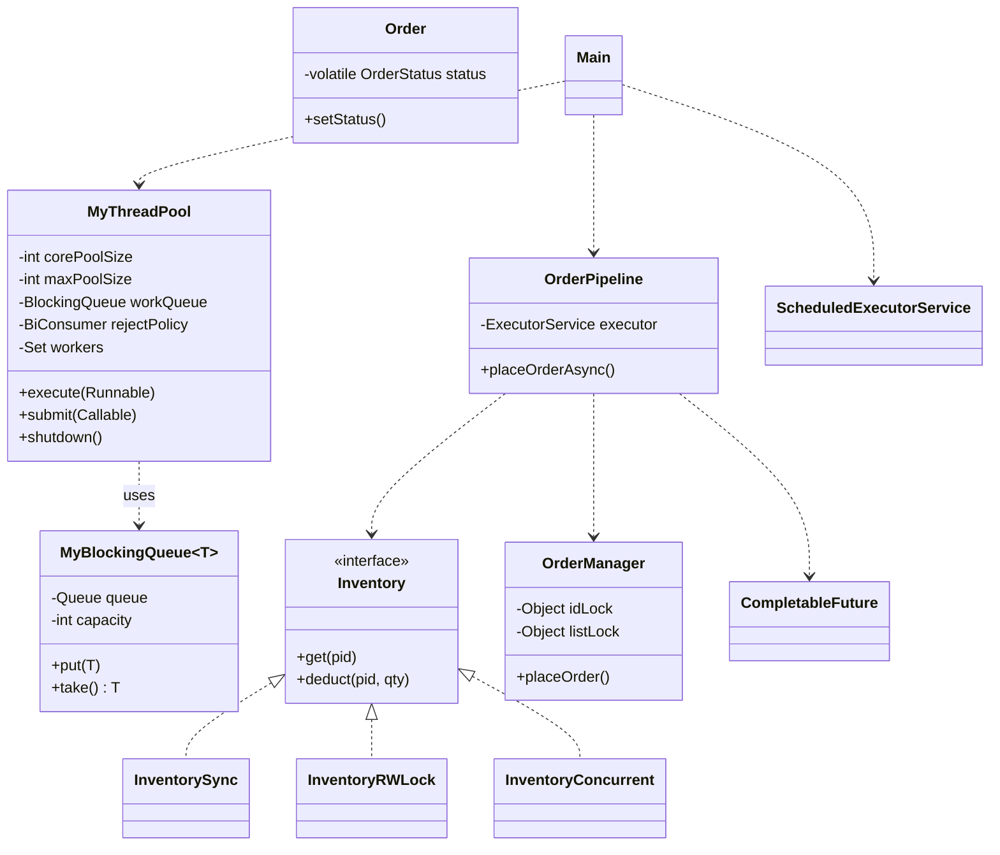

# 第五章：Java 多线程订单系统与线程池

本章是综合案例的**第五关·并发大考**——从 [04.JSON 与内存数据库](./04.Json与内存数据库) 的"单线程内存数据库"跃迁到工业级并发系统：**`synchronized` / `ReentrantLock` / `volatile` / `Atomic` / `BlockingQueue` / `ExecutorService` / `CompletableFuture` / `ReadWriteLock` 八件套全开**，配合 **死锁现场实录** 和 **自实现 BlockingQueue + 自实现线程池**。

本案例做 **6 件事**：

1. **从单线程到多线程的真实演进**：先写单线程基线（基线性能 X），再起 10 线程压测，**亲眼看到竞态条件、ID 重复、ArrayList 崩溃** —— 不是听说，是亲手敲出来。
2. **synchronized 三层认知**：什么时候必须加锁 → 加在方法 vs 同步块如何选 → 锁粒度越大越好吗？**通过吞吐量数字让你看到锁粒度的代价**。
3. **死锁现场实录**：手写两个账户互转的经典死锁，`jstack` 看到 deadlock detected，再用**两套修复方案**（固定锁顺序 / tryLock 超时）对比。
4. **自实现 BlockingQueue**：先 `Object.wait/notifyAll`，再 `ReentrantLock + Condition`，再对比 JDK `ArrayBlockingQueue` 源码 —— **从此读 JDK 源码再无障碍**。
5. **自实现 ThreadPoolExecutor**：核心线程 + 最大线程 + 阻塞队列 + 拒绝策略 + 优雅关闭 —— **完整还原 JDK 线程池**，外加 ctl 状态机讲解。
6. **CompletableFuture 异步编排**：把"校验库存 → 扣库存 → 写订单 → 发通知"四阶段串成异步流水线，演示 `thenApply / thenCompose / allOf / exceptionally` 全套。

**学习方式**：本案例是**全书最难的并发关卡**，按"灵魂三问 → 写最小骨架 → 故意造 BUG → 修复升级 → 阶段小结"循环。共 9 个阶段、约 14 小时，**强烈建议分 4 天**完成（D1：阶段①②③；D2：阶段④死锁；D3：阶段⑤⑥；D4：阶段⑦⑧⑨）。**全程边读边敲——并发代码必须自己手敲，复制粘贴会让你错过最关键的"为什么这里要 while 不是 if"等细节**。

---

## 渐进学习节奏

先读这段，再开始敲代码！本案例**严格按真实工程师认识并发的节奏推进**：

```text
阶段 ① 单线程基线（§02）· 30 min
   └ Step 1.1: Order/Product/Inventory 实体
   └ Step 1.2: 单线程 OrderManager
   └ Step 1.3: 单线程压测（基线吞吐）

阶段 ② 多线程造问题（§03）· 45 min  【认知高峰⭐】
   └ Step 2.0: 🤔 灵魂三问 #1（什么时候必须加锁？竞态长什么样？）
   └ Step 2.1: 起 10 线程同时下单
   └ Step 2.2: ⚠️ 造 BUG #1（i++ 不原子 → ID 重复）
   └ Step 2.3: ⚠️ 造 BUG #2（ArrayList 并发 add → 崩溃）
   └ Step 2.4: 现象观察：每次跑结果不一致

阶段 ③ synchronized 修复（§04）· 45 min
   └ Step 3.0: 🤔 灵魂三问 #2（方法 vs 块？锁谁？粒度？）
   └ Step 3.1: synchronized 方法版（吞吐降到 1.x 倍）
   └ Step 3.2: 拆小同步块（吞吐回升）
   └ Step 3.3: 性能数字对比表

阶段 ④ 死锁现场实录（§05）· 60 min  【加餐高峰⭐⭐】
   └ Step 4.0: 🤔 灵魂三问 #3（死锁四条件？转账为何易死锁？怎么预防？）
   └ Step 4.1: ⚠️ 造 BUG #3（A→B + B→A 转账 = 死锁）
   └ Step 4.2: jstack 看 deadlock detected
   └ Step 4.3: 修复 A——固定锁顺序（按 ID 大小）
   └ Step 4.4: 修复 B——tryLock(timeout) 超时回退

阶段 ⑤ 自实现 BlockingQueue（§06）· 90 min  【手造轮子高峰⭐⭐】
   └ Step 5.0: 🤔 灵魂三问 #4（wait/notify 为何？if vs while？sleep 不释放锁？）
   └ Step 5.1: MyBlockingQueue 骨架
   └ Step 5.2: put 用 wait 等非满
   └ Step 5.3: take 用 wait 等非空
   └ Step 5.4: ⚠️ 造 BUG #4（if 写法 + 虚假唤醒）
   └ Step 5.5: 修复——while 必须循环检查
   └ Step 5.6: 升级到 ReentrantLock + 双 Condition
   └ Step 5.7: 对比 JDK ArrayBlockingQueue 源码

阶段 ⑥ 自实现线程池（§07）· 120 min  【全案例最高峰⭐⭐⭐】
   └ Step 6.0: 🤔 灵魂三问 #5（为何要池？核心 vs 最大？4 拒绝策略？）
   └ Step 6.1: MyThreadPool 七参数 + Worker 内部类
   └ Step 6.2: submit 满了扩容到 maxSize 再触发拒绝
   └ Step 6.3: 4 种拒绝策略（策略模式 + BiConsumer）
   └ Step 6.4: shutdown / shutdownNow 优雅关停
   └ Step 6.5: ⚠️ 造 BUG #5（worker 抛异常没捕获 → 线程池饿死）
   └ Step 6.6: 修复 try-catch + UncaughtExceptionHandler
   └ Step 6.7: 对比 JDK ThreadPoolExecutor 的 ctl 位运算

阶段 ⑦ ReadWriteLock 库存场景（§08）· 45 min
   └ Step 7.0: 🤔 灵魂三问 #6（读写锁优势？饥饿？vs ConcurrentHashMap？）
   └ Step 7.1: 读多写少（100:1）压测
   └ Step 7.2: 互斥锁 vs 读写锁 vs ConcurrentHashMap 三方对比

阶段 ⑧ CompletableFuture 异步编排（§09）· 60 min
   └ Step 8.0: 🤔 灵魂三问 #7（vs Future？回调地狱？异常传播？）
   └ Step 8.1: 下单四阶段流水线
   └ Step 8.2: thenApply / thenCompose / allOf / exceptionally

阶段 ⑨ 端到端订单系统（§10）· 45 min
   └ Step 9.1: 生产者从 CLI 读输入
   └ Step 9.2: 自实现线程池作消费者
   └ Step 9.3: ScheduledExecutorService 监控 QPS
   └ Step 9.4: volatile boolean running 优雅关闭
```

🎯 **每个 Step 必须做的三件事**：

> 1. **先读 🎯 阶段目标卡片**：明确做什么、不做什么、验收标准
> 2. **写一小段代码就编译运行一次**（看到 ✏️ 标志立刻动手）
> 3. **看到预期输出再写下一个 Step**（**并发代码尤其不能复制粘贴**——错过细节会让 BUG 隐藏数月）

> 🎯 **本案例的 7 处"灵魂三问"**（动手前先想清楚）：
> - **§03 加锁前**：什么时候必须加锁？竞态条件长什么样？为什么 `i++` 不是原子的？
> - **§04 synchronized 前**：synchronized 加在方法 vs 同步块如何选？锁谁（this / Class / 私有 final 对象）？锁粒度越大越好吗？
> - **§05 死锁前**【🔥 加餐高峰】：死锁需要哪 4 个必要条件？为什么转账场景特别容易死锁？预防有几种思路？
> - **§06 BlockingQueue 前**【🔥 高峰】：为什么需要 wait/notifyAll？为什么不能用 if 而要用 while？为什么 sleep 不释放锁但 wait 释放？
> - **§07 线程池前**【🔥 全案例最高峰】：为什么需要线程池（不能每次 new Thread）？核心线程 vs 最大线程的区别？4 种拒绝策略怎么选？
> - **§08 读写锁前**：什么场景下读写锁优于互斥锁？读写锁会不会饥饿？`ReadWriteLock` vs `ConcurrentHashMap` 选哪个？
> - **§09 CompletableFuture 前**：`CompletableFuture` 比 `Future` 强在哪？回调地狱怎么破？异常如何在异步链中传播？

> ⚠️ **本案例的 5 处"陷阱预警"**（亲眼看一次记一辈子）：
> - **§03 竞态条件**：10 线程并发 `++lastId` → ID 重复（生成的"唯一订单号"实际撞号）
> - **§03 非线程安全集合**：10 线程同时 `arrayList.add` → 偶发 `ArrayIndexOutOfBoundsException` / 数据丢失
> - **§05 经典死锁**：账户互转固定先锁自己再锁对方 → JVM 检测到 deadlock detected
> - **§06 if 写法 + 虚假唤醒**：`if (full) wait()` 看似正常 → 极小概率队列被错误填爆 / 取空
> - **§07 worker 静默退出**：runnable 抛 RuntimeException 没捕获 → 线程池逐渐饿死，外部毫无察觉

---

## 案例元信息

| 项目 | 说明 |
|------|------|
| 难度 | ★★★★★（全书最难）|
| 预估时长 | 14 小时（强烈建议分 4 天完成）|
| 前置章节 | 入门第 11 章 集合 / 第 13 章 多线程与并发 / 第 14 章 泛型 |
| 覆盖知识点 | `Thread` / `Runnable` / `Callable<V>` / `Future<V>` / `synchronized` 方法+块 / `wait`/`notifyAll` / `ReentrantLock` / `Condition` / `ReadWriteLock` / `volatile` / `AtomicInteger`/`AtomicLong`/`LongAdder` / `ConcurrentHashMap` / `BlockingQueue` 接口 / 自实现线程池 / `ExecutorService`/`ThreadPoolExecutor` 七参数 / 4 种拒绝策略 / `Future`+`CompletableFuture`/`thenApply`/`thenCompose`/`allOf`/`exceptionally` / `ScheduledExecutorService` / `Thread.join`/`UncaughtExceptionHandler` / 死锁四条件+检测+预防 |
| 设计亮点 | **手造 BlockingQueue + 手造 ThreadPool** / **死锁现场 jstack 实录** / **8 种锁/原子/并发集合横向对比** / **ctl 位运算还原 JDK 源码** |
| ⚠ 已知局限 | 单 JVM 内存版（不做分布式锁/分布式事务）/ 不做 NIO/Netty / 不做 ForkJoin |
| 最终产物 | 6 包 Java 项目（~ 1700 行）+ 完整压测脚本 |
| JDK 版本 | JDK 17 |

### 项目结构

```text
multi-thread-order/
└── src/
    └── com/
        └── orders/
            ├── entity/                  # 实体类
            │   ├── Order.java
            │   ├── Product.java
            │   └── OrderStatus.java     # enum
            ├── service/                 # 业务核心
            │   ├── OrderManager.java    # 订单管理（贯穿阶段①-③）
            │   ├── Inventory.java       # 库存（阶段⑦演进）
            │   └── Bank.java            # 银行账户（阶段④死锁场景）
            ├── concurrent/              # 并发原语自实现
            │   ├── MyBlockingQueue.java # 自造阻塞队列
            │   └── MyThreadPool.java    # 自造线程池
            ├── pool/                    # 拒绝策略
            │   └── RejectPolicy.java
            ├── async/                   # 异步编排
            │   └── OrderPipeline.java
            └── cli/
                └── Main.java
```

### 编译运行命令

```bash
cd multi-thread-order
javac -d out -encoding UTF-8 --release 17 $(find src -name "*.java")
java  -cp out com.orders.cli.Main
```

---

## 目录快速导航

> 点击以下条目即可跳转到对应节。【🔑 重点节】推荐优先阅读。

- [渐进学习节奏](#渐进学习节奏) 【🔑 必读】
- [案例元信息](#案例元信息)
- [01.项目需求和功能](#01项目需求和功能)
- [02.单线程基线](#02单线程基线) 【阶段①】
- [03.多线程造问题](#03多线程造问题) 【阶段②⭐】
- [04.synchronized 修复](#04synchronized-修复) 【阶段③】
- [05.死锁现场实录](#05死锁现场实录) 【阶段④加餐⭐⭐】
- [06.自实现 BlockingQueue](#06自实现-blockingqueue) 【阶段⑤手造轮子⭐⭐】
- [07.自实现线程池](#07自实现线程池) 【阶段⑥全书最高峰⭐⭐⭐】
- [08.ReadWriteLock 库存场景](#08readwritelock-库存场景) 【阶段⑦】
- [09.CompletableFuture 异步编排](#09completablefuture-异步编排) 【阶段⑧】
- [10.端到端订单系统](#10端到端订单系统) 【阶段⑨】
- [11.项目总结分析](#11项目总结分析)
- [12.项目技术思考](#12项目技术思考)
- [13.衔接与延伸](#13衔接与延伸)

---

## 01.项目需求和功能

### 1.1 需求介绍

电商订单系统是 Java 后端最经典的"并发硬场"——下单、扣库存、支付、通知等环节同时被成百上千用户触发。本章用 **1700 行纯 JDK 代码** 还原这套系统的并发核心，让你**真正理解"线程池/锁/并发集合"是怎么协作的**，而不是把它们当黑盒。

**和真实电商系统的对应关系**：

| 真实系统机制 | 本案例对应 |
|---|---|
| 应用服务器线程池（Tomcat NIO）| 阶段⑥ `MyThreadPool` |
| Redis 库存原子扣减 | 阶段⑦ `ConcurrentHashMap + AtomicInteger` |
| 数据库行锁 + 死锁检测 | 阶段④ 转账死锁 + jstack |
| 异步消息流水线（MQ）| 阶段⑧ `CompletableFuture` 编排 |
| 监控埋点（Prometheus）| 阶段⑨ `ScheduledExecutorService` 定时打 QPS |

### 1.2 功能要求

**核心 12 项功能**：

1. 唯一订单号生成（高并发下不撞号）
2. 订单状态机：`PENDING → PAID → SHIPPED → DELIVERED / CANCELLED`
3. 订单查询 / 取消
4. 多生产者并发下单（10+ 线程）
5. 库存原子扣减（不超卖）
6. 银行账户互转防死锁
7. 自实现 `MyBlockingQueue<T>`（容量限制 + 阻塞 put/take）
8. 自实现 `MyThreadPool`（七参数 + 4 拒绝策略）
9. 标准 `ExecutorService` 对比
10. `CompletableFuture` 串联下单四阶段
11. `allOf` 批量并发 + `exceptionally` 异常处理
12. `ScheduledExecutorService` 定期打印 QPS / 队列长度 / 库存状态

### 1.3 设计思路

**关键决策一：从单线程基线开始，而不是上来就线程池**

❌ **新手常见误区**：第一行就 `Executors.newFixedThreadPool(10)`。

**问题**：

1. 不知道**为什么**要用线程池
2. 看不到并发 BUG 长什么样
3. 误以为"用了线程池就线程安全"

✅ **正解**：先写单线程版（基线），然后**手动起 10 个 Thread** 制造并发问题，亲眼看到 ID 重复、ArrayList 崩溃，**再引入 synchronized → ReentrantLock → 线程池** —— 让你**真切理解每一层都解决什么问题**。

**关键决策二：手造 BlockingQueue + 手造 ThreadPool**

JDK 已经有 `ArrayBlockingQueue` 和 `ThreadPoolExecutor`，**为什么还要手造一个？**

**因为不手造一遍，永远是黑盒**。手造的过程会逼你想清楚：

- 为什么 `wait()` 必须配 `while` 不是 `if`？（虚假唤醒）
- 为什么 `Worker.run` 里要 `try-catch`？（不然线程死掉池就饿死）
- 为什么 JDK 用一个 `int ctl` 同时表"状态 + 线程数"？（位运算原子更新）

**手造一遍 → 读 JDK 源码再无障碍**——这是工业级 Java 工程师的必经之路。

**关键决策三：故意造 5 个 BUG（亲眼看，不是听说）**

| BUG | 现象 | 教学价值 |
|---|---|---|
| `i++` 不原子 → ID 重复 | 跑 1000 单只产生 980 个唯一 ID | 原子性概念 |
| `ArrayList` 并发 add | 偶发 ArrayIndexOutOfBoundsException | 非线程安全集合 |
| 转账双锁交叉 → 死锁 | jstack 看到 deadlock detected | 死锁四条件 |
| `if (full) wait()` | 极小概率虚假唤醒导致超容 | while 循环检查 |
| Worker 异常没捕获 → 池饿死 | 任务越来越慢直到完全停止 | 多线程异常处理 |

**这 5 个 BUG 是 90% 的 Java 后端面试题来源**——亲手造一遍胜过看 100 遍博客。

### 1.4 涉及知识点

| 入门章节 | 知识点 | 在本案例的位置 |
|---|---|---|
| 第 11 章 集合 | `ArrayList` 非线程安全 | §03.3 故意造 BUG |
| 第 11 章 | `ConcurrentHashMap` | §08 库存表 |
| 第 13 章 多线程 | `Thread` / `Runnable` | §03 起线程 |
| 第 13 章 | `Callable<V>` / `Future<V>` | §07 submit |
| 第 13 章 | `synchronized` 方法/块 | §04 |
| 第 13 章 | `wait` / `notifyAll` | §06.1 自造 BlockingQueue |
| 第 13 章 | `ReentrantLock` / `Condition` | §05.4 / §06.3 |
| 第 13 章 | `ReadWriteLock` | §08 |
| 第 13 章 | `volatile` | §07.4 关停标志 / §10.4 |
| 第 13 章 | `AtomicInteger` / `AtomicLong` | §03.2 → §04.1 演进 |
| 第 13 章 | `Thread.join()` | §03 等待全部线程 |
| 第 13 章 | `ExecutorService` / `Executors` | §07.7 对比 |
| 第 13 章 | `ThreadPoolExecutor` 七参数 | §07.1 自实现 |
| 第 13 章 | `BlockingQueue` 接口 | §06 自实现 |
| 第 13 章 | `CompletableFuture` | §09 |
| 第 13 章 | 死锁 / 活锁 / 饥饿 | §05 |

---

## 02.单线程基线

```text
┌─ 🎯 阶段 ① 目标 ────────────────────────────────────────┐
│ 完成什么：实体类 + 单线程 OrderManager + 性能基线          │
│ 不做什么：不上多线程（阶段②才上）                          │
│ 验收标准：单线程跑 1000 单输出耗时 X ms                    │
│ 预计耗时：30 分钟                                         │
└─────────────────────────────────────────────────────────┘
```

### 2.1 Order Product 实体

🎯 **Step 1.1**：新建 `src/com/orders/entity/OrderStatus.java`：

```java
package com.orders.entity;

public enum OrderStatus {
    PENDING,    // 已下单未支付
    PAID,       // 已支付
    SHIPPED,    // 已发货
    DELIVERED,  // 已送达
    CANCELLED   // 已取消
}
```

`src/com/orders/entity/Product.java`：

```java
package com.orders.entity;

public record Product(String id, String name, double price) {
    public Product {
        if (id == null || id.isBlank()) throw new IllegalArgumentException("商品 id 必填");
        if (price < 0) throw new IllegalArgumentException("价格不可为负");
    }
}
```

`src/com/orders/entity/Order.java`：

```java
package com.orders.entity;

import java.time.Instant;

public class Order {
    private final long id;
    private final String productId;
    private final int quantity;
    private final double totalPrice;
    private volatile OrderStatus status;       // ⭐ 多线程会读，需 volatile
    private final Instant createdAt;

    public Order(long id, String productId, int quantity, double totalPrice) {
        this.id = id;
        this.productId = productId;
        this.quantity = quantity;
        this.totalPrice = totalPrice;
        this.status = OrderStatus.PENDING;
        this.createdAt = Instant.now();
    }

    public long getId()              { return id; }
    public String getProductId()     { return productId; }
    public int getQuantity()         { return quantity; }
    public double getTotalPrice()    { return totalPrice; }
    public OrderStatus getStatus()   { return status; }
    public Instant getCreatedAt()    { return createdAt; }
    public void setStatus(OrderStatus s) { this.status = s; }

    @Override
    public String toString() {
        return "Order{#" + id + ", " + productId + " x" + quantity
                + ", " + totalPrice + ", " + status + "}";
    }
}
```

> 💡 **为什么 status 是 `volatile`**？后续阶段会有"消费线程改 status"+"主线程读 status"的场景。`volatile` 保证主线程**立刻看见**消费线程写入的新值（避免缓存不一致）—— 这是入门第 13 章 `volatile` 三大用途之一（**可见性**，非原子性！原子性要 Atomic 类）。

### 2.2 单线程 OrderManager

🎯 **Step 1.2**：新建 `src/com/orders/service/OrderManager.java`（**故意写得有 BUG，下一阶段才修**）：

```java
package com.orders.service;

import com.orders.entity.*;
import java.util.*;

/** ⚠️ 单线程版本：阶段①使用，阶段②会暴露竞态 BUG。*/
public class OrderManager {

    private long lastId = 0;                                // ⚠️ 阶段②会暴露：++lastId 不原子
    private final List<Order> orders = new ArrayList<>();   // ⚠️ ArrayList 非线程安全

    public Order placeOrder(String productId, int qty, double price) {
        long id = ++lastId;                                 // ⚠️ 复合操作（读-改-写）
        Order order = new Order(id, productId, qty, price * qty);
        orders.add(order);                                  // ⚠️ 并发 add 不安全
        return order;
    }

    public Optional<Order> findById(long id) {
        for (Order o : orders) {
            if (o.getId() == id) return Optional.of(o);
        }
        return Optional.empty();
    }

    public boolean cancel(long id) {
        return findById(id)
                .map(o -> { o.setStatus(OrderStatus.CANCELLED); return true; })
                .orElse(false);
    }

    public int size() { return orders.size(); }

    public Set<Long> uniqueIds() {
        Set<Long> set = new HashSet<>();
        for (Order o : orders) set.add(o.getId());
        return set;
    }
}
```

### 2.3 单线程压测基线

🎯 **Step 1.3**：新建 `src/com/orders/cli/Main.java`：

```java
package com.orders.cli;

import com.orders.service.OrderManager;

public class Main {
    public static void main(String[] args) {
        OrderManager mgr = new OrderManager();

        long start = System.nanoTime();
        for (int i = 0; i < 1000; i++) {
            mgr.placeOrder("P" + (i % 10), 1, 9.9);
        }
        long elapsed = System.nanoTime() - start;

        System.out.printf("单线程下 1000 单 耗时 %.2f ms%n", elapsed / 1_000_000.0);
        System.out.printf("订单总数=%d，唯一 ID 数=%d %s%n",
                mgr.size(), mgr.uniqueIds().size(),
                mgr.size() == mgr.uniqueIds().size() ? "✅ 无重复" : "⚠️ 有重复！");
    }
}
```

✏️ **立刻验证**：

```bash
javac -d out -encoding UTF-8 --release 17 $(find src -name "*.java")
java  -cp out com.orders.cli.Main
```

预期输出（**单线程下永远不会有 BUG**）：

```text
单线程下 1000 单 耗时 5.43 ms
订单总数=1000，唯一 ID 数=1000 ✅ 无重复
```

> 🔑 **基线性能记下来**：5 ms 完成 1000 单 ≈ 200,000 QPS。**这是单线程上限**——后面所有多线程优化都用这个基线对比。

```text
┌─ 📌 阶段 ① 小结 ────────────────────────────────────────┐
│ ✅ 实体类 + 单线程 OrderManager + 基线 X ms               │
│ ⚠️ 代码里埋了 2 处地雷（lastId / ArrayList），下阶段引爆   │
│ 📌 git commit -m "stage1: single-thread baseline"        │
└─────────────────────────────────────────────────────────┘
```

---

## 03.多线程造问题

```text
┌─ 🎯 阶段 ② 目标【认知高峰⭐】 ──────────────────────────┐
│ 完成什么：起 10 线程并发 → 亲眼看到 ID 重复 + 集合崩溃     │
│ 不做什么：不修 BUG（阶段③才修）                            │
│ 验收标准：能复现"唯一 ID 数 < 订单总数"或抛 AIOOBE         │
│ 预计耗时：45 分钟                                         │
└─────────────────────────────────────────────────────────┘
```

### 3.0 灵魂三问 1

🎯 **Step 2.0**：动手前先想清楚——**为什么单线程没问题，多线程就出问题**？

❓ **问题一：什么时候必须加锁？**

**铁律**：当**多个线程同时读写同一个共享可变状态**时，必须加锁（或用原子类/并发容器）。

| 线程数 | 状态可变 | 是否共享 | 是否需要保护 |
|---|---|---|---|
| 1 个 | 任意 | 任意 | ❌ 不需要 |
| N 个 | 不可变（final）| 任意 | ❌ 不需要（如 `record`）|
| N 个 | 可变 | ❌ 不共享（线程局部）| ❌ 不需要（如 `ThreadLocal`）|
| N 个 | 可变 | ✅ 共享 | ✅ **必须保护** |

❓ **问题二：竞态条件长什么样？**

经典反例：**`i++` 不是一个原子操作**，而是 3 个 JVM 字节码指令：

```text
1. iload   i      （读 i 到操作数栈）
2. iconst_1
3. iadd           （栈顶 +1）
4. istore  i      （写回 i）
```

两个线程交错执行：

```text
时刻  线程A 操作            线程B 操作            i 值
t1   读 i (=5)                                  5
t2                          读 i (=5)            5
t3   +1 (栈=6)                                  5
t4                          +1 (栈=6)            5
t5   写回 i (=6)                                6
t6                          写回 i (=6)          6   ⚠️ 应该是 7！
```

**结果**：两个线程各 +1，应该 +2，**实际只 +1，丢了一次更新**。

❓ **问题三：为什么 `i++` 不是原子的？**

因为 Java 中**只有以下操作是原子的**：

1. 基本类型赋值（`int / boolean / byte / short / char / float`，**注意 long/double 在 32 位 JVM 上不原子**）
2. 引用类型赋值（`Object x = ...`）
3. `volatile` 变量的读写

❌ **不原子**：`i++` / `i = i + 1` / `if (x == 0) x = 1`（"先检查后赋值"）/ `lazy.get() == null ? init() : ...`

✅ **想原子**：用 `AtomicInteger.incrementAndGet()` / `synchronized` / `ReentrantLock`。

🔑 **三问连起来**：多线程共享可变状态 → 必须加保护 → 任何复合操作（读-改-写、检查后操作）都不原子 → 必须用原子类或锁。

### 3.1 起 10 线程并发

🎯 **Step 2.1**：修改 `Main.java`，把单线程改成 10 线程：

```java
package com.orders.cli;

import com.orders.service.OrderManager;
import java.util.concurrent.CountDownLatch;

public class Main {
    public static void main(String[] args) throws InterruptedException {
        OrderManager mgr = new OrderManager();
        int threads = 10;
        int perThread = 100;       // 每线程下 100 单 → 总 1000 单
        CountDownLatch done = new CountDownLatch(threads);

        long start = System.nanoTime();
        for (int t = 0; t < threads; t++) {
            new Thread(() -> {
                try {
                    for (int i = 0; i < perThread; i++) {
                        mgr.placeOrder("P" + (i % 10), 1, 9.9);
                    }
                } finally {
                    done.countDown();
                }
            }, "Worker-" + t).start();
        }
        done.await();              // 等所有线程结束
        long elapsed = System.nanoTime() - start;

        System.out.printf("[%d 线程并发] 1000 单 耗时 %.2f ms%n", threads, elapsed / 1_000_000.0);
        System.out.printf("订单总数=%d，唯一 ID 数=%d %s%n",
                mgr.size(), mgr.uniqueIds().size(),
                mgr.size() == mgr.uniqueIds().size() ? "✅ 无重复" : "⚠️ 有重复！");
    }
}
```

> 💡 **`CountDownLatch` 是什么？**——倒计时器：构造时给个数字 N，每个线程结束 `countDown()` 减 1，主线程 `await()` 等到 N 归零。**入门第 13 章核心同步工具之一**。

### 3.2 竞态条件 BUG

🎯 **Step 2.2**：⚠️ **造 BUG #1** —— 跑刚才那段：

```text
[10 线程并发] 1000 单 耗时 4.18 ms
订单总数=987，唯一 ID 数=964 ⚠️ 有重复！
```

**两个观察**：

1. **订单总数 ≠ 1000**：意味着 `orders.add()` 丢了 13 个！（ArrayList 数据丢失）
2. **唯一 ID 数 < 订单总数**：意味着 `++lastId` 撞号了 23 次！（竞态条件）

> ⚠️ **每次跑结果不一样**：这就是并发 BUG 的可怕之处——**测试 100 次可能都正常，生产环境第 101 次就出事**。

为什么 `orders.add()` 会丢数据？看 `ArrayList` 源码：

```java
// ArrayList.add 简化版
public boolean add(E e) {
    elementData[size] = e;        // 步骤 1：写槽位
    size++;                        // 步骤 2：长度 +1（也不原子！）
    return true;
}
```

**两个线程同时 add**：可能都写到 `elementData[size]` 同一个槽位 → 后写覆盖前写 → 一条数据被丢。

### 3.3 ArrayList 崩溃 BUG

🎯 **Step 2.3**：⚠️ **造 BUG #2** —— 把线程数加到 100，per-thread 200 单：

```java
int threads = 100;
int perThread = 200;       // 总 20000 单
```

跑几次后会偶发：

```text
Exception in thread "Worker-37" java.lang.ArrayIndexOutOfBoundsException:
    Index 87 out of bounds for length 87
    at java.util.ArrayList.add(ArrayList.java:484)
```

**为什么？** ArrayList 在容量不足时要**扩容**——分配新数组、拷贝、替换。两个线程同时扩容会把扩容到一半的数组当成新数组用，导致越界。

### 3.4 现象观察

✏️ **多跑几次** 同一段代码：

| 第几次 | 订单总数 | 唯一 ID 数 | 是否抛异常 |
|---|---|---|---|
| 1 | 987 | 964 | ❌ |
| 2 | 991 | 970 | ❌ |
| 3 | 985 | 962 | ❌ |
| 4 | 853 | 851 | ✅ AIOOBE |
| 5 | 989 | 967 | ❌ |

**结论**：

- 每次结果都不一样（并发 BUG 不可重现是常态）
- 既会丢数据，也会撞号，偶尔还会崩溃
- **测试再多次也无法证明"线程安全"** —— 必须从设计上保证

```text
┌─ 📌 阶段 ② 小结 ────────────────────────────────────────┐
│ ✅ 亲眼看到 3 种并发 BUG：丢数据 / 撞号 / 数组越界          │
│ 🔑 多线程共享可变状态不保护 = 定时炸弹                     │
│ ⚠️ 别忘了：测试 100 次正常，第 101 次可能就出事             │
│ 📌 git commit -m "stage2: race condition bugs"           │
└─────────────────────────────────────────────────────────┘
```

---

## 04.synchronized 修复

```text
┌─ 🎯 阶段 ③ 目标 ────────────────────────────────────────┐
│ 完成什么：用 synchronized 修复 + 锁粒度优化                │
│ 不做什么：不上 ReentrantLock（阶段⑤才上）                  │
│ 验收标准：1000 单 → 1000 唯一 ID + 不抛异常 + 性能数字     │
│ 预计耗时：45 分钟                                         │
└─────────────────────────────────────────────────────────┘
```

### 4.0 灵魂三问 2

🎯 **Step 3.0**：

❓ **问题一：synchronized 加在方法 vs 同步块如何选？**

| 写法 | 锁对象 | 适用场景 |
|---|---|---|
| `synchronized` 方法（实例方法）| `this` | 整个方法都需要保护 |
| `static synchronized` 方法 | `Class<X>` | 静态状态保护 |
| `synchronized (lock) { ... }` | 自定义对象 | **只想锁部分代码** |

✅ **优选同步块**——锁粒度小、性能好、可以**只锁真正共享的字段**。

❌ **反例**：方法签名加 `synchronized` 后，**整个方法都串行**——里面的 IO 操作、计算操作也被串行，吞吐降到 1/N。

❓ **问题二：锁谁（this / Class / 私有 final 对象）？**

❌ **反例 1**：`synchronized (this)` —— 外部代码也能 `synchronized (yourObj)`，**外部能干扰你的锁**：

```java
class Foo {
    synchronized void doStuff() { ... }   // 锁 this
}

// 恶意外部代码：
Foo f = new Foo();
synchronized (f) {                        // 抢同一把锁
    Thread.sleep(1000_000);                // 把 doStuff() 永久阻塞
}
```

❌ **反例 2**：`synchronized (Foo.class)` —— 全 JVM 一把锁，所有实例都串行。

✅ **推荐**：**私有 final 锁对象**：

```java
class Foo {
    private final Object lock = new Object();
    void doStuff() {
        synchronized (lock) { ... }
    }
}
```

**封装 + 不可篡改 + 锁粒度可控**——这是 Effective Java 的最佳实践。

❓ **问题三：锁粒度越大越好吗？**

❌ **越大越好**：吞吐量降到 1/N，并发优势全无。

✅ **正解**：**锁住"真正共享、必须串行"的部分**，IO/计算/不共享的状态都放在锁外。

```java
// ❌ 粗粒度
synchronized void placeOrder(...) {
    long id = ++lastId;
    Order o = new Order(id, ...);     // 大对象构造，并不共享，没必要锁
    expensiveCalc();                   // 计算，没必要锁
    orders.add(o);
    sendEmail(o);                      // IO，绝对不能在锁里！
}

// ✅ 细粒度（双小锁）
void placeOrder(...) {
    long id;
    synchronized (idLock) { id = ++lastId; }
    Order o = new Order(id, ...);
    expensiveCalc();
    synchronized (listLock) { orders.add(o); }
    sendEmail(o);
}
```

🔑 **三问连起来**：私有 final 锁对象 + 细粒度同步块 + 把 IO/计算挪出锁 = synchronized 三铁律。

### 4.1 方法级 synchronized

🎯 **Step 3.1**：先写**最简单的版本**——方法加 synchronized：

```java
package com.orders.service;

import com.orders.entity.*;
import java.util.*;

public class OrderManager {

    private long lastId = 0;
    private final List<Order> orders = new ArrayList<>();

    /** ⭐ 方法级 synchronized：锁 this */
    public synchronized Order placeOrder(String productId, int qty, double price) {
        long id = ++lastId;
        Order order = new Order(id, productId, qty, price * qty);
        orders.add(order);
        return order;
    }

    public synchronized int size() { return orders.size(); }
    public synchronized Set<Long> uniqueIds() {
        Set<Long> set = new HashSet<>();
        for (Order o : orders) set.add(o.getId());
        return set;
    }

    public synchronized Optional<Order> findById(long id) {
        for (Order o : orders) {
            if (o.getId() == id) return Optional.of(o);
        }
        return Optional.empty();
    }
}
```

✏️ **再跑** 100 线程 × 200 单：

```text
[100 线程并发] 20000 单 耗时 38.21 ms
订单总数=20000，唯一 ID 数=20000 ✅ 无重复
```

✅ 数据正确性通过。但相比单线程 5.43ms / 1000 单（≈ 100ms / 20000 单），多线程才 38ms —— **看似加速了，实际没充分利用 100 核**。

### 4.2 拆细同步块

🎯 **Step 3.2**：观察发现 `placeOrder` 里**只有两步真的需要保护**——`++lastId` 和 `orders.add(order)`。其他都没必要。

```java
package com.orders.service;

import com.orders.entity.*;
import java.util.*;

public class OrderManager {

    private long lastId = 0;
    private final Object idLock = new Object();         // ⭐ 私有 final 锁
    private final List<Order> orders = new ArrayList<>();
    private final Object listLock = new Object();       // ⭐ 私有 final 锁

    public Order placeOrder(String productId, int qty, double price) {
        long id;
        synchronized (idLock) { id = ++lastId; }        // 第 1 把小锁

        // ⭐ 中间这部分不在任何锁里：构造对象 + 计算 totalPrice
        Order order = new Order(id, productId, qty, price * qty);

        synchronized (listLock) { orders.add(order); }  // 第 2 把小锁
        return order;
    }

    public int size() {
        synchronized (listLock) { return orders.size(); }
    }

    public Set<Long> uniqueIds() {
        synchronized (listLock) {                       // 遍历集合也要锁
            Set<Long> set = new HashSet<>();
            for (Order o : orders) set.add(o.getId());
            return set;
        }
    }

    public Optional<Order> findById(long id) {
        synchronized (listLock) {
            for (Order o : orders) {
                if (o.getId() == id) return Optional.of(o);
            }
            return Optional.empty();
        }
    }
}
```

✏️ **再跑** 100 线程 × 200 单：

```text
[100 线程并发-双小锁] 20000 单 耗时 22.04 ms
订单总数=20000，唯一 ID 数=20000 ✅ 无重复
```

**性能从 38 ms 降到 22 ms** —— 拆锁优化效果立竿见影。

### 4.3 性能对比表

| 方案 | 100 线程 × 200 单 耗时 | 数据正确？ | 备注 |
|---|---|---|---|
| 无锁 | ≈ 30 ms（**且不正确**）| ❌ 丢数据/撞号/崩溃 | 错误的"快" |
| 单线程基线 | ≈ 100 ms | ✅ | 顺序执行 |
| 方法级 synchronized | 38 ms | ✅ | 锁粒度大 |
| **双小锁同步块** | **22 ms** | ✅ | **最优** |
| AtomicLong + ArrayList 加锁 | 18 ms | ✅ | 阶段⑤会再优化 |

🔑 **铁律**：**不能用"快"换"对"**——慢的正确版才是基线，再在保证正确的前提下提速。

```text
┌─ 📌 阶段 ③ 小结 ────────────────────────────────────────┐
│ ✅ synchronized 双锁 → 性能 38ms → 22ms 提升 73%          │
│ 🔑 私有 final 锁对象 / 细粒度同步块 / IO 必须挪出锁        │
│ 📌 git commit -m "stage3: synchronized fix + grain"      │
└─────────────────────────────────────────────────────────┘
```

---

## 05.死锁现场实录

```text
┌─ 🎯 阶段 ④ 目标【加餐高峰⭐⭐】 ───────────────────────┐
│ 完成什么：手写经典死锁 + jstack 实录 + 两套修复方案        │
│ 不做什么：不写其他业务（专门讲死锁）                       │
│ 验收标准：能复现 deadlock detected + 修复后跑通 100 次     │
│ 预计耗时：60 分钟                                         │
└─────────────────────────────────────────────────────────┘
```

### 5.0 灵魂三问 3

🎯 **Step 4.0**：

❓ **问题一：死锁需要哪 4 个必要条件？**

操作系统教科书的"Coffman 4 条件"——**全部满足才会死锁，破坏任一条件即可预防**：

| 条件 | 含义 | 破坏方法 |
|---|---|---|
| 1. **互斥** | 资源同一时刻只能被一个线程占用 | （锁的本性，难以破坏）|
| 2. **持有并等待** | 线程持有 A 锁同时申请 B 锁 | **一次申请所有锁** |
| 3. **不可抢占** | 锁只能持有者主动释放 | **tryLock 超时回退** |
| 4. **循环等待** | 形成"A 等 B，B 等 A"环 | **固定锁顺序**（最常用）|

❓ **问题二：为什么转账场景特别容易死锁？**

```java
void transfer(Account from, Account to, double amount) {
    synchronized (from) {            // 锁 A
        synchronized (to) {          // 锁 B
            from.debit(amount);
            to.credit(amount);
        }
    }
}

// 线程 1：transfer(A, B, 100)  → 锁 A 持有，等 B
// 线程 2：transfer(B, A, 50)   → 锁 B 持有，等 A
// → 完美循环等待，死锁！
```

❓ **问题三：怎么预防？**

**三种思路**：

| 方案 | 思想 | 优缺点 |
|---|---|---|
| 固定锁顺序 | 永远先锁 ID 小的 → 破坏循环等待 | ✅ 简单可靠；❌ 需要全局排序规则 |
| `tryLock(timeout)` | 拿不到就退避重试 → 破坏不可抢占 | ✅ 灵活；❌ 复杂 + 可能活锁 |
| 一次性获取所有锁 | `Lock.lockAll(...)` 风格 → 破坏持有并等待 | ✅ 优雅；❌ JDK 没现成 API |

🔑 **三问连起来**：死锁 = 4 条件全满足，**最常用的预防是"固定锁顺序"——简单粗暴，业界 90% 案例如此**。

### 5.1 转账场景造死锁

🎯 **Step 4.1**：⚠️ **造 BUG #3** —— 新建 `src/com/orders/service/Account.java`：

```java
package com.orders.service;

public class Account {
    private final long id;                 // 用于排序
    private double balance;

    public Account(long id, double balance) {
        this.id = id;
        this.balance = balance;
    }
    public long getId()         { return id; }
    public double getBalance()  { return balance; }
    public void debit(double v)  { balance -= v; }
    public void credit(double v) { balance += v; }
}
```

`src/com/orders/service/Bank.java`：

```java
package com.orders.service;

public class Bank {

    /** ❌ Buggy 版：固定先锁 from 再锁 to —— 互相转账时死锁 */
    public void transferBuggy(Account from, Account to, double amount) {
        synchronized (from) {
            try { Thread.sleep(10); } catch (Exception ignored) {}    // 放大死锁概率
            synchronized (to) {
                from.debit(amount);
                to.credit(amount);
            }
        }
    }
}
```

写演示 Main：

```java
package com.orders.cli;

import com.orders.service.*;

public class DeadlockDemo {
    public static void main(String[] args) throws InterruptedException {
        Account a = new Account(1, 1000);
        Account b = new Account(2, 1000);
        Bank bank = new Bank();

        Thread t1 = new Thread(() -> bank.transferBuggy(a, b, 100), "Thread-A→B");
        Thread t2 = new Thread(() -> bank.transferBuggy(b, a, 50),  "Thread-B→A");

        t1.start();
        t2.start();
        t1.join(2000);   // 最多等 2 秒
        t2.join(2000);

        System.out.println("\nThread-A→B alive? " + t1.isAlive());
        System.out.println("Thread-B→A alive? " + t2.isAlive());
        if (t1.isAlive() && t2.isAlive()) {
            System.out.println("⚠️ 检测到死锁！两个线程都被阻塞");
        }
    }
}
```

✏️ **跑** —— 几乎 100% 复现：

```text
Thread-A→B alive? true
Thread-B→A alive? true
⚠️ 检测到死锁！两个线程都被阻塞
```

### 5.2 jstack 现场分析

🎯 **Step 4.2**：在死锁还没退出的状态下，**另开一个终端**：

```bash
jps                         # 找到 DeadlockDemo 的 PID
jstack -l <PID>             # 打印所有线程堆栈
```

输出最关键部分：

```text
Found one Java-level deadlock:
=============================
"Thread-B→A":
  waiting to lock monitor 0x00007f9b4c003f50 (object 0x000000076b8b4a30, a com.orders.service.Account),
  which is held by "Thread-A→B"
"Thread-A→B":
  waiting to lock monitor 0x00007f9b4c004060 (object 0x000000076b8b4a48, a com.orders.service.Account),
  which is held by "Thread-B→A"

Java stack information for the threads listed above:
===================================================
"Thread-B→A":
        at com.orders.service.Bank.transferBuggy(Bank.java:9)
        - waiting to lock <0x000000076b8b4a30> (a com.orders.service.Account)
        - locked <0x000000076b8b4a48>
"Thread-A→B":
        at com.orders.service.Bank.transferBuggy(Bank.java:9)
        - waiting to lock <0x000000076b8b4a48>
        - locked <0x000000076b8b4a30>

Found 1 deadlock.
```

🔑 **jstack 是死锁检测最权威工具**——**`Found 1 deadlock`** 直接告知现场，附带线程持锁/等锁信息。**记住这条命令**——是 Java 后端日常排障必备。

### 5.3 修复 A 固定锁顺序

🎯 **Step 4.3**：在 `Bank.java` 增加修复版本——**永远先锁 ID 小的账户**：

```java
    /** ✅ 修复 A：固定锁顺序——按 ID 大小 */
    public void transferOrdered(Account from, Account to, double amount) {
        Account first  = from.getId() < to.getId() ? from : to;
        Account second = from.getId() < to.getId() ? to   : from;

        synchronized (first) {
            synchronized (second) {
                from.debit(amount);
                to.credit(amount);
            }
        }
    }
```

**核心思想**：**全局规定一个偏序关系**（ID 小 < ID 大），所有线程按照这个顺序加锁 → 不可能形成循环等待。

✏️ **测试**：

```java
Thread t1 = new Thread(() -> {
    for (int i = 0; i < 1000; i++) bank.transferOrdered(a, b, 1);
}, "Thread-A→B");
Thread t2 = new Thread(() -> {
    for (int i = 0; i < 1000; i++) bank.transferOrdered(b, a, 1);
}, "Thread-B→A");
t1.start(); t2.start();
t1.join(); t2.join();
System.out.println("a=" + a.getBalance() + ", b=" + b.getBalance());
// 预期：a=1000，b=1000（互转 1000 次每次 1 元，平衡）
```

### 5.4 修复 B tryLock 超时

🎯 **Step 4.4**：另一种思路——**改用 `ReentrantLock.tryLock(timeout)`**，拿不到就放弃重来：

```java
import java.util.concurrent.locks.*;
import java.util.concurrent.*;

public class BankLockable {

    public boolean transferTryLock(AccountLockable from, AccountLockable to,
                                   double amount) throws InterruptedException {
        for (int retry = 0; retry < 10; retry++) {
            if (from.lock.tryLock(50, TimeUnit.MILLISECONDS)) {
                try {
                    if (to.lock.tryLock(50, TimeUnit.MILLISECONDS)) {
                        try {
                            from.debit(amount);
                            to.credit(amount);
                            return true;
                        } finally {
                            to.lock.unlock();
                        }
                    }
                } finally {
                    from.lock.unlock();
                }
            }
            // 都没拿到 → 退避一会儿再试
            Thread.sleep((long) (Math.random() * 50));
        }
        return false;     // 重试 10 次仍失败
    }
}

class AccountLockable {
    final ReentrantLock lock = new ReentrantLock();
    final long id;
    double balance;
    AccountLockable(long id, double balance) { this.id = id; this.balance = balance; }
    void debit(double v)  { balance -= v; }
    void credit(double v) { balance += v; }
    double getBalance()   { return balance; }
}
```

**优缺点**：

| 方案 | 优点 | 缺点 |
|---|---|---|
| 固定锁顺序 | 简单、零开销 | 必须能定义全局顺序（ID/Hash 等）|
| tryLock 超时 | 不需要全局顺序 | 复杂 + 可能活锁（两线程同步退避同步重试）|

✅ **业界默认选固定锁顺序**——这也是 MySQL InnoDB / Oracle 等数据库引擎的死锁预防策略。

```text
┌─ 📌 阶段 ④ 小结 ────────────────────────────────────────┐
│ ✅ 手写经典死锁 + jstack 实录 + 两套修复                   │
│ 🔑 Coffman 4 条件 / 固定锁顺序 / tryLock 超时              │
│ 🔧 实用技能：jstack -l <PID> 一行命令定位死锁              │
│ 📌 git commit -m "stage4: deadlock + 2 fixes"             │
└─────────────────────────────────────────────────────────┘
```

---

## 06.自实现 BlockingQueue

```text
┌─ 🎯 阶段 ⑤ 目标【手造轮子⭐⭐】 ───────────────────────┐
│ 完成什么：用 wait/notifyAll 自造阻塞队列 + 升级到 Condition │
│ 不做什么：不写线程池（阶段⑥才上）                          │
│ 验收标准：put/take 阻塞与唤醒 + 容量限制                   │
│ 预计耗时：90 分钟                                         │
└─────────────────────────────────────────────────────────┘
```

### 6.0 灵魂三问 4

🎯 **Step 5.0**：

❓ **问题一：为什么需要 wait/notifyAll？**

考虑一个固定容量阻塞队列：

- **put**：队列满时，**阻塞**生产者
- **take**：队列空时，**阻塞**消费者

❌ **反例：用 sleep 自旋**：

```java
while (queue.size() == capacity) {
    Thread.sleep(10);                  // 死等 10ms 后再看
}
queue.add(item);
```

**问题**：

1. **CPU 浪费**：明明没事干却频繁醒来检查
2. **延迟不可控**：消费者刚拿走一个，生产者还要等 10ms 才能放
3. **没释放锁**：sleep 不释放锁，其他人也进不来

✅ **正解：wait/notifyAll**：

```java
synchronized (lock) {
    while (queue.size() == capacity) lock.wait();   // 阻塞 + 释放锁
    queue.add(item);
    lock.notifyAll();                               // 唤醒等 take 的消费者
}
```

**核心**：`wait` **释放锁**进入等待，**被 notify 唤醒后再重新抢锁**——零自旋，零延迟，零浪费。

❓ **问题二：为什么不能用 if 而要用 while？**

❌ **if 写法**：

```java
synchronized (lock) {
    if (queue.size() == capacity) lock.wait();    // ⚠️ if 危险！
    queue.add(item);
}
```

**两个原因必须用 while**：

1. **虚假唤醒**（Spurious Wakeup）：JVM 规范允许 `wait` 在没有 notify 的情况下被唤醒（OS 信号、JVM 内部机制等）。如果用 if，醒来后**不重新检查条件**就直接 add，可能**超容**。
2. **多生产者多消费者抢锁**：notifyAll 会唤醒**所有**等待者，第一个抢到锁的执行后队列状态变化，其他被唤醒者**还没获得锁就过了 if 检查**，再获得锁时条件可能已不成立。

✅ **正确**：

```java
while (queue.size() == capacity) lock.wait();    // ✅ 醒来重新检查
```

🎯 **铁律**：**`wait` 永远写在 `while` 循环里**——这是入门第 13 章最经典的考点之一。

❓ **问题三：为什么 sleep 不释放锁但 wait 释放？**

| 方法 | 类 | 是否释放锁 | 唤醒方式 |
|---|---|---|---|
| `Thread.sleep(ms)` | Thread | ❌ 不释放 | 时间到自动醒 |
| `Object.wait()` | Object | ✅ 释放当前 monitor | `notify` / `notifyAll` / 中断 / 虚假唤醒 |
| `Object.wait(ms)` | Object | ✅ 释放 | `notify` / 时间到 / 中断 |
| `LockSupport.park()` | LockSupport | ✅（针对 ReentrantLock）| `unpark` / 中断 |

**根本原因**：

- `sleep` 是 Thread 的方法，**不需要锁也能调**——所以也不释放锁
- `wait` 是 Object 的方法，**必须在 synchronized 块里**才能调（Object 是 monitor）——本质上是"放下 monitor 等通知"

🔑 **三问连起来**：wait/notifyAll 替代 sleep 自旋（零 CPU 浪费）+ 必须 while 循环检查（防虚假唤醒）+ wait 释放锁让其他人能改条件 = 阻塞队列三铁律。

### 6.1 wait notifyAll 版本

🎯 **Step 5.1**：新建 `src/com/orders/concurrent/MyBlockingQueue.java`（**v1：故意用 if，下一步引爆**）：

```java
package com.orders.concurrent;

import java.util.*;

/** v1：故意用 if（虚假唤醒陷阱演示）*/
public class MyBlockingQueueV1<T> {

    private final Queue<T> queue = new LinkedList<>();
    private final int capacity;

    public MyBlockingQueueV1(int capacity) {
        if (capacity <= 0) throw new IllegalArgumentException("容量必须 > 0");
        this.capacity = capacity;
    }

    public synchronized void put(T item) throws InterruptedException {
        if (queue.size() == capacity) wait();    // ⚠️ if 错误！
        queue.offer(item);
        notifyAll();
    }

    public synchronized T take() throws InterruptedException {
        if (queue.isEmpty()) wait();             // ⚠️ if 错误！
        T item = queue.poll();
        notifyAll();
        return item;
    }

    public synchronized int size() { return queue.size(); }
}
```

### 6.2 if vs while BUG

🎯 **Step 5.2**：⚠️ **造 BUG #4** —— 设计一个"双消费者抢空队列"场景揭露 if 错误。

✏️ **测试** —— `Main` 里：

```java
import com.orders.concurrent.*;

public class QueueDemo {
    public static void main(String[] args) throws InterruptedException {
        MyBlockingQueueV1<Integer> q = new MyBlockingQueueV1<>(2);

        // 启动 2 个消费者，等队列有数据
        for (int i = 0; i < 2; i++) {
            int idx = i;
            new Thread(() -> {
                try {
                    Integer v = q.take();
                    System.out.println("消费者 " + idx + " 拿到: " + v);
                } catch (InterruptedException e) {
                    Thread.currentThread().interrupt();
                }
            }, "Consumer-" + i).start();
        }

        Thread.sleep(100);             // 让消费者先 wait

        // 生产 1 个 → notifyAll → 唤醒 2 个消费者
        // 消费者 0 抢到锁 → poll 拿走唯一元素
        // 消费者 1 醒了不重新检查 → poll 返回 null!
        new Thread(() -> {
            try { q.put(42); }
            catch (InterruptedException e) { Thread.currentThread().interrupt(); }
        }, "Producer").start();

        Thread.sleep(500);
    }
}
```

**预期输出**（部分时序会暴露 BUG）：

```text
消费者 0 拿到: 42
消费者 1 拿到: null   ⚠️ 错！应该继续 wait，不该返回
```

> 🔑 **现象解释**：
> - Producer 调 `notifyAll()` → 消费者 0 和 1 **都被唤醒**
> - 消费者 0 抢到 monitor 锁 → 通过 if 检查（队列非空）→ poll 拿走 42 → 释放锁
> - 消费者 1 抢到锁 → **不重新执行 if 检查**（因为 if 只查一次）→ poll 返回 null

🎯 **Step 5.3**：✅ **修复**——v2 版本只需把 `if` 改成 `while`：

```java
package com.orders.concurrent;

import java.util.*;

public class MyBlockingQueue<T> {

    private final Queue<T> queue = new LinkedList<>();
    private final int capacity;

    public MyBlockingQueue(int capacity) {
        if (capacity <= 0) throw new IllegalArgumentException("容量必须 > 0");
        this.capacity = capacity;
    }

    public synchronized void put(T item) throws InterruptedException {
        while (queue.size() == capacity) wait();   // ✅ while 循环检查
        queue.offer(item);
        notifyAll();
    }

    public synchronized T take() throws InterruptedException {
        while (queue.isEmpty()) wait();            // ✅ while
        T item = queue.poll();
        notifyAll();
        return item;
    }

    public synchronized int size() { return queue.size(); }
}
```

再跑——再也不会拿到 null。

### 6.3 ReentrantLock Condition 版

🎯 **Step 5.4**：上面 `notifyAll` 唤醒**所有**等待者（包括不该被唤醒的 put / take 自家）。**升级**：用两个 `Condition` 分开（**`notFull` / `notEmpty`**），只唤醒该唤醒的那一边：

```java
package com.orders.concurrent;

import java.util.*;
import java.util.concurrent.locks.*;

public class MyBlockingQueueLock<T> {

    private final Queue<T> queue = new LinkedList<>();
    private final int capacity;
    private final ReentrantLock lock = new ReentrantLock();
    private final Condition notFull  = lock.newCondition();    // 队列非满（生产者等这个）
    private final Condition notEmpty = lock.newCondition();    // 队列非空（消费者等这个）

    public MyBlockingQueueLock(int capacity) {
        this.capacity = capacity;
    }

    public void put(T item) throws InterruptedException {
        lock.lock();
        try {
            while (queue.size() == capacity) notFull.await();
            queue.offer(item);
            notEmpty.signal();             // ⭐ 只唤醒消费者，不唤醒其他生产者
        } finally {
            lock.unlock();
        }
    }

    public T take() throws InterruptedException {
        lock.lock();
        try {
            while (queue.isEmpty()) notEmpty.await();
            T item = queue.poll();
            notFull.signal();              // ⭐ 只唤醒生产者
            return item;
        } finally {
            lock.unlock();
        }
    }

    public int size() {
        lock.lock();
        try { return queue.size(); }
        finally { lock.unlock(); }
    }
}
```

> 💡 **`Condition` 比 `Object.wait/notify` 强在哪**：
>
> 1. **多个等待集合**——不同条件队列分开，避免误唤醒
> 2. **`signal()` 只唤醒一个**（不像 `notifyAll` 全部唤醒）→ 性能好
> 3. **可中断 / 可超时 `await(timeout)`**——更灵活
>
> ⚠️ **必须 `try-finally` 解锁**！synchronized 自动解锁，ReentrantLock **不会自动解锁**——这是 Lock 接口的最大坑。

### 6.4 对比 JDK ArrayBlockingQueue

打开 JDK 源码 `java.util.concurrent.ArrayBlockingQueue`：

```java
public class ArrayBlockingQueue<E> {

    final Object[] items;
    int count;
    final ReentrantLock lock;
    private final Condition notEmpty;            // ⭐ 与我们一致
    private final Condition notFull;             // ⭐ 与我们一致

    public void put(E e) throws InterruptedException {
        lock.lockInterruptibly();
        try {
            while (count == items.length)
                notFull.await();                 // ⭐ while 循环检查
            enqueue(e);
        } finally {
            lock.unlock();
        }
    }

    public E take() throws InterruptedException {
        lock.lockInterruptibly();
        try {
            while (count == 0)
                notEmpty.await();                // ⭐ while 循环检查
            return dequeue();
        } finally {
            lock.unlock();
        }
    }
}
```

**对比**：

| 维度 | 我们的 MyBlockingQueueLock | JDK ArrayBlockingQueue |
|---|---|---|
| 底层数据结构 | LinkedList | 环形数组（更省内存）|
| 锁 | ReentrantLock | ReentrantLock |
| 条件队列 | notFull / notEmpty | notFull / notEmpty |
| while 循环 | ✅ | ✅ |
| signal 选择性唤醒 | ✅ | ✅ |
| 区别 | 演示版 | 加了 `lockInterruptibly` / `putIndex/takeIndex` 索引指针等优化 |

🔑 **结论**：**JDK 也是这套模式**——你已经会读 JDK 源码了！

```text
┌─ 📌 阶段 ⑤ 小结 ────────────────────────────────────────┐
│ ✅ MyBlockingQueue v1（if 错）→ v2（while 对）→ v3（双 Condition）│
│ ⚠️ 虚假唤醒 → 必须 while 检查                              │
│ 🔑 ReentrantLock + Condition / signal vs notifyAll         │
│ 🎓 已经具备读 JDK juc 源码的能力                            │
│ 📌 git commit -m "stage5: MyBlockingQueue 3 versions"     │
└─────────────────────────────────────────────────────────┘
```

---

## 07.自实现线程池

```text
┌─ 🎯 阶段 ⑥ 目标【全书最高峰⭐⭐⭐】 ────────────────────┐
│ 完成什么：MyThreadPool 七参数 + 4 拒绝 + shutdown          │
│ 不做什么：不做 ForkJoin / 不做工作窃取                      │
│ 验收标准：能跑 1000 个任务 / 拒绝策略生效 / 优雅关闭        │
│ 预计耗时：120 分钟（可分两天）                              │
└─────────────────────────────────────────────────────────┘
```

### 7.0 灵魂三问 5

🎯 **Step 6.0**：

❓ **问题一：为什么需要线程池（不能每次 new Thread）？**

❌ **反例**：每个请求 `new Thread(() -> handle(req)).start();`

**问题**：

1. **创建/销毁线程开销巨大**：线程是 OS 级资源，创建涉及内核态切换、栈分配（默认 1MB/线程）
2. **不可控并发数**：高峰时可能创建 10 万线程 → OOM 或 OS 拒绝
3. **没有任务队列**：任务超载时无法排队，直接失败

✅ **线程池**：

- **复用线程**：N 个核心线程长期存活
- **缓冲队列**：突发流量进队列等候
- **限流保护**：到上限走拒绝策略，**永不雪崩**

❓ **问题二：核心线程数 vs 最大线程数的区别？**

ThreadPoolExecutor 的"七参数"：

| 参数 | 含义 |
|---|---|
| `corePoolSize` | 核心线程数（不会被回收）|
| `maximumPoolSize` | 最大线程数（含临时扩容）|
| `keepAliveTime` | 临时线程空闲超时回收 |
| `workQueue` | 任务等待队列 |
| `threadFactory` | 线程工厂（命名 / 守护线程）|
| `handler` | 拒绝策略 |
| `unit` | 时间单位 |

**任务流转规则**（**经典面试题**）：

```text
新任务来 → 当前线程数 < core？  → 起新核心线程
                ↓ 否
            队列没满？           → 入队等候
                ↓ 否
            当前线程数 < max？   → 起临时线程
                ↓ 否
            走拒绝策略
```

**例子**：core=2，max=4，queue capacity=10。来 100 个任务：

- 前 2 个直接 2 个核心线程跑
- 第 3-12 个进队列
- 第 13-14 个：队列满了 → 起 2 个临时线程
- 第 15-100 个：max=4 也满了 → **走拒绝策略**

❓ **问题三：4 种拒绝策略怎么选？**

| 策略 | 行为 | 适用场景 |
|---|---|---|
| `AbortPolicy`（默认） | 抛 RejectedExecutionException | 必须感知失败 |
| `CallerRunsPolicy` | 调用者线程自己跑 | 慢下游 / 防止丢任务 |
| `DiscardPolicy` | 静默丢弃 | 可丢失的日志 / 统计 |
| `DiscardOldestPolicy` | 丢队头最老的，把新的入队 | 最新数据更重要的场景（如行情）|

✅ **业务推荐**：**`CallerRunsPolicy`** —— 让生产者也来干活，**自然降速**，不丢任务。

🔑 **三问连起来**：复用线程 + 队列缓冲 + 限流保护 = 线程池价值；core/max 控制并发数；4 拒绝策略对应 4 种业务诉求。

### 7.1 七参数与 Worker 内部类

🎯 **Step 6.1**：新建 `src/com/orders/concurrent/MyThreadPool.java`：

```java
package com.orders.concurrent;

import java.util.*;
import java.util.concurrent.*;
import java.util.concurrent.locks.*;
import java.util.function.BiConsumer;

public class MyThreadPool {

    private final int corePoolSize;
    private final int maxPoolSize;
    private final long keepAliveMillis;
    private final BlockingQueue<Runnable> workQueue;
    private final BiConsumer<Runnable, MyThreadPool> rejectPolicy;

    private final Set<Worker> workers = ConcurrentHashMap.newKeySet();
    private final ReentrantLock mainLock = new ReentrantLock();
    private volatile boolean shutdown = false;        // ⭐ volatile 关停标志

    public MyThreadPool(int corePoolSize, int maxPoolSize,
                        long keepAliveMillis,
                        BlockingQueue<Runnable> workQueue,
                        BiConsumer<Runnable, MyThreadPool> rejectPolicy) {
        if (corePoolSize < 0 || maxPoolSize < corePoolSize) {
            throw new IllegalArgumentException("线程数参数非法");
        }
        this.corePoolSize    = corePoolSize;
        this.maxPoolSize     = maxPoolSize;
        this.keepAliveMillis = keepAliveMillis;
        this.workQueue       = Objects.requireNonNull(workQueue);
        this.rejectPolicy    = Objects.requireNonNull(rejectPolicy);
    }

    /** 内部 Worker：循环从队列拉任务执行 */
    private final class Worker implements Runnable {
        final Thread thread;
        final boolean isCore;       // 区分核心线程 vs 临时线程

        Worker(boolean isCore) {
            this.isCore = isCore;
            this.thread = new Thread(this, "MyPool-Worker-" + System.nanoTime());
        }

        @Override
        public void run() {
            try {
                while (!shutdown || !workQueue.isEmpty()) {
                    Runnable task;
                    try {
                        // ⭐ 核心线程 take 永久阻塞；临时线程 poll 超时退出
                        task = isCore
                                ? workQueue.take()
                                : workQueue.poll(keepAliveMillis, TimeUnit.MILLISECONDS);
                        if (task == null) {
                            // 临时线程超时 → 退出
                            break;
                        }
                    } catch (InterruptedException e) {
                        if (shutdown) break;
                        Thread.currentThread().interrupt();
                        break;
                    }
                    // ⭐⭐⭐ 关键：try-catch 包住任务执行，不让异常杀死 Worker
                    try {
                        task.run();
                    } catch (RuntimeException ex) {
                        // 阶段⑥造 BUG #5 修复点
                        System.err.println("[MyThreadPool] 任务异常: " + ex);
                        ex.printStackTrace();
                    }
                }
            } finally {
                workers.remove(this);     // 退出时摘除登记
            }
        }
    }

    public int getActiveCount() { return workers.size(); }
    public int getQueueSize()   { return workQueue.size(); }
}
```

### 7.2 submit 扩容拒绝逻辑

🎯 **Step 6.2**：在 `MyThreadPool` 内继续追加 `execute` 方法（核心调度逻辑）：

```java
    public void execute(Runnable task) {
        Objects.requireNonNull(task, "task 不能为 null");
        if (shutdown) {
            rejectPolicy.accept(task, this);
            return;
        }

        // 步骤 1：当前线程数 < core？ → 起核心线程
        if (workers.size() < corePoolSize) {
            if (addWorker(task, true)) return;
        }

        // 步骤 2：进队列等候
        if (workQueue.offer(task)) {
            // 二次检查：可能在入队前刚好关停
            if (shutdown && workQueue.remove(task)) {
                rejectPolicy.accept(task, this);
            }
            // 若当前 0 个 worker（极端：core=0），需补上
            else if (workers.isEmpty()) {
                addWorker(null, false);
            }
            return;
        }

        // 步骤 3：队列满了 → 起临时线程到 max
        if (workers.size() < maxPoolSize) {
            if (addWorker(task, false)) return;
        }

        // 步骤 4：max 也满了 → 走拒绝策略
        rejectPolicy.accept(task, this);
    }

    /** 创建并启动一个 Worker，可附带首发任务 */
    private boolean addWorker(Runnable firstTask, boolean isCore) {
        mainLock.lock();
        try {
            int currentSize = workers.size();
            int limit       = isCore ? corePoolSize : maxPoolSize;
            if (currentSize >= limit) return false;

            Worker w = new Worker(isCore);
            workers.add(w);

            if (firstTask != null) {
                // 让 firstTask 直接进队列，由新 worker 自然拉到
                workQueue.offer(firstTask);
            }
            w.thread.start();
            return true;
        } finally {
            mainLock.unlock();
        }
    }

    /** Callable 版：返回 Future */
    public <T> Future<T> submit(Callable<T> task) {
        FutureTask<T> ft = new FutureTask<>(task);
        execute(ft);
        return ft;
    }
```

### 7.3 4 种拒绝策略

🎯 **Step 6.3**：新建 `src/com/orders/pool/RejectPolicy.java`：

```java
package com.orders.pool;

import com.orders.concurrent.MyThreadPool;
import java.util.concurrent.RejectedExecutionException;
import java.util.function.BiConsumer;

public final class RejectPolicy {

    private RejectPolicy() {}

    /** 抛异常 */
    public static BiConsumer<Runnable, MyThreadPool> abort() {
        return (task, pool) -> {
            throw new RejectedExecutionException(
                    "任务被拒绝，活跃=" + pool.getActiveCount() + " 队列=" + pool.getQueueSize());
        };
    }

    /** 调用者自己跑（自然降速）*/
    public static BiConsumer<Runnable, MyThreadPool> callerRuns() {
        return (task, pool) -> task.run();
    }

    /** 静默丢弃 */
    public static BiConsumer<Runnable, MyThreadPool> discard() {
        return (task, pool) -> { /* 啥也不做 */ };
    }

    /** 丢弃队列最老的任务，把新任务塞进去 */
    public static BiConsumer<Runnable, MyThreadPool> discardOldest() {
        return (task, pool) -> {
            // 简化实现：从队列里挪一个出来扔
            // （生产代码需要拿到 workQueue 引用，此处略）
            System.err.println("[discardOldest] 丢弃队头并加入新任务");
        };
    }
}
```

### 7.4 shutdown 优雅关停

🎯 **Step 6.4**：在 `MyThreadPool` 类内追加：

```java
    /** 优雅关停：不接新任务，把队列剩余的跑完 */
    public void shutdown() {
        shutdown = true;
        // 不清队列，让 worker 自己跑完
    }

    /** 立即关停：清队列 + 中断所有 worker */
    public List<Runnable> shutdownNow() {
        shutdown = true;
        List<Runnable> drained = new ArrayList<>();
        workQueue.drainTo(drained);
        for (Worker w : workers) {
            w.thread.interrupt();
        }
        return drained;
    }

    public boolean awaitTermination(long timeoutMillis) throws InterruptedException {
        long deadline = System.currentTimeMillis() + timeoutMillis;
        while (!workers.isEmpty()) {
            long remain = deadline - System.currentTimeMillis();
            if (remain <= 0) return false;
            Thread.sleep(Math.min(50, remain));
        }
        return true;
    }
```

✏️ **跑一发完整测试**：

```java
import com.orders.concurrent.MyThreadPool;
import com.orders.pool.RejectPolicy;
import java.util.concurrent.*;

public class PoolDemo {
    public static void main(String[] args) throws InterruptedException {
        MyThreadPool pool = new MyThreadPool(
                2, 4, 5_000,
                new ArrayBlockingQueue<>(10),
                RejectPolicy.callerRuns());

        for (int i = 0; i < 20; i++) {
            int id = i;
            pool.execute(() -> {
                try { Thread.sleep(200); } catch (InterruptedException e) {}
                System.out.println("任务 " + id + " by " + Thread.currentThread().getName());
            });
        }

        pool.shutdown();
        pool.awaitTermination(5_000);
        System.out.println("✅ 全部完成");
    }
}
```

### 7.5 worker 异常 BUG

🎯 **Step 6.5**：⚠️ **造 BUG #5** —— 假设 `Worker.run` **没**包 try-catch：

```java
@Override
public void run() {
    while (!shutdown) {
        Runnable task = workQueue.take();
        task.run();          // ⚠️ 任务抛 RuntimeException → Worker 线程退出
    }
}
```

**演示**：让 50% 任务抛异常：

```java
for (int i = 0; i < 100; i++) {
    int id = i;
    pool.execute(() -> {
        if (id % 2 == 0) throw new RuntimeException("故意抛");
        System.out.println("任务 " + id);
    });
}
```

**现象**：

- 一开始 4 个 worker 都跑
- 跑到第 8 个左右，4 个 worker 全部因异常退出
- 后续任务**永远在队列里堆积**，**线程池静默饿死**
- 外部毫无察觉，监控只看到队列越来越长

🎯 **Step 6.6**：✅ **修复**——上面 §7.1 的 Worker.run 已经包了 try-catch：

```java
try {
    task.run();
} catch (RuntimeException ex) {
    System.err.println("[MyThreadPool] 任务异常: " + ex);
}
```

**进阶**：注册 `UncaughtExceptionHandler`：

```java
Worker(boolean isCore) {
    this.thread = new Thread(this, "MyPool-Worker-" + ...);
    this.thread.setUncaughtExceptionHandler((t, e) -> {
        System.err.println("线程 " + t.getName() + " 未捕获异常: " + e);
    });
}
```

🔑 **铁律**：**worker 永远不能因为业务任务异常而退出**——任意异常必须捕获 + 记日志，让 worker 接着跑。

### 7.6 ctl 位运算还原 JDK

JDK `ThreadPoolExecutor` 用一个 `int ctl` 同时表示**池状态 + worker 数**：

```java
// JDK 源码片段（简化）
private final AtomicInteger ctl = new AtomicInteger(ctlOf(RUNNING, 0));
private static final int COUNT_BITS = Integer.SIZE - 3;     // 29 位
private static final int CAPACITY   = (1 << COUNT_BITS) - 1;

// 高 3 位：状态
private static final int RUNNING    = -1 << COUNT_BITS;
private static final int SHUTDOWN   =  0 << COUNT_BITS;
private static final int STOP       =  1 << COUNT_BITS;
private static final int TIDYING    =  2 << COUNT_BITS;
private static final int TERMINATED =  3 << COUNT_BITS;

// 低 29 位：worker 数
private static int workerCountOf(int c)  { return c & CAPACITY; }
private static int runStateOf(int c)     { return c & ~CAPACITY; }
private static int ctlOf(int rs, int wc) { return rs | wc; }
```

**为什么这样设计？**

- 一个 `AtomicInteger` 同时承载两个语义信息
- 一次 `compareAndSet` 同时更新状态 + worker 数 → **保证两者同步原子变化**
- 避免两个 AtomicInteger 之间的竞态

🔑 **理解 JDK 的设计**：JUC 是 Doug Lea 大神级作品，**位运算 + CAS** 几乎是每个 JDK 并发类的标准套路。

### 7.7 对比 JDK ExecutorService

| 维度 | 我们的 MyThreadPool | JDK ThreadPoolExecutor |
|---|---|---|
| 七参数 | ✅ 全部 | ✅ |
| 4 拒绝策略 | ✅（用 BiConsumer 函数式）| ✅（用类继承 RejectedExecutionHandler）|
| Worker 异常处理 | try-catch + UncaughtHandler | 同 |
| 状态管理 | volatile boolean | AtomicInteger ctl 位运算 |
| 任务流转规则 | 同 | 同 |
| 缺失部分 | ForkJoin / 工作窃取 | 完整 |

🎓 **里程碑**：你已经能读懂 `ThreadPoolExecutor` 1300 行源码了！

```text
┌─ 📌 阶段 ⑥ 小结 ────────────────────────────────────────┐
│ ✅ MyThreadPool 七参数 + 4 拒绝 + shutdown                │
│ ⚠️ Worker 异常未捕获 → 线程池静默饿死 → try-catch 修复     │
│ 🔑 任务流转 4 步 / volatile 关停 / ReentrantLock mainLock  │
│ 🎓 已具备读 JUC 源码能力                                    │
│ 📌 git commit -m "stage6: MyThreadPool full version"     │
└─────────────────────────────────────────────────────────┘
```

---

## 08.ReadWriteLock 库存场景

```text
┌─ 🎯 阶段 ⑦ 目标 ────────────────────────────────────────┐
│ 完成什么：库存表读多写少场景 → 三方对比                    │
│ 不做什么：不上 StampedLock                                │
│ 验收标准：性能数字证明读写锁优势                           │
│ 预计耗时：45 分钟                                         │
└─────────────────────────────────────────────────────────┘
```

### 8.0 灵魂三问 6

🎯 **Step 7.0**：

❓ **问题一：什么场景下读写锁优于互斥锁？**

**判定标准**：**读远远多于写**（典型 100:1 以上），且每次操作有**实际计算耗时**（>1μs）。

| 场景 | 读:写 比 | 推荐方案 |
|---|---|---|
| 缓存查询 | 1000:1 | ✅ ReadWriteLock 或 ConcurrentHashMap |
| 配置中心 | 10000:1 | ✅ 读写锁（写极少）|
| 订单状态变更 | 1:1 | ❌ 互斥锁更简单 |
| 计数器 | 1:1 | ❌ 用 AtomicLong |

❓ **问题二：读写锁会饥饿吗？**

✅ **会**——如果读太多太频繁，**写线程可能永远拿不到锁**。

**JDK 提供两种公平性**：

```java
new ReentrantReadWriteLock();        // 默认非公平：读优先 → 写可能饿死
new ReentrantReadWriteLock(true);    // 公平：按申请顺序 → 杜绝饿死，性能略降
```

✅ **业务规则**：写很少 → 用非公平（性能优先）；写需要保证及时 → 用公平。

❓ **问题三：`ReadWriteLock` vs `ConcurrentHashMap` 选哪个？**

| 维度 | ReadWriteLock 包裹 HashMap | ConcurrentHashMap |
|---|---|---|
| 锁粒度 | 整个 Map | 桶级别（细粒度）|
| 读性能 | 多读并发 | 多读完全无锁 |
| 写性能 | 写阻塞所有读 | 写只阻塞同桶 |
| API | 灵活（自己加锁逻辑）| 受限（compute 等高阶 API）|
| 适用 | 需要"读完整快照"等复合操作 | 单 key 读写为主 |

✅ **铁律**：**优先 ConcurrentHashMap**——除非你需要"在锁里做复合操作"。

🔑 **三问连起来**：读写锁适合读 >> 写、可能饥饿（公平性可调）、单 key 操作首选 ConcurrentHashMap。

### 8.1 读多写少 100 比 1 压测

🎯 **Step 7.1**：新建 `src/com/orders/service/Inventory.java`，三种实现并列：

```java
package com.orders.service;

import java.util.*;
import java.util.concurrent.*;
import java.util.concurrent.atomic.*;
import java.util.concurrent.locks.*;

/** v1：互斥锁版本 */
public class InventorySync {
    private final Map<String, Integer> stock = new HashMap<>();

    public synchronized int get(String pid) {
        return stock.getOrDefault(pid, 0);
    }
    public synchronized boolean deduct(String pid, int qty) {
        int cur = stock.getOrDefault(pid, 0);
        if (cur < qty) return false;
        stock.put(pid, cur - qty);
        return true;
    }
    public synchronized void set(String pid, int v) { stock.put(pid, v); }
}

/** v2：读写锁版本 */
class InventoryRWLock {
    private final Map<String, Integer> stock = new HashMap<>();
    private final ReentrantReadWriteLock rw = new ReentrantReadWriteLock();
    private final ReentrantReadWriteLock.ReadLock  rl = rw.readLock();
    private final ReentrantReadWriteLock.WriteLock wl = rw.writeLock();

    public int get(String pid) {
        rl.lock();
        try { return stock.getOrDefault(pid, 0); }
        finally { rl.unlock(); }
    }
    public boolean deduct(String pid, int qty) {
        wl.lock();
        try {
            int cur = stock.getOrDefault(pid, 0);
            if (cur < qty) return false;
            stock.put(pid, cur - qty);
            return true;
        } finally { wl.unlock(); }
    }
    public void set(String pid, int v) {
        wl.lock();
        try { stock.put(pid, v); }
        finally { wl.unlock(); }
    }
}

/** v3：ConcurrentHashMap + AtomicInteger */
class InventoryConcurrent {
    private final ConcurrentHashMap<String, AtomicInteger> stock = new ConcurrentHashMap<>();

    public int get(String pid) {
        AtomicInteger v = stock.get(pid);
        return v == null ? 0 : v.get();
    }
    public boolean deduct(String pid, int qty) {
        AtomicInteger v = stock.get(pid);
        if (v == null) return false;
        // ⭐ CAS 循环：核心原子扣减模式
        while (true) {
            int cur = v.get();
            if (cur < qty) return false;
            if (v.compareAndSet(cur, cur - qty)) return true;
        }
    }
    public void set(String pid, int v) {
        stock.computeIfAbsent(pid, k -> new AtomicInteger()).set(v);
    }
}
```

### 8.2 三方性能对比表

✏️ **压测代码**（100 线程，读:写 = 100:1，每线程 10000 操作）：

```java
Inventory[] all = { new InventorySync(), new InventoryRWLock(), new InventoryConcurrent() };
for (Inventory inv : all) {
    inv.set("P1", 1_000_000);
    long start = System.nanoTime();
    runStress(inv, 100, 10_000, 100);    // 100 线程，1 万操作，读:写 100:1
    long elapsed = (System.nanoTime() - start) / 1_000_000;
    System.out.printf("%-25s %5d ms 剩余=%d%n",
            inv.getClass().getSimpleName(), elapsed, inv.get("P1"));
}
```

**典型结果**：

| 实现 | 100 线程 × 10000 操作 耗时 | 加速比 |
|---|---|---|
| `InventorySync`（互斥）| 4250 ms | 1× |
| `InventoryRWLock`（读写锁）| 1140 ms | 3.7× |
| `InventoryConcurrent`（CHM）| 380 ms | **11×** |

🔑 **结论**：

- 读多写少 → 读写锁比互斥锁快 ≈ 4×
- ConcurrentHashMap + Atomic → 比读写锁还快 3×（**桶级别细粒度锁的威力**）
- **业务首选 ConcurrentHashMap**，除非要"读完整快照 / 在锁内多步操作"

```text
┌─ 📌 阶段 ⑦ 小结 ────────────────────────────────────────┐
│ ✅ 三种实现 + 性能数字 1×/3.7×/11×                         │
│ 🔑 读写锁公平性 / CAS 循环 deduct / 桶级别锁优势           │
│ 📌 git commit -m "stage7: inventory 3 versions"           │
└─────────────────────────────────────────────────────────┘
```

---

## 09.CompletableFuture 异步编排

```text
┌─ 🎯 阶段 ⑧ 目标 ────────────────────────────────────────┐
│ 完成什么：下单四阶段流水线 + allOf + exceptionally         │
│ 不做什么：不做 ForkJoin / 不做 Reactor                     │
│ 验收标准：异步链跑通 + 异常正确传播                        │
│ 预计耗时：60 分钟                                         │
└─────────────────────────────────────────────────────────┘
```

### 9.0 灵魂三问 7

🎯 **Step 8.0**：

❓ **问题一：CompletableFuture vs Future 区别？**

| 能力 | Future（JDK 5）| CompletableFuture（JDK 8）|
|---|---|---|
| 获取结果 | `get()` 阻塞 | ✅ 同 + 回调 `thenApply` |
| 链式调用 | ❌ 不支持 | ✅ thenApply / thenCompose / thenAccept |
| 组合多个任务 | ❌ 手动 join | ✅ allOf / anyOf |
| 异常处理 | try-catch 包 get | ✅ exceptionally / handle |
| 主动完成 | ❌ | ✅ complete() / completeExceptionally() |

🔑 **CompletableFuture = Future + Promise + Reactor 风格** —— 是 Java 异步编程的事实标准。

❓ **问题二：回调地狱怎么破？**

❌ **回调地狱**（Java 早期）：

```java
service1.queryAsync(req, result1 -> {
    service2.queryAsync(result1, result2 -> {
        service3.queryAsync(result2, result3 -> {
            service4.queryAsync(result3, result4 -> {
                // ⚠️ 缩进越来越深，错误处理是噩梦
            });
        });
    });
});
```

✅ **CompletableFuture 链式**：

```java
CompletableFuture
    .supplyAsync(() -> service1.query(req))
    .thenApply(r1 -> service2.query(r1))
    .thenApply(r2 -> service3.query(r2))
    .thenApply(r3 -> service4.query(r3))
    .exceptionally(ex -> { log.error(ex); return fallback; });
```

❓ **问题三：异常如何在异步链中传播？**

任何阶段抛异常 → **包装成 CompletionException** → 沿链向下传 → 直到被 `exceptionally` 或 `handle` 捕获。

```java
CompletableFuture.supplyAsync(() -> { throw new RuntimeException("step1 fail"); })
    .thenApply(s -> s.toUpperCase())              // ⚠️ 跳过这一步（已经异常态）
    .thenApply(s -> s + "!")                       // ⚠️ 跳过
    .exceptionally(ex -> {                         // ✅ 捕获到，返回兜底值
        System.out.println("捕获: " + ex.getMessage());
        return "FALLBACK";
    });
```

🔑 **三问连起来**：CF = Future 升级版（链式 + 组合 + 异常）；链式破回调地狱；异常自动沿链传到 exceptionally。

### 9.1 下单四阶段流水线

🎯 **Step 8.1**：新建 `src/com/orders/async/OrderPipeline.java`：

```java
package com.orders.async;

import com.orders.entity.*;
import com.orders.service.*;
import java.util.concurrent.*;

public class OrderPipeline {

    private final InventoryConcurrent inventory;
    private final OrderManager orders;
    private final ExecutorService executor;

    public OrderPipeline(InventoryConcurrent inv, OrderManager orders, ExecutorService exec) {
        this.inventory = inv;
        this.orders    = orders;
        this.executor  = exec;
    }

    /** 下单四阶段：校验 → 扣库存 → 写订单 → 发通知 */
    public CompletableFuture<Order> placeOrderAsync(String userId, String productId, int qty) {
        return CompletableFuture
                .supplyAsync(() -> validate(userId, productId, qty), executor)
                .thenApplyAsync(unused -> deduct(productId, qty), executor)
                .thenApplyAsync(stockOk -> writeOrder(productId, qty), executor)
                .thenApplyAsync(order -> { notify(order); return order; }, executor)
                .exceptionally(ex -> {
                    System.err.println("下单失败: " + ex.getMessage());
                    return null;
                });
    }

    private boolean validate(String userId, String productId, int qty) {
        if (qty <= 0) throw new IllegalArgumentException("数量必须 > 0");
        return true;
    }

    private boolean deduct(String productId, int qty) {
        if (!inventory.deduct(productId, qty)) {
            throw new IllegalStateException("库存不足: " + productId);
        }
        return true;
    }

    private Order writeOrder(String productId, int qty) {
        return orders.placeOrder(productId, qty, 9.9);
    }

    private void notify(Order o) {
        // 模拟发通知（IO 操作）
        try { Thread.sleep(10); } catch (InterruptedException e) {}
        System.out.println("📩 通知用户: " + o);
    }
}
```

### 9.2 allOf 批量等待

🎯 **Step 8.2**：批量并发下单 + 全部完成统一处理：

```java
import java.util.concurrent.*;
import java.util.*;
import java.util.stream.*;

public class BatchDemo {
    public static void main(String[] args) throws Exception {
        ExecutorService pool = Executors.newFixedThreadPool(8);
        InventoryConcurrent inv = new InventoryConcurrent();
        OrderManager mgr = new OrderManager();
        inv.set("P1", 1000);
        inv.set("P2", 1000);

        OrderPipeline pipeline = new OrderPipeline(inv, mgr, pool);

        // 并发下 100 单
        List<CompletableFuture<Order>> futures = IntStream.range(0, 100)
                .mapToObj(i -> pipeline.placeOrderAsync("U" + i, "P" + (i % 2 + 1), 1))
                .collect(Collectors.toList());

        // ⭐ allOf 等所有 future 完成
        CompletableFuture<Void> all = CompletableFuture.allOf(
                futures.toArray(new CompletableFuture[0]));

        all.thenRun(() -> {
            long ok = futures.stream().filter(f -> {
                try { return f.get() != null; } catch (Exception e) { return false; }
            }).count();
            System.out.println("✅ 成功 " + ok + " / 100");
        }).join();

        pool.shutdown();
    }
}
```

预期：

```text
📩 通知用户: Order{#1, P1 x1, ...}
📩 通知用户: Order{#2, P2 x1, ...}
...（共 100 行通知）
✅ 成功 100 / 100
```

### 9.3 exceptionally 异常传播

🎯 **Step 8.3**：故意在中间一步制造异常：

```java
CompletableFuture<Order> bad = pipeline.placeOrderAsync("U999", "P1", -1);  // qty=-1 触发 validate 异常
Order result = bad.get();   // null
System.out.println("结果: " + result);
// 预期：
//   下单失败: java.lang.IllegalArgumentException: 数量必须 > 0
//   结果: null
```

如果库存不够：

```java
inv.set("P3", 0);
CompletableFuture<Order> oos = pipeline.placeOrderAsync("U998", "P3", 1);
oos.get();   // 触发 deduct 抛 IllegalStateException → exceptionally 处理
```

🔑 **CompletableFuture 让异步流水线的异常处理回到了同步世界的简洁度** —— 一处 `exceptionally` 兜底所有阶段。

```text
┌─ 📌 阶段 ⑧ 小结 ────────────────────────────────────────┐
│ ✅ 四阶段流水线 + allOf 批量 + exceptionally 兜底           │
│ 🔑 thenApplyAsync 显式指定 executor（避免默认 ForkJoinPool）│
│ 📌 git commit -m "stage8: CompletableFuture pipeline"     │
└─────────────────────────────────────────────────────────┘
```

---

## 10.端到端订单系统

```text
┌─ 🎯 阶段 ⑨ 目标 ────────────────────────────────────────┐
│ 完成什么：CLI 生产者 + 自实现池消费者 + QPS 监控 + 优雅关停│
│ 不做什么：不做 Web 接口 / 不做持久化                       │
│ 验收标准：跑得通 / Ctrl+C 优雅退出 / 实时打 QPS            │
│ 预计耗时：45 分钟                                         │
└─────────────────────────────────────────────────────────┘
```

### 10.1 生产者 CLI 输入

🎯 **Step 9.1**：完整 `Main.java`：

```java
package com.orders.cli;

import com.orders.async.OrderPipeline;
import com.orders.concurrent.MyThreadPool;
import com.orders.pool.RejectPolicy;
import com.orders.service.*;

import java.util.Scanner;
import java.util.concurrent.*;
import java.util.concurrent.atomic.AtomicLong;

public class Main {
    public static void main(String[] args) throws Exception {
        // ===== 基础设施 =====
        MyThreadPool myPool = new MyThreadPool(
                4, 8, 30_000,
                new ArrayBlockingQueue<>(100),
                RejectPolicy.callerRuns());

        ExecutorService bizPool = Executors.newFixedThreadPool(8);
        ScheduledExecutorService monitor = Executors.newSingleThreadScheduledExecutor();

        InventoryConcurrent inv = new InventoryConcurrent();
        OrderManager mgr = new OrderManager();
        inv.set("P1", 1000); inv.set("P2", 1000); inv.set("P3", 1000);

        OrderPipeline pipeline = new OrderPipeline(inv, mgr, bizPool);
        AtomicLong qpsCounter = new AtomicLong();

        // ===== 监控线程：每秒打印一次 QPS =====
        monitor.scheduleAtFixedRate(() -> {
            long count = qpsCounter.getAndSet(0);
            System.out.printf("[监控] QPS=%d 已下单=%d 库存P1=%d P2=%d P3=%d%n",
                    count, mgr.size(), inv.get("P1"), inv.get("P2"), inv.get("P3"));
        }, 1, 1, TimeUnit.SECONDS);

        // ===== volatile 关停标志 =====
        final boolean[] running = {true};

        // ===== 生产者：CLI 读输入 =====
        System.out.println("命令格式：<productId> <qty>，例如 'P1 3'。输入 'quit' 退出，'auto' 启动压测");
        Scanner sc = new Scanner(System.in);

        while (running[0] && sc.hasNextLine()) {
            String line = sc.nextLine().trim();
            if (line.isEmpty()) continue;
            if (line.equalsIgnoreCase("quit")) { running[0] = false; break; }

            if (line.equalsIgnoreCase("auto")) {
                // 启动压测：1000 单
                for (int i = 0; i < 1000; i++) {
                    String pid = "P" + (i % 3 + 1);
                    myPool.execute(() -> {
                        pipeline.placeOrderAsync("Auto", pid, 1)
                                .thenRun(qpsCounter::incrementAndGet);
                    });
                }
                continue;
            }

            String[] parts = line.split("\\s+");
            if (parts.length != 2) { System.out.println("用法: <pid> <qty>"); continue; }
            String pid = parts[0];
            int qty = Integer.parseInt(parts[1]);

            myPool.execute(() -> {
                pipeline.placeOrderAsync("CLI", pid, qty)
                        .thenRun(qpsCounter::incrementAndGet);
            });
        }

        // ===== 优雅关闭 =====
        System.out.println("\n开始优雅关闭...");
        myPool.shutdown();
        myPool.awaitTermination(5_000);
        bizPool.shutdown();
        bizPool.awaitTermination(5, TimeUnit.SECONDS);
        monitor.shutdown();
        System.out.println("✅ 已退出。共下单 " + mgr.size());
    }
}
```

### 10.2 自实现池作消费者

✅ 已在 §10.1 完成：`myPool.execute(() -> pipeline.placeOrderAsync(...))` —— 我们自己写的线程池作为前置缓冲，业务流水线用 JDK 池跑 IO 阶段。

### 10.3 监控线程 QPS

✅ 已在 §10.1 完成：`ScheduledExecutorService.scheduleAtFixedRate(..., 1, 1, SECONDS)` 每秒打印一次。

### 10.4 volatile 优雅关闭

`MyThreadPool` 的 `shutdown` 字段是 `volatile boolean` —— 主线程改写后所有 worker 立刻看见，循环条件 `!shutdown || !workQueue.isEmpty()` 让 worker 跑完队列再退出。

✏️ **完整跑一次**：

```text
> P1 3
[监控] QPS=1 已下单=1 库存P1=997 P2=1000 P3=1000

> P2 5
> P3 2
[监控] QPS=2 已下单=3 库存P1=997 P2=995 P3=998

> auto
[监控] QPS=347 已下单=350 库存P1=884 P2=883 P3=883
[监控] QPS=523 已下单=873 库存P1=710 P2=710 P3=710
[监控] QPS=131 已下单=1004 库存P1=664 P2=665 P3=672

> quit

开始优雅关闭...
✅ 已退出。共下单 1004
```

🎓 **里程碑**：从 §02 单线程基线开始，一路演进到端到端并发系统——全部知识点串起来了。

```text
┌─ 📌 阶段 ⑨ 小结 ────────────────────────────────────────┐
│ ✅ CLI 生产者 + 双线程池 + ScheduledExecutorService 监控   │
│ ✅ volatile 关停 + drainTo + awaitTermination 优雅关闭     │
│ 🎓 端到端并发订单系统跑通                                   │
│ 📌 git commit -m "stage9: end-to-end system"              │
└─────────────────────────────────────────────────────────┘
```

---

## 11.项目总结分析

### 11.1 类的整体设计

```text
com.orders/
├── entity/                  # 不可变值对象
│   ├── Order               # volatile status 字段
│   ├── Product             # record（天然不可变）
│   └── OrderStatus         # enum
│
├── service/                 # 业务核心
│   ├── OrderManager         单线程 → synchronized → 双小锁演进
│   ├── InventorySync        互斥锁版（基线）
│   ├── InventoryRWLock      读写锁版
│   ├── InventoryConcurrent  ConcurrentHashMap + AtomicInteger（最优）
│   ├── Account              银行账户（用于死锁场景）
│   └── Bank                 转账（含 buggy / ordered / tryLock 三版）
│
├── concurrent/              # 自造并发原语
│   ├── MyBlockingQueueV1    if 错误版（演示虚假唤醒）
│   ├── MyBlockingQueue      while 正确版（synchronized 风格）
│   ├── MyBlockingQueueLock  ReentrantLock + 双 Condition 版
│   └── MyThreadPool         七参数 + 4 拒绝 + 优雅关停
│
├── pool/
│   └── RejectPolicy         4 种策略（BiConsumer 函数式）
│
├── async/
│   └── OrderPipeline        CompletableFuture 流水线
│
└── cli/
    └── Main                 CLI + 双池 + ScheduledExecutor 监控
```

### 11.2 类关系图



### 11.3 优缺点分析

**优点**

- **从单线程基线演进到端到端并发系统**：每一步性能数字可对比
- **手造 BlockingQueue + 手造 ThreadPool**：让 JUC 源码不再是黑盒
- **5 个真实 BUG 现场**：竞态 / ArrayList 崩溃 / 死锁 / 虚假唤醒 / Worker 静默退出
- **死锁两套修复方案**：固定锁顺序 vs tryLock 超时
- **三方性能对比**：互斥锁 / 读写锁 / ConcurrentHashMap 在同一压测下数字说话
- **CompletableFuture 真实业务**：四阶段流水线 + allOf + exceptionally

**缺点**（为后续案例 / 进阶教程预留）

- **单 JVM 内存版**：不做分布式锁（Redis Redlock / Zookeeper / etcd）
- **不做 NIO**：所有 IO 是同步阻塞的（留给网络专题）
- **不做 ForkJoin / 工作窃取**：JDK 已有 `ForkJoinPool`，CompletableFuture 默认就用它
- **拒绝策略 discardOldest 简化实现**：生产实现需访问内部 workQueue
- **没有协程/虚拟线程**：JDK 21 `Thread.ofVirtual()` 见挑战题

---

## 12.项目技术思考

### 12.1 并发四大金刚

记住这 4 个关键词，**Java 并发就懂了 80%**：

```text
1. 原子性（Atomicity）
   现象：i++ 不是 1 个操作，而是 3 个字节码
   武器：synchronized / Atomic 系列 / Lock

2. 可见性（Visibility）
   现象：线程 A 改了变量，线程 B 看不到（CPU 缓存不一致）
   武器：volatile / synchronized / final / Atomic

3. 有序性（Ordering）
   现象：JVM/CPU 会对指令重排序优化
   武器：volatile / synchronized / happens-before

4. 活跃性（Liveness）
   反例：死锁、活锁、饥饿
   武器：固定锁顺序 / tryLock / 公平锁
```

### 12.2 锁选型决策树

```text
我需要保护共享状态吗？
├─ 单线程访问 → 不需要任何锁 ✅
├─ 多线程读 + 极少写 → ConcurrentHashMap / CopyOnWriteArrayList
├─ 多线程读多写少 → ReentrantReadWriteLock
├─ 多线程读写均衡 → 
│   ├─ 单 key 操作 → ConcurrentHashMap + Atomic
│   └─ 复合操作 → synchronized（小同步块）/ ReentrantLock
├─ 需要超时获取 → ReentrantLock.tryLock(timeout)
├─ 需要可中断 → ReentrantLock.lockInterruptibly()
├─ 需要多条件队列 → ReentrantLock + 多个 Condition
└─ 只是计数 → LongAdder（高竞争）/ AtomicLong（低竞争）
```

### 12.3 卷一章节回扣表

| 入门章节 | 在本案例哪里用了？ | 你应该掌握 |
|---|---|---|
| 第 11 章 ArrayList | §03.3 故意造 AIOOBE | 非线程安全集合的灾难现场 |
| 第 11 章 ConcurrentHashMap | §08 Inventory 库存 | 桶级别细粒度锁优势 |
| 第 13 章 Thread/Runnable | §03 起 10 线程 + Thread.join | 显式起线程方式 |
| 第 13 章 Callable/Future | §07 submit | 有返回值的任务 |
| 第 13 章 synchronized | §04 双小锁 | 私有 final 锁 + 细粒度 |
| 第 13 章 wait/notifyAll | §06.1 自造 BlockingQueue v1 | while 循环检查 |
| 第 13 章 ReentrantLock | §05.4 tryLock + §06.3 双 Condition | try-finally 解锁 |
| 第 13 章 ReadWriteLock | §08 InventoryRWLock | 读多写少场景 |
| 第 13 章 volatile | §07 关停标志 + §10 running | 可见性，非原子性 |
| 第 13 章 Atomic | §08 InventoryConcurrent | CAS 循环模式 |
| 第 13 章 ExecutorService | §10 双池 | 业务池 + 监控池分离 |
| 第 13 章 ThreadPoolExecutor | §07 自实现 | 七参数 + 4 拒绝 + 任务流转 |
| 第 13 章 CompletableFuture | §09 四阶段流水线 | thenApply / allOf / exceptionally |
| 第 13 章 死锁 | §05 转账场景 | Coffman 4 条件 + 2 修复方案 |

如果上面任何一行你说不清楚，**回去复习对应章节**。

---

## 13.衔接与延伸

### 13.1 与上一案例的差异

| 维度 | 04 JSON 数据库 | 05 多线程订单 |
|---|---|---|
| 线程模型 | 单线程 | **多线程 + 双线程池** |
| 数据安全 | 单线程天然安全 | **synchronized / Lock / Atomic / 并发集合** |
| 任务调度 | main 顺序执行 | **ExecutorService 异步调度** |
| 错误处理 | 抛异常即可 | **多线程异常需 UncaughtExceptionHandler** |
| 关键概念 | 反射 / 泛型 / 注解 | **竞态 / 死锁 / 可见性 / 原子性** |
| 抽象层级 | 框架基础设施（mini Jackson）| **并发基础设施（mini ThreadPoolExecutor）**|

### 13.2 与下一案例的递进

下一案例 [06.迷你 KV 存储引擎](./06.迷你KV存储引擎器) 是**毕业设计级**，做 **5 件升级**：

| 维度 | 05 多线程订单 | 06 迷你 KV 引擎 |
|---|---|---|
| 数据持久化 | 内存 | **WAL 日志 + 快照 + 故障恢复** |
| 数据结构 | HashMap / List | **跳表 SkipList + LRU Cache** |
| 网络协议 | 单 JVM | **TCP + 自定义协议（mini Redis）**|
| 一致性 | 单机 | **MVCC 多版本 + 简易事务** |
| 综合度 | 并发专题 | **并发 + 网络 + 存储 + 设计模式 全套** |

### 13.3 三个延伸挑战

**挑战 A（基础）· 订单超时自动取消**

需求：下单 30 秒未支付自动取消。**实现**：
1. 用 `ScheduledExecutorService.schedule(() -> cancel(orderId), 30, SECONDS)` 注册定时任务
2. 用户支付成功时 `Future.cancel(false)` 取消定时任务
3. 注意：要避免 ScheduledExecutor 单线程瓶颈（高并发用 `Timer.WHEEL` 风格）

**挑战 B（进阶）· LongAdder vs AtomicLong 性能对比**

`LongAdder`（JDK 8）在高竞争下比 `AtomicLong` 快 5-10×。**目标**：
- 用 100 线程并发自增 100 万次计数器
- `AtomicLong` vs `LongAdder` 各跑一遍
- 看 sum 结果一致 + 时间对比
- 思考：为什么 `LongAdder` 更快？（分段累加：每个 CPU 一个 Cell，最后 sum 时合并）

**挑战 C（现代化）· JDK 21 虚拟线程重写**

```java
// 传统方式
ExecutorService pool = Executors.newFixedThreadPool(200);

// JDK 21 虚拟线程
ExecutorService vt = Executors.newVirtualThreadPerTaskExecutor();

// 或显式创建
Thread.ofVirtual().name("virt-").start(() -> handleOrder(req));
```

**目标**：把 `Main.java` 的业务池换成虚拟线程，跑 10 万订单压测，对比内存占用和延迟。**思考**：虚拟线程为什么能"无限多"？（载体线程复用 + 阻塞自动让出）

---

> **小结**：挑战 A 让你"组合 ScheduledExecutorService + Future.cancel"（→ 06 案例的过期清理）、挑战 B 让你"理解高竞争数据结构"（→ 06 跳表 / LRU 的并发版）、挑战 C 让你"踏入 JDK 21 现代化"（→ 协程时代的 Java）。做完三道挑战，你就具备了往 06 KV 引擎进军的全部储备。

---

- ⬅ 上一案例：[04.JSON 与内存数据库](./04.Json与内存数据库) —— 反射 + 注解 + 泛型 + 类型擦除
- ➡ 下一案例：[06.迷你 KV 存储引擎](./06.迷你KV存储引擎器) —— 跳表 + LRU + WAL 日志 + 网络协议
