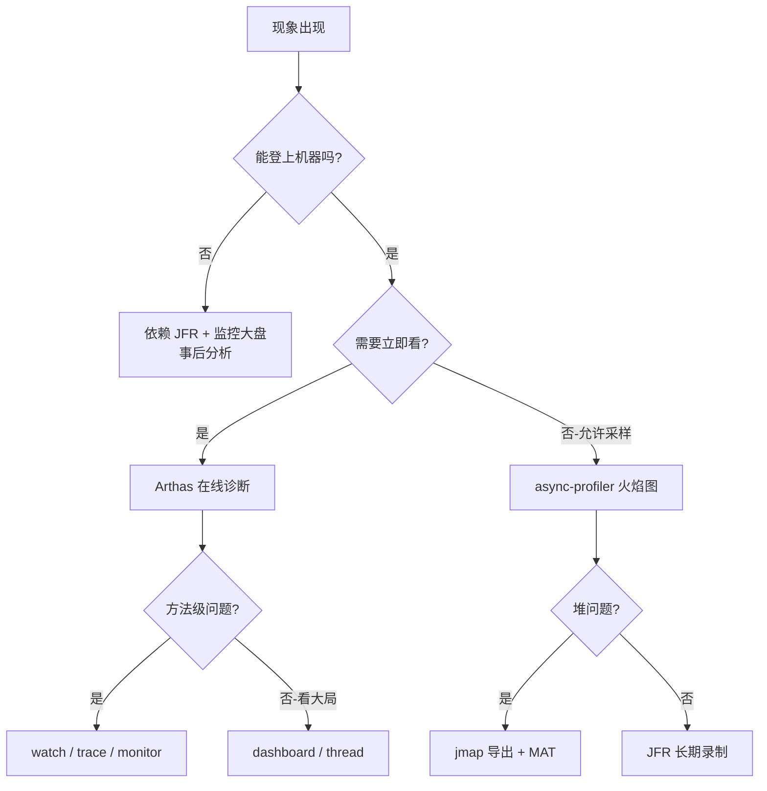

# 07.JVM性能诊断工具链

#### 目录介绍
- [1. 案例引入](#1-案例引入)
  - [1.1 一次诡异告警](#11-一次诡异告警)
  - [1.2 顺藤摸到工具](#12-顺藤摸到工具)
  - [1.3 我们要回答什么](#13-我们要回答什么)
- [2. 工具链全景图](#2-工具链全景图)
  - [2.1 五大诊断维度](#21-五大诊断维度)
  - [2.2 工具能力矩阵](#22-工具能力矩阵)
  - [2.3 选型决策树](#23-选型决策树)
- [3. 命令行四件套](#3-命令行四件套)
  - [3.1 jps定位进程](#31-jps定位进程)
  - [3.2 jstat看GC脉搏](#32-jstat看gc脉搏)
  - [3.3 jstack抓线程栈](#33-jstack抓线程栈)
  - [3.4 jmap导堆快照](#34-jmap导堆快照)
- [4. jcmd瑞士军刀](#4-jcmd瑞士军刀)
  - [4.1 一统老命令](#41-一统老命令)
  - [4.2 常用子命令](#42-常用子命令)
  - [4.3 NMT原生跟踪](#43-nmt原生跟踪)
- [5. JFR飞行记录](#5-jfr飞行记录)
  - [5.1 黑匣子设计](#51-黑匣子设计)
  - [5.2 事件驱动架构](#52-事件驱动架构)
  - [5.3 启动与采集](#53-启动与采集)
  - [5.4 JMC可视化分析](#54-jmc可视化分析)
- [6. Arthas在线诊断](#6-arthas在线诊断)
  - [6.1 Attach机制原理](#61-attach机制原理)
  - [6.2 watch追入参出参](#62-watch追入参出参)
  - [6.3 trace定位耗时](#63-trace定位耗时)
  - [6.4 jad反编译实战](#64-jad反编译实战)
- [7. 火焰图分析](#7-火焰图分析)
  - [7.1 火焰图怎么看](#71-火焰图怎么看)
  - [7.2 async-profiler](#72-async-profiler)
  - [7.3 CPU火焰图实战](#73-cpu火焰图实战)
  - [7.4 内存分配火焰图](#74-内存分配火焰图)
- [8. 堆内存深析](#8-堆内存深析)
  - [8.1 MAT支配树](#81-mat支配树)
  - [8.2 OQL查询语法](#82-oql查询语法)
  - [8.3 内存泄漏典型形态](#83-内存泄漏典型形态)
- [9. 容器与云原生](#9-容器与云原生)
  - [9.1 容器内的陷阱](#91-容器内的陷阱)
  - [9.2 K8s下的诊断](#92-k8s下的诊断)
  - [9.3 远程调试通道](#93-远程调试通道)
- [10. 综合案例串讲](#10-综合案例串讲)
  - [10.1 案例真相揭晓](#101-案例真相揭晓)
  - [10.2 一次故障的一生](#102-一次故障的一生)
  - [10.3 设计哲学回扣](#103-设计哲学回扣)
  - [10.4 工具链速查表](#104-工具链速查表)


## 1. 案例引入

### 1.1 一次诡异告警

凌晨 3 点，订单服务告警：**P99 接口耗时从 80 ms 飙到 2.3 s，CPU 占用率 95%，但 QPS 不升反降**。运维同事按惯例先重启——一小时后又来一次，**而且每次发作前 GC 频率会先上升**。

业务代码近一个月没动，**唯一的变更是一周前升级了某个 RPC 客户端的小版本**。研发排查到 Redis、DB 都没问题，业务日志看不出名堂。问题落到我们手里：

```
症状①：CPU 95%，但 top 看不出热点
症状②：P99 飙升 28 倍，P50 几乎没变
症状③：发作前 5 分钟 Young GC 频率从 2 次/min 涨到 30 次/min
症状④：堆内存使用曲线锯齿越来越密集
症状⑤：FullGC 一次都没有
症状⑥：重启 1 小时后必现
```

**光看应用日志，毫无头绪**——业务代码什么都没改，怎么会诡异成这样？

### 1.2 顺藤摸到工具

我们按"线上诊断五步法"展开：

```
第 1 步：先看进程是否还活着         → jps
第 2 步：GC 是不是在拖后腿？        → jstat -gcutil
第 3 步：哪些线程在抢 CPU？         → jstack + top -H
第 4 步：堆里到底囤了什么对象？      → jmap + MAT
第 5 步：具体哪个调用路径热？        → async-profiler 火焰图
```

实际现场跑下来：
- `jstat` 显示 Eden 区每秒被打满一次，Survivor 频繁晋升老年代
- `jstack` 抓到 80% 业务线程都卡在 `RpcClient.send → Object.wait`
- `jmap -histo` 显示 `RpcRequest` 对象数量是预期的 1000 倍
- 火焰图显示 `RpcClient.serialize` 一个方法占了 60% CPU 时间
- 反编译新版本 RpcClient 一看：**新版的连接池被改成"按请求 new"——每次都新建一份序列化器**

光靠 IDE + 日志根本看不出这条线。**整套工具链就是 Java 程序员的"X 光机 + B 超 + CT"**——它们让你看见 JVM 内部正在发生什么。

带着这个故事，我们至少要回答 7 个问题：

```
① jps/jstat/jstack/jmap 各自看什么？分工边界在哪？        → 第3章
② jcmd 是什么？为什么号称"老命令的统一入口"？             → 第4章
③ JFR 黑匣子和传统 profiler 有什么本质差别？              → 第5章
④ Arthas 凭什么不重启就能改方法、看入参？                  → 第6章
⑤ 火焰图为什么是性能分析的"事实标准"？怎么读？             → 第7章
⑥ MAT 的支配树和直接引用链有什么区别？                    → 第8章
⑦ 容器/K8s 环境下，为什么经典工具会"失灵"？               → 第9章
```

### 1.3 我们要回答什么

第 15 篇要把这 7 个问题全部讲透。读完之后再遇到类似线上事故，**你能在 30 分钟内把诊断动作做完一遍并定位到根因**，而不是干等着"重启再看"。

本篇路线：

```
工具链全景 (第2章)
    ↓
命令行四件套 (第3章) ─→ jps/jstat/jstack/jmap
    ↓
jcmd 瑞士军刀 (第4章)  ─→ 替代老命令 + NMT
    ↓
JFR 黑匣子 (第5章)    ─→ 永远在线的低开销采样
    ↓
Arthas (第6章)        ─→ 不重启的运行时神探
    ↓
火焰图 (第7章)        ─→ async-profiler 的双轴 (CPU + 内存)
    ↓
MAT 堆分析 (第8章)    ─→ 支配树 / OQL / 泄漏定位
    ↓
容器与云原生 (第9章)  ─→ 线上的特殊战场
    ↓
综合案例 (第10章)
```


## 2. 工具链全景图

### 2.1 五大诊断维度

JVM 出问题，本质上落到 5 个维度：

```
┌──────────────────────────────────────────────────────┐
│                    JVM 进程                          │
│                                                      │
│   ┌─────────┐  ┌─────────┐  ┌─────────┐  ┌────────┐ │
│   │  CPU    │  │  内存    │  │  线程    │  │  IO    │ │
│   │  热点    │  │  泄漏    │  │  阻塞    │  │  阻塞  │ │
│   └─────────┘  └─────────┘  └─────────┘  └────────┘ │
│                                                      │
│   ┌────────────────────────────────────────────────┐│
│   │           类加载 / JIT / GC                     ││
│   └────────────────────────────────────────────────┘│
└──────────────────────────────────────────────────────┘
```

每个维度都有一组对应工具。**先归类再查工具**，比"从工具反推问题"高效得多。

### 2.2 工具能力矩阵

| 维度 | 命令行 | jcmd | JFR | Arthas | 火焰图 | MAT |
|---|---|---|---|---|---|---|
| **GC 行为** | jstat | GC.* | ✅ | dashboard | ⚪ | ⚪ |
| **CPU 热点** | top -H | ⚪ | ✅ | profiler | ✅ | ⚪ |
| **线程阻塞** | jstack | Thread.print | ✅ | thread | ⚪ | ⚪ |
| **堆内存** | jmap | GC.heap_dump | ✅ | heapdump | ⚪ | ✅ |
| **内存分配** | ⚪ | ⚪ | ✅ | ⚪ | ✅ | ⚪ |
| **类加载** | jstat -class | VM.classloader | ✅ | sc/sm | ⚪ | ⚪ |
| **JIT 行为** | ⚪ | Compiler.* | ✅ | ⚪ | ⚪ | ⚪ |
| **方法调用** | ⚪ | ⚪ | 部分 | watch/trace | ✅ | ⚪ |
| **本地内存** | ⚪ | NMT | 部分 | ⚪ | ⚪ | ⚪ |

✅=擅长 ⚪=不支持

### 2.3 选型决策树



**实战建议**：
- 紧急排查 → Arthas（5 秒内开干）
- 性能分析 → async-profiler（最低开销火焰图）
- 长期观测 → JFR（生产可常开）
- 内存泄漏 → jmap + MAT
- GC 问题 → jstat / GC 日志 / JFR

后续章节按这个分类逐一展开。


## 3. 命令行四件套

JDK 自带的 `jps/jstat/jstack/jmap` 是最古老但**永远管用**的工具。它们的最大价值是：**任何 JDK 安装包里都有，登上机器立即能用，不依赖任何外部组件**。

### 3.1 jps定位进程

`jps` 是 Java 版的 `ps`：

```bash
$ jps -lvm
12345 com.foo.OrderService -Xms4g -Xmx4g -XX:+UseG1GC
12678 sun.tools.jps.Jps -lvm -Dapplication.home=/opt/jdk
13012 com.foo.PaymentService -Xms2g -Xmx2g

# 参数
# -l : 显示主类全限定名
# -v : 显示 JVM 启动参数
# -m : 显示传给 main 的参数
```

**比 ps 强在哪**：
1. 直接显示主类（不是一堆 `java -cp ...` 看不懂）
2. 显示 JVM 参数（堆大小、GC 类型一目了然）
3. 跨用户友好（容器里 PID namespace 隔离时仍可用）

**容器里的注意点**：`jps` 依赖 `/tmp/hsperfdata_*`，如果挂载了 `tmpfs` 或者 `-XX:-UsePerfData` 关掉了，jps 就失灵——这时退回 `ps -ef | grep java`。

### 3.2 jstat看GC脉搏

最高频使用的子命令是 `jstat -gcutil`：

```bash
$ jstat -gcutil 12345 1000 10
# 含义：每 1000 ms 采样一次，连续 10 次

  S0      S1      E       O       M      CCS     YGC    YGCT    FGC    FGCT     GCT
  0.00   89.72   23.45   45.12   97.42   95.31    342    8.521     2    0.412    8.933
  0.00   89.72   45.67   45.12   97.42   95.31    342    8.521     2    0.412    8.933
 89.72    0.00    0.00   45.34   97.42   95.31    343    8.553     2    0.412    8.965
```

| 列 | 含义 |
|---|---|
| S0/S1 | Survivor 0/1 区使用率 % |
| E | Eden 区使用率 % |
| O | Old 区使用率 % |
| M | Metaspace 使用率 % |
| CCS | 压缩类空间使用率 % |
| YGC | Young GC 次数 |
| YGCT | Young GC 累计耗时（秒） |
| FGC | Full GC 次数 |
| FGCT | Full GC 累计耗时 |
| GCT | 总 GC 时间 |

**怎么读**：
- E 在 0~100% 之间快速循环 → Young GC 正常
- O 持续上涨且 FGC 后下不去 → 内存泄漏
- YGC 次数飞涨但 YGCT 增量小 → Eden 设置过小
- M 持续上涨 → 类加载泄漏（CGLIB / 热部署常见）

回扣案例：第 1 章那个"YGC 频率从 2 次/min 涨到 30 次/min"就是用这条命令看出来的。

### 3.3 jstack抓线程栈

jstack 的真正用法是**抓多份做时序对比**：

```bash
# 5 秒内连续抓 3 份
for i in 1 2 3; do
    jstack 12345 > stack-$i.txt
    sleep 2
done

# 然后对比哪些线程一直卡在同一行——那就是问题点
```

**线程状态速记**：

| 状态 | 代码层语义 | 常见栈顶 |
|---|---|---|
| RUNNABLE | 真在跑 OR 阻塞在 IO | `socketRead0` / 业务方法 |
| BLOCKED | synchronized 等锁 | `monitorenter` |
| WAITING | wait/park | `Object.wait` / `LockSupport.park` |
| TIMED_WAITING | sleep / 限时 wait | `Thread.sleep` / `parkNanos` |

**关键技巧**：

```bash
# 找出 CPU 最高的 Java 线程
top -H -p 12345               # 拿到 nid（十进制）
printf "%x\n" 12567           # 转 16 进制

# 在 jstack 输出里搜 nid=0x3117 → 直接定位到罪犯
```

**死锁检测**：jstack 末尾会自动打印 `Found one Java-level deadlock:`，直接给出涉及锁和线程，省得自己看。

### 3.4 jmap导堆快照

`jmap` 现在主要剩两个用法：

```bash
# 直方图（轻量，无需 dump 整个堆）
$ jmap -histo:live 12345 | head -20

 num     #instances         #bytes  class name
   1:       1234567      123456789  [B
   2:        345678       45678901  java.lang.String
   3:         12345        1234567  com.foo.RpcRequest    ← 案例里的罪犯
   ...

# 完整 dump（重量，会触发一次 Full GC，生产慎用）
$ jmap -dump:format=b,file=heap.hprof,live 12345
```

**生产环境的告警**：`jmap -dump` 在 8GB 堆上能 STW 数十秒。**生产环境应该用 `-XX:+HeapDumpOnOutOfMemoryError` 让 JVM 自己在 OOM 时写出**，而不是手动触发。

**对比 jcmd 的 GC.heap_dump**：jcmd 的 dump 走相同底层 API，但**不会让 jmap 进程的 PID 出现在系统日志**——更适合自动化脚本。


## 4. jcmd瑞士军刀

### 4.1 一统老命令

JDK 8 之后官方推荐用 `jcmd` 替代 `jstack/jmap/jinfo` 等老工具。**为什么**：

**疑惑**：老工具用得好好的，为什么还要再造一个 jcmd？

**论证**：
1. **协议统一**：老工具各自走 attach API、PerfData、SA-Agent 三种通道，互相不一致；jcmd 全部走 attach API
2. **远程支持**：jcmd 子命令可以通过 JMX 远程触发，老工具只能本地
3. **更安全**：老命令 `jmap -F`（强制模式）会暂停 JVM 数十秒，jcmd 没有 -F
4. **能力可扩展**：新功能（NMT、JFR、Compiler.*）只在 jcmd 提供
5. **官方明示**：JDK 21 已把 `jstack` 标记为 deprecated，给出的迁移路径就是 `jcmd <pid> Thread.print`

**结论**：jcmd 不是简单的"老命令套壳"，而是**JVM 诊断协议的统一收口**。今天写新脚本，应该首选 jcmd。

### 4.2 常用子命令

```bash
# 列出所有可用子命令
$ jcmd 12345 help

# 线程栈（替代 jstack）
$ jcmd 12345 Thread.print

# 堆 dump（替代 jmap）
$ jcmd 12345 GC.heap_dump /tmp/heap.hprof

# 类直方图（替代 jmap -histo）
$ jcmd 12345 GC.class_histogram

# 主动触发 GC（替代 jmap -histo:live）
$ jcmd 12345 GC.run

# JVM 参数信息（替代 jinfo）
$ jcmd 12345 VM.flags
$ jcmd 12345 VM.system_properties

# JIT 编译统计
$ jcmd 12345 Compiler.codecache
$ jcmd 12345 Compiler.queue

# 类加载器树
$ jcmd 12345 VM.classloaders
```

### 4.3 NMT原生跟踪

**Native Memory Tracking** 是 jcmd 独有的杀器，用来排查"堆没满，但进程内存爆炸"问题。

```bash
# 启动时开启
java -XX:NativeMemoryTracking=summary -jar app.jar

# 查询
$ jcmd 12345 VM.native_memory summary

Total: reserved=4892428KB, committed=4892428KB
   - Java Heap (reserved=4194304KB, committed=4194304KB)
   - Class (reserved=1099912KB, committed=78912KB)
   - Thread (reserved=132588KB, committed=132588KB)        ← 线程栈空间
   - Code (reserved=255168KB, committed=42368KB)           ← CodeCache
   - GC (reserved=287736KB, committed=287736KB)
   - Compiler (reserved=185KB, committed=185KB)
   - Internal (reserved=2456KB, committed=2456KB)
   - Symbol (reserved=21672KB, committed=21672KB)
   - Native Memory Tracking (reserved=2789KB, committed=2789KB)
```

**为什么重要**：

```
Linux 看到的进程 RSS = Java Heap + Metaspace + Thread Stacks 
                    + CodeCache + GC 元数据 + DirectByteBuffer
                    + JNI 分配 + glibc 内存碎片
```

只有 NMT 能拆解前 6 项；后两项要靠 `pmap` + `jemalloc` profile。

**经典场景**：堆 4 GB，物理内存 12 GB，多出来的 8 GB 哪儿去的？NMT 一查，发现 Thread 占了 6 GB——某处线程池忘了限制大小，开了 6000 个线程，每个 1 MB 栈。


## 5. JFR飞行记录

### 5.1 黑匣子设计

JFR (Java Flight Recorder) 借鉴飞机黑匣子设计：**永远在录、覆盖式存储、关键时刻回看**。

**疑惑**：传统 profiler 也能采样，为什么需要 JFR？

**论证**：
1. **开销极低**：JFR 默认配置开销 < 1%，传统 sampling profiler 起步 5%
2. **生产可常开**：阿里、亚马逊都把 JFR 默认打开，事故时直接拉文件
3. **JVM 内核级集成**：可以采到 GC 内部事件、类加载、JIT 编译动作——这些都是用户态 profiler 看不到的
4. **事件粒度可调**：从 100 ns（细） 到 1 s（粗），按需折中
5. **OpenJDK 11 起免费**：之前是 Oracle 商业特性，现在所有 JDK 11+ 都自带

**结论**：JFR 是**生产环境监控的事实标准**——它解决了"问题发生那一刻没人在采样"的根本痛点。

### 5.2 事件驱动架构

JFR 的核心抽象是"事件"：JVM 内部预定义了 ~150 种事件，每种事件有自己的字段和触发频率：

```
事件类型分类：
├── 持续型（Duration）   ：方法执行、GC 暂停、锁等待
├── 即时型（Instant）    ：类加载、异常抛出、线程启动
├── 采样型（Sample）     ：Method Profiling 每 10 ms 采样一次
└── 周期型（Periodic）   ：CPU 使用率、堆使用率每秒采样
```

**自定义事件**：

```java
import jdk.jfr.*;

@Name("com.foo.OrderProcessed")
@Label("Order Processed")
@Category("Business")
public class OrderEvent extends Event {
    @Label("Order ID")
    long orderId;
    
    @Label("Amount") @DataAmount(DataAmount.BYTES)
    long amount;
}

// 业务代码
OrderEvent e = new OrderEvent();
e.begin();
processOrder(...);
e.orderId = orderId;
e.amount = amount;
e.commit();             // 写入 JFR 缓冲区
```

业务事件和 JVM 事件**走同一套录制管道**——这是 JFR 区别于其他 APM 的关键。

### 5.3 启动与采集

**两种启动方式**：

```bash
# 方式一：进程启动时开启（默认配置 default.jfc）
java -XX:+FlightRecorder \
     -XX:StartFlightRecording=duration=60s,filename=app.jfr \
     -jar app.jar

# 方式二：jcmd 运行中触发
jcmd 12345 JFR.start name=urgent duration=2m filename=urgent.jfr
jcmd 12345 JFR.dump name=urgent filename=now.jfr
jcmd 12345 JFR.stop name=urgent
```

**两套预设配置**：

| 配置 | 开销 | 用途 |
|---|---|---|
| `default.jfc` | < 1% | 生产长期开启 |
| `profile.jfc` | 2~3% | 故障重现期短期开 |

### 5.4 JMC可视化分析

JFR 文件用 **JDK Mission Control (JMC)** 打开：

```
JMC 主要面板：
├── 概览：CPU/堆/GC 时间轴
├── Java Application：方法热点、内存分配热点
├── JVM 内部：JIT/类加载/CodeCache
├── 环境：系统 CPU、内存、IO
└── 事件浏览器：自定义事件 + 全部原始事件
```

**杀手级特性**：**Automated Analysis Results**——JMC 内置规则引擎，自动检测出"过度同步"、"低效 GC 配置"、"潜在内存泄漏"等问题，直接给修复建议。**这是 Oracle 把 20 年的运维经验固化在工具里**。


## 6. Arthas在线诊断

### 6.1 Attach机制原理

Arthas 是阿里开源的运行时诊断利器。**它的神奇之处**：不重启进程，就能改方法、查入参、反编译类。

**疑惑**：Arthas 凭什么能做到？

**论证**：

```
Arthas 客户端                    目标 JVM 进程
    │                                │
    │  attach 命令                   │
    ├─────────────────────────►     │
    │   (通过 Attach API)            │
    │                                │
    │                       ┌────────▼────────┐
    │                       │ Instrumentation │
    │                       │     Agent       │
    │                       └─────────────────┘
    │                                │
    │                       通过字节码增强
    │                       动态修改方法
    │                                │
    └────── Telnet/HTTP ◄────────────┘
              交互
```

底层依赖三件套：
1. **Attach API**：JDK 5 起的 `com.sun.tools.attach.VirtualMachine`，可让外部进程 attach 到 JVM
2. **Instrumentation API**：JDK 5 起的 `java.lang.instrument`，允许 Agent 修改已加载类的字节码
3. **ASM 字节码框架**：Arthas 内部用 ASM 织入"前置/后置/异常"切面

**结论**：Arthas 不是黑魔法，它走的是 JVM 官方支持的 Agent 机制（详见第 33 篇）。它的功能上限受 Instrumentation 约束——比如**不能修改方法签名**，只能改方法体。

### 6.2 watch追入参出参

```bash
$ arthas-boot.jar
[INFO] Arthas remote attached, success!
$ watch com.foo.OrderService createOrder '{params, returnObj}' -x 3

method=com.foo.OrderService.createOrder location=AtExit
ts=2026-05-29 14:32:11; [cost=12.337ms] result=@ArrayList[
    @Object[][
        @Long[123456],
        @String[张三],
        @BigDecimal[99.5],
    ],
    @Order[id=123456, status=PAID, amount=99.5],
]
```

**参数说明**：
- `'{params, returnObj}'` 是 OGNL 表达式，决定打印什么
- `-x 3` 控制对象展开深度
- `-e` 只在抛异常时打印
- `-c 30` 30 秒后自动停止

**实战用法**：

```bash
# 只看耗时 > 100ms 的调用
watch com.foo.OrderService createOrder '{params, returnObj}' '#cost > 100'

# 只看抛了 RpcException 的调用
watch com.foo.RpcClient send '{params, throwExp}' -e
```

### 6.3 trace定位耗时

```bash
$ trace com.foo.OrderService createOrder

`---ts=2026-05-29 14:35:23;thread_name=http-nio-8080-exec-1;id=42;is_daemon=true;priority=5;
    `---[120.345ms] com.foo.OrderService:createOrder()
        +---[2.123ms] com.foo.OrderValidator:validate() #45
        +---[18.567ms] com.foo.UserDao:findById() #46
        +---[95.123ms] com.foo.RpcClient:send() #47        ← 罪魁祸首
        `---[4.532ms] com.foo.OrderDao:save() #48
```

**在 1 秒内你就知道**：120 ms 的总耗时里，95 ms 花在 RpcClient.send 上。继续往里钻：

```bash
$ trace com.foo.RpcClient send -n 5
# trace 5 次后自动停止，避免影响生产
```

### 6.4 jad反编译实战

回到第 1 章案例——升级了 RPC 客户端版本，但本地 jar 已被打包到镜像，没法用 IDE 反编译。Arthas 直接现场反编译运行中的类：

```bash
$ jad com.foo.RpcClient send

/*
 * Decompiled with CFR.
 */
public Object send(RpcRequest req) {
    Serializer serializer = new Kryo();        // ← 看到了！每次 new
    byte[] data = serializer.serialize(req);
    ...
}

# 与 git 上的旧版对照：
public Object send(RpcRequest req) {
    Serializer serializer = SERIALIZER_POOL.borrow();   // 旧版有池
    try { ... } finally { SERIALIZER_POOL.release(); }
}
```

**问题彻底定位**：新版去掉了序列化器池，每次请求都创建一个 Kryo（Kryo 初始化成本极高，且大量临时对象进 Eden）。后续解决也很简单——降级或者打补丁。


## 7. 火焰图分析

### 7.1 火焰图怎么看

火焰图是 Brendan Gregg 发明的可视化形式，**已成事实标准**：

```
                                                  
   ┌───────────────────────────────────┐           
   │           main()                  │   ← 顶层 60% 宽
   ├──────────┬─────────────┬──────────┤           
   │ doA()    │   doB()     │  doC()   │           
   ├──────────┼──────┬──────┼──────────┤           
   │ ...      │ a()  │ b()  │   ...    │           
   └──────────┴──────┴──────┴──────────┘           
                  ↑       ↑                        
                  │       │                        
               热点候选  另一热点                    
```

**两条核心规则**：
1. **宽度 = CPU 时间占比**（或样本数占比），越宽越热
2. **纵向 = 调用栈，自下而上**

**怎么找热点**：盯着每个**水平方向最宽的"高原"**，那就是 CPU 在那里逗留最久的路径。

### 7.2 async-profiler

`async-profiler` 是当前最好的 Java profiler：

| 维度 | async-profiler | jstack 抓栈 | JFR Method Profiling |
|---|---|---|---|
| 采样原理 | perf_events + AsyncGetCallTrace | 全量 dump 栈 | 安全点采样 |
| 开销 | < 1% | 5%~10% | 1%~3% |
| 是否有"安全点偏差" | 否 | 否 | 是 |
| 内核栈 | 支持 | 不支持 | 不支持 |
| 内存分配 profile | 支持 | 不支持 | 支持 |

**关键优势**：用 `AsyncGetCallTrace`（HotSpot 内部 API）绕开了"安全点偏差"——传统 profiler 只能在安全点采样，导致在安全点之间运行的代码（如紧凑循环、大数组拷贝）**永远抓不到**，profile 失真。

### 7.3 CPU火焰图实战

```bash
# 下载并启动采样 30 秒
$ ./profiler.sh -d 30 -f cpu.html 12345

# 浏览器打开 cpu.html
```

回到案例：cpu.html 里我们看到一个 60% 宽的高原：

```
java/lang/Thread.run
└── http-nio request handler
    └── OrderController.create
        └── OrderService.createOrder
            └── RpcClient.send                           ← 占 60%
                └── RpcClient.serialize          ── 55%
                    └── com.esotericsoftware.kryo.Kryo.<init>  ── 50% ← 罪魁
```

**结论一目了然**：每次 send 都构造一个新的 Kryo，Kryo 构造里要扫描类、注册序列化器，单次 ms 级别——和 jad 反编译看到的现象**完全对应**。

### 7.4 内存分配火焰图

`async-profiler` 还能采"分配热点"：

```bash
$ ./profiler.sh -d 30 -e alloc -f alloc.html 12345
```

输出告诉你每行 Java 代码累计分配了多少字节：

```
                                                  
   ┌─────────────────────────────────┐             
   │         GC eden 占用               │             
   ├──────────┬──────────────────────┤             
   │ Kryo.new │ RpcRequest.new       │             
   │ (90%)    │ (10%)                │             
   └──────────┴──────────────────────┘             
```

**Kryo.new 占了 90% 的分配字节**——这就是为什么 Eden 一秒一爆、YGC 飙到 30 次/min 的根因。**CPU 火焰图 + 分配火焰图叠加**，问题瞬间穿透。


## 8. 堆内存深析

当 jmap 导出的 heap dump 摆在面前时，工具就是 **MAT (Memory Analyzer Tool)**。

### 8.1 MAT支配树

**支配树**（Dominator Tree）是 MAT 最核心的概念。

**疑惑**：直接看引用链不够吗？为什么要发明"支配树"？

**论证**：

考虑两个对象 A、B 都引用大数组 X：

```
   A ──┐
       ├──► X (100MB)
   B ──┘
```

如果只看 A 的"保留集"——就是"删除 A 后能被 GC 回收的所有对象"——发现**X 不算**，因为 B 还引用 X。同理 B 的保留集也不含 X。**两个对象单看都"不大"，但 X 实际占 100MB 没人能放手。**

支配树解决了这个问题。一个对象 A **支配** 对象 X，当且仅当**所有从 GC Root 到 X 的路径都必经过 A**。在支配树视图下：

```
     GC Root
        │
        ▼
  Common Ancestor (双方都依赖的上游)
        │
        ▼
        X (100MB)  ← 真正应该被关注的"重头"
```

**结论**：支配树告诉你"如果某个对象消失，能省多少内存"——这才是真正可行动的指标。MAT 默认按 Retained Heap 降序——直接看头部即可定位"内存大户"。

### 8.2 OQL查询语法

MAT 内置类 SQL 的对象查询语言：

```sql
-- 找所有 String 内容长度超过 1000 的
SELECT s, s.toString() FROM java.lang.String s 
WHERE s.value.@length > 1000

-- 找所有 ArrayList 容量超过 10000 的
SELECT a, a.size, a.elementData.@length 
FROM java.util.ArrayList a 
WHERE a.elementData.@length > 10000

-- 找特定类的所有实例数和总大小
SELECT classof(o).@name AS klass, COUNT(*) AS num
FROM com.foo.RpcRequest o
```

OQL 是定位**具体业务对象异常**的利器——堆里几百万 String，肉眼根本看不出哪条有问题，OQL 一查就定位到。

### 8.3 内存泄漏典型形态

**形态 1：静态集合越长越大**

```java
public class Cache {
    static Map<String, byte[]> cache = new HashMap<>();    // 静态，永不释放
    public static void put(String k, byte[] v) {
        cache.put(k, v);                                   // 只 put 不 evict
    }
}
```

MAT 表现：HashMap → Node[] → 无数 Node 实例。Retained Heap 飙升。

**形态 2：ThreadLocal 忘记 remove**

```java
private static ThreadLocal<BigContext> CTX = new ThreadLocal<>();

public void handle() {
    CTX.set(new BigContext());          // 进来设
    doBusiness();
    // 走的时候忘了 CTX.remove()
}
```

线程池场景下尤其致命——线程不死，ThreadLocalMap 不清，内存只增不减。MAT 表现：每个 Worker 线程的 ThreadLocalMap.Entry[] 越来越大。

**形态 3：监听器/回调注册不解绑**

```java
eventBus.register(this);     // register 后引用进入 EventBus
// 业务结束没 unregister，this 永远活着
```

**形态 4：内部类持有外部类引用**

```java
class Outer {
    void schedule() {
        executor.scheduleAtFixedRate(new Runnable() {     // 匿名内部类
            @Override public void run() { ... }            // 隐式持有 Outer.this
        }, 0, 1, MINUTES);
    }
}
// Outer 实例理论上能 GC，但 ScheduledFuture 持有 Runnable，Runnable 持有 Outer.this
```

四种形态加起来覆盖了 80% 的 Java 内存泄漏。MAT 的"Leak Suspects Report"会自动归类到这几种。


## 9. 容器与云原生

### 9.1 容器内的陷阱

**疑惑**：传统工具到容器里就出问题，为什么？

**论证**：

1. **CPU 数感知错误**：JDK 8u131 之前，`Runtime.availableProcessors()` 看到的是宿主机核心数，不是容器 cgroup 限制。导致 ForkJoinPool、ParallelStream 开线程过多
2. **内存感知错误**：同样问题，旧 JDK 用宿主机内存算 `MaxRAMFraction`，分到容器里就 OOM
3. **PID namespace**：容器内 PID 1 是应用，主机上 PID 不同——`jps` 给的是宿主机 PID 的话工具串不起来
4. **`/tmp` 隔离**：jps 依赖 `/tmp/hsperfdata_*`，容器和宿主机 `/tmp` 不互通
5. **Attach API 失败**：跨容器 attach 必须共享 PID namespace（Pod 内 sidecar 模式才行）

**结论**：JDK 10 之后引入 `-XX:+UseContainerSupport`（默认开启），上述前两个问题缓解；但 PID namespace、/tmp 隔离、attach 跨容器仍然要靠运维设计解决。

### 9.2 K8s下的诊断

**推荐架构**：

```
┌─────────────── Pod ───────────────┐
│  ┌────────────┐   ┌────────────┐ │
│  │ App        │   │ Diag       │ │
│  │ Container  │   │ Sidecar    │ │
│  │            │   │ (Arthas)   │ │
│  └────────────┘   └────────────┘ │
│       共享 PID namespace          │
│       共享 /tmp volume            │
└──────────────────────────────────┘
```

Sidecar 容器装好 Arthas/工具链，通过 `shareProcessNamespace: true` 共享 PID，应用容器保持精简。出问题时 `kubectl exec` 进 sidecar 即可。

**或者更轻**：使用 `kubectl debug` 临时注入诊断容器：

```bash
kubectl debug -it pod/order-service-abc123 \
    --image=alibabacloud/arthas:latest \
    --target=order-service \
    --share-processes
```

### 9.3 远程调试通道

```bash
# JVM 启动开 JMX
-Dcom.sun.management.jmxremote
-Dcom.sun.management.jmxremote.port=9010
-Dcom.sun.management.jmxremote.authenticate=false   # 仅内网
-Dcom.sun.management.jmxremote.ssl=false

# 远程 jcmd / jconsole / VisualVM 连接 9010 即可
```

**JFR 远程 dump**：

```bash
# 让 K8s 里的 Pod 把 JFR 文件吐到 OSS
jcmd 1 JFR.dump filename=/tmp/dump.jfr
kubectl cp order-pod:/tmp/dump.jfr ./dump.jfr
```

JFR 文件离线分析，**不占线上 CPU**——这是 JFR 在云原生场景下的核心价值。


## 10. 综合案例串讲

### 10.1 案例真相揭晓

回到第 1 章那次诡异告警，第 1 章列了 7 个疑问，逐条作答：

**疑问 ①：jps/jstat/jstack/jmap 各自看什么？**
→ 第 3 章。jps 找进程、jstat 看 GC 心电图、jstack 抓线程栈、jmap 看堆快照。**四件套是登上机器后的肌肉记忆**。回到案例：用 jstat 看到 YGC 异常飙升，用 jstack 看到大量线程在 RPC 调用栈上，用 jmap -histo 看到 RpcRequest 实例数 1000 倍——三招就锁定方向。

**疑问 ②：jcmd 凭什么是统一入口？**
→ 第 4 章。它把老命令统一到 attach API，加上独占的 NMT 和 JFR 控制能力，是新脚本的首选。**老命令未来会被 deprecated**。

**疑问 ③：JFR 黑匣子和传统 profiler 本质差别？**
→ 第 5 章。JFR 开销极低（< 1%）、JVM 内核级集成、生产可常开。它不是"问题发生才采"，而是"永远在采"——这从根本上改变了诊断范式。

**疑问 ④：Arthas 凭什么不重启就能改方法？**
→ 第 6 章。Arthas = Attach API + Instrumentation + ASM。**走的是 JVM 官方 Agent 通道**，没有黑魔法。但受 Instrumentation 限制，不能改方法签名。回到案例：jad 命令现场反编译 RpcClient，找出"序列化器没池化"的真相。

**疑问 ⑤：火焰图怎么看？**
→ 第 7 章。横向宽度看 CPU 占比，纵向看调用栈。盯最宽的高原。**async-profiler 解决了安全点偏差**，是当前最准的工具。回到案例：火焰图 60% 宽的高原指向 `Kryo.<init>`，与 jad 反编译结果对照——闭环。

**疑问 ⑥：MAT 支配树和直接引用链区别？**
→ 第 8.1 节。直接引用链让你看见"谁引用我"；支配树让你看见"删了我能省多少"。后者才是泄漏定位的真正抓手。

**疑问 ⑦：容器/K8s 下经典工具为什么失灵？**
→ 第 9 章。CPU/内存感知、PID namespace、/tmp 隔离、attach 跨容器是四大坑。解决方案：sidecar 共享 PID + 共享 /tmp，或者 `kubectl debug` 临时注入。

**根本症结**：那次故障的根因是新版 RpcClient 砍掉序列化器池，看似优雅的简化引爆了**对象分配 → Eden 满 → 频繁 YGC → 应用线程被 STW 拖累 → P99 飙升**这条因果链。**单凭日志根本看不出来**，必须用工具把 JVM 内部展开看。整个排查路径：

```
jstat → 发现 YGC 异常 (3.2)
   ↓
jstack → 发现线程都堵在 RpcClient.send (3.3)
   ↓
jmap -histo → 发现 RpcRequest 实例数 1000x (3.4)
   ↓
async-profiler → 火焰图指向 Kryo.<init> (7.3)
   ↓
Arthas jad → 反编译看到去掉了序列化器池 (6.4)
   ↓
async-profiler -e alloc → Kryo 占 90% 分配 (7.4)
   ↓
根因定位 + 降级回滚
```

整个过程 **30 分钟内可以结束**——前提是工具链熟练。

### 10.2 一次故障的一生

把这次故障从触发到回滚串成完整时间线，回扣 01~15 篇要素：

```
T-1 周  RpcClient 升级，序列化器池被去掉
        [33篇] Maven 依赖变更，class 重新进入 Metaspace
        [02篇] 类加载器加载新版 RpcClient.class

T 0   流量涌入触发热点路径
        [13篇] send 方法字节码进入解释器
        [14篇] 计数器到阈值，C1→C2 编译

T+5 min 业务积累，每次 send 都 new Kryo
        [01篇] 大量临时对象进入 Eden
        [03篇] Eden 满触发 Minor GC
        [03篇] Survivor 来不及容纳，Object 提前晋升老年代

T+30 min YGC 频率从 2 → 30 次/min
        [本篇 §3.2] jstat -gcutil 看到 E 列高频清零
        [本篇 §7.4] alloc 火焰图显示 Kryo 分配占 90%

T+45 min 应用线程因 STW 累积排队
        [本篇 §3.3] jstack 看到大量 BLOCKED 在 RPC 调用
        [08篇] 部分线程进入锁竞争，锁升级到重量级
        [09篇] CPU 缓存被频繁失效，性能进一步退化

T+50 min 告警触发，运维介入
        [本篇 §3.1] jps 拿到 PID
        [本篇 §6.x] Arthas attach 上去
        [本篇 §6.4] jad 反编译，定位代码差异

T+60 min 根因明确，回滚版本
        [02篇] 类加载器卸载旧 RpcClient（实际上要等元空间 GC）
        [本篇 §8] MAT 复盘 dump，确认无残留泄漏
```

**这条时间线串起本册前 14 篇 80% 的核心知识点**——从类加载到 GC 到 JIT 到锁，最后由本篇的工具链把它们全部"看见"。

### 10.3 设计哲学回扣

跳出技术细节，提炼三条会贯穿全册的设计哲学：

1. **可观测性先于优化**：你看不见的东西没法优化。Java 用 jstat / JFR / NMT / Arthas 把虚拟机内部一层层"剖开"——这种"暴露内部状态"的设计哲学和卷一第 1 篇里堆/栈/方法区"井井有条"的内存模型是一脉相承的：**先把状态明确建模，再让外部能查询**。这同样体现在 ConcurrentHashMap 暴露 `mappingCount`、ThreadPoolExecutor 暴露 `getActiveCount`/`getPoolSize` 等设计上。

2. **代价分层**：不同工具有不同代价（jstat ~ 0%、JFR < 1%、async-profiler 1%、jstack 5%、jmap dump 数十秒 STW）。**没有"最强"的工具，只有"最适合当前代价预算"的工具**。这种"分层"思想和 14 篇的解释器/C1/C2、03 篇的 Young/Old 分代、08 篇的偏向锁/轻量级锁/重量级锁是同构的。

3. **采样优于全量**：JFR、async-profiler、jstat 都是采样型工具。**采样在统计学意义上足够准、代价线性可控、永远在线**。这种"以小博大"的思想后续在 38 篇 LongAdder 分段、05 篇 String.intern 概率优化、20 篇 ConcurrentHashMap.size 估算里会反复出现。

### 10.4 工具链速查表

最后一张表，建议截图保存：

| 场景 | 首选工具 | 命令骨架 | 章节 |
|---|---|---|---|
| 进程列表 | jps | `jps -lvm` | §3.1 |
| GC 心电图 | jstat | `jstat -gcutil <pid> 1000` | §3.2 |
| 线程快照 | jstack / jcmd | `jcmd <pid> Thread.print` | §3.3 / §4.2 |
| 堆直方图 | jmap | `jmap -histo:live <pid>` | §3.4 |
| 堆 dump | jcmd | `jcmd <pid> GC.heap_dump f.hprof` | §4.2 |
| JIT 编译统计 | jcmd | `jcmd <pid> Compiler.codecache` | §4.2 |
| 原生内存 | NMT | `jcmd <pid> VM.native_memory summary` | §4.3 |
| 长期录制 | JFR | `JFR.start duration=2m filename=...` | §5.3 |
| 离线分析 | JMC | 打开 .jfr 文件 | §5.4 |
| 在线诊断 | Arthas | `watch / trace / jad` | §6 |
| CPU 热点 | async-profiler | `./profiler.sh -d 30 -f cpu.html <pid>` | §7.3 |
| 分配热点 | async-profiler | `./profiler.sh -e alloc ...` | §7.4 |
| 内存泄漏 | MAT | 支配树 + Leak Suspects | §8 |
| 容器诊断 | kubectl debug | sidecar 共享 PID + /tmp | §9.2 |

掌握诊断工具链，是从"看代码就发慌"进阶到"线上从容应对"的分水岭。下一篇我们顺着"工具看到了 OOM，那 OOM 到底有几种？"这条线，进入 **第 16 篇：OOM 八大现场全景剖析**——把堆、元空间、直接内存、栈、native 等八种不同的 OutOfMemoryError 一次讲透。
