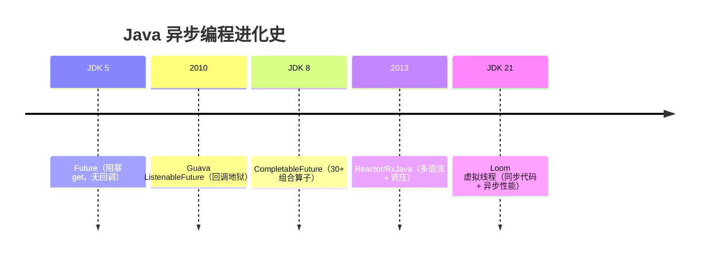
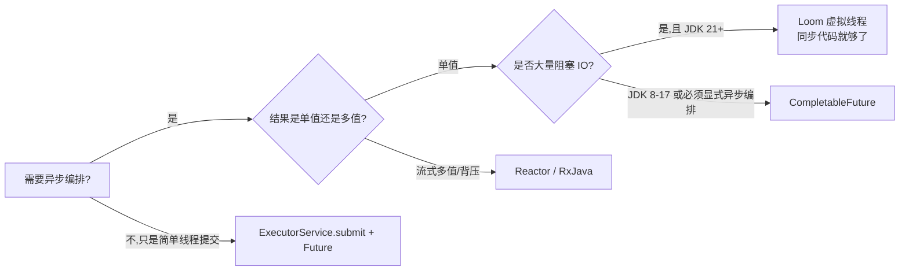

# 39.CompletableFuture异步

#### 目录介绍
- [40.1 开篇困境：3 个 Future.get() 把 RT 从 50ms 拖到 600ms](#401-开篇困境3-个-futureget-把-rt-从-50ms-拖到-600ms)
- [40.2 Future 的进化简史：从阻塞到回调到组合](#402-future-的进化简史从阻塞到回调到组合)
  - [40.2.1 JDK 5 Future：能拿结果，但只能阻塞等](#4021-jdk-5-future能拿结果但只能阻塞等)
  - [40.2.2 Guava ListenableFuture：第一次有"回调"](#4022-guava-listenablefuture第一次有回调)
  - [40.2.3 JDK 8 CompletableFuture：组合算子 + 链式编排](#4023-jdk-8-completablefuture组合算子--链式编排)
  - [40.2.4 Reactor / RxJava：流式响应式](#4024-reactor--rxjava流式响应式)
  - [40.2.5 JDK 21 Loom：虚拟线程下"同步代码"重新崛起](#4025-jdk-21-loom虚拟线程下同步代码重新崛起)
- [40.3 CompletableFuture 全景图与三类 API](#403-completablefuture-全景图与三类-api)
  - [40.3.1 三类 API：创建 / 转换 / 组合](#4031-三类-api创建--转换--组合)
  - [40.3.2 30+ 算子的命名规则：Apply / Accept / Run × Async / 同步 × Either / Both](#4032-30-算子的命名规则apply--accept--run--async--同步--either--both)
  - [40.3.3 Async 后缀的真正含义](#4033-async-后缀的真正含义)
- [40.4 内部状态机源码：Stack 链 + Completion 节点](#404-内部状态机源码stack-链--completion-节点)
  - [40.4.1 result 字段的三态语义](#4041-result-字段的三态语义)
  - [40.4.2 stack 链表：Treiber Stack 管理依赖任务](#4042-stack-链表treiber-stack-管理依赖任务)
  - [40.4.3 一次完整的 thenApply 触发链路](#4043-一次完整的-thenapply-触发链路)
  - [40.4.4 AltResult：null 也能传递 + 异常包装](#4044-altresultnull-也能传递--异常包装)
- [40.5 ForkJoinPool common pool 陷阱](#405-forkjoinpool-common-pool-陷阱)
  - [40.5.1 默认线程池是谁？为什么是它？](#4051-默认线程池是谁为什么是它)
  - [40.5.2 容器场景下 1 个 worker 的"单核惨案"](#4052-容器场景下-1-个-worker-的单核惨案)
  - [40.5.3 阻塞陷阱：IO 任务把 common pool 占死](#4053-阻塞陷阱io-任务把-common-pool-占死)
  - [40.5.4 supplyAsync 自定义线程池的最佳实践](#4054-supplyasync-自定义线程池的最佳实践)
- [40.6 异常处理三姿势：handle / exceptionally / whenComplete](#406-异常处理三姿势handle--exceptionally--whencomplete)
  - [40.6.1 三个 API 的本质差异](#4061-三个-api-的本质差异)
  - [40.6.2 异常会"穿透"链路吗？](#4062-异常会穿透链路吗)
  - [40.6.3 CompletionException 的双重包装陷阱](#4063-completionexception-的双重包装陷阱)
- [40.7 链式调用的死锁与超时陷阱](#407-链式调用的死锁与超时陷阱)
  - [40.7.1 同线程池 join 自身的经典死锁](#4071-同线程池-join-自身的经典死锁)
  - [40.7.2 thenCompose vs thenApply：扁平化的关键](#4072-thencompose-vs-thenapply扁平化的关键)
  - [40.7.3 orTimeout / completeOnTimeout（JDK 9+）](#4073-ortimeout--completeontimeoutjdk-9)
- [40.8 实战：4 大典型场景的最佳编排](#408-实战4-大典型场景的最佳编排)
  - [40.8.1 多接口并行聚合（首页推荐）](#4081-多接口并行聚合首页推荐)
  - [40.8.2 Fast Fail：任意一个失败立即返回](#4082-fast-fail任意一个失败立即返回)
  - [40.8.3 多级流水线（库存扣减 → 下单 → 通知）](#4083-多级流水线库存扣减--下单--通知)
  - [40.8.4 MDC / TraceId 跨线程透传（35 篇坑回扣）](#4084-mdc--traceid-跨线程透传35-篇坑回扣)
- [40.9 与 Reactor / Loom 的横向取舍](#409-与-reactor--loom-的横向取舍)
- [40.10 灵魂三问 & 速查表 & 下一篇预告](#4010-灵魂三问--速查表--下一篇预告)

---

## 40.1 开篇困境：3 个 Future.get() 把 RT 从 50ms 拖到 600ms

电商首页要聚合三块数据：**用户信息**（200ms）、**推荐商品**（200ms）、**优惠券**（200ms）。新人写出这版"并行"代码：

```java
// ❌ 看似并行，实际串行
ExecutorService pool = Executors.newFixedThreadPool(8);

Future<User>     userF   = pool.submit(() -> userRpc.get(uid));
Future<List<Sku>> rcmdF  = pool.submit(() -> rcmdRpc.get(uid));
Future<Coupon>   couponF = pool.submit(() -> couponRpc.get(uid));

User       user   = userF.get();      // ★ 阻塞 200ms
List<Sku>  rcmd   = rcmdF.get();      // ★ 阻塞 200ms
Coupon     coupon = couponF.get();    // ★ 阻塞 200ms

return new HomePage(user, rcmd, coupon);  // 总耗时 ≈ 600ms
```

线上 RT 600ms。新人很奇怪——"明明三个 RPC 都 submit 出去了，怎么还是顺序执行？"

资深答：**`Future.get()` 是阻塞的**。三个 RPC 确实在 pool 里**并行起跑**，但主线程**逐个等**，第一个等完才轮到等第二个——主线程感知到的是"串行"。如果三个 RPC 真正同时返回（比如都 199ms），那 `userF.get()` 等 200ms，`rcmdF.get()` 立刻返回（已完成）；但若返回时间不齐（200/300/250ms），主线程一定阻塞到**最慢的那个**完成才能聚合。

正确的做法是：**让 RPC 返回结果时主动通知聚合方**，而不是聚合方阻塞等。

```java
// ✅ CompletableFuture 真正的并行 + 自动聚合
CompletableFuture<User>      userF   = CompletableFuture.supplyAsync(() -> userRpc.get(uid),   pool);
CompletableFuture<List<Sku>> rcmdF   = CompletableFuture.supplyAsync(() -> rcmdRpc.get(uid),   pool);
CompletableFuture<Coupon>    couponF = CompletableFuture.supplyAsync(() -> couponRpc.get(uid), pool);

return userF.thenCombine(rcmdF, (u, r) -> new Object[]{u, r})
            .thenCombine(couponF, (arr, c) -> new HomePage((User)arr[0], (List<Sku>)arr[1], c))
            .get();   // 总耗时 ≈ max(200, 200, 200) ≈ 200ms
```

RT 从 600 → 200，**节省 2/3**。

但 `CompletableFuture` 远不止"并行聚合"——它有 30+ 个组合算子、内部 Treiber 栈管理依赖、ForkJoinPool common pool 隐藏陷阱、双重 CompletionException 包装、链式调用死锁……每一个坑都能让线上炸。这一篇全部讲透。

---

## 40.2 Future 的进化简史：从阻塞到回调到组合

> 理解 CompletableFuture 必须先看清整个**异步编程的进化阶梯**——每一次进化都是为了解决上一代的痛点。

### 40.2.1 JDK 5 Future：能拿结果，但只能阻塞等

```java
public interface Future<V> {
    boolean cancel(boolean mayInterruptIfRunning);
    boolean isCancelled();
    boolean isDone();
    V get() throws InterruptedException, ExecutionException;        // ★ 阻塞
    V get(long timeout, TimeUnit unit) throws ...;                  // ★ 阻塞超时版
}
```

**JDK 5 时代**：能把"任务"丢给线程池异步跑、能拿到结果——已经是革命。但**两个致命问题**：

1. **只能 get 阻塞等**：没法注册回调"任务完成时通知我"；
2. **不能组合**：3 个 Future 想"全部完成才继续"，必须挨个 get，本质还是阻塞。

### 40.2.2 Guava ListenableFuture：第一次有"回调"

Google 在 2010 年用 `ListenableFuture` 给 Java 异步编程开了第一扇窗：

```java
ListenableFuture<User> userF = pool.submit(() -> userRpc.get(uid));
Futures.addCallback(userF, new FutureCallback<User>() {
    public void onSuccess(User u)    { renderUser(u); }
    public void onFailure(Throwable t){ logError(t); }
}, pool);
```

终于不用阻塞了——任务完成时回调被自动触发。但 ListenableFuture **没有"组合"**：3 个 future 想合并结果，仍然要嵌套回调（**回调地狱 callback hell**）：

```java
addCallback(userF, u -> {
    addCallback(rcmdF, r -> {
        addCallback(couponF, c -> {
            renderHomePage(u, r, c);    // ★ 三层缩进
        });
    });
});
```

### 40.2.3 JDK 8 CompletableFuture：组合算子 + 链式编排

`CompletableFuture` 引入了 **30+ 个组合算子**——把"嵌套回调"扁平化成**链式调用**：

```java
userF.thenCombine(rcmdF, (u, r) -> ...)
     .thenCombine(couponF, (ur, c) -> ...)
     .thenAccept(this::renderHomePage)
     .exceptionally(t -> { logError(t); return null; });
```

**关键创新**：
- **30+ 算子**：`thenApply` / `thenAccept` / `thenRun` / `thenCompose` / `thenCombine` / `applyToEither` / `allOf` / `anyOf`...
- **手动完成**：`complete(value)` / `completeExceptionally(t)`——可以**不依赖线程池**主动完成；
- **可观察 + 可组合**：每个 `then*` 返回新的 CompletableFuture，可继续链式。

> 本质：CompletableFuture = `Future` + `CompletionStage`（组合接口）的双重实现。`CompletionStage` 才是组合算子的源头。

### 40.2.4 Reactor / RxJava：流式响应式

CompletableFuture 解决了"**单值异步**"——一个 RPC 返回一个结果。但**流式数据**（数据库游标、消息队列、SSE 推送）需要"**多值异步 + 背压**"：

```java
Flux.from(messageQueue)
    .filter(m -> m.type == "ORDER")
    .map(this::parse)
    .buffer(Duration.ofSeconds(1))
    .flatMap(batch -> saveBatch(batch))
    .onBackpressureBuffer(1000)             // 背压
    .subscribe();
```

**Reactor / RxJava** 在 CompletableFuture 之上又往前一步——**Mono = 0/1 个元素的 CompletableFuture，Flux = N 个元素的流**。

### 40.2.5 JDK 21 Loom：虚拟线程下"同步代码"重新崛起

JDK 21 正式版的虚拟线程把"异步编程的复杂度"又**反过来打了一巴掌**：

```java
// Loom 时代：同步代码 + 虚拟线程，性能不输 CompletableFuture
try (var scope = new StructuredTaskScope.ShutdownOnFailure()) {
    Subtask<User>      userT   = scope.fork(() -> userRpc.get(uid));
    Subtask<List<Sku>> rcmdT   = scope.fork(() -> rcmdRpc.get(uid));
    Subtask<Coupon>    couponT = scope.fork(() -> couponRpc.get(uid));

    scope.join().throwIfFailed();
    return new HomePage(userT.get(), rcmdT.get(), couponT.get());
}
```

**好处**：代码**像同步一样直观**（没有 `then*` 链），但底层是虚拟线程并发——阻塞 `get()` 不再阻塞 OS 线程。

> 但请注意：**Loom 没有让 CompletableFuture 过时**——很多老代码、第三方库（Spring WebFlux、R2DBC）、跨 RPC 编排仍然要用 CompletableFuture。本篇先把 CF 讲透，下一篇 41 再讲虚拟线程。



---

## 40.3 CompletableFuture 全景图与三类 API

### 40.3.1 三类 API：创建 / 转换 / 组合

```
                    ┌────────────────────────────────────────┐
                    │           CompletableFuture<T>          │
                    └────────────────────────────────────────┘
                                       │
            ┌──────────────────────────┼──────────────────────────┐
            ▼                          ▼                          ▼
        【创建】                    【转换】                     【组合】
   supplyAsync(s)              thenApply(f)                allOf(cf...)
   runAsync(r)                 thenAccept(c)               anyOf(cf...)
   completedFuture(v)          thenRun(r)                  thenCombine(cf,bi)
   failedFuture(t)             thenCompose(f)              thenAcceptBoth(cf,bi)
   new CompletableFuture<>()   handle(bi)                  applyToEither(cf,f)
                               whenComplete(bi)            acceptEither(cf,c)
                               exceptionally(f)            runAfterBoth(cf,r)
                                                           runAfterEither(cf,r)
```

### 40.3.2 30+ 算子的命名规则：Apply / Accept / Run × Async / 同步 × Either / Both

30 多个算子看起来眼花，但**命名是有规律的**——掌握规律就能快速 cover：

| 维度 | 区分 | 含义 |
|---|---|---|
| **下游 lambda 类型** | `Apply`（Function） | 有入参、有返回值，T → R |
| | `Accept`（Consumer） | 有入参、无返回值，T → void |
| | `Run`（Runnable） | 无入参、无返回值 |
| **是否切线程** | 不带 Async | **当前线程**直接执行 |
| | `xxxAsync`（不带池） | 切到 **ForkJoinPool.commonPool()** 执行 |
| | `xxxAsync(executor)` | 切到**指定线程池**执行 |
| **几路输入** | 单 future（thenXxx） | 1 → 1 |
| | `Both`（thenXxxBoth/thenCombine） | 2 → 1，**两个都到才触发** |
| | `Either`（applyToEither/acceptEither） | 2 → 1，**任一到就触发** |
| | 多路：`allOf` / `anyOf` | N → 1 |

**速记口诀**：
- 想拿结果再加工？`thenApply`
- 只是消费一下？`thenAccept`  
- 不在乎结果？`thenRun`
- 切线程？后缀加 `Async`，参数传你自己的池
- 两个都要？`Both` / `Combine`
- 一个就行？`Either`
- N 个？`allOf` / `anyOf`

### 40.3.3 Async 后缀的真正含义

**最容易踩的坑**：以为 `thenApply` 不带 Async 就是"同步执行"——**错**！

```java
CompletableFuture<String> cf = CompletableFuture.supplyAsync(() -> {
    System.out.println("step1: " + Thread.currentThread().getName());
    return "hello";
});

cf.thenApply(s -> {
    System.out.println("step2: " + Thread.currentThread().getName());  // ★ 谁的线程？
    return s + " world";
});
```

`thenApply` 的执行线程取决于**调用 thenApply 时 cf 是否已完成**：

| 状态 | thenApply 执行线程 |
|---|---|
| cf **未完成**（还在跑 step1） | step1 完成时，由**完成 step1 的那个线程**接力执行 thenApply（即 ForkJoinPool worker） |
| cf **已完成**（step1 已结束） | **当前调用 thenApply 的线程**直接执行（通常是主线程） |

— 这种"**谁触发谁干活**"的机制叫 **Caller-Runs**，是 CF 减少线程切换的优化。但**坑也在这里**：

```java
// ❌ 反面教材
CompletableFuture.supplyAsync(this::loadFromDB, dbPool)
    .thenApply(this::heavyCompute);   // ★ heavyCompute 跑在 dbPool 线程上！
```

`heavyCompute` 是 CPU 密集型，本该跑在 CPU 池上，结果**借了 dbPool 的线程**——dbPool 的工作线程被 CPU 任务长期占用，**数据库连接池排队**。

**修正**：明确切回 CPU 池：

```java
CompletableFuture.supplyAsync(this::loadFromDB, dbPool)
    .thenApplyAsync(this::heavyCompute, cpuPool);   // ★ 显式 Async + 池
```

**死规矩**：**跨业务领域切换时，永远用 `xxxAsync(executor)` 显式指定线程池**——不要让上一阶段的池"被传染"做下一阶段的活。

---

## 40.4 内部状态机源码：Stack 链 + Completion 节点

理解 CF 的内部数据结构，才能解释"回调为什么能链式触发"、"为什么 join 自身会死锁"。

### 40.4.1 result 字段的三态语义

```java
public class CompletableFuture<T> implements Future<T>, CompletionStage<T> {
    volatile Object result;       // ★ 三态：null=未完成；非 null 普通值=正常完成；AltResult=异常或 null 值
    volatile Completion stack;    // ★ 依赖任务链表头（Treiber stack）
}
```

`result` 字段的三种取值：

| result | 状态 | 含义 |
|---|---|---|
| `null` | **未完成** | 任务还在跑，下游的 `thenApply` 等会被压入 stack |
| 普通对象 | **正常完成** | result 就是返回值 |
| `AltResult` 实例 | **异常完成 或 正常完成但值是 null** | AltResult 包装了 Throwable（异常）或包装 NIL（标记 null） |

```java
static final class AltResult {
    final Throwable ex;
    AltResult(Throwable x) { this.ex = x; }
}
static final AltResult NIL = new AltResult(null);   // ★ "正常完成但值是 null"
```

**为什么需要 NIL**？因为 `result == null` 已经被语义化为"未完成"了，所以**正常完成但返回 null** 必须用 `NIL` 占位——否则下游分不清"没跑完"和"跑完返回 null"。

> 这是 38 篇 ABA 思想的另一种体现：**用一个特殊哨兵值区分"无值"和"值为 null"**。

### 40.4.2 stack 链表：Treiber Stack 管理依赖任务

```java
abstract static class Completion extends ForkJoinTask<Void> implements Runnable {
    volatile Completion next;              // ★ 链表下一节点
    abstract CompletableFuture<?> tryFire(int mode);
}
```

每个下游任务（`thenApply` 注册的回调）都被封装成一个 `Completion` 对象，**通过 CAS push 进 stack 链表头**——这就是 38 篇讲过的 **Treiber 无锁栈**：

```java
final boolean casStack(Completion cmp, Completion val) {
    return UNSAFE.compareAndSwapObject(this, STACK, cmp, val);
}

final void pushStack(Completion c) {
    do {} while (!tryPushStack(c));         // ★ CAS 自旋直到 push 成功
}

final boolean tryPushStack(Completion c) {
    Completion h = stack;
    NEXT.set(c, h);                          // c.next = h
    return STACK.compareAndSet(this, h, c);  // CAS 把 c 设为新栈顶
}
```

**为什么用 Treiber stack 而不是 ConcurrentLinkedQueue**？因为：
1. **回调注册和触发是高并发**：上游线程触发回调时要遍历整条链；多个下游线程同时 `thenApply` 时要并发 push；
2. **链表头操作就够了**——没有"中间节点删除"的需求；
3. **栈结构 + CAS 是 lock-free 的极简方案**——这和 39 篇 Phaser 的等待者管理一致。

```
                   stack (volatile 头指针)
                         │
                         ▼
                   ┌─────────────┐
                   │ Completion3 │  (后注册的)
                   │   next ─────┼──┐
                   └─────────────┘  │
                                    ▼
                              ┌─────────────┐
                              │ Completion2 │
                              │   next ─────┼──┐
                              └─────────────┘  │
                                               ▼
                                         ┌─────────────┐
                                         │ Completion1 │  (先注册的)
                                         │   next = nil│
                                         └─────────────┘
```

### 40.4.3 一次完整的 thenApply 触发链路

```java
// 主流程
CompletableFuture<String> a = supplyAsync(() -> "hello");
CompletableFuture<Integer> b = a.thenApply(String::length);
```

**步骤**：

```
[Step 1] supplyAsync 创建 a，提交任务到 ForkJoinPool
   a.result = null
   a.stack  = null

[Step 2] thenApply 创建 b：
   - 创建 UniApply Completion 对象 uc { src=a, dep=b, fn=String::length }
   - tryFire(SYNC)：检查 a.result，null → 不能立即执行
   - pushStack(uc) 把 uc 压入 a.stack
   返回 b

[Step 3] ForkJoinPool worker 执行完 () -> "hello"：
   - a.result = "hello"
   - 调用 a.postComplete()
       └── 弹出 a.stack 的所有 Completion 依次 tryFire
           └── uc.tryFire 发现 a.result != null
               ├── 执行 fn.apply("hello") → 5
               └── b.completeValue(5)
                   └── 触发 b.postComplete（如果 b 还有下游 c.thenApply...）

[Step 4] 主线程 b.get() 拿到 5
```

源码核心 `postComplete`：

```java
final void postComplete() {
    CompletableFuture<?> f = this; Completion h;
    while ((h = f.stack) != null ||
           (f != this && (h = (f = this).stack) != null)) {
        CompletableFuture<?> d; Completion t;
        if (f.casStack(h, t = h.next)) {        // ★ 弹出栈顶
            if (t != null) {
                if (f != this) {
                    pushStack(h);                // 跨 future 的 completion 转移到 this 链上
                    continue;
                }
                NEXT.compareAndSet(h, t, null);  // 解链
            }
            f = (d = h.tryFire(NESTED)) == null ? this : d;
                                                 // ★ 触发后链式向后传播
        }
    }
}
```

**关键点**：`postComplete` 是一个**循环**——每弹出一个 completion 触发后，可能会让**别的 future 也变成 completed**（因为下游也是 future），于是继续传播下去。这是**链式触发的本质**。

### 40.4.4 AltResult：null 也能传递 + 异常包装

```java
final boolean completeValue(T t) {
    return RESULT.compareAndSet(this, null, (t == null) ? NIL : t);
}

final boolean completeThrowable(Throwable x) {
    return RESULT.compareAndSet(this, null, encodeThrowable(x));
}

static AltResult encodeThrowable(Throwable x) {
    return new AltResult((x instanceof CompletionException) ? x :
                         new CompletionException(x));            // ★ 包成 CompletionException
}
```

**两条规则**：
1. **null 用 NIL 包装**——和"未完成"区分；
2. **异常用 CompletionException 包装**——所以你 `get()` 拿到的从来不是原始异常，而是 `CompletionException` 包装着原始异常（详见 40.6.3）。

---

## 40.5 ForkJoinPool common pool 陷阱

### 40.5.1 默认线程池是谁？为什么是它？

```java
// 不传 executor 的 supplyAsync / runAsync / xxxAsync 都用这个
public static <U> CompletableFuture<U> supplyAsync(Supplier<U> supplier) {
    return asyncSupplyStage(asyncPool, supplier);
}

private static final Executor asyncPool = useCommonPool ?
    ForkJoinPool.commonPool() : new ThreadPerTaskExecutor();

private static final boolean useCommonPool =
    (ForkJoinPool.getCommonPoolParallelism() > 1);   // ★ 关键：parallelism > 1 才用
```

**默认行为**：
- **`ForkJoinPool.commonPool()` 的并行度 > 1** → 用 commonPool
- **并行度 = 1** → fallback 到 **ThreadPerTaskExecutor**（**每个任务起一个新线程**！）

而 commonPool 的并行度是：

```
parallelism = Runtime.getRuntime().availableProcessors() - 1
```

—— **CPU 核数 - 1**。

### 40.5.2 容器场景下 1 个 worker 的"单核惨案"

**生产事故现场**：K8s 容器只分了 1 核 CPU，应用 OOM 不断。dump 分析发现**短时间内创建了几千个 `Thread-N` 名字的线程**。

诊断：
- `Runtime.availableProcessors()` 返回 1（容器 cgroup 限制）
- `commonPool parallelism = 1 - 1 = 0`，**< 1 退化到 ThreadPerTaskExecutor**
- 业务大量调 `CompletableFuture.supplyAsync`——**每次都新建一个 OS 线程**
- 短时间几千个线程 → 每个线程栈 1MB → OOM

**修复**：

| 方法 | 做法 |
|---|---|
| ✅ **强制设置并行度**（启动参数） | `-Djava.util.concurrent.ForkJoinPool.common.parallelism=4` |
| ✅ **永远用自定义 executor**（推荐） | 业务代码里都传 `xxxAsync(myPool)` |
| ✅ JDK 升级 | JDK 8u131+ 修复了 `availableProcessors()` 容器感知 |

### 40.5.3 阻塞陷阱：IO 任务把 common pool 占死

ForkJoinPool 设计初衷是 **CPU 密集型分治任务**——它的工作窃取算法假设任务**短小、不阻塞、可拆分**。但 `CompletableFuture.supplyAsync(() -> httpClient.get(url))` 把 **IO 阻塞任务**塞进去——worker 全部 BLOCKED 在 socket read 上。

**事故链路**：

```
Stream.parallel().forEach(...)   ──┐
CompletableFuture.runAsync(...)  ──┤── 都用 ForkJoinPool.commonPool()
ManagedBlocker (除非显式声明)    ──┘
                                    │
                                    ▼
                            8 个 worker 全部 BLOCKED 在 RPC
                                    │
                                    ▼
                       parallelStream 排不上号 → 业务接口卡死
```

> 这就是 28 篇讲过的"**parallelStream + CompletableFuture 共用一个池**"陷阱——这两个 API 是 JVM 全局池的两大用户，相互打架。

**正确做法**：业务的 IO 任务**永远用自己的池**：

```java
// 隔离的 IO 池
private static final ExecutorService IO_POOL = new ThreadPoolExecutor(
    20, 100, 60L, TimeUnit.SECONDS,
    new LinkedBlockingQueue<>(1000),
    new ThreadFactoryBuilder().setNameFormat("io-pool-%d").build(),
    new ThreadPoolExecutor.CallerRunsPolicy()
);

CompletableFuture.supplyAsync(() -> httpClient.get(url), IO_POOL);  // ★ 显式
```

### 40.5.4 supplyAsync 自定义线程池的最佳实践

参考 10 篇线程池参数设置：

```java
public class AsyncPools {
    /** CPU 密集型：核数 + 1 */
    public static final ExecutorService CPU = new ThreadPoolExecutor(
        Runtime.getRuntime().availableProcessors() + 1,
        Runtime.getRuntime().availableProcessors() + 1,
        0L, TimeUnit.MILLISECONDS,
        new LinkedBlockingQueue<>(200),
        new ThreadFactoryBuilder().setNameFormat("cpu-%d").setDaemon(false).build(),
        new ThreadPoolExecutor.AbortPolicy()
    );

    /** IO 密集型：根据 RT 估算 */
    public static final ExecutorService IO = new ThreadPoolExecutor(
        50, 200,
        60L, TimeUnit.SECONDS,
        new LinkedBlockingQueue<>(2000),
        new ThreadFactoryBuilder().setNameFormat("io-%d").build(),
        new ThreadPoolExecutor.CallerRunsPolicy()
    );

    /** 定时调度池 */
    public static final ScheduledExecutorService SCHEDULED =
        Executors.newScheduledThreadPool(4,
            new ThreadFactoryBuilder().setNameFormat("sched-%d").build());
}

// 使用
CompletableFuture.supplyAsync(this::cpuTask, AsyncPools.CPU)
                 .thenApplyAsync(this::ioTask, AsyncPools.IO)        // ★ 切池
                 .thenAcceptAsync(this::cpuPostprocess, AsyncPools.CPU);
```

**死规矩**：
1. **永远不要用默认池**——线上重要业务全部传 `executor`；
2. **CPU 密集和 IO 密集分两个池**——避免一种任务把另一种饿死；
3. **池要起名字**（`ThreadFactory`）——方便 `jstack` 排查；
4. **拒绝策略要选**——一般 IO 池用 `CallerRunsPolicy` 优雅降级，CPU 池用 `AbortPolicy` 快速失败。

---

## 40.6 异常处理三姿势：handle / exceptionally / whenComplete

### 40.6.1 三个 API 的本质差异

```java
// ① exceptionally：只处理异常，正常路径透传
public CompletableFuture<T> exceptionally(Function<Throwable, ? extends T> fn);

// ② handle：处理异常 OR 处理正常值，返回新值
public <U> CompletableFuture<U> handle(BiFunction<? super T, Throwable, ? extends U> fn);

// ③ whenComplete：观察结果（成功/失败都看），不能改值
public CompletableFuture<T> whenComplete(BiConsumer<? super T, ? super Throwable> action);
```

**对比表**：

| API | 能处理异常？ | 能处理正常值？ | 能改返回值？ | 异常是否吞掉？ |
|---|---|---|---|---|
| `exceptionally` | ✅ | ❌（直接透传） | ✅（异常路径） | ✅ 处理后下游收到正常值 |
| `handle` | ✅ | ✅ | ✅ | ✅ 处理后下游收到 handle 返回值 |
| `whenComplete` | ✅（只观察） | ✅（只观察） | ❌ | ❌ 异常继续传给下游 |

**典型用法**：

```java
// ① exceptionally：兜底默认值
userF.exceptionally(t -> User.GUEST);

// ② handle：异常 + 成功统一处理
userF.handle((u, t) -> {
    if (t != null) return User.GUEST;
    if (u.isVip()) return u.upgrade();
    return u;
});

// ③ whenComplete：观察日志/指标，不影响业务
userF.whenComplete((u, t) -> {
    if (t != null) Metrics.error("user_load", t);
    else           Metrics.success("user_load");
});
```

### 40.6.2 异常会"穿透"链路吗？

会，**直到被 `exceptionally` 或 `handle` 截断**：

```java
supplyAsync(() -> { throw new RuntimeException("boom"); })
    .thenApply(x -> x + 1)              // ★ 跳过——异常透传
    .thenApply(x -> x * 2)              // ★ 跳过——异常透传
    .thenAccept(System.out::println)    // ★ 跳过——异常透传
    .exceptionally(t -> {                // ★ 这里截获
        System.out.println("caught: " + t);
        return null;
    });
```

中间的 `thenApply` 看到上游异常 → **跳过自己的 lambda**，直接把异常往下传，**不报错**。这是个**两面性**：
- ✅ 优点：异常自动跳过中间步骤，不用每个节点都 try/catch；
- ❌ 缺点：**忘了在末尾加 exceptionally，异常会被 CF 静默吞掉**——直到你 `get()` 时才以 ExecutionException 抛出。如果你不 `get`（fire and forget），**异常就丢了**。

**死规矩**：**链路末端必须有 `exceptionally` / `handle` / `whenComplete`** 之一——否则失败被吞，线上排错时找不着北。

### 40.6.3 CompletionException 的双重包装陷阱

```java
CompletableFuture<Integer> cf = supplyAsync(() -> {
    throw new IllegalStateException("biz error");
});

try {
    cf.get();     // 阻塞等
} catch (ExecutionException e) {
    Throwable cause = e.getCause();    // ★ ExecutionException → CompletionException → IllegalStateException
    System.out.println(cause.getClass());        // ?
    System.out.println(cause.getCause().getClass()); // ?
}
```

实际打印：

```
class java.util.concurrent.CompletionException
class java.lang.IllegalStateException
```

**双重包装**：
- 内层：`encodeThrowable` 已经把原始异常包成 `CompletionException`；
- 外层：`Future.get()` 又用 `ExecutionException` 包了一层；
- 你想拿原始异常要 **两次 `getCause()`**。

而**链上的 exceptionally 拿到的是 `CompletionException`**：

```java
cf.exceptionally(t -> {
    // ★ t 是 CompletionException，原始异常在 t.getCause()
    System.out.println(t.getClass());           // CompletionException
    System.out.println(t.getCause().getClass());// IllegalStateException
    return null;
});
```

**踩坑实例**：

```java
// ❌ 错误的判断
cf.exceptionally(t -> {
    if (t instanceof BusinessException) {       // ★ 永远 false——t 是 CompletionException
        return fallback();
    }
    throw new RuntimeException(t);
});

// ✅ 正确：剥包装
cf.exceptionally(t -> {
    Throwable cause = (t instanceof CompletionException) ? t.getCause() : t;
    if (cause instanceof BusinessException) return fallback();
    throw new CompletionException(cause);       // 重新包装继续传
});
```

> 工具类常见这种写法：[Spring Framework `ConcurrentTaskScheduler`、Guava `Futures.getRootCause`] 都做了剥包装。

---

## 40.7 链式调用的死锁与超时陷阱

### 40.7.1 同线程池 join 自身的经典死锁

```java
// ❌ 死锁现场
ExecutorService pool = Executors.newFixedThreadPool(2);

CompletableFuture<Integer> cf1 = supplyAsync(() -> {
    // pool worker 1 上跑
    Integer v = supplyAsync(() -> 42, pool).join();   // ★ pool worker 1 阻塞等 worker X
    return v + 1;
}, pool);

CompletableFuture<Integer> cf2 = supplyAsync(() -> {
    Integer v = supplyAsync(() -> 100, pool).join();  // ★ pool worker 2 阻塞等 worker X
    return v + 1;
}, pool);

cf1.get();  // 永久 hang
cf2.get();  // 永久 hang
```

**死锁链**：
- pool 只有 2 个 worker，全部被 cf1/cf2 的外层 supplyAsync 占用；
- 内层的 `supplyAsync(..., pool)` 提交后**找不到空闲 worker**——挂在队列里；
- 外层的 `.join()` 永远等不到内层完成；
- → **池被自己的子任务饿死**。

**解决方法**：
1. **不要 join 自己池里的任务**——用 `thenCompose` / `thenApply` 链式编排；
2. **如果一定要 join，用足够大的池**——`workStealingPool` 或者**ManagedBlocker**告诉 ForkJoinPool 这是阻塞操作，让它扩 worker；
3. **嵌套异步用 `thenCompose` 扁平化**（见下节）。

### 40.7.2 thenCompose vs thenApply：扁平化的关键

很多人在嵌套异步场景下错用 `thenApply`：

```java
// ❌ thenApply 嵌套—— CF<CF<User>>，两层！
CompletableFuture<CompletableFuture<User>> nested =
    fetchUserId().thenApply(id -> fetchUserById(id));

// 你以为是 CF<User>，实际是 CF<CF<User>> ——还得多一层 join
User u = nested.join().join();
```

`fetchUserById` 本身返回 `CompletableFuture<User>`，**外层用 thenApply 又包了一层 CF**。这就像 Stream 里 `map` 套 Optional——多一层包装。

**正解 `thenCompose`**——相当于 Stream 的 `flatMap`：

```java
// ✅ thenCompose 自动展开
CompletableFuture<User> u = fetchUserId().thenCompose(id -> fetchUserById(id));
```

**口诀**：
- 下游 lambda 返回**普通值** → 用 `thenApply`
- 下游 lambda 返回 **CompletableFuture** → 用 `thenCompose`

> 类比：`thenApply = map`，`thenCompose = flatMap`。

### 40.7.3 orTimeout / completeOnTimeout（JDK 9+）

JDK 8 的 CF **没有内置超时**——必须自己手写 `ScheduledExecutorService` + `completeExceptionally`。JDK 9 补了两个 API：

```java
// 超时抛 TimeoutException
CompletableFuture<User> userF = fetchUser(uid).orTimeout(500, TimeUnit.MILLISECONDS);

// 超时返回兜底值
CompletableFuture<User> userF = fetchUser(uid)
    .completeOnTimeout(User.GUEST, 500, TimeUnit.MILLISECONDS);
```

**本质**：内部用一个**专用的 Delayer 线程池**（`CompletableFuture.Delayer`，单线程定时器）做调度——超时到了就触发 `completeExceptionally(new TimeoutException())` 或 `complete(defaultValue)`。

**注意**：
1. **超时只是把 CF 标记为已完成**——**底层任务不会被取消**！如果原任务在 RPC 阻塞，会**继续跑完**，结果被 CF 忽略；
2. JDK 8 用户：**Guava 的 `Futures.withTimeout(future, 500, MS, scheduler)`** 是替代品；
3. **超时往往要配套熔断**——原任务多次超时说明下游有问题，再发请求只是雪上加霜。

```java
// 实战：超时 + 熔断 + 兜底
fetchUser(uid)
    .orTimeout(500, MILLISECONDS)
    .exceptionally(t -> {
        if (t.getCause() instanceof TimeoutException) {
            CircuitBreaker.markFailure();
            return User.GUEST;
        }
        throw new CompletionException(t);
    });
```

---

## 40.8 实战：4 大典型场景的最佳编排

### 40.8.1 多接口并行聚合（首页推荐）

```java
public HomePage assemble(long uid) {
    var userF   = supplyAsync(() -> userRpc.get(uid),      IO_POOL).orTimeout(300, MS);
    var rcmdF   = supplyAsync(() -> rcmdRpc.get(uid),      IO_POOL).orTimeout(500, MS);
    var couponF = supplyAsync(() -> couponRpc.get(uid),    IO_POOL).orTimeout(300, MS)
                       .exceptionally(t -> Coupon.EMPTY);   // ★ 优惠券失败不影响首页

    return CompletableFuture.allOf(userF, rcmdF, couponF)
        .thenApply(v -> new HomePage(userF.join(), rcmdF.join(), couponF.join()))
        .exceptionally(t -> HomePage.degraded(uid))
        .join();
}
```

**亮点**：
- `allOf` 等所有 future 完成（含异常完成）；
- 重要接口（user/rcmd）超时直接异常，**会被 allOf 的整体路径捕获**；
- 非关键接口（coupon）**单独 exceptionally 兜底**，不影响整体；
- 末端 `exceptionally` 全局降级。

### 40.8.2 Fast Fail：任意一个失败立即返回

```java
// 多源去查同一个数据，任一返回就用——A/B/C 三级容灾
CompletableFuture<Result> r =
    CompletableFuture.anyOf(
        primary(),       // CompletableFuture<Result>
        secondary(),
        cache()
    ).thenApply(o -> (Result) o);
```

**坑**：`anyOf` 的返回类型是 `CompletableFuture<Object>`，要手动 cast。

**变种 Fast Fail**：N 个并行，任意一个失败就立刻返回失败（不等其他）：

```java
public static <T> CompletableFuture<List<T>> allOfFastFail(List<CompletableFuture<T>> futures) {
    CompletableFuture<List<T>> done = CompletableFuture.allOf(futures.toArray(new CompletableFuture[0]))
        .thenApply(v -> futures.stream().map(CompletableFuture::join).collect(Collectors.toList()));

    // 任一失败立即让 done 失败
    for (CompletableFuture<T> f : futures) {
        f.exceptionally(t -> {
            done.completeExceptionally(t);
            return null;
        });
    }
    return done;
}
```

### 40.8.3 多级流水线（库存扣减 → 下单 → 通知）

```java
public CompletableFuture<OrderResult> placeOrder(OrderReq req) {
    return CompletableFuture
        .supplyAsync(() -> stockSvc.deduct(req),     IO_POOL)         // 第 1 段：扣库存
        .thenComposeAsync(stockOk -> orderSvc.create(req, stockOk), IO_POOL)  // 第 2 段：创单
        .thenApplyAsync(this::buildResult, CPU_POOL)                  // 第 3 段：CPU 装配
        .whenCompleteAsync((res, t) -> {                              // 第 4 段：副作用通知
            if (t == null) notifySvc.success(res);
            else           notifySvc.fail(req, t);
        }, NOTIFY_POOL)
        .orTimeout(3, SECONDS);
}
```

**为什么每段都显式带 executor**？避免 40.5 节的"线程池传染"——3 段任务的 CPU/IO 特性不同，**各回各家**。

### 40.8.4 MDC / TraceId 跨线程透传（35 篇坑回扣）

35 篇讲过：`CompletableFuture.runAsync` 默认用 ForkJoinPool，**MDC 是 InheritableThreadLocal**，但 worker 线程是池启动时创建的，**继承时机比 trace 设置早**——traceId 永远拿不到。

**通用解决方案**：包装 Runnable / Supplier：

```java
public class MdcCfWrappers {
    public static <T> Supplier<T> wrap(Supplier<T> s) {
        Map<String, String> ctx = MDC.getCopyOfContextMap();
        return () -> {
            Map<String, String> old = MDC.getCopyOfContextMap();
            if (ctx != null) MDC.setContextMap(ctx);
            try {
                return s.get();
            } finally {
                if (old != null) MDC.setContextMap(old); else MDC.clear();
            }
        };
    }
}

// 使用
CompletableFuture.supplyAsync(MdcCfWrappers.wrap(() -> userRpc.get(uid)), IO_POOL);
```

**进阶**：包装整个 Executor，所有提交的任务自动透传 MDC + traceId + 用户上下文：

```java
public class TraceableExecutor implements Executor {
    private final Executor delegate;

    @Override
    public void execute(Runnable command) {
        Map<String, String> ctx = MDC.getCopyOfContextMap();
        delegate.execute(() -> {
            if (ctx != null) MDC.setContextMap(ctx);
            try { command.run(); } finally { MDC.clear(); }
        });
    }
}

// 业务直接传 traceableExecutor，所有 supplyAsync/thenApplyAsync 自动透传
CompletableFuture.supplyAsync(() -> rpc.get(), traceableExecutor);
```

> 阿里的 `TransmittableThreadLocal`（TTL）是更通用的方案——能解决 InheritableThreadLocal 在线程池场景下"线程复用导致继承失效"的根本问题。生产环境推荐直接用 TTL。

---

## 40.9 与 Reactor / Loom 的横向取舍



**3 个方案对比**：

| 维度 | CompletableFuture | Reactor (Mono/Flux) | Loom 虚拟线程 |
|---|---|---|---|
| **学习成本** | 中（30+ 算子） | 高（200+ 算子，背压模型） | 低（同步代码） |
| **代码复杂度** | 链式但易嵌套 | 流式声明式 | 像同步一样直观 |
| **背压** | ❌ 不支持 | ✅ 内置 | ❌ 不需要（同步阻塞天然限速） |
| **多值流** | ❌（要自己 list 包装） | ✅ Flux | ❌（要自己手写） |
| **栈追踪友好性** | 差（多层 lambda + CompletionException） | 差（响应式栈轨） | ✅ 完整调用栈 |
| **JDK 要求** | 8+ | 任何（库） | 21+ |
| **生态** | 标准库 + Spring 大量使用 | WebFlux / R2DBC | Spring 6.1 / Tomcat 11 起原生支持 |
| **建议** | **JDK 8-17 异步首选** | **流式数据 / 响应式栈** | **JDK 21+ 阻塞 IO 首选** |

**一句话决策**：
- 数据是**流**（消息队列、SSE、游标）→ **Reactor**
- 单值异步聚合 + JDK 21+ → **Loom**（更简单）
- 单值异步聚合 + JDK 8-17 → **CompletableFuture**

---

## 40.10 灵魂三问 & 速查表 & 下一篇预告

### 40.10.1 灵魂三问

1. **`thenApply` 和 `thenApplyAsync` 到底有什么区别？**
   - `thenApply`：**当前调用线程**或**完成上游的线程**直接执行（取决于上游是否已完成）；
   - `thenApplyAsync` 不带池：切到 **ForkJoinPool.commonPool()**；
   - `thenApplyAsync(executor)`：切到**指定线程池**。
   - **死规矩**：跨业务领域时（CPU ↔ IO ↔ 通知）一定用 `xxxAsync(executor)`，否则线程池被传染。

2. **CompletableFuture 的异常为什么要双重 `getCause()`？**
   - 内层：CF 把所有异常包成 **`CompletionException`**（统一异常协议）；
   - 外层：`Future.get()` 又包成 **`ExecutionException`**（兼容老 Future API）；
   - `exceptionally` / `handle` 的回调拿到的是 `CompletionException`，**判断业务异常类型必须先剥**——否则 instanceof 永远 false。
   - 推荐写工具类 `Throwable unwrap(Throwable t)`，全局统一处理。

3. **为什么不要在自己池里 join 提交到自己池的任务？**
   - 池容量有限，外层任务**占用所有 worker**，内层任务**排队等不到 worker**，外层 join 等不到内层 → **池被自己饿死**；
   - 解决：① 用 `thenCompose` 扁平化 ② 内外用不同池 ③ 用 `ForkJoinPool.ManagedBlocker` 提示池扩容。
   - 同样的坑也存在于：**parallelStream 共用 ForkJoinPool.commonPool**（28 篇详解）、**业务代码不当使用 ManagedBlocker**。

### 40.10.2 速查表

| 想做的事 | API |
|---|---|
| 启动异步任务（有返回值） | `supplyAsync(supplier, pool)` |
| 启动异步任务（无返回值） | `runAsync(runnable, pool)` |
| 上游结果加工后返回新值 | `thenApply(fn)` / `thenApplyAsync(fn, pool)` |
| 上游结果消费 | `thenAccept(c)` / `thenAcceptAsync(c, pool)` |
| 上游结束后纯触发动作 | `thenRun(r)` |
| 嵌套异步扁平化 | `thenCompose(fn)` |
| 两 future 都到再合并 | `thenCombine(other, bi)` |
| 两 future 任一到就用 | `applyToEither(other, fn)` |
| N 个全部完成 | `CompletableFuture.allOf(cf...)` |
| N 个任一完成 | `CompletableFuture.anyOf(cf...)` |
| 异常兜底 | `exceptionally(fn)` |
| 异常 + 成功统一处理 | `handle(bi)` |
| 观察结果（不改值） | `whenComplete(bi)` |
| 超时抛异常 | `orTimeout(t, unit)` (JDK 9+) |
| 超时返回兜底值 | `completeOnTimeout(v, t, unit)` (JDK 9+) |
| 主动完成 | `complete(v)` / `completeExceptionally(t)` |

### 40.10.3 死规矩 8 条

1. **永远显式传 executor**——不要相信默认的 ForkJoinPool.commonPool；
2. **CPU 和 IO 池分开**——避免一种任务把另一种饿死；
3. **链路末端必有 `exceptionally` 或 `handle`**——否则异常会被吞掉；
4. **判断业务异常先剥 CompletionException**——instanceof 才不会失效；
5. **嵌套异步用 `thenCompose` 不要用 `thenApply`**——避免 CF<CF<T>>；
6. **不要 join 自己池里的任务**——会死锁；
7. **`orTimeout` 不会取消底层任务**——超时后底层 RPC 还在跑，要配合熔断或显式 cancel；
8. **MDC / traceId 跨线程透传必须包 Executor 或用 TTL**——默认丢失。

---

🎯 **下一篇预告：第 41 篇《Loom 虚拟线程与协程》**——本篇拿下了 JDK 8-17 时代异步编排的"标准答案"，下一篇站到 JDK 21 LTS 的更高层讲**协程级并发**：虚拟线程的"载体线程 carrier + 续延 continuation"双层模型 + **JEP 444** 落地史 + `Thread.ofVirtual()` 与 `Executors.newVirtualThreadPerTaskExecutor()` API + **synchronized 与 pinning 钉住问题**（JDK 21 仍存在的尴尬，JDK 24 修复）+ **StructuredTaskScope 结构化并发**（JEP 453）+ ScopedValue 替代 ThreadLocal（JEP 446）+ 与 Kotlin Coroutine / Go Goroutine 横向对比 + **从 CompletableFuture 迁移到虚拟线程的 5 个改造姿势** + 性能横评（百万连接 echo server）+ Spring 6.1 / Tomcat 11 / WebFlux 的官方支持现状。**Java 协程时代一次讲透。**

---

## 📚 延伸阅读

- JDK 源码：`java.util.concurrent.CompletableFuture`（约 3000 行，单文件包含全部算子）
- JEP 266：More Concurrency Updates（CompletableFuture 加入背景）
- 《Java 并发编程实战》第 6 章（Brian Goetz 关于 Future 的最初权威讲解）
- 《Modern Java in Action》第 16 章 *CompletableFuture: composable asynchronous programming*
- Spring `AsyncResult` / `ListenableFuture` / `CompletableFuture` 三种返回值 [Spring 6 仅保留 CF]
- 阿里 `TransmittableThreadLocal`（TTL）—— ThreadLocal 跨线程池透传的工业级方案
- 35 篇《Thread 与线程生命周期源码》—— park 凭证机制 + MDC 丢失坑
- 38 篇《CAS / Atomic / Unsafe / VarHandle》—— Treiber Stack + AltResult NIL 哨兵
- 39 篇《五大同步器对比》—— Phaser 也用了 long state + Treiber stack 同样的设计母题
- 28 篇《Stream 原理与流水线设计》—— ForkJoinPool common pool 的 parallelStream 坑

