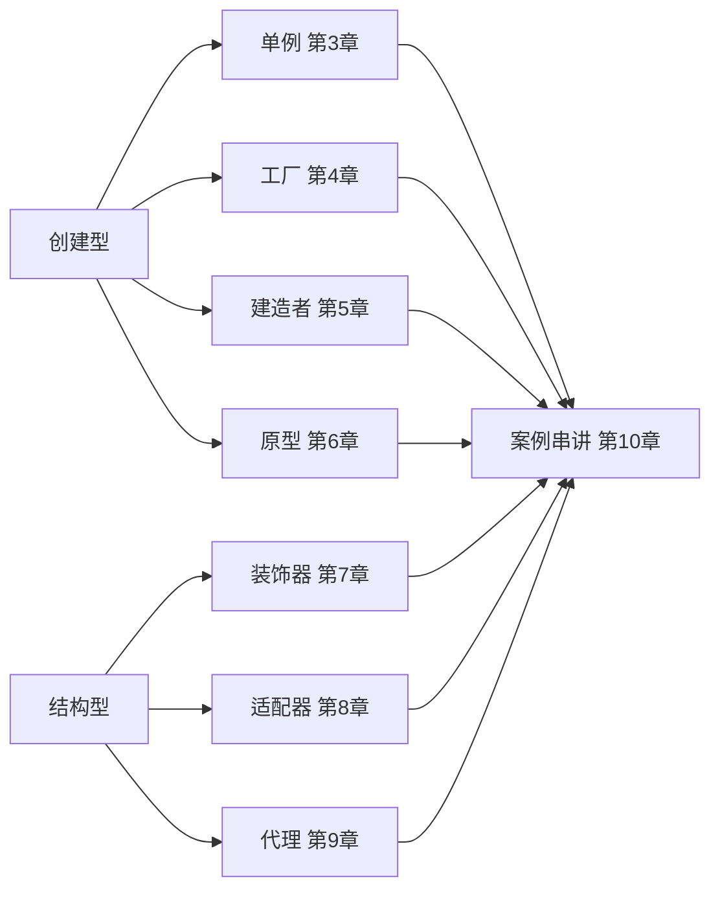
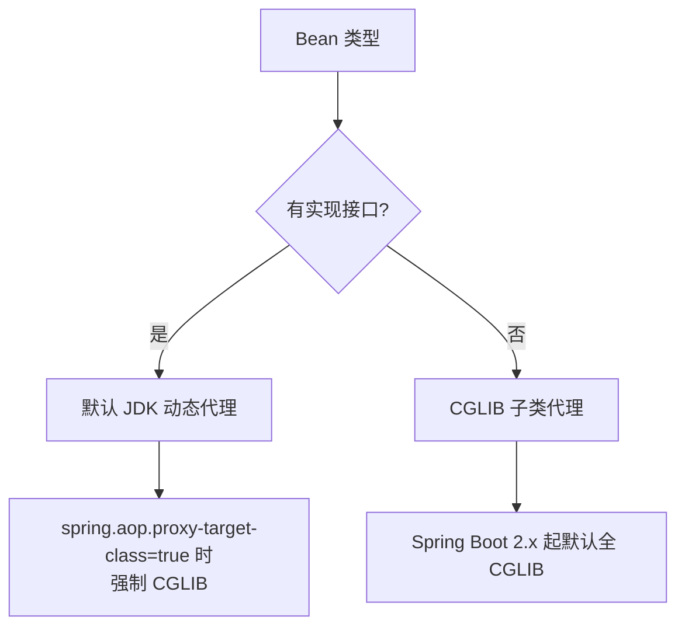
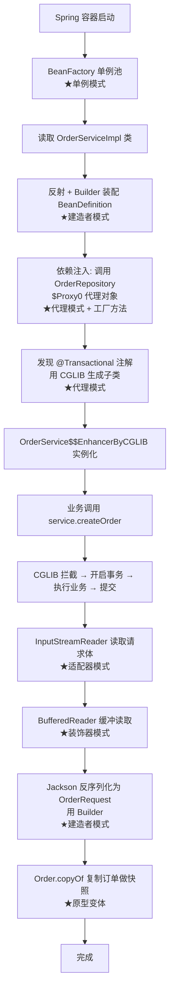

# 45.JDK设计模式上

#### 目录介绍
- [1. 案例引入](#1-案例引入)
  - [1.1 一段反常代码](#11-一段反常代码)
  - [1.2 顺藤摸到根因](#12-顺藤摸到根因)
  - [1.3 我们要回答什么](#13-我们要回答什么)
- [2. 架构概览](#2-架构概览)
  - [2.1 GoF两大类九模式](#21-gof两大类九模式)
  - [2.2 为什么这么切](#22-为什么这么切)
- [3. 单例模式六写法](#3-单例模式六写法)
  - [3.1 饿汉与懒汉](#31-饿汉与懒汉)
  - [3.2 双检锁的陷阱](#32-双检锁的陷阱)
  - [3.3 静态内部类](#33-静态内部类)
  - [3.4 枚举单例的正解](#34-枚举单例的正解)
  - [3.5 Runtime与单例反例](#35-runtime与单例反例)
- [4. 工厂三兄弟](#4-工厂三兄弟)
  - [4.1 简单工厂](#41-简单工厂)
  - [4.2 工厂方法](#42-工厂方法)
  - [4.3 抽象工厂](#43-抽象工厂)
  - [4.4 静态工厂方法](#44-静态工厂方法)
  - [4.5 JDK中的工厂全景](#45-jdk中的工厂全景)
- [5. 建造者模式](#5-建造者模式)
  - [5.1 重叠构造函数地狱](#51-重叠构造函数地狱)
  - [5.2 链式Builder](#52-链式builder)
  - [5.3 StringBuilder与Stream.Builder](#53-stringbuilder与stream-builder)
  - [5.4 不可变与建造者](#54-不可变与建造者)
- [6. 原型模式](#6-原型模式)
  - [6.1 浅拷贝Cloneable](#61-浅拷贝cloneable)
  - [6.2 深拷贝四条路](#62-深拷贝四条路)
  - [6.3 Cloneable为何被诟病](#63-cloneable为何被诟病)
  - [6.4 拷贝构造与静态工厂](#64-拷贝构造与静态工厂)
- [7. 装饰器模式](#7-装饰器模式)
  - [7.1 IO流的四层装饰链](#71-io流的四层装饰链)
  - [7.2 装饰与继承的对比](#72-装饰与继承的对比)
  - [7.3 Collections的wrapper](#73-collections的wrapper)
  - [7.4 装饰器的副作用](#74-装饰器的副作用)
- [8. 适配器模式](#8-适配器模式)
  - [8.1 类适配与对象适配](#81-类适配与对象适配)
  - [8.2 InputStreamReader桥接](#82-inputstreamreader桥接)
  - [8.3 Arrays.asList的伪装](#83-arrays-aslist的伪装)
  - [8.4 适配器与门面之别](#84-适配器与门面之别)
- [9. 代理模式](#9-代理模式)
  - [9.1 静态代理结构](#91-静态代理结构)
  - [9.2 JDK动态代理](#92-jdk动态代理)
  - [9.3 CGLIB字节码代理](#93-cglib字节码代理)
  - [9.4 三种代理性能对照](#94-三种代理性能对照)
  - [9.5 代理与AOP的关系](#95-代理与aop的关系)
- [10. 综合案例串讲](#10-综合案例串讲)
  - [10.1 案例真相揭晓](#101-案例真相揭晓)
  - [10.2 一个对象的成型记](#102-一个对象的成型记)
  - [10.3 设计哲学回扣](#103-设计哲学回扣)
  - [10.4 速查表](#104-速查表)


## 1. 案例引入

### 1.1 一段反常代码

我们接手了一个微服务系统的鉴权模块，代码在 code review 时出现了一段让人警觉的"组合拳"：

```java
// 模块 1：单例配置中心
public class AuthConfig {
    private static AuthConfig instance;
    private final Map<String, String> props = new HashMap<>();

    private AuthConfig() { reload(); }

    public static AuthConfig getInstance() {        // ★ 双检锁单例
        if (instance == null) {
            synchronized (AuthConfig.class) {
                if (instance == null) {
                    instance = new AuthConfig();
                }
            }
        }
        return instance;
    }
    public void reload() { /* 从 Nacos 拉配置 */ }
}

// 模块 2：用户工厂
public class UserFactory {
    public static User create(int type, String name, int age, String email,
                              String phone, String address, ...) {     // ★ 12 个参数
        if (type == 1) return new AdminUser(name, age, email, phone, address, ...);
        if (type == 2) return new VipUser(name, age, email, phone, address, ...);
        if (type == 3) return new GuestUser(name, age, email, phone, address, ...);
        // ... 又加了一种就再来一个 if
        throw new IllegalArgumentException();
    }
}

// 模块 3：可克隆的会话
public class Session implements Cloneable {
    private String userId;
    private List<String> roles;                     // ★ 可变集合
    private Map<String, Object> attributes;

    @Override public Session clone() {
        try { return (Session) super.clone(); }     // ★ 浅拷贝
        catch (CloneNotSupportedException e) { throw new AssertionError(); }
    }
}

// 模块 4：日志装饰
public class LoggingInputStream extends FileInputStream {       // ★ extends
    public LoggingInputStream(File f) throws IOException { super(f); }
    @Override public int read() throws IOException {
        int b = super.read();
        log.info("read byte: {}", b);
        return b;
    }
}

// 模块 5：业务代理
@Service
public class OrderServiceImpl implements OrderService {
    @Transactional                                  // ★ Spring 代理织入
    @Cacheable("orders")
    public Order findById(Long id) { ... }
}
```

### 1.2 顺藤摸到根因

这段代码上线后陆续暴露问题：

- **现象 ①**——AuthConfig 双检锁的 `instance` 字段没加 `volatile`。某次大促时，三台机器中两台读到了"半初始化"的 instance，props 还是空 Map，鉴权全部放过。
- **现象 ②**——UserFactory.create 12 个参数，调用方经常把 `email` 和 `phone` 传反——Java 没有命名参数，类型一样的参数顺序错了 IDE 也不报警。
- **现象 ③**——Session.clone() 用了 `super.clone()`，但 `roles` 和 `attributes` 是同一个引用——A 用户 clone 出 B 用户，B 改 roles 把 A 的也改了。
- **现象 ④**——LoggingInputStream extends FileInputStream，每次 JDK 升级 FileInputStream 内部实现一变（比如 `read()` 不再调用 `read(byte[])`）日志就丢一半。
- **现象 ⑤**——OrderServiceImpl 通过自身方法 `this.findById()` 调用时，`@Transactional` 完全失效——AOP 代理被绕过了。
- **现象 ⑥**——Spring 注入的 `OrderService` 类型，debug 时看到的实际类是 `OrderService$$EnhancerBySpringCGLIB$$abc123`——什么时候用 JDK 代理，什么时候用 CGLIB？

把这些现象串起来，至少藏着 6 个设计模式核心问题：

```
① 双检锁单例为什么必须 volatile? 还有更安全的写法吗?      → 第3章
② 12 个参数怎么收敛? 工厂还是 Builder?                    → 第4、5章
③ clone() 为什么默认是浅拷贝? 怎么深拷贝才安全?           → 第6章
④ 日志能力为什么不该用继承做? 装饰器是怎么解的?           → 第7章
⑤ 自调用为什么穿透不了代理? 代理的本质是什么?             → 第9章
⑥ JDK 代理与 CGLIB 怎么选? 性能差多少?                    → 第9章
```

### 1.3 我们要回答什么

第 48 篇我们沉淀了 OO 的设计哲学——**封装、SOLID、组合优于继承**。这一篇我们把哲学落到 GoF 23 模式的具体招式上。本篇聚焦**创建型（5 种）+ 结构型（前 3 种）**，每个模式的讲法都遵循同一个套路：

```
反例（坏味道） → 模式公式 → JDK 中的真实范本 → 适用边界
```

下一篇 50 接着讲行为型。本篇路线：



## 2. 架构概览

### 2.1 GoF两大类九模式

GoF（Gang of Four）23 模式分三类，本篇覆盖前两类（共 11 个，本篇精选 8 个 JDK 中**有真实范本**的）：

```
┌─────────────────────────────────────────────────────────┐
│  创建型 Creational：解决"怎么造对象"                     │
│  ├─ 单例   Singleton   ：唯一实例                        │
│  ├─ 工厂   Factory     ：把 new 收口                     │
│  ├─ 建造者 Builder     ：分步组装复杂对象                │
│  └─ 原型   Prototype   ：克隆既有对象                    │
├─────────────────────────────────────────────────────────┤
│  结构型 Structural：解决"对象怎么组装"                   │
│  ├─ 装饰器 Decorator   ：动态叠加能力                    │
│  ├─ 适配器 Adapter     ：转换接口形态                    │
│  ├─ 代理   Proxy       ：受控访问                        │
│  ├─ 门面   Facade      ：复杂子系统的统一入口（略）       │
│  ├─ 桥接   Bridge      ：抽象与实现解耦（略）            │
│  ├─ 组合   Composite   ：树形结构（略）                  │
│  └─ 享元   Flyweight   ：对象池复用（略）                │
└─────────────────────────────────────────────────────────┘
```

### 2.2 为什么这么切

**疑惑**：为什么创建型与结构型要分开讲？模式之间不是常常组合使用吗？

**论证**：

1. **关注点不同**：创建型问"对象从哪来"，结构型问"对象之间怎么连"。前者解决**实例化的时机与控制**，后者解决**组合的形态与协议**。
2. **演进路径不同**：创建型模式大多在"对象创建"环节做手脚，调用方感知度高；结构型模式藏在"运行时调用链"里，调用方往往不知情。
3. **JDK 范本不同**：创建型的范本集中在 `java.lang`、`java.util` 的工厂方法和 Builder；结构型的范本集中在 `java.io`、`java.lang.reflect`、`Spring AOP`。

**结论**：先讲清"造"，再讲清"连"——和我们从第 48 篇的**封装→继承→多态**层层递进的思路完全一致。

## 3. 单例模式六写法

单例的核心需求只有两条：**全局唯一** + **可控访问**。但要把这两条做对，Java 程序员前后写出了至少 6 个版本。

### 3.1 饿汉与懒汉

```java
// 写法 1：饿汉式（类加载即初始化）
public class EagerSingleton {
    private static final EagerSingleton INSTANCE = new EagerSingleton();
    private EagerSingleton() {}
    public static EagerSingleton getInstance() { return INSTANCE; }
}

// 写法 2：懒汉式（首次调用时初始化，但线程不安全）
public class LazySingleton {
    private static LazySingleton instance;
    private LazySingleton() {}
    public static LazySingleton getInstance() {
        if (instance == null) {
            instance = new LazySingleton();          // ★ 多线程下会创建多个
        }
        return instance;
    }
}

// 写法 3：synchronized 方法（线程安全但性能差）
public static synchronized LazySingleton getInstance() { ... }
```

| 写法 | 线程安全 | 性能 | 懒加载 | 评价 |
|---|---|---|---|---|
| 饿汉 | ✅（类加载锁） | ★★★ | ❌ | 简单可靠，但启动占内存 |
| 懒汉裸版 | ❌ | ★★★ | ✅ | 不能用 |
| synchronized 方法 | ✅ | ★ | ✅ | 每次调用都加锁，性能浪费 |

### 3.2 双检锁的陷阱

写法 4：DCL（Double-Checked Locking）——大家最常写的版本：

```java
public class DCLSingleton {
    private static DCLSingleton instance;        // ★★★ 这里少了 volatile
    private DCLSingleton() {}
    public static DCLSingleton getInstance() {
        if (instance == null) {                  // 第 1 次检查（无锁快路径）
            synchronized (DCLSingleton.class) {
                if (instance == null) {          // 第 2 次检查（持锁慢路径）
                    instance = new DCLSingleton();
                }
            }
        }
        return instance;
    }
}
```

**疑惑**：为什么这写法有"半初始化"风险？

**论证**：`instance = new DCLSingleton()` 不是一条原子指令，至少分三步字节码：

```
1. 分配内存                  ← Step 1
2. 调用构造器初始化字段       ← Step 2
3. 把引用赋给 instance         ← Step 3
```

**JIT 和 CPU 都允许 2、3 重排序**——可能先执行 Step 3 把引用赋值，再执行 Step 2 初始化。此时另一个线程进来，第 1 次检查发现 `instance != null`，**直接返回半成品对象**——字段都还是默认值。

回到第 1 章现象 ①——AuthConfig 的 props 在另一台机器上读出来是空 Map，正是这个根因。

**修正**：加 `volatile` 阻止 Step 2 与 Step 3 之间的重排序：

```java
private static volatile DCLSingleton instance;   // ★ volatile 关键
```

`volatile` 的内存屏障保证：写入 instance 之前，所有相关写操作（包括字段初始化）必须先完成（详见第 09 篇）。

**结论**：**DCL 必须 + volatile**，而且仅当真有"懒加载 + 高并发首次访问"需求时才用——否则不如下面的写法 5。

### 3.3 静态内部类

写法 5：Initialization-on-Demand Holder 惯用法：

```java
public class HolderSingleton {
    private HolderSingleton() {}

    private static class Holder {
        private static final HolderSingleton INSTANCE = new HolderSingleton();
    }

    public static HolderSingleton getInstance() {
        return Holder.INSTANCE;                  // ★ 触发 Holder 加载
    }
}
```

**为什么这写法又安全又懒？**

JVM 类加载有一个铁律：**`<clinit>` 方法（类初始化）由 JVM 加锁保证只执行一次**（详见第 02 篇）。Holder 类只有在 `Holder.INSTANCE` 第一次被访问时才会加载，加载过程线程安全且只执行一次——**JVM 替我们做了所有同步控制**。

| 维度 | DCL | Holder |
|---|---|---|
| 代码量 | 多 | 少 |
| 是否需要 volatile | 必须 | 不需要 |
| 性能 | 单次首检 + 屏障 | 一次类加载，之后纯字段读 |
| 复杂度 | 高（懂的人才敢写对） | 低（语言机制兜底） |

**结论**：**绝大多数懒加载单例首选 Holder 写法**——它把同步责任完全交给 JVM 类加载锁，干净到不能再干净。

### 3.4 枚举单例的正解

写法 6：Joshua Bloch 在《Effective Java》里点名推荐的**枚举单例**：

```java
public enum EnumSingleton {
    INSTANCE;
    
    private final Map<String, String> config = new HashMap<>();
    
    public void put(String k, String v) { config.put(k, v); }
    public String get(String k) { return config.get(k); }
}

// 调用
EnumSingleton.INSTANCE.put("k", "v");
```

**枚举单例的三大碾压性优势**：

1. **天然线程安全**——枚举的实例由 JVM 保证只加载一次（同 Holder 机制）。
2. **天然防反射攻击**——`Constructor.setAccessible(true) + newInstance()` 在枚举上**会抛 IllegalArgumentException**：
    ```java
    // Constructor.newInstance 源码片段
    if ((clazz.getModifiers() & Modifier.ENUM) != 0)
        throw new IllegalArgumentException("Cannot reflectively create enum objects");
    ```
3. **天然防序列化破坏**——`ObjectInputStream` 反序列化枚举走专用路径 `readEnum()`，**返回的永远是同一个常量**，不会创建新实例（详见第 44 篇）。

**反观其他单例写法**——反射可以暴力 setAccessible 调私有构造，序列化默认会走 readObject 创建新对象（除非自己实现 readResolve）。

**结论**：**有反序列化或防御反射需求时，枚举单例是唯一正解**。其他场景看复杂度选 Holder 或饿汉即可。

### 3.5 Runtime与单例反例

JDK 自带的 `java.lang.Runtime` 是单例的**早期教科书案例**：

```java
public class Runtime {
    private static final Runtime currentRuntime = new Runtime();   // 饿汉
    public static Runtime getRuntime() { return currentRuntime; }
    private Runtime() {}
}
```

但 Runtime 也是一个**反例警告**——它把太多职责（exec/exit/gc/availableProcessors）塞到一个全局单例里，导致单元测试基本无法 mock。**单例不是设计目标，是不得已而为之**。能用 DI 容器（Spring）注入唯一 bean 就别手写单例。

## 4. 工厂三兄弟

工厂解决一个问题：**把 `new` 这个动作收口**——调用方不应该知道用了哪个具体实现。

### 4.1 简单工厂

不在 GoF 23 之列，但最常见。回到第 1 章的 `UserFactory.create(type, ...)`：

```java
public class UserFactory {
    public static User create(UserType type) {
        return switch (type) {
            case ADMIN -> new AdminUser();
            case VIP   -> new VipUser();
            case GUEST -> new GuestUser();
        };
    }
}
```

**问题**：每加一个 UserType 都要改 switch——违反 OCP。

**改进**：用 Map 注册：

```java
private static final Map<UserType, Supplier<User>> REGISTRY = Map.of(
    UserType.ADMIN, AdminUser::new,
    UserType.VIP,   VipUser::new,
    UserType.GUEST, GuestUser::new);

public static User create(UserType t) {
    return REGISTRY.getOrDefault(t, () -> { throw new IllegalArgumentException(); }).get();
}
```

### 4.2 工厂方法

**工厂方法模式**：把"创建对象"延迟到子类。

```java
abstract class Creator {
    public final void operate() {
        Product p = createProduct();              // ★ 由子类决定具体实现
        p.use();
    }
    protected abstract Product createProduct();
}

class ConcreteCreator extends Creator {
    @Override protected Product createProduct() { return new ConcreteProduct(); }
}
```

**JDK 范本**：`Collection.iterator()`——`Collection` 接口承诺"我能给你一个迭代器"，但**具体迭代器由具体集合决定**。`ArrayList.iterator()` 返回 `Itr`，`LinkedList.iterator()` 返回 `ListItr`——同一个抽象，多个工厂方法。

### 4.3 抽象工厂

**抽象工厂模式**：生产**一组相关产品**。

```java
interface UIFactory {
    Button createButton();
    TextField createTextField();
    ScrollBar createScrollBar();
}

class MacUIFactory implements UIFactory {
    public Button createButton() { return new MacButton(); }
    public TextField createTextField() { return new MacTextField(); }
    public ScrollBar createScrollBar() { return new MacScrollBar(); }
}

class WinUIFactory implements UIFactory { /* Windows 风格 */ }
```

**JDK 范本**：`javax.xml.parsers.DocumentBuilderFactory`——它生产的是一组 SAX 解析相关对象（DocumentBuilder + 各种配置）。

### 4.4 静态工厂方法

Bloch《Effective Java》第 1 条："**用静态工厂方法代替构造器**"。

```java
// 反例：构造器只能按位置传参，且名字固定
BigInteger bi = new BigInteger(int signum, byte[] magnitude);

// 正例：静态工厂方法可命名 + 可缓存 + 可返回子类型
BigInteger bi = BigInteger.valueOf(123L);            // 缓存 -16~16
Integer    i  = Integer.valueOf(127);                // 缓存 -128~127
List<Integer> l = List.of(1, 2, 3);                  // 不可变 List
Map<K,V>   m  = Map.of("k","v");                     // 不可变 Map
Optional<T> o = Optional.of(x);                      // 类型相关命名
```

**静态工厂的 5 大优势**：

1. **有名字**——`BigInteger.probablePrime()` 比 `new BigInteger(int, int, Random)` 直观得多。
2. **可缓存**——`Integer.valueOf` 范围内复用，节省对象。
3. **可返回子类型**——`Collections.unmodifiableList` 实际返回 `UnmodifiableList`，但调用方只看到 `List`。
4. **入参类型可推导**——配合泛型，`Map.of()` 比 `new HashMap<String, List<Integer>>()` 简洁。
5. **可返回不同实现**——`EnumSet.of()` 元素 ≤64 返回 RegularEnumSet（位图），>64 返回 JumboEnumSet。

### 4.5 JDK中的工厂全景

| 类型 | 范本 | 命名约定 |
|---|---|---|
| 静态工厂 | `Integer.valueOf` / `List.of` / `Optional.of` | `of`、`valueOf`、`from`、`getInstance` |
| 工厂方法 | `Collection.iterator` / `Class.newInstance` | `create*` / `new*` |
| 抽象工厂 | `DocumentBuilderFactory` / `SAXParserFactory` | `*Factory` |
| 服务工厂 | `Charset.forName` / `DriverManager.getConnection` | `for*` / SPI |
| 静态嵌套工厂 | `Stream.of` / `IntStream.range` | 通常配合不可变 |

**结论**：JDK 几乎不再用 `public` 构造器——**90% 的对象创建都通过静态工厂**。新写代码时优先静态工厂方法，构造器留给真的"无业务含义"的简单数据载体。

## 5. 建造者模式

### 5.1 重叠构造函数地狱

回到第 1 章 UserFactory 的 12 个参数——这是典型的"重叠构造函数地狱"（telescoping constructor anti-pattern）：

```java
public User(String name) { this(name, 0); }
public User(String name, int age) { this(name, age, ""); }
public User(String name, int age, String email) { this(name, age, email, ""); }
public User(String name, int age, String email, String phone) { ... }
// ... 8 层重载
```

**痛点**：

1. **参数顺序易错**——`new User("Alice", 25, "alice@x.com", "13800000000")`，把 email 和 phone 调换 IDE 不会报错。
2. **可选参数处理糟糕**——只想设 name 和 phone？得把 age、email 都填上默认值。
3. **不可变性破坏**——为了灵活，常常退而求其次写 setter，导致对象失去不可变性。

### 5.2 链式Builder

**Builder 模式**：把"组装"作为一个独立对象：

```java
public final class User {
    private final String name;
    private final int age;
    private final String email;
    private final String phone;
    private final String address;

    private User(Builder b) {
        this.name = b.name; this.age = b.age;
        this.email = b.email; this.phone = b.phone;
        this.address = b.address;
    }

    public static Builder builder(String name) { return new Builder(name); }

    public static class Builder {
        private final String name;            // 必填
        private int age;
        private String email = "";
        private String phone = "";
        private String address = "";

        public Builder(String name) { this.name = Objects.requireNonNull(name); }
        public Builder age(int v) { this.age = v; return this; }
        public Builder email(String v) { this.email = v; return this; }
        public Builder phone(String v) { this.phone = v; return this; }
        public Builder address(String v) { this.address = v; return this; }
        public User build() {
            // 跨字段校验放这里
            if (age < 0) throw new IllegalArgumentException();
            return new User(this);
        }
    }
}

// 调用方
User u = User.builder("Alice").age(25).email("a@x.com").phone("138...").build();
```

**Builder 的 4 大优势**：

1. **命名参数**——`.email("a@x.com")` 比第 3 个参数位强 100 倍。
2. **任意可选**——只设需要的字段，其他走默认值。
3. **跨字段校验**——`build()` 时统一检查不变量。
4. **保留不可变**——User 字段全 final，只通过 Builder 装配。

### 5.3 StringBuilder与Stream.Builder

JDK 里"看名字就是 Builder"的范本：

```java
// 1) StringBuilder：可变字符串组装
String s = new StringBuilder("Hello, ").append("Java ").append(21).toString();

// 2) Stream.Builder：流的分步构造
Stream<String> stream = Stream.<String>builder().add("a").add("b").build();

// 3) StringBuilder 的链式 append 是建造者的最早范本
// 4) HttpClient (JDK 11+) 全面 Builder 化
HttpClient client = HttpClient.newBuilder()
        .version(HttpClient.Version.HTTP_2)
        .connectTimeout(Duration.ofSeconds(20))
        .followRedirects(HttpClient.Redirect.NORMAL)
        .build();

// 5) HttpRequest 同样
HttpRequest req = HttpRequest.newBuilder(URI.create("https://x"))
        .GET()
        .header("Accept", "application/json")
        .build();
```

JDK 11 之后，所有新引入的复杂配置类型几乎都使用 Builder——这是工程界用脚投票的结果。

### 5.4 不可变与建造者

**Builder 与 Record 的搭档**：

```java
public record User(String name, int age, String email, String phone, String address) {
    public static class Builder {
        // 同上，build() 返回 new User(...)
    }
}
```

Record 给"值"，Builder 给"组装"——两者结合是 JDK 17+ 最流行的不可变 DTO 写法。

**结论**：**4 个以上参数的对象创建一律用 Builder**。这是 Bloch 在《Effective Java》第 2 条的核心建议，也是 JDK 现代 API 的标准姿势。

## 6. 原型模式

原型模式：**通过克隆已有对象创建新对象**——避免昂贵的初始化。

### 6.1 浅拷贝Cloneable

Java 自带的克隆机制是 `Cloneable` + `Object.clone()`：

```java
public class Session implements Cloneable {
    private String userId;
    private List<String> roles;
    
    @Override public Session clone() {
        try {
            return (Session) super.clone();   // ★ Object.clone() 是浅拷贝
        } catch (CloneNotSupportedException e) {
            throw new AssertionError();
        }
    }
}
```

**`Object.clone()` 的本质**：

```
new 一个同类型对象 → memcpy 字段值 → 返回
```

引用类型字段被**逐字节复制引用本身**——副本和原对象共享同一个 `roles` List。这就是第 1 章现象 ③ 的根因：**A 用户和 B 用户的 roles 是同一个 List**，A 改 B 也变。

### 6.2 深拷贝四条路

| 方式 | 优势 | 劣势 |
|---|---|---|
| 手写递归 clone | 完全可控 | 字段多了写到吐血 |
| 拷贝构造器 | 显式 + 可控 | 工作量同上 |
| 序列化 + 反序列化 | 一行搞定 | 慢，对象必须 Serializable |
| JSON 互转（Jackson） | 通用 | 慢 + 要处理循环引用 + 类型擦除 |

**手写递归 clone**：

```java
@Override public Session clone() {
    try {
        Session c = (Session) super.clone();
        c.roles = new ArrayList<>(this.roles);                // ★ 重建集合
        c.attributes = new HashMap<>(this.attributes);
        return c;
    } catch (CloneNotSupportedException e) {
        throw new AssertionError();
    }
}
```

**拷贝构造器（Bloch 推荐）**：

```java
public Session(Session src) {
    this.userId = src.userId;
    this.roles = new ArrayList<>(src.roles);
    this.attributes = new HashMap<>(src.attributes);
}

// 调用
Session copy = new Session(orig);
```

### 6.3 Cloneable为何被诟病

`Cloneable` 接口被 JDK 自己的设计者点名为**"严重的设计错误"**：

1. **接口里没方法**——`Cloneable` 是一个空接口，clone() 实际定义在 Object 里。
2. **clone() 是 protected**——子类必须覆写并改 public，类型转换必须自己做。
3. **构造器被绕过**——`super.clone()` 通过 native 拷贝内存，根本不调用任何构造器，所有 final 字段初始化逻辑被跳过。
4. **异常签名怪异**——抛 `CloneNotSupportedException` 这种 checked 异常，写一次锁一次脑筋。

```java
// String 的取舍
public final class String { /* 不实现 Cloneable，因为 String 不可变 */ }

// JDK 的实事求是
public class ArrayList<E> implements Cloneable {
    @Override public Object clone() { ... }    // 返回 Object 不是 ArrayList
}
```

**结论**：**新代码不要实现 Cloneable**——用拷贝构造器、静态工厂 `copyOf`、或不可变 + Builder 重建。

### 6.4 拷贝构造与静态工厂

JDK 8+ 全面用**静态工厂方法 `copyOf`** 替代 clone：

```java
List<Integer> list1 = new ArrayList<>(List.of(1,2,3));
List<Integer> list2 = List.copyOf(list1);              // ★ 不可变副本
Set<Integer>  set  = Set.copyOf(list1);                // ★ 转 Set
Map<K,V>      map2 = Map.copyOf(map1);

byte[] arr2 = Arrays.copyOf(arr1, arr1.length);        // 数组深拷贝
String s    = new String(charArray);                   // 字符数组的拷贝构造
```

**结论**：**优先 `Type.copyOf(...)`**，其次拷贝构造器，最后才是 clone——而且新代码请把 clone 视为 deprecated。

## 7. 装饰器模式

### 7.1 IO流的四层装饰链

第 48 篇我们已经见过这条链——这里展开它的代码结构：

```java
InputStream in = new GZIPInputStream(
                    new BufferedInputStream(
                        new FileInputStream("data.gz")));
```

```
                ┌──────────────────────────────────────┐
                │ InputStream（抽象）                   │
                └──────────────────────────────────────┘
                         ▲                  ▲
                         │ extends          │
        ┌────────────────┴───────┐   ┌──────┴──────────────┐
        │ FileInputStream         │   │ FilterInputStream   │ ← 装饰器基类
        │ (具体源)                │   │ 持有 InputStream in │
        └────────────────────────┘   └─────────────────────┘
                                            ▲
                  ┌─────────────────────────┼─────────────────────────┐
                  │                         │                         │
        ┌─────────┴────────┐    ┌──────────┴──────────┐    ┌─────────┴──────────┐
        │ BufferedInputStream│  │ GZIPInputStream     │    │ CipherInputStream  │
        │ + 缓冲             │  │ + 解压               │    │ + 解密              │
        └────────────────────┘  └─────────────────────┘    └────────────────────┘
```

`FilterInputStream` 是装饰器模式的"基类"——它持有一个 `InputStream in`，所有方法默认转发给 `in`，子类只覆盖想增强的方法：

```java
public class FilterInputStream extends InputStream {
    protected volatile InputStream in;        // ★ 被装饰的对象

    protected FilterInputStream(InputStream in) { this.in = in; }
    @Override public int read() throws IOException { return in.read(); }
    @Override public int read(byte[] b, int off, int len) throws IOException {
        return in.read(b, off, len);
    }
    // ...
}
```

**`BufferedInputStream` 在干什么**：

```java
public class BufferedInputStream extends FilterInputStream {
    protected volatile byte[] buf;         // 内部缓冲
    public synchronized int read() throws IOException {
        if (pos >= count) {
            fill();                         // ★ 一次从 in 读 8192 字节填到 buf
        }
        return buf[pos++] & 0xff;
    }
}
```

**装饰器模式的公式**：

```
1. 一个抽象组件（InputStream）
2. 一个具体组件（FileInputStream，提供基础能力）
3. 一个装饰器抽象基类（FilterInputStream，持有抽象组件）
4. N 个具体装饰器（BufferedInputStream/GZIPInputStream/...）

每个装饰器同时 is-a 抽象组件、has-a 抽象组件
```

### 7.2 装饰与继承的对比

回到第 1 章现象 ④——`LoggingInputStream extends FileInputStream`：

```java
// 反例：用继承做"加日志能力"
class LoggingInputStream extends FileInputStream {
    @Override public int read() throws IOException {
        int b = super.read();
        log.info("byte: {}", b);
        return b;
    }
}

// 正例：用装饰器
class LoggingInputStream extends FilterInputStream {
    public LoggingInputStream(InputStream in) { super(in); }
    @Override public int read() throws IOException {
        int b = super.read();              // 转发给被装饰对象
        log.info("byte: {}", b);
        return b;
    }
}

// 调用方可以任意叠加
InputStream in = new LoggingInputStream(
                    new BufferedInputStream(
                        new FileInputStream("data.txt")));
```

**对比**：

| 维度 | 继承 FileInputStream | 装饰 FilterInputStream |
|---|---|---|
| 能否给 SocketInputStream 加日志 | ❌ | ✅ |
| FileInputStream 内部实现变更 | 子类碎裂（见 4.1 CountingHashSet） | 不受影响 |
| 能否同时加缓冲+日志 | ❌（Java 单继承） | ✅（套娃） |
| 调用方代码改动 | 改 new 类型 | 多包一层 |

**结论**：**"加能力"几乎都该用装饰器**，继承只在"is-a 行为契约"成立时使用。

### 7.3 Collections的wrapper

`Collections` 工具类提供了一组"装饰器工厂"：

```java
List<Integer> raw = new ArrayList<>(List.of(1,2,3));

List<Integer> unmod = Collections.unmodifiableList(raw);     // 不可变装饰
List<Integer> sync  = Collections.synchronizedList(raw);     // 同步装饰
List<Integer> typed = Collections.checkedList(raw, Integer.class); // 类型检查装饰
```

它们都返回一个**装饰器内部类**，例如 `UnmodifiableList`：

```java
static class UnmodifiableList<E> extends UnmodifiableCollection<E> implements List<E> {
    final List<? extends E> list;       // ★ 持有被装饰对象
    UnmodifiableList(List<? extends E> list) { super(list); this.list = list; }
    public E get(int i) { return list.get(i); }                    // 转发
    public E set(int i, E e) { throw new UnsupportedOperationException(); }  // 拦截
    public boolean add(E e) { throw new UnsupportedOperationException(); }
    // ...
}
```

### 7.4 装饰器的副作用

**疑惑**：装饰器有什么坑？

**论证**：

1. **类型识别困难**——`obj instanceof BufferedInputStream` 在套娃后无法准确识别底层类型。
2. **资源关闭顺序**——关闭外层装饰器会级联关闭内层，但**只关一次**：try-with-resources 包外层即可。
3. **状态隔离破坏**——多个装饰器持有同一个底层流，一处 `mark/reset` 影响全局。
4. **同步装饰器的局限**——`Collections.synchronizedList` 只锁单个方法，**复合操作（先 contains 再 add）仍需手动 synchronized**。

```java
// 正确用法
List<Integer> sync = Collections.synchronizedList(new ArrayList<>());
synchronized (sync) {                  // ★ 复合操作必须自己锁
    if (!sync.contains(1)) sync.add(1);
}
```

## 8. 适配器模式

### 8.1 类适配与对象适配

**适配器模式**：**把一个接口转换成另一个客户端期望的接口**。

两种实现：

```java
// 1) 类适配器（多继承，Java 不直接支持，需借助接口）
class Adapter extends Adaptee implements Target {
    @Override public void targetMethod() { adapteeMethod(); }
}

// 2) 对象适配器（组合，更常用）
class Adapter implements Target {
    private final Adaptee adaptee;
    public Adapter(Adaptee a) { this.adaptee = a; }
    @Override public void targetMethod() { adaptee.adapteeMethod(); }
}
```

### 8.2 InputStreamReader桥接

JDK 里最经典的适配器：**`InputStreamReader` 把字节流（InputStream）适配成字符流（Reader）**。

```java
//                字节流          适配器                      字符流
Reader r = new InputStreamReader(new FileInputStream("a.txt"), StandardCharsets.UTF_8);
```

```
┌─────────────────┐  字节  ┌──────────────────────┐  字符  ┌─────────────┐
│ FileInputStream │ ────► │ InputStreamReader    │ ────► │ Reader 接口  │
│ (Adaptee)       │       │ (Adapter, 内含解码器) │       │ (Target)    │
└─────────────────┘       └──────────────────────┘       └─────────────┘
```

适配器内部维护一个 **`StreamDecoder`**，每次读字符时按编码规则把字节解码成字符。这是"接口形式不一致"的典型场景——一边给字节，一边要字符，适配器干掉了协议鸿沟。

**反向适配**：`OutputStreamWriter` 把 `OutputStream` 适配为 `Writer`，原理对称。

### 8.3 Arrays.asList的伪装

```java
List<Integer> list = Arrays.asList(1, 2, 3);
list.add(4);                         // ★ UnsupportedOperationException
```

**为什么？** `Arrays.asList` 返回的不是 `java.util.ArrayList`，而是 `Arrays$ArrayList`——一个**对数组进行 List 接口适配**的包装器：

```java
// JDK 源码节选
private static class ArrayList<E> extends AbstractList<E> implements ... {
    private final E[] a;                   // ★ 持有原数组
    ArrayList(E[] array) { this.a = array; }
    public E get(int i) { return a[i]; }
    public E set(int i, E e) { E old = a[i]; a[i] = e; return old; }
    // ★ 没有覆盖 add/remove，AbstractList 默认 throw UnsupportedOperationException
    public int size() { return a.length; }
}
```

它把数组**适配**成了 List 接口——但只暴露了"读 + set"，不能扩容（数组天然定长）。这是 JDK 范本中"适配带阉割"的典型。

### 8.4 适配器与门面之别

| 维度 | 适配器 Adapter | 门面 Facade |
|---|---|---|
| 目的 | 转换接口形式 | 简化复杂子系统 |
| 关注点 | 协议兼容 | 用户友好 |
| 持有数 | 通常 1 个被适配对象 | 持有多个子系统对象 |
| 范本 | InputStreamReader | SLF4J、Spring JdbcTemplate |

**结论**：适配器解决**"形不同"**，门面解决**"事多杂"**。两者经常组合使用——比如 SLF4J 是门面，下游各种 LoggerAdapter（`Logback`、`Log4j2Adapter`）就是适配器。

## 9. 代理模式

### 9.1 静态代理结构

代理模式：**为另一个对象提供受控访问**。

```java
// 接口
interface UserService { User findById(Long id); }

// 真实对象
class UserServiceImpl implements UserService {
    public User findById(Long id) { /* 查 DB */ }
}

// 静态代理
class UserServiceProxy implements UserService {
    private final UserService target;
    public UserServiceProxy(UserService t) { this.target = t; }
    
    @Override public User findById(Long id) {
        long start = System.nanoTime();
        try {
            return target.findById(id);                // ★ 委托
        } finally {
            log.info("耗时 {}ns", System.nanoTime() - start);
        }
    }
}
```

**问题**：每个 Service 都要手写一个 Proxy——20 个 Service 就要写 20 个代理类，10 行代码 × 20 = 200 行重复模板。

### 9.2 JDK动态代理

`java.lang.reflect.Proxy`——运行时**生成实现指定接口的代理类字节码**：

```java
UserService proxy = (UserService) Proxy.newProxyInstance(
    UserServiceImpl.class.getClassLoader(),
    new Class[] { UserService.class },                 // ★ 必须有接口
    (Object p, Method m, Object[] args) -> {           // InvocationHandler
        long start = System.nanoTime();
        try {
            return m.invoke(target, args);             // 反射调用真实对象
        } finally {
            log.info("耗时 {}ns", System.nanoTime() - start);
        }
    });

User u = proxy.findById(1L);
```

**JDK 动态代理的关键事实**：

1. **必须基于接口**——生成的代理类签名是 `class $Proxy0 extends Proxy implements UserService`，**已经 extends Proxy 了，没法再 extends 你的具体类**。
2. **运行时生成字节码**——`ProxyGenerator.generateProxyClass` 直接构造类字节码后由 `defineClass` 加载。
3. **每次方法调用都通过反射**——`Method.invoke` 触发 InvocationHandler。

```java
// 生成的 $Proxy0 大致长这样
public final class $Proxy0 extends Proxy implements UserService {
    private static final Method m_findById;
    static {
        m_findById = UserService.class.getMethod("findById", Long.class);
    }
    public User findById(Long id) {
        return (User) h.invoke(this, m_findById, new Object[]{id});
        //                  ↑ InvocationHandler
    }
}
```

### 9.3 CGLIB字节码代理

如果目标类没有实现接口（或者你想代理 `final class`、private 方法以外的所有方法），JDK 动态代理就无能为力了。**CGLIB**（Code Generation Library，基于 ASM）的方案是**生成目标类的子类**：

```java
Enhancer enhancer = new Enhancer();
enhancer.setSuperclass(UserServiceImpl.class);              // ★ 继承目标类
enhancer.setCallback((MethodInterceptor) (obj, method, args, methodProxy) -> {
    long start = System.nanoTime();
    try {
        return methodProxy.invokeSuper(obj, args);          // 调用 super
    } finally {
        log.info("耗时 {}ns", System.nanoTime() - start);
    }
});
UserServiceImpl proxy = (UserServiceImpl) enhancer.create();
```

**CGLIB 的关键事实**：

1. **不需要接口**——直接 extends 目标类。
2. **`final` 类不能代理**——因为 final 类不能被继承。
3. **`final` / `private` 方法不能拦截**——因为子类无法 override。
4. **底层用 ASM**——直接写字节码，性能优于反射。

**回答现象 ⑥**：Spring 的代理选择策略——



### 9.4 三种代理性能对照

```
方式               创建代理      方法调用       适用场景
─────────────────  ───────────  ────────────  ──────────────
静态代理            编译期        直接调用      简单场景
JDK 动态代理        运行期生成    Method.invoke  目标有接口
CGLIB              运行期生成    FastClass     目标无接口/想代理类
```

CGLIB 的 **FastClass 机制**：把方法签名映射成整型 index，调用时 `switch(index)` 直接 invoke——**避免了反射开销**，性能比 JDK 代理高 5~10 倍（老版本数据，JDK 17+ 反射性能也大幅提升，差距缩小）。

JDK 17+ 还引入 `MethodHandle` 加速反射（详见第 31 篇），如今三者差距已不显著——选型主要看场景。

### 9.5 代理与AOP的关系

代理模式是 **AOP（面向切面编程）的底层实现**。Spring AOP 的所有 `@Transactional`、`@Cacheable`、`@Async`、`@Retryable` 都靠代理织入：

```java
@Service
public class OrderService {
    @Transactional public void createOrder() {
        validate();                  // ★ this.validate() 调用 自调用
    }
    
    @Transactional(propagation = REQUIRES_NEW)
    public void validate() { ... }
}
```

**回答现象 ⑤**：`this.validate()` 调用走的是**真实对象自身的方法引用**，根本没经过代理对象——`@Transactional` 的开新事务织入逻辑完全被绕过。

**修正**：

```java
@Autowired private OrderService self;     // 注入自身代理
public void createOrder() {
    self.validate();                       // ★ 通过代理调用
}
```

或者用 `AopContext.currentProxy()` 取当前代理。

**结论**：**代理只能拦截"通过代理对象调用"的方法**——this 调用永远穿透不了代理。这是 Spring 老司机最常忘记的事故源头。

## 10. 综合案例串讲

### 10.1 案例真相揭晓

回到第 1 章的 5 个模块鉴权代码，6 个疑问现在能逐条作答：

| # | 疑问 | 答案 |
|---|---|---|
| ① | DCL 单例为啥要 volatile? | `instance = new X()` 三步可能重排，不加 volatile 时另一个线程可能读到半初始化对象。**优先用枚举或 Holder 写法**，DCL 是"非要懒加载又非要类外可变"才用。见 3.2~3.4。 |
| ② | 12 个参数怎么收敛? | 4 个以上参数一律 Builder。命名参数、可选默认、跨字段校验、保留不可变性。JDK 11+ HttpClient/HttpRequest 是范本。见 5.2 / 5.3。 |
| ③ | clone 为啥默认浅拷贝? | `Object.clone` 是 native memcpy，引用字段被原值复制。**新代码不要 implements Cloneable**，用拷贝构造器或 `Type.copyOf`。见 6.1~6.4。 |
| ④ | 日志能力为啥不该用继承? | 继承绑死父类实现细节，FileInputStream 内部一变 LoggingInputStream 就崩。装饰器（extends FilterInputStream + 持有底层流）才能跨实现复用。见 7.1 / 7.2。 |
| ⑤ | 自调用为啥穿透不了代理? | 代理对象 ≠ 真实对象，`this.method()` 走的是真实对象方法表。需要注入 self 代理或 `AopContext.currentProxy()`。见 9.5。 |
| ⑥ | JDK 代理 vs CGLIB? | 有接口走 JDK 代理（生成 `$Proxy0 implements 接口`），无接口走 CGLIB（生成子类）。Spring Boot 2.x 默认全 CGLIB。final 类/方法 CGLIB 也无能为力。见 9.2~9.4。 |

### 10.2 一个对象的成型记

把本篇 8 个模式串成一个完整的"对象一生"——以 Spring 启动时一个 `OrderService` Bean 为例：



一次 HTTP 请求落地，**至少触发 7 种设计模式协作**。这就是 GoF 模式在工业级框架中的真实价值——不是炫技，是**用语言机制把架构原则固化下来**。

### 10.3 设计哲学回扣

本篇 8 种模式背后藏着 **4 条跨模式适用的设计哲学**：

1. **把变化点封闭起来**——单例封闭"实例数量"，工厂封闭"具体类型"，Builder 封闭"装配过程"，原型封闭"初始化路径"。
2. **能力靠组合不靠继承**——装饰器、适配器、代理三个结构型都是"组合 + 委托"，没有一个用 `extends` 来加能力。
3. **延迟到必要时刻**——单例的懒加载、工厂的运行期决策、代理的运行期织入，都是把"决策时机"从编译期推到了运行期。
4. **接口是契约，实现是方言**——所有模式都建立在"先有接口，再有实现"的基础上。如果业务里全是裸 class，模式根本无从落地。

### 10.4 速查表

**8 个模式速查**：

| 模式 | 一句话 | JDK 范本 | 适用边界 |
|---|---|---|---|
| 单例 Singleton | 全局唯一 | Runtime/Math | 真有"全局共享"刚需 |
| 工厂方法 | 把 new 推迟到子类 | Collection.iterator | 同一抽象多种实现 |
| 抽象工厂 | 一组相关产品 | DocumentBuilderFactory | 跨家族切换 |
| 建造者 Builder | 分步装配 | StringBuilder/HttpClient | 4+ 参数对象 |
| 原型 Prototype | 克隆已有对象 | Object.clone（避免） | 初始化昂贵且需多副本 |
| 装饰器 Decorator | 动态叠加能力 | InputStream 系 | 横向扩展能力 |
| 适配器 Adapter | 接口转换 | InputStreamReader/Arrays.asList | 协议鸿沟 |
| 代理 Proxy | 受控访问 | java.lang.reflect.Proxy/CGLIB | 透明拦截 |

**单例六写法选型表**：

| 场景 | 推荐写法 |
|---|---|
| 简单全局对象 | 饿汉 / 枚举 |
| 懒加载 + 高并发 | 静态内部类 Holder |
| 防反射 + 防序列化破坏 | 枚举 |
| 既要懒加载又要外部可重置 | DCL（必加 volatile） |
| 容器管理（Spring） | `@Component` 默认 singleton scope |

**代理三家对比**：

| 维度 | 静态代理 | JDK 动态代理 | CGLIB |
|---|---|---|---|
| 是否必须接口 | 否 | **是** | 否 |
| 能否代理 final 类 | 看实现 | 看实现 | **否** |
| 创建开销 | 编译期 | 运行期生成字节码 | 运行期生成字节码 |
| 调用开销 | 直接 | 反射 (JDK17+ 已加速) | FastClass switch |
| Spring 默认 | — | 老版本默认 | Boot 2.x 起默认 |

---

下一篇我们顺着代理模式打开的"行为织入"思路，进入 [50.JDK设计模式下](50.JDK设计模式下.md)，把**行为型 11 模式**里 JDK 中真有范本的——迭代器、观察者、模板方法（AQS 再深挖）、策略、责任链（ServletFilter）、命令、状态、备忘录——一次性扫荡完毕。

