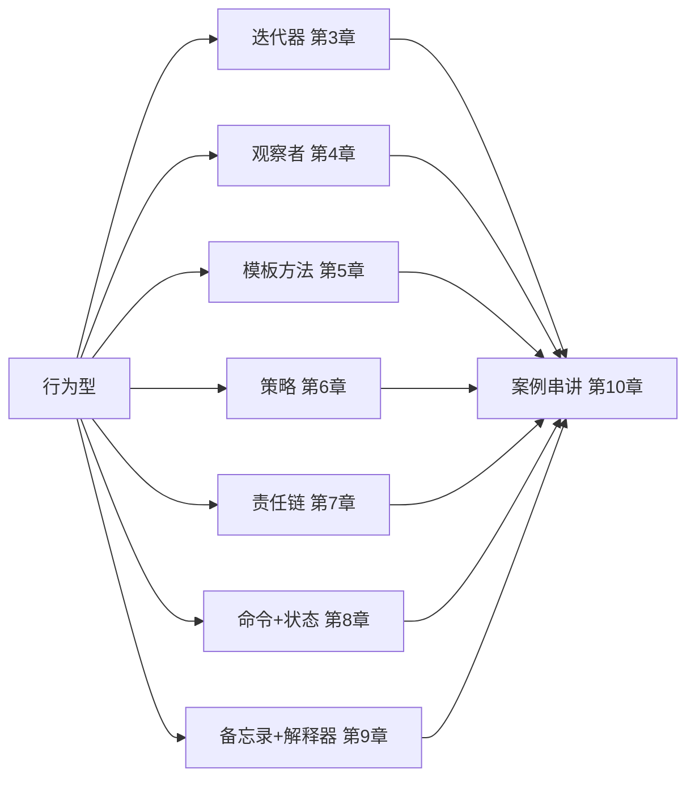
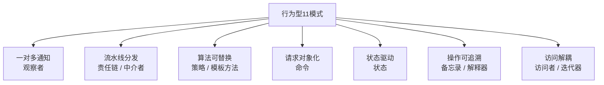
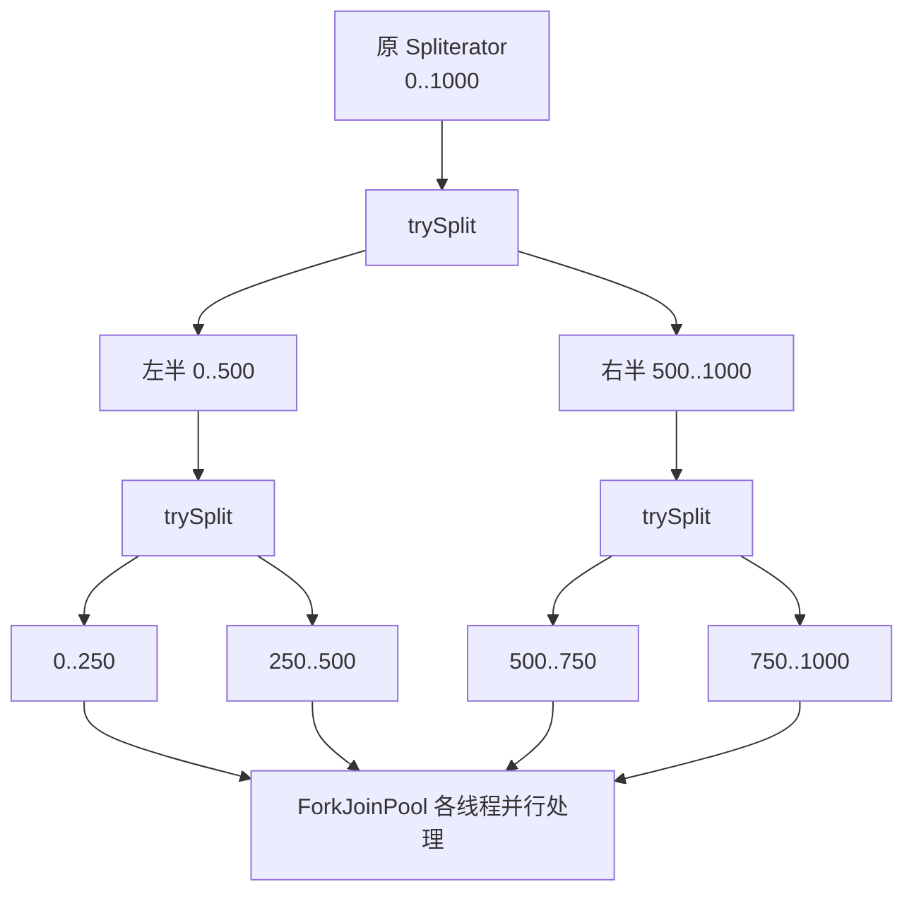
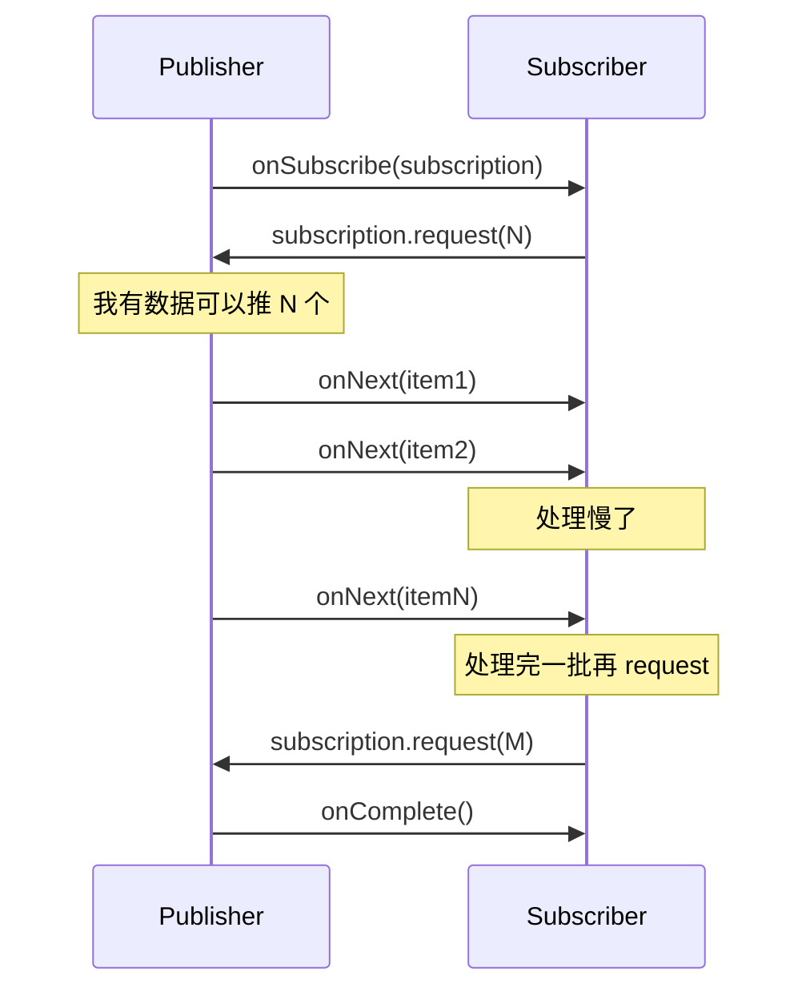
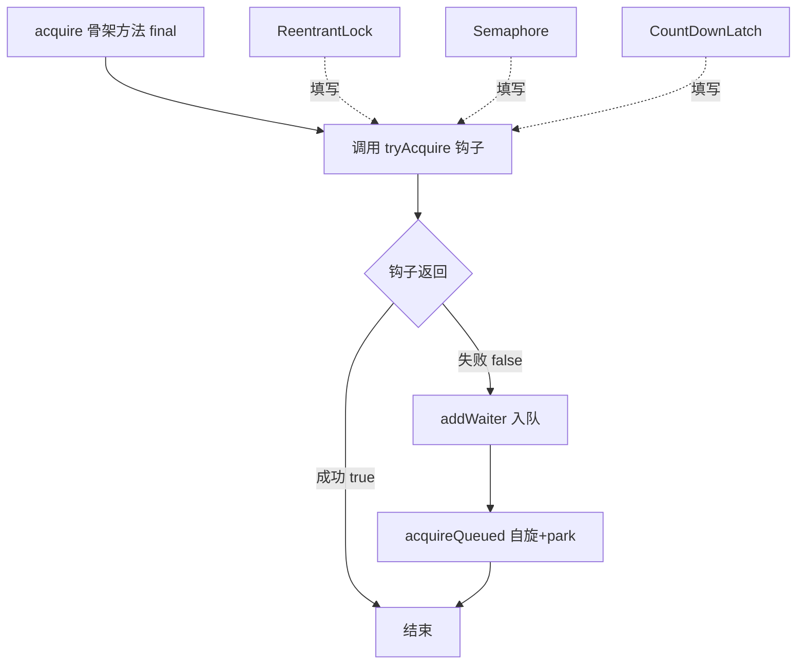
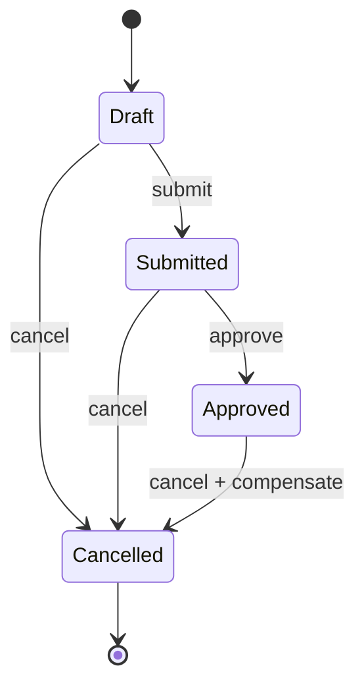
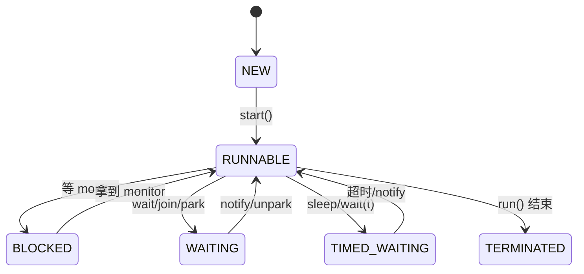
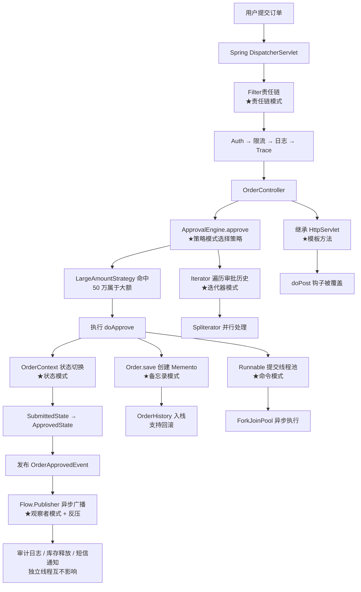

# 46.JDK设计模式下

#### 目录介绍
- [1. 案例引入](#1-案例引入)
  - [1.1 一段反常代码](#11-一段反常代码)
  - [1.2 顺藤摸到根因](#12-顺藤摸到根因)
  - [1.3 我们要回答什么](#13-我们要回答什么)
- [2. 架构概览](#2-架构概览)
  - [2.1 行为型十一模式](#21-行为型十一模式)
  - [2.2 为什么这么切](#22-为什么这么切)
- [3. 迭代器模式](#3-迭代器模式)
  - [3.1 集合内外两种遍历](#31-集合内外两种遍历)
  - [3.2 Iterator与fail-fast](#32-iterator与fail-fast)
  - [3.3 ListIterator的双向](#33-listiterator的双向)
  - [3.4 Spliterator与并行](#34-spliterator与并行)
  - [3.5 内迭代forEach对比](#35-内迭代foreach对比)
- [4. 观察者模式](#4-观察者模式)
  - [4.1 推送与拉取两派](#41-推送与拉取两派)
  - [4.2 Observable的废与立](#42-observable的废与立)
  - [4.3 PropertyChangeSupport](#43-propertychangesupport)
  - [4.4 Flow响应式四角色](#44-flow响应式四角色)
  - [4.5 EventBus与解耦边界](#45-eventbus与解耦边界)
- [5. 模板方法再深挖](#5-模板方法再深挖)
  - [5.1 骨架与钩子](#51-骨架与钩子)
  - [5.2 AQS的acquire骨架](#52-aqs的acquire骨架)
  - [5.3 AbstractList的复用](#53-abstractlist的复用)
  - [5.4 Servlet的service分发](#54-servlet的service分发)
- [6. 策略模式](#6-策略模式)
  - [6.1 if-else长龙的退场](#61-if-else长龙的退场)
  - [6.2 Comparator策略族](#62-comparator策略族)
  - [6.3 RejectedExecutionHandler](#63-rejectedexecutionhandler)
  - [6.4 函数式接口的解放](#64-函数式接口的解放)
- [7. 责任链模式](#7-责任链模式)
  - [7.1 链表与递归两种实现](#71-链表与递归两种实现)
  - [7.2 ServletFilter的pre-post](#72-servletfilter的pre-post)
  - [7.3 Netty ChannelPipeline](#73-netty-channelpipeline)
  - [7.4 OkHttp Interceptor](#74-okhttp-interceptor)
  - [7.5 链的中断与短路](#75-链的中断与短路)
- [8. 命令与状态](#8-命令与状态)
  - [8.1 Runnable即命令](#81-runnable即命令)
  - [8.2 撤销与命令日志](#82-撤销与命令日志)
  - [8.3 状态机消除if地狱](#83-状态机消除if地狱)
  - [8.4 Thread.State状态实例](#84-thread-state状态实例)
- [9. 备忘录与解释器](#9-备忘录与解释器)
  - [9.1 备忘录的封装边界](#91-备忘录的封装边界)
  - [9.2 事务回滚的备忘录影](#92-事务回滚的备忘录影)
  - [9.3 解释器与Pattern](#93-解释器与pattern)
  - [9.4 何时不用解释器](#94-何时不用解释器)
- [10. 综合案例串讲](#10-综合案例串讲)
  - [10.1 案例真相揭晓](#101-案例真相揭晓)
  - [10.2 一个请求的旅行](#102-一个请求的旅行)
  - [10.3 设计哲学回扣](#103-设计哲学回扣)
  - [10.4 速查表](#104-速查表)


## 1. 案例引入

### 1.1 一段反常代码

我们接手了一个企业级"订单审批工作流"模块，代码在新人接手时连续出了 7 个问题——这些问题恰好覆盖了行为型模式的几乎所有典型反例：

```java
// 模块 1：审批流引擎
public class ApprovalEngine {
    
    public void approve(Order order, User user) {
        // ★ 一长串 if-else 控制流
        if (order.getAmount() < 1000) {
            // 小额：组长审批
            if (user.getRole().equals("LEADER")) {
                order.setStatus("APPROVED");
            }
        } else if (order.getAmount() < 10000) {
            // 中额：经理审批
            if (user.getRole().equals("MANAGER")) {
                order.setStatus("APPROVED");
            }
        } else if (order.getAmount() < 100000) {
            // 大额：总监 + 财务双签
            if (user.getRole().equals("DIRECTOR")) {
                order.setStatus("DIRECTOR_APPROVED");
            } else if (user.getRole().equals("CFO") &&
                       order.getStatus().equals("DIRECTOR_APPROVED")) {
                order.setStatus("APPROVED");
            }
        } else {
            // 巨额：CEO 审批
            if (user.getRole().equals("CEO")) {
                order.setStatus("APPROVED");
            }
        }
        // ... 还有撤销、加签、转交等 6 个分支
    }
}

// 模块 2：审批结果通知
public class ApprovalNotifier {
    private List<Listener> listeners = new ArrayList<>();
    
    public void addListener(Listener l) { listeners.add(l); }
    
    public void onApproved(Order o) {
        for (Listener l : listeners) {           // ★ 同步串行遍历
            try {
                l.onEvent(o);
            } catch (Exception e) {
                throw new RuntimeException(e);   // ★ 一个监听器抛异常 阻断后续
            }
        }
    }
}

// 模块 3：审批历史遍历
public List<String> collectHistory(Order order) {
    List<ApprovalRecord> records = order.getRecords();
    List<String> result = new ArrayList<>();
    Iterator<ApprovalRecord> it = records.iterator();
    while (it.hasNext()) {
        ApprovalRecord r = it.next();
        result.add(r.getDesc());
        if (r.isInvalid()) {
            records.remove(r);                   // ★ 遍历中直接修改集合
        }
    }
    return result;
}

// 模块 4：状态切换
public void changeStatus(Order order, String action) {
    String s = order.getStatus();
    if (s.equals("DRAFT") && action.equals("SUBMIT")) {
        order.setStatus("SUBMITTED");
    } else if (s.equals("SUBMITTED") && action.equals("APPROVE")) {
        order.setStatus("APPROVED");
    } else if (s.equals("APPROVED") && action.equals("CANCEL")) {
        order.setStatus("CANCELLED");
    }
    // ★ 实际有 12 个状态 × 8 个 action = 96 个分支……
}

// 模块 5：撤销订单
public void undoLastOperation(Order order) {
    // ★ 直接拷贝 5 个字段，但漏了关联的 attachments
    Order snapshot = new Order();
    snapshot.setStatus(order.getStatus());
    snapshot.setAmount(order.getAmount());
    snapshot.setApprover(order.getApprover());
    snapshot.setUpdateTime(order.getUpdateTime());
    snapshot.setRemark(order.getRemark());
    // attachments 漏了……回滚后附件状态错乱
}
```

### 1.2 顺藤摸到根因

上线后 5 个真实事故陆续暴露：

- **现象 ①**——`ApprovalEngine.approve` 中 if-else 越加越多，每加一个审批规则就要改这个核心方法，老规则被改坏的事故出过 3 次。
- **现象 ②**——`ApprovalNotifier.onApproved` 中第一个监听器抛了 `NullPointerException`，后面的 5 个监听器全部没执行——审计日志没写、消息没发、库存没释放，半夜 P0 告警。
- **现象 ③**——`collectHistory` 在 iterator 中调 `records.remove(r)`，运行时随机抛 `ConcurrentModificationException`——为什么"随机"？为什么有时候不抛？
- **现象 ④**——`changeStatus` 的 12 × 8 个 if 分支，有一次新加状态忘记加 `else if`，订单可以从 `CANCELLED` 直接跳回 `APPROVED`——业务规则被绕过。
- **现象 ⑤**——`undoLastOperation` 写法太糙，每加一个字段就忘改快照，撤销后数据状态和日志对不上。
- **现象 ⑥**——审批流程同时还面临"日志、鉴权、限流、缓存、事务"5 道横切关注点，每一道都要嵌入 `approve` 方法本体——代码全是模板。
- **现象 ⑦**——业务方说："我能不能像 OkHttp Interceptor 那样配置一条审批链"，工程师听不懂——什么是责任链？

把这些现象串起来，至少 8 个行为型模式核心问题：

```
① if-else 长龙 → 怎么用策略模式收编？                  → 第6章
② 监听器异常阻断、同步阻塞 → 观察者怎么解？            → 第4章
③ ConcurrentModificationException 是怎么探测的？        → 第3章
④ 12×8 状态分支 → 状态机怎么消除？                     → 第8.3
⑤ 一锤子拷贝快照 → 备忘录模式的封装边界                → 第9章
⑥ 横切关注点泛滥 → 责任链 / 模板方法分别什么场景？     → 第5、7章
⑦ 客户端能否像配 OkHttp 那样配审批链？                 → 第7.4
```

### 1.3 我们要回答什么

第 49 篇我们讲了**创建型 + 结构型** 8 模式。本篇收官，把 GoF **行为型 11 模式**中 JDK 真实有范本的 8 个全部讲透，以及把第 48 篇就开始的"组合优于继承"主线推到收口。

```
反例 → 模式公式 → JDK 真实范本 → 适用边界与陷阱
```

本篇路线：



## 2. 架构概览

### 2.1 行为型十一模式

GoF 行为型共 11 个，本篇覆盖在 JDK 中**有显式范本**的 9 个（不重点讲的解释器与中介者放第 9 章顺带提）：

```
┌──────────────────────────────────────────────────────────────┐
│  行为型 Behavioral：解决"对象之间如何协作"                    │
│  ├─ 迭代器  Iterator      ：统一遍历协议         ★第3章       │
│  ├─ 观察者  Observer      ：松耦合通知           ★第4章       │
│  ├─ 模板方法 Template     ：骨架不变细节可填     ★第5章       │
│  ├─ 策略    Strategy      ：可替换的算法簇       ★第6章       │
│  ├─ 责任链  Chain         ：流水线式分发         ★第7章       │
│  ├─ 命令    Command       ：请求对象化           ★第8章       │
│  ├─ 状态    State         ：状态驱动行为         ★第8章       │
│  ├─ 备忘录  Memento       ：保存/恢复内部状态    ★第9章       │
│  ├─ 解释器  Interpreter   ：DSL 求值            ★第9章       │
│  ├─ 中介者  Mediator      ：M:N 通信收敛         （略）        │
│  └─ 访问者  Visitor       ：双分派              （第48篇已讲）│
└──────────────────────────────────────────────────────────────┘
```

### 2.2 为什么这么切

**疑惑**：为什么行为型模式数量最多（11 个），而结构型只有 7 个、创建型只有 5 个？

**论证**：

1. **"行为"维度更多**——对象一旦造出来、连起来，剩下要做的事都是"协作"。协作的形式天然丰富：单向通知（观察者）、双向交互（中介者）、流水线（责任链）、可替换算法（策略）……
2. **"运行时变化"是行为型的主战场**——创建型管"造"，结构型管"连"，**行为型管"变"**。变化点越多的系统（比如审批流、网关、规则引擎）越需要行为型模式。
3. **最容易被语言机制取代**——Java 8 引入 Lambda 后，**策略、命令、观察者**三个模式的样板代码都被一口气抹平了。

**结论**：行为型模式之所以多，是因为"对象协作"本身存在大量正交的维度——通知、流水线、状态、撤销、遍历……每个维度都需要独立的模式来切分。



## 3. 迭代器模式

迭代器解决一件事：**让客户端"按顺序访问聚合对象的元素"，但不暴露内部表示**。

### 3.1 集合内外两种遍历

```java
// 1) 外部迭代（客户端控制）
Iterator<String> it = list.iterator();
while (it.hasNext()) {
    String s = it.next();           // ★ 客户端推动迭代
    if (filter(s)) ...
}

// 2) 内部迭代（集合自己控制）
list.forEach(s -> {                  // ★ 集合内部推动
    if (filter(s)) ...
});
```

**对比**：

| 维度 | 外部迭代（Iterator） | 内部迭代（forEach/Stream） |
|---|---|---|
| 控制权 | 客户端 | 集合自身 |
| 灵活度 | 高（可中断、可逆向） | 低（基本只能向前） |
| 并行化 | 困难（状态在客户端） | 容易（Stream.parallel） |
| 性能 | 中等 | 高（JIT 易于内联） |

### 3.2 Iterator与fail-fast

```java
public interface Iterator<E> {
    boolean hasNext();
    E next();
    default void remove() { throw new UnsupportedOperationException(); }
    default void forEachRemaining(Consumer<? super E> action) { ... }
}
```

**关键问题**：`Iterator` 是怎么探测"边迭代边修改"的？

回到第 1 章现象 ③——`collectHistory` 中 `records.remove(r)` 抛 `ConcurrentModificationException`。

**论证**：以 `ArrayList.Itr` 为例：

```java
// ArrayList.java (JDK 21)
private class Itr implements Iterator<E> {
    int cursor;                                  // 下一个元素位置
    int lastRet = -1;
    int expectedModCount = modCount;             // ★ 创建迭代器时记录的版本号
    
    public E next() {
        checkForComodification();                // ★ 每次 next 都检查
        // ... 返回元素
    }
    
    final void checkForComodification() {
        if (modCount != expectedModCount)        // ★ 不一致就抛
            throw new ConcurrentModificationException();
    }
}

public boolean remove(Object o) {
    // ...
    fastRemove(es, i);                           // 内部 modCount++
    return true;
}
```

**机制**：

```
迭代器创建时    : expectedModCount = modCount = 5
list.remove(x)  : modCount = 6
iterator.next() : modCount(6) != expectedModCount(5) → 抛 CME
```

**为什么"随机"抛？**——其实不随机。如果你在迭代到**最后一个元素之后**才修改，下次进 `next()` 时 `hasNext()` 已经返回 false，根本不会触发 `checkForComodification`，CME 就不会抛——所以表面看像"运气问题"。

**正确写法**：

```java
// 用迭代器自己的 remove
Iterator<ApprovalRecord> it = records.iterator();
while (it.hasNext()) {
    ApprovalRecord r = it.next();
    if (r.isInvalid()) {
        it.remove();                              // ★ 安全：内部同步 modCount
    }
}

// 或 JDK 8+ 的 removeIf
records.removeIf(ApprovalRecord::isInvalid);
```

**结论**：fail-fast 不是线程安全机制，是**编程错误探测器**。它用 `modCount` 这个版本号在迭代过程中对账，一旦对账失败立刻报错——**让 bug 死在最近的现场**。

### 3.3 ListIterator的双向

```java
public interface ListIterator<E> extends Iterator<E> {
    boolean hasPrevious();
    E previous();
    int nextIndex();
    int previousIndex();
    void set(E e);
    void add(E e);
}
```

`ListIterator` 在 `Iterator` 基础上加了**双向遍历 + 原地修改**。它解决了 `Iterator` 单向 + 只读的局限——但代价是只能用在 `List`（需要可定位）上。

### 3.4 Spliterator与并行

JDK 8 引入 `Spliterator`（splittable iterator）——**可分割的迭代器**：

```java
public interface Spliterator<T> {
    boolean tryAdvance(Consumer<? super T> action);   // 类似 hasNext+next
    Spliterator<T> trySplit();                         // ★ 把自己切一半返回
    long estimateSize();
    int characteristics();                             // ORDERED/SORTED/SIZED/...
}
```



`Stream.parallelStream()` 内部就是用 `Spliterator.trySplit()` 把数据切片喂给 ForkJoinPool。这是迭代器模式从"单线程顺序遍历"演进到"并行分治"的现代形态。

### 3.5 内迭代forEach对比

JDK 8+ 的 `forEach` 是**内迭代**——把"怎么走"封装在集合内部：

```java
default void forEach(Consumer<? super T> action) {
    for (T t : this) action.accept(t);
}
```

但要记住：**`forEach` 中改集合一样抛 CME**——内迭代不是免责金牌，只是把循环倒过来写而已。

## 4. 观察者模式

### 4.1 推送与拉取两派

```
┌─────────────────────┐                  ┌─────────────────────┐
│  Subject 主题        │ ─── 通知 ───►   │  Observer 观察者     │
│  - List<Observer>   │                  │  + update(...)      │
│  + register/notify  │                  └─────────────────────┘
└─────────────────────┘
         │
         ├── 推（push）：把数据塞给观察者     update(Event e)
         └── 拉（pull）：观察者反向取数据     update(Subject s)
```

**推送**简单但耦合高（事件结构改了所有观察者都要改）；**拉取**解耦但调用复杂。**实战通常推主要数据 + 留个 source 引用让观察者按需拉**。

### 4.2 Observable的废与立

JDK 1.0 就内置了 `java.util.Observable / Observer`：

```java
// JDK 1.0 ~ 8
public class Observable {
    private Vector<Observer> obs = new Vector<>();
    public void notifyObservers(Object arg) {
        for (Observer o : obs) o.update(this, arg);
    }
}

@Deprecated(since = "9")
public interface Observer {
    void update(Observable o, Object arg);
}
```

**JDK 9 标记 @Deprecated** 的原因官方写得很直白：

1. **不可继承的限制**——`Observable` 是类不是接口，子类只能 extends 它，违反第 48 篇的"组合优于继承"。
2. **类型不安全**——参数是 `Object`，强转满天飞。
3. **顺序不保证 + 不支持失败处理**——异常处理粗糙，回到现象 ②。
4. **不支持反压**——下游慢了，上游照样推，必爆 OOM。

**继任者**：`java.util.concurrent.Flow`（响应式四接口，Reactor/RxJava 的最小公倍数）。

### 4.3 PropertyChangeSupport

`java.beans.PropertyChangeSupport` 是 GUI/JavaBean 时代的观察者——至今仍能用：

```java
public class Order {
    private final PropertyChangeSupport pcs = new PropertyChangeSupport(this);
    private String status;
    
    public void setStatus(String newVal) {
        String old = this.status;
        this.status = newVal;
        pcs.firePropertyChange("status", old, newVal);    // ★ 通知
    }
    
    public void addPropertyChangeListener(PropertyChangeListener l) {
        pcs.addPropertyChangeListener(l);
    }
}

// 客户端
order.addPropertyChangeListener(evt -> {
    if (evt.getPropertyName().equals("status")) {
        System.out.println("状态变了：" + evt.getOldValue() + "→" + evt.getNewValue());
    }
});
```

它解决了 Observable 的两个问题：**类型安全（PropertyChangeEvent）+ 按字段过滤**。但仍然是**同步推送**，仍不支持反压。

### 4.4 Flow响应式四角色

JDK 9 引入 `java.util.concurrent.Flow`——这是 Reactive Streams 规范在 JDK 中的官方落地：

```java
public final class Flow {
    public interface Publisher<T>     { void subscribe(Subscriber<? super T> s); }
    public interface Subscriber<T>    {
        void onSubscribe(Subscription s);
        void onNext(T item);
        void onError(Throwable t);
        void onComplete();
    }
    public interface Subscription     { void request(long n); void cancel(); }
    public interface Processor<T,R> extends Publisher<R>, Subscriber<T> {}
}
```



**Flow 的关键创新**：**反压（backpressure）**——`Subscriber` 通过 `subscription.request(n)` 告诉上游"我能接 n 个"，上游推超过就违约。这一招把"快生产慢消费导致的 OOM"从根上掐死。

JDK 自带的 `SubmissionPublisher` 是 Flow.Publisher 的开箱即用实现：

```java
SubmissionPublisher<Order> publisher = new SubmissionPublisher<>();
publisher.subscribe(new Flow.Subscriber<>() {
    private Flow.Subscription sub;
    public void onSubscribe(Flow.Subscription s) { 
        this.sub = s; sub.request(1);     // ★ 一次只要一个
    }
    public void onNext(Order o) {
        process(o); 
        sub.request(1);                    // ★ 处理完再要下一个
    }
    public void onError(Throwable t) {}
    public void onComplete() {}
});
publisher.submit(order);
```

回到现象 ②——异常阻断后续监听器的根因是 `for + try/catch + throw`。**Flow 的解法**：每个 Subscriber 独立线程 + 独立异常隔离，一个挂了不影响别人。

### 4.5 EventBus与解耦边界

工程实战还有 Guava `EventBus`、Spring `ApplicationEventPublisher`——它们都是观察者的工业级落地，特点是：

- 注册靠注解（`@Subscribe` / `@EventListener`），不写 `addListener`
- 异步派发可选（`@Async` / `AsyncEventBus`）
- 消息按类型路由，自动过滤

**但要警惕 EventBus 滥用**——它把代码调用关系藏到了运行时反射查找里，**断点 debug 极困难**。**模块边界（域之间）用 EventBus，模块内部不用**——这是工程上的红线。

## 5. 模板方法再深挖

第 48 篇我们提过 AbstractList 是模板方法的范本，本节把它放到 AQS 这个更"硬核"的范本上展开。

### 5.1 骨架与钩子

模板方法的精髓两条：

1. **骨架方法（template）声明 final**——不允许子类破坏流程
2. **钩子方法（hook）声明 abstract 或 protected**——子类按需实现

```java
abstract class Beverage {
    // 骨架（final 锁死）
    public final void prepare() {
        boilWater();           // 共用步骤
        brew();                // ★ 钩子：泡 / 冲
        pourInCup();
        addCondiments();       // ★ 钩子：加什么调料
    }
    private void boilWater() { /* 共用 */ }
    private void pourInCup() { /* 共用 */ }
    protected abstract void brew();
    protected abstract void addCondiments();
}
class Tea extends Beverage { 
    protected void brew() { /* 泡茶 */ }
    protected void addCondiments() { /* 加柠檬 */ }
}
```

### 5.2 AQS的acquire骨架

`AbstractQueuedSynchronizer` 是 JDK 中模板方法的**最高范本**（详见第 36 篇）：

```java
// AQS 框架方法（骨架，子类不该覆盖）
public final void acquire(int arg) {
    if (!tryAcquire(arg) &&                          // ★ 钩子 1：尝试获取
        acquireQueued(addWaiter(Node.EXCLUSIVE), arg))
        selfInterrupt();
}

public final boolean release(int arg) {
    if (tryRelease(arg)) {                           // ★ 钩子 2：尝试释放
        Node h = head;
        if (h != null && h.waitStatus != 0) unparkSuccessor(h);
        return true;
    }
    return false;
}

// 钩子（子类填）
protected boolean tryAcquire(int arg)       { throw new UnsupportedOperationException(); }
protected boolean tryRelease(int arg)       { throw new UnsupportedOperationException(); }
protected int     tryAcquireShared(int arg) { throw new UnsupportedOperationException(); }
protected boolean tryReleaseShared(int arg) { throw new UnsupportedOperationException(); }
protected boolean isHeldExclusively()       { throw new UnsupportedOperationException(); }
```



**AQS 的伟大**就在于：**把"队列管理 + 阻塞唤醒 + CAS 状态机"这些复杂细节锁死在骨架里**，子类只填 5~6 行 `tryAcquire` 即可造出 ReentrantLock、Semaphore、CountDownLatch、ReadWriteLock 等所有同步器——这是模板方法的极致表达。

### 5.3 AbstractList的复用

```java
public abstract class AbstractList<E> extends AbstractCollection<E> implements List<E> {
    public boolean add(E e) {
        add(size(), e);                              // ★ 骨架：调用 add(int, E)
        return true;
    }
    public abstract E get(int index);                // ★ 钩子
    public E set(int index, E element) { throw new UnsupportedOperationException(); }
    public void add(int index, E element) { throw new UnsupportedOperationException(); }
    public abstract int size();                      // ★ 钩子
    
    public Iterator<E> iterator() {                  // 骨架：基于 get + size 实现
        return new Itr();
    }
}
```

`ArrayList` 只需要填 `get / set / add(int,E) / remove(int) / size`，剩下 `addAll / iterator / contains / indexOf / subList ...` 全部由 AbstractList 的模板方法提供。这是"**复用 + 强制契约**"的范例。

### 5.4 Servlet的service分发

```java
// HttpServlet.java
public abstract class HttpServlet extends GenericServlet {
    protected void service(HttpServletRequest req, HttpServletResponse resp) {
        String method = req.getMethod();
        if      (method.equals("GET"))    doGet(req, resp);     // ★ 钩子
        else if (method.equals("POST"))   doPost(req, resp);    // ★ 钩子
        else if (method.equals("PUT"))    doPut(req, resp);     // ★ 钩子
        else if (method.equals("DELETE")) doDelete(req, resp);  // ★ 钩子
        // ...
    }
    
    protected void doGet(HttpServletRequest req, HttpServletResponse resp) {
        resp.sendError(HttpServletResponse.SC_METHOD_NOT_ALLOWED);
    }
    // ...
}
```

写 Servlet 时，我们继承 `HttpServlet` 只覆盖需要的 `doGet/doPost`——HTTP 方法分发的骨架被 `service` 锁死。**Spring MVC 的 `DispatcherServlet` 在这之上又加了一层**——每个请求经过 HandlerMapping → HandlerAdapter → ViewResolver，每一步都是钩子。

## 6. 策略模式

### 6.1 if-else长龙的退场

回到第 1 章现象 ①——`ApprovalEngine.approve` 那个 if-else 长龙，每加一种规则就改核心方法。**策略模式公式**：

```
1. 一个策略接口（Strategy）
2. N 个具体策略实现（ConcreteStrategy）
3. 一个上下文（Context）持有策略引用，按需调用
```

**重构**：

```java
// 1) 策略接口
public interface ApprovalStrategy {
    boolean canApprove(Order order, User user);
    void doApprove(Order order, User user);
}

// 2) 具体策略
public class SmallAmountStrategy implements ApprovalStrategy {
    public boolean canApprove(Order o, User u) {
        return o.getAmount() < 1000 && "LEADER".equals(u.getRole());
    }
    public void doApprove(Order o, User u) { o.setStatus("APPROVED"); }
}
public class MediumAmountStrategy implements ApprovalStrategy { /* 经理 */ }
public class LargeAmountStrategy  implements ApprovalStrategy { /* 总监+CFO */ }
public class HugeAmountStrategy   implements ApprovalStrategy { /* CEO */ }

// 3) 注册到 Map（避免又一坨 if-else）
public class ApprovalEngine {
    private final List<ApprovalStrategy> strategies = List.of(
        new SmallAmountStrategy(),
        new MediumAmountStrategy(),
        new LargeAmountStrategy(),
        new HugeAmountStrategy());
    
    public void approve(Order order, User user) {
        strategies.stream()
            .filter(s -> s.canApprove(order, user))
            .findFirst()
            .ifPresent(s -> s.doApprove(order, user));
    }
}
```

**新增规则只加一个新类**——`ApprovalEngine` 不动。这就是 OCP（开闭原则）的落地。

### 6.2 Comparator策略族

JDK 中策略模式最经典的范本：`Comparator`。

```java
// 排序算法是固定的（TimSort），但"怎么比"是策略
List<Order> orders = ...;
orders.sort(Comparator.comparing(Order::getAmount));                    // 按金额
orders.sort(Comparator.comparing(Order::getCreateTime).reversed());     // 按时间倒序
orders.sort(Comparator.comparingInt(Order::getPriority)
                      .thenComparing(Order::getId));                    // 多键策略组合
```

**`Comparator` 不只是策略——它还是策略组合子（combinator）**：`reversed()`、`thenComparing()`、`nullsFirst()` 都返回**新的策略**，老策略不变。这是函数式 + 策略模式的混血儿，详见第 48 篇 8.5 节。

### 6.3 RejectedExecutionHandler

`ThreadPoolExecutor` 的拒绝策略是另一个 JDK 范本：

```java
public interface RejectedExecutionHandler {
    void rejectedExecution(Runnable r, ThreadPoolExecutor executor);
}

// 4 种现成策略
new ThreadPoolExecutor.AbortPolicy();          // 抛异常（默认）
new ThreadPoolExecutor.DiscardPolicy();        // 静默丢弃
new ThreadPoolExecutor.DiscardOldestPolicy();  // 丢最老 + 重试
new ThreadPoolExecutor.CallerRunsPolicy();     // 调用者线程自己跑
```

**调用者**（ThreadPoolExecutor）不知道也不关心具体哪种策略——只调 `handler.rejectedExecution(r, this)`。这是策略模式"**调用者与算法解耦**"的教科书例子。

### 6.4 函数式接口的解放

JDK 8 之前的策略模式要写一堆类，JDK 8 之后大量被 `Function/Predicate/Consumer/Supplier` 等函数式接口直接代替：

```java
// 老写法：写一个 implements Comparator 的类
class AmountComparator implements Comparator<Order> {
    public int compare(Order a, Order b) { return Long.compare(a.getAmount(), b.getAmount()); }
}

// JDK 8+：一行 Lambda
Comparator<Order> c = (a, b) -> Long.compare(a.getAmount(), b.getAmount());

// 更简：方法引用
Comparator<Order> c2 = Comparator.comparingLong(Order::getAmount);
```

**结论**：**Java 8+ 的策略模式 = 函数式接口 + Lambda**——不再需要写显式类。但是当策略**有状态（字段）或需要多个方法**时，仍然回到显式接口 + 类。

## 7. 责任链模式

责任链：**请求沿一条链传递，每个节点决定是处理、传给下一个，还是中断**。

### 7.1 链表与递归两种实现

```java
// 实现 1：链表式（每个 Handler 持有 next）
abstract class Handler {
    protected Handler next;
    public Handler setNext(Handler n) { this.next = n; return n; }
    public abstract void handle(Request req);
}

// 实现 2：递归式（链作为参数传递，pre-post 都能拦截）
interface Filter {
    void doFilter(Request req, FilterChain chain);
}
interface FilterChain {
    void doFilter(Request req);
}
```

**链表式**简单但**只能 pre 拦截**（处理之前能干嘛，下游处理之后我什么都做不了）；**递归式**复杂但**pre 和 post 都能拦截**（典型如 Servlet Filter）。

### 7.2 ServletFilter的pre-post

```java
public class AuthFilter implements Filter {
    public void doFilter(ServletRequest req, ServletResponse resp, FilterChain chain) {
        // ★ pre 阶段：调下游前
        if (!authorize(req)) {
            ((HttpServletResponse) resp).sendError(401);
            return;                                 // ★ 中断链
        }
        long start = System.currentTimeMillis();
        
        chain.doFilter(req, resp);                  // ★ 调下游
        
        // ★ post 阶段：调下游之后
        log.info("耗时 {}ms", System.currentTimeMillis() - start);
    }
}
```

```
请求方向 →
┌────────┐   ┌────────┐   ┌────────┐   ┌────────┐
│Filter1 │ → │Filter2 │ → │Filter3 │ → │Servlet │
│(pre)   │   │(pre)   │   │(pre)   │   │ 真处理  │
│        │ ← │        │ ← │        │ ← │        │
│(post)  │   │(post)  │   │(post)  │   │        │
└────────┘   └────────┘   └────────┘   └────────┘
                ← 响应方向
```

**核心机制**：每个 Filter 在 `chain.doFilter()` **之前**做 pre 工作，**之后**做 post 工作——天然形成"洋葱模型"。

### 7.3 Netty ChannelPipeline

Netty 的 `ChannelPipeline` 是责任链模式的另一个工业级范本，但**更精细**——把链拆成入站（Inbound）和出站（Outbound）两条方向相反的链：

```
入站事件 (channelRead) →
  HeadContext → Decoder → BizHandler → TailContext

出站事件 (write/flush) ←
  HeadContext ← Encoder ← BizHandler ← TailContext
```

每个 ChannelHandler 决定要不要 `ctx.fireChannelRead(msg)` 把消息传给下一个——不调用就**截断**链。Spring Cloud Gateway / Spring WebFlux WebFilter 用的是同样思路。

### 7.4 OkHttp Interceptor

OkHttp 的 Interceptor 是工程上最优雅的责任链实现——**链本身作为参数传递**：

```java
public interface Interceptor {
    Response intercept(Chain chain) throws IOException;
    interface Chain {
        Request request();
        Response proceed(Request req) throws IOException;     // ★ 触发下一个
    }
}

// 用法
OkHttpClient client = new OkHttpClient.Builder()
    .addInterceptor(new LoggingInterceptor())
    .addInterceptor(new RetryInterceptor())
    .addInterceptor(new AuthInterceptor())
    .build();

class LoggingInterceptor implements Interceptor {
    public Response intercept(Chain chain) throws IOException {
        Request req = chain.request();
        log.info("→ " + req);
        Response resp = chain.proceed(req);                   // ★ 调下游
        log.info("← " + resp);
        return resp;
    }
}
```

回到现象 ⑦——业务方说的"配 OkHttp 那样的审批链"就是这个。我们可以把审批引擎改造成一模一样的形态：

```java
public interface ApprovalInterceptor {
    void intercept(ApprovalChain chain);
}
public interface ApprovalChain {
    Order order();
    User  user();
    void  proceed();
}

// 一条可配置的审批链
List<ApprovalInterceptor> interceptors = List.of(
    new RiskCheckInterceptor(),       // 1. 风控
    new AmountAndRoleInterceptor(),   // 2. 金额+角色匹配
    new MultiSignInterceptor(),       // 3. 大额双签
    new AuditLogInterceptor());       // 4. 审计日志
```

### 7.5 链的中断与短路

| 中断方式 | 链表式 | 递归式 |
|---|---|---|
| 不调 next 方法 | 直接 return 即可 | 不调 chain.proceed |
| 异常中断 | 抛出即中断后续 | 抛出冒泡到上游 |
| 显式标记 | 设置 stopFlag | 不调 proceed 即可 |

**坑**：递归式责任链如果**忘记调 chain.proceed**，下游永远不会执行——而且通常没有任何报错，调试极其痛苦。**约定大于配置**：所有 Interceptor 必须在 finally 或 try 末尾显式调用 proceed，除非业务明确要中断。

## 8. 命令与状态

### 8.1 Runnable即命令

**命令模式公式**：把"调用"封装成对象。

```
Invoker → Command → Receiver
   只知道命令      具体实现        实际操作者
```

JDK 中最朴素的命令：`Runnable`。

```java
public interface Runnable { void run(); }

// 调用方（线程池）只知道"我有 Runnable，调它的 run 即可"
// 不关心 run 里面具体做什么
ExecutorService pool = Executors.newFixedThreadPool(4);
pool.submit(() -> processOrder(order));     // ★ Lambda 就是命令
pool.submit(new RetryableTask(...));        // ★ 显式类也是命令
```

**`Callable` / `FutureTask` 是带返回值版本的命令**：

```java
Callable<Integer> task = () -> compute();
Future<Integer> f = pool.submit(task);
Integer result = f.get();
```

### 8.2 撤销与命令日志

命令模式的高阶玩法：**给命令加 `undo()` 方法**，实现撤销：

```java
interface Command {
    void execute();
    void undo();
}

class TransferCommand implements Command {
    private final Account from, to;
    private final long amount;
    public void execute() { from.debit(amount); to.credit(amount); }
    public void undo()    { to.debit(amount);   from.credit(amount); }
}

// 命令日志（可重放）
class CommandHistory {
    private final Deque<Command> history = new ArrayDeque<>();
    public void execute(Command c) { c.execute(); history.push(c); }
    public void undoLast() { Command c = history.pop(); c.undo(); }
}
```

数据库的 redo log / WAL 就是命令日志的工业落地——把"修改操作"作为一等公民对象保存下来，崩溃后重放。

### 8.3 状态机消除if地狱

回到现象 ④——`changeStatus` 12 × 8 个分支。**状态模式公式**：

```
1. 把每个状态做成独立对象
2. 状态对象自己决定能转到哪些下一个状态
3. Context 持有当前状态对象，把行为委托给它
```

**重构**：

```java
public interface OrderState {
    void submit(OrderContext ctx);
    void approve(OrderContext ctx);
    void cancel(OrderContext ctx);
    String name();
}

class DraftState implements OrderState {
    public void submit(OrderContext ctx)  { ctx.setState(new SubmittedState()); }
    public void approve(OrderContext ctx) { throw new IllegalStateException("草稿不能直接审批"); }
    public void cancel(OrderContext ctx)  { ctx.setState(new CancelledState()); }
    public String name() { return "DRAFT"; }
}

class SubmittedState implements OrderState {
    public void submit(OrderContext ctx)  { /* 已提交，幂等忽略 */ }
    public void approve(OrderContext ctx) { ctx.setState(new ApprovedState()); }
    public void cancel(OrderContext ctx)  { ctx.setState(new CancelledState()); }
    public String name() { return "SUBMITTED"; }
}

class ApprovedState implements OrderState {
    public void submit(OrderContext ctx)  { throw new IllegalStateException("已审批不能再提交"); }
    public void approve(OrderContext ctx) { /* 幂等 */ }
    public void cancel(OrderContext ctx)  { 
        // 业务规则：已审批的取消需要补偿
        ctx.compensate();
        ctx.setState(new CancelledState()); 
    }
    public String name() { return "APPROVED"; }
}

// Context
class OrderContext {
    private OrderState state = new DraftState();
    public void setState(OrderState s) { this.state = s; }
    public void submit() { state.submit(this); }
    public void approve() { state.approve(this); }
    public void cancel() { state.cancel(this); }
}
```



**对比**：

| 维度 | if-else 状态判断 | 状态模式 |
|---|---|---|
| 加新状态 | 改一坨 if | 加一个新类 |
| 加新动作 | 改所有状态分支 | 在所有状态类加方法 |
| 非法转换 | 容易漏 | 抛 `IllegalStateException` 显式拦截 |
| 可读性 | 一团乱麻 | 每个状态自治 |

**结论**：**状态超过 5 个或转换规则复杂时一律用状态模式**——可借助 Spring StateMachine、Squirrel-foundation 等成熟框架。

### 8.4 Thread.State状态实例

JDK 的 `Thread.State` 是状态枚举（不是状态模式的完整落地，但是状态机思想的体现）：

```java
public enum State {
    NEW, RUNNABLE, BLOCKED, WAITING, TIMED_WAITING, TERMINATED;
}
```



详细见第 35 篇。这里要强调的是：**JDK 这种用枚举 + Context 行为切换** 是状态模式的轻量化变体——枚举值携带行为（参考 25 篇枚举原理），既消除了类爆炸又保留了多态。

## 9. 备忘录与解释器

### 9.1 备忘录的封装边界

**备忘录模式公式**：

```
1. Originator（发起者）：能够创建 Memento 保存状态、能从 Memento 恢复
2. Memento（备忘录）：保存状态的对象，对外不可读
3. Caretaker（管理者）：保管 Memento 列表，但不能读其内部
```

**关键不变量**：**Memento 的内部结构只对 Originator 可见**——Caretaker 只能拿着它存、取、传，不能 peek。这是为了**保护被备份对象的封装性**——回扣第 48 篇的封装哲学。

```java
public class Order {
    private String status;
    private long amount;
    private List<Attachment> attachments;
    
    // 创建备忘录
    public Memento save() {
        return new Memento(status, amount, new ArrayList<>(attachments));   // ★ 深拷贝
    }
    
    // 恢复
    public void restore(Memento m) {
        this.status = m.status;
        this.amount = m.amount;
        this.attachments = new ArrayList<>(m.attachments);
    }
    
    // ★ 内部类，外部拿到只能"持有"，无法访问字段
    public static final class Memento {
        private final String status;
        private final long amount;
        private final List<Attachment> attachments;
        
        private Memento(String s, long a, List<Attachment> att) {
            this.status = s; this.amount = a; this.attachments = att;
        }
    }
}

// Caretaker
class OrderHistory {
    private final Deque<Order.Memento> stack = new ArrayDeque<>();
    public void backup(Order o) { stack.push(o.save()); }
    public void undo(Order o)   { if (!stack.isEmpty()) o.restore(stack.pop()); }
}
```

### 9.2 事务回滚的备忘录影

回到现象 ⑤——`undoLastOperation` 一字段一字段拷贝。备忘录模式的正确做法：

1. **由 Order 自己提供 save() / restore()**——只有它知道哪些字段需要快照（包括 attachments）
2. **Memento 是 Order 的内部类**——保护字段不外泄
3. **新增字段时只改 Order.save() 一处**——不会再漏

工程实战中"备忘录"常常被以下机制替代：

| 替代品 | 工作原理 | 范本 |
|---|---|---|
| 数据库事务 ROLLBACK | redo/undo log | MySQL InnoDB |
| Spring `@Transactional` | 委托数据库事务 | Spring AOP |
| 不可变对象 | 修改返回新对象，老对象天然是备忘录 | String / Record |
| 事件溯源（Event Sourcing） | 保存所有事件，重放还原状态 | Axon / EventStore |

### 9.3 解释器与Pattern

**解释器模式**：为某个语言定义文法，并提供一个解释器。

JDK 中的范本：`java.util.regex.Pattern` —— 把正则表达式（一种 DSL）编译成抽象语法树（节点链）后逐节点执行：

```java
Pattern p = Pattern.compile("\\d{3,4}-\\d{7,8}");      // ★ 编译成 AST
Matcher m = p.matcher("010-12345678");
boolean ok = m.matches();
```

`Pattern.compile` 内部把正则字符串解析成一棵 `Node` 树（CharProperty / GroupHead / Loop / Branch / ...），`matches()` 时从根 Node 开始依次尝试匹配。这就是经典的"解释器模式 + 组合模式"。

### 9.4 何时不用解释器

**疑惑**：什么时候才考虑解释器模式？

**论证**：

1. 文法稳定且不复杂——比如表达式 `a + b * c`、简单的查询过滤 `name == 'Tom' AND age > 18`
2. 需要在运行时动态求值——预编译写不死
3. 性能不是瓶颈——解释器逐节点执行天然慢

**反例**：业务规则引擎（Drools、Aviator、QLExpress）虽然用了类似思想，但都已演化成"AST + 字节码生成"——不再纯解释执行。**纯粹的解释器模式只在玩具级 DSL 中出现**。

## 10. 综合案例串讲

### 10.1 案例真相揭晓

回到第 1 章的 5 个模块审批代码，7 个疑问现在能逐条作答：

| # | 疑问 | 答案 |
|---|---|---|
| ① | if-else 长龙怎么收编？ | 抽出 `ApprovalStrategy` 接口 + 多个具体策略，加规则只加新类。结合 Map/Stream 注册避免再次 if-else。见 6.1 / 6.4。 |
| ② | 监听器异常阻断、同步阻塞？ | `Observable` 已废弃。改用 `Flow.Publisher` + `SubmissionPublisher`，每个 Subscriber 独立线程 + 异常隔离 + 反压。见 4.4。 |
| ③ | CME 是怎么探测的？为什么"随机"？ | iterator 内 `expectedModCount` vs 集合 `modCount` 对账。最后一个元素之后修改不会触发 next 进而不抛——所以表面"随机"。改用 `iterator.remove()` 或 `removeIf`。见 3.2。 |
| ④ | 12×8 状态分支？ | 状态模式：每个状态独立类，自带"能转到哪"。借助 stateDiagram 画清楚后用 Spring StateMachine 落地。见 8.3。 |
| ⑤ | 一锤子拷贝快照？ | 备忘录模式：Originator（Order）自己提供 save/restore，Memento 是内部类。新增字段只改 Order.save 一处。或直接用数据库事务 / 不可变对象 / 事件溯源。见 9.1 / 9.2。 |
| ⑥ | 横切关注点泛滥？ | 模板方法（骨架不变 + 钩子定制，AbstractList / HttpServlet / AQS）适合"流程一样、步骤可变"；责任链（pre-post 拦截，Filter / Netty / OkHttp）适合"加横切能力"。见 5 / 7 章。 |
| ⑦ | 配 OkHttp 那样的审批链？ | 把审批引擎改造成 `ApprovalInterceptor + ApprovalChain` 二接口模型——每个 Interceptor 决定 proceed 还是中断。见 7.4。 |

### 10.2 一个请求的旅行

把本篇 8 个模式串成一条**审批请求的完整旅程**——以一笔 50 万元订单的审批为例：



一笔订单审批落地，**至少触发 8 种行为型模式 + 上一篇的 8 种创建型/结构型模式协作**——这就是 GoF 23 模式在现代企业级框架中的真实价值。

### 10.3 设计哲学回扣

本篇 8 种行为型模式背后藏着 **4 条贯穿卷七的设计哲学**：

1. **协作的复杂度，靠"对象化协议"消化**——观察者把"通知"对象化、命令把"调用"对象化、状态把"状态"对象化、备忘录把"快照"对象化。复杂度不会消失，但被**封装到了一个个有名字的小对象里**。
2. **流程不动、细节可填**——模板方法（骨架 final + 钩子 abstract）把"什么时候做"和"具体怎么做"分开。AQS、AbstractList、HttpServlet 都是这条哲学的极致表达。
3. **变化用组合，不用继承**——策略模式用组合替代 if-else，责任链用组合替代嵌套调用，观察者用组合替代 callback 接口。**Lambda 让组合的代价降到了零**。
4. **请求是一等公民**——命令模式（请求对象化）、责任链（请求流过链）、观察者（请求作为事件广播）、状态（请求触发状态转换）——把请求/事件做成对象后，**整个系统就有了可监控、可重放、可审计、可分布式的能力**。

这 4 条哲学和第 48 篇的"封装/SOLID/组合"、第 49 篇的"封闭变化点/延迟绑定/接口契约"一脉相承——**面向对象的精髓，归根结底是把抽象做对**。

### 10.4 速查表

**8 个行为型模式速查**：

| 模式 | 一句话 | JDK 范本 | 适用边界 |
|---|---|---|---|
| 迭代器 Iterator | 统一遍历协议 | Iterator/Spliterator | 任何聚合对象 |
| 观察者 Observer | 一对多通知 | Flow（Observable 已废）| 事件驱动 |
| 模板方法 Template | 骨架不变细节可填 | AQS/AbstractList/HttpServlet | 流程固定步骤可变 |
| 策略 Strategy | 算法可替换 | Comparator/RejectedExecutionHandler | 多分支算法选择 |
| 责任链 Chain | 流水线分发 | Servlet Filter/Netty Pipeline | 横切关注点叠加 |
| 命令 Command | 请求对象化 | Runnable/Callable | 异步、撤销、日志 |
| 状态 State | 状态驱动行为 | Thread.State/StateMachine | 状态多+转换复杂 |
| 备忘录 Memento | 保存/恢复状态 | （无直接 JDK 范本） | 需要回滚的场景 |

**模式选型决策表**：

| 业务诉求 | 推荐模式 | 反例（不要用） |
|---|---|---|
| 一坨 if-else 选算法 | **策略** | 状态（除非真有状态转换） |
| 流程一样但部分步骤定制 | **模板方法** | 策略（粒度不对） |
| 横切能力（日志/鉴权/限流）叠加 | **责任链** | 模板方法（每加一个改基类） |
| 状态超过 5 个 + 转换规则复杂 | **状态** | if-else（必爆炸） |
| 一对多事件通知 | **观察者（Flow）** | 直接调 listener.update（无反压） |
| 异步任务 / 撤销 / 重放 | **命令** | 直接函数调用 |
| 回滚到某个时点 | **备忘录** 或 数据库事务 | clone()（封装泄漏） |
| 遍历聚合且要并行 | **Spliterator** | for-i（不能并行） |

**Java 8+ 行为型模式 Lambda 化对照**：

| 模式 | Lambda 前 | Lambda 后 |
|---|---|---|
| 策略 | implements Comparator + 类 | `Comparator.comparing(...)` |
| 命令 | implements Runnable + 类 | `() -> doSth()` |
| 观察者 | implements Listener + 类 | `evt -> handle(evt)` |
| 模板方法钩子 | 必须子类化 | 高阶函数传入 Function |

---

## 卷七收官与全册尾声

至此，**卷七 设计思想与设计模式 4 篇**全部完结：

```
卷七篇目                              核心内容
──────────────────────────────────  ──────────────────────────────
48.面向对象的真意                    封装、继承、多态、SOLID、组合优于继承
49.JDK设计模式上                     创建型 5 模式 + 结构型 3 模式
50.JDK设计模式下                     行为型 8 模式
51.SPI机制与Java模块化               服务发现 + 模块系统（待续）
```

下一篇 [51.SPI与模块化](51.SPI与模块化.md) 是全册的最后一篇——我们将沿着第 49 篇代理模式提到的"运行时织入"线索，探讨 **JDK 自带的服务发现机制 ServiceLoader**、**JPMS 模块系统**、**OSGi 与 JPMS 的差别**，以及 **SPI 机制如何打破双亲委派**——为这趟横跨 51 篇的 Java 核心原理深度之旅画上句号。

