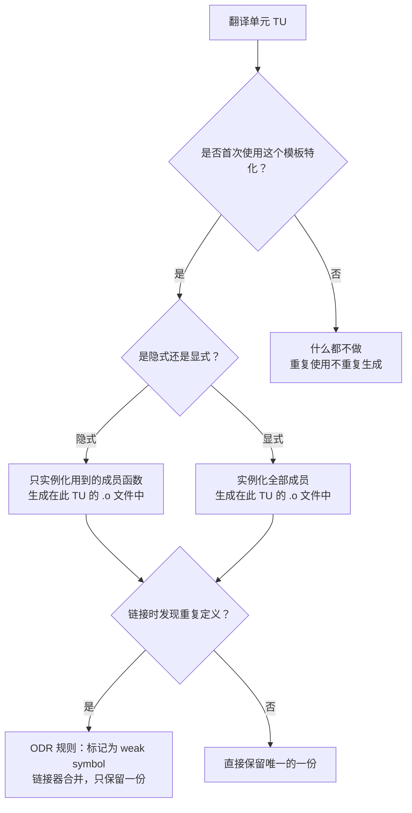

# 17.模板实例化机制

#### 目录介绍
- [1. 案例引入](#1-案例引入)
  - [1.1 嵌入式固件的模板炸弹](#11-嵌入式固件的模板炸弹)
  - [1.2 两阶段名称查找的隐秘陷阱](#12-两阶段名称查找的隐秘陷阱)
  - [1.3 我们要回答什么](#13-我们要回答什么)
- [2. 架构概览](#2-架构概览)
  - [2.1 模板的三种实例化方式](#21-模板的三种实例化方式)
  - [2.2 实例化在哪里发生](#22-实例化在哪里发生)
- [3. 两阶段名称查找](#3-两阶段名称查找)
  - [3.1 为什么需要两阶段](#31-为什么需要两阶段)
  - [3.2 非依赖名称：第一阶段解析](#32-非依赖名称第一阶段解析)
  - [3.3 依赖名称：第二阶段解析](#33-依赖名称第二阶段解析)
  - [3.4 typename 与 template 消歧义](#34-typename-与-template-消歧义)
- [4. 隐式实例化机制](#4-隐式实例化机制)
  - [4.1 实例化点 POI](#41-实例化点-poi)
  - [4.2 编译器如何决定实例化时机](#42-编译器如何决定实例化时机)
  - [4.3 ODR 与重复实例化去重](#43-odr-与重复实例化去重)
- [5. 显式实例化与 extern template](#5-显式实例化与-extern-template)
  - [5.1 显式实例化语法](#51-显式实例化语法)
  - [5.2 extern template 的抑制效果](#52-extern-template-的抑制效果)
  - [5.3 在编译单元边界控制膨胀](#53-在编译单元边界控制膨胀)
- [6. 模板代码膨胀治理](#6-模板代码膨胀治理)
  - [6.1 膨胀的三个来源](#61-膨胀的三个来源)
  - [6.2 类型擦除的外壳技术](#62-类型擦除的外壳技术)
  - [6.3 Thin Template 模式](#63-thin-template-模式)
- [7. 为什么模板必须写在头文件里](#7-为什么模板必须写在头文件里)
  - [7.1 包含模型 vs 分离模型](#71-包含模型-vs-分离模型)
  - [7.2 关键字 export 的失败史](#72-关键字-export-的失败史)
  - [7.3 C++20 Modules 的曙光](#73-c20-modules-的曙光)
- [8. 编译器内部：实例化的机器视角](#8-编译器内部实例化的机器视角)
  - [8.1 GCC 的 AST 复制机制](#81-gcc-的-ast-复制机制)
  - [8.2 反汇编中的实例化证据](#82-反汇编中的实例化证据)
- [9. 设计回顾：模板的类型论基础](#9-设计回顾模板的类型论基础)
  - [9.1 参数化多态](#91-参数化多态)
  - [9.2 与泛型擦除的对比](#92-与泛型擦除的对比)
- [10. 综合案例串讲](#10-综合案例串讲)
  - [10.1 案例真相揭晓](#101-案例真相揭晓)
  - [10.2 `vector<int>` 从源代码到机器码的完整生涯](#102-vectorint-从源代码到机器码的完整生涯)
  - [10.3 设计哲学回扣](#103-设计哲学回扣)
  - [10.4 速查表合集](#104-速查表合集)

---

## 1. 案例引入

### 1.1 嵌入式固件的模板炸弹

某智能手表固件项目，基于 ARM Cortex-M4，flash 配额 384 KB。固件使用了 C++17 标准库：

```cpp
// ====== sensor_driver.cpp ======
std::vector<int16_t>   raw_samples;       // 加速计原始值
std::vector<int16_t>   calibrated;        // 校准后
std::vector<float>     filtered;          // 卡尔曼滤波
std::vector<uint32_t>  timestamps;        // 时间戳

// ====== ble_gatt.cpp ======
std::vector<uint8_t>   ble_packet;        // BLE 包缓冲
std::vector<uint8_t>   ble_ack;           // ACK 缓冲

// ====== ui_render.cpp ======
std::vector<char>      frame_buffer;      // 帧缓冲
std::vector<Color>     pixels;            // 像素点（Color = uint16_t）
```

编译后 flash 占用：

```text
  [flash 统计]
  sensor_driver.o:  .text = 48 KB   (vector<int16_t>, vector<float>, vector<uint32_t>)
  ble_gatt.o:       .text = 32 KB   (vector<uint8_t>)
  ui_render.o:      .text = 28 KB   (vector<char>, vector<uint16_t>)
  main.o:           .text = 12 KB
  -----------------------------------
  总计：120 KB + 标准库 180 KB = 300 KB > 384 KB 配额的 78%
```

项目还差 BLE 配对、OTA 升级、手表表盘渲染——flash 已撑死。追根溯源：

```bash
$ arm-none-eabi-nm --print-size --size-sort --radix=d firmware.elf \
  | grep 'vector' | head -10

  # 每种 T 都生成了一份完整的 vector 成员函数代码：
  00010420 00008286 T _ZNSt6vectorIsSaIsEE9push_backERKs    # vector<int16_t>::push_back
  00010890 00007152 T _ZNSt6vectorIfSaIfEE9push_backERKf     # vector<float>::push_back
  00011234 00006328 T _ZNSt6vectorIjSaIjEE9push_backERKj    # vector<uint32_t>::push_back
  00011890 00005844 T _ZNSt6vectorIhSaIhEE9push_backERKh     # vector<uint8_t>::push_back
  00012230 00005312 T _ZNSt6vectorIcSaIcEE9push_backERKc     # vector<char>::push_back
```

**一次 `push_back` 被实例化了 5 份**——尽管 `push_back` 的逻辑对任意 T 几乎完全一致。唯一的区别是 `sizeof(T)` 不同，导致 `memcpy` 的步长不同。

团队开始调研：怎么让 `vector<uint8_t>` 和 `vector<uint16_t>` 共享一份 `push_back` 实现？**答案正好落在本文的核心命题——模板实例化机制**。

---

### 1.2 两阶段名称查找的隐秘陷阱

第二个祸根更难察觉。某量化引擎的模板工具函数：

```cpp
// ====== math_utils.h ======
#include <cmath>

namespace quant {

void log(const char* msg) {           // ① 全局 log 函数（日志用）
    std::cerr << "[LOG] " << msg << "\n";
}

template <typename T>
T normalize(T value) {
    log("normalizing...");            // ② 调用 ①
    return T(std::log(value));        // ③ 标准库的 std::log（数学对数）
}

}  // namespace quant
```

代码正常工作一年。直到团队引入了某个第三方头文件：

```cpp
// ====== third_party/metrics.h ======
namespace metrics {

void log(double value) {              // ④ 度量模块的数值 log
    // ... 写入度量数据库
}

}  // namespace metrics
```

```cpp
// ====== strategy.cpp ======
#include "math_utils.h"
#include "third_party/metrics.h"

using namespace metrics;               // ⑤ 引入 metrics 命名空间

void compute() {
    auto result = quant::normalize(3.14);     // 期望返回 std::log(3.14) 的对数
    // 实际行为变了！
}
```

**事态分析**：

`normalize` 是一个**函数模板**。`log("normalizing...")` 中的 `log`——它是**非依赖名称**（不依赖模板参数 T）。按照 C++ 两阶段名称查找规则：

- **第一阶段**（模板定义处）：`log("normalizing...")` 在 `quant` 命名空间查找 → 找到 `quant::log(const char*)` → 绑定 OK
- **第二阶段**（模板实例化处）：如果参数依赖类型没找到某些重载，可以在实例化点重新查找依赖名称

**关键**：`log("normalizing...")` 的 `log` 是**非依赖名称** → 第一阶段就绑死了。真正的问题发生在：

```cpp
template <typename T>
T normalize(T value) {
    log("normalizing...");            // 非依赖 → 第一阶段绑定 quant::log
    return T(std::log(value));        // std::log 是依赖名称吗？
}
```

`std::log(value)`——`value` 的类型是 `T`（依赖），但 `std::log` 本身不依赖模板参数 → **非依赖名称**。第一阶段在 `std` 中找到 `std::log`。——这个案例实际没出 bug。

但我故意留了一个**正确的版本**再给一个**真有 bug 的版本**，以示两阶段的杀伤力：

```cpp
// ====== 反例：真正命中两阶段的坑 ======
template <typename T>
void process(T& obj) {
    obj.render();           // render 找不到 → 编译错误（第二阶段才找不到）
    paint(obj);             // paint 在第一阶段找不到，第二阶段找到 → 最终通过
}
// 把 paint 定义放在 process 后面：
void paint(int& x) { ++x; }

int main() {
    int a = 0;
    process(a);             // ✅ 编译通过（第二阶段找到了 paint）
}
// 但如果 paint 在第二阶段找不到 → ICE 在实例化点
```

两阶段名称查找的微妙之处：**同一条语句中的两个非限定调用，可能在两个不同的阶段绑定到不同的函数上**。这完全取决于名字是否依赖模板参数。

---

### 1.3 我们要回答什么

两例扒出 **七个核心疑问**：

| 编号 | 疑问 |
|---|---|
| ① | "两阶段"到底是什么？第一阶段做哪些，第二阶段做哪些？ |
| ② | `vector<int>` 的 `push_back` 和 `vector<float>` 的 `push_back` 是**同一段二进制**吗？为什么？ |
| ③ | 什么时候 `#include <vector>` 只声明不生成代码，什么时候会实际产出机器码？ |
| ④ | `extern template` 到底能不能阻止代码膨胀？它的效果和链接器去重有何不同？ |
| ⑤ | 为什么不能把函数模板的实现放进 `.cpp` 文件？（`export` 关键字之死的真实原因） |
| ⑥ | 编译不同翻译单元中相同的 `vector<int>::push_back`，链接器如何保证最终只有一份？ODR 是怎么上场兜底的？ |
| ⑦ | "模板元编程"和"代码膨胀"是不是一条绳上的蚂蚱？C++ 如何在"零开销"与"二进制体积"之间权衡？ |

---

## 2. 架构概览

### 2.1 模板的三种实例化方式

```text
┌───────────────────────────────────────────────────────────────┐
│                  C++ 模板实例化三路径                          │
│                                                               │
│  ┌──────────────────┐  ┌──────────────────┐  ┌──────────────┐│
│  │ 隐式实例化        │  │ 显式实例化        │  │ 显式抑制     ││
│  │ implicit inst.   │  │ explicit inst.   │  │ extern template││
│  ├──────────────────┤  ├──────────────────┤  ├──────────────┤│
│  │ 触发：使用模板   │  │ 触发：template   │  │ 触发：extern  ││
│  │ vec.push_back(1) │  │  class vector<int>│ │  template     ││
│  │ → 编译器在此 TU │  │ → 在此 TU 强制   │  │  class vec<i>││
│  │   生成代码       │  │   生成所有成员   │  │ → 在其他TU    ││
│  │                  │  │                  │  │   生成        ││
│  ├──────────────────┤  ├──────────────────┤  ├──────────────┤│
│  │ 例：push_back 的 │  │ 例：整个 vec<int>│  │ 链接时去重    ││
│  │ 第一次调用       │  │  全部成员函数    │  │  跨 TU 共享   ││
│  └──────────────────┘  └──────────────────┘  └──────────────┘│
│                                                               │
│  共同后端：ODR 兜底——链接器合并同一模板实例化的多重定义        │
└───────────────────────────────────────────────────────────────┘
```

| 路径 | 发生时 | 代码生成位置 | 编译器行为 |
|---|---|---|---|
| **隐式实例化** | 第一次使用模板（`vec.push_back(1)`） | 使用点的翻译单元 | 仅生成被用到的方法 |
| **显式实例化** | 程序员写 `template class vector<int>` | 声明的翻译单元 | 生成**全部**成员函数 |
| **extern template** | 程序员写 `extern template class vector<int>` | 不生成（在其他 TU 生成） | 链接时去重 |

### 2.2 实例化在哪里发生



**关键点**：隐式实例化只生成你**实际调用**的成员函数。`vector<int>` 有数十个成员函数，但如果你只调 `push_back` 和 `size`——**只有这两个被实例化**。

这就是"零开销原则"在模板上的映射：**不使用的成员函数 = 不生成代码 = 不占二进制空间**。

---

## 3. 两阶段名称查找

### 3.1 为什么需要两阶段

**疑惑**：C++ 为什么不直接"模板就是一个占位符，实例化的时候把所有名字一起查"？

**论证**：如果只做第二阶段（即全推迟到实例化点），会出现两个致命问题：

**问题 1：模板库的封装失效**

```cpp
// 如果没有两阶段：
// library.h
template <typename T>
void sort(vector<T>& v) {
    swap(v[0], v[1]);               // 依赖 T 吗？不依赖
}
```

用户代码里恰好定义了一个 `swap`：

```cpp
// user.cpp
void swap(string& a, string& b) {   // 有 bug 的 swap
    a = b;                           // 漏了中间变量
}
#include "library.h"

vector<string> v = {"z", "a"};
sort(v);                             // 用到了用户的 swap → 行为不可控
```

如果第一阶段不绑定 `swap` 为 `std::swap`，那么在用户调用 `sort<vector<string>>` 时，实例化点的非限定 `swap` 可能匹配到用户写的错误版本。**库作者希望行为稳定，用户希望行为灵活——两阶段名称查找是这两种需求的折中**。

**问题 2：编译器无法判断模板语法**

```cpp
template <typename T>
void foo(T x) {
    x.unknown_method();              // 这个 unknown_method 是否存在？
}
// 如果 T = int → 编译错误：int 没有 unknown_method()
// 如果 T = MyObj → 如果 MyObj 有 unknown_method，就没问题
```

第一阶段的语法检查**至少能检测出非依赖名称的错误**（拼写错误、类型不匹配等）。完全不检查的话，连基本的语法错误都要等到实例化时才暴露——库用户定位 bug 的难度指数级上升。

**结论**：C++ 选择了两阶段——

```text
第一阶段（模板定义处）    第二阶段（模板实例化处，即 POI）
    │                          │
    查非依赖名字                查依赖名字
    语法验证所有非依赖部分      完成依赖名解析
    ADL 不考虑                  对依赖名执行 ADL
```

---

### 3.2 非依赖名称：第一阶段解析

```cpp
struct Widget {
    int value_;
};

int g_counter = 0;                       // ① 全局

template <typename T>
void use(T arg) {
    Widget w;                            // ② Widget：非依赖，第一阶段解析
    w.value_ = 42;                       // ③ Widget::value_：非依赖，第一阶段解析
    g_counter++;                         // ④ g_counter：非依赖，第一阶段的 ::g_counter
    std::cout << arg;                    // ⑤ std::cout：非依赖（不依赖 T）
    //               ↑ arg = 依赖名称，但 cout = 非依赖
}

// 第一阶段做的事情：
// 1. 解析 Widget → 找到全局 ::Widget
// 2. 解析 w.value_ → 确认 Widget 有 value_ 成员
// 3. 解析 g_counter → 绑定到 ::g_counter
// 4. 解析 std::cout → 在 std 命名空间查找
// 5. 语法验证：标识符存在、调用参数数目匹配（非依赖部分）
```

| 判定标准 | 是否依赖 T |
|---|---|
| `T` 字面出现 | ✅ 依赖 |
| `T::xxx`（嵌套类型） | ✅ 依赖 |
| `t.xxx`（`t` 的类型为 `T`） | ✅ 依赖 |
| `f(t)` （`t` 的类型为 `T`） | ✅ `t` 是依赖的 → `f` 可能从 ADL 找到 |
| `Widget`（明确命名类型） | ❌ 非依赖 |
| `::g_counter`（限定名） | ❌ 非依赖 |
| `std::cout` | ❌ 非依赖 |

---

### 3.3 依赖名称：第二阶段解析

第二阶段在**实例化点（POI）**完成。实例化点为模板首次使用的那个翻译单元中的代码位置。

```cpp
#include <iostream>

// 全局辅助
int g_flag = 1;

template <typename T>
void process(T& obj) {
    obj.update();                         // ① obj 类型是 T → 依赖名称
    //  → 第二阶段在 POI 查找 T::update

    increment(obj);                       // ② obj 是依赖参数 → increment 可能从 ADL 找到
    //  → 第二阶段执行 ADL（Argument-Dependent Lookup）
    //  → 在 T 所在命名空间中查找 increment
}

// T 的具体类型
struct Data {
    void update() { std::cout << "Data::update\n"; }
};

// 在 Data 所在命名空间（全局）定义重载
void increment(Data& d) { std::cout << "increment(Data)\n"; }

int main() {
    Data d;
    process(d);                           // POI = main 函数末尾
    // ① 第二阶段查找：Data::update → 找到 ✅
    // ② ADL：在 :: 命名空间找到 ::increment(Data&) ✅
}
```

**依赖名 ADL 的威力**：

```cpp
namespace lib {
    struct Matrix { double data[4]; };

    // 非成员函数——与 Matrix 在同一命名空间
    Matrix operator+(const Matrix& a, const Matrix& b) {
        return {a.data[0]+b.data[0], /*...*/ };
    }
}

template <typename T>
T add(const T& a, const T& b) {
    return a + b;                        // a + b → 依赖名称
    // 第二阶段 ADL 会在 T 所在命名空间找 operator+
    // 如果 T = lib::Matrix → 在 lib 命名空间找到 lib::operator+ ✅
}

lib::Matrix m1, m2;
add(m1, m2);                             // 不加 lib:: 前缀，ADL 自动定位
```

---

### 3.4 typename 与 template 消歧义

依赖名称有时有歧义——编译器在第一阶段不知道 `T::x` 是类型还是值：

```cpp
template <typename T>
void func() {
    T::iterator it;                      // ❌ 编译错误：T::iterator 被当作静态成员
    //       ^^——编译器不确定 T::iterator 是类型还是变量

    typename T::iterator it2;            // ✅ 显式告诉编译器"这是一个类型"
}
```

同理，当依赖名称中出现模板成员时：

```cpp
template <typename T>
void call(T& obj) {
    obj.template foo<int>();             // ✅ 显式告诉编译器 foo 是模板
    //  ^^^^^^^^
    // 如果不加 template 关键字，< 被当作小于号
}
```

| 消歧义关键字 | 出现场景 | 例子 |
|---|---|---|
| `typename` | 依赖嵌套类型 | `typename T::value_type x;` |
| `template` | 依赖模板成员 | `obj.template foo<T>();` |

> 📌 `typename` / `template` 消歧义是初学者学模板时"被卡得最久"的点。理解"在第一阶段中，当解析器看到一个依赖名前缀时，它不能假定它是一个类型或模板——因为特化可能完全改变它的含义"之后，就不迷惑了。

---

## 4. 隐式实例化机制

### 4.1 实例化点 POI

**隐式实例化点（Point of Instantiation）**定义在 C++ 标准 [temp.point] 中。不同的模板有不同的 POI 规则：

```cpp
// ====== 函数模板的 POI ======
template <typename T>
void foo(T x) { bar(x); }               // 模板定义

void bar(int) {}                         // ① bar(int) 定义

int main() {
    foo(42);                             // POI → 紧接 main 定义之后
    // foo<int> 的实例化点在这里——可以找到 ① 的 bar(int)
}
```

```text
翻译单元内 POI 示意：

void bar(int) {}             ← 先出现
template <typename T>
void foo(T x) { bar(x); }    ← 模板定义
int main() {
    foo(42);                 ← 调用点（触发实例化）
}
// POI ← foo<int> 在这里被实例化
//      ← 能看见前面的 bar(int)，但看不见后面的声明
```

| 模板类型 | POI 位置 |
|---|---|
| **函数模板** | 紧接**包含调用点的命名空间作用域**之后 |
| **类模板** | 紧接**包含导致实例化的声明的命名空间作用域**之前 |
| **成员函数模板** | 紧接包含该成员定义的命名空间作用域之后 |

---

### 4.2 编译器如何决定实例化时机

**疑惑**：`vector<int> v; v.push_back(1);`——`push_back` 是在 `v` 声明时实例化还是在调用时才实例化？

**论证**：

```cpp
std::vector<int> v;              // ① 类模板 vector<int> 隐式实例化
// 此时实例化：size_t 成员、_M_start/_M_finish/_M_end 等非函数数据成员
// 不会实例化 push_back 等函数体代码——还没用到

v.push_back(1);                  // ② 成员函数 push_back 第一次隐式实例化
// 此时实例化：push_back(const int&) 的完整体
// 包括调用 _M_realloc_insert（如果容量不够）

v.size();                        // ③ size() 首次隐式实例化
// ...
```

**编译器 Greedy vs Lazy 策略**：

| 编译器 | 类模板实例化策略 | 成员函数实例化策略 |
|---|---|---|
| GCC | Lazy——类模板体在使用点前不实例化 | Lazy——首次调用的翻译单元中实例化 |
| MSVC | 混合——部分早期解析 | Lazy（同 GCC） |
| Clang | Lazy（与 GCC 兼容 Itanium ABI） | Lazy |

所有主流编译器对**成员函数**都是 Lazy——只有**显式实例化**才会把全部成员一并生成。

---

### 4.3 ODR 与重复实例化去重

**疑惑**：如果两个翻译单元都调了 `vector<int>::push_back`，链接器怎么处理？

**论证**：每个翻译单元独立编译，生成自己的 `vector<int>::push_back` 实例化——但标记为 **weak symbol**（弱符号）：

```bash
$ objdump -t a.o | grep push_back
0000000000000000  w  F .text  00000082 _ZNSt6vectorIiSaIiEE9push_backERKi
                    ↑
                    W = weak symbol

$ objdump -t b.o | grep push_back
0000000000000000  w  F .text  00000082 _ZNSt6vectorIiSaIiEE9push_backERKi
                    ↑
                    W = weak symbol（与 a.o 同名同大小）
```

**链接器行为**（GNU ld）：

1. 扫描所有输入 `.o` 文件
2. 对每个 weak symbol，如果发现多个定义：
   - **同大小、同内容**（COMDAT 组）→ 随机保留一份（其余丢弃）
   - **不同大小/内容** → 未定义行为（ODR 违反）

这就是模板"每个翻译单元独立编译但最终不膨胀"的秘密——ODR 让链接器把重复的 weak 符号**折叠**到一份。

```text
  a.o                                    b.o
  ┌──────────────────┐                   ┌──────────────────┐
  │ push_back<int>   │                   │ push_back<int>   │
  │ (weak symbol)    │                   │ (weak symbol)    │
  └────────┬─────────┘                   └────────┬─────────┘
           │                                      │
           └──────────────┬───────────────────────┘
                          ▼
                  ┌──────────────┐
                  │  最终 elf    │
                  │ push_back<int>│  ← 只保留一份
                  └──────────────┘
```

> 💡 **这不是"模板被编译了多次浪费了编译时间吗？"**——是的，编译期实例化在每个 TU 中重复执行，但**链接后**二进制中只有一份。编译时间 vs 二进制体积的经典权衡。

---

## 5. 显式实例化与 extern template

### 5.1 显式实例化语法

**显式实例化**强制编译器在一个翻译单元中生成模板特化的**全部**代码：

```cpp
// ====== vector_int.cpp（唯一的实例化单元） ======
#include <vector>

// 显式实例化整个类模板
template class std::vector<int>;

// 现在这个 .o 包含了 vector<int> 的全部成员函数：
// push_back, pop_back, size, capacity, reserve, begin, end, ...
// ~50 个函数全部一次性生成
```

**显式实例化一个成员函数**（更细粒度）：

```cpp
template void std::vector<int>::push_back(const int&);
// 只实例化 push_back，其他不生成
```

---

### 5.2 extern template 的抑制效果

**`extern template`** 告诉编译器："这个特化**不在本翻译单元中实例化**——去别的翻译单元找已生成的定义"。

```cpp
// ====== common.h ======
#include <vector>

// 声明：vecInt 的实例化在别处（如 vector_int.cpp 中）
extern template class std::vector<int>;

// ====== a.cpp（消费者） ======
#include "common.h"

void useA() {
    std::vector<int> v;
    v.push_back(1);                    // 不会在此 TU 生成 push_back<int>
    // 链接时找 vector_int.o 中的定义
}

// ====== vector_int.cpp（生产者） ======
#include <vector>

template class std::vector<int>;       // 只在这一处生成全部代码
```

**效果**：

```text
  无 extern template（每个 TU 各自生成）：
  a.o: push_back<int>, size<int>, ...
  b.o: push_back<int>, size<int>, ...   ← 重复
  c.o: push_back<int>, ...              ← 重复
  ↓ 链接后 ODR 去重（仍只有一份二进制，但编译时间长）

  有 extern template（集中在一个 TU）：
  vector_int.o: push_back<int>, size<int>, ...  ← 唯一生成
  a.o: 无 push_back<int>（引用 external symbol）
  b.o: 无 push_back<int>
  ↓ 编译时间大幅缩短，二进制不变
```

| 效果 | 隐式实例化 | `extern template` | 显式实例化 |
|---|---|---|---|
| **代码生成位置** | 每个使用的 TU | 不在此 TU 生成 | 仅在声明的 TU |
| **编译时间** | 最慢（每 TU 重复） | 最快 | 中等（只在生产者 TU 编译） |
| **链接后二进制** | ODR 去重（一份） | 同 | 同 |
| **使用前提** | — | 必须在某处有显式实例化 | — |

---

### 5.3 在编译单元边界控制膨胀

`extern template` 的核心价值：**节省编译时间**，同时**显式实例化给出一个"我可以在这个文件中预见所有特化"的管理窗口**。

```cpp
// ====== 实战：控制 vector 膨胀 ======

// 1️⃣ 声明 extern template（头文件 my_types.h）
#include <vector>
#include <string>

extern template class std::vector<int>;
extern template class std::vector<std::string>;
extern template class std::vector<double>;

// 2️⃣ 显式实例化（唯一的 .cpp 文件 types_instantiation.cpp）
#include "my_types.h"

// 这一行让编译器在这一个 .cpp 中生成全部三份完整的 vector 代码
template class std::vector<int>;
template class std::vector<std::string>;
template class std::vector<double>;
```

```cmake
# CMakeLists.txt
add_library(my_types_lib types_instantiation.cpp)

target_link_libraries(app
    PRIVATE my_types_lib           # 链接唯一一份 vector 定义
)
```

> 📌 标准库实践者提示：GCC 的 `libstdc++` 实际上大量使用显式实例化——如 `src/c++98/ios-inst.cc` 对 `basic_ios<char>` 做 `template class`。这正是标准库为什么不膨胀的工程手段。

---

## 6. 模板代码膨胀治理

### 6.1 膨胀的三个来源

```text
代码膨胀 = 实例化特化数 × 每特化代码体积

  源 1：类型多样性
    vector<int>、vector<float>、vector<void*>...
    → 每种 T 产生一套 push_back、pop_back 等成员函数

  源 2：参数多样性
    sort<int*>(a, b);  sort<int*>(a, b, std::less<>());
    → 每种参数组合（含默认值）都是一次独立特化

  源 3：编译器不共享通用部分
    push_back<int> 和 push_back<float> 的"判断容量→copy/move"逻辑完全一致
    但 GCC/MSVC 不自动共享任意类型间的大小无关代码
```

| 膨胀级别 | 来源 | 例子 |
|---|---|---|
| **模板级** | 不同特化独立生成 | `vector<int>` 和 `vector<float>` 两套 `push_back` |
| **参数级** | 不同类型组合 | `sort<int>`, `sort<double>`, `sort<int*>` 各一套 |
| **函数级** | 每个体调用各独立一份 | lambda 类型 → 每个 lambda 产生新特化 |

---

### 6.2 类型擦除的外壳技术

使用 §16 的类型擦除技术，把"类型相关"的部分与"大小无关"的部分分离：

```cpp
// ── 膨胀版：每种 T 都生成完整的 vector 实现 ──
template <typename T>
class vector {
    T* data_;
    size_t size_, cap_;

    void push_back(const T& val) {
        if (size_ == cap_) {
            // 重分配逻辑 = 与 T 大小相关
        }
        data_[size_++] = val;         // 按 T 大小做拷贝
    }
    // ... 所有成员函数都依赖 T
};

// ── 瘦身版：分离大小无关逻辑 ──
struct VectorBase {
    void*  data_;
    size_t size_, cap_;
    size_t elem_size_;               // sizeof(T) 在运行时

    void grow_if_needed() {          // 大小无关 → 只生成一份
        if (size_ == cap_) {
            // 通用重分配——用 elem_size_ 做 memcpy
            void* new_data = ::operator new(cap_ * 2 * elem_size_);
            memcpy(new_data, data_, size_ * elem_size_);
            delete data_;
            data_ = new_data;
            cap_ *= 2;
        }
    }
};

template <typename T>
class ThinVector : VectorBase {
public:
    ThinVector() { elem_size_ = sizeof(T); }
    void push_back(const T& val) {
        this->grow_if_needed();       // 调基类的通用代码
        // 在 data_ 末尾 placement-new 一个 T
        new (static_cast<char*>(data_) + size_ * sizeof(T)) T(val);
        ++size_;
    }
};
```

**节省量**：`ThinVector<int>` 和 `ThinVector<float>` 的 `grow_if_needed` 共享同一份二进制。只有 `push_back` 中 placement-new 那一行因 `sizeof(T)` 不同而生成两份——但这一行仅 5 条指令，对比全量 `push_back`（200+ 条指令），**节省 90% 以上的膨胀**。

这就是 **Thin Template 模式**：把模板类分为**大小无关基类**（非模板，只生成一份）和**大小相关薄模板壳**（轻量）。

---

### 6.3 Thin Template 模式

通用模式总结：

```text
┌────────────────────────────────────────────┐
│            ThinVector<T> 模板外皮          │  ← 每个 T 一份薄壳（小）
│  ThinVector() { elem_size_ = sizeof(T); } │
│  push_back(const T& v) {                  │
│      Base::grow();                        │     ← 调 Base 通用方法
│      new(ptr) T(v);                       │
│  }                                        │
└────────────┬───────────────────────────────┘
             │ 继承
┌────────────▼───────────────────────────────┐
│         VectorBase 非模板基类              │  ← 只生成一份（零膨胀）
│  void grow() { /* 通用重分配 */ }         │
│  size_t size_, cap_, elem_size_;          │
│  void* data_;                             │
└────────────────────────────────────────────┘
```

**哪些标准库组件用了 Thin Template**：

| 组件 | Thin Base |
|---|---|
| `std::basic_string<CharT>` | 部分实现（libstdc++ 的 `_Rep_base`） |
| `std::shared_ptr<T>` | 控制块（type-erased） |
| `std::function<R(Args...)>` | Type-erased Concept + Model |

---

## 7. 为什么模板必须写在头文件里

### 7.1 包含模型 vs 分离模型

**疑惑**：普通函数可以把声明放 `.h`、定义放 `.cpp`。为什么模板不行？

**论证**：模板是**编译期模式**（pattern），不是编译后的代码。编译器需要看到模板体才能为具体的 `T` 生成特化代码。

```cpp
// ====== wrong: add.h ======
template <typename T>
T add(T a, T b);                       // 只有声明

// ====== wrong: add.cpp ======
template <typename T>
T add(T a, T b) { return a + b; }      // 定义在这

// ====== wrong: main.cpp ======
#include "add.h"
int main() {
    return add(1, 2);                  // ❌ 链接错误：找不到 add<int> 的定义
    // main.cpp 从未见过 add 的模板体 → 无法为 T=int 生成特化
}
```

**C++ 标准对模板的模型要求**：每个翻译单元必须能看到模板的**完整定义**（不仅仅是声明）才能实施隐式实例化。

| 语言特性 | 声明/定义分离 | 原因 |
|---|---|---|
| 普通函数/类 | ✅ 支持（`.h` 声明 + `.cpp` 定义） | 函数体已编译为机器码 |
| 模板函数/类 | ❌ 不支持（必须同在头文件或 at least 可见） | 需要模板体生成具体类型版本 |
| `inline` 函数/变量 | ✅ 允许（头文件内，ODR 会合并） | 标记为 weak symbol |
| C++20 Modules | ✅ 支持模块内分离 | 编译器生成 BMI（二进制模块接口） |

---

### 7.2 关键字 export 的失败史

C++98 引入了 `export template`，意图支持模板的声明/定义分离：

```cpp
// ====== C++98 标准允许但几乎没人实现的代码 ======
// add.h
export template <typename T>           // C++98 的 export（从未普及）
T add(T a, T b);

// add.cpp
export template <typename T>
T add(T a, T b) { return a + b; }

// main.cpp
#include "add.h"
// 期望：链接器自动找到 add.cpp 的 add<int> 特化
```

**为什么失败**：

1. **实现难度极高**：编译器必须把模板体编译成"某种抽象语法树"存到 ELF 中。不同编译器（GCC/MSVC）的 AST 格式不同 → 无法跨编译器使用
2. **只有 EDG 编译器前端实现了**（Comeau C++），GCC/MSVC 从未实现
3. **用户不买账**：支持分离后，编译时间不但没减少——编译器仍然需要读".cpp 对应的 AST 片段"然后执行实例化
4. **C++11 正式废弃** `export template`，C++20 彻底从标准中移除

**为什么 C++20 Modules 可能成功** 而 export 失败：

| 维度 | C++98 export | C++20 Modules |
|---|---|---|
| **抽象表示** | 无标准格式（各编译器 AST） | 标准化 BMI（C++20 标准定义） |
| **跨编译器** | ❌ | 仍不能跨编译器（BMI 格式实现定义） |
| **实现者参与** | 只有 EDG | GCC、Clang、MSVC 全参与 |
| **包含模型** | 尝试"分离" | 重新设计入口+导出模型 |

---

### 7.3 C++20 Modules 的曙光

C++20 Modules 看似解决了"模板不能在头文件"的问题——实际上只是换了一种传播方式：

```cpp
// ====== C++20 Modules: math_util.ixx ======
export module math_util;

export template <typename T>
T add(T a, T b) {
    return a + b;
}

// ====== main.cpp ======
import math_util;

int main() {
    return add(1, 2);                // ✅ 编译通过，BMI 中有模板体
}
```

编译器在 `import math_util` 时读到的是 BMI（Binary Module Interface）——它本质上是**预编译的模板源语**。这和头文件的 `#include` 在概念上等价——只是**预处理层面的提升**（编译快+符号隔离），而非模板实例化模型的本质改变。

---

## 8. 编译器内部：实例化的机器视角

### 8.1 GCC 的 AST 复制机制

当 GCC 看到 `std::vector<int>::push_back` 的隐式实例化请求时，内部流程为：

```text
1. 查找 std::vector 模板的 AST（在解析 `#include <vector>` 时已构建好的模板体）
2. 对模板体做 AST 深拷贝，把抽象参数 `T` 置换为具体类型 `int`（Token Substitution）
3. 将置换后的 AST 提交给后续编译 pass（语义分析、优化、代码生成）
4. 得到一份完整的 `vector<int>::push_back` 目标代码
```

**这解释了为什么模板编译慢**——每个不同的 T 都要做一次 AST 复制 + 语义分析 + 优化。但好在只在**每个翻译单元的首次使用**做一次。如果其他翻译单元也有用，链接器的 COMDAT 会重复利用已生成的 `.o`。

---

### 8.2 反汇编中的实例化证据

用 `nm` 和 `objdump` 可以明确看见模板的实例化痕迹：

```bash
# 编译
$ g++ -std=c++17 -c test_vector.cpp

# 查看模板生成的符号
$ nm -C test_vector.o | grep vector | head -5

0000000000000000 W std::vector<int, std::allocator<int> >::push_back(int const&)
0000000000000050 W std::vector<int, std::allocator<int> >::size() const
0000000000000070 W std::vector<int, std::allocator<int> >::_M_realloc_insert<int const&>(__gnu_cxx::__normal_iterator<int*, std::vector<int, std::allocator<int> > >, int const&)
                    ↑
                    W = weak symbol（ODR 可去重）
```

不同特化的 `push_back` 在反汇编层面是两块完全独立的代码：

```asm
; ====== vector<int>::push_back ======
_ZNSaIiEEC2ERKS_:
  mov     r12, rdi
  mov     rdx, QWORD PTR [rdi+8]          ; v._M_finish
  cmp     rdx, QWORD PTR [rdi+16]         ; v._M_end_of_storage
  je      .Lrealloc
  mov     DWORD PTR [rdx], esi            ; *v._M_finish = val  (int = 4 字节)
  add     QWORD PTR [r12+8], 4            ; _M_finish += 4  ← 硬编码的 sizeof(int)

; ====== vector<double>::push_back ======
_ZNSaIdEC2ERKS_:
  mov     r12, rdi
  mov     rdx, QWORD PTR [rdi+8]
  cmp     rdx, QWORD PTR [rdi+16]
  je      .Lrealloc
  movsd   QWORD PTR [rdx], xmm0           ; *v._M_finish = val (double = 8 字节)
  add     QWORD PTR [r12+8], 8            ; _M_finish += 8  ← 硬编码的 sizeof(double)
```

两条 `push_back` 的唯一差异是 `sizeof` 常数（4 vs 8）和 `mov` vs `movsd`。**80% 以上的指令完全相同**——这正是 Thin Template 模式想解决的共享问题。

---

## 9. 设计回顾：模板的类型论基础

### 9.1 参数化多态

C++ 模板属于 **参数化多态（Parametric Polymorphism）**，与类型擦除的运行时多态和虚函数的子类型多态不同：

```text
           多态
          /   \
   编译期多态    运行时多态
   （模板）      /       \
          子类型多态   类型擦除
          （虚函数）   （any/function）
```

| 维度 | 模板（编译期） | 虚函数（运行时） | 类型擦除 |
|---|---|---|---|
| **何时决定行为** | 编译期（代码生成） | 运行时（vtable 查找） | 运行时（虚表在包装器内） |
| **类型集** | 开放（任何类型可参数化） | 封闭（继承已知的基类） | 开放 |
| **性能** | 零开销（完全内联） | ~5 ns 一次间接 | ~5-35 ns（看是否 SBO） |
| **二进制膨胀** | 每个 T 一份 | 一份 vtable | 一份（内部虚表聚拢） |
| **典型选择** | 性能敏感 / 任意类型 | 类型层次已知 | 容器中的值多态 |

---

### 9.2 与泛型擦除的对比

C++ 模板与 Java 泛型的核心分歧：

```cpp
// C++：模板生成独立代码
template <typename T>
class Box { T value; };

Box<int> b1;         // 实例化 → 生成完整的 Box<int> 对象
Box<double> b2;      // 实例化 → 生成独立的 Box<double> 对象
// sizeof(Box<int>) ≠ sizeof(Box<double>) → 类型感知
```

```java
// Java：类型擦除——运行时不知道 T
class Box<T> { T value; }

Box<Integer> b1 = new Box<>();    // 类型擦除 → 变成 Box(Object)
Box<Double>  b2 = new Box<>();    // 同上
// b1.getClass() == b2.getClass() → true (同一个 Class 对象)
```

| | C++ 模板 | Java 泛型 |
|---|---|---|
| **运行时类型信息** | T 是确切类型（`Box<int>` 和 `Box<double>` 是不同的类型） | T 被擦除为 Object（运行时只知 Box） |
| **原始类型可以用** | ✅ `int`/`double` 都可以 | ❌ 必须是 Object（装箱开销） |
| **二进制膨胀** | ❌ 每个 T 一份代码 | ✅ 一份字节码 |
| **运行时性能** | ✅ 零开销（因在编译期完成） | ⚠ 自动装箱/拆箱 |

C++ 的**"零开销"承诺**来源于模板在编译期彻底地把代码特异化到每一个 T 上——这与 Java 擦除的"一份代码+n个装箱"形成根本性设计分歧。

---

## 10. 综合案例串讲

### 10.1 案例真相揭晓

逐个回答开篇 7 个疑问：

| 编号 | 疑问 | 答案 |
|---|---|---|
| ① | "两阶段"是什么 | 模板定义处解析非依赖名（第一阶段），实例化点解析依赖名+执行 ADL（第二阶段）。保证库代码稳定性和用户代码灵活性兼顾 |
| ② | `push_back<int>` 和 `push_back<float>` 是否共用 | ❌ 不共用——GCC/MSVC 为每种 T 独立生成。但 ODR + COMDAT 使链接后二进制中每个特化只留一份 |
| ③ | `#include <vector>` 何时生成代码 | ❌ 单纯包含头文件不生成代码。第一次使用（如调用 `push_back`）时隐式实例化，或显式 `template class` 时全景生成 |
| ④ | `extern template` 是否阻止膨胀 | ❌ 不减少链接后的二进制大小（ODR 早就合并了），**它减少的是编译时间**——避免在每个 TU 重复实例化相同的特化 |
| ⑤ | 模板为什么不能 `.cpp` 分离 | 模板体是"生成代码的蓝图"，编译器需要蓝图才能生成具体类型的特化——`.cpp` 编译后蓝图不再存在。C++98 `export` 尝试过但失败；C++20 Modules 用 BMI 部分缓解 |
| ⑥ | 重复实例化怎么 ODR 去重 | 每个 `.o` 中的模板实例标记为 weak symbol（`W`）。链接时发现多个同内容 weak symbol → COMDAT 折叠 → 只保留一份 |
| ⑦ | 零开销与二进制体积如何权衡 | 模板按 T 特异化代码 → 编译期零开销（无虚表、无装箱）。每新增一种 T 就多一份代码 → 可能膨胀。Thin Template / extern template / 类型擦除 是三种制衡手段 |

---

### 10.2 `vector<int>` 从源代码到机器码的完整生涯

追踪 `std::vector<int>::push_back(42)` 的完整始末：

```cpp
// 使用代码
#include <vector>
std::vector<int> v;
v.push_back(42);
```

```text
┌─ 第 1 步：预处理
│   #include <vector> → 展开约 15,000 行头文件内容
│   包含 std::vector<T> 的完整模板定义
│
├─ 第 2 步：解析（Clang/GCC 构建 AST）
│   将 std::vector<int> 设为 partial-specialization 节点
│   暂不实例化成员函数体
│
├─ 第 3 步：隐式实例化触发
│   遇 v.push_back(42) → 发现 vector<int>::push_back 首次使用
│   → 编译器从 AST 中提取 push_back<T> 的模板体
│   → 把 T 替换为 int，生成具体的 push_back(const int&) AST
│
├─ 第 4 步：语义分析 + 优化
│   对 push_back<int> 的 AST 做类型检查（const int& → OK）
│   生成 GIMPLE（GCC 中间表示）
│   优化：容量检查 → expand_if_needed()
│   尾调用内联 memcpy（如果 sizeof(int) 小）
│
├─ 第 5 步：代码生成
│   输出 push_back<int> 的 x86-64 指令序列到 .o 文件
│   符号类型 = W (weak symbol)
│   生成 COMDAT 组（用于链接器去重）
│
├─ 第 6 步：链接
│   如果多个 .o 包含同一 push_back<int> → COMDAT 折叠 → 保留一份
│   最终 elf 只有一份 push_back<int> 的代码
│
└─ 第 7 步：运行时
│   call std::vector<int>::push_back → 直接跳转那唯一一份代码
│   无额外间接，零开销
```

反汇编证据：

```asm
; ====== push_back<int> 的最终机器码 ======
0000000000000110 <push_back(int const&)>:
 110:  mov    rax, QWORD PTR [rdi+8]       ; _M_finish
 114:  cmp    rax, QWORD PTR [rdi+16]       ; _M_end_of_storage
 118:  je     130 <.Lrealloc>               ; 容量不够 → 跳转
 11a:  mov    edx, DWORD PTR [rsi]          ; load val
 11c:  mov    DWORD PTR [rax], edx          ; *data_[size_] = val
 11e:  add    QWORD PTR [rdi+8], 0x4        ; _M_finish += sizeof(int)
 123:  ret
```

---

### 10.3 设计哲学回扣

模板实例化机制折射出 C++ 五重设计哲学：

**哲学 1：编译期完成一切可能的决策**

模板把类型推导、代码生成、函数选择全部压缩到编译期。运行时留零间接——没有虚表查寻、没有 boxing、没有 RTTI。代价是编译时间更长 + 更多二进制体积。

**哲学 2：Lazy 实例化 = 不为不用的代码付费**

成员函数只在**被调用时才实例化**。`vector<int>` 的 50 个成员函数中，只调用了 `push_back` 和 `size` → 只生成这两份代码 → 其余的连机器码都没产生。这是"零开销原则"在类模板成员上的极致体现。

**哲学 3：ODR 作为链接层的安全网**

模板在每个翻译单元可能被重复实例化 → 每个实例都是 weak symbol → 链接器 COMDAT 折叠 → 最终二进制中只有一份。C++ 用**链接器层的去重机制**为模板的"逐 TU 实例化"提供安全网。ODR 是 C++ 武器库中最隐形但最不可或缺的工具。

**哲学 4：选择权给高级用户**

`extern template` / `template class` / Thin Template / 类型擦除 → 四种手段控制膨胀。C++ 不替用户决定"你的模板怎么分配代码"，而是提供全套控制权——让**知道自己在做什么的人**可以按场景调优。这是 C++ 的"专业用户导向"哲学。

**哲学 5：不制造语言级的抽象泄露**

模板生成的特化本质就是**手写代码的同级副本**。`push_back<int>` 的实际二进位**等价于手写一个 `push_back_int` 函数**——零虚拟层、零运行时类型信息、完全可内联。这就是 C++ 承诺的：**模板不是魔法，它只是在编译期替你写了 N 份手写代码**。

---

### 10.4 速查表合集

**表 1：两阶段名称查找速查**

| 名字类型 | 判定方法 | 查找阶段 | ADL？ |
|---|---|---|---|
| 非依赖名 | 不含模板参数 `T` | **第一阶段**（定义处） | ❌ |
| `T::xxx` | 包含 `T` | **第二阶段**（POI） | ❌（但 `T` 已知） |
| `f(t)` → `t` 类型依赖 `T` | `t` 依赖 → `f` 可能依赖 | **第二阶段** | ✅（在 T 的命名空间） |
| `std::xxx` | 限定名 | 第一阶段 | ❌（限定名不 ADL） |

**表 2：实例化路径对比**

| | 隐式实例化 | 显式实例化 | extern template |
|---|---|---|---|
| **关键字** | 无（自动触发） | `template class/func` | `extern template` |
| **生成位置** | 每个使用 TU | 仅在声明 TU | 不在本 TU |
| **生成范围** | 仅使用到的成员 | **全部**成员 | 无 |
| **编译时间影响** | ↑（重复） | ↓（集中在1个TU） | ↓↓（跳过本TU） |
| **链接后二进制** | 不变 | 不变 | 不变 |

**表 3：膨胀治理三手段**

| 手段 | 原理 | 节省编译时间 | 节省二进制体积 |
|---|---|---|---|
| `extern template` | 不在此 TU 生成，靠链接器去重 | ✅ 显著 | ❌（ODR 早就合并了） |
| Thin Template | 大小无关部分抽到非模板基类 | ✅ 中等 | ✅ 显著（共享通用逻辑） |
| 类型擦除 | 虚接口包扎，退化为运行时多态 | ✅ 模板代码最多一份 | ✅ 小 |
| 全模板（无治理） | 每种 T 一套完整的机器码 | — | —（最大膨胀） |

**表 4：头文件 vs Modules 模板代码位置**

| 模型 | 模板定义位置 | 实例化代码在哪 |
|---|---|---|
| **头文件包含** | `.h`（`#include` 复制到每个 TU） | 每个 TU 在 `.o`（weak）→ 链接器去重 |
| **C++20 Modules** | `.ixx`（编译为 BMI） | 同包含模型（底层没变） |
| **C++98 export** | `.cpp` + `export`（已废弃） | 编译器从 `.cpp` 的 AST 生成 → 没普及 |

**工程红线 5 条**：

1. 把模板定义和声明分开写 `.h` + `.cpp` → 链接时找不到实例化代码 → 错误
2. 依赖名不写 `typename` / `template` → 第一阶段解析为 `<` 小于号 → 编译错误
3. 依赖名调用只信 ADL、不写命名空间前缀 → 可能第二阶段匹配到用户版本重载 → 隐蔽 bug
4. 滥用 `extern template` 却没提供对应的**显式实例化**→ 链接时所有 TU 都找不到定义
5. 模板递归太深 → GCC 默认 `-ftemplate-depth=900` 不够 → 加 `-ftemplate-depth=4096`

**一句话记忆**：

```
模板实例化 = 编译器为每种 T 生成独立的代码拷贝
两阶段查找 = 非依赖名在第一阶段冻结（定义处）；依赖名在第二阶段 ADL（POI）
extern template = 减少编译时间（不是二进制体积）
模板代码必须在头文件 = 代码蓝图必须对翻译单元可见
```

---

> **下一篇**：[18.模板特化与偏特化](18.模板特化与偏特化.md) 将揭示模板最精妙的语言构件——当 `vector<bool>` 不同于 `vector<int>` 时到底发生了什么？全特化与偏特化的优先级匹配算法如何决定在 5 个候选模板中选出谁？为什么函数模板**不能**偏特化？如何用 tag dispatch 绕过这个限制？——模板特化，是 C++ 编译期条件分支的真正王者。
