# 1.2需求层次的模型
#### 目录介绍
- [01.看一个真实案例](#看一个真实案例)
- [02.有过自己的梦想](#02有过自己的梦想)
- [03.人生的需求模型](#03人生的需求模型)
- [04.梦想的需求层次](#04梦想的需求层次)
- [05.不同阶段的追求](#05不同阶段的追求)
- [06.成长生涯的愿景](#06成长生涯的愿景)
- [07.层次的激励措施](#07层次的激励措施)
- [08.最后做一些题目](#08最后做一些题目)
- [09.总结回顾本章节](#09总结回顾本章节)
- [10.后来发生的改变](#10后来发生的改变)
- [11.今天起改变三点](#11今天起改变三点)
- [12.课后作业思考下](#12课后作业思考下)


## 01.看一个真实案例

去年年中我跳槽，月薪从 22k 干到了 30k，涨幅 30%。签合同那天我请同事吃饭、还在朋友圈发了一句"努力终于被看见"。我以为我会持续地高兴一段时间。

结果第二个月发完工资，我躺在沙发上，第一反应是："好像也就那样。" 第三个月再发工资，我开始算 35k 的同行什么时候能轮到我；第四个月我又陷入了和上一份工作几乎一模一样的焦虑——觉得收入还是不够、觉得房子离市区太远、觉得自己技术栈在贬值。

有朋友当时说了一句让我至今记得的话："你不是缺钱，你是不知道自己到底要什么。"


后来我慢慢想明白：我之所以涨薪两周就重新焦虑，是因为这次涨薪只满足了一个我已经满足过的层次——"安全需求"，但我以为它能满足"尊重需求"和"自我实现"，所以才会失落。

更准确地说，我追的"年薪 50 万"目标，其实不是我自己的目标。它是同事饭桌上谈的目标、是知乎热搜里的目标、是父母期待的目标——是别人灌给我的"尊重需求"标签。当我把别人的目标当成自己的，我就永远在追逐一个永不到位的远方。

所以这一篇我想认真讲清楚一件事：**搞懂自己每一个目标背后的"需求层次"是什么，比拼命追目标本身，更重要。**

## 02.有过自己的梦想

你肯定有过梦想，做过梦，每个人都不例外。小时候梦想着做老师，做飞行员，做工程师，当老板……后来不管是否有实现，一定有过这样或者那样的梦想。

反问一下，为什么有这样的梦想？如果不能清晰地看见梦想之路前方的愿景，计划半途而废的概率就很大了。古希腊哲学家苏格拉底有一句名言："未经检视的人生不值得活。"

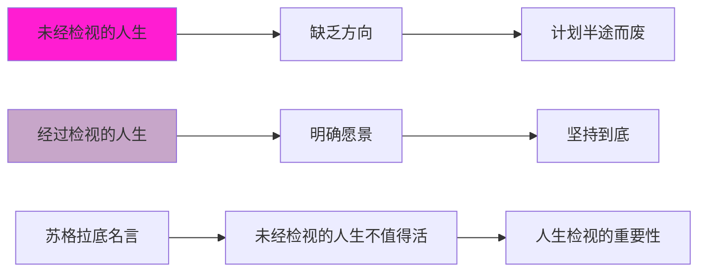

那么我们为什么要检视自己的人生呢？正是因为我们有成长的梦想，那么梦想的根源又到底是什么呢？

梦想的根源，是个人内心深处的渴望、愿望和追求。它们可以是对个人成长、成就、幸福和满足的渴望，也可以是对某种特定状态、经验或目标的向往。

```梦想与需求的关系模型
梦想 = 内心渴望 + 需求驱动 + 目标导向 + 行动计划
```

回到我自己——我所谓的"想多赚钱"，其实是在表达"我害怕被同龄人甩下"。这不是梦想，是焦虑。把焦虑当梦想去追，越追越累。

## 03.人生的需求模型

上世纪四十年代（1943 年）美国心理学家亚伯拉罕·马斯洛在《人类激励理论》中提出了需求层次理论模型，它是行为科学的理论之一。

需求层次理论是解释人格的重要理论，也是解释动机的重要理论。该理论认为个体成长发展的内在力量是动机，而动机是由多种不同性质的需要所组成，各种需要之间，有先后顺序与高低层次之分，每一层次的需要与满足，将决定个体人格发展的境界或程度。

**马斯洛之所以在1943年提出这个理论，正值第二次世界大战期间**。当时人们面临极端的生存和安全威胁，马斯洛观察到：只有当最基本的生存需求被满足后，人们才会关注更高层次的精神追求。这一观察至今依然成立——你很难让一个还在为温饱发愁的人去思考"自我实现"。

然后来看一下下面的需求层次思维导图：

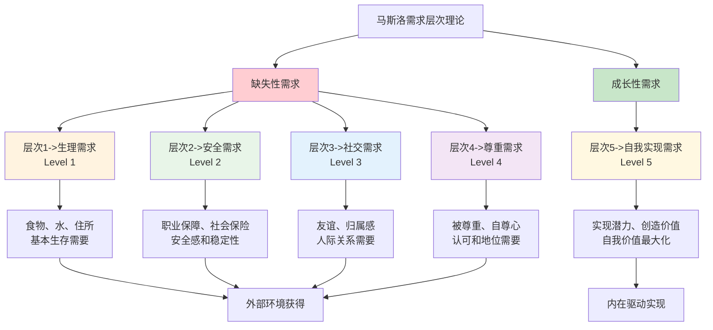

1. 看需求层次1，生理需要，是个人生存的基本需要，如吃、喝、住处。
2. 看需求层次2，安全需要，包括心理上与物质上的安全保障，如不受盗窃的威胁，预防危险事故，职业有保障，有社会保险和退休基金等。
3. 看需求层次3，社交需要。人是社会的一员，需要友谊和群体的归宿感，人际交往需要彼此同情、互助和赞许。
4. 看需求层次4，尊重需要，包括要求受到别人的尊重和自己具有内在的自尊心。
5. 看需求层次5，自我实现需要，指通过自己的努力，实现自己对生活的期望，从而对生活和工作真正感到很有意义。

| 层次 | 需求类型 | 具体内容 | 满足方式 | 激励特点 |
|------|----------|----------|----------|----------|
| **Level 1** | 生理需求 | 吃、喝、住处等基本生存需要 | 外部环境提供 | 缺失性需求 |
| **Level 2** | 安全需求 | 心理与物质安全保障 | 制度和环境保障 | 缺失性需求 |
| **Level 3** | 社交需求 | 友谊、归属感、人际交往 | 社会关系建立 | 缺失性需求 |
| **Level 4** | 尊重需求 | 他人尊重和内在自尊 | 成就和认可 | 缺失性需求 |
| **Level 5** | 自我实现 | 实现人生期望和意义 | 内在驱动实现 | 成长性需求 |

人在满足了基本的需求之后，就要去实现更高的需求和目标。一个人可以有自我实现的愿望，但要达到自我实现的境界，成为一个自我实现的人，却不是每个人都能办到的，这种人也只是少数而已。

值得注意的是，**需求层次并不是严格的"完成一层才能进入下一层"**。在现实生活中，多个层次的需求往往同时存在，只是在不同的人生阶段，某个层次会成为主导。比如一个创业者，可能同时面临安全需求（收入不稳定）和自我实现需求（想要创造价值），这种矛盾恰恰是成长的动力源泉。

另一个重要的规律是：**低层次需求被满足后，其激励作用会迅速减弱**。涨了工资的喜悦通常只能持续一两个月，之后你就会把这个收入当作"理所应当"，开始追求更高层次的满足。理解这一点，可以帮你避免陷入"永远觉得钱不够"的焦虑循环——这正是我跳槽涨薪后两周就重新焦虑的根本原因。

需求满足与梦想实现时序图

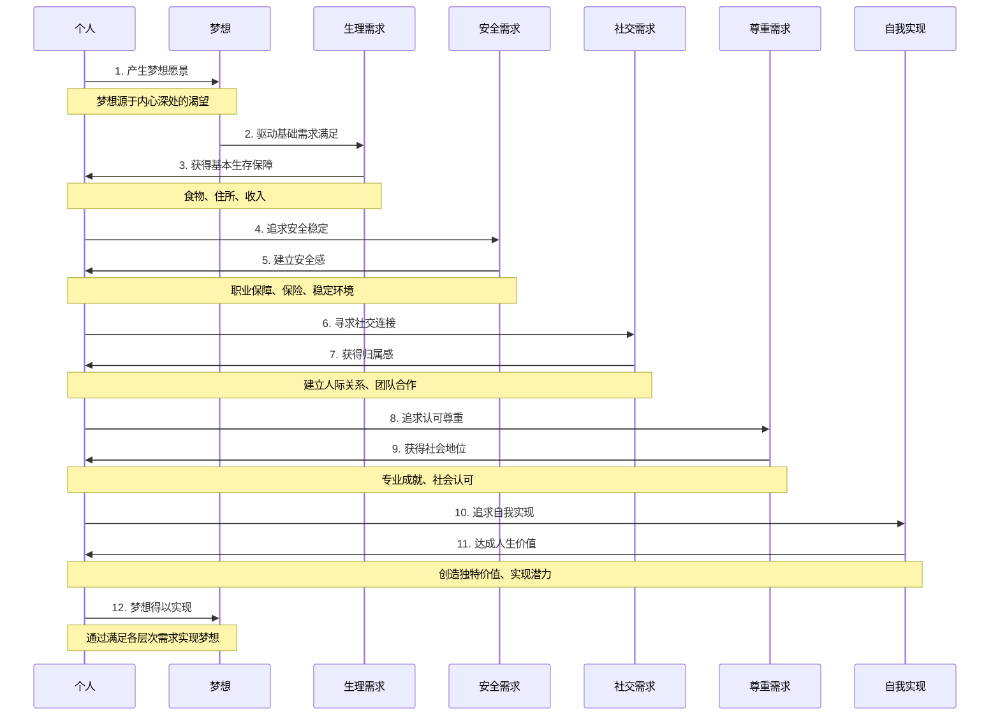

## 04.梦想的需求层次

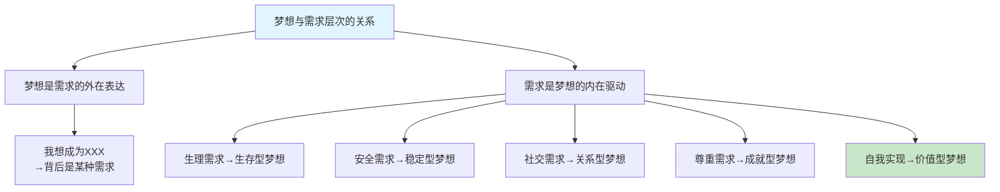

梦想与需求的内在联系。梦想可以成为一个人追求满足不同需求层次的动力和目标，同时满足这些需求也有助于实现梦想。梦想与需求层次相结合时，可以将个人的梦想视为驱动满足不同需求层次的动力。

**每一个梦想的背后，都隐藏着一种或多种需求**。当你说"我想赚很多钱"的时候，可能是生理需求（改善生活条件）、安全需求（抵御风险）或者尊重需求（获得社会认可）在驱动你。认识到梦想背后的真实需求，能帮你更精准地设定目标。

假设一个人的梦想是成为一名成功的音乐家。我们可以将这个梦想与马斯洛的需求层次理论联系起来：

| 需求层次 | 对音乐家的具体含义 | 满足标志 |
|----------|---------------------|----------|
| **生理需求** | 食物、水和住所等基本生存 | 有稳定收入维持生活 |
| **安全需求** | 稳定的演出收入和住所保障 | 职业发展有保障 |
| **社交需求** | 与音乐家、粉丝和听众建立联系 | 拥有音乐圈人脉 |
| **尊重需求** | 被行业认可、赞赏和尊重 | 获得奖项或口碑 |
| **自我实现** | 通过音乐创造独特价值 | 创作出满意的作品 |


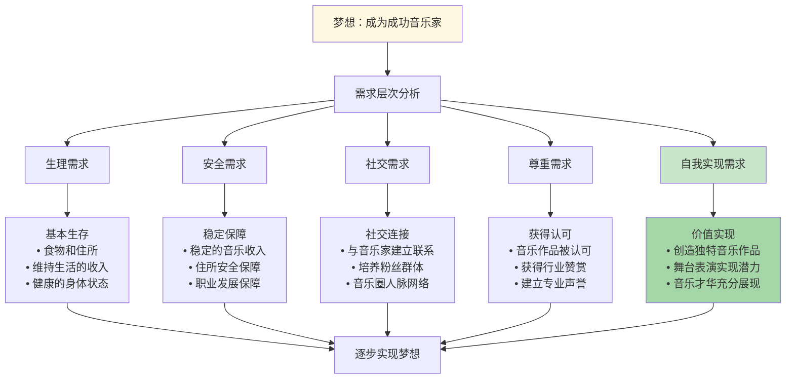

**你的梦想属于哪个层次**。理解了梦想与需求层次的关系后，你可以审视自己的梦想：**它主要是在满足哪个层次的需求？** 如果你的梦想还停留在解决温饱和安全问题，那说明你还在"缺失性需求"阶段；如果你的梦想是创造价值、实现人生意义，那你已经在追求"成长性需求"了。

## 05.不同阶段的追求

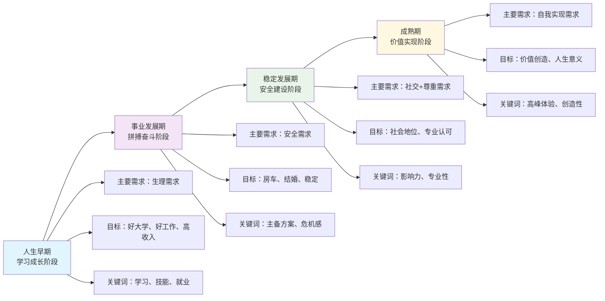

在人生的早期，我们努力学习，目标是考一个好大学，拥有一技之长，找一份好工作，带来更高薪的收入，这很大程度都是为了满足图中最底层的生存需求，让生活变得更舒适美好。

这个阶段的核心关键词是**学习和积累**。你拥有最充沛的精力和最低的试错成本，应该尽可能多地投资自己——学技能、考证书、积累经验。**在这个阶段偷的懒，都会在后面的阶段加倍偿还**。

成长拼搏数年，事业小成，工作稳定，目标是有房，有车，找个媳妇结婚生子。第二层次，也就是安全的需求开始凸显。处在这个阶段时，有时候有一种强烈的不安全感和危机感，生活的压力逐渐加大。

带有主备方案：主，指当前支撑生活的工作；备，是通过持续学习，同步成长，保持核心能力的不断积累与时间的付出来获得一份备份保障，以避免"主"出现意外时，"备"的能力已被时代淘汰。

**"主备方案"思维非常重要**。它不是让你脚踏两条船，而是让你在专注主业的同时，始终保持一项可以在关键时刻"兜底"的能力。这份安全感，来自于你的不可替代性。

**稳定期与成熟期——追求更高价值**

| 阶段 | 主要需求 | 核心目标 | 关键行动 |
|------|----------|----------|----------|
| **稳定发展期** | 社交+尊重需求 | 社会地位、专业认可 | 扩大影响力、深耕专业 |
| **成熟期** | 自我实现需求 | 价值创造、人生意义 | 回馈社会、追求高峰体验 |

马斯洛把底层的四类需求：生存、安全、归属、尊重归类为"缺失性"需求，它们的满足需要从外部环境去获得。

而最顶层的"自我实现"则属于"成长性"需求。成长就是自我实现的过程，成长的动机也来自于"自我实现"的吸引。

人生最激荡人心的时刻，就在于自我实现的创造性过程中，产生出的一种"高峰体验"感。正因为人所固有的需求层次模型，我们才有了愿望，愿望产生目标，目标则引发计划。

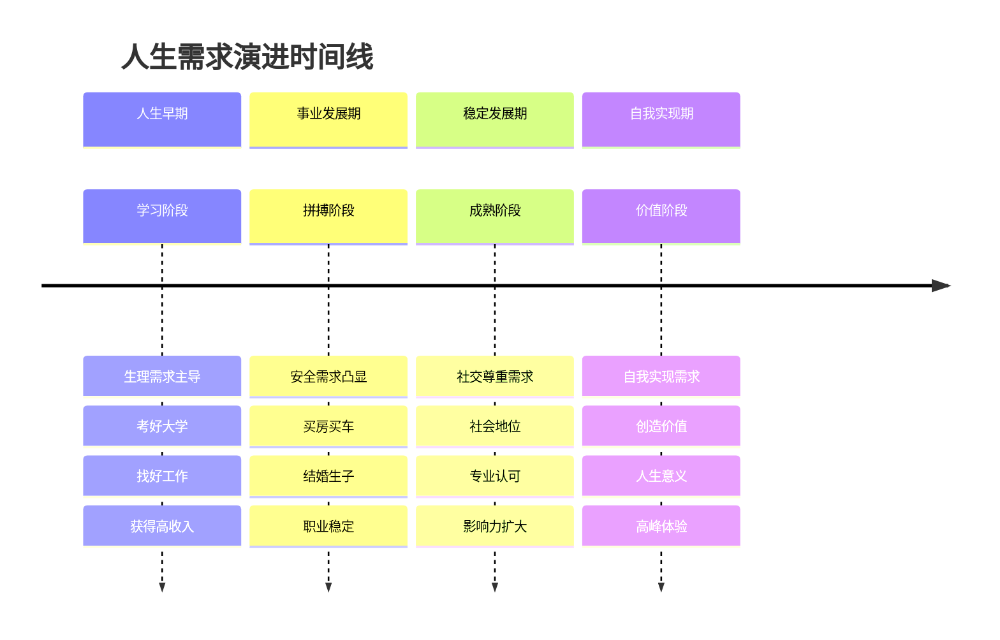

## 06.成长生涯的愿景

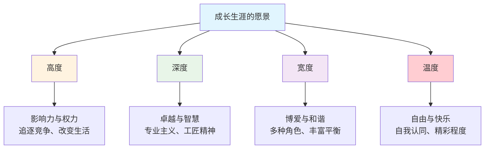

**1.生涯的四个维度**。"生涯"一词最早来自庄子语：吾生也有涯，而知也无涯。以有涯随无涯，殆已。"涯"字的原意是水边，隐喻人生道路的尽头，尽头已经没了路，是终点，是边界。

**对生涯提出了四个维度：高度、宽度、深度和温度。这里就借他山之玉，来谈谈我的理解**。

| 维度 | 核心价值观 | 代表关键词 | 追求方向 |
|------|------------|------------|----------|
| **高度** | 影响与权力 | 追逐竞争、改变生活 | 向上攀登，拓展影响力 |
| **深度** | 卓越与智慧 | 专业主义、工匠精神 | 向下深耕，追求极致 |
| **宽度** | 博爱与和谐 | 多种角色、丰富平衡 | 向外延伸，多元发展 |
| **温度** | 自由与快乐 | 自我认同、精彩程度 | 向内探索，热爱生活 |

**2.谈谈人生的高度**。高度，代表着我们未来的目标和愿景。把视线放远，从未来想达到的高度着眼现在，可以帮助我们明确自己的方向和目标。

没有目标的人生就像一艘没有航向的船，只能随波逐流。因此，我们需要设定明确的目标，并制定可行的计划，一步步朝着目标前进。在人生的道路上不断攀登，达到更高的高度。

**追求高度的关键不在于你现在站多高，而在于你是否在持续向上走**。从一线开发者到技术Leader，从技术Leader到架构师，从架构师到CTO——每一步都需要新的能力和视野。

**3.追求领域的深度**。深度是指我们在某一领域或技能上的卓越程度。发挥优势，在某一领域达成卓越，是实现深度发展的关键。

需要找到自己的优势所在，并不断深耕细作，使之成为我们的核心竞争力。当我们在某个领域达到卓越时，就会获得他人的认可和尊重，也会更加自信和满足。

**深度的秘诀在于"10000小时定律"的精髓——不是简单的重复，而是有目的的刻意练习**。每次练习都要比上一次更难一点，每次复盘都要比上一次更深一层。只有这样，你才能从"熟练"走向"精通"。

**4.构建跨行业宽度**。宽度是指我们构建可迁移能力，运用优势在当下获得确定的自我。在这个快速变化的时代，单一的技能或知识已经无法满足我们的需求。

我们需要具备跨领域、跨行业的可迁移能力，才能应对各种挑战和机遇。通过不断学习和实践，我们可以拓展自己的能力和视野，让自己变得更加全面和多元。

**宽度不是让你什么都学，而是围绕你的核心能力，拓展相关的辅助能力**。比如一个优秀的程序员，如果同时具备产品思维、项目管理能力和良好的沟通能力，他的价值就远超一个只会写代码的人。

**5.让生活充满温度**。温度用热爱点燃生涯激情，可以让我们的人生更加充实和有意义。热爱是我们前进的动力源泉，只有对自己所做的事情充满热情，才能持续不断地投入精力和时间。

当我们找到自己真正热爱的事情时，就会感受到一种无法言喻的满足和快乐，也会更加珍惜和感恩生活中的每一个瞬间。

**6.四维度的平衡策略**。从现在开始，认真审视自己的生涯规划，明确自己的目标和方向。通过不断努力和实践，拓展自己的高度、深度、宽度和温度，让自己的人生变得更加精彩和有意义。

在不同维度的选择，都代表了不一样的"生涯"，每一种"生涯"都需要一定程度的计划与努力。每个人的人生发展路线都会有这四个维度。

虽有四种维度，四个方向，但不代表只能选其一。虽然我们不太可能同时去追求这四个维度，但可以在特定的人生不同阶段，在其中一个维度上，给自己一个去尝试和探索的周期。

所以，这就有了选择，有了计划。而计划会有开始，也会有结束，我们需要计划在人生的不同阶段，重点开始哪个维度的追求，以及大概需要持续的周期。

人生本是多维的，你会有多努力、多投入来设计并实现自己的生涯规划呢？不计划和努力一下，也许你永远无法知道自己的边界和所能达到的程度。

## 07.层次的激励措施

```mermaid
graph TD
    A[激励措施体系] --> B[生理需求激励]
    A --> C[安全需求激励]
    A --> D[社交需求激励]
    A --> E[尊重需求激励]
    A --> F[自我实现激励]
    
    B --> B1[涨工资改善收入]
    B --> B2[改善劳动条件]
    B --> B3[增加休息时间]
    B --> B4[提供更好福利]
    
    C --> C1[职业保障措施]
    C --> C2[医疗失业保险]
    C --> C3[退休福利保障]
    C --> C4[避免工作混乱]
    
    D --> D1[增加社交机会]
    D --> D2[建立和谐关系]
    D --> D3[组织团队活动]
    D --> D4[支持与赞许他人]
    
    E --> E1[公开奖励表扬]
    E --> E2[强调任务重要性]
    E --> E3[颁发荣誉奖章]
    E --> E4[优秀员工展示]
    
    F --> F1[设计复杂挑战]
    F --> F2[委派特别任务]
    F --> F3[提供发展空间]
    F --> F4[支持创新创造]
    
    style B fill:#ffcdd2
    style C fill:#fff3e0
    style D fill:#e3f2fd
    style E fill:#f3e5f5
    style F fill:#c8e6c9
```

**生理需求激励**：涨自己的工资、改善劳动条件、给予自己更多业余时间和休息、努力找到更好的福利待遇。让衣食住行不再担忧！

**安全需求激励**：希望自己职业保障、福利待遇，并保护自己不致失业，提供医疗保险、失业保险和退休福利、避免收到双重的指令而混乱。

这两个层次的激励本质上是"消除不满"——当基本需求得不到满足时，人会产生焦虑和不安；满足后焦虑消除，但不会产生强烈的工作动力。**真正驱动人持续前进的，是更高层次的需求**。我自己跳槽涨薪后只兴奋两周，正是因为涨薪只是消除了"安全焦虑"，并不会带来持续的动力。

**社交需求激励**：多和同事间社交往来机会，支持与赞许他人寻找及建立和谐温馨的人际关系，多参加有组织的体育比赛和聚会。

**尊严需求激励**：公开奖励和表扬，强调工作任务的艰巨性以及成功所需要的高超技巧，颁发荣誉奖章、在公司刊物发表文章表扬、优秀员工光荣榜。

**自我实现需求激励**：设计工作时运用复杂情况的适应策略，给有特长的人委派特别任务，在设计工作和执行计划时为下级留有余地。

理解了需求层次和激励措施后，你不必等别人来激励你，完全可以**设计自己的激励体系**：

| 需求层次 | 自我激励方法 | 具体做法 |
|----------|-------------|----------|
| **生理** | 改善生活质量 | 合理理财，提升收入 |
| **安全** | 建立安全网 | 保持学习，打造"备份方案" |
| **社交** | 主动建立连接 | 加入社区，定期社交 |
| **尊重** | 创造成就感 | 设定里程碑，庆祝每次进步 |
| **自我实现** | 追求内在驱动 | 找到热爱，创造独特价值 |

## 08.最后做一些题目

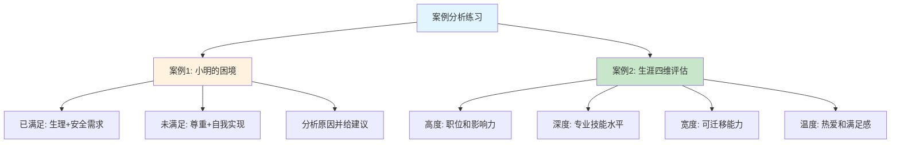

**小明的困境案例**。分析一下自己目前处在那个层次，然后着手准备超那个层次发展，怎么去做，说说自己对马斯洛需求的理解。接下来看几个案例：

**问题描述**：小明很努力，但工作还是没办法做上高管，小康达到但没能实现个人社会价值。**马斯洛需求层次分析**：

小明已经满足了生理需求和安全需求（小康生活），但卡在了尊重需求和自我实现需求上。这种情况非常常见——**努力≠方向正确**。很多人很努力地做事，但缺少战略性思考，不知道应该在哪些关键能力上发力。

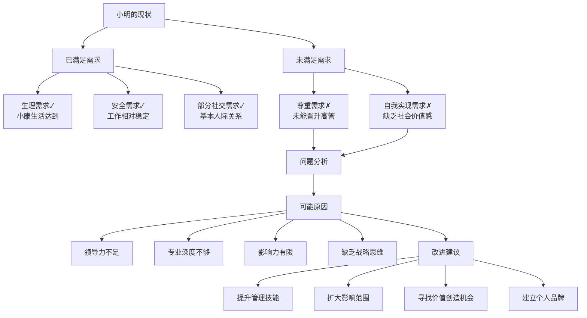

工作多年，你是否在生涯四个维度上有所提升？这种提升是否给你带来了潜在的价值？你在那个层次？

**评估维度**：

| 维度 | 评估问题 | 打分标准(1-10) |
|------|----------|----------------|
| **高度** | 当前职位层级？影响力范围？向上发展路径？ | 1=基层 → 10=高管 |
| **深度** | 专业技能水平？行业地位？是否被认为是专家？ | 1=入门 → 10=顶尖专家 |
| **宽度** | 可迁移能力？适应不同行业？角色转换能力？ | 1=单一技能 → 10=全面发展 |
| **温度** | 工作热爱程度？生活满意度？人生意义感？ | 1=厌倦 → 10=热爱 |

**评估建议**：给自己每个维度打分后，找出得分最低的维度。这个维度就是你当前最需要投入精力的方向。不要贪多，在一个阶段集中精力提升一个维度，效果远好于四个维度同时用力。

## 09.总结回顾本章节

**先搞清楚每一个目标背后属于哪个需求层次，再决定要不要为它拼命——这比追逐任何具体目标本身都重要。**

你应该带走的三件事

| 关键词 | 一句话理解 | 何时用到 |
|--------|-----------|----------|
| **缺失性 vs 成长性** | 涨薪只能消除焦虑、自我实现才能持续供能 | 焦虑反复涌现时回头看 |
| **生涯四维度** | 高度、深度、宽度、温度，一个阶段聚焦一个 | 做职业规划和取舍时 |
| **目标背后是需求** | 每个目标背后都站着一个层次，搞错了再努力也累 | 写新一年目标之前 |

## 10.后来发生的改变

**1.把目标重新分类**。我用一张 A4 纸写下了我当时同时在追的 7 个"目标"：年薪 50 万、买学区房、技术上做架构师、写技术博客到 1 万粉、技术分享超过2次、健身到马甲线、半年存够 10 万。写完我做了一件事——给每个目标贴上对应的需求层次。结果触目惊心：6 个都属于"安全 + 尊重"，只有"技术博客"勉强能挂到"自我实现"。难怪我每天都很累——我同时追 6 个本质上同质的目标，且都是"为了不输给别人"。

**2.主动砍掉 3 个目标**。那一个月我做了一件以前的我绝对不敢做的事：把"年薪 50 万"、"半年存 10 万"、"买学区房"这 3 个目标主动删掉了。理由很简单——我没那么需要，我只是怕别人有我没有。
砍掉之后，我并没有变穷，反而下班后回家不会再焦虑地翻知乎和脉脉，而是把那 1.5 小时拿去写专栏。第一个月我多写了 4 篇文章，比上半年加起来还多。

**3.半年后焦虑值显著下降**。半年后再看：年薪没到 50 万，但因为持续输出，我接到了一份兼职咨询，月外收入接近 8k；技术博客涨到 10000+ 粉，已经有人主动联系我做付费分享；我现在很清楚我下一年的"自我实现"是什么——做一个能让人愿意复购的小型技术专栏。更重要的变化是：我不再每两周就被焦虑刷一次屏。因为我知道，我这一阶段在追的，是一个"成长性"目标，它不会因为达成某个数字就突然失去意义。

## 11.今天起改变三点

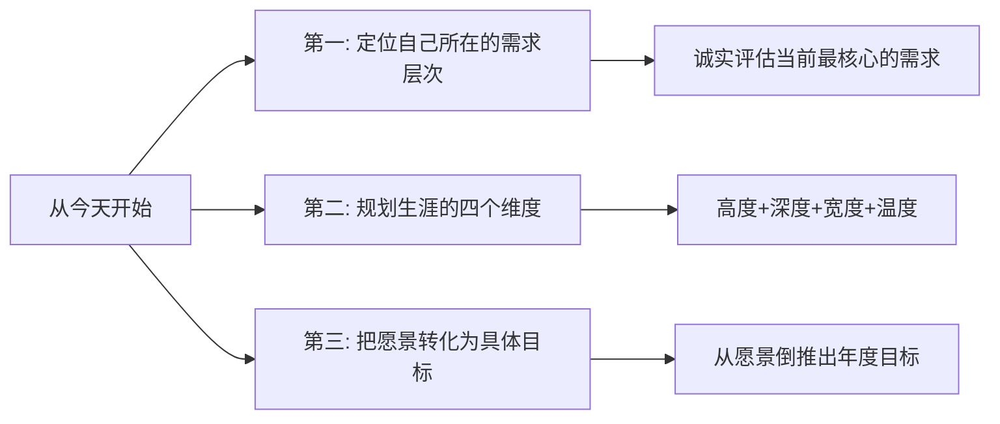

今天就花 10 分钟，把你当前在追的所有目标列出来，每个目标后面只写一个标签：生理 / 安全 / 社交 / 尊重 / 自我实现。如果你像我当初一样，6 个目标里 5 个都是"安全 + 尊重"，请大胆地砍掉至少 2 个——它们大概率不是你真的要的。

从高度、深度、宽度、温度四个维度审视你的生涯规划。哪个维度是你当前最需要发力的？你不需要四个维度同时追求，在当前人生阶段，选择一个最重要的维度，集中精力在这个维度上取得突破。

把愿景转化为具体的年度目标。如果你的愿景是"成为技术专家"，那么今年的目标可以是"深入掌握某个技术领域，输出 3 篇深度技术文章"。愿景不落地就是空想，目标不具体就是口号。

## 12.课后作业思考下

1.用马斯洛需求层次理论分析你自己的现状：你已经满足了哪些层次的需求？当前最迫切需要满足的是哪个层次？这个分析对你制定下一步计划有什么启发？

2.在生涯的高度、深度、宽度、温度四个维度中，给自己当前的状态各打一个 1-10 分。哪个维度得分最低？你打算如何提升它？

3.思考一下"缺失性需求"和"成长性需求"的区别。你目前追求的目标，属于哪一类？如果全部是缺失性需求，是否应该开始考虑成长性需求了？

4.假设你已经实现了自我实现，那个时候的你在做什么？过着怎样的生活？把这个画面写下来，它就是你的长期愿景。

5.把你当前同时在追的全部目标列在一张纸上，给每一个贴一个需求层次的标签，然后大胆地划掉至少 1 个"别人塞给你"的目标。一周后回顾，你是否变得更轻松、更专注？
