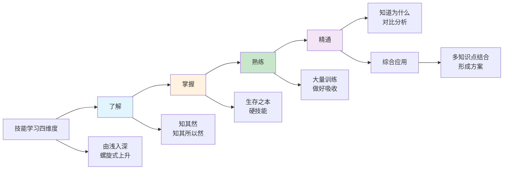
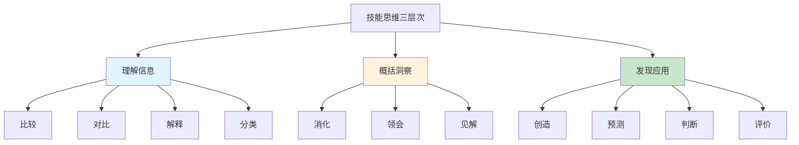
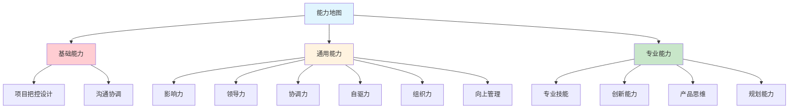
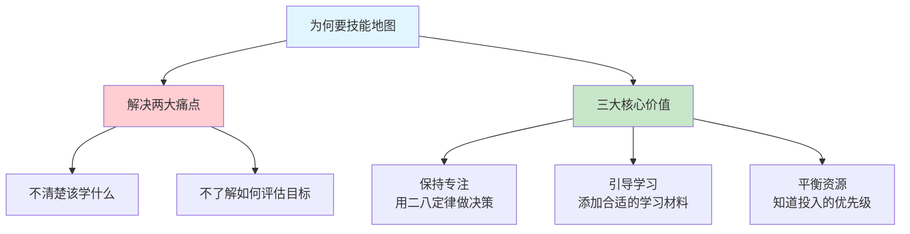
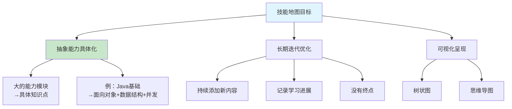
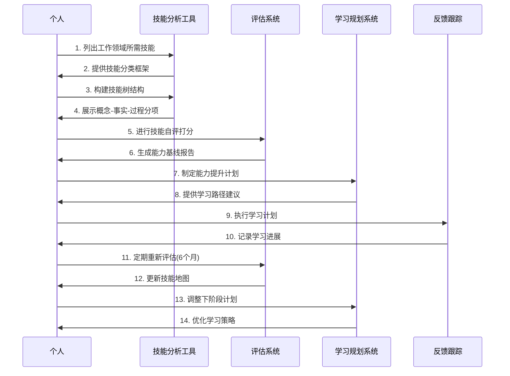
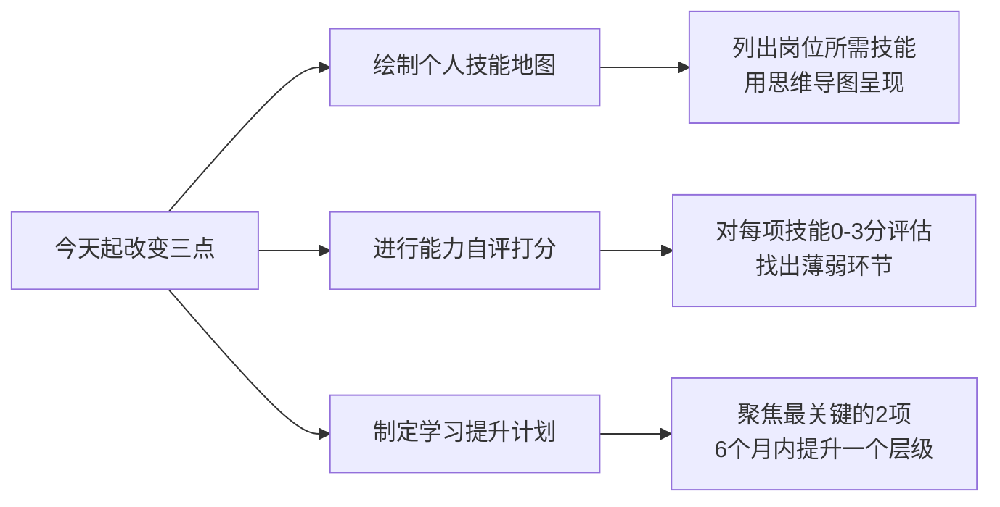

# 1.4要带上技能地图
#### 目录介绍
- [01.看一个真实案例](#01看一个真实案例)
- [02.晋升资本是什么](#02晋升资本是什么)
- [03.技能的学习维度](#03技能的学习维度)
- [04.技能的思维纬度](#04技能的思维纬度)
- [05.技能地图的用途](#05技能地图的用途)
- [06.能力地图的划分](#06能力地图的划分)
- [07.为何要技能地图](#07为何要技能地图)
- [08.技能地图的目标](#08技能地图的目标)
- [09.技能地图的构建](#09技能地图的构建)
- [10.总结回顾本章节](#10总结回顾本章节)
- [11.后来发生的改变](#11后来发生的改变)
- [12.今天起改变三点](#12今天起改变三点)
- [13.课后作业思考下](#13课后作业思考下)

## 01.看一个真实案例

工作第 5 年那次我去一家心仪的大厂面试。面试进行到后半段，面试官合上简历问我："抛开简历，你用自己的话告诉我——你从项目中做什么？" 我说："组件化开发、Android性能优化、并发、前端Web……。" 面试官追问："具体到什么程度？能承担什么样的工作？" 我卡住了。我想说"我 Java 很熟"，但我说不出来"熟"到什么程度；我想说"我做过高并发"，但我说不出具体的 QPS 和我做了哪些优化。

整整 40 秒，办公室里只有空调的声音。最后面试官礼貌地说："没关系，我们今天就先到这里。" 我知道那一轮结束了。

走出那栋大楼我坐在马路牙子上想了一个小时。**我工作了 5 年，竟然说不清楚我自己会什么。** 更可怕的是，我说不清楚不是因为我会得少，而是因为我从没认真盘点过——我以为忙就等于成长，以为项目数量等于技术深度，以为"感觉不错"就是实力。

那一夜我发现自己的技能"糊成一锅粥"。回家我拿了一张 A3 白纸，把我 5 年来做过的所有技术点写上去。写完我傻了：**三十多个技术名词，没有任何结构，也不知道哪一个我真的到了"能独立负责"的层次，更分不清哪些是护城河、哪些只是"了解过"**。

我意识到一件事：**一个没有"技能地图"的人，就像一个在大海里没有航海图的船长——他可能很努力地划桨，但他永远不知道自己到底在哪儿、下一程该往哪里走、哪里是礁石、哪里是风口**。

所以从那一夜开始，我给自己做了第一版技能地图。这一篇，我想把这张地图怎么画、怎么用、怎么迭代，一步一步讲清楚。

## 02.晋升资本是什么

有人经常会说一定要找到一份月薪多少多少的工作，争取做到什么什么职位，未来要赚多少的钱。

耐心听完"远大蓝图"，然后想一想："凭什么达到自己的目标？你的资本是什么？"

如果是你，你该怎么回答这个问题？有着自己的伟大抱负，你有没有想到，要实现这些目标，你的资本是什么？

对于很多已经身在职场的朋友而言，你晋升的资本又是什么？因此，自己需要清楚自己的优势，技能，资源，也就是能力地图！

不管所处什么行业做什么工作，在日常的工作中，你是否有这样的烦恼：

1.对自己的工作缺乏系统的认识，遇到实际问题时，没有有效的流程或模型，为自己的行动提供方向。

2.想要做有针对性的学习、查缺补漏，但又不知道自己缺什么，应该从哪里补起。

3.就算学了一堆干货、课程，但对自己的工作还是没有一点帮助，很难应用到实践中。

4.学习的过程中，会遇到各种各样的问题。比如，不懂得如何进行知识归类、很难明确自己的学习目标等等。

我当年就是这 4 条全中。不是不学习，是学完之后全在脑子里"散着"，从来没有归档过。

## 03.技能的学习维度

在技能地图中，需要先开启和点亮哪些部分呢？回顾过去的经历并结合现实的需要，可以从如下四个不同程度的维度来说明：

| 维度 | 定义 | 要求 | 示例 |
|------|------|------|------|
| **了解** | 知其然，甚至知其所以然 | 不是必需掌握，但需要有基本认知 | 知道Redis是什么，有什么用 |
| **掌握** | 一开始就要求的硬技能 | 生存之本，深度可以在实践中迭代 | 能用Java写出CRUD功能 |
| **熟练** | 经过大量训练后的深度掌握 | 不仅会用，还能做好 | 能独立完成一个完整项目 |
| **精通** | 比熟练更进一步 | 知道为什么，能对比分析 | 能做技术选型和架构设计 |

1.**了解**，相对掌握不是必需，但也需要达到知其然的程度，甚至知其所以然更好。很多人在"了解"这个层次上自我感觉良好，但真正测试时才发现一知半解。我当年被面试官问到 Redis 的时候，嘴上说的是"了解"，其实连持久化机制都没认真看过。

2.**掌握**，意味着是一开始就要求熟练掌握的硬技能，这是生存之本。而至于掌握的深度，是动态的，倒是可以在行进过程中不断去迭代加深。

3.**熟练**，在你掌握一门技能或者某个知识点的情况下，还要经过大量的训练，并且把东西做好，才能让你把东西吸收。**从掌握到熟练的关键跨越，在于"刻意练习"——有针对性地训练薄弱环节，而非简单重复已会的内容**。

4.**精通**，相比熟练更进一步。比如你做了某个方案，你还要知道为什么这样做，和其他方案对比优缺点分析，遇到那么困难以及如何解决等。

综合应用，结合实际多个知识点，在实践中能够形成一套自己的方案，运用所掌握的知识，搞定一件大的方案实践。**综合应用是精通之上的最高境界——不是单一技能的精通，而是多个技能的融合运用**。比如一个架构师，需要同时精通编程、系统设计、性能优化、团队协作等多个方面，才能做出好的架构方案。

## 04.技能的思维纬度

技能思维的培养比较务虚，不好评价和判断。在技能地图中，把思维纬度可以分为三个层次，可以去量化培养：

| 层次 | 核心能力 | 关键动词 | 举例 |
|------|----------|----------|------|
| **理解信息** | 接收和处理信息 | 比较、对比、解释、分类 | 看完文档能说出要点 |
| **概括洞察** | 提炼和归纳信息 | 消化、领会、见解 | 从多个案例中总结规律 |
| **发现应用** | 创造性运用信息 | 创造、预测、判断、评价 | 预判技术趋势做出决策 |

当明确了目标和内容，必须用技能去实现。那么技能思维就很重要，认知领域非常强调目标的实现，要多用动词去量化或者考核目标的实现。

**大多数人的思维停留在第一层次"理解信息"——能看懂，能复述，但无法提炼出更深层的洞察**。要提升思维层次，需要刻意训练：每次学习新知识后，逼自己回答三个问题——"这说明了什么？""和我之前知道的有什么关联？""我能用它做什么？"

从"理解信息"到"发现应用"是一个质的飞跃。**前者是被动的接收者，后者是主动的创造者**。

很多技术人员技术能力很强，但在技术选型、架构决策上频频失误，就是因为思维还停留在"理解"层面，缺少"判断和预测"的能力。培养这种高层次思维，需要持续地做技术选型对比、架构方案评审、以及对技术趋势的前瞻性思考。

## 05.技能地图的用途

技能地图是一种有助于规划、管理和追踪个人发展的工具。可以帮助你设定目标、了解技能需求、评估现状、规划学习路径、追踪进展，并提供动力和激励。

1.目标设定：技能地图可以帮助你明确和设定自己的技能发展目标。通过绘制技能地图，你可以清楚地看到当前的技能水平和所需的目标水平，从而制定明确的发展计划。

2.了解技能需求和规划：技能地图可以帮助你了解当前和未来的技能需求。通过分析行业趋势和职业要求，你可以确定哪些技能对于你的职业发展至关重要，并将其纳入技能地图中。

3.评估现状：技能地图可以帮助你评估自己的现状和技能差距。通过对比目标水平和当前水平，你可以识别出自己的强项和待提升的领域，从而有针对性地进行学习和发展。

4.规划学习路径：技能地图可以帮助你规划学习路径和顺序。通过将技能按照优先级和依赖关系进行排列，你可以确定学习的先后顺序，避免盲目学习和浪费时间。

5.追踪进展：技能地图可以帮助你追踪自己的学习进展。你可以在技能地图上标记自己已经掌握的技能，记录学习的时间和成果，以便及时调整学习计划和目标。 

6.提供动力和激励：技能地图可以激励你不断学习和发展。当你看到自己在技能地图上不断填充和提升技能时，会感到成就感和动力，进而保持学习的积极性。

**技能地图最大的价值不在于记录你"会什么"，而在于让你清楚地看到你"缺什么"**。大多数人对自己能力的认知是模糊的——觉得自己"还行"，但说不清楚到底"行"到什么程度。技能地图把这种模糊的感觉变成了可量化的评估，让你的职业发展从"凭感觉"变成"看数据"。

| 没有技能地图 | 有技能地图 |
|------------|-----------|
| 不知道该学什么 | 清楚知道能力差距在哪 |
| 学习缺乏方向感 | 有明确的优先级排序 |
| 不知道自己进步了多少 | 可量化的进展追踪 |
| 对跳槽/晋升心里没底 | 对自身价值有清晰认知 |

## 06.能力地图的划分

基础能力是你在职场中立足的根基，没有它你寸步难行：

**1.项目把控和设计能力**：具备规模项目的把控和设计能力，技术上具备完全把握一个技术方向的能力，并擅长将大规模项目拆解成多向中型规模的项目，并保证产品业务能达成预期的目标。

**2.沟通能力**：有将事情沟通好的能力，比如跨团队资源协调，具备小组内部沟通计划制定与风险控制能力。

**基础能力的核心检验标准**：交给你一个完整的项目，你能不能从头到尾把它做好？如果你经常需要别人来帮你收拾烂摊子，说明基础能力还需要加强。

通用能力是让你从"做事的人"变成"能带人做事的人"的关键：

| 能力 | 定义 | 关键表现 |
|------|------|----------|
| **影响力** | 能达到部门级范围影响力以及较好的口碑 | 在技术或专业素质上被认可 |
| **领导力** | 预见和管理项目风险，协调团队资源 | 推进项目顺利上线 |
| **协调力** | 跨团队资源协调，制定计划与控制风险 | 多方利益的平衡 |
| **自驱力** | 无人督促下自我管理，不断完善优化 | 主动发现问题并解决 |
| **组织力** | 凝聚团队中不同角色 | 提高团队战斗力和产出 |
| **向上管理** | 和上级建立良好的沟通反馈机制 | 关键节点及时透传信息 |

专业能力是你的核心竞争力，也是你在市场上的"产品和服务"：

**1.专业技能**：具备全面的技术规划能力，了解项目和产品自己领域绝大多的技术原理和实现，深度的了解业务。

**2.创新能力**：有模块级的关键的技术决策或者创新点，对业务发展有较大促进作用。善于发现和总结系统问题，并给出解决方案，带来产品功能的创新。

**3.产品思维**：能够深入了解产品需求，并能综合权衡产品需求、体验与技术实现，从技术侧给产品合理的建议，在产品开过程中发挥技术影响力。

**4.规划能力**：能够把握具体产品方向的研发工作，能制定和推动所负责产品线的业务规划，产出对于团队业务指标产生直接影响。

**三种能力的关系**：基础能力是地基，通用能力是框架，专业能力是装修。地基不稳，楼就建不高；框架不好，空间就受限；装修不好，别人不愿意来。三者缺一不可，但在不同阶段的优先级不同。

## 07.为何要技能地图

技能地图主要解决了两个痛点：**不清楚现在到底该学什么、不了解如何评估自己是否已达成既定学习目标**。

当你构建个人技能地图时，需要思考并规划出所有相关的分项知识与技能，还要标注出目前在这些知识与技能方面的熟练或精通程度。这个过程可以帮助你对自己的实际情况做出评估。

保持专注。构建个人技能地图的时候，你可以采用"二八定律"帮助自己做决策，明确自己最想要什么样的结果。

**二八定律在技能学习中的应用**：在你列出的所有技能中，20% 的关键技能决定了你 80% 的职场价值。找出这 20%，集中 80% 的精力去攻克它们，而不是平均用力。这就是技能地图的战略价值——它帮你做减法，而不是加法。

引导你正确学习。你需要在自己的技能地图中添加适合自己的学习材料，你可以通过网络搜索学习资源、请教身边的专业人士、参加讲座或者学习相关课程等等，获得学习材料。

构建技能地图，你可以平衡好各项学习资源，你可以知道不同技能对于你而言，需要投入的精力占比和优先级。**学习最怕的不是没有资源，而是资源太多不知道选什么。技能地图就像一个过滤器，帮你筛选出最匹配你当前需求的学习资源**。

## 08.技能地图的目标

由于技能地图上罗列的都是能力的抽象，在实际的生活中，还需要将技能具体化，这样做的目的是为了更加方便自己去落实和实践。

举一个简单的例子，针对移动端开发来说，拥有扎实的 Java 基础，那么具体化是要求掌握面向对象思想，熟练运用数据结构，掌握并发的知识等等，这就是将抽象能力具体化。

**具体化的原则是：拆到你可以直接开始学习的粒度**。如果一个技能点还是太大、太模糊，就继续拆。比如"掌握并发知识"还可以继续拆成"理解线程模型"、"掌握锁机制"、"了解并发容器"等更小的学习单元。

针对每一个大的能力抽象，尽可能的把它具体化，这是一个长期不断迭代优化的事项，因此这块可以做一个长期主义者。逐步去完善技能地图的拆分工作。

把学习一种知识或技能所需要的分项知识与技能，通过树状图或思维导图式的视觉呈现方式构建出来。

就个人技能树而言，它可能永远没有终点，你可以不断地往个人技能树上添加内容，比如追加新的分项知识与技能、记录自己的学习进展、添加各种学习资源等等。

**好的技能地图应该是"活的"——它随着你的成长不断进化**。建议每 6 个月做一次大的更新：删掉已经不需要的技能点，添加新出现的技能需求，调整各技能的优先级。你的技能地图就是你职业发展的"活地图"。

## 09.技能地图的构建

技能地图是如何构建的呢？有以下四个步骤：

第一步：将产品或者工作领域需要的技能逐一列出。先罗列大概的点，描绘出概念、事实和过程，最好是用思维导图。

第二步：构建技能树。在构建技能树的时候，你需要先列出概念、事实和进程三个分项，然后再进行展开。

第三步：自评。每个人对自己在每一项技能水平打分：0-9 分，从完全不懂到极其精通。每个档是相对比较，不需要有明确的定义。

第四步：能力基线化。将评估结果作为自身能力基线，基于现实能力水平和工作需要制定能力提升计划：需要花多长时间提升到一个层级，尤其关注的是那些从 0 到 1 的提升。

初次制作技能地图后，需要定期更新。比如，每隔 6 个月一次，需要更新自己技能评估，并制定下一步的提升计划。

在第一步中，概念、事实和过程的定义是，概念：任何需要理解的内容。事实：任何需要记忆的内容。进程：任何需要练习的内容。

在第二步中，以学习骑自行车为例，在构建技能树的时候，你需要先列出概念、事实和进程三个分项，然后再进行展开。比如，在概念分项下，你需要罗列前灯、轮胎、戴 / 调整头盔、下车、上车等内容。你也可以在技能树中加亮显示你需要关注的内容，这样能够让你进一步保持在核心事项上的专注力。

在第三步是自评打分。分值定义如下：0：None –不具备该项能力；1：Basic –具备基本能力；2：Competent –完全具备能力；3：Professional –专家级，可以指导其他人。

针对自身的能力自评：了解职业发展目标，规划成长路线，宏观地判断出能力短板，从而找准能力提升的方向。寻找匹配能力发展的机会以及制定培训计划等方式帮助达成个人成长目标。

注意问题：避免单纯收集了自己的技能数据，没有分析和复盘开展能力发展的讨论，也没有进一步利用这个技能地图开展组织级能力发展的规划。

## 10.总结回顾本章节

一句话核心：**技能地图不是一张展示你会多少的奖状，而是一张告诉你接下来该朝哪儿走的导航图。**

你应该带走的三件事

| 关键词 | 一句话理解 | 何时用到 |
|--------|-----------|----------|
| **四维分级** | 了解 / 掌握 / 熟练 / 精通，自己给每项技能贴标签 | 梳理简历、述职前 |
| **基础 / 通用 / 专业** | 地基、框架、装修，三层结构不能缺一 | 判断下阶段发力点 |
| **6 个月更新一次** | 地图是活的，每半年删旧加新 | 半年度复盘时 |

## 11.后来发生的改变

面试失败的那一周，我在 A3 纸上画完第一张技能地图：基础能力（5 项）、通用能力（6 项）、专业能力（9 项）。

画完那一刻我愣住——原来我吹的"我技术很全面"，其实是因为从来没有被强迫结构化过。有了地图以后，我可以一眼看到：我的基础能力里"项目规模把控"只有 1 分，通用能力里"向上管理"只有 0 分，专业能力里"高并发架构"只有 1 分。

按"二八定律"我只选了 2 项：**项目规模把控**（从 1 提到 2）、**高并发架构**（从 1 提到 2）。一个月之内我主动申请接下了一个跨团队的重构项目作为"项目把控"的训练场；同时每周 3 个晚上系统读《高性能 MySQL》和公司内部的线上事故复盘库。

最关键的变化是——**我第一次做到"有的放矢"**。以前我一个月什么都在学，什么都没学深；现在一个月两条线，反而都往前推了一大步。

半年后我重新面那家之前拒我的大厂。面试官问了同样的问题："你到底会什么？" 我没卡壳，我说："我的技能分三层，基础能力我能独立把控 3-5 人月级别的项目；通用能力我在向上管理和跨团队协调上做过两次实战；专业能力上，Java 生态我到了精通，性能优化 和 大前端跨端 都熟练，高并发架构在从熟练往精通迭代。" 说完我把手机里的技能地图截图给面试官看了。

两周后我拿到了那份 offer，薪资涨了 45%。那一刻我想起半年前坐在马路牙子上流的汗——**决定你职场下限的，不是你会多少，而是你会不会把你会的说清楚**。

## 12.今天起改变三点

今天就花 1 小时，把你当前岗位和目标岗位所需的所有技能列出来，用思维导图的形式呈现。先列出大的能力模块（基础能力、通用能力、专业能力），再逐步细化到具体技能点。不求一次完美，先搭好框架，后续持续迭代。

参考文中的四级评估体系（0-不具备、1-基本、2-完全具备、3-专家级），给你技能地图上的每一项打分。标记出所有 0 分和 1 分的项目，这就是你当前最需要突破的短板。同时也标记出 3 分的项目，这是你的护城河，要继续保持。

根据自评结果，运用"二八定律"筛选出最重要的 2-3 项需要提升的技能，为每项制定具体的学习计划。明确学习资源、时间投入和阶段性目标。6 个月后重新自评，检验提升效果，再制定下一轮计划。

## 13.课后作业思考下

**1.晋升资本盘点**：请认真思考"你的晋升资本是什么？"这个问题。列出你目前拥有的 5 项最有价值的技能和资源，再列出你目标岗位需要但你还不具备的 5 项能力。对比之后，你最紧迫需要补齐的是哪一项？

**2.技能维度自测**：按照"了解-掌握-熟练-精通"四个维度，对你当前工作中最核心的 5 项技术技能进行分级评估。有几项达到了"熟练"以上？有几项还停留在"了解"阶段？这个分布是否与你的工作年限匹配？

**3.思维能力提升**：选择你最近完成的一个项目，用"理解信息-概括洞察-发现应用"三个层次来复盘。你在哪个层次投入最多？是否跳过了概括洞察直接进入执行？如何在下一个项目中有意识地锻炼更高层次的思维能力？

**4.护城河分析**：假设明天你所在的公司突然倒闭，你需要在一周内找到新工作。你会用哪些技能和经验来打动面试官？这些就是你的"护城河"。如果你觉得底气不足，说明需要在哪些方面加强积累？

