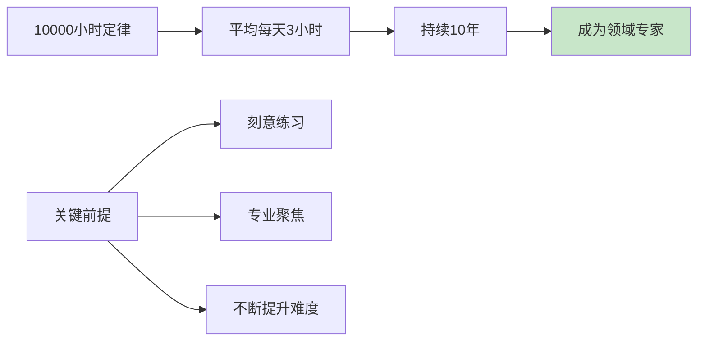
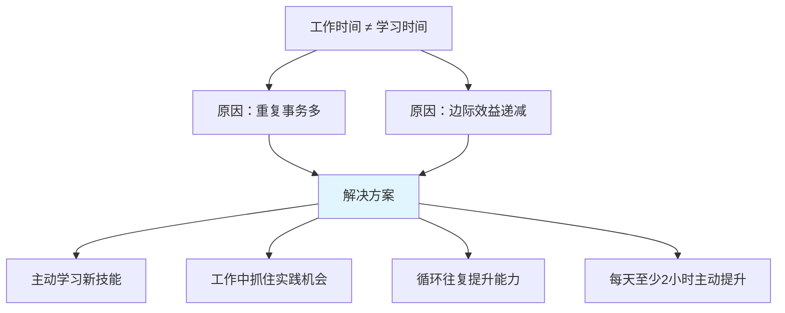
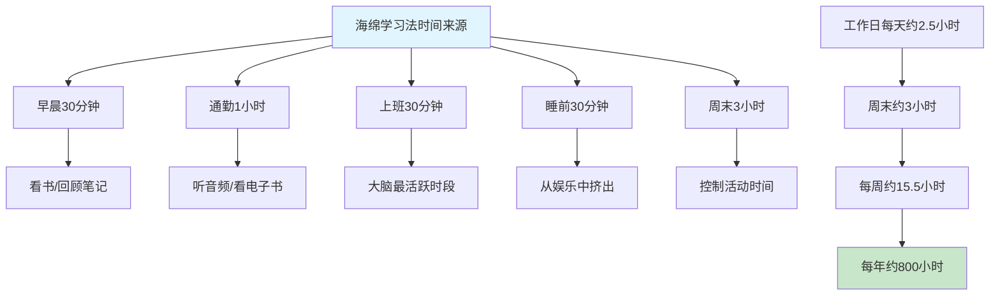
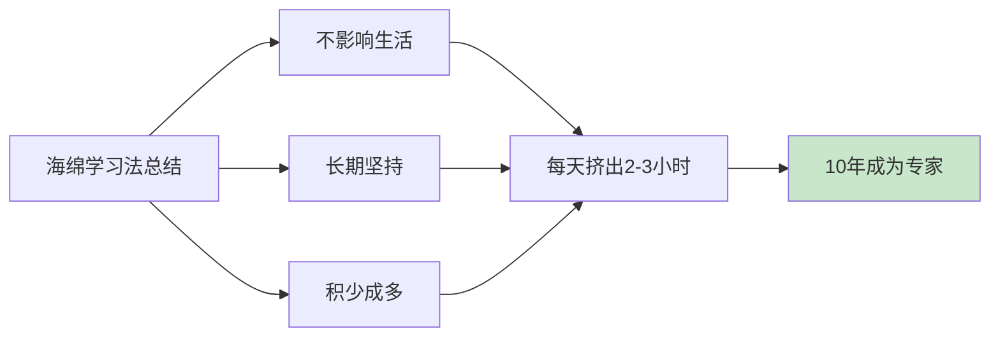
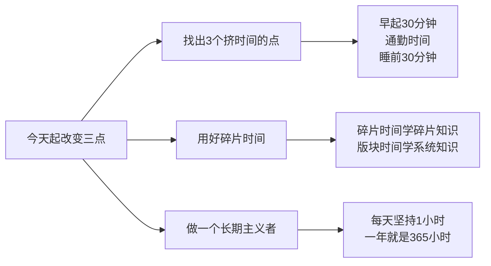

# 3.2用海绵法找时间
#### 目录介绍
- [01.看一个真实案例](#01看一个真实案例)
- [02.10000小时定律](#0210000小时定律)
- [03.跨领域的注意点](#03跨领域的注意点)
- [04.工作外主动提升](#04工作外主动提升)
- [05.什么叫海绵方法](#05什么叫海绵方法)
- [06.从哪里去挤时间](#06从哪里去挤时间)
- [07.坚持长期主义者](#07坚持长期主义者)
- [08.总结概括下重点](#08总结概括下重点)
- [09.后来发生的改变](#09后来发生的改变)
- [10.今天起改变三点](#10今天起改变三点)
- [11.课后作业思考下](#11课后作业思考下)

## 01.看一个真实案例

工作第三年，我每天的口头禅是："最近太忙了"、"有空我就学"、"等这个项目结束我就……"。结果一年过去，我还是那个我，1.想看的书，**没翻过 10 页**；2.想学的源码，**目录都没记住**；3.朋友拉我做技术分享，我说"等我准备好"，**等了一年没准备好**。

那一年公司年终晋升答辩，我被刷了。评语里有一句话扎得我现在还疼："技术深度未见明显增长，**疑似停留在原地**。"

我那一刻特别委屈——我**真的觉得自己很忙**，怎么就成"停留在原地"了？

发生这件事后我抱怨。后来同时让我说时间分配在哪里，翻出微信运动 + 抖音观看时长 + 王者荣耀对局数据，让我触目惊心：抖音：日均 **67 分钟**；王者荣耀：日均 **32 分钟**；微信刷朋友圈：保守估计 **40 分钟**

算了一下："每天**大约有 2 小时 20 分钟在'娱乐性消耗'**。如果只挪出其中 1 小时，一年就是 365 小时。再算上你周末的'我累了我要躺'……"

我当时就闭嘴了。**不是没时间，是时间从来没有被认真分配过**。后来我看到鲁迅那句话："时间就像海绵里的水，只要愿意挤，总还是有的。" 我才明白海绵法不是教你压榨自己，而是教你**承认时间是被你自己'漏'掉的**。下面这套海绵法，就是我从那个晚上开始一点一点试出来的。

## 02.10000小时定律

10000小时定律，是由心理学家安德斯·埃里克森（Anders Ericsson）提出的一个理论，它认为在任何领域成为专家所需的时间大约是10000小时。

如果一个人在某个特定领域投入足够的时间和精力进行刻意练习，那么他们有望成为该领域的专家。这个理论的核心观点是，成功不仅仅取决于天赋，更重要的是通过大量的刻意练习来提高技能和表现。

此外，埃里克森的研究也指出，**刻意练习的质量比纯粹的时间投入更为重要**。只有通过有目的、有挑战性的练习，不断地寻求反馈和改进，才能真正提高技能水平。

如果把10000小时换算一下，就会发现这两个定律基本上是一致的：平均一天投入 3 小时，一年投入 365 天，那么 10 年算下来就是 10950 小时。所以，**10000 小时定律意味着，成为某个领域的专家，需要花费 10 年时间**。

## 03.跨领域的注意点

10000 小时定律所说的"成功"或者"成为专家"，是指在某一个领域，而不是所有领域一通百通。所以**专业聚焦对于 10000 小时定律的落地非常关键**。

如果你从 A 领域转行到 B 领域，而它们的差异又比较大的话，那么你分别在这两个领域投入的时间是不能累加的，相当于以前在 A 领域的积累被浪费掉了。

换句话说，分别在两个不同的领域投入了5000个小时的人才，在专业度上比不过专注在某一个领域投入了10000个小时的专家。所以，**分清楚同一个领域和不同的领域是很重要的**。

| 情况 | 时间投入 | 结果 |
|-----|---------|------|
| A领域10000小时 | 单一聚焦 | 成为A领域专家 |
| A领域5000小时+B领域5000小时 | 分散投入 | 两个领域都非专家 |
| A→B转行（差异大） | 前期积累浪费 | 需要重新计算时间 |
| A→A'转型（差异小） | 前期积累部分可用 | 可以加速成长 |

**虽然跨领域的专业时间不能叠加，但有一类能力是可以跨领域迁移的**——沟通能力、项目管理能力、学习能力、问题分析能力等。这些"元能力"不会因为你换了领域就归零，反而会让你在新领域上手更快。所以在深耕专业技能的同时，别忘了积累这些可迁移的通用能力。

## 04.工作外主动提升

10000 个小时相当于连续 10 年平均每天投入 3 个小时。你可能会有问："我每天工作 10 个小时，这样算下来，岂不是不到4年就可以成为大牛了？"

很明显，这是不太可能的。原因在于，**工作中的很多时间都是在做一些重复的事情，只是让已经掌握的技能变得更熟练而已，边际效益是越来越低的**。

这就像练小提琴，每天都只练习《生日快乐》这个曲子，就算练10年也不可能成为专业小提琴手。你必须先练习某个难度的曲谱，熟练后再来练习下一难度的曲谱，这样逐步提升难度，最终才能成为专业的小提琴手。

**如果你想要高效地提升自己，就必须不断地主动学习新的、复杂度更高的技能，等到工作中用得上的时候，抓住机会在实践的过程中练习，获得经验教训，进一步加深对技能的理解和掌握。如此循环往复，一步一步地提升自己的能力**。

工作1个小时不等于学习 1 个小时，除了上班时间外，尽量保证每天能够有 2 个小时的主动提升时间。那么这个时间从哪里来呢，可以用海绵法找时间！

## 05.什么叫海绵方法

"海绵学习法"，其实是借用了鲁迅的名言——"时间就像海绵里的水，只要愿意挤，总还是有的。"

**海绵学习法的关键就是"挤时间"。既不需要放弃所有的休闲娱乐，也不需要在累成狗的时候强行"打鸡血"逼着自己去学，而是通过长期坚持的方式，达到"积少成多、聚沙成塔"的效果**。

海绵法的三大原则

| 原则 | 具体说明 | 关键点 |
|-----|---------|-------|
| 不影响生活 | 不需要完全放弃休闲娱乐 | 从娱乐中挤出少量时间即可 |
| 不强行打鸡血 | 不需要在极度疲惫时硬撑 | 选择精力好的时段学习 |
| 长期坚持 | 积少成多、聚沙成塔 | 每天2-3小时，坚持数年 |

## 06.从哪里去挤时间

**1.早晨30分钟**。可以把起床的闹钟提前 30 分钟，比如原来07:30的闹钟可以改为07:00。不用担心提前 30 分钟起床会影响休息质量，习惯以后，早起30分钟不但不会影响一天的精力，甚至可能反而让人更有精神。早起的时间可以用来做一些你想做的事情。比如看书，30分钟基本上足够看完一本书的一个章节；再比如，你写一下今日工作优先级事项或者回顾知识笔记。

**2.通勤1小时**。大城市的上班通勤时间在1到2个小时。你可以根据通勤方式选择对应不同的学习方式。如果做公共汽车或者自己开车上下班，可以听书籍和线上课程的音频；如果坐地铁，除了听音频，也可以看电子书和线上课程，要是有座位，还可以看纸质书。

**3.上班30分钟**。刚到工位的第一个 30分钟（或者开完晨会后的30分钟），这时候一般也没什么会议，也很少有人来打扰，大脑又是最活跃的时间，所以学习的效果非常好。不用担心这 30 分钟会影响项目进度，一天当中总会有其他事情浪费30分钟以上的时间，比如不必要的会议、低效的沟通、玩手机摸鱼等。如果担心影响项目进度，你可以在别的事情上提高效率。

**4.睡前30分钟**。大部分人在睡前都会进行一些休闲娱乐活动来放松自己，比如玩游戏、追剧、看电影、刷短视频等。对于忙碌了一天的劳动者来说，适当的放松是必不可少的，我们不必完全放弃这些活动，只需要从中挤出 30 分钟就行了。

**5.周末3小时**。大部分人周末都会安排一些耗时很长的活动，比如购物、逛街、聚会、看电影、旅游和睡懒觉等。只要你有意识地挤时间，很容易就能挤出3个小时，比如购物、逛街和聚会的时候控制时间、早点回去；减少一些"无效社交"的时间；旅游的时候做好时间规划；本来准备睡 10 小时懒觉，改为睡 9 小时……

时间汇总计算

| 时间来源 | 每次时长 | 频率 | 每周合计 | 推荐学习内容 |
|---------|---------|------|---------|------------|
| 早晨 | 30分钟 | 每天 | 3.5小时 | 看书/回顾笔记 |
| 通勤 | 1小时 | 每天 | 5小时 | 听音频/看电子书 |
| 上班前 | 30分钟 | 工作日 | 2.5小时 | 深度学习/写代码 |
| 睡前 | 30分钟 | 每天 | 3.5小时 | 轻度阅读/整理 |
| 周末 | 3小时 | 每周 | 3小时 | 系统学习/做项目 |
| **合计** | - | - | **约17.5小时** | **每年约900小时** |

## 07.坚持长期主义者

这些方法对你原来的工作和生活影响很小，但只要长期坚持，积累的时间规模和个人的成长速度都是非常可观的。

当然，这些方法仍然需要我们稍微克服一下人性的弱点，只是用不着"头悬梁锥刺股"这样夸张而已。

但是如果你连少打一局游戏、少刷一集剧这样的意志力都没有，那么无论多么有效的方法对你来说都是没有意义的。

**坚持的秘诀不在于意志力有多强，而在于门槛设得够低**。每天只需要挤出30分钟，这个门槛几乎人人都能做到。一旦养成了习惯，你会发现30分钟自然而然地变成了1小时、2小时。

## 08.总结概括下重点

海绵学习法。通过海绵学习法我们可以做到既不对工作、家庭和休闲有较大影响，又能够保证足够的时间来提升自己。现在，回顾一下这一讲的重点：

**按平均每天投入 3 小时计算，10000 小时定律意味着，成为某个领域的专家需要花费 10 年时间**。

不同的领域，面对的问题和采取的思维方式也不同，投入的时间是不能叠加的。

上班时间不能直接等价为有效的提升时间，我们每天下班后还应该主动投入 1 个小时来学习。

**海绵学习法不需要完全放弃休闲娱乐，也不需要强行打鸡血，只需要稍微克服一下人性的弱点，长期坚持，积少成多**。挤时间的来源包括早晨30分钟、通勤1小时、上班30分钟、睡前30分钟和周末3小时等。

**时间从来不是没有，只是没有被分配——海绵法不是教你"加班式学习"，而是教你**承认每天 2 小时的"漏点"**，并把它们一点点回收。**

你应该带走的三件事：

**1.先做一次"时间审计"，再谈学习计划**：不知道时间漏在哪，就不可能挤出来。

**2.门槛低 > 意志力强**：每天 30 分钟比每周 5 小时更容易坚持。

**3.碎片时间学碎片知识，版块时间学系统知识**：把对的内容放在对的时段，效率天差地别。

## 09.后来发生的改变

我装了一个时间记录 App，连续 7 天精确到 30 分钟记录所有动作。第 8 天导出报表，我盯着那张图看了 10 分钟——

"我以为我在工作"的时间里，有 **48 分钟在群里聊八卦**；"我以为我累瘫了"的晚上，**1 小时 12 分钟在刷短视频**；"我以为周末很充实"，其实**周日下午 3 小时全在瘫**。

那张报表被我截图打印贴在工位上，标题写了 4 个字："**别再骗自己**"。

我按照海绵法重新排了时间表：

| 时段 | 干什么 |
| ---- | ---- |
| 06:30-07:00 早起 | 翻一本技术书的一节 |
| 08:00-09:00 通勤 | 听一个英文技术播客 |
| 09:30-10:00 上班前 | 过一遍 GitHub Trending + 写 5 行 demo |
| 22:00-22:30 睡前 | 整理白天笔记，写第二天 TODO |
| 周六 09:00-12:00 | 做一个完整 side project |

整整一个月，工作日每天 2 小时、周末 3 小时——**一周 13 小时纯学习时间**，比上一年的全年还多。

我把"没时间"这三个字戒掉了，半年下来发生了三件事：

1.我在 GitHub 上的一个开源项目拿到了 800+ star；

2.内部技术分享被点名表扬，主管在 OKR 沟通时说"看到了你的成长曲线"；

3.**再没人能用"你太忙"打发我的学习计划**——因为我的时间表上每一格都有名字。

更重要的是心态变了：以前我觉得"我没时间"是事实，现在我知道，"**我没时间**" 这三个字 **99% 是借口，1% 才是事实**。

## 10.今天起改变三点

审视你一天的时间安排，找出至少3个可以挤出来学习的时间段。比如早起30分钟、通勤路上的1小时、睡前30分钟。不需要大刀阔斧地改变生活方式，只需要少刷一集剧、少打一局游戏。把这3个时间段写在手机备忘录上，从明天开始执行。

碎片时间（10-30分钟）用来学习碎片化知识，比如阅读文章、听播客、背知识点；版块时间（1小时以上）用来学习系统化知识，比如看书、做项目、写代码。**不要用碎片时间做需要深度思考的事，也不要用版块时间刷信息流。**

不要期望一周就看到效果，海绵法的精髓在于积少成多。每天投入1小时，一年就是365小时，3年就超过1000小时。给自己设定一个最低门槛——比如每天至少学习30分钟，无论多忙都不能打破。坚持3个月，你会发现这已经变成了一种自然的习惯。

## 11.课后作业思考下

**1.时间审计练习**：从明天起，连续记录3天你的完整时间使用情况（精确到30分钟）。3天后分析：你每天有多少时间花在了无意义的消耗上？其中有多少可以转化为学习时间？计算你的"时间回收潜力"。

**2.10000小时计算**：按照你当前每天能挤出的学习时间，计算你成为所在领域专家需要多少年。如果这个数字太大，思考是否有办法每天多挤出30分钟？这30分钟可以从哪里来？

**3.海绵时间规划**：根据你的时间审计结果，设计一份具体的"海绵学习时间表"。明确每个时间段学什么、怎么学。比如"早起30分钟看技术文章、通勤时听播客、睡前30分钟整理笔记"。执行一周后评估是否可行并进行调整。

**4.长期主义测试**：给自己设定一个30天挑战——每天至少学习1小时，不间断。记录每天的完成情况和学习内容。30天后回顾：你中间断过几次？断的原因是什么？如何在下一个30天中做到不间断？

