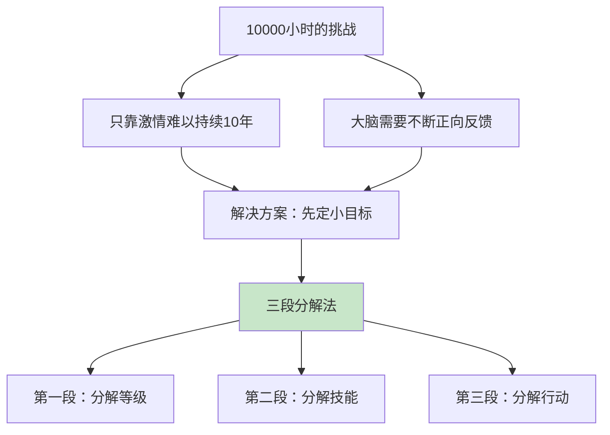
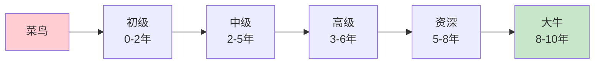
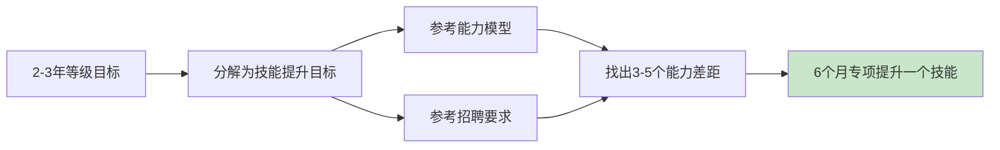
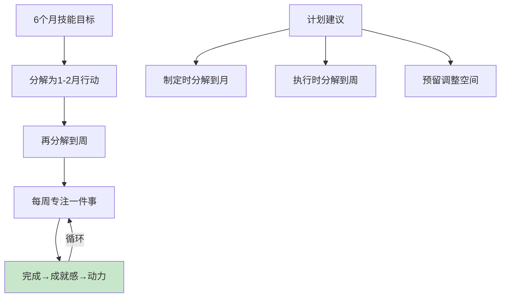
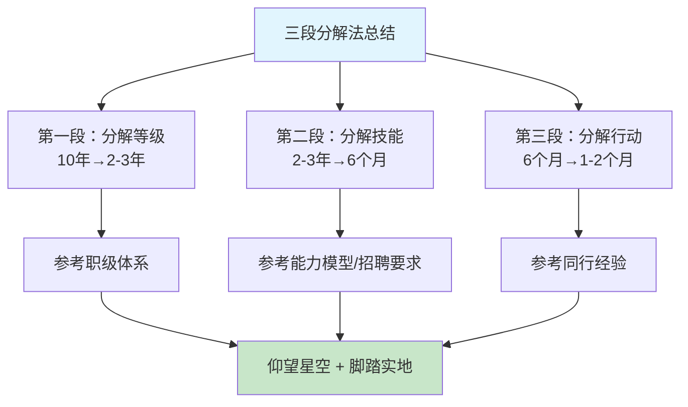
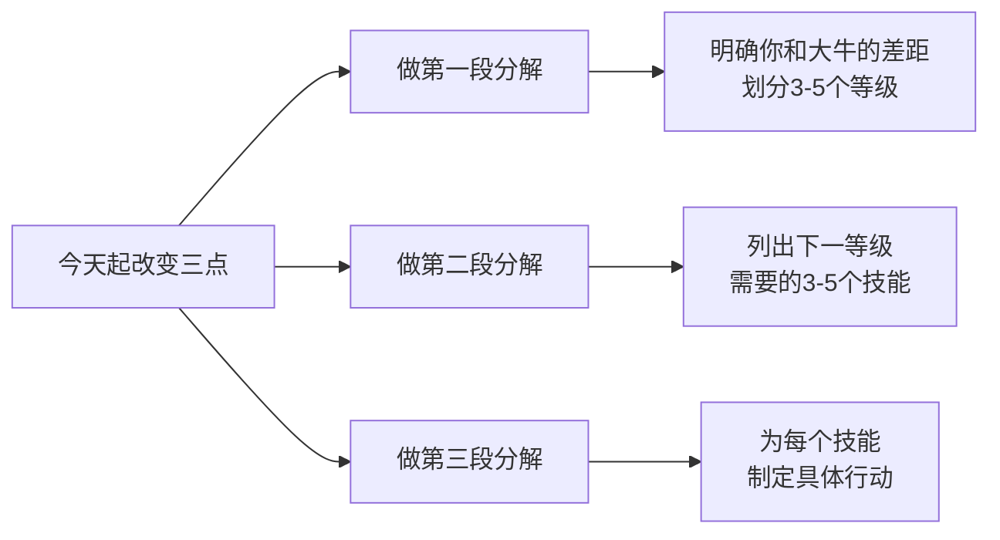

# 3.3三段分解学什么
#### 目录介绍
- [01.看一个真实案例](#01看一个真实案例)
- [02.10年刻意练习难](#0210年刻意练习难)
- [03.第一段分解等级](#03第一段分解等级)
- [04.第二段分解技能](#04第二段分解技能)
- [05.第三段分解行动](#05第三段分解行动)
- [06.最后总结和梳理](#06最后总结和梳理)
- [07.后来发生的改变](#07后来发生的改变)
- [08.今天起改变三点](#08今天起改变三点)
- [09.课后作业思考下](#09课后作业思考下)

## 01.看一个真实案例

那年元旦我立了个 flag：**"今年要从初级走向高级工程师"**。我把这句话设成手机壁纸，朋友圈也发了，自我感觉热血沸腾。

3 个月后我打开印象笔记，看了一眼"年度规划"那一页，整页**只有那一行字**。我没有任何具体动作，也不知道应该怎么动。每周末我都在自责："这周又没干啥"，但下周一打开电脑，依然不知道从哪下手。

到了年中复盘，我发现自己整整 6 个月里：1.学了一点 Framework 源码，**没看完**；2.翻了一点分布式课程，**看了 3 节**；3.准备写一个开源项目，**README 没写完就放弃了**。

我把这一摞"半截活儿"摆在桌上，第一次意识到——**目标定得太大，等于没定**。

那年部门技术沙龙，我跟一位刚晋升 P8 的大哥喝啤酒，倒苦水说"我也想成为大牛，可不知道怎么动"。他笑着掏出一张餐巾纸，在上面画了三层金字塔：

```
[ 大目标：10 年成为大牛 ]
       ↓ 第一段：分解为 2-3 年的"等级目标"
[ 中目标：2-3 年到达高级 ]
       ↓ 第二段：分解为 6 个月的"技能目标"
[ 子目标：6 个月攻克分布式缓存 ]
       ↓ 第三段：分解为 1-2 个月的"行动目标"
[ 下个月：读完《Redis 设计与实现》前 4 章 + 写一个 mini Redis ]
```

他指着最下面那一行说："**你能立刻动手做的，只有最底下那一行。** 上面那两层不是给你执行的，是给你**指方向**的。你之前的问题是——你只立了塔尖，却想直接从塔尖开始干。"

那一刻我醍醐灌顶。后来这套"大目标 → 中目标 → 小行动"的逻辑，被我反复打磨成下面这套**三段分解法**——也是我从"立 flag 上瘾"过渡到"持续兑现"的转折点。

## 02.10年刻意练习难



10000小时定律虽然理论上很简单，但真正要落地实行也并不那么容易。就算有了时间，你也很难十年如一日地坚持学习。能否坚持，当然要看你对自己的事业是否有"激情"。

但如果只靠激情来支撑，持续10年依然是一个很大的挑战。因为我们的大脑在进化的过程中，已经形成了需要不断的正向反馈才能保持兴奋的机制。

也就是说，与其在第10年给一个大奖励，还不如每个月都给一个小奖励。所以除了激情，你还需要"先定一个能达到的小目标"。

**计划在落地过程中，必须要有计划分解的步骤**。这一要求在多数公司也都有体现，根据岗位不同，至少会要求到季度层面，量化一些的工作岗位，还会要求到月、日的程度。

将计划进行阶段分解，不仅可以有效地量化工作细节，同时还为不可预期的突发情况，留出了调整空间。

## 03.第一段分解等级



**在当前状态和最终的目标状态之间，分解出中间的等级**。10年成为大牛这个目标虽然比较长远比较宏大，但并不意味着在成为大牛之前，一直停留在菜鸟阶段原地踏步。

在菜鸟和大牛之间，其实有几个关键的里程碑，这些里程碑就是中间的等级。大部分的专业领域都有比较正式的等级划分标准。例如钢琴专业从1级到10级，跆拳道从白带到黑带。

对于互联网的领域来说，虽然没有通用的专业等级标准，但不同的公司都会有类似的职级体系。比如技术人员发展路径基本上按照这个模式：

| 等级 | 年限 | 能力要求 |
|-----|------|---------|
| 初级 | 0~2年 | 需要别人带着做，能完成简单工作任务 |
| 中级 | 2~5年 | 能够完成分配的模块工作 |
| 高级 | 3~6年 | 能够独当一面，可以带初级技术人员 |
| 资深 | 5~8年 | 能够独挡多面 |
| 大牛 | 8~10年 | 统筹规划，高屋建瓴 |

分解出中间的各个等级之后，我们核对一下自己目前所处的位置，然后瞄准下一个最近的等级，继续第二段的分解。这种目标分解的方法除了适合技术人员外，其它很多领域也都适应。

**找到自己所处位置的级别，然后梳理一下，下一个级别的职业要求和工作能力，把这个当作短期的目标，用大约2、3年时间全力以赴，实现起来相比10年更加容易些**。

## 04.第二段分解技能



虽然朝下一个等级努力的时间是2～3年，跟10年比起来已经缩短了不少，但是这个时间还是比较长的。为了更好地利用这 2～3年时间，我们需要进一步分解。

分解的目标就不是等级，而是技能，也就是为了达到下一个等级的要求，你需要针对哪些技能做专项提升。

如果你所在的公司已经有成熟的职级体系，可以参考能力模型，整理出当前级别和下一级别的能力要求矩阵，这样就可以一目了然地看出具体的能力差距项有哪些了。

如果你所在的公司目前没有成熟的职级体系，或者你准备跳槽到某个心仪的公司，你也可以采取一个取巧的方式来明确能力项差别，这就是直接查看公司的招聘要求。

以技术人员为例，假设经过自我评估，认为自己目前处于初级阶段，而且初级阶段的事情已经做得比较顺手和熟练了，那么下一个阶段目标自然就是达到"高级"水平。

"高级"与"初级"相比，有哪些不同的技能要求呢？这就需要我们根据各自不同的行业和方向详细列出来了，如果自己想不出来，网上有很多资料都可以搜索到，最方便的就是到一个招聘网站，多看看几个招聘需求的描述，然后归纳总结一下。

**分解的方法很简单，哪里不懂补哪里！专项提升某个技能的持续时间既不能太短，也不能太长，一般建议在6个月左右**。时间太短，容易陷入为了"完成任务"而去学的误区，没有真正得到有效提升。

## 05.第三段分解行动



第二段分解之后，我们得到了6个月左右的技能提升目标，接下来要做的，就是通过第三段分解，将技能提升目标分解为具体要做的事情，然后按照计划执行。

比如说你的二段目标是"提升架构设计能力"。那么，怎样才能提升呢？你可以上网搜索（知乎是个好地方），也可以去问有经验的朋友，把二段目标细化为1～2个月的三段目标。

**把6个月的技能提升目标进一步分解成1～2个月的具体行动目标之后，实施起来就简单多了。**

每 1～2 个月只需要专注做好一件事，每次完成后都很有成就感，既感觉自己的水平有了提升，又佩服自己能够坚持按计划完成任务。这样的双重激励让我更有动力去完成下一个目标。

**成就感是坚持的最大动力来源**。这就是为什么第三段分解如此重要——它把一个遥远的目标变成了一系列"跳一跳就能够到"的小目标。每完成一个，你就获得一次正反馈，这种正反馈会驱动你继续前行。

当然，在具体落地的时候，你还需要进一步分解到周，比如下周看完某本书的哪几个章节。但是在做计划的时候，建议你先分解到月就可以了，因为一开始就直接分解到周还是比较耗费时间的，而且如果出现计划之外的事情，调整计划本身花费的时间和精力成本也比较高。

**好的计划一定是"有弹性"的计划**。建议预留20%的缓冲时间应对突发情况。如果你计划用4周学完一个技能，那么实际安排只填满3周，留1周作为缓冲。这样即使遇到加班、生病等意外，也不会让整个计划崩盘。

## 06.最后总结和梳理



三段分解法。虽然我举的例子都是技术领域的，但是这个方法在其他很多领域也都适用，比如说产品和运营等。通过这个方法，你可以把宏大的目标逐步分解成可以落地的日常行动，一边"仰望星空"，朝着最终的方向前进，一边"脚踏实地"，一步一个脚印地去实现它。

| 分解阶段 | 时间跨度 | 参考依据 | 目标产出 |
|---------|---------|---------|---------|
| 第一段：分解等级 | 10年→2-3年 | 职级体系/等级标准 | 3-5个中间等级 |
| 第二段：分解技能 | 2-3年→6个月 | 能力模型/招聘要求 | 3-5个重点技能 |
| 第三段：分解行动 | 6个月→1-2个月 | 同行经验/朋友建议 | 3-5个具体行动 |

现在，我们再回顾一下三段分解法的要点：第一段是分解等级，参考专业领域的等级划分标准或公司的职级体系，在当前状态和大牛之间划分出 3～5 个中间等级，把 10 年的宏大目标分解成 2～3 年的一段目标。

第二段是分解技能，参考 COMD 能力模型和招聘网站的职位描述，整理下一个等级的技能需求，列出自己需要重点提升的 3～5 个技能点，把 2～3 年的一段目标分解成 6 个月左右的二段目标。

第三段是分解行动，参考同行在网上发布的经验和朋友的建议，确定提升单项技能的 3～5 个具体行动，把 6 个月左右的二段目标分解成 1～2 个月的三段目标。

**虽然最终执行计划的时候要落实到周，但是制定计划的时候分解到月就行了，这样做的好处是，计划调整起来更加方便灵活**。

一句话核心：**大目标不是用来执行的，是用来指方向的；真正能动手的只有"下个月做什么"——三段分解的全部价值，就是把"10 年的远方"翻译成"下周一上午的第一件事"。**

你应该带走的三件事

**1.不分解的目标 = 没有目标**：只立 flag 不分层，3 个月内必破产。

**2.每段分解都要"有抓手"**：等级看职级体系、技能看招聘 JD、行动问同行——每一段都要有外部参照物，避免拍脑袋。

**3.执行落到周，规划停到月**：太细了僵化、太粗了空泛，"月+周"的组合是性价比最高的颗粒度。

## 07.后来发生的改变

被 P8 大哥点醒后那个周末，我把"今年要成为高级工程师"这一行字删掉，重新画了一张三段分解表：

| 段次 | 周期 | 目标 |
| ---- | ---- | ---- |
| 第一段 | 2 年 | 从初级 → 高级（对标公司 T5 任职要求） |
| 第二段 | 6 个月 | 攻克"分布式缓存 + 分布式锁 + 限流"三件套 |
| 第三段 | 第 1 个月 | 读完《Redis 设计与实现》前 6 章 + 写一个 mini-redis（支持 SET/GET/EXPIRE） |

那一刻第一次有了"**我知道明天该干啥**"的踏实感。

按三段表执行后，我惊讶地发现——之前堆了 6 个月的半截活儿，**1 个月就被清掉了 80%**。原因很简单：以前我每天打开电脑都在纠结"今天该学啥"，现在打开电脑直接执行"本周计划第 3 条"。**省掉的'决策成本'，全变成了'执行时间'。**

半年后我做晋升答辩，准备的材料里有 1/3 来自那个 mini-redis 项目——它让我能够完整讲清楚"为什么用跳表实现 zset"、"过期 key 的渐进式删除策略"、"主从复制的偏移量同步"。评委的反馈是：**"对底层有自己的实践和思考，能看到成长路径。"**

那是我第一次拿到"通过"两个字。**而起点，就是那张餐巾纸上的三段金字塔**。

## 08.今天起改变三点



今天就参考你所在行业的职级体系或公开的能力模型，在你当前水平和行业大牛之间划分出3-5个中间等级。明确你现在处于哪个等级，下一个等级是什么。把10年的宏大目标变成2-3年的阶段目标，这样就不会觉得遥不可及了。

参考招聘网站上比你高一级的岗位描述，列出下一个等级需要的核心技能。从中挑选出你最需要提升的3-5个技能点。这就是你未来6个月要重点突破的方向。**记住，不是什么都学，而是集中火力攻克关键技能。**

为每个关键技能，参考同行经验和专业建议，制定3-5个具体的学习行动。把6个月的目标分解到每个月需要完成的里程碑。制定计划时分解到月即可，执行时落实到周。给自己留出调整空间，但绝不拖延第一步的行动。

## 09.课后作业思考下

**1.等级定位练习**：参考你所在行业的职级体系，明确你当前处于什么等级，距离行业专家还有几个等级的差距。画一张"等级阶梯图"，标注每个等级需要的核心能力和大概需要的时间。这就是你的"成长路线图"。

**2.技能差距分析**：在招聘网站上找3个比你高一级的岗位JD，提取出共同要求的技能项。对比你当前的能力，列出最大的3个差距。这3个差距就是你接下来6个月要重点攻克的方向。

**3.行动计划制定**：选择上面3个差距中最关键的一个，用三段分解法制定具体的行动计划。包括：学习什么资料、做什么项目实践、达到什么检验标准。计划精确到月，执行落实到周。

**4.小目标激励实验**：为你的下一个月度目标设定一个完成奖励（比如买一本心仪的书、看一场电影）。目标要具体可衡量，奖励要能真正激励你。一个月后检验：这种"先定小目标"的方式是否比纯靠激情更有效？

