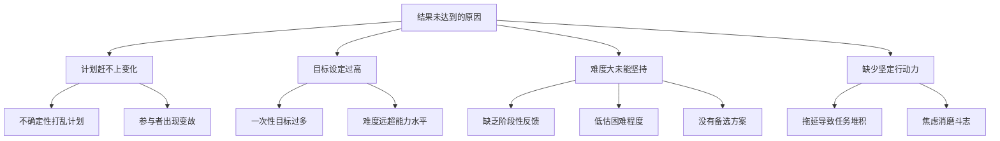
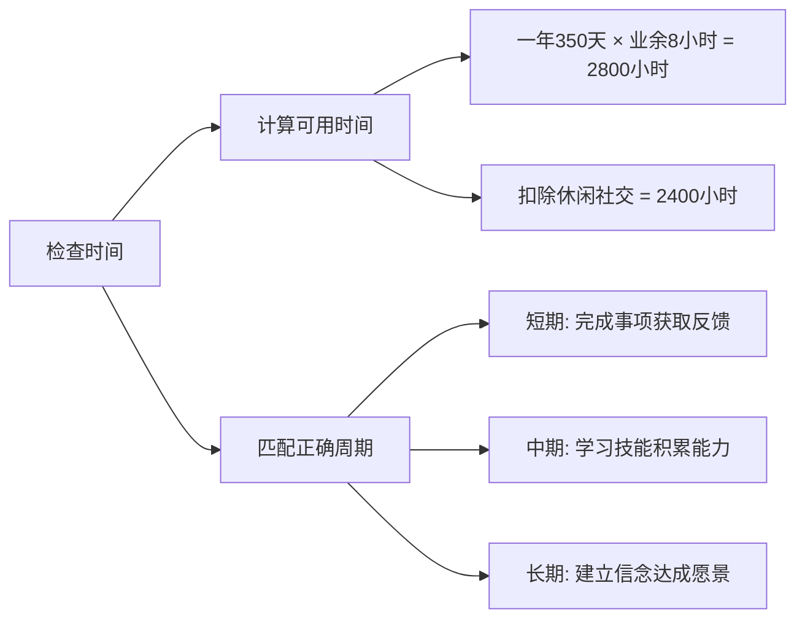
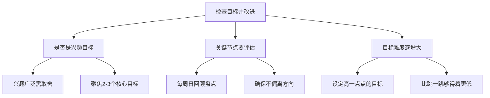
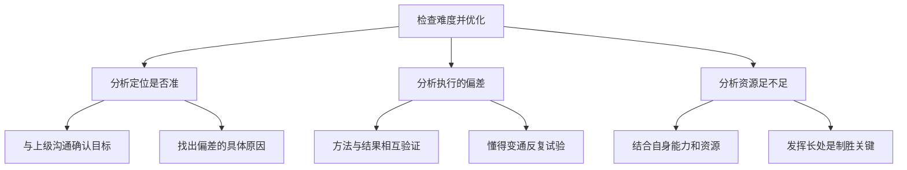
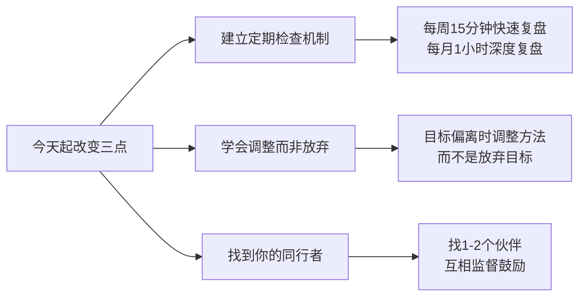

# 4.5结果的检查改进
#### 目录介绍
- [01.看一个真实案例](#01看一个真实案例)
- [02.为何结果未达到](#02为何结果未达到)
- [03.检查时间并调整](#03检查时间并调整)
- [04.检查目标并改进](#04检查目标并改进)
- [05.检查难度得优化](#05检查难度得优化)
- [06.加强执行行动力](#06加强执行行动力)
- [07.总结回顾本章节](#07总结回顾本章节)
- [08.后来发生的改变](#08后来发生的改变)
- [09.今天起改变三点](#09今天起改变三点)
- [10.课后作业思考下](#10课后作业思考下)

## 01.看一个真实案例

有一年我负责的一个产品功能终于排期上线了，上线前我连续加班两周，盯着每一个细节，灰度、放量、监控、发版本——一切顺利。上线那天我在朋友圈打了个卡："半年的努力终于落地"，配了一张深夜办公室的图，朋友圈点赞 80 多。

之后我就把这个事翻篇了。下一个项目又开始排期，我又一头扎进新的需求里。

三个月之后，部门年中复盘会，大老板点名让我上去讲一下"那个功能"上线之后的效果——日活提了多少？留存有变化吗？目标用户的渗透率是多少？跟上线前定的 KPI 比，差距在哪？

我傻在原地。我没看过数据。

我以为"上线 = 完成"，但老板要的是"结果 = 完成"。从功能上线那一天开始的三个月里，我有 92 天没有打开过那个功能的数据看板，更没有按月做过任何复盘和改进——而当初定 KPI 的时候，我自己拍胸脯保证过会做月度跟踪。

老板当着所有人问了我一句话：**"你这个项目，到底是上线了，还是上线之后就死了？"**

我那一刻才意识到：**对一件事真正的负责，不是把它做出来，而是把它做出结果，并且持续追踪、改进、让它继续产生价值**。中间任何一个环节断了，前面的努力都会贬值。

## 02.为何结果未达到

打工充，一个很忙碌的人，在教育网站买了不少学习课程，下载了优酷上那些颇受好评的演讲稿，隔三差五就去书店搜刮有关技能的资料，就连单词书也买了好几本。

于是他开始计划，计划要每天背上一百个单词，每天看一个公开课，每周看一个演讲，每个季度补充一个技能，明年要实现工作上外语的沟通顺畅，为此他做好了万全的准备。

然而等到要实施计划的时候，突然他朋友来了个电话，于是他修改了计划跟朋友出去吃饭，今天缺失的就明天补上，任务不断地往后拖。

没过多少天，他又因为一些事情打乱了自己的计划，又把那天的任务挪到了第二天。然后坚持不到一个月，难以评估学习成果而难以持续坚持！

后来他感觉距离自己的目标太遥远了，他所定的补充技术对他来说有挑战和难度，经常性地三天打鱼两天晒网，他努力了，但是为何年末的时候还未达到各种目标。

所以你说案例打工充努力了么？他努力了，因为他至少看完了很多公开课背了好多天单词。但是他有什么成果么？未必。接下来没多久，他放弃了计划。

可问题在于，觉得自己没做错什么，确实是想要改变自己，也切实地想要背单词，公开课也开始看了，技能任务也补充了，但是就是觉得任务越堆越多，变成了一个不可能完成的任务。

更要命的是他开始焦虑，开始抱怨，他觉得自己明明付出努力了，还费那么大劲准备了计划，他开始觉得不公平，为何他如何努力但是却进步这么慢。

规定好什么时间做什么，但是在实践过程你会发现，计划赶不上变化，到了某个计划好的时间点，你上一个任务还没处理完。

又或者，你已经筋疲力尽，根本没法继续进行下去，因此管理时间其实是个伪命题，根据工作的重要程度，合理分配好自己的精力才是王道！

有这么一句话，叫计划赶不上变化，明明提前做好了计划，但是却因为各种事情的不确定性，改变了很多计划。这样的情况，无论大小计划，总会出现变故，会被打乱。

因为有些计划执行过程中，往往涉及到的不仅仅制定者本身，还有其他很多人，如果参与者在进程中出现变故，出现拖拉，交接不便等现象，计划将遭到打乱或者拖延。

目标设定过高是计划失败的常见原因之一。过高的目标会让人在执行过程中感到力不从心，产生挫败感，最终导致放弃。

目标过高的表现包括：一次性设置了过多的目标，每个目标都需要大量时间和精力；目标的难度远超当前能力水平，需要跨越多个层级才能达到；没有考虑到实际资源和时间的限制，过于理想化。

合理的做法是：设定"跳一跳能够得着"的目标，既有挑战性又不至于遥不可及；控制同时进行的目标数量，聚焦在 2-3 个核心目标上；预留调整空间，允许目标随实际情况进行合理调整。

很多人在执行计划的过程中，遇到了超出预期的困难，由于缺乏有效的应对策略，选择了放弃。难度大未能坚持的根本原因包括：

1. **缺乏阶段性反馈**：目标太远，中间没有里程碑，无法感知进步。
2. **低估了困难程度**：计划时过于乐观，执行时遭遇现实打击。
3. **没有备选方案**：遇到卡点时，不知道如何绕过或调整。
4. **孤军奋战**：缺乏外部支持和鼓励，独自面对困难容易放弃。

应对策略是：将大任务拆成小步骤，每完成一步给自己正向反馈；提前预想可能遇到的困难和应对方案；找到同行者或导师，建立支持系统；允许自己暂时放慢节奏，但不要完全停下来。

没有行动力的计划只会毁了你，因为它让你觉得自己已经有所行动。它会让你觉得能静心列下计划的你，已经比很多人都接近了一步。其实不然，列下计划而没有实施的你，只是一个伪理想主义者而已。

没有行动力的后果便是拖延，拖延之后会让你第二天的任务猛增，越拖下去就越危险，它会让你开始抱怨不公平，开始觉得时间不够用进而产生焦虑，最后消磨你的斗志，打击你的信心。

## 03.检查时间并调整

人们已经习惯了以年为单位来进行时间分界，所以我们都会习惯于做年度计划。但在过去这么些年的计划与实践中，学到经验是：**做计划不能靠模糊的感觉，而是需要精确理性的计算**。

一年，我们到底有多少时间？一个正常参与社会工作的人，时间大约会被平均分成三份。一年 52 周，会有一些法定的长假和个人的休假安排，我们先扣除两周用于休假。

那么一天业余 8 小时，一年算 350 天，那么一年总共有 2800 小时的业余时间。

但实际这 2800 小时里还包括了你全部的周末和一些零星的假期，再预扣除每周 8 小时用于休闲娱乐、处理各种社会关系事务等等，那么你还剩下 2400 小时。

你可以从时间的维度，看看你计划的时间安排是否合理分配在了不同周期的计划事项上。如果计划的事项和周期匹配错了，计划的执行就容易产生挫败感从而导致半途而废。

曾经的我就犯过这样的错误。要让计划可行，就是选择合适的事项，匹配正确的周期，建立合理的预期，得到不断进步的反馈。

一年中你还需要把时间合理地分配在 "短、中、长" 三种不同周期的计划上。

- **短期**：完成事项，获取结果，得到即时反馈与成就感（比如：写这个专栏）。
- **中期**：学习技能，实践经验，积累能力（比如：学一门语言）。
- **长期**：建立信念，达成愿景（比如：成长为一名架构师）。

## 04.检查目标并改进

那该如何选择有限的事项，才可能更有效地被执行下去呢？其中有一个很重要的因素：兴趣。有的人兴趣可能广泛些，有的人兴趣可能少一些，但每个人多多少少都会有些个人的兴趣爱好。

对于兴趣广泛的人来说，这就有个选择取舍问题，若不取舍，都由着兴趣来驱动，计划个十几、二十件事，每样都浅尝辄止。实际从理性上来说价值不大，从感性上来说只能算是丰富了个人生活吧。

你落地很多任务，但是计划到底完成什么程度，你需要掌控节奏。在一些关键的时间节点，要对任务的阶段性完成情况进行评估，便于及时调整，最终顺利完成。

如果不评估，很可能到年底才发现任务的完成率很低，或者什么也没做成。

建议每周日晚上对上周所做的事情进行回顾，并盘点下周要做的事情，同时看看现在所做的事情和年度计划是否保持一致，确保没有偏离方向。

设置比你当前水平高一点点的目标是更为合适的，这样既有挑战的动力，又不会因为太难而畏惧不前。

这里的"高一点点"要注意，应该理解为比"跳一跳才能够得着"难度更低。**让自己持续处于"踮脚就能摸到"的状态**，而不是"跳起来都摸不着"的挫败状态。

## 05.检查难度得优化

制定的全年工作目标，通常来说是同上级领导共同确认出来的。确认过程中，一定要注意结合自身实际情况，与领导多沟通交流，将实际工作情况和想法，完全反馈给上级领导，这样才能保证领导下达的任务目标，更切合真实情况。

如果发现领导下达的目标与自身实际情况不符，更需要与领导多交流，务必找到出现偏差的具体原因，从而找到自身不足之处，在后续工作中进行重点补足。在定位不准又原因不明的情况下，是无法完成工作目标的。

在完成工作计划的过程中，一定要注意采取的方法，要与实际得到的结果相互验证。切忌不要想当然来做事情，反馈回来的结果不在预期范围内，依然固执己见，不愿做出调整。

方法一旦错误，一味的坚持，只会使错误被越来越大，以至于产生不可预期的后果。实现计划的方式方法是多种多样的，一定要懂得变通，反复试验，以得出最优方案。

计划再好，方案再佳，也要有合适的人才能实现。完成计划过程中，所采取的方式方法，一定要结合自身能力以及资源，不能完全靠想像而来。

最贴合自身的实现方法，就是最优的实现方法，把握自己的长处与资源，无限发挥出来，才是赢得胜利的关键。

## 06.加强执行行动力

执行力不足的根本原因之一是缺乏即时反馈。当我们完成一件事情后看不到明显的进步或回报时，动力会迅速消退。

建立即时反馈机制的方法：将大目标拆分为每日可完成的小任务，每完成一个就在清单上划掉；设置阶段性里程碑，每达到一个里程碑就给自己适当的奖励；使用可视化工具记录进度，比如进度条、打卡日历等，让进步变得可见。

独自执行计划容易放弃，但如果有同行者就会好很多。找到志同道合的伙伴，互相监督、互相鼓励，可以大大提升执行力。

可以加入学习社群，定期分享进度；也可以找一个"对赌伙伴"，双方约定目标和惩罚机制，利用社交压力来推动自己前进。

很多时候不是不想做，而是启动太难了。比如想跑步，但要换衣服、换鞋、出门、热身，光想想这些步骤就不想动了。

降低启动成本的技巧：提前准备好所需物品，减少决策环节；使用"两分钟法则"——先坚持做两分钟，两分钟后再决定是否继续；把新习惯附加在已有习惯后面，比如"刷完牙后立即背 10 个单词"。

## 07.总结回顾本章节

**没有检查的计划不是计划，是空想；没有改进的执行不是执行，是消耗。**

1. **计划必须配套"周/月/季"三级检查机制**：上线 ≠ 完成，结果出来之前都不算结束。
2. **偏差出现时调方法，不调目标本身**：先查时间预算、目标定位、执行方法、资源支撑四个维度，找根因再改进。
3. **执行力 = 即时反馈 + 同行者 + 启动成本**：把进步可视化，把行动社交化，把开始变得简单到没借口。

## 08.后来发生的改变

被老板问倒那天回到工位，我做的第一件事是：把过去一年我经手过的、已经"上线"的所有功能列了一个表，每个加上当初定的 KPI、当前数据、差距、原因、下一步动作。

那一晚我在工位坐到 11 点，一共列出 6 个项目——其中 4 个我从未在上线后认真看过数据。我把这张表发给了老板，第一行写着："以下是我未尽到的责任，请给我一个月时间补齐数据复盘和改进方案。"

老板回了一个字："好。"

之后一个月我做了两件事：

1. **补齐历史**：每个项目按"目标 → 实际 → 差距 → 原因 → 改进"的格式，输出一份复盘文档，并和老板逐个对齐下一步动作。
2. **建立机制**：以后所有我经手的项目，上线前必须先定义"上线后 1 周/1 个月/3 个月"三个观测点，每个点的指标和判断标准提前写清楚，加进项目排期里。

第一个月底，我那 6 个项目里，3 个被诊断出"目标定位有偏差"提前回炉，2 个加了新的优化迭代，1 个被果断下线——而过去这 6 个项目就那么一直"挂着"占着资源。

半年之后，部门所有项目上线评审会议上多了一项议程："复盘节奏与观测指标"——这是我推动加进去的。后来部门把"上线后 30 天必须出数据复盘"写进了项目流程文档。

那一年的年终评审，老板专门提了我一句话：**"这个人今年最大的进步，是从'把事情做出来'变成了'把事情做出结果'。"**

这是我职业生涯中第一次因为"会复盘"而不是"会做事"被评价。我也终于明白：**真正决定一个人专业度的，不是他启动一件事的能力，而是他持续跟踪一件事的耐心**。

## 09.今天起改变三点

从本周开始，每周五花 15 分钟做一次快速复盘——检查本周目标完成情况、分析偏差原因、调整下周计划。每月底花 1 小时做一次深度复盘——审视月度目标达成率、总结经验教训、优化下月策略。

**没有检查的计划不是计划，是空想**。

当你发现计划赶不上变化时，不要轻易放弃目标。先分析原因：是时间不够？难度太大？还是方法不对？

然后针对性地调整——分解更小的步骤、降低阶段目标、换一种执行方式。**目标可以调整时间，但不应该被放弃**。坚持和灵活并不矛盾。

独自执行计划太容易放弃了。今天就找 1-2 个志同道合的朋友，建立一个互相监督的机制——比如每周分享各自的目标进度，或者设定一个"对赌机制"。

**社交压力是最好的执行力催化剂**，有人在看着你，你就不好意思偷懒了。

## 10.课后作业思考下

**1. 目标偏差分析**：回顾你今年设定的目标，到目前为止完成了多少？对于没完成的目标，逐一分析原因——是目标设定过高？时间预估不准？突发事件打断？还是执行力不足？针对每个原因制定一个具体的改善措施。

**2. 难度评估与调整**：评估你当前正在执行的计划，难度是否合适？如果你已经连续 2 周以上没完成周目标，说明计划难度可能过高。尝试把目标降低 20%，看看是否更容易坚持。记住：持续的小进步远比间歇性的大跃进更有效。

**3. 检查机制设计**：为你最重要的一个目标，设计一套完整的检查改进机制。包含：每日快速检查（5 分钟）、每周复盘（15 分钟）、每月深度分析（1 小时）。明确每次检查要看哪些指标、用什么标准判断是否偏离轨道。

**4. 同行者招募计划**：找到 1-2 个和你有相似目标的朋友，邀请他们加入你的"目标互助小组"。约定每周分享一次进展、互相给建议和鼓励。执行一个月后评估：有同行者和没有同行者相比，你的目标完成率提升了多少？
