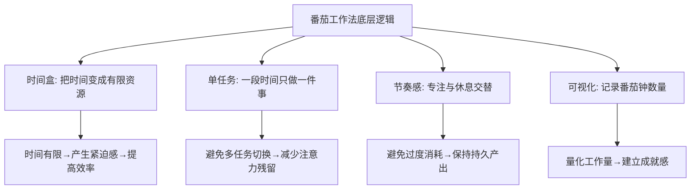
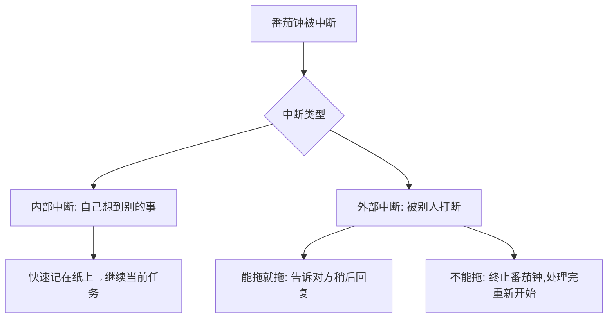
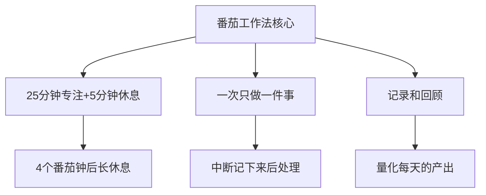
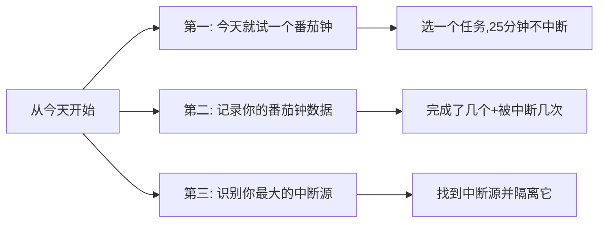

# 5.11 番茄工作法实践
#### 目录介绍
- [01.看一个真实案例](#01看一个真实案例)
  - [1.1 那一天我只写了 17 行代码](#11-那一天我只写了-17-行代码)
  - [1.2 一个红色的小番茄改变了一切](#12-一个红色的小番茄改变了一切)
- [02.番茄工作法背景](#02番茄工作法背景)
  - [2.1 为什么需要番茄工作法](#21-为什么需要番茄工作法)
  - [2.2 番茄工作法的起源](#22-番茄工作法的起源)
- [03.番茄工作法原理](#03番茄工作法原理)
  - [3.1 基本规则](#31-基本规则)
  - [3.2 为什么是25分钟](#32-为什么是25分钟)
  - [3.3 番茄工作法的底层逻辑](#33-番茄工作法的底层逻辑)
- [04.如何开始使用](#04如何开始使用)
  - [4.1 第一步：列出今天的任务](#41-第一步列出今天的任务)
  - [4.2 第二步：开始番茄钟](#42-第二步开始番茄钟)
  - [4.3 第三步：处理中断](#43-第三步处理中断)
  - [4.4 第四步：记录和回顾](#44-第四步记录和回顾)
- [05.进阶使用技巧](#05进阶使用技巧)
  - [5.1 任务与番茄钟的匹配](#51-任务与番茄钟的匹配)
  - [5.2 番茄钟+PDCA](#52-番茄钟pdca)
  - [5.3 推荐的工具](#53-推荐的工具)
- [06.番茄法的局限性](#06番茄法的局限性)
  - [6.1 不适合的场景](#61-不适合的场景)
  - [6.2 灵活调整](#62-灵活调整)
- [07.总结回顾一下](#07总结回顾一下)
  - [7.1 一句话核心](#71-一句话核心)
  - [7.2 番茄法给你的三个礼物](#72-番茄法给你的三个礼物)
- [08.后来发生的改变](#08后来发生的改变)
  - [8.1 第一周：发现自己被打断 47 次](#81-第一周发现自己被打断-47-次)
  - [8.2 第一个月：每天稳定 10 个有效番茄钟](#82-第一个月每天稳定-10-个有效番茄钟)
  - [8.3 三个月后：彻底告别"瞎忙"](#83-三个月后彻底告别瞎忙)
- [09.今天起改变三点](#09今天起改变三点)
  - [9.1 第一，今天就试一个番茄钟](#91-第一今天就试一个番茄钟)
  - [9.2 第二，记录你的番茄钟数据](#92-第二记录你的番茄钟数据)
  - [9.3 第三，识别你最大的中断源](#93-第三识别你最大的中断源)
- [10.课后作业思考下](#10课后作业思考下)
  - [10.1 个人尝试类作业](#101-个人尝试类作业)
  - [10.2 思辨与改进类作业](#102-思辨与改进类作业)

## 01.看一个真实案例

那是上线前一周的周一，我手上压着一个核心模块要交付。我早上 9 点准时到工位、打开 IDE，对自己说："今天必须把这个模块写完。"

结果晚上 11 点我准备下班的时候，提交记录显示——**那一天我只新增了 17 行代码**。

我当时整个人是蒙的：我明明一整天都在工位上，没午睡也没吃太久饭，怎么就写了 17 行？我打开浏览器历史回看：

- 9:00-9:40 处理早上的邮件
- 9:40-10:15 同事 A 来工位讨论了一个接口
- 10:15-10:40 写了几行代码 → 微信弹消息 → 回复了 8 分钟
- 10:40-11:30 开了一个临时拉的会
- 下午类似的循环重复了 6 遍……

我的电脑没闲着，但**真正在写核心模块的时间，加起来不超过 50 分钟**。剩下 11 个小时全在"切换上下文"。

那天回家路上我刷到一篇文章，讲一个意大利大学生用厨房定时器做时间管理。我一开始觉得"这种小学生玩具能有什么用"，但实在没辙了，第二天我决定试一下——**手机定 25 分钟，把微信关掉，耳机戴上，开干**。

奇迹发生了——25 分钟结束后，我看了眼提交记录，**已经写了 80 多行代码**，比前一天一整天都多。

那一刻我突然意识到——**我不是没有时间，我是从来没有真正"用过"我的时间**。我之前每个 25 分钟，都被切成了 5 个 5 分钟，每次切换都要花 2-3 分钟"找回状态"，最终大部分时间都耗在了"找状态"上。

下面这套番茄工作法，就是那一天救了我，并从此让我成了"按番茄钟干活"的人。

## 02.番茄工作法背景

你有没有过这样的体验：一天忙忙碌碌，回头一看却不知道自己做了什么有价值的事。或者坐在电脑前，一会儿看微信一会儿刷新闻，明明只需要两小时的工作却拖了一整天。

这些问题的本质是：缺乏对时间的掌控感。番茄工作法就是一个简单有效的工具，帮助你把时间从"流逝"变为"可管理"的资源。

番茄工作法由意大利人弗朗切斯科·西里洛（Francesco Cirillo）在1987年发明。当时他还是一名大学生，为了提高自己的学习效率，用一个番茄形状的厨房计时器来计时——这就是"番茄工作法"名字的由来。

## 03.番茄工作法原理

| 要素 | 说明 |
|------|------|
| 一个番茄钟 | 25分钟 |
| 短休息 | 5分钟（每个番茄钟之间） |
| 长休息 | 15-30分钟（每4个番茄钟之后） |
| 核心原则 | 番茄钟不可分割——一旦开始就不能中断 |

25分钟不是随意选择的数字，它基于以下考虑：

- **足够短**：不会让你感到压力，"只是25分钟"的心理暗示能降低启动阻力
- **足够长**：能完成一个有意义的工作块，比如写一个函数、读完一个章节
- **符合注意力周期**：大多数人的注意力集中时间在20-45分钟之间

当然，25分钟不是铁律。等你熟练后，可以根据自己的情况调整为30、45甚至50分钟。

番茄工作法的精髓不在于"25分钟"这个数字，而在于它背后的四个核心理念：时间盒（把时间变成有限资源）、单任务（一段时间只做一件事）、节奏感（专注与休息交替）、可视化（记录和回顾）。

## 04.如何开始使用

每天早上（或前一天晚上），列出今天要完成的任务。然后预估每个任务需要多少个番茄钟。一般来说，一天有效的番茄钟数量在8-12个之间。

选择优先级最高的任务，设定25分钟倒计时，开始工作。在这25分钟内：

- **不看手机**（除非工作需要）
- **不回复消息**（统一放到休息时间处理）
- **不切换任务**
- **如果被打断**：记下来，休息时处理

中断是番茄工作法最大的挑战。处理中断的原则是：能推迟的推迟，不能推迟的立即处理但需要重新开始一个番茄钟。

每天结束时，记录今天完成了几个番茄钟、被中断了几次、哪些任务完成了、哪些没完成。这些数据能帮助你：了解自己一天的真实产出能力、发现最大的干扰源、优化明天的任务安排。

## 05.进阶使用技巧

| 任务类型 | 建议番茄钟数 | 技巧 |
|----------|-------------|------|
| 大任务（>4个番茄钟） | 拆分为子任务 | 每个子任务1-3个番茄钟 |
| 小任务（<1个番茄钟） | 合并多个小任务 | 凑成一个番茄钟批量处理 |
| 创意类任务 | 2-3个连续番茄钟 | 短休息时不切换到其他任务 |
| 机械类任务 | 1-2个番茄钟 | 可以适当延长到30-40分钟 |

番茄工作法可以和PDCA完美结合：

- **Plan**：早上列出任务清单，预估番茄钟数
- **Do**：按计划执行番茄钟
- **Check**：下午检查完成情况，对比预估和实际
- **Action**：总结经验，调整明天的计划

不需要买一个真正的番茄形计时器，手机上有大量免费的番茄钟App。关键是选一个简单的、能记录数据的就行。甚至手机自带的计时器就够用了。

## 06.番茄法的局限性

番茄工作法不是万能的，以下场景可能不太适合：

- **需要频繁协作的工作**：如果你的工作需要随时和同事沟通，严格的25分钟不中断可能不现实
- **创意思维阶段**：有时灵感来了需要一鼓作气，强制休息反而会打断思路
- **会议密集的日子**：如果一天有5-6个会议，可用的番茄钟本就不多

番茄工作法的本质是"有意识地管理时间"，不要把它变成教条。25分钟可以调整为30/45/50分钟；如果进入心流状态不想停，可以继续做；休息时间也可以根据实际情况灵活安排。

## 07.总结回顾一下

番茄工作法是一个简单但极其有效的时间管理工具。它的核心是：用25分钟的时间盒创造专注的工作环境，用5分钟的休息保持持久的产出能力，用记录和回顾不断优化你的工作效率。

如果你能坚持番茄工作法两周以上，你会收到三个礼物：

1. **掌控感**——时间不再是模糊流逝的，而是一个个可数的番茄钟
2. **专注力**——你会重新发现"一口气写 25 分钟代码"是多么爽
3. **自我认知**——你会知道自己一天真实的产出极限是多少个番茄钟，从此告别"我以为我能做完"的盲目乐观

## 08.后来发生的改变

回到开篇那个一天只写 17 行代码的我。从用第一个番茄钟开始，我做了下面这些改变。

我做的第一件事是给自己买了一个最简单的物理计时器（手机太容易点开微信），并在桌上放了一张 A4 纸做记录。结果第一周的数据让我自己都震惊：

- 平均每天**完成 6 个番茄钟**（理论应该 12 个）
- 平均每天**被打断 9.4 次**——一周累计 **47 次**
- 中断源 TOP3：微信群消息（占 38%）、同事走过来问问题（占 25%）、自己想刷一下手机（占 21%）

那一刻我才意识到，**我之前的工作日，本质上是被外界和自己撕成几十块碎片的**。

针对中断 TOP3，我做了三个动作：

1. **微信群全部静音**，并改成下午 1 点和下班前各看一次
2. **工位上贴了一张红色的"勿扰中"小牌**，上面写"番茄钟进行中，5 分钟后回复你"
3. **手机在番茄钟期间放进抽屉**，物理隔离

一个月后我的数据是——**平均每天 10 个有效番茄钟，被打断从 9.4 次降到 2.1 次**。我那个原本要写两周的核心模块，提前 3 天交付了。

三个月下来，番茄工作法已经融进了我的肌肉记忆。有几个变化让我自己都惊讶：

- **加班时间从每周 15 小时降到 5 小时以内**——因为白天产出大幅提升
- **晋升答辩通过**——评委指着我的产出列表说"你这个产出量在你的级别里是 TOP"，但其实我只是把时间用对了而已
- **生活质量明显改善**——晚上有时间运动、读书、陪家人

更关键的是，番茄工作法让我建立了对时间的"敬畏感"——**每个番茄钟都是不可再生的资源**，从此再也不会随便浪费一个 25 分钟。

如果你也常常一天结束时不知道自己做了什么，下面这三点是我希望你今天就开始做的事。

## 09.今天起改变三点

今天下午就试一个番茄钟。选择一个你一直在拖延的任务，设定25分钟倒计时，关闭所有通知，全力以赴。25分钟后，你会惊讶于自己的产出。这就是你重新掌控时间的第一步。

从明天开始记录你的番茄钟数据。不需要多复杂，一张纸就行：今天完成了几个番茄钟？被中断了几次？被什么中断的？一周后回顾这些数据，你会对自己的工作效率有全新的认知。我自己第一周就发现被打断了 47 次——这个数字到今天我都记得清清楚楚。

记录一周的中断数据后，找出出现频率最高的中断源。如果是手机，番茄钟期间放到抽屉里；如果是同事的临时请求，设定一个"免打扰时段"告知团队；如果是微信群，全部静音并固定时段批量看。**物理隔离永远比意志力可靠**。

## 10.课后作业思考下

1. 今天试用番茄工作法完成一个任务，记录：你用了几个番茄钟？预估和实际差多少？被中断了几次？感受如何？
2. 连续使用番茄工作法一周，统计你每天平均完成多少个有效番茄钟，找出效率最高和最低的时段，思考原因。

3. 尝试把番茄工作法和PDCA结合使用一天：早上Plan（列任务+预估番茄钟），白天Do（执行），下午Check（对比），晚上Action（调整明天的计划）。
4. 思考番茄工作法在你的实际工作中是否适用？如果不完全适用，你会如何调整来适应你的工作节奏？

