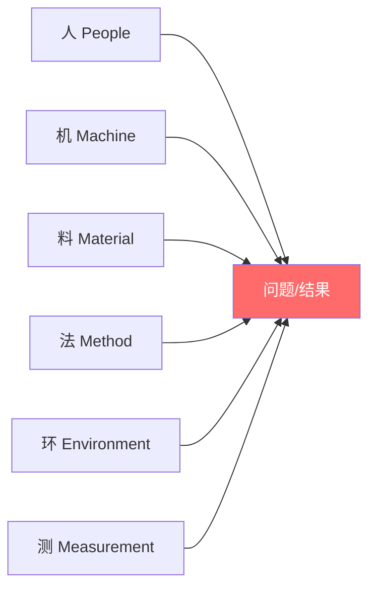
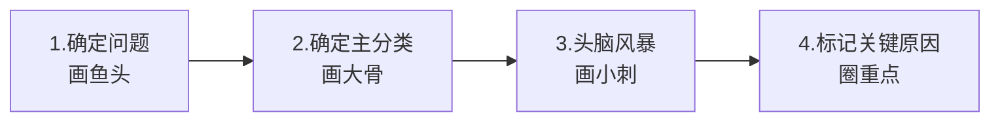
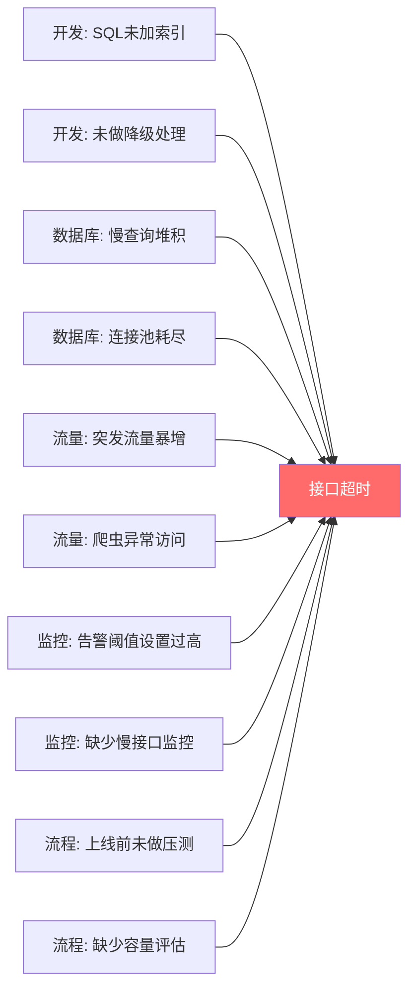
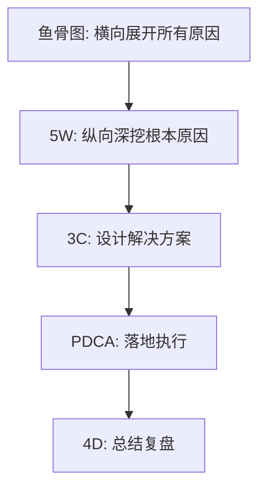
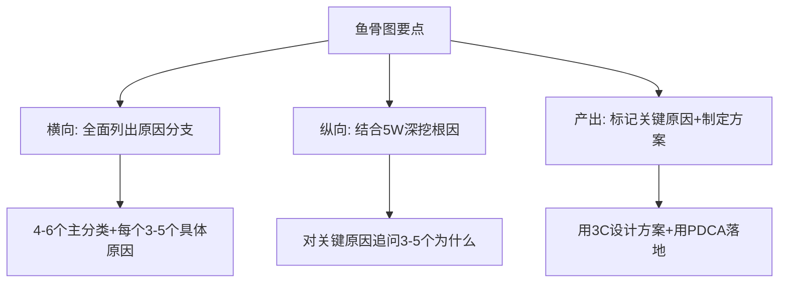
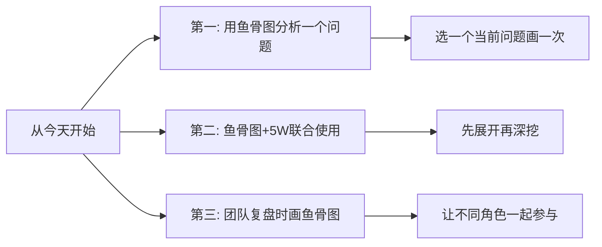

# 5.17 鱼骨图分析方法
#### 目录介绍
- [01.看一个真实案例](#01看一个真实案例)
  - [1.1 那次反复发生 4 次的奇怪 Bug](#11-那次反复发生-4-次的奇怪-bug)
  - [1.2 老大让我去白板前画一条鱼](#12-老大让我去白板前画一条鱼)
- [02.鱼骨图分析背景](#02鱼骨图分析背景)
  - [2.1 为什么需要鱼骨图](#21-为什么需要鱼骨图)
  - [2.2 鱼骨图的起源](#22-鱼骨图的起源)
  - [2.3 鱼骨图与5W的关系](#23-鱼骨图与5w的关系)
- [03.鱼骨图的结构](#03鱼骨图的结构)
  - [3.1 鱼头：问题/结果](#31-鱼头问题结果)
  - [3.2 鱼骨：主要原因分类](#32-鱼骨主要原因分类)
  - [3.3 小刺：具体原因](#33-小刺具体原因)
- [04.如何绘制鱼骨图](#04如何绘制鱼骨图)
  - [4.1 绘制的四个步骤](#41-绘制的四个步骤)
  - [4.2 头脑风暴的技巧](#42-头脑风暴的技巧)
- [05.鱼骨图实际案例](#05鱼骨图实际案例)
  - [5.1 线上接口超时分析](#51-线上接口超时分析)
  - [5.2 用户投诉增多分析](#52-用户投诉增多分析)
- [06.鱼骨图使用技巧](#06鱼骨图使用技巧)
  - [6.1 与其他方法联合使用](#61-与其他方法联合使用)
  - [6.2 分类不要超过6个](#62-分类不要超过6个)
  - [6.3 团队共创效果更好](#63-团队共创效果更好)
- [07.总结回顾一下](#07总结回顾一下)
  - [7.1 一句话核心](#71-一句话核心)
  - [7.2 鱼骨图给你的最大改变](#72-鱼骨图给你的最大改变)
- [08.后来发生的改变](#08后来发生的改变)
  - [8.1 当晚：找到了真正的根因](#81-当晚找到了真正的根因)
  - [8.2 第一个月：故障复盘必画鱼骨图](#82-第一个月故障复盘必画鱼骨图)
  - [8.3 一年后：团队故障率下降 65%](#83-一年后团队故障率下降-65)
- [09.今天起改变三点](#09今天起改变三点)
  - [9.1 第一，用鱼骨图分析一个问题](#91-第一用鱼骨图分析一个问题)
  - [9.2 第二，鱼骨图加5W联合使用](#92-第二鱼骨图加5w联合使用)
  - [9.3 第三，团队复盘时画鱼骨图](#93-第三团队复盘时画鱼骨图)
- [10.课后作业思考下](#10课后作业思考下)
  - [10.1 个人实践类作业](#101-个人实践类作业)
  - [10.2 团队与思辨类作业](#102-团队与思辨类作业)

## 01.看一个真实案例

那段时间我们的核心服务出了一个非常诡异的问题——**每周三凌晨 2 点左右必然报警一次，但报警过几分钟自动恢复，没造成大事故，但反复发生**。我作为模块负责人，前后修了 4 次：

- **第一次**：怀疑是定时任务太重，把任务时间改了 → 第二周还报
- **第二次**：怀疑是数据库慢查询，加了索引 → 第三周还报
- **第三次**：怀疑是某个 Cron Job，把它停了 → 第四周还报
- **第四次**：怀疑是网络抖动，让运维加了重试 → 第五周还报

我每次都觉得"这次找到了"，但每次都被打脸。同事们开始打趣我："你修的 Bug 都成精了吧？"

我自己也快崩溃了——**我每次都是凭直觉猜一个原因然后去修，从来没有真正系统地分析过**。

第五次报警之后，老大把我叫到会议室，指着白板说："你别再瞎修了，**今天我要看你画一条鱼**。"

我一脸问号。他笑了笑：

> "鱼骨图。鱼头写'每周三凌晨 2 点报警'，然后画 5 条大骨头：**人、代码、数据、流程、外部环境**。每条骨头下面，**穷尽列出所有可能的原因**——不是你猜的，是所有可能的。"

我用了整整两小时画完那张鱼骨图。骨架展开后我自己都吓了一跳——**我之前 4 次猜的原因，加起来只覆盖了那张鱼上 28 条小刺中的 4 条**。剩下 24 条我从来没想过！

更关键的是，当我对每条小刺打分（可能性 + 影响度）后，**第一名居然是一条我之前从没考虑的——"周二夜里运维的备份任务在凌晨 2 点抢占 IO"**。

我跑去找运维一查，确实如此。第二周改了备份时间，**报警再也没出现过**。下面这套救了我的鱼骨图方法论，今天我完整讲给你。

## 02.鱼骨图分析背景

当一个问题涉及多个层面的原因时，如果你只是在脑子里想或者随手列几条，很容易遗漏重要因素。鱼骨图通过可视化的方式，帮你系统地梳理问题的所有可能原因，确保分析的全面性。

鱼骨图（Fishbone Diagram）又叫因果图或石川图，由日本质量管理专家石川馨（Kaoru Ishikawa）在1960年代发明。因为它的形状像鱼骨头，所以得名。它最初用于制造业的质量问题分析，后来被广泛应用于各行各业。

鱼骨图和5W根因分析法是天然的搭档：鱼骨图帮你横向展开所有可能的原因分支，5W帮你纵向深挖每个分支的根本原因。两者结合使用，分析问题既全面又深入。

## 03.鱼骨图的结构

鱼头在图的最右边，写上你要分析的问题或不理想的结果。比如"系统崩溃""用户投诉增多""项目延期"等。

从鱼头延伸出来的大骨头代表主要的原因分类。在制造业中，常用的分类是"6M"：

| 分类 | 英文 | 含义 | IT行业对应 |
|------|------|------|-----------|
| 人 | Man/People | 人员相关 | 开发人员、运维人员 |
| 机 | Machine | 设备相关 | 服务器、网络设备 |
| 料 | Material | 材料相关 | 代码、配置、数据 |
| 法 | Method | 方法相关 | 流程、规范、方法论 |
| 环 | Environment | 环境相关 | 开发/测试/生产环境 |
| 测 | Measurement | 度量相关 | 监控、告警、测试 |

在IT行业中，可以灵活调整分类，比如改为：人员、技术、流程、工具、环境。

每根大骨头上又延伸出小刺，代表具体的原因。小刺可以继续细分，形成更深层的原因分析。

## 04.如何绘制鱼骨图

**第一步：确定问题。** 在纸的右侧写下要分析的问题，画一条从左到右的横线（鱼脊骨）。

**第二步：确定主分类。** 根据问题的性质，选择4-6个主要的原因分类，画成斜线连接到鱼脊骨上。

**第三步：头脑风暴。** 针对每个分类，尽可能多地列出具体原因。可以一个人做，也可以团队一起头脑风暴。

**第四步：标记关键原因。** 用5W分析法对最可能的原因进行深挖，找出根本原因后用特殊标记（如红色圆圈）标注出来。

- 不要评判：先列出所有可能的原因，不要在过程中否定任何想法
- 鼓励联想：一个人提出的原因可能触发另一个人的联想
- 数量优先：先追求数量，后追求质量
- 归类整理：头脑风暴结束后，检查是否有重复或归类不当的

## 05.鱼骨图实际案例

| 主分类 | 具体原因 | 深挖（5W） | 根本原因 |
|--------|----------|-----------|----------|
| 开发 | SQL未加索引 | 为什么？→新人不熟悉→为什么？→缺少代码review | 缺少SQL审查流程 |
| 数据库 | 连接池耗尽 | 为什么？→慢查询占用连接→为什么？→索引缺失 | 同上 |
| 监控 | 告警阈值过高 | 为什么？→上次调高了没改回来→为什么？→没有review机制 | 缺少告警配置review |
| 流程 | 上线前未压测 | 为什么？→时间紧→为什么？→缺少强制流程 | 缺少上线前压测checklist |

| 主分类 | 具体原因 |
|--------|----------|
| 产品 | 新版本功能复杂度增加、操作路径变长、缺少新手引导 |
| 技术 | 页面加载变慢、频繁出现404、支付偶发失败 |
| 客服 | 响应速度变慢、话术不统一、问题升级流程不畅 |
| 运营 | 促销活动规则复杂、优惠券使用限制多、退款流程繁琐 |

## 06.鱼骨图使用技巧

鱼骨图最大的价值是"全面性"——帮你确保不遗漏重要的原因分支。但它本身不负责深挖和解决问题，需要和5W、3C、PDCA等方法配合使用。

主分类建议控制在4-6个。太少容易遗漏，太多会导致分析框架过于复杂。如果某个分类下的原因很少，可以合并到相近的分类中。

鱼骨图特别适合团队一起绘制。不同角色的人对问题有不同的理解——开发看到技术原因，产品看到需求原因，运维看到环境原因。团队共创能让鱼骨图更加全面。

## 07.总结回顾一下

鱼骨图是一个可视化的因果分析工具，通过分类的方式系统地梳理问题的所有可能原因。它和5W根因分析法是最佳搭档——鱼骨图负责"广度"，5W负责"深度"。

我用了多年鱼骨图后发现，它最大的价值不只是"找到原因"，而是**逼你跳出"凭直觉猜"的思维定势**：

1. **告别"猜一个修一次"**——任何问题都先穷举所有可能，再按可能性排序，比东修西修高效百倍
2. **暴露视野盲区**——团队画鱼骨图时，每个角色都能贡献一两条你独自永远想不到的原因
3. **降低重复故障率**——找到的不再是"表面原因"，而是真正的"根因"，从根源上避免重复发生

## 08.后来发生的改变

回到开篇那个反复修了 4 次的 Bug。从老大让我画那条鱼开始，我做了下面这些改变。

那张白板上的鱼骨图我至今记得清清楚楚——5 大骨头、28 根小刺。我对每根小刺打分（可能性 1-5 + 影响度 1-5），最高分的居然是我从没考虑过的"运维备份任务抢 IO"。

第二天我跑去找运维一查，**完全吻合**——每周三凌晨 2 点是全量备份，恰好和报警时间点重合。运维改了备份时间，**报警从此消失**。

那一刻我深刻意识到——**我之前 4 次"修复"，全部修在了无关的地方**。如果不是鱼骨图逼我穷举，我可能再修 10 次都修不到。

我给自己定了一条规则——**所有线上问题/故障复盘，第一步必须画鱼骨图，禁止凭直觉直接动手修**。一个月内我用这套流程处理了 6 个问题：

- **2 个**当场就在鱼骨图里发现了之前漏掉的关键维度
- **3 个**用鱼骨图 + 5W 找到了真正的根因，一次性修复
- **1 个**通过团队画鱼骨图，让设计同事提供了关键线索

最让我意外的是——**画一张鱼骨图平均只要 30 分钟，但能省下后面几次甚至几十次的"瞎修"时间**。

一年后我开始带 8 人小组。我把"故障必画鱼骨图"作为团队铁规，并配了模板（鱼骨图 → 5W 深挖 → 3C 方案 → PDCA 落地 → 4D 复盘）。

数据非常硬：**团队的"重复故障"率从原来的每月 4-6 次降到每月 1-2 次，下降 65%**。Leader 问我秘诀，我把那张白板上的鱼指给他看："就是这条鱼。"

更深层的改变是——**团队成员不再凭直觉行动了**。每次出问题第一反应是"先画图分析"，而不是"我猜是某某原因"。这种思维习惯的迁移，比解决任何一个具体问题都更值钱。

如果你也常常陷入"反复修同一个问题"的循环，下面这三点是你今天就能开始做的事。

## 09.今天起改变三点

选一个你当前面临的问题，花15分钟画一个鱼骨图。不需要多完美，先确定4-5个主分类，然后在每个分类下列出你能想到的所有具体原因。画完后，你会对问题的全貌有一个清晰的认知。**强迫自己每根大骨头下至少列 5 条小刺**，前 2 条是表面，第 3-5 条才是关键。

对鱼骨图中你认为最可能的2-3个原因，用5W继续深挖。追问3-5个为什么，找到根本原因。鱼骨图帮你不遗漏，5W帮你挖到底。两者缺一不可——只用鱼骨图容易停在表面，只用 5W 容易钻牛角尖。

下次团队复盘时，在白板上画一个鱼骨图。让不同角色的同事各自贡献原因，你会发现团队的集体智慧远超个人分析。**特别推荐让平时少发言的同事来贡献某一根大骨头的小刺**——他们的视角往往是团队的盲区。

## 10.课后作业思考下

1. 选一个你最近遇到的工作问题（bug、故障、延期等），用鱼骨图做一次完整的原因分析。主分类可以用：人员、技术、流程、工具、环境。
2. 在鱼骨图分析的基础上，对TOP3的可能原因用5W进行深挖，找出根本原因，然后用3C方案设计法提出解决方案。

3. 对比鱼骨图和MECE法则，思考两者的异同。在什么场景下用鱼骨图更合适？什么场景下用MECE更合适？
4. 尝试把鱼骨图应用到生活问题中（比如"为什么最近总感觉累""为什么存不下钱"），体验它在非工作场景中的效果。

