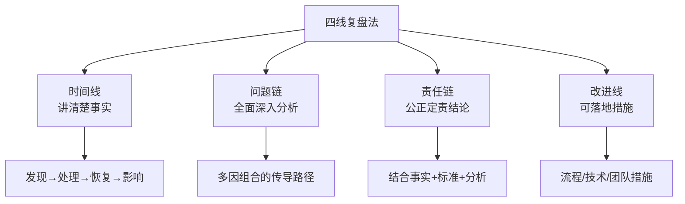
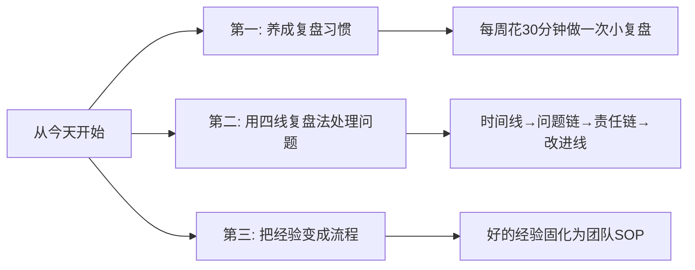

# 5.19 阶段复盘方法论
#### 目录介绍
- [01.看一个真实案例](#01看一个真实案例)
- [02.思考为何要复盘](#02思考为何要复盘)
- [03.复盘误区和目的](#03复盘误区和目的)
- [04.常用复盘法实践](#04常用复盘法实践)
- [05.复盘的模版案例](#05复盘的模版案例)
- [06.后来发生的改变](#06后来发生的改变)
- [07.今天起改变三点](#07今天起改变三点)
- [08.课后作业思考下](#08课后作业思考下)

## 01.看一个真实案例

那一年我刚转岗到一个稳定性方向的小组，年中的时候我们出过一个 P2 故障：某个下游接口超时把上游线程池打满，最后业务侧大面积报错。当时我跟老板说："写复盘了，加监控、加超时、加降级。" 老板点头放过。

四个月后，**几乎一模一样**的故障又来了一次，只是触发的下游变成了另一个。我又写了一份复盘——加监控、加超时、加降级。

再过四个月，**第三次**。这次老板没说话，把我们三次的复盘文档摆在一起，一字一句念给我听：

> "第一次的改进事项里写：'后续梳理所有下游调用'，时间 9 月底，**没人跟进**。
> 第二次的改进事项里写：'增加全链路压测'，时间 1 月底，**没人验收**。
> 第三次……你想让我念吗？"

我当时整张脸是烧的。**我以为我在做复盘，其实只是在写"故障作文"。**

晚上散会之前，老板对我说了一句话，我记到现在：

> "复盘不是写完那一刻完成的。**复盘是从你把改进项交给具体的人、定下具体的时间、并且真的有人来验收那一天开始，才算真正发生。**"

那次之后我才开始认真琢磨：**到底什么才是一次"真正的"复盘？** 时间线、问题链、责任链、改进线，这四条线一条都不能少，少哪一条复盘都会变成一份没人记得的 Word 文档。

下面这套阶段复盘方法论，就是被那三次故障"教会"我的东西。

## 02.思考为何要复盘

为何要复盘，什么场景下需要复盘？带着这个问题，自己想着梳理一下复盘的总结。

解决问题的思路不够全面，需要对自己进行复盘，主要是为了掌握解决事情的来龙去脉。

遭遇到了需求bug，需要对自己进行复盘，主要是为了分析问题的出现场景和后期如何避免的行动方案。

OKR目标没有达到，需要对自己进行复盘，主要是思考下年度的工作产能以及自身存在的问题。

生活中遇到了某个困难，也可以对自己进行复盘，事前，事中，事后，自己都是怎么处理的，保持精进。

在事后总结阶段，正常情况下我们主要是做收获总结和成果汇报即可，但是如果发生了明显的问题，就需要做问题复盘。

复盘是一个围棋术语，它指的是对局结束后回顾记录，检查招法的优劣和得失关键，并且根据分析提出更好的招法，提升以后的对局能力。

后来，这个思路被引入到了管理工作中。小杨觉得围棋中的复盘，其实可以应用于生活中的方方面面。

技术人员主要参与的是线上问题复盘，比如业务或者系统出现了线上问题，在问题解决之后往往就会组织复盘。

虽然无论做什么都不可能完全杜绝问题的发生，但这并不意味着我们只能坐以待毙。我们需要尽量降低问题发生的概率，减少问题导致的损失，因为就算事故不可避免，举个例子1年发生3次和1年发生1次，影响和意义也是完全不同的。

## 03.复盘误区和目的

很多人对复盘有误区：认为"复盘"就等于"我做了什么"，比如：结束了一天的工作，睡前总结今天做了哪些事情？有什么收获？给自己这一天打分。

还有的人认为，终于做完了一个项目，总结会上，大家凭着回忆和直觉，讲一讲在项目中做得好的经验、做得不好的地方，然后把内容整理下来，封存起来，当成对这个项目的复盘。

这也许是很多人习惯的模式。这种模式有用吗？有。但如果只停留在这样的程度，是远远不够的，复盘目标就是以后做的更好而非流水账。

你可以想一下：复盘的目的是什么。是让自己觉得"我做了很多事情"，从而感到很满足吗？或者，是让自己发现"我做得还不够好"，从而想办法去弥补吗？其实都不是。

复盘的真正目的，是把经验变成自己的养分，把它们吸收，化为己用，让自己比起过去的自己，再多迈出哪怕一步的距离。

也就是说：一天过去了，它其实就已经过去了。你再去纠结它是否充实、是否留有遗憾，其实没有多大意义。

关键的是：你能从中获得什么？永远从过去获得力量，来帮助我们更好地面对未来，这才是复盘的意义。

问题复盘的意义就在于找到问题的原因然后加以改进，避免同样的问题反复出现，降低问题的发生的概率和影响。

事事总结：敬畏错误，原则上，所有线上问题（含pre发现的严重问题），都有必要复盘，形成文档

强调意识：违规操作或者严重的主观意识问题，升格处理；难以规避的技术问题，特别是由于业务快速发展而不得不承担的线上风险，酌情降级

举一反三：凡是犯某个具体错误的，都需要承担心梳理上下游类似问题/某个技术点更完整学习，把问题，当成学习机会

## 04.常用复盘法实践

问题复盘的内容涵盖事实、分析、定责和改进4个部分，一次成功的问题复盘需要达成以下4个目标。其实看了同事的复盘，流程远比这个多，但是我这里简化了流程，分4步：

1. 讲清楚事实：讲清楚事情来龙去脉，事实是复盘的基础，如果连事实都没有讲清楚就开始分析、定责和改进，无异于搭建空中楼阁，做得再漂亮也是没有意义的。
2. 全面且深入地分析：首先需要保证没有遗漏问题，其次需要深入分析问题根因，否则以后问题还是会以其他方式反复出现。
3. 得出让各方心服口服的定责结论：需要有明确的定责标准，避免拍脑袋定责，或者按照级别和关系来定责。
4. 制定可以落地的改进措施：避免提出一些虚头巴脑的措施，看起来高大上，实际上却不知道怎么落地，后续也无法跟踪。
5. 四线复盘法，就是通过时间线、问题链、责任链和改进线这4条不同的线索来展开复盘，从而实现事实、分析、定责和改进这4个部分的目标。

第一条线：时间线

为了讲清楚事实，我们要明确时间线，也就是问题发生的经过，包括问题发现、问题处理过程中采取的各种关键措施、问题恢复的时间和问题影响的结果等。

其中，时间信息非常关键，因为它能够反映出问题发现速度、各项措施执行时间和团队响应效率等指标。

第二条线：问题链

为了全面且深入的分析，我们要明确问题链，也就是问题的传导路径。通常情况下，一个问题往往不是单一原因导致的，而是多个原因"碰巧"组合在一起所导致的，所以分析整个问题的传导路径，才能全面地了解产生问题的过程。

第三条线：责任链

为了得出让各方心服口服的定责结论，我们要明确责任链，也就是问题责任人之间的关系。

我们需要结合时间线中问题影响的结果、公司的故障定级标准和问题链的分析，最终确定哪些团队或个人应该承担责任，分别承担多大的责任，接受什么样的处罚。

之所以叫责任链，是因为一个问题的发生往往是整个流程上多个环节相关的人处理有问题，才会导致最终问题的发生。

第四条线：改进线

为了制定可以落地的改进措施，我们要明确改进线，也就是问题的改进计划，包括具体措施、改进责任人和时间节点等。

改进计划的思路来源于两个方面：时间线和问题链，通过时间线找到问题处理过程中不合理和可以优化的地方；通过问题链找到具体需要解决的问题。

具体措施可以是流程上的调整（增加或删除流程步骤），技术上的手段（增加功能、优化系统）和团队方面的措施（学习、培训、奖惩机制）等。

可以落地是非常重要的，不要说的很虚，我举个例子。后期要更加认真，后期写代码更细心，这种说法说了跟没说，你听听，感觉有道理，但觉得很空，对不对。比如后期写代码，小杨会和之前代码对比，罗列case，自测，并且同事代码review，这种比说写代码更细心是不是更具体还可落地。

KPT 复盘法，与其说是一个方法，不如说是一个原则。它的用法就是，在复盘的时候，问自己三个问题。

Keep/ 保持：哪些行为是可以保持的？Problem/ 问题：在过程中遇到了哪些问题？Try/ 尝试：我可以尝试去做些什么？

你会发现，单纯把这些东西记下来，其实意义不大，你要真的落到实处才有用。比如：Try 的部分，就可以跟"行动卡片"结合起来，用行动卡片把"尝试"落实、具体化；Problem
的部分，就可以通过主题汇总和模板，整理成一张核对清单。

下一次行动时，对着打钩，可以帮助自己减少思考成本；Keep 的部分，可以考虑归纳出方法论，无论是指导自己的实践还是传授给别人，都非常有用。

## 05.复盘的模版案例

一件事情做完后无论成功与否，坐下来把当时预先的想法、中间出现的问题、为什么没达成目标等因素整理一遍，在下次做同样的事时，自然就能吸取上次的经验教训。这就是复盘。

复盘不是用于追责，而是为了发现和解决问题、积累经验、优化流程，避免再次出现同样问题。

对事故的具体表现表述清楚，比如正常情况下逻辑是什么，出现问题后表现是什么，大概什么时候遇到的，可以用截图方式说明。

事故的影响数据

数据口径要准确，要说明影响数据的计算公式。

定级是根据受影响功能使用量、受影响用户数、资损三个维度来定级，若事故对这三个维度都有影响，那需要把相关数据都统计，以影响最大的纬度定级。

事故回放的记录

事故时间线不要漏了关键节点，处理人、采取对应的行动和原因。

时间线需要完整，包含事前、事中、事后的动作。

初期到末期的过程是怎么样的？过程之中大致可以分为几个阶段，每一个阶段都发生了什么？我们是如何应对的？

直接原因，是直接导致事故发生的原因，常见的是代码逻辑问题、分支合并、并发等。

深层原因，是挖掘为什么会出现这个事情深层次原因，也要从事前、事中、事后角度分析。

挖掘的方法可以在原有问题上在问为什么，比如为什么事故持续时间这么长？为什么代码逻辑有问题？为什么这个问题没有被发现。

深层原因才是我们要复盘解决的问题，能够避免相同问题再出现。

止损方案：详细描述止损方案

解决方案：详细描述解决方案，决定什么时候解决。要有一个把控进度的能力。

改善措施一定要写切实可落地的，和原因分析得出的结论要相对应，并且要有完成时间和跟进人。

复盘，最重要的目的和输出结果都是：规律总结。

这种规律包括两个方面，一个是认知方面，通过复盘，我们对于思考问题以及解决问题的方法有哪些心得？对于某些事物的认知有哪些心得？如果能够总结出普遍使用的规律性的东西，是对我们认知的一个提升。

另一个方面是实践方面，如果历史重演，假如再次遇到类似的项目，我们应该如何做？如果总结出规律，未来在类似的事情上我们一定可以做得好，这就是我们说的吃一堑长一智甚至吃一堑长三智。

> **复盘不是写报告，而是把"踩过的坑"变成"团队的护栏"——只有改进项被指派到人、定到天、并且被验收过，复盘才算真正发生过。**

1. **改进项必须有"人"和"时间"**：没有 Owner 和 DDL 的改进项，等于没写。
2. **同一类问题第二次出现就是警报**：说明上一次复盘没落地，必须升级处理。
3. **复盘的产出物是 SOP，不是 Word**：能复用的经验要变成检查清单或自动化脚本，才能真正"举一反三"。

## 06.后来发生的改变

那次老板把三份复盘拍在我面前之后，我做的第一件事不是改流程，而是建了一张飞书表格：

| 故障 ID | 改进项 | Owner | DDL | 验收人 | 状态 |
| ------- | ------ | ----- | --- | ------ | ---- |
| ...     | ...    | ...   | ... | ...    | ...  |

表格设了自动提醒：DDL 前 3 天提醒 Owner，过期当天提醒 Owner + 验收人。一个月内，过去半年里 17 项**僵尸改进项**被全部清盘——其中真正落地的有 11 项，剩下 6 项重新评估后被合并或者关闭。

我把"四线复盘法"贴在工位上，每次组里出问题，我都拉着相关人按四条线挨个过：

- **时间线**：精确到分钟，谁在几点做了什么。
- **问题链**：每个原因后面追问 3 个"为什么"，直到追到根。
- **责任链**：按"是否可避免 + 是否按规范"两个维度划，不按级别划。
- **改进线**：每条改进必须有 Owner + DDL + 验收人，三缺一不收。

第一次按这个流程做的时候，复盘会从原来的 1 小时开到了 2.5 小时，会后我组员还跟我抱怨"开太久"。但**那一类故障从那以后再没复发过**。

半年后部门年度总结，我被拉去做了一场跨组分享，主题就是"如何让复盘真正发生"。我把那张飞书表、四线复盘的模板、改进项验收 SOP，整套打包给了其他组。

更让我意外的是：年终述职那天，老板单独反馈了一句话：

> "你这一年最大的成长，不是修了多少 bug，而是开始**对'同一类问题不再发生'负责**了。"

我才意识到，**复盘真正改的不是流程，而是一个工程师对'重复犯错'的容忍度**。

## 07.今天起改变三点

**从本周开始，养成每周复盘的习惯。** 每周五下班前花30分钟，回顾这一周：做了哪些事？哪些做得好？哪些做得不好？下周可以改进什么？不需要写很多，3-5条足够。坚持一个月后你会发现，你对自己工作质量的掌控力明显提升。

**下次遇到线上问题或重大事故时，用四线复盘法来组织复盘。** 先理清时间线（发生了什么），再分析问题链（为什么会发生），然后明确责任链（谁来负责），最后制定改进线（怎么避免再次发生）。按照这个框架来复盘，既全面又公正。**记住：每条改进必须带 Owner、DDL、验收人，三者缺一不收。**

**把复盘得到的好经验固化为流程。** 复盘最大的价值不是发现问题，而是让好的做法变成团队的标准操作。如果你发现某个做法效果很好，就把它写成SOP（标准操作流程），让团队所有人都能受益，这才是复盘的终极目标。

## 08.课后作业思考下

1. 翻一翻你过去半年写过的复盘/总结，数一数：里面有多少改进项**真的被执行**了？比例如果低于 50%，说明复盘流程出了问题。
2. 你生活中是如何进行复盘的？针对复盘的提升，你有什么好的点子？如果有，分享给我小杨。

1. 选最近发生的一件"事与愿违"的事（项目延期、汇报翻车、争吵），用**四线复盘法**写一份不超过一页的复盘，重点是"改进线"必须可落地。
2. 用 KPT 法对你**这一周**做一次复盘：哪些行为可以 Keep？遇到了哪些 Problem？下周可以 Try 什么？写完贴在工位上，下周五对着打钩。

