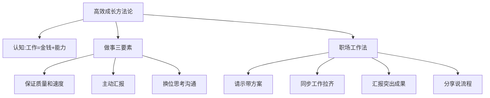
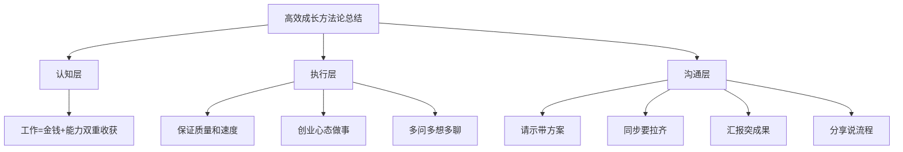
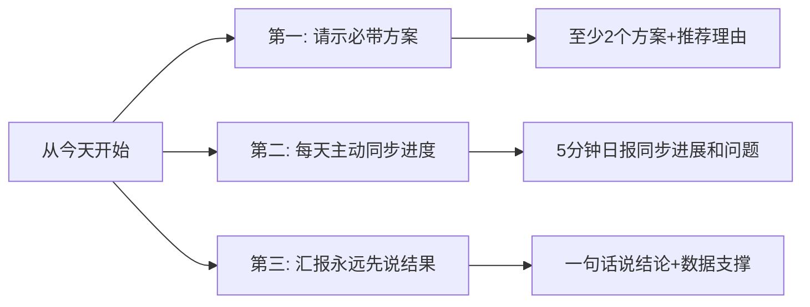

# 5.2 高效成长方法论
#### 目录介绍
- [01.看一个真实案例](#01看一个真实案例)
- [02.打工人高效成长](#02打工人高效成长)
- [03.保持高效的工作](#03保持高效的工作)
- [04.高效适应新职场](#04高效适应新职场)
- [05.请示工作带方案](#05请示工作带方案)
- [06.同步工作要拉齐](#06同步工作要拉齐)
- [07.汇报工作突成果](#07汇报工作突成果)
- [08.分享工作说流程](#08分享工作说流程)
- [09.后来发生的改变](#09后来发生的改变)
- [10.今天起改变三点](#10今天起改变三点)
- [11.课后作业思考下](#11课后作业思考下)

## 01.看一个真实案例

我刚转正那年，自认为是部门里最拼的那一个：早上九点到岗，晚上十一点才走，周末经常自愿加班，工位上永远堆着没合上的电脑和喝了一半的咖啡。三个月下来，我接的需求数量在小组里排第二，bug 单也修了一大堆，自我感觉良好。

直到半年绩效面谈，Leader 看着评分表，沉默了几秒，然后问了我一句话："你这半年，到底做成了哪一件事？"

我愣住了。我能说出我做了多少事——但说不出我"做成"了哪一件事。需求是产品的、bug 是测试发现的、上线后效果怎么样我也没跟过、做完一个就接下一个。Leader 看我答不上来，叹了口气说："你不是不努力，是你一直在做'被动接活的工'，而不是在'主动成事'。"

那一刻我才意识到——**我把"忙碌"误当成了"成长"**。

那次谈话之后，Leader 给我推了一句话，让我贴在显示器上整整一年：

> "工作是金钱和能力的双重收获。如果只换来了金钱，那你只是在变老，不是在变强。"

接着他给我列了几条职场做事的"硬规矩"：请示要带方案、同步要拉齐、汇报要先讲结果、分享要说流程。当时我觉得这不就是常识吗？但真正去执行才发现——绝大多数人，包括过去的我，连这几条最基本的常识都没在做。

后面这一整套从"被动加班"到"高效成长"的转身，就是我接下来要分享的方法论。

## 02.打工人高效成长

在一周的时间内，工作会占据一个人一半以上的时间。如果你在业余时间学到的知识，不能很好地应用到工作中来，就无法给知识塑造一种良好的实践环境，就无法形成一种输入和输出的闭环，也很难真正高效透彻地把知识转换为你自身的技能和能力。

只有在工作中提供的大体量的业务背景下，才能有机会去真正精通当前项目中使用到的技术，记住，一定要结合工作项目来快速成长。**工作最好的认知就是：它是金钱和能力的双重收获**。

职场如何做事？以下三点是职场必备的核心技能，务必要掌握，非常重要：

1. 保证质量和速度。既要按照时间节奏完成任务，又要做好任务；
2. 主动汇报项目背景、目标、进度、结果，以及你的思考与复盘；
3. 与人对接时，先换位思考，别人需要的是什么？如何表达才能让别人理解？别人表达后，如果不是完全理解，将自己的理解告诉别人，询问自己的理解是否到位。

针对个人职业生涯成长，都要设定"跳一跳才能够得着的目标"，有挑战性的目标才能激发出高水准的表现，带来更多的锻炼和提升，当然也不至于够不着，让你产生强烈的挫败感。

## 03.保持高效的工作

高效工作的本质无非就是注重投入产生比，即：1、提升收益。2、减少成本。无论那种工作，都离不开这两个点。

思考一个问题：比如你想涨薪，你该如何做，才可以创造更多的收益，让你的老板同意给你加工资。

1. 适当的休息。学会有意识地休息，打破连续工作的循环，让大脑在放松中自由飞翔。使用番茄工作法，25分钟专注工作，5分钟休息。创造一个有利于休息和恢复精力的环境。
2. 思维的转变。用6个月完成6年的工作，可能吗？这不仅是一个时间问题，更是一个思维问题。用SMART原则（具体、可测量、可达成、相关性、时限性）可视化你的目标和计划。
3. 极简主义的力量。剔除无效的忙碌，专注于那些能带来实质性成果的任务。区分任务的紧急性和重要性，优先处理既紧急又重要的任务。
4. 进步的四个阶段。从困惑到一致性，每一步都是进步的必经之路。记录每天的工作和学习，反思哪些方法有效，哪些需要改进。
5. 让创造成为日常。填充、清空、使用——这是大脑的三个功能。定期进行头脑风暴，记录下所有创意，无论多么荒谬。可以保持创造力的流动，实现持续的进步。

减少成本的核心思路，是把"重复的、低价值的、机械的"工作通过工具或流程砍掉，把省下来的时间投入到真正能产生增量的事上。

1. 用 AI、脚本、模板等工具批量处理重复劳动，比如周报模板、代码片段库、自动化脚本。原本5天的工作可以缩到3天，省下的2天用来沉淀技术或思考更高阶的问题。
2. 拒绝"假忙碌"。每天结束前问自己：今天哪些时间是花在真正能推动业务/能力增长的事情上的？哪些是机械应付？逐步把后者占比压低。

不要把"做得快"等同于"效率高"。如果方向错了，越快越糟。每周末花15分钟回顾一周做的事情，按"高价值/低价值"分类，下周主动调整投入比例，这才是真正意义上的高效。

## 04.高效适应新职场

以开发场景为例，同样一个开发工作，看看不同的人分别是怎么做的：

1. A同学完成模块开发后，转测试后就不再过问，等着测试给他提bug。
2. B同学完成模块开发后，转测试后会跟测试讨论各项边界，努力思考程序设计的缺陷。
3. C同学完成模块开发后，主动会跟测试进行用例评审，定期跟踪测试同学测试过程中，业务流转是否正常，数据库状态更新是否符合预期。

量变逐步到质变：做完——>做好——>超前做好！那么思考一下你属于哪种角色？

困惑1：刚入职的时候，脑子里面有很多的问号：不清楚公司和各部门的分工，不认识相关业务的对接同事、不清晰公司的各项业务流程，不清楚业务产品…

方法论：多问、多想、多聊

1. 多问：向导师主动多请教，邀请熟悉的同事培训讲解。
2. 多想：思考业务发展模式，项目设计理由和为什么？梳理出项目从需求到上线，需要哪些部门同事配合，做好预期。
3. 多聊：主动跟相关同事沟通，了解对方工作。提出自己的想法思路，请对方指正和配合。

积极寻求他人的反馈和建议，了解自己的优势和改进的方向。接受反馈，并将其用于改进自己的工作表现和技能，不断提升自己。

寻找有经验和成功的导师或角色模型，向他们学习并寻求指导。他们可以提供宝贵的建议和指导，帮助你在职场中高效适应和成长。

## 05.请示工作带方案

那是一个紧张的周一早晨，部门经理紧急召开会议，宣布了一个关键项目的负责人突然离职，项目进度岌岌可危。面对这一挑战，打工A决定抓住机会，主动承担起项目负责人的重任。

他知道，这可能是证明自己的最好时机。在接手项目后，打工A迅速投入工作，不仅详尽地分析了项目的现状和潜在风险，还提出了几套切实可行的解决方案。

打工A明白，这不仅是完成任务，更是展示自己实力的绝佳机会。在向经理汇报时，打工A没有仅仅提出问题，而是带上了自己精心准备的方案。

这种"请示工作，必带方案"的做法，让经理对打工A刮目相看，也为他的职场生涯带来了新的希望。

在工作中，我们经常需要向上级请示决策。但仅仅提出问题而不带解决方案，往往会给人留下不负责任的印象。

相反，如果我们能够在请示的同时，提供一份详尽的方案，就能展现出我们的前瞻性和解决问题的能力。

一句话格式："这件事我有 N 个方案：方案 A 是 XX，优点 XX、风险 XX；方案 B 是 XX……我倾向于方案 A，因为 XX。请您拍板。"

这种结构帮领导把决策成本压到最低——他只需要回答"OK"或"换 B"，而不是从零思考。这就是"上级时间最省、你被记住最多"的请示方式。

## 06.同步工作要拉齐

工作计划重要的是要汇入组织的大目标，写工作计划时，先和组织对齐目标，再去关联个人目标。这样写的好处就是：能够证明自己的工作计划，是在为实现公司目标在努力。

这个做法的重点在于：组织的新目标，与"我"如何承接。对齐目标注意这两个关键点：

1、关联组织目标：积极响应组织目标，结合自己的岗位角色，想想你能承接哪部分，把小目标拆分到自己身上。

比如：为了实现组织提升效能的目标，销售部和人力资源部落实的方向不一样。如果你是销售部门，你就可以将目标拆解为"提升销售业绩，提高销售人效"。

2、量化标准：把目标用数字的形式量化，让目标变得具体并且可衡量。领导能够根据工作计划更好地评判你的工作成果。

比如你的目标是：优化C端用户的产品体验，提升用户满意度。可以改为：修改产品使用上的5个bug，在下一轮用户问卷调研中，提升用户使用满意度5%。

在工作计划中，你要对齐所有协作者的进度表，同时给出实现目标的方式和关键结果。让领导清楚你的价值和所需资源，这样他就能提前为你争取资源，最大程度帮你实现目标。

1. 给出实现目标的具体方式。提前在计划中给出实现目标所需的成本，确定是否需要其他部门的协作。同时，要给出实现目标的关键结果，给协作者以确定性，在行动前建立协作的共识。
2. 给出实现目标的关键结果。公式：关键结果=截止时间+量化标准。注意：关键结果不是怎么做的具体行动，而是实现大目标的一个个小目标。

比如，你的目标是：对新用户的生命周期分析，新用户留存率要提升20%。关键结果可以这样写：

1. 20日前，完成不少于2张用户留存的可视化报表，为评估用户留存情况提供数据工具。
2. 完成新用户的使用路径分析，找到2个新用户流失的关键点，并在月底前，推动产品技术部完成可落地的优化方案。
3. 利用A/B测试，完成3个提高新用户留存的方案。

## 07.汇报工作突成果

项目进行中，打工A遭遇了重重困难。市场竞争激烈，客户需求多变，团队成员间的沟通也出现了障碍。在一次关键的项目汇报中，意识到了自己之前忽视的一点——汇报工作时必须突出结果。

于是开始学习如何将复杂的工作内容浓缩成简洁明了的成果展示，这种转变让他在后续的汇报中更加自信，也让工作成效得到了更好的体现。

在职场中，结果往往比过程更能体现一个人的价值。因此，在汇报工作时，我们应该学会突出成果，让领导快速了解工作的实际效益。

可以通过数据、图表等形式直观地展示成果，这样不仅能提高汇报的效率，也能让领导对我们的工作给予肯定。工作成果一定要最先突出出来！

并且打工A，通过总结成功的经验和需要改进的地方，形成一套标准化的操作流程，为未来的工作提供指导。

这不仅能提升个人的工作质量，也能为团队积累宝贵的经验财富。汇报工作时，结果是你最有力的语言，让成绩自己发光，每个人都能在职场中找到属于自己的舞台。

## 08.分享工作说流程

只有不断地提升自己，才能在职场中站稳脚跟。于是，打工A开始更加努力地工作，不仅在项目中积极寻求创新，还主动与团队成员沟通，解决矛盾。

还学会了如何在压力下保持冷静，如何在团队中发挥领导力。他的变化也感染了团队，大家开始更加团结协作，共同面对挑战。

随着项目的推进，A的努力逐渐得到了回报，方案得到了客户的认可。

在最终的项目总结会上，用一份精彩的PPT展示了项目的成功，不仅突出了团队的努力和成果，也展示了自己的领导能力和专业素养。

团队合作是职场中不可或缺的一部分。在分享工作时，详细说明自己的工作流程，不仅能帮助团队成员理解任务，还能提高团队的整体效率。

分享工作流程，是团队协作的润滑剂，让每个齿轮都能高效运转。每个项目结束后，进行复盘总结是非常有价值的。

| 职场沟通场景 | 核心原则 | 关键技巧 | 常见误区 |
|-------------|----------|----------|----------|
| 请示工作 | 带方案 | 列出2-3个方案供选择 | 只提问题不给方案 |
| 同步工作 | 拉齐 | 对齐目标+量化标准+关键结果 | 各做各的不同步 |
| 汇报工作 | 突成果 | 数据+图表+结论先行 | 讲过程不讲结果 |
| 分享工作 | 说流程 | 详细说明工作流程和方法 | 只说做了什么不说怎么做 |

职场高效成长 = "认知"看清这是金钱+能力的双重买卖 + "执行"用方法论保证下限 + "沟通"用四件事（请示带方案、同步拉齐、汇报突成果、分享说流程）放大上限。

## 09.后来发生的改变

把 Leader 的话贴上显示器后的第一周，我在每天下班前加了 5 分钟的"成事日记"。栏目只有三栏：今天我推进了哪件**结果性**的事？产生了什么可量化的产出？明天打算交付什么？

第一天写的时候我就傻眼了——我足足做了 11 件事，但能写进"结果性"那一栏的，只有 1 件半。这一栏成了一个非常残忍的镜子，逼着我从"被动接需求"开始有意识地选择"主动成结果"。

接下来一个月，我严格执行 Leader 给的那四件事：

- **请示带方案**：以前 IM 上发"老板这个怎么办"——现在改成"老板我有 A、B 两个方案，倾向 A，因为 XX，您看？"，Leader 回复速度从平均 2 小时缩到 10 分钟。
- **同步要拉齐**：每周一发一条三行计划、每周五发一条三行结论同步给上下游，跨部门追着我问进度的次数减少了 80%。
- **汇报突成果**：周报第一句永远是"本周关键结果：XX，相比上周 +XX%"，再展开过程。
- **分享说流程**：组内分享我开始把"我是怎么做的、踩了什么坑、流程图是怎样的"讲清楚，不再只讲结论。

一个月后的小组会上，Leader 当着所有人的面说："最近XX（我）的输出明显能让人接住了。"那是我入职以来第一次被公开点名表扬。

季度绩效出来时，我从上半年的"符合预期"被打到了"超出预期"。变化的不是我多加了多少班——加班反而比之前更少了——而是我做的每一件事都开始有"结果"和"可被引用的产出"。

更让我意外的是，我开始有了"被推荐"的资格。半年之后，部门内一个跨组的核心项目，Leader 主动把我推上去做骨干。回头去看，那一年最大的转折，不是我变聪明了，而是我终于不再用"努力"自我感动，而是开始用方法论"讲究地"做事。

## 10.今天起改变三点

从下一次请示工作开始，永远带上你的方案。不要说"老板这件事怎么办？"，而是说"老板这件事我有两个方案：方案A是XX，优点是XX；方案B是XX，优点是XX。我倾向于方案A，因为XX。您看选哪个？"这种请示方式不仅体现了你的思考能力，还节省了领导的决策时间。

养成每天主动同步工作进度的习惯。哪怕只是在群里发一条简短的消息："今天完成了XX，明天计划做XX，有一个问题需要协调XX。"这种主动同步的习惯能大幅减少领导的不确定感，也能让协作方及时了解你的进展。

任何汇报永远先说结果。不管是口头汇报、周报还是年终总结，第一句话就给出核心结论和关键数据。比如"本月我们的用户增长达到了25%，超额完成了20%的目标"。先让对方知道"做得怎么样"，再展开讲"怎么做到的"。

## 11.课后作业思考下

1. 审视你当前的工作状态：你是A同学（做完就不管了）、B同学（会思考边界）还是C同学（超前做好）？你可以采取什么具体行动来向C同学靠拢？
2. 回忆你最近一次向领导请示工作的经历，当时你带方案了吗？如果没有，用3C方案设计法重新准备一遍，体会两种请示方式的差异。

1. 检查你最近一周的工作同步情况：有没有和领导、协作方保持及时的信息同步？如果有遗漏，思考用什么机制来保证同步的及时性。
2. 如果你刚入职一家新公司，你会如何用"多问多想多聊"的方法快速适应？列出你要问的10个关键问题和找谁去问。
