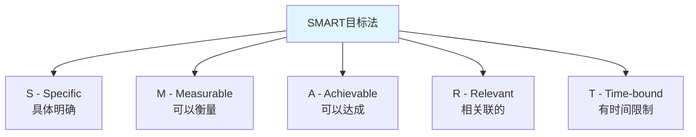
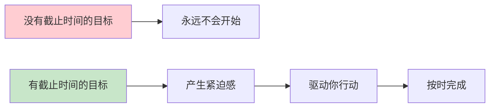
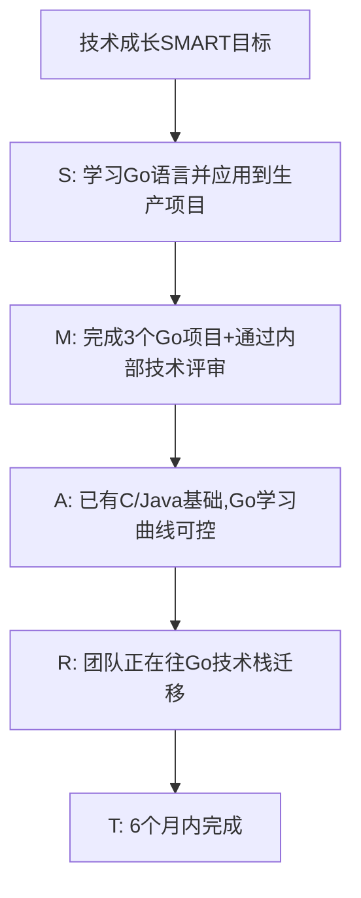
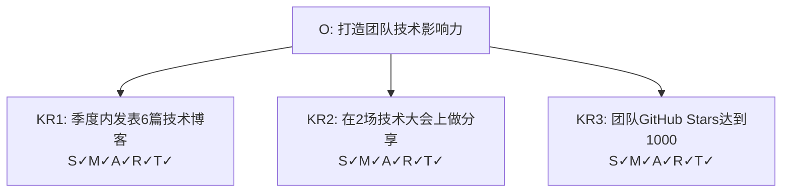
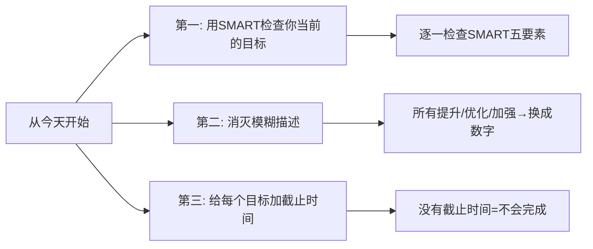

# 5.4 SMART目标设定
#### 目录介绍
- [01.看一个真实案例](#01看一个真实案例)
  - [1.1 那个被打回三次的年度计划](#11-那个被打回三次的年度计划)
  - [1.2 Leader 一句话点醒我](#12-leader-一句话点醒我)
- [02.SMART法的背景](#02smart法的背景)
  - [2.1 模糊目标的危害](#21-模糊目标的危害)
  - [2.2 SMART法的起源](#22-smart法的起源)
- [03.SMART五个要素](#03smart五个要素)
  - [3.1 S - Specific 具体明确](#31-s---specific-具体明确)
  - [3.2 M - Measurable 可以衡量](#32-m---measurable-可以衡量)
  - [3.3 A - Achievable 可以达成](#33-a---achievable-可以达成)
  - [3.4 R - Relevant 相关联的](#34-r---relevant-相关联的)
  - [3.5 T - Time-bound 有时间限制](#35-t---time-bound-有时间限制)
- [04.SMART实际案例](#04smart实际案例)
  - [4.1 技术人员的SMART目标](#41-技术人员的smart目标)
  - [4.2 管理者的SMART目标](#42-管理者的smart目标)
  - [4.3 个人生活的SMART目标](#43-个人生活的smart目标)
- [05.SMART与OKR配合](#05smart与okr配合)
  - [5.1 SMART用来优化KR](#51-smart用来优化kr)
  - [5.2 一个完整的配合案例](#52-一个完整的配合案例)
- [06.SMART常见误区](#06smart常见误区)
  - [6.1 五个高频误区清单](#61-五个高频误区清单)
  - [6.2 我自己踩过的两个坑](#62-我自己踩过的两个坑)
- [07.总结回顾一下](#07总结回顾一下)
  - [7.1 一句话核心](#71-一句话核心)
  - [7.2 SMART的最大价值](#72-smart的最大价值)
- [08.后来发生的改变](#08后来发生的改变)
  - [8.1 第一周：把模糊词全部替换成数字](#81-第一周把模糊词全部替换成数字)
  - [8.2 第一个月：年度计划一次过审](#82-第一个月年度计划一次过审)
  - [8.3 半年后：SMART成了我团队的语言](#83-半年后smart成了我团队的语言)
- [09.今天起改变三点](#09今天起改变三点)
  - [9.1 第一，用SMART检查你当前的目标](#91-第一用smart检查你当前的目标)
  - [9.2 第二，消灭模糊描述](#92-第二消灭模糊描述)
  - [9.3 第三，给每个目标加截止时间](#93-第三给每个目标加截止时间)
- [10.课后作业思考下](#10课后作业思考下)
  - [10.1 个人目标类作业](#101-个人目标类作业)
  - [10.2 团队与思辨类作业](#102-团队与思辨类作业)

## 01.看一个真实案例

那年元旦后的第一周，部门要求每个人提交"个人年度发展计划"。我用了整整一个晚上写完，自我感觉非常完整：

> "提升技术能力""加强团队影响力""多读技术书""改善沟通方式""锻炼身体保持健康"……

我把这份满满当当的计划发给 Leader，等着夸奖。结果第二天上午我就收到了回复——**整页文档被标了 11 处红色批注**，每条批注都是同一句话：

> "什么叫'提升'？提升多少？什么时候提升到什么水平？"

我硬着头皮改了一版，把"提升技术能力"改成了"深入学习云原生技术"——又被打回。我再改成"今年把 Kubernetes 学好"——还是被打回。

第三次被打回时，Leader 给我发了张图片，是一张写着 SMART 五个字母的便签纸，配了一句话：

> "你写的不是目标，是愿望。**把每条改成机器人都能照着执行的样子，再发我**。"

那一刻我突然懂了——我以为我在写"目标"，其实只是在罗列"想做的事"。"提升""加强""改善"这些词，对我自己的大脑、对 Leader、对 HR 都是无效信息，因为没人能判断什么时候算完成。

我用 SMART 把那 11 条全部重写了一遍——"今年内通过 CKA 考试，并独立完成公司三个核心服务的容器化改造，Q2 末完成第一个、Q4 末全部完成"——这次秒过。从那以后我才真正理解：**SMART 不是一个填表工具，它是一种把愿望变成可执行任务的语言**。下面这套方法，就是当年救我的东西。

## 02.SMART法的背景

"今年要好好学习""我要提升技术能力""我想更加高效"——这些目标听起来很好，但有一个致命的问题：太模糊了。模糊的目标等于没有目标，因为你无法衡量自己是否达成了，也无法制定具体的行动计划。

人类的大脑对模糊的事物天然有回避倾向。当目标不够清晰时，你的潜意识会找各种理由来拖延——"反正也不知道做到什么程度算完成"。

SMART原则由管理学大师彼得·德鲁克在1954年的《管理的实践》中提出雏形，后来由George T. Doran在1981年的论文中正式命名为SMART。它是全球使用最广泛的目标设定工具之一。

## 03.SMART五个要素

目标必须是具体的、明确的，而不是含糊的。你需要清楚地知道自己要做什么。

| 模糊目标 | SMART目标 |
|----------|-----------|
| 提升技术能力 | 掌握Kubernetes容器编排，能独立完成集群部署和运维 |
| 多读书 | 每月读完2本技术类书籍并输出读书笔记 |
| 提高团队效率 | 将团队平均需求交付周期从15天缩短到10天 |

目标必须是可以量化衡量的。"提升"了多少？"减少"了多少？用数字来定义成功的标准。

可衡量的方式包括：数量（完成XX个）、比率（提升XX%）、时间（缩短到XX天）、评分（达到XX分）。

目标必须是在你的能力和资源范围内可以达成的。太容易的目标没有挑战性，太难的目标容易让人放弃。好的目标是"踮踮脚能够到"的。

判断是否可达成的方法：参考过去的数据、分析当前的资源、评估外部条件。如果团队从未做到过的事情，可以先设定一个中间里程碑。

目标必须与你的核心职责或上级目标相关联。如果一个目标和你的工作方向无关，再好也不应该成为你的重点。

检验方法：问自己"这个目标完成了，对谁有价值？和团队/公司的大目标有什么关系？"如果答不上来，这个目标可能不值得投入。

目标必须有明确的截止时间。"我要学会Python"和"我要在3个月内学会Python并完成一个实际项目"——后者才是真正的目标。有了截止时间，你才会有紧迫感，才会去制定行动计划。

## 04.SMART实际案例

| SMART要素 | 内容 |
|-----------|------|
| Specific | 学习Go语言，能独立开发和维护Go项目 |
| Measurable | 完成3个Go语言生产项目，通过团队技术评审 |
| Achievable | 已有C/Java编程基础，团队有Go技术导师 |
| Relevant | 团队正在从Java迁移到Go，这是核心技能需求 |
| Time-bound | 6个月内完成（Q1学习基础+Q2实战项目） |

| SMART要素 | 内容 |
|-----------|------|
| Specific | 提升团队的需求交付效率 |
| Measurable | 平均交付周期从15天缩短到10天 |
| Achievable | 已识别出3个主要瓶颈，有明确的优化方向 |
| Relevant | 业务方多次反馈交付太慢，影响业务迭代速度 |
| Time-bound | 本季度内实现 |

| SMART要素 | 内容 |
|-----------|------|
| Specific | 养成跑步锻炼的习惯 |
| Measurable | 每周跑步3次，每次5公里以上 |
| Achievable | 目前能跑3公里，循序渐进增加距离 |
| Relevant | 长期久坐导致亚健康，需要通过运动改善 |
| Time-bound | 3个月内达成稳定的跑步习惯 |

## 05.SMART与OKR配合

SMART和OKR是天然的搭档。OKR中的O负责方向（不需要量化），KR负责衡量标准——而SMART正好可以用来检验你的KR是否足够好。

**用SMART检查KR的清单：**

1. 这个KR够具体吗？（S）
2. 这个KR能用数字衡量吗？（M）
3. 这个KR在本季度内可以达成吗？（A）
4. 这个KR和O有直接关联吗？（R）
5. 这个KR有明确的截止时间吗？（T）

如果五个答案都是"是"，那这就是一个好的KR。

## 06.SMART常见误区

| 误区 | 表现 | 正确做法 |
|------|------|----------|
| 只关注M忽略S | 目标有数字但不具体 | 先明确做什么再量化 |
| A定得太低 | 目标太容易缺乏挑战 | 设定"跳一跳够得着"的目标 |
| R与大方向脱节 | 个人目标和团队无关 | 先确认上级目标再设定 |
| T不够紧迫 | "今年内完成" | 细化到月或季度 |
| 定完不回顾 | SMART变成一次性文档 | 每月回顾一次进度 |

除了表格里的通用误区，我自己亲身踩过两个大坑，特别提出来给你避雷：

- **"只 SMART 简单的目标"**：我曾经把"每周跑 3 次"写成 SMART，但把核心的"职业突破"写成"努力提升"。结果运动坚持得很好，职业反而原地踏步。**越重要的目标越要用 SMART**。
- **"假装 SMART"**：写了"6 个月内完成 Go 转型"，但完全不知道每个月要做到什么程度。结果第 5 个月才发现差距巨大。SMART 必须配合**月度里程碑**——每个 SMART 目标至少拆出 3-6 个里程碑节点。

## 07.总结回顾一下

SMART是最基础也最实用的目标设定工具。无论你用什么目标管理方法（OKR、KPI、个人计划），都可以用SMART来检验你的目标是否足够好。

很多人以为 SMART 的价值是"让目标看起来更专业"，其实远不止：

1. **它把愿望变成任务**——可以直接拆解成行动计划
2. **它让进度可被检查**——每月每周都能问"我离目标还差多少"
3. **它让团队有共同语言**——你说"减少 30%"和说"减少很多"，沟通效率天差地别

**记住：模糊的目标等于没有目标。花10分钟用SMART把目标写清楚，能帮你在后续执行中节省大量时间和精力。**

## 08.后来发生的改变

回到开篇被打回三次的我。在 Leader 那张 SMART 便签纸的提醒下，我做了下面这些改变。

我做的第一件事是建了一个"模糊词黑名单"，包括：提升、加强、改善、深入、增强、优化、强化、做好。**只要这些词出现在我的目标文档里，我就强制自己改写**，比如：

- "深入学习云原生" → "Q2 末通过 CKA 认证 + 完成两个微服务的容器化改造"
- "加强代码质量" → "今年内单元测试覆盖率从 35% 提升到 75%，线上 Bug 率下降 50%"

仅仅这一步改造，就把我那份被打回三次的计划重写了一遍——这一次，**Leader 没有标任何红字，直接通过**。

更让我意外的是，从那以后我提交的所有目标文档（OKR、季度计划、转岗述职），**几乎全部一次过审**。原因很简单——SMART 帮我提前消除了所有可能的歧义点，Leader 看完后没什么可问的。

我也因此节省了大量"反复改文档"的时间。粗略估算，**第一个月我至少省下了 8 小时本来要用来反复修改文档的时间**，全部投入到了真正推进目标的事上。

半年后我开始带 5 个人的小组。我做的第一件事就是把 SMART 引入团队——所有 OKR、所有需求验收标准、所有项目里程碑，必须满足 SMART。

效果非常明显：

- **跨部门对齐效率翻倍**——产品经理来提需求，必须给出 SMART 的验收标准，避免"做完了发现不是想要的"
- **团队成员晋升答辩通过率显著提升**——因为大家学会了用数字描述贡献
- **我自己也跟着提了一级**——年终述职时，我把所有产出都写成了 SMART 的形式，评委一眼就能看到价值

回头看，那次被打回三次的"狼狈经历"，反而是我目标管理能力的起点。如果你现在写目标也常常被人挑战"不够清晰"，下面这三点是你今天就能开始做的事。

## 09.今天起改变三点

今天就用SMART的五个要素检查你当前的所有目标。打开你的OKR/KPI/个人计划，逐一检查每个目标是否满足SMART。不满足的，立即修改。你会发现，很多你以为清晰的目标其实并不符合SMART标准。

从今天起消灭所有模糊描述。"提升""优化""加强""改善"——这些词以后在你的目标中都不能单独出现。必须跟上具体的数字："提升30%""优化到2秒以内""从3次减少到0次"。可以像我一样建一个"模糊词黑名单"贴在显示器边上。

给你所有没有截止时间的目标加上截止时间。没有截止时间的目标永远不会被完成。今天就给它们都加上，哪怕是一个初步的估计也好过没有。更进一步的做法是——每个 SMART 目标都拆出 3-6 个月度里程碑。

## 10.课后作业思考下

1. 列出你当前最重要的3个目标（工作或生活），用SMART的标准逐一检查，看看哪些要素是缺失的，修改为完整的SMART目标。
2. 找一个你一直想做但一直没开始的事情，用SMART设定一个具体的目标和截止时间。然后用PDCA制定执行计划，看看是否能推动你行动起来。

3. 观察你的团队/公司是如何设定目标的，有哪些不符合SMART原则的地方？你能提出什么改进建议？
4. 思考：SMART是否有局限性？在什么场景下SMART可能不够用？（提示：考虑创新性和探索性的工作。）

