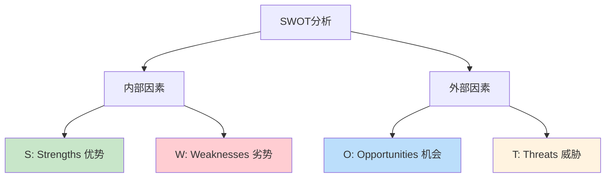
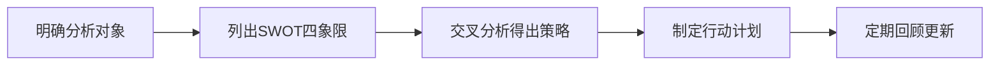
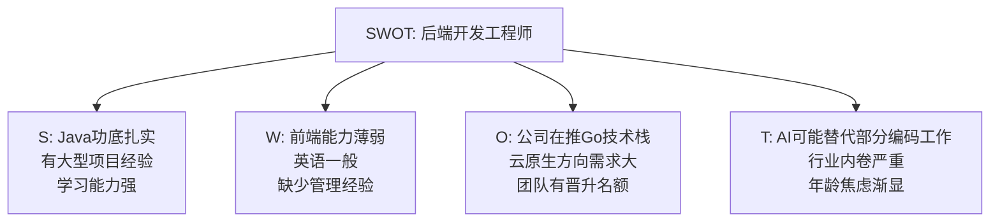
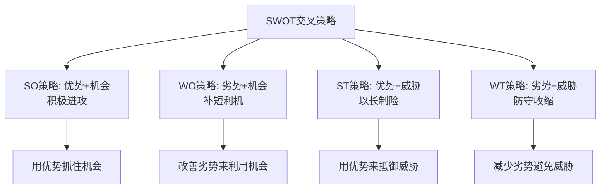
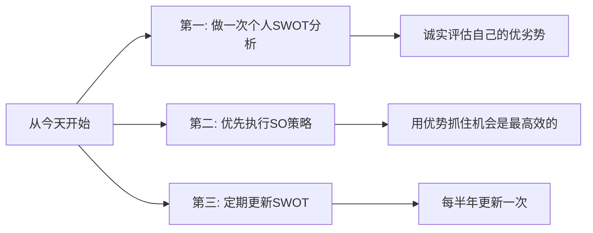

# 5.5 SWOT分析方法论
#### 目录介绍
- [01.看一个真实案例](#01看一个真实案例)
  - [1.1 那个让我纠结三个月的 offer](#11-那个让我纠结三个月的-offer)
  - [1.2 一张 A4 纸帮我做了决定](#12-一张-a4-纸帮我做了决定)
- [02.SWOT分析的背景](#02swot分析的背景)
  - [2.1 为什么需要SWOT](#21-为什么需要swot)
  - [2.2 SWOT的起源](#22-swot的起源)
- [03.SWOT四个象限](#03swot四个象限)
  - [3.1 S - Strengths 优势](#31-s---strengths-优势)
  - [3.2 W - Weaknesses 劣势](#32-w---weaknesses-劣势)
  - [3.3 O - Opportunities 机会](#33-o---opportunities-机会)
  - [3.4 T - Threats 威胁](#34-t---threats-威胁)
- [04.SWOT的分析步骤](#04swot的分析步骤)
  - [4.1 第一步：明确分析对象](#41-第一步明确分析对象)
  - [4.2 第二步：头脑风暴列出要素](#42-第二步头脑风暴列出要素)
  - [4.3 第三步：交叉分析得出策略](#43-第三步交叉分析得出策略)
- [05.SWOT实际案例](#05swot实际案例)
  - [5.1 个人职业发展分析](#51-个人职业发展分析)
  - [5.2 团队竞争力分析](#52-团队竞争力分析)
- [06.SWOT的四种策略](#06swot的四种策略)
  - [6.1 SO策略 优势加机会](#61-so策略-优势加机会)
  - [6.2 WO策略 劣势加机会](#62-wo策略-劣势加机会)
  - [6.3 ST策略 优势加威胁](#63-st策略-优势加威胁)
  - [6.4 WT策略 劣势加威胁](#64-wt策略-劣势加威胁)
- [07.总结回顾一下](#07总结回顾一下)
  - [7.1 一句话核心](#71-一句话核心)
  - [7.2 SWOT给你的最大价值](#72-swot给你的最大价值)
- [08.后来发生的改变](#08后来发生的改变)
  - [8.1 一周内：那个 offer 我接了](#81-一周内那个-offer-我接了)
  - [8.2 第一年：SO策略带我跑赢了同期](#82-第一年so策略带我跑赢了同期)
  - [8.3 三年后：每半年一次的 SWOT 复盘](#83-三年后每半年一次的-swot-复盘)
- [09.今天起改变三点](#09今天起改变三点)
  - [9.1 第一，做一次个人SWOT分析](#91-第一做一次个人swot分析)
  - [9.2 第二，优先执行SO策略](#92-第二优先执行so策略)
  - [9.3 第三，定期更新SWOT](#93-第三定期更新swot)
- [10.课后作业思考下](#10课后作业思考下)
  - [10.1 个人与团队类作业](#101-个人与团队类作业)
  - [10.2 决策与思辨类作业](#102-决策与思辨类作业)

## 01.看一个真实案例

那年我工作快五年了，正好有一家成长很快的中厂给了我一个 offer——**薪资比当前涨 35%，岗位是技术专家**。听起来非常诱人，但我整整纠结了三个月。

我每天都在反复想：

- "走了的话，现在公司的期权要放弃，是不是太亏了？"
- "新公司听起来不错，但万一进去发现不是想象的那样呢？"
- "这个时间点跳是不是太早了？再等一年是不是更好？"

我跟身边几乎所有朋友、前同事、家人都聊过一遍——**有人劝我去，有人劝我留，结果我更纠结了**。每天上下班路上脑子里都在打架，工作也没心思做，整个人极度焦虑。

直到三个月后，那家公司的 HR 给我发了最后通牒："本周五前请给个答复，否则名额给别人"。

周四晚上我又一次失眠。凌晨两点我索性爬起来，决定把所有思路彻底捋清楚。我打开电脑搜"如何做职业决策"，第一篇文章就是 SWOT 分析。

我半信半疑地拿出一张 A4 纸，画了一个十字，分成四格：S、W、O、T。然后**强迫自己每个格子里都写满 5 条**——不许偷懒，不许逃避。

写完之后我整个人都安静下来了。我看到的不再是模糊的"焦虑"，而是清清楚楚的 20 条事实。更关键的是——当我做"SO策略"分析（用我的优势抓住外部机会）时，我惊讶地发现，**我的两个核心优势（架构能力 + 业务理解）正好对应新公司最缺的两块**。

那一刻我做出了决定，第二天一早就回复了 HR。后来这个决定被证明是我职业生涯最正确的几个决定之一。下面这套方法，就是当年那张 A4 纸救我的东西。

## 02.SWOT分析的背景

在做重要决策之前——比如是否换工作、是否接手一个新项目、团队下季度的战略方向——你需要对当前的形势做一个全面的评估。很多人做决策靠"感觉"，但感觉往往是不全面的，容易忽略关键因素。

SWOT分析法就是一个帮你系统化、结构化评估形势的工具，让你在做决策前看清全貌。

SWOT分析法由美国旧金山大学管理学教授海因茨·韦里克（Heinz Weihrich）在20世纪80年代提出。它最初用于企业战略规划，后来被广泛应用于个人发展、项目评估、竞品分析等各种场景。

## 03.SWOT四个象限

优势是你或你的团队/产品所具备的、优于竞争对手的内部因素。分析优势时可以问自己：

- 我们做得比别人好的是什么？
- 我们有哪些独特的资源或能力？
- 别人认为我们的优势是什么？

劣势是你或你的团队/产品的内部短板。分析劣势时要保持诚实和客观：

- 我们做得比别人差的是什么？
- 哪些方面需要改进？
- 别人经常批评我们什么？

机会是外部环境中对你有利的因素。分析机会时要放宽视野：

- 市场/行业有什么新趋势可以利用？
- 竞争对手有什么弱点可以切入？
- 有什么新技术或新政策对我们有利？

威胁是外部环境中可能对你造成不利影响的因素：

- 竞争对手在做什么可能威胁到我们？
- 市场/行业有什么不利的变化？
- 有什么风险是我们无法控制的？

| 象限 | 性质 | 来源 | 核心问题 |
|------|------|------|----------|
| S 优势 | 有利 | 内部 | 我们比别人强在哪？ |
| W 劣势 | 不利 | 内部 | 我们比别人弱在哪？ |
| O 机会 | 有利 | 外部 | 环境中有什么机遇？ |
| T 威胁 | 不利 | 外部 | 环境中有什么风险？ |

## 04.SWOT的分析步骤

SWOT分析的第一步是明确你在分析什么。是分析自己的职业发展？还是分析团队的竞争力？还是分析一个产品的市场前景？分析对象不同，SWOT的内容也完全不同。

针对每个象限，尽可能多地列出相关因素。建议每个象限列出3-5个要素。可以自己独立分析，也可以拉上团队一起头脑风暴。我自己的经验是——**强迫自己每个象限至少写满 5 条，因为前 2 条往往是表面的，第 3 条之后才是真正深入的洞察**。

这是SWOT分析中最有价值的步骤——把四个象限两两组合，得出四种应对策略。**很多人做完前两步就停下了，那 SWOT 就只是一张表，没有任何决策价值**。真正的价值在第三步。

## 05.SWOT实际案例

以一个三年经验的后端开发工程师为例：

| 象限 | 内容 |
|------|------|
| S 优势 | 技术团队能力强、有成熟的CI/CD流程、业务理解深 |
| W 劣势 | 人员流动率偏高、缺少产品思维、文档积累不足 |
| O 机会 | 公司业务在高速增长、新业务线需要技术支持、管理层重视技术建设 |
| T 威胁 | 竞对团队规模更大、核心成员有被挖走的风险、技术债务积累 |

## 06.SWOT的四种策略

利用自身优势抓住外部机会。这是最理想的策略，应该优先执行。

例如：Java功底扎实（S）+ 公司在推Go技术栈（O）→ 策略：利用扎实的编程基础快速转型Go，抢占技术红利。

通过改善自身劣势来更好地利用外部机会。

例如：缺少管理经验（W）+ 团队有晋升名额（O）→ 策略：主动学习管理知识，争取带小团队练手。

利用自身优势来抵御外部威胁。

例如：学习能力强（S）+ AI可能替代部分编码工作（T）→ 策略：学习AI相关技术，成为"AI+传统开发"的复合型人才。

减少自身劣势，避免外部威胁。这是防守策略，在形势不利时使用。

例如：缺少产品思维（W）+ 行业内卷严重（T）→ 策略：培养产品思维和业务理解能力，从纯技术向技术+业务复合发展。

## 07.总结回顾一下

| 步骤 | 动作 | 产出 |
|------|------|------|
| 明确对象 | 确定分析什么 | 清晰的分析范围 |
| 列出要素 | 四象限各列3-5个 | SWOT矩阵表 |
| 交叉分析 | SO/WO/ST/WT策略 | 四种应对策略 |
| 制定计划 | 挑选TOP策略落地 | 具体行动计划 |

SWOT分析法是一个简单但强大的战略分析工具。它帮助你从内部（优势/劣势）和外部（机会/威胁）两个维度全面审视形势，并通过交叉分析得出具体的应对策略。

我用了多年 SWOT 后发现，它最大的价值不是"分析"，而是**它强迫你把焦虑变成事实**：

1. **把模糊变具体**——焦虑往往来自模糊，写成 20 条事实后焦虑就消失了一大半
2. **把感觉变策略**——交叉分析让你从"我应该做什么"直接得到"接下来三步具体做什么"
3. **把单点变全局**——避免你只盯着一个因素（比如薪资）做决定，而忽略了机会和威胁

**关键是：不要只做分析不做行动。SWOT的价值在于它能指导你的决策和行动。**

## 08.后来发生的改变

回到开篇那个纠结三个月的我。在那张 A4 纸的帮助下，我做了下面这些改变。

我那张 A4 纸最终的 SWOT 是这样的：

| 象限 | 内容 |
|------|------|
| S 优势 | 架构设计能力强、5 年大型项目经验、业务理解深 |
| W 劣势 | 缺乏从零搭团队的经验、公开影响力弱、技术广度待加强 |
| O 机会 | 新公司缺架构和业务复合人才、薪资涨 35%、新业务线刚启动 |
| T 威胁 | 期权放弃、新环境磨合风险、家庭阶段刚换房压力大 |

交叉分析的 SO 策略一目了然——**我的两个核心优势正好填补新公司两个最大缺口**。这是一个典型的"SO 进攻型"机会。一周内我接了 offer，三个月后顺利入职。

入职后我严格按照 SO 策略走——把架构能力和业务理解全部投入到新公司最缺的两个岗位职责上。结果：

- **入职 6 个月**：主导了核心系统的架构重构，被评为"季度优秀"
- **入职 12 个月**：晋升一级，薪资再涨 20%
- **入职 18 个月**：开始带 12 人团队，把 W 象限里"缺乏从零搭团队经验"这个短板也补上了

回头看，**正是 SO 策略让我没有一上来就什么都做、什么都补，而是把火力集中到自己最强 + 公司最需要的交集上**。

后来我把"半年一次 SWOT"变成了固定动作。每年元旦和七一前后，我都会拿出 A4 纸重新做一次 SWOT。这个习惯带来三个长期收益：

1. **重大决策从不焦虑**——后来又遇到过创业邀约、海外岗位、转 AI 方向等机会，每次都用 SWOT 快速决策，再没有"纠结三个月"的事
2. **及时发现劣势的恶化**——某半年我发现"公开影响力弱"这条劣势从中等变严重，于是开始系统性输出技术博客
3. **能更早察觉外部威胁**——AI 浪潮起来时，我提前 6 个月在 SWOT 里识别到了威胁，开始转型，比同事们走得早

如果你正在面临一个让你纠结的决策，下面这三点是你今天就能开始做的事。

## 09.今天起改变三点

今天就做一次自己的个人SWOT分析。花20分钟，诚实地列出你的优势、劣势、机会和威胁。对劣势部分不要自我美化——你不诚实面对的劣势，最终会在某个时刻给你带来麻烦。**强迫自己每个象限写满 5 条**，前 2 条是表面的，第 3-5 条才是真正的洞察。

从SWOT分析中找出你的SO策略，优先执行。用你的优势去抓住当前的机会，这是投入产出比最高的策略。不要急着去补短板，**先把长板发挥到极致**。我自己就是靠这一条，在新公司一年内做到晋升加薪的。

每半年重新做一次SWOT分析。你的内部条件在变，外部环境也在变。半年前的优势可能变成劣势，半年前不存在的机会可能已经出现。把这件事固定到日历上——元旦和七一前后各一次，你会发现你的职业方向感会比身边人清晰得多。

## 10.课后作业思考下

1. 为你自己的职业发展做一次完整的SWOT分析，每个象限至少列出5个要素，然后做交叉分析得出SO/WO/ST/WT四种策略。
2. 为你所在的团队做一次SWOT分析，看看团队的核心竞争力是什么，最大的风险是什么。把结果和你的Leader讨论一下。

3. 找一个你正在犹豫的决策（换不换工作、接不接新项目等），用SWOT分析法来辅助决策，看看结论和你的直觉是否一致。
4. 对比SWOT和3C方案设计法，思考它们各自更适合什么场景。你能设计一个把两者结合使用的流程吗？

