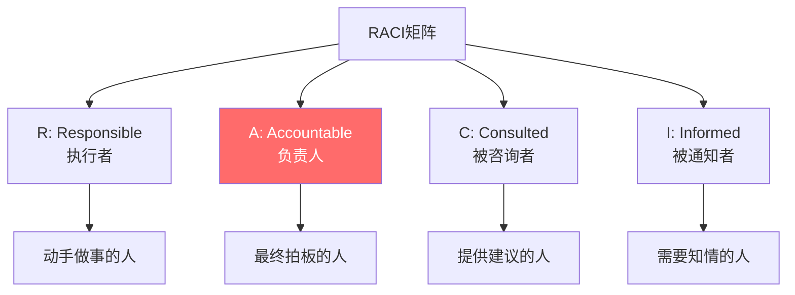
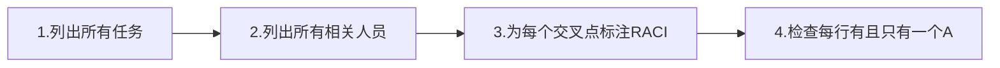
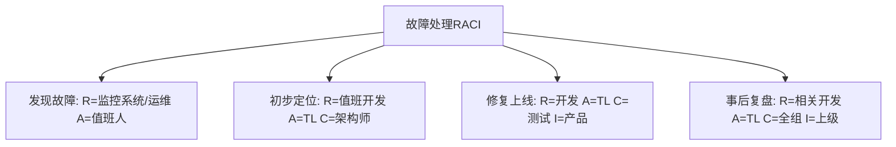
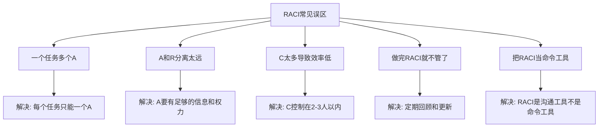
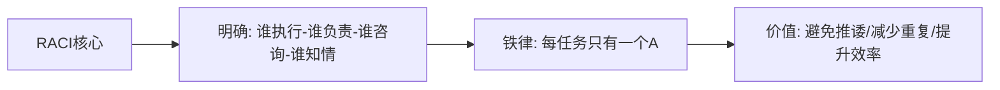
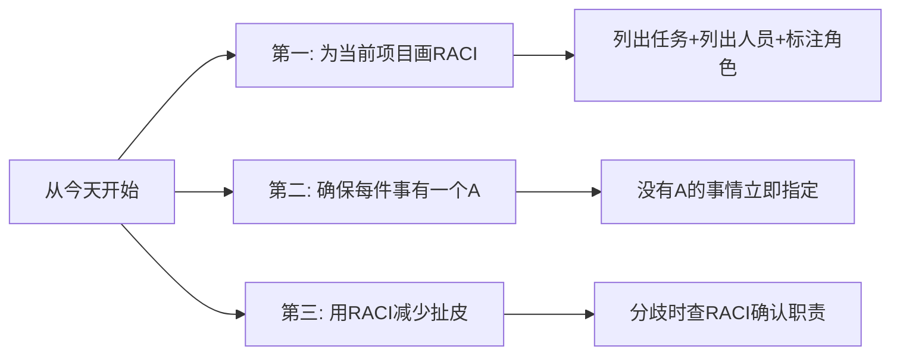

# 5.9 RACI责任矩阵法
#### 目录介绍
- [01.看一个真实案例](#01看一个真实案例)
  - [1.1 那次三方互相甩锅的客户投诉](#11-那次三方互相甩锅的客户投诉)
  - [1.2 一张矩阵表让所有人闭嘴](#12-一张矩阵表让所有人闭嘴)
- [02.RACI矩阵的背景](#02raci矩阵的背景)
  - [2.1 责任不清的困境](#21-责任不清的困境)
  - [2.2 RACI的起源](#22-raci的起源)
- [03.RACI四个角色](#03raci四个角色)
  - [3.1 R - Responsible 执行者](#31-r---responsible-执行者)
  - [3.2 A - Accountable 负责人](#32-a---accountable-负责人)
  - [3.3 C - Consulted 被咨询者](#33-c---consulted-被咨询者)
  - [3.4 I - Informed 被通知者](#34-i---informed-被通知者)
- [04.如何制定RACI](#04如何制定raci)
  - [4.1 制定的三个步骤](#41-制定的三个步骤)
  - [4.2 检查的两条铁律](#42-检查的两条铁律)
  - [4.3 注意事项](#43-注意事项)
- [05.RACI实际案例](#05raci实际案例)
  - [5.1 App新功能上线](#51-app新功能上线)
  - [5.2 线上故障处理](#52-线上故障处理)
- [06.RACI的常见误区](#06raci的常见误区)
  - [6.1 五个常见误区清单](#61-五个常见误区清单)
  - [6.2 我自己踩过的两个坑](#62-我自己踩过的两个坑)
- [07.总结回顾一下](#07总结回顾一下)
  - [7.1 一句话核心](#71-一句话核心)
  - [7.2 RACI给你的最大价值](#72-raci给你的最大价值)
- [08.后来发生的改变](#08后来发生的改变)
  - [8.1 当周：RACI 矩阵贴满白板](#81-当周raci-矩阵贴满白板)
  - [8.2 第一个月：扯皮事件清零](#82-第一个月扯皮事件清零)
  - [8.3 半年后：RACI 成了团队的协作语言](#83-半年后raci-成了团队的协作语言)
- [09.今天起改变三点](#09今天起改变三点)
  - [9.1 第一，为当前项目画RACI](#91-第一为当前项目画raci)
  - [9.2 第二，确保每件事有一个A](#92-第二确保每件事有一个a)
  - [9.3 第三，用RACI减少扯皮](#93-第三用raci减少扯皮)
- [10.课后作业思考下](#10课后作业思考下)
  - [10.1 个人实践类作业](#101-个人实践类作业)
  - [10.2 团队与思辨类作业](#102-团队与思辨类作业)

## 01.看一个真实案例

那是一个周一早上。10 点钟我刚到公司，老大就把我叫进会议室——客户投诉一个核心功能上线一周还没修好的 Bug，并且**已经投诉到 CEO 邮箱了**。

会议室里坐着我、产品经理 P、前端 F、后端 B、测试 T。老大问了一句话："这个 Bug 上周二就提了，怎么一周还没修？"

接下来的 20 分钟我永远忘不了——

- **P 说**："这事我上周二就转给后端了，B 说在排期"
- **B 说**："我以为这是前端问题，让 F 看"
- **F 说**："我看了不是前端问题，反馈给 P 让她确认是不是设计变更"
- **T 说**："我没收到任何 retest 通知"
- **P 说**："这事不是已经分给 B 了吗？"
- **B 说**："我说的是另一个 Bug……"

整个会议室像一团乱麻——**没有任何一个人觉得自己是"最终负责人"，但所有人都参与了**。老大听完，脸黑得像锅底。

老大没说话，从抽屉里抽出一张 A4 纸，画了一个矩阵：

> **横向：P / F / B / T / 我**
> **纵向：识别问题 / 定位问题 / 修复 / 测试 / 上线 / 通知客户**
> **每个格子填：R / A / C / I（执行者/负责人/被咨询者/被通知者）**

填完之后他指着矩阵说：

> "看这一列——**'修复'这一行没有 A**。这就是问题所在。**没有 A 就等于没有人最终负责，所有人都觉得别人在负责，结果没有人真的在负责**。"

然后他在"修复"行的"我"那一格写了一个大大的 **A**，又在"识别问题"行的"P"那一格写了 **A**。整张表 6 行，每一行有且只有一个 A。

他看着我说："**从今天起，但凡你的项目，先把 RACI 矩阵贴到白板上，然后再开工**。"

那个 Bug 我接过 A 之后，**当天下午 4 点就修好了**——不是因为技术多难，是之前根本没人觉得自己应该上手。下面这套救了我团队的 RACI 方法论，今天我完整讲给你。

## 02.RACI矩阵的背景

你有没有遇到过这样的情况：一件事情出了问题，你以为是A负责的，A以为是B负责的，B以为是你负责的——结果三个人都没做，问题暴露后互相甩锅。

又或者，一个任务三个人都在做，结果做出来三个不同的版本，浪费了大量时间和精力。

这些问题的根源只有一个：**责任不清。** RACI矩阵就是解决"谁来做什么"这个问题的工具。

RACI矩阵起源于项目管理领域，是一种用于明确项目任务中各角色职责的工具。它通过一张简单的矩阵表格，让每个人都清楚自己在每件事情上的角色是什么。

## 03.RACI四个角色

执行者是实际动手做事的人。一个任务可以有多个执行者。比如一个技术方案需要前端和后端各做一部分，那前端开发和后端开发都是R。

负责人是对任务结果最终负责的人，也是做最终决策和审批的人。**每个任务有且只能有一个A。** 这是RACI中最重要的规则——如果一件事有两个"最终负责人"，等于没有负责人。

被咨询者是在任务执行过程中需要被征询意见的人。注意C是双向沟通——你需要问他的意见，他也需要给你反馈。比如安全方案需要咨询安全团队的意见。

被通知者是需要被告知任务进展或结果的人，但不需要参与决策。I是单向沟通——你通知他即可，不需要等他的反馈。比如上线后通知相关的业务方。

| 角色 | 含义 | 数量限制 | 沟通方式 | 常见角色 |
|------|------|----------|----------|----------|
| R 执行者 | 动手做事 | 可以多个 | 主动执行 | 开发、设计、测试 |
| A 负责人 | 最终负责 | **只能一个** | 审批决策 | 项目经理、TL |
| C 被咨询者 | 提供建议 | 可以多个 | 双向沟通 | 架构师、安全团队 |
| I 被通知者 | 知情即可 | 可以多个 | 单向通知 | 上级、相关业务方 |

## 04.如何制定RACI

**第一步：纵轴列出所有任务。** 把项目或工作拆解为具体的任务列表。

**第二步：横轴列出所有相关人员/角色。** 包括项目中的所有参与者。

**第三步：在每个交叉点标注RACI。** 每个人在每个任务上的角色是R、A、C还是I。

**铁律一：每行有且只有一个A。** 如果某个任务没有A，说明没人对结果负责，必须指定一个。如果有多个A，必须精简到只有一个。

**铁律二：每行至少有一个R。** 没有R意味着没人执行，任务不可能完成。

- A和R可以是同一个人（负责人亲自执行）
- 不是每个人在每个任务上都需要有角色——可以留空
- C的人数不宜过多，否则沟通成本太高
- I的范围可以适当宽一些，信息透明有利于协作

## 05.RACI实际案例

| 任务 | 产品经理 | 前端开发 | 后端开发 | 测试 | TL | 运维 |
|------|---------|---------|---------|------|-----|------|
| 需求评审 | A/R | C | C | C | I | - |
| 技术方案设计 | C | R | R | - | A | C |
| 前端开发 | I | A/R | - | - | I | - |
| 后端开发 | I | - | A/R | - | I | - |
| 联调测试 | I | R | R | A/R | I | - |
| 上线部署 | I | R | R | C | A | R |
| 线上验收 | A/R | R | R | R | I | I |

## 06.RACI的常见误区

| 误区 | 表现 | 后果 | 正确做法 |
|------|------|------|----------|
| 多个A | 两个人都觉得自己最终负责 | 推诿或冲突 | 只留一个A |
| 没有A | 没人对结果负责 | 事情没人跟进 | 明确指定A |
| C太多 | 做什么事都要问一圈 | 决策效率极低 | C控制在2-3人 |
| 不更新 | 人员变动后RACI过时 | 新人不知道自己的角色 | 定期回顾 |
| 当命令 | 用RACI压人 | 引发抵触 | RACI是共识工具 |

除了表格里的通用误区，我自己亲身踩过两个大坑，特别提出来给你避雷：

- **A 给了不在场的领导**：曾经我把"上线决策"的 A 给了部门 Leader，结果 Leader 出差，整件事卡住三天。**A 必须给真正能在场拍板的人，不要给"光鲜的领导"**。
- **RACI 写完就锁进抽屉**：刚学的时候我画完矩阵就发邮件了，没人再翻。后来我把 RACI 矩阵直接打印 A3 贴在工位墙上、贴在会议室白板上，**让它"随时可见"**——效果立刻翻倍。

## 07.总结回顾一下

RACI矩阵是一个简单但极其有效的责任分配工具。它通过四个角色（执行者、负责人、被咨询者、被通知者）的明确分配，解决了"谁做什么"这个团队协作中最基础也最容易出问题的问题。

核心铁律：**每个任务有且只有一个A。** 这是避免推诿和冲突的关键。

我用 RACI 多年下来，发现它最大的价值不是"分配责任"，而是**它把所有"含糊"提前消灭在事情发生之前**：

1. **消灭"我以为"**——所有"我以为是 XX 在负责"的话，永远不会再出现
2. **消灭"无人负责"**——每件事都有且只有一个 A，没有任何空白地带
3. **消灭事后扯皮**——RACI 是事先约定的共识，事后任何争议直接查表

RACI不是一次性的文档，而是需要随着项目进展和人员变动定期更新的活文档。

## 08.后来发生的改变

回到开篇那次三方甩锅的会议。从老大那张矩阵纸开始，我做了下面这些改变。

我做的第一件事是把那张 A4 纸放大成 A3，**直接贴到了我们项目组的白板上**。同时给当时手上 4 个项目都画了 RACI——耗时一上午，但效果立竿见影。

最让人意外的是——画 RACI 的过程中我自己就发现了 7 个"无 A 任务"。这 7 个任务全部是过去几个月反复出问题的地方。**这印证了一句话：所有反复扯皮的事情，背后必定是 RACI 缺失**。

一个月后我做了个统计——**项目组的"互相甩锅"事件从月均 8 次降到 0 次**。当然不是说大家都不再有分歧，但只要有人提出"这是谁负责"，就有人指着白板上的 RACI 说"看图"，所有讨论 30 秒结束。

更深的改变是——**我自己再也没有"早上不知道今天该干什么"的迷茫**了。每天看一眼 RACI 矩阵，所有标 A/R 的任务都是我必须推进的，一目了然。

半年后我升任 12 人小组的 Leader。我做的第一件事就是把 RACI 作为团队协作的"基础语言"：

- **所有新项目启动会的第一项议题**：画 RACI 矩阵
- **所有跨部门合作的对齐会**：先确认 RACI，再讨论方案
- **所有人员变动**：当周必须更新所有相关 RACI

效果非常明显：

- **跨部门项目交付按时率从 60% 提升到 92%**
- **新人 onboarding 时间从 2 周缩短到 5 天**——RACI 让新人 5 分钟内就明白自己该做什么
- **我个人的"救火时间"从每天 3 小时降到 30 分钟以内**——因为没人再因为责任不清来问我

如果你的团队也常常陷入"互相甩锅"或"无人负责"的窘境，下面这三点是你今天就能开始做的事。

## 09.今天起改变三点

为你当前正在进行的项目画一个RACI矩阵。列出核心任务，列出参与人员，在每个交叉点标注R/A/C/I。画完后和团队成员确认，确保大家对自己的角色理解一致。**强烈建议把矩阵打印出来贴在工位墙上或团队白板上**，让它"随时可见"。

检查你的团队中有没有"没有A的任务"。那些经常出问题、经常扯皮的事情，往往就是没有明确A的任务。今天就把它们的A指定清楚。我自己第一次画 RACI 就发现了 7 个无 A 任务——这正是我们组反复扯皮的根源。

下次遇到"这件事谁负责"的争议时，拿出RACI矩阵来确认。RACI是事先达成的共识，用它来解决争议比现场讨论高效得多。如果RACI没有覆盖到这件事，那就补上。**记住：RACI 是协作工具，不是命令工具，使用时要用"咱们当时约定 A 是 XX"的语气，而不是"这是你的责任你必须做"**。

## 10.课后作业思考下

1. 为你当前负责的项目或工作模块制定一个RACI矩阵，检查是否每个任务都有且只有一个A。
2. 回忆一次团队中"互相甩锅"或"重复劳动"的经历，分析当时如果有RACI矩阵，是否能避免这个问题。

3. 思考RACI和PDCA的关系：在PDCA的Plan环节中，RACI扮演什么角色？
4. 如果你是一个5人小团队的Leader，设计一个涵盖需求评审、技术方案、开发、测试、上线全流程的RACI矩阵模板，让团队可以复用。

