# 6.7公众演讲的提升
#### 目录介绍
- [01.话筒掉地上的500人会场](#01话筒掉地上的500人会场)
- [02.演讲的基本问题](#02演讲的基本问题)
- [03.演讲目的与方式](#03演讲目的与方式)
- [04.演讲内容的准备](#04演讲内容的准备)
- [05.收集资料与大纲](#05收集资料与大纲)
- [06.演讲的技巧训练](#06演讲的技巧训练)
- [07.演讲的开场白](#07演讲的开场白)
- [08.开场的多种方式](#08开场的多种方式)
- [09.讲稿的准备使用](#09讲稿的准备使用)
- [10.大量练习与反馈](#10大量练习与反馈)
- [11.演讲的结尾收束](#11演讲的结尾收束)
- [12.总结回顾这一节](#12总结回顾这一节)
- [13.后来发生的改变](#13后来发生的改变)
- [14.今天起改变三点](#14今天起改变三点)
- [15.课后作业思考下](#15课后作业思考下)

## 01.话筒掉地上的500人会场

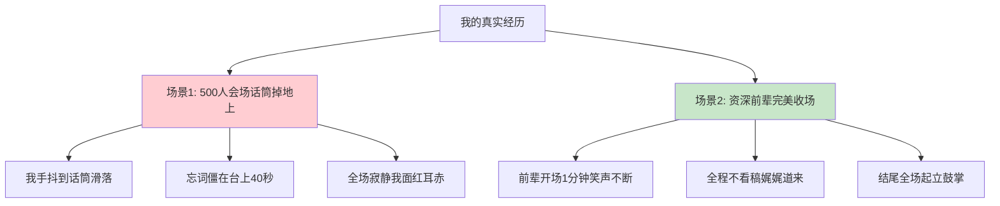

去年公司年度技术大会，我被指定做一个 20 分钟分享。听众 500 多人。

那是我第一次在这种规模的场合演讲。上台前在后台我反复背稿，自以为准备充分。一上台看到台下 500 双眼睛盯着我，我大脑突然一片空白。手抖得厉害，话筒"啪"地掉到地上。我弯腰捡起来，想接着讲，**结果忘词，僵在台上整整 40 秒**。

那 40 秒比 40 分钟还长。我能听见台下窃窃私语的声音，能看见前排同事尴尬的眼神。我硬着头皮把后面的内容像背课文一样念完，下台时衬衫已经全湿透了。

我下台后，下一位是公司的一位资深技术总监。他上台后开场用了一个段子——"刚才小同学手抖，我手不抖，但我心抖"——全场大笑，气氛瞬间松弛。

接下来 30 分钟，他全程不看稿、自然走动、目光扫视全场，**结尾时全场起立鼓掌长达 30 秒**。

我躲在后台看完全程，第一次明白：演讲不是"上去把话讲完"，而是"上去把人抓住"。下面这一篇，是我从那次崩溃后认真补课的全部心得。

## 02.演讲的基本问题

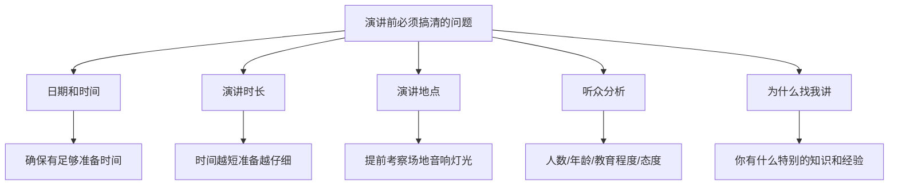

一位演讲家曾说过：如果你要我说五分钟，那我需要两星期的时间准备；如果你要我说一小时，那我需要一星期的时间准备；如果你不在意我要说多久，那我现在就可以开始。

**演讲的日期和时间**：确定你有足够的准备时间，不只是准备书面材料，还要准备视觉辅助工具和练习演讲。

**演讲的时间要多长**：演讲的时间越短，就越要仔细地准备。30分钟的演讲比2小时的更难准备——因为你需要在极有限的时间内把最核心的内容讲清楚。

**演讲的地点**：演讲前先去看看场地，确定演讲厅的类型和大小、是否为阶梯式座位、音响效果、灯光等状况。场地的大小决定了你的声音和肢体语言的幅度。

**谁会来听演讲**：人数、年龄、性别、教育程度、对演讲主题的了解程度、来听演讲的原因和态度。

**为什么要找我讲**：你有什么特别的知识？听众对你会有何期望？了解这些有助于你调整内容的深度和风格。如果公司请你以新员工的身份分享印象，那没有人会期望你表现得像个有三十年工作经验的总经理。

| 分析维度 | 需要了解的信息 | 影响演讲的方面 |
|----------|----------------|----------------|
| 人数规模 | 20人/200人/2000人 | 互动方式和肢体语言幅度 |
| 专业程度 | 外行/入门/专家 | 内容深度和术语使用 |
| 参会目的 | 学习/社交/评估 | 内容侧重和互动设计 |
| 对你的期望 | 分享经验/传授方法/启发思考 | 演讲风格和案例选择 |

## 03.演讲目的与方式

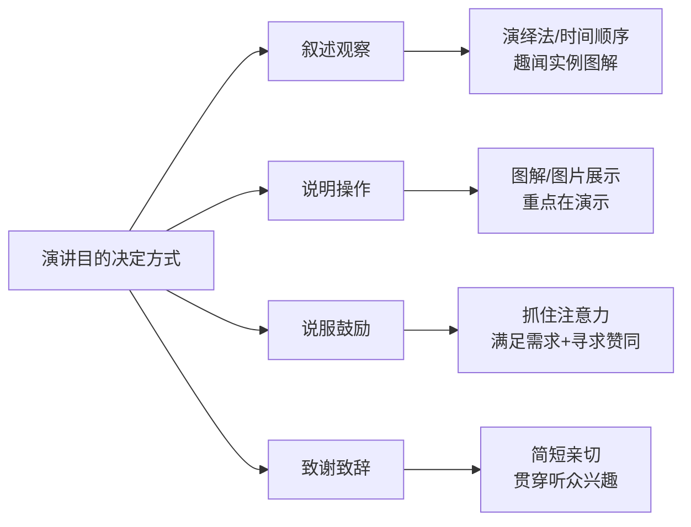

演讲的目的决定演讲的方式。不同的目的需要截然不同的准备策略：

**叙述观察结果**：了解听众对主题的了解程度，采用恰当的语言，插入趣闻轶事、实例、图解等，使演讲内容更生动有趣。采用演绎法或按照时间顺序组织，选词用字要精确。

**说明操作方法**：重点放在展示上，就是用图解、图片的方式。让听众能够"看到"而不只是"听到"你在讲什么。

**说服或鼓励**：抓住听众的注意力，找出听众的需求与兴趣，证明你能够满足这些需求，寻求观众的反应或赞同。

**致谢或致辞**：简短，控制笑点的量或引用别人的笑话也很有用。把演讲的内容与听众的兴趣及当时的场合贯穿起来，要既亲切又特别。

## 04.演讲内容的准备

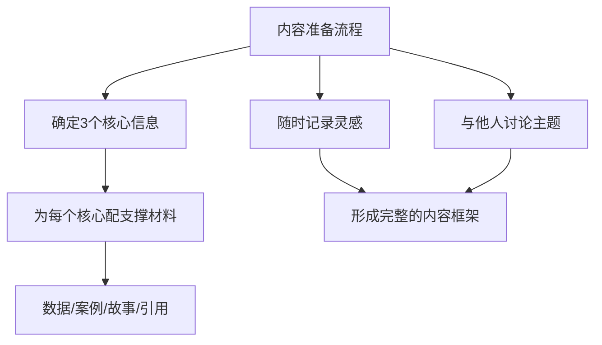

花时间搜集和组织你的想法。先列出你想传达的3个核心信息，围绕这3个核心点展开内容组织。为什么是3个？因为心理学研究表明，听众最多能记住3-4个要点——超过这个数量，记忆效果会急剧下降。

有空的时候就想想演讲内容，比如上班的路上。与同事和朋友讨论该主题，不同的视角能帮你发现自己的盲区。随身带本笔记或用手机备忘录，随时记下临时产生的想法。

每一个核心信息都要有支撑材料：数据让观点有说服力，案例让观点有画面感，故事让观点有共鸣感，引用让观点有权威感。一个核心信息配1-2个有力的支撑材料就够了，不贪多。

**凡事归纳在三条以内，直奔主题、直奔结果。** 这就是在商界流传甚广的"30秒电梯理论"。它来源于麦肯锡公司的一次沉痛教训：在给一家大客户做完咨询项目后，项目负责人在电梯间遇到了对方的董事长，董事长问他"能不能说一下现在的结果"——由于没有准备，他无法在电梯从30层到1层的30秒内把结果说清楚，最终麦肯锡失去了这个重要客户。

从此，麦肯锡要求员工凡事要在最短的时间内把结果表达清楚。**心理学研究也表明，一般情况下人们最多记得住一二三，记不住四五六**，所以核心观点要控制在3条以内。

**第一，好的开头要抓住问题根本。** 不要铺垫太久，用最简洁的话切入主题。**第二，观点提炼要响亮紧凑。** 一挥而切中肯綮，一语而击中要害——观点不超过三条。**第三，结尾要回扣核心。** 用一句有力的总结句让听众带走你最想传达的信息。

## 05.收集资料与大纲

只要时间允许，尽量多阅读。不要只搜集演讲时会用到的信息，也不要只搜集跟主题有关的信息。在网络上找到的资料，一定要确认其正确性。

建立一个资料文件夹，按照主题分类存放搜集到的材料。注意收集与听众直接相关的数据和案例，这样更容易引起共鸣。好的素材来源包括：专业书籍、行业报告、TED演讲、新闻事件和个人经历。

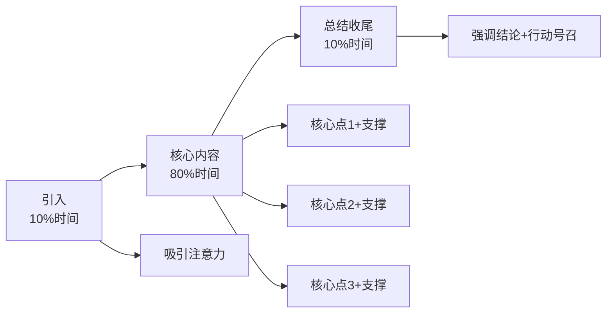

不管你如何制作大纲，都应该合逻辑、有组织。大纲的基本结构：引入（10%时间）→核心内容（80%时间）→总结收尾（10%时间）。

每个核心要点之间要有自然的过渡和衔接，避免突兀的跳转。可以把每个重点和其发展思路写在一张卡片上，看看什么样的顺序最合适。最后，照顾好开头和结尾的部分，中间的部分就会自动出现。

## 06.演讲的技巧训练

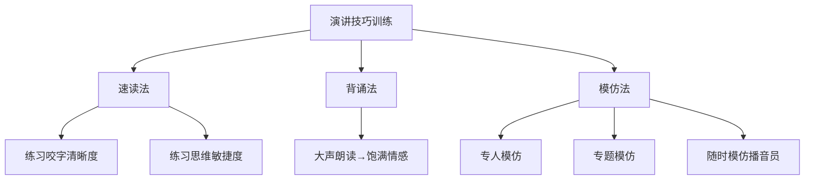

找一篇演讲稿，读的过程中不要有停顿，发音要准确，吐字要清晰，要尽量达到发声完整。速读法不仅训练口齿清晰度，还训练大脑在高速输出状态下的思维连贯性。

先把文章背下来，在背的基础上大声朗读，最后用饱满的情感、准确的语言、语调进行背诵。背诵的目的不是为了在演讲时照搬，而是让那些精妙的表达方式内化为你自己的语言习惯。

**专人模仿**：选择一个口语表达能力强的人，录下录音进行模仿。注意模仿他的节奏、停顿、重音和语调变化。

**专题模仿**：一个人讲一个故事，大家轮流模仿，看谁最像。这种方式特别适合小组练习。

**随时模仿**：跟着播音员、演播员、演员进行模仿，注意他的声音、语调、神态、动作，边听边模仿，边看边模仿。天长日久，你的口语能力就得到了提高，而且会增加你的词汇，增长你的文学知识。

## 07.演讲的开场白

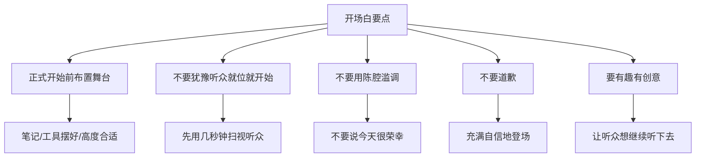

记住，演讲一开始，你的"表演"就开始了。因此正式开始前，先安排下你的舞台。花点时间把你的笔记和视觉辅助工具等摆好，方便之后使用。

**不要犹豫**：听众就位后就开始。但是先用几秒钟的时间浏览一下台下听众，让他们也打量一下你。

**不要用陈腔滥调开场**：像是"今天很荣幸"。也许你想谢谢听众，但是可以晚一点说，甚至放在结尾。

**不要道歉**：也许你觉得自己的知识、主题、能力不行，但是只要你充满自信地登场，听众也会对你有信心，而这份自信来自你周全的准备。

**开场白必须有趣、有创意**：让听众想继续听你之后要说的内容。不要太早引入高潮。记住，这只是开场白，内容不要太长，跟整个演讲的长度比例适当。

## 08.开场的多种方式

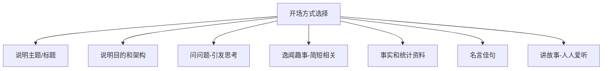

不同的场合适合不同的开场方式：

| 开场方式 | 适用场合 | 示例 | 难度 |
|----------|----------|------|------|
| 说明主题 | 正式场合 | "今天我要分享的是XX" | 低 |
| 问问题 | 任何场合 | "大家有没有遇到过这样的情况？" | 中 |
| 讲故事 | 任何场合 | "去年有一次，我遇到了一个棘手的问题……" | 中 |
| 统计数据 | 专业场合 | "根据最新数据，XX的比例高达XX%" | 中 |
| 逸闻趣事 | 非正式场合 | 简短、相关、跟你切身相关 | 高 |
| 名言佳句 | 任何场合 | 引用经典语句引出主题 | 低 |

每个人都喜欢听故事，但是你的故事要选得好、讲得好。问问题也是非常好用的开场方式——一个好问题能瞬间抓住听众的注意力，让他们从"被动听"变成"主动思考"。

## 09.讲稿的准备使用

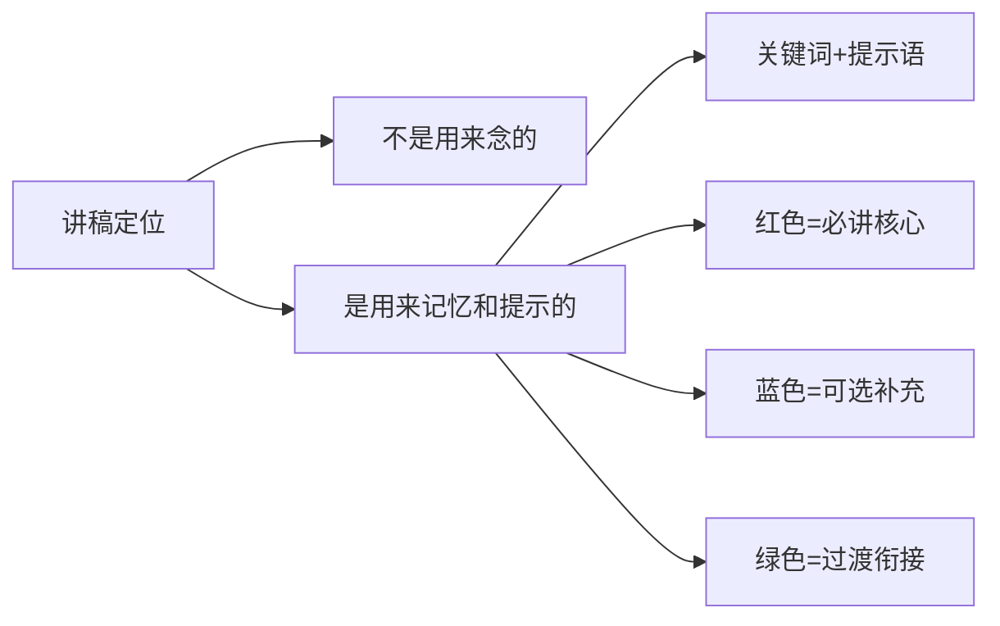

人的记忆会出错，有了讲稿就不会有遗漏的地方，在讲稿上还可以发展出复杂的论点，有了讲稿就不会搞错顺序。

**讲稿不是用来念的，而是用来记忆和提示的。** 一份好的讲稿应该包含关键词和提示语，而不是一字不差的原文。如果你对自己的演讲内容非常熟悉，在卡片或白纸上按顺序写下重点、主要的论点和例子，这是最好的做法。

建议在讲稿中用不同颜色标注：红色表示必须讲的核心要点，蓝色表示可选的补充材料，绿色表示过渡衔接的话术。这样在演讲时一目了然，即使紧张也不会遗漏核心内容。

## 10.大量练习与反馈

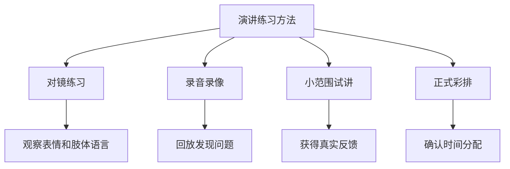

充分的准备、大量的练习是好演讲的根基。建议至少练习3次以上：

- **第一次**：重点关注内容完整性——有没有遗漏？逻辑通不通？
- **第二次**：关注时间分配——每部分花了多长时间？总时长是否合适？
- **第三次**：关注语气和互动——表达是否自然？有没有口头禅？

如果可能，找2-3个朋友做模拟听众，让他们提出问题和反馈。这比自己对着墙练习效果好得多。真实的听众会让你提前适应"被注视"的感觉，他们的反馈也能帮你发现自己注意不到的问题。

还有一种更简单的方式：用手机架好录像，自己面对镜头讲一遍，然后回放观看。第一次看自己的表现通常会很崩溃——因为自我感觉和实际表现之间往往差距巨大。但挺过这一关，你的演讲水平就会有显著提高。

## 11.演讲的结尾收束

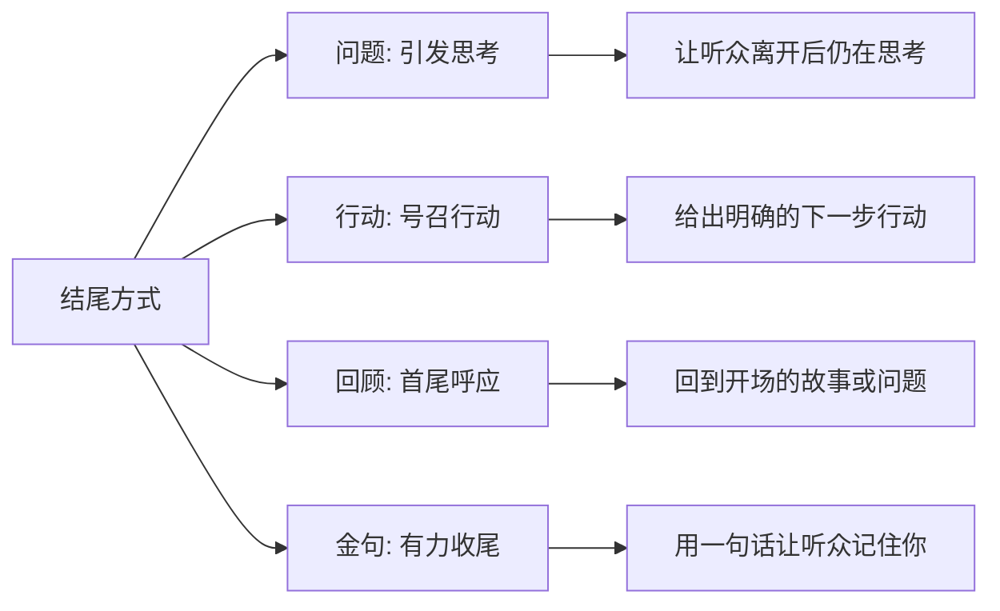

用一个有力的总结结束。如果你突然想到新的东西，务必克制冲动。不要重复，不要看着演讲稿念结尾词。把结尾词背下来，这样你就可以在达到结尾高潮时看着观众。

**问题**：提出一个发人深省的问题，让听众在离开后仍然会思考你的演讲内容。

**行动号召**：你希望大家现在就采取行动，不要等到以后。给出一个明确的、可执行的下一步行动。

**回顾呼应**：回到开场时提到的故事或问题，形成首尾呼应，给听众一种完整感。

**金句收尾**：用一句有力的总结句结束，让听众记住你的核心信息。好的金句应该简短、有力、容易记忆。

## 12.总结回顾这一节

**演讲是后天习得的技巧，公式 = 听众分析 + 3 个核心点 + 抓人的开场 + 多图少字的提词器 + 反复练习 + 有力收尾。**

1. **3 不超原则**：核心观点不超过 3 条，听众最多记 3-4 点。
2. **演讲者是主角**：PPT 是配角不是讲话稿，多图少字。
3. **5 分钟魔咒**：背下开场前 5 分钟，过了就会越讲越自如。

## 13.后来发生的改变

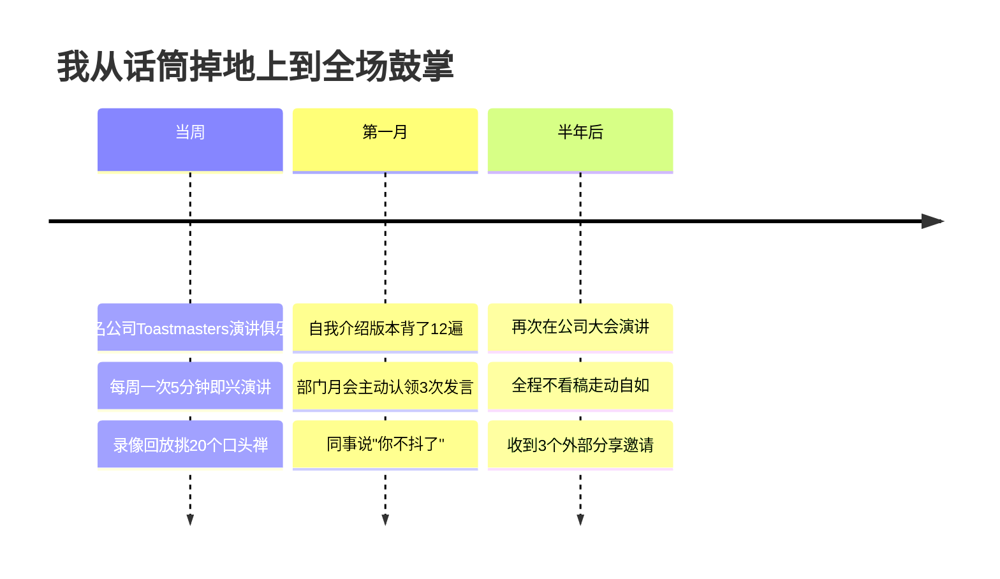

那次崩溃后第二天我就报名了公司内部的 Toastmasters 演讲俱乐部，每周一次的 5 分钟即兴演讲训练。第一次去我又紧张到说话颤抖，但好在每次都录像，回放看自己——一周内挑出来 20 多个"嗯"、"对"、"那个"等口头禅。

我把"5 分钟开场必背"这个原则用到极致——一份 1 分 30 秒的自我介绍我背了 12 遍，背到能在任何状态下倒着说出来。同时主动在部门月会上认领 3 次发言机会，强迫自己上场。一个月后同事悄悄说："你最近讲话不抖了，气场都不一样了。"

半年后，公司大会再次邀请我做技术分享。这次我准备了 3 周——3 个核心点、12 张多图少字的 PPT、试讲 8 遍、录像 5 次。**上台时我能笑着扫视全场，结尾时全场鼓掌持续了 10 秒。** 散场后有 3 家外部公司联系我去做技术分享。**那个曾经话筒掉地上的人，现在成了别人请的演讲嘉宾。**

## 14.今天起改变三点

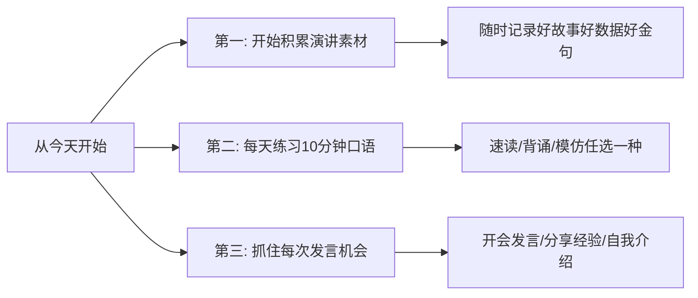

在手机备忘录中建一个"演讲素材"文件夹，随时记录你看到的好故事、好数据、好金句。当你需要做演讲时，打开这个文件夹就有现成的素材可用。

速读法、背诵法、模仿法任选一种，坚持练习。演讲是后天习得的技巧，每个人都有能力习得这份技巧。所有伟大的演讲家最初都是最差劲的演讲者，技巧和自信来自努力和练习。

开会时主动发言、部门分享时主动报名、聚会时主动做自我介绍——这些都是低风险的演讲训练场。不要等到站在大舞台上才开始练，从小场景开始积累经验和信心。

## 15.课后作业思考下

1. 选一个TED演讲（15分钟左右），分析它的开场方式、内容结构和结尾方式，看看和本章讲的方法有哪些对应。
2. 用手机录一段2分钟的自我介绍，然后回放看看——你的表情自然吗？有口头禅吗？语速合适吗？

1. 如果下周让你做一场10分钟的分享，你会选择什么主题？用本章的方法写出大纲：引入（1分钟）→ 3个核心点（各2.5分钟）→ 总结（1.5分钟）。
2. 开始你的"演讲素材库"：本周收集3个好故事、3个有冲击力的数据、3句好金句，分类记录下来。

