# 6.8做好技术的演讲
#### 目录介绍
- [01.我讲了40分钟原理](#01我讲了40分钟原理)
- [02.看一些案例数据](#02看一些案例数据)
- [03.技术类分享模版](#03技术类分享模版)
- [04.幻灯片设计原则](#04幻灯片设计原则)
- [05.可以训练到熟练](#05可以训练到熟练)
- [06.避免紧张和焦虑](#06避免紧张和焦虑)
- [07.如何去讲好故事](#07如何去讲好故事)
- [08.突出地展示观点](#08突出地展示观点)
- [09.肢体语言的管控](#09肢体语言的管控)
- [10.做一场漂亮演讲](#10做一场漂亮演讲)
- [11.总结讲演的要点](#11总结讲演的要点)
- [12.总结回顾这一节](#12总结回顾这一节)
- [13.后来发生的改变](#13后来发生的改变)
- [14.今天起改变三点](#14今天起改变三点)
- [15.课后作业思考下](#15课后作业思考下)

## 01.我讲了40分钟原理

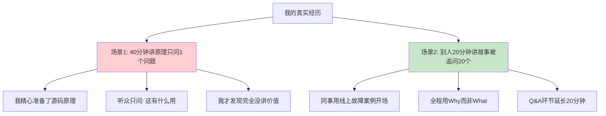

去年组里举办技术分享会，我准备讲一个开源框架的源码解析。我花了两周时间整理：底层原理、数据结构、调度算法、源码注释……做了 35 页 PPT。

分享当天我讲了整整 40 分钟，自我感觉非常硬核。结果 Q&A 环节，第一个举手的同事问：**"你讲的这些原理，对我们日常业务有什么用？"**

我愣了一下，磕磕巴巴答："这个……能帮你理解底层机制……" 同事不再追问，全场没人再有问题。**40 分钟的精心准备，换来一句"有什么用"和满场沉默。**

下一位是组里的另一位同事，他讲了 20 分钟。开场就讲一个故事：**"上周三凌晨 3 点，线上接口超时报警把我从被窝里拽起来——我们今天的主题，就是这次故障背后的那个坑。"**

全场瞬间安静——所有人想知道后来怎么了。他用"问题→排查→方案→踩坑→最佳实践"的结构讲完，**Q&A 环节被追问了 20 多个问题，整整延长了 20 分钟才结束。**

那次之后我才彻底想通：**技术演讲不是在炫技，而是在回答"听众回去后能用上什么"**。听众想要的不是 What（你做了什么），而是 So What（这对我有什么用）。下面这一篇，是我后来彻底重做技术分享的方法论。

## 02.看一些案例数据

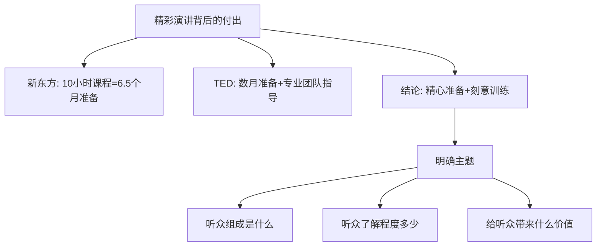

新东方老师授课以妙趣横生、言语幽默、段子丰富著称，于欢乐之中就让你记住了很多单词和用法。

而这些看似信手拈来的讲课背后的付出是：每 10 个小时的课程，需要撰写逐字稿和练习的时间长达 6 个半月；

TED 演讲者通常提前数个月开始准备，TED 会安排专业的团队进行指导和排练。哪怕有时候演讲经验丰富，也需要做很多的投入和准备！

不难看出，唯有精心准备 + 刻意训练方能成就精彩演讲。在谈演讲之前，先来说一下沟通。沟通的本质是让对方轻松地弄明白他原来并不知道的东西，更进一步，让对方通过自己已经懂的知识理解他原来并不懂的东西。

演讲最重要的就是主题，所以首当其冲，你需要明确自己的主题。这里面涉及到你与出品人的沟通，以及你对大会的了解。

比如，听众的组成是什么样的？参会者对这个领域的了解程度？听众们想听什么？最关键的是通过本次演讲，给听众带来什么价值？

在当前这个瞬息万变的时代里，如何快速有效地提升自己，对每个人来说变得越来越重要。

我们强调更多的是学习和思考，古语也说: 学而不思则罔，思而不学则殆。而现在，还有一种更为行之有效的方法，那就是：分享。

因为只有不断分享自己的知识和经验，才能够更多地和别人交流，获得更多反馈。这样就可以把提升自己这场战役从单打独斗变成团队作战，效率更高，效果更好。

## 03.技术类分享模版

在明确了主题之后，就需要设定好演讲的主线，对于技术类的分享，有一个相对固定的模式：

1. Who: 自我介绍，让听众了解自己，建立连接； 
2. What&When: 今天要分享的主题，通过简短介绍吸引听众的注意力、好奇心； 
3. Why: 为什么要做这个架构改造、技术升级，整个项目的背景是什么样的，结合对听众的了解，做特定的介绍； 
4. How: 深入浅出 3~4 个最核心的内容点，当然为了全面性，你可以都罗列出来，但介绍的重点建议控制在 3~4 项； 
5. Future: 让大家了解你未来的计划，你对技术趋势的看法等等； 
6. Recap: 对今天的主题再做一个回顾，让听众加深对核心内容记忆。

你可能会觉得，往往项目做完了，信息比较零散，一下要总结得这么有条理和全面很难，包括哪些是最值得分享的内容也不是马上就能全部列出来。

这里分享一个我自己的心得，我习惯写wiki，任何时候自己想到值得分享的内容都丢进去，包括收集到的数据、文档、代码片段等等。

当你的内容越来越丰富的时候，你就可以开始梳理这些case，一方面整理自己的思路，调整主线，另一方面看如何把这些case分布到主线的每一个环节，或者舍去。

对于初次演讲，或者特别重要的演讲场合，如果你想让演讲效果更好、避免紧张一时不知如何表达，逐字稿会给你带来巨大的帮助。

逐字稿能非常好地帮你组织语言，人的大脑非常不擅长做大量信息的前后逻辑处理，但文字和图表能非常高效地帮助你梳理逻辑关系。

使用逐字稿，要避免照本宣科，脑子里不停地回忆逐字稿下一句是什么，而是应该充分理解逐字稿的逻辑。

在演讲时，之前训练过程中脑子里不断预热过的关键词会按这个逻辑很流畅地释放出来，你会逐渐找到感觉，跟随这个感觉变得更投入，最后还能根据实际情况做临场发挥，越来越放松和自如。

## 04.幻灯片设计原则

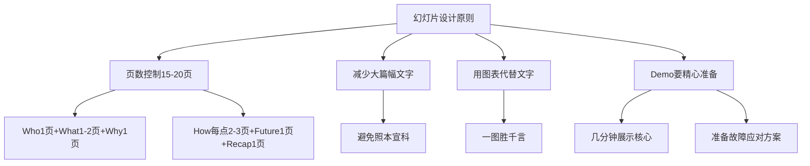

多少页幻灯片合适？ 还是回到前面我们说的模式：

1. Who: 1 页 
2. What&When: 1~2 页 
3. Why: 1 页 
4. How: 展开 3~4 点，每点 2~3 页 
5. Future: 1 页 
6. Recap: 1 页

基本控制在 15~20 页的范畴，当然可以根据实际需要再增加，比如为了增加数据对比展示等。

对于技术分享，不太建议大量采用交互式的幻灯片，每句话一张幻灯片，频繁上下文切换，容易让听众分心。

而很多复杂的技术逻辑很难在精炼到每页一句话的同时又能让听众容易理解，这样会导致听众无法跟上你的节奏。

对于幻灯片的内容，建议减少大篇幅的文字，用最精简的文字加上图表来展示，不仅使得幻灯片清晰明了，也不会让听众觉得照本宣科。

可能大家也会注意到，平时听语音信息的速度比你看文字的速度要慢很多，而阅读文字又比从一个图获取信息要低效。

尤其在技术分享中涉及复杂逻辑和架构时，更需要注重图表来提高沟通效率，往往能达到一图胜千言的效果。

技术分享的另一个特点就是经常用到 Demo。Demo 看起来很简单，但要做好却不容易：

如何在有限的几分钟里面充分展示技术特点和产品特点？多个环节、场景如何串联，上下文如何切换更自然？如何避免 Demo 失败？万一失败了怎么处理？

## 05.可以训练到熟练

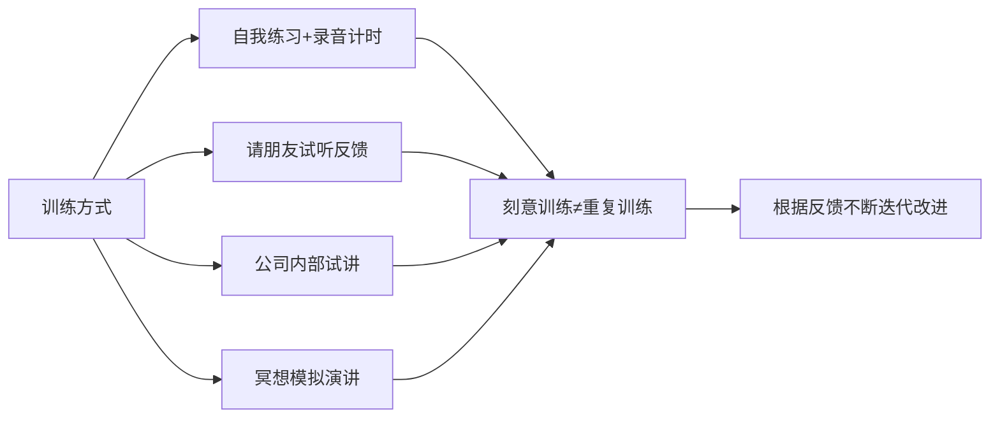

找安静的地方，自我练习。可以用手机录音、计时。通过录音方便自己纠正口头禅，比如"嗯""对"等等。

请信任的朋友来试听。有时候对于自己太熟悉的内容，虽然自己会觉得非常容易，但很可能朋友却不甚了解，或者对于整个项目自己太习以为常，于是跳过了必要的背景介绍，这样就容易和听众之间产生隔阂，所以要结合自己对听众的了解进行调整。

公司内部试讲。如果能有机会在公司或者社区小范围的进行试讲，也是非常有帮助的，可以提前让自己适应在一定数量的听众面前演讲。

冥想。这是我比较喜欢的方式之一，睡觉前在脑海里默默地翻幻灯片，想象真实的演讲场景，自己会怎么讲，Demo 流程是否完善，重点内容是否都讲到位了，做到成竹在胸。

刻意训练不等于重复训练，两者最大的差别在于是否根据反馈不断进行迭代改进。

## 06.避免紧张和焦虑

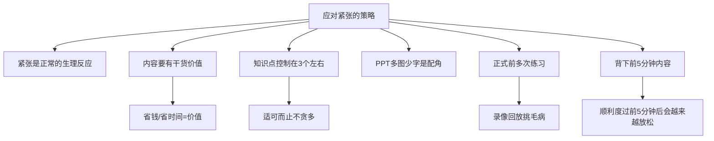

首先，我们要接受这样的现实，每个人在面对众多双眼睛的时候，都会有情绪上的波动，这可是从老祖宗那里遗传下来的。

试想一下，在远古时代，如果一个人被无数双眼睛盯着的时候，会是什么情况呢? 估计是遇到了兽群，这种情况下怎么可能还保持淡定呢？

所以，有紧张情绪并不可怕，很多擅长演讲的人，并不是没有紧张情绪，而是他们有比较好的方法来应对这样的情绪。

演讲是否能够得到听众的认可，很大程度上在于它是否对大家有价值，也就是所谓的"干货"。

价值一般来说体现在两个方面，一是钱，二是时间。曾经有一位前辈和我说过关于产品价值的观点，在这里也套用到演讲上。

如果听众听了我们的演讲，回去实施一些措施，能够省钱，那么基本上我们可以得到不错的评价。如果能够节省时间，那么也一样。

如果既能省钱，又能省时间，那么就体现了非常大的价值，优良的评价应该很容易获得。而终极目标是，演讲中的内容可以帮大家赚钱，那就更是超出了大家的期望。

很多时候，演讲者会把很多很多内容都塞在一场演讲里面，期望把自己多年所积累的所有经验一下子都讲给大家听。

这种分享精神非常赞，但我们要考虑，演讲一般来说只有短短的四十五分钟，这么短的时间里面，怎么可能讲太多内容呢? 那样的效果只能是每个点都点到为止，大家也不会有太多收获。

在做演讲的时候，知识点建议控制在三点左右，这样不仅更容易让听众记住，而且自己讲的时候也比较简单，不用担心到时候忘词。可以先引入话题，提出观点，然后用几个故事或者知识点来支撑这个观点，最后做一下总结。

PPT 现在已经是演讲中不可缺少的一部分，它能让我们更好地呈现想要讲述的内容。有些人在演讲的时候，会在 PPT 上面堆积大量的文字信息，然后演讲就变成了读 PPT 。

那么 PPT 到底要做成什么样子呢? 我的建议是——多图少字。要知道演讲者才是主角，PPT 只是配角。

一方面演讲者不需要让自己的演讲和 PPT 上的文字一一对应，可以有更多自由发挥的空间，还可以根据听众的反应来做出更合适的调整。

另一方面，即便有时候讲的和最初计划的有些差别，也不用担心被听众发现，因为没有 PPT 这个奸细，谁都不会知道我们原来想讲的是什么，自然也就降低了紧张的可能性。

在正式演讲之前，应该尽可能多多练习。不仅要自己练习，而且至少要在公司内部或者在小伙伴面前和大家讲几次。很多时候，不讲几次，不得到其他人的反馈，光靠自己空想是不知道从哪里改进的。

其实还有一种更简单的方式: 找个小黑屋，架上摄像机 (用手机也可以达到同样的效果)，自己面对着摄像机讲一次，然后自己悄悄找个地方观摩一下自己的表现，给自己挑挑毛病。

一般来说，第一次看自己在摄像机里面的表现，我们都会很崩溃，因为会看到其中的自己和想象中的形象有很大差别。如果能够挺过这一关，我们的演讲水平就会有不小的提高。

因为用这样的方式，我们会注意到很多不自觉出现的习惯，像挠头、摸鼻子等小动作，还有平时不注意的口头禅等等，如果能够稍微注意一下，再加上必要的练习，就可以提升演讲的质量了。

有些演讲者害怕因为紧张而忘词，就采取了背稿的方式。不过真的不建议把所有内容都背下来，那样的话负担很大，而且一旦忘了一点，就会陷入"紧张 - 忘词 - 更加紧张"的恶性循环之中。

那么要背多少呢? 我一般只会背下最前面五分钟的内容，其中可能会包括：自我介绍——这里最好能找到一种比较风趣的方式来介绍自己，让自己和听众拉近关系，也放松下来；演讲的题目——这个一定是不能忘掉的；演讲的内容简介——前面讲到了内容最好控制在三点左右，每一点一句话描述就好，这样也有利于自己在后面的演讲里面始终记着要讲的内容。

在上台的最初五分钟是最紧张的，如果可以顺利度过，那么后面就很容易把紧张感转化成兴奋感，后面也就不会有太大的问题了。

## 07.如何去讲好故事

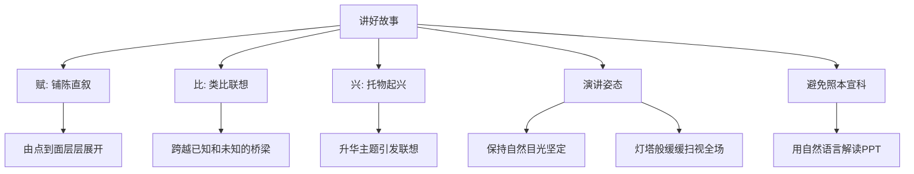

在这个时代，说话变得如此重要，如果你能够在公众面前当众演讲，并且感染现场的听众，进而把内容和情绪通过互联网传播出去，那就是一个相当了不起的技能。

技术人常常说，我写好代码做好技术不就行了，讲什么讲。技术固然重要，是安身立命之本，但是，如果能够通过演讲和写作的方式把好的技术和产品传播出去，不仅可以帮助别人，还可以收获个人影响力，并传播好的技术产品。

用生硬的道理去告诉一个人怎么做，远不如通过生动有趣的故事或类比的案例效果好，人们在听故事的时候更容易产生共情作用，也更容易理解你想要表达的信息。

演讲并不是纯粹的讲故事，尤其是技术演讲，那就成故事会了。演讲介于讲故事和报告之间。报告更倾向于精确的信息和枯燥的细节、事实和图表，汇报的时候用这种方式会比较好，公开演讲则更适合讲故事的方式。

讲故事的典型方式就是营造氛围，提出问题，分析问题，最后给出自己的解决方案。伟大的演讲与电影剧本常常很类似：

1.清晰的开始、过程和结尾；2.具备有章可循的结构；3.通过某个情节来吸引听众的注意力，起承转合；4.开始和结束比中间部分短。

有了讲故事的结构，用什么方式把这个故事讲好呢？其实很简单，古人不都说了嘛，赋比兴。那么什么是赋比兴呢？

赋就是铺陈直叙，即是人把思想感情事物细节平铺直叙地表达出来。淋漓尽致地细腻铺写，或渲染气氛和情绪。在做技术演讲的时候，常常会从某一个技术细节或者解决的具体技术问题入手，由点到面，层层展开，最后形成我们想要传递给用户的完整信息，就是这种方式。

比就是类比，以彼物比此物，由一件事引入另一件事，通过形象的类比让人们更容易接受你的观点。类比思考几乎是跨越已知和未知鸿沟的唯一手段，也特别容易让听众产生代入感，并为你的演讲营造出跳脱和画面感。

兴是托物起兴的意思，加以联想和展望，引出演讲者最终想表达的事物、思想和情感。这种表达手法一般用在演讲的结尾。一个公开的演讲，要么是推介好的技术和实践，要么是发布自己的产品，要么是传递某种思想和方法论，到了演讲的最后，要把整个演讲的内容做个升华，赋予演讲内容更高级的主题和思想，引发听众的联想。

姿态其实是用一种很自然很舒服的交流态势向台下的听众传递信息的方式。所谓最好的设计就是让人感觉不到设计的存在，如果你的姿态让人感到做作和不自然，那就是失败的表现。

保持自然，目光坚定，勇敢地面对台下千百双眼睛的注视并熟视无睹，就是成功的第一步。好的演讲者与优秀电影演员常常很类似，在台上保持自然放松的体态，不浮夸，自己觉得舒服就可以。

那该怎么应对听众的目光呢？用灯塔般的目光缓缓扫视全场，这样做的效果是每个人都感觉被你关注到了，又不会形成只盯着一个人看形成对峙的火爆场面。

演讲中还有一个很大的忌讳是去读幻灯片上的内容，照本宣科，那人家来听你演讲干什么，还不如下载幻灯片自个儿回家去看。

要用自然的语言去解读幻灯片上的内容，表达你的思想，传递你的信息，幻灯片更多是起到烘托效果和提醒你该讲什么的作用。

## 08.突出地展示观点

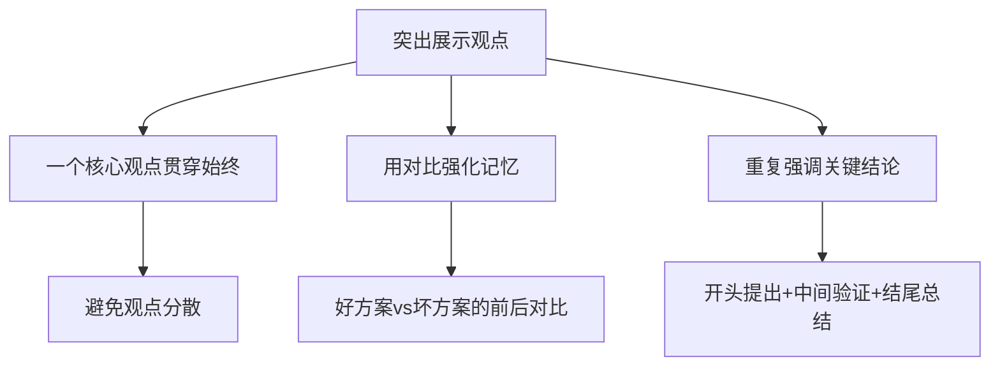

在技术演讲中，最怕的就是听众听完后不知道你到底想说什么。突出展示观点的核心方法是"一个中心，多个支撑"：

首先，明确你这次演讲最核心的一个观点是什么，然后围绕这个观点展开3-4个支撑论据。每个论据讲完后，都要回扣到核心观点上，帮助听众强化记忆。

善用对比也是突出观点的好方法。比如展示优化前后的性能数据对比、方案A和方案B的优劣对比，通过直观的差异让听众感受到你方案的价值。

最后，在演讲的开头提出核心观点，中间用案例验证，结尾再次总结强调。这种"总分总"的结构能够最大程度地帮助听众记住你的核心信息。

## 09.肢体语言的管控

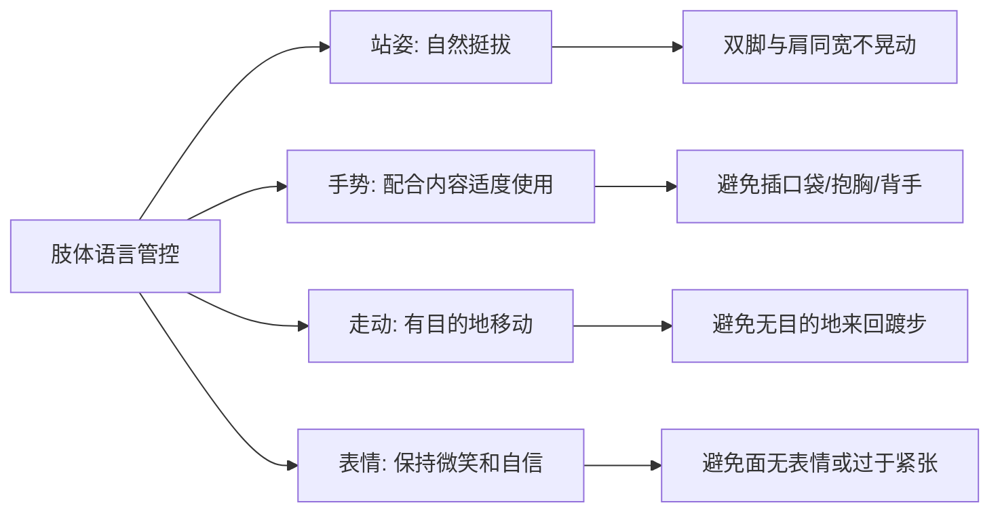

肢体语言在演讲中传递的信息量往往比语言本身还要大。研究表明，沟通中55%的信息来自肢体语言，38%来自语音语调，只有7%来自语言内容本身。

**站姿**：双脚与肩同宽，重心均匀分布，身体微微前倾表示对听众的关注。避免身体晃动、重心来回倒换或靠在桌子上。

**手势**：手势是演讲者的"第二语言"。讲到数字时可以用手指比划，讲到流程时可以用手势引导方向，讲到重点时可以用手掌向下的按压手势强调。避免双手插口袋、抱在胸前或背在身后。

**走动**：有目的地在舞台上移动可以拉近与不同区域听众的距离。比如讲新话题时移动到舞台另一侧，与某个区域的听众互动时走向他们。但要避免无目的地来回踱步，那会让听众感到紧张。

**表情**：保持自然的微笑和自信的眼神。遇到幽默的地方可以适当放松表情，讲到严肃话题时可以收敛笑容。最重要的是让表情与内容匹配，不要全程面无表情。

## 10.做一场漂亮演讲

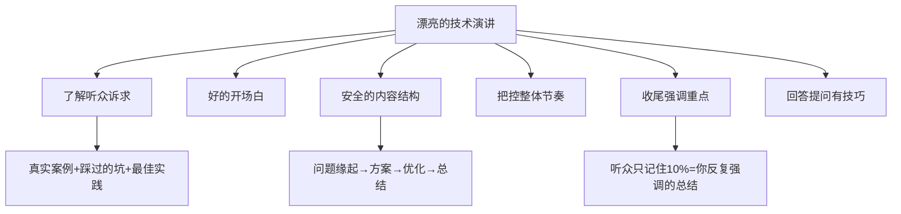

如同架构设计一样，了解需求永远是第一步的，任何脱离需求的架构设计都是耍流氓。参加技术大会的听众，主要是想学习知识，借鉴经验解决工作中的实际问题。

那么演讲嘉宾可以在 PPT 中针对性地准备这些内容：包括真实案例、碰到的问题、踩到的坑、尝试过的各种解决方案以及解决方案的优缺点、迭代演进和最佳实践等等。

紧张是正常的，紧张说明你内心重视这个事情，有的时候，紧张反而能够帮助你发挥地更好。往另一方面想，如果讲的内容是我们自己擅长的和熟悉的，何惧之有？

不管紧张不紧张，既然被推上台了，开场留给观众的第一印象就非常重要。如果你想不出什么有创意的开场，那就推荐一个适用于任何场合的开场方式：首先告诉大家我是谁，来自哪个公司，叫什么名字，职位可以说也可以不说。

然后就是简单描述下自己的从业经历，让大家明白我为什么有资格讲这个主题，这个部分讲好了可以增强说服力。最重要也是最容易被遗忘的一点是，一定要告诉听众，演讲内容对他们有什么帮助。

内容结构怎样组织会让人觉得比较有逻辑而不会显得无头无绪呢？按照"问题缘起 - 方案 - 优化方案 - 总结"这类"总分总"的结构来组织内容是比较安全的。

我们可以讲一下遇到了什么问题，问题产生的原因是什么，为了解决相应的问题，我们做了些什么，以及为什么要这么做。

然后，我们就可以展开描述解决方案的迭代过程、遇到过的矛盾冲突点，针对这些矛盾，介绍下有哪些传统的解决方案以及优缺点，之后再介绍递进方案和最佳实践。最后做一个总结。

内容框架搞定了，内容呈现也搞定了，接下来有些讲师会有疑问，"讲的内容这么多，时间不够用怎么办？"有的则表示，"很快就把准备的内容讲完了，好尴尬呀！怎么办？"这就涉及演讲节奏的把控问题了。

如何把控好演讲的整体节奏呢？个人经验是，人在紧张的情况下，语速会加快，导致演讲往往会比自己预计的时间更早结束。时刻提醒自己要放慢语速，会让听众觉得演讲人更稳重，也给了自己更多的思考时间。

演讲之前，我们一定要规划好每一页 PPT 要讲什么内容，哪些是要点，要讲多少分钟。技术大会有一个好处就是中途不会有听众打断你，演讲结束后才会统一提问，所以提前规划好的节奏一般不会被打乱。

随着演讲逐渐进入尾声，一场 40-50 分钟的演讲，由于涉及的架构、流程、方案等技术细节非常多，根据我的经验，第二天还能记得全部内容 10% 的听众少之又少。

听众记住的这 10% 是什么？除了开场灿烂的微笑，大部分就是收尾时演讲人"反复强调"的总结啦，所以最后的总结部分一定要重视。

总结部分的内容在精不在多，听众有收获就达到目的了。总结的时候可以反复强调结论、强调实践。要想让听众记住你期望他记住的 2-3 个关键点，以达到分享的目的，在收尾时的总结和强调就至关重要。

这个环节也是部分讲师比较头疼的，"万一碰上不会的问题怎么办？"我的个人经验是：首先，不要和提问者起冲突，特别是针对"你讲的我完全不赞同"这类观点。

可以表示"这是自己公司的实践，方案有很多，各有优缺点。"然后就可以马上转入"下一个问题"。还可以将问题技巧性地转化一下，比如说"这位朋友要问的是不是这样一个问题呢？"而转化后的问题正是自己擅长的。

还有一个大招，假如碰到让你比较尴尬的问题，你可以回答"这是个很好的问题，但几句话可能讲不清楚，感兴趣的话，我们线下交流。"这也是一种办法。

## 11.总结讲演的要点

不知不觉写了这么多，最后做一个总结，要想做一场漂亮的技术演讲，我们需要做到：

| 环节 | 核心要点 | 常见错误 |
|------|----------|----------|
| 准备阶段 | 了解听众诉求、明确主题 | 不做听众分析，闭门造车 |
| 内容设计 | 3-4个核心点、安全的总分总结构 | 塞太多内容，什么都想讲 |
| PPT制作 | 多图少字、15-20页 | 大量文字堆砌，照本宣科 |
| 开场 | 自我介绍+从业经历+对听众的价值 | 陈腔滥调、道歉式开场 |
| 讲述 | 赋比兴讲故事、自然的演讲姿态 | 读PPT、照本宣科 |
| 节奏 | 放慢语速、按规划推进 | 紧张导致语速过快 |
| 收尾 | 反复强调2-3个关键结论 | 虎头蛇尾，不做总结 |
| 提问 | 不起冲突、技巧性转化问题 | 和提问者争论 |

## 12.总结回顾这一节

**技术演讲不是炫技，而是回答"听众回去能用上什么"——Who/What/Why/How/Future/Recap 模板 + 多图少字 PPT + 赋比兴讲故事 + 反复强调收尾。**

1. **听众导向**：先问"对听众有什么用"，再决定讲什么。
2. **结构模板**：技术分享用 Who-What-Why-How-Future-Recap，控制 15-20 页。
3. **故事化**：用赋比兴讲技术——铺陈→类比→升华，让原理变得有画面。

## 13.后来发生的改变

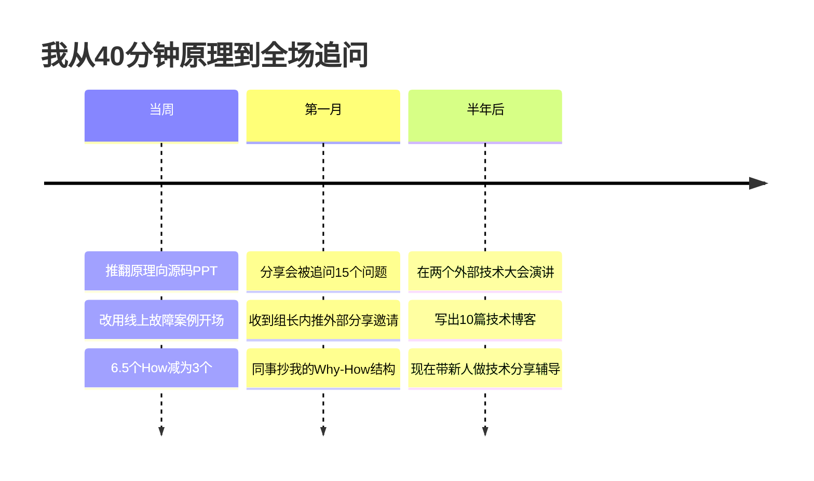

那次失败后我把整份 35 页 PPT 全部推翻。这次我先问自己一个问题："**听众听完后，能在他们的工作里用上什么？**" 想清楚后我重新组织：用一个真实的线上故障案例开场（赋）、把底层调度算法类比成"地铁调度系统"（比）、最后升华到"任何分布式问题都可以用 X 思路解决"（兴）。**6 个 How 砍到 3 个。**

一个月后我用新方法重做了同主题的一次分享。20 分钟讲完，**Q&A 环节被追问了 15 个问题，组长当场发消息说"下季度大会我要内推你去讲"**。组里其他同事开始问我："你的'故障案例 + 类比'这个结构能不能教我用一下？"

半年后我在两个外部技术大会做了演讲，听众反馈都很好。同时我把每次分享的内容沉淀成博客，半年写了 10 篇。**那个曾经被问"有什么用"的人，现在成了组里专门辅导新人技术分享的"布道者"。** 我对每个新人说的第一句话总是："**先问听众能用上什么，再写第一页 PPT。**"

## 14.今天起改变三点

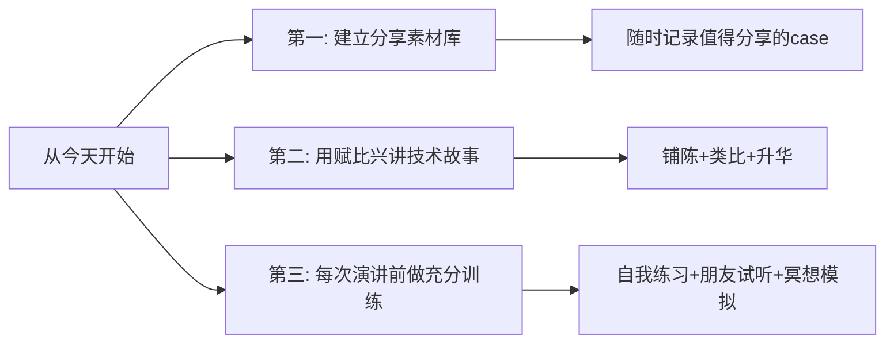

在工作中遇到有趣的技术问题、踩过的坑、想出的巧妙方案，随时记录到你的wiki或笔记中。包括数据、文档、代码片段、架构图等。当你的素材越来越丰富时，你离一场好的技术演讲就越来越近。

下次和同事交流技术方案时，尝试不要干巴巴地讲技术细节，而是用"铺陈直叙→类比联想→升华总结"的方式来表达。比如讲一个性能优化方案时，先铺陈问题现状（赋），再用生活中的例子做类比帮对方理解（比），最后升华到方法论层面（兴）。

下一次做技术演讲前，至少做三种形式的训练：自我练习（录音计时）、请朋友试听（获取反馈）、冥想模拟（在脑海中完整演练一遍）。记住，刻意训练不等于重复训练，关键是根据反馈不断迭代改进。

## 15.课后作业思考下

1. 回忆你最近一次做技术分享或演讲的经历，用本章的框架评估一下：你做到了哪些？哪些地方可以改进？
2. 找一个TED技术类演讲，分析演讲者如何使用"赋比兴"来讲故事，他的开场和收尾分别用了什么技巧。

1. 选一个你最近做的技术项目，用"Who-What&When-Why-How-Future-Recap"的模版梳理一遍，看看能否形成一个完整的分享提纲。
2. 在下一次需要做技术分享时，提前写一份逐字稿（哪怕只写核心部分），体会逐字稿对整理思路和提升表达质量的帮助。

