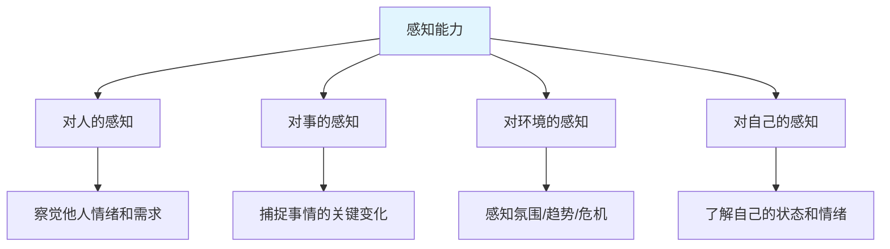
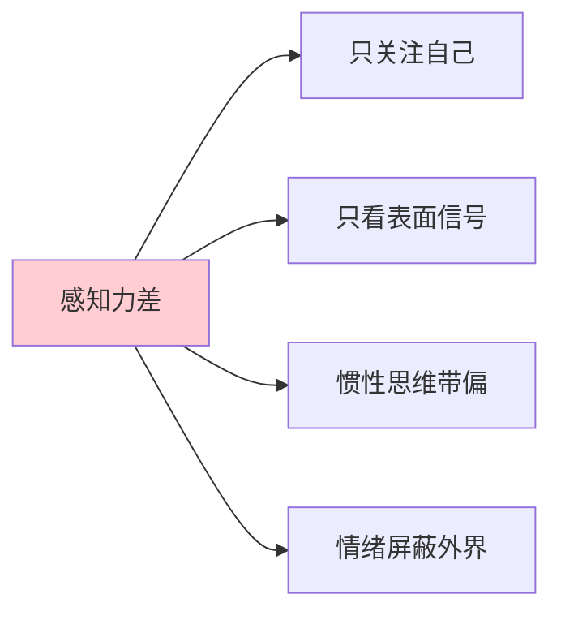
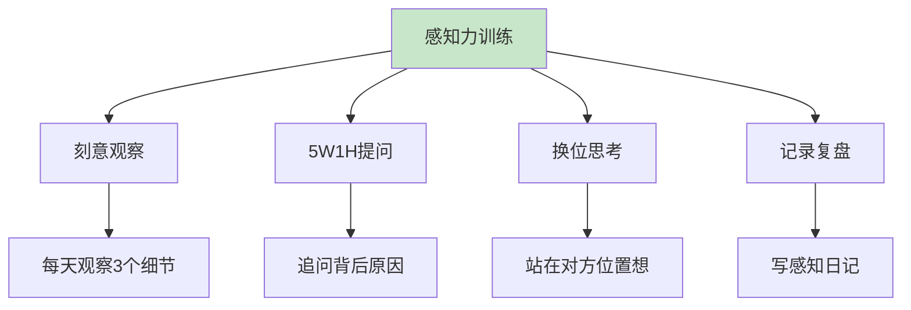
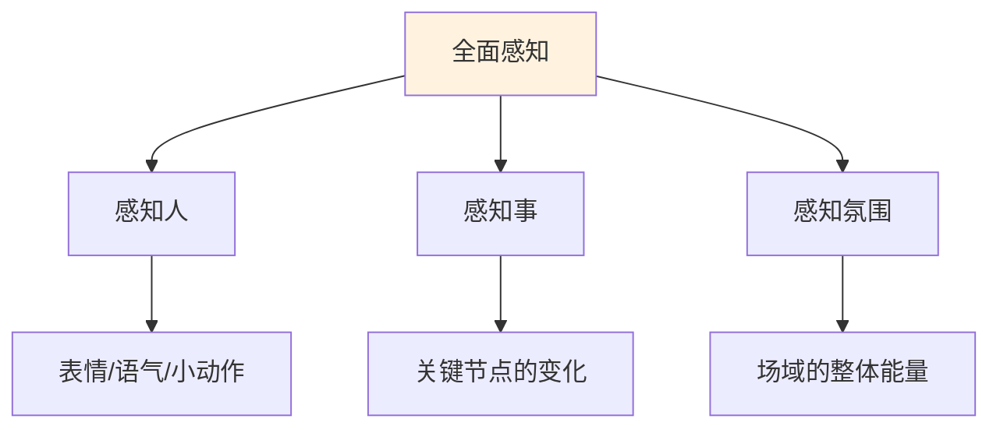
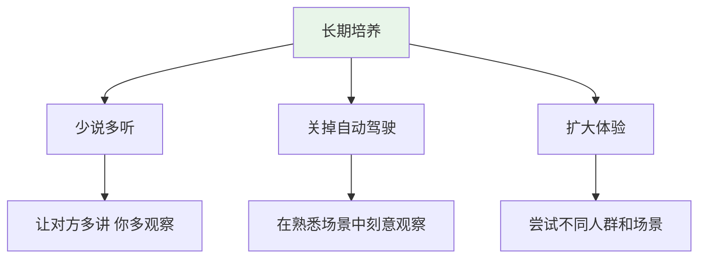
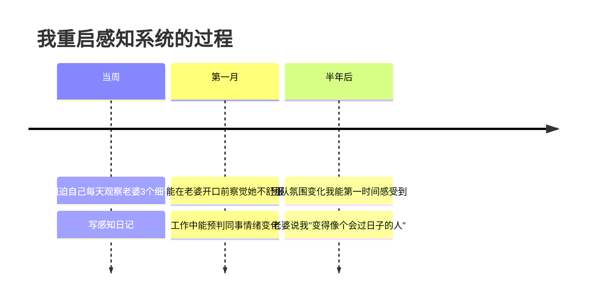
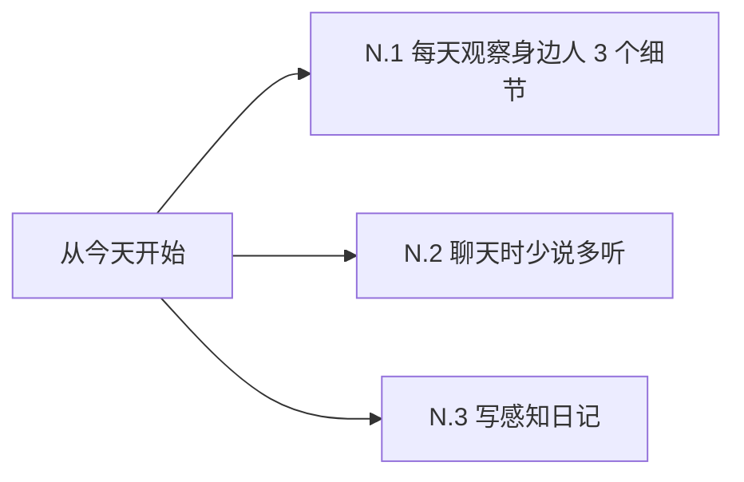

# 7.3感知能力的提升

#### 目录介绍
- [01.看一个真实案例](#01看一个真实案例)
- [02.什么是感知能力](#02什么是感知能力)
- [03.感知力差的常见表现](#03感知力差的常见表现)
- [04.提升感知力的核心方法](#04提升感知力的核心方法)
- [05.对人对事对环境的感知](#05对人对事对环境的感知)
- [06.把感知力变成长期习惯](#06把感知力变成长期习惯)
- [07.总结回顾这一节](#07总结回顾这一节)
- [08.后来发生的改变](#08后来发生的改变)
- [09.今天起改变三点](#09今天起改变三点)
- [10.课后作业思考下](#10课后作业思考下)

## 01.看一个真实案例

那是个普通的周末晚上，我刷着手机吃饭，老婆突然把筷子放下，眼眶红着说："你能不能稍微看我一眼？"

我愣住了：「咋了？」

她哭着说："我已经孕吐了一个月，每天早上 6 点跑去厕所吐，体重掉了 4 斤，胸口涨得要命睡不着。**你居然一次都没问过我**。"

那一刻我整个人僵在那。我开始往回想——这一个月里，她确实变得不爱笑了，吃饭吃几口就放下，晚上经常坐在沙发上发呆。我都看见了，但**我什么都没"看到"**。

后来我才明白：眼睛接收信号叫"看见"，大脑做出解读叫"看到"。**我每天和她在一起，但我的感知系统是关闭的**。她笑容变少我没察觉，她食量变小我以为天热没胃口，她经常发呆我以为工作累了。每一个信号单独看都不重要，**串起来就是一个非常明显的求助信号**——而我整整一个月没接收到。

那天之后我下决心补这门课：感知力。它影响的不只是工作效率，更影响**最亲近的人能不能被你看见**。

## 02.什么是感知能力

感知能力可以拆解为四个维度。

**对人的感知**：能察觉别人的情绪变化、潜在需求、隐藏意图。

**对事的感知**：能从一堆现象中捕捉到真正的关键信号，发现事情正在发生的微妙变化。

**对环境的感知**：能感受到一个团队、一个家庭、一个市场的整体氛围和趋势变化。

**对自己的感知**：能清楚知道自己当下的情绪、状态、需求，不是稀里糊涂地活着。

感知力还可以分为两个层次。**信号接收**是信号物理上进入你的眼睛、耳朵——这是大多数人都能做到的"看见"。**信号解读**是大脑把信号串联、理解、赋予意义——这才是"看到"，区分高低感知力的关键。

## 03.感知力差的常见表现

第一种是注意力全在自己身上。聊天时只想着自己接下来要说什么，没在听对方说什么；走路时只想着自己的烦恼，没注意路边发生了什么。

第二种是只看表面，不看深层。老板说"挺好的"就以为真的挺好；同事说"没事"就以为真没事。**忽略了语气、表情、肢体语言这些更真实的信号**。

第三种是用惯性思维替代观察。「他每次开会都不说话，肯定不在乎」——这是预设。其实他可能是不敢说，可能是没准备好，可能是有更深的想法。**预设让你失去了真正观察的机会**。

第四种是情绪屏蔽了感知。当你自己情绪很差时，会下意识屏蔽周围一切信号——别人的求助、危险的信号、变化的趋势，你都接收不到。这是为什么"心情不好的时候容易出事"。

## 04.提升感知力的核心方法

每天给自己定一个观察小目标：今天注意 1 个同事情绪的细微变化，今天观察 1 个家人今天和昨天有什么不同，今天观察 1 个商场或地铁里的有趣场景。刚开始可能完全观察不到，**但坚持 21 天后你会变成另一个人**——同样的环境，看到的信息密度会翻好几倍。

5W1H 追问法很有用。看到一个现象后，习惯性地追问 What 发生了什么、Who 涉及到谁、When 什么时候开始的、Where 发生在什么场景、Why 为什么会这样、How 怎么发生的。不停地追问，会让你看穿表面，触及本质。

换位思考也是同理心的核心训练。任何场景都问自己一句："如果我是他，我现在在想什么？感受什么？需要什么？"

写感知日记也是很好的方法。每天睡前花 5 分钟，记录三个问题：今天我观察到了什么有意思的事？今天身边的人有什么状态变化？今天我自己的情绪走向是怎样的？

## 05.对人对事对环境的感知

对人的感知可以从三个维度展开。**表情维度**：眼神是否回避？嘴角是上扬还是下撇？眉头有没有紧锁？**语气维度**：语速是变快了还是变慢了？声调是平的还是上扬的？停顿是不是变多了？**肢体维度**：是不是双手交叉抱在胸前（防御）？身体是前倾还是后仰？手指有没有不停敲桌子（焦躁）？这些信号比"嘴上说的话"更真实。

对事的感知是捕捉关键变化。每件事都有"正常状态"和"异常状态"。感知力强的人能在异常变化的早期就察觉到：项目周报里某个指标连续 3 周下滑，客户回复邮件的速度变慢了，团队里有人最近开会越来越少发言。**异常 = 信号**，越早察觉越能主动应对。

对氛围的感知是场域能量。走进一个会议室，能不能立刻感觉到"今天气氛很紧张"？走进一个家庭，能不能立刻感觉到"今天大家都在闹别扭"？这种"场域能量"的感知是最高级的感知力，需要长期训练才能获得。

## 06.把感知力变成长期习惯

聊天时，把"准备下一句要说什么"的精力，**转移到观察对方上**。研究表明，人在说话时基本不在听；只有当你停止"准备说话"时，才能真正接收到对方的信号。

在熟悉的场景里，人最容易开自动驾驶——每天回家走的那条路、每天吃饭的那家店、每天聊天的那几个人，你都没在"看"。刻意在熟悉场景中"重新观察"——今天家里的灯光是不是不一样？老婆今天的发型有变化吗？同事今天穿的衣服你以前见过吗？

经常去陌生场景、和陌生人接触，你的感知系统会被迫激活。旅行、参加陌生圈子的聚会、读不熟悉领域的书，都是在扩大感知带宽。

## 07.总结回顾这一节

一句话核心：**感知力 = 信号接收 × 信号解读，眼睛在不代表大脑在**。

你应该带走的三件事：

1. **看见 ≠ 看到**，大多数人输在"信号解读"这一步
2. **少说多听 + 5W1H 追问**，是最快提升感知力的方法
3. **每天观察 3 个细节**，21 天后你会变成另一个人

## 08.后来发生的改变

第一周我做了一件特别"刻意"的事：每天回家强迫自己观察老婆 3 个细节——今天她穿了什么、做了什么、说话语气是什么样的。写在感知日记里。一开始觉得别扭，第三天就开始有发现了：「她今天笑容多了一点」「她今天提到妈妈时语气有点重」。

一个月后，我能在老婆开口前察觉她不舒服了——看她皱眉的样子，我会主动问"你是不是哪里疼？"，会主动倒一杯热水。工作上也开始受益：开会时我能感觉到哪个同事其实有不同意见但没说出口，会私下主动找他聊。

半年后，老婆说："你变得像个会过日子的人了"——这句话比涨工资还让我开心。孩子出生后，我发现感知力强的爸爸是真的不一样：婴儿哭声不同代表不同需求，我能很快分辨出"这是饿了不是困了"，老婆经常被我惊到。

## 09.今天起改变三点

挑一个你最在乎的人——配偶、孩子、父母、好朋友。每天观察 ta 的 3 个细节：表情、语气、行为。写下来。21 天后回看，你会震惊于自己之前漏掉了多少东西。

下次聊天时，刻意把"自己说话的比例"降到 30%。70% 的时间用来听、观察、追问。你会发现对方比你以为的"有趣得多"。

睡前 5 分钟，写下今天 3 件你"观察到的"事情——可以是别人的情绪、事情的变化、环境的氛围。坚持一个月，你会发现自己看世界的"分辨率"变高了。

## 10.课后作业思考下

**自检类**：

1. 回想最近一周，你最在乎的人有没有什么"求助信号"被你忽略了？回头去问问 ta，验证你的感知准不准。
2. 你和别人聊天时，自己说话的比例大概是多少？是不是经常没听完对方的话就开始准备自己要说什么？

**实践类**：

3. 选定一个你最在乎的人，连续 7 天每天观察 ta 的 3 个细节（表情、语气、行为）并记录下来。
4. 在下一次会议中，刻意当 30 分钟的"观察者"——别只听内容，还要观察每个人的表情、坐姿、参与度变化，写一段会后复盘。
