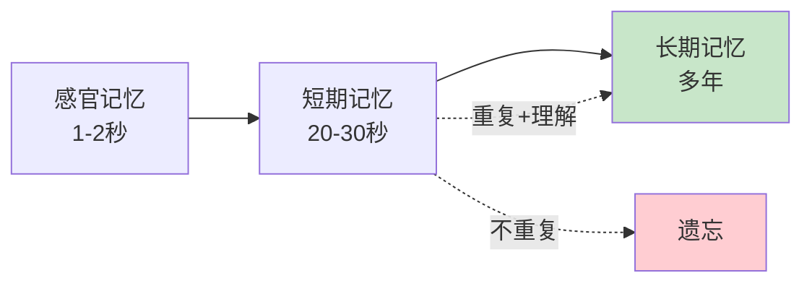
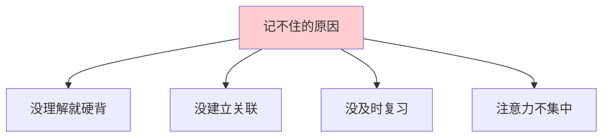
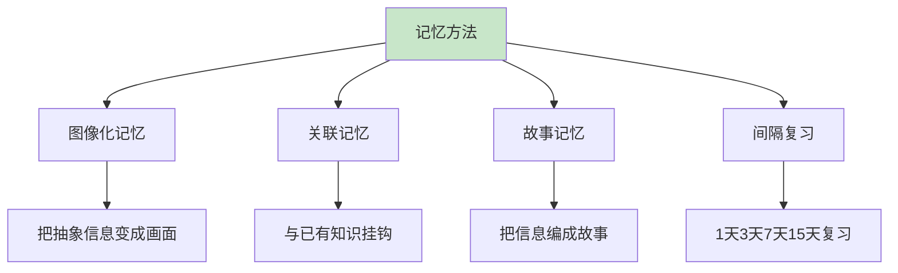
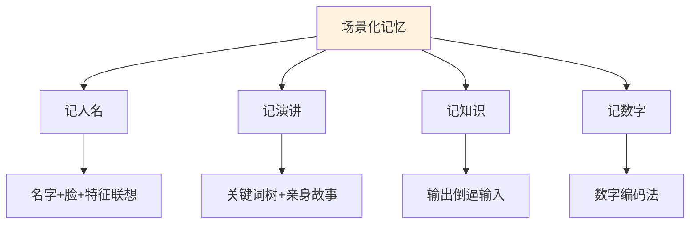
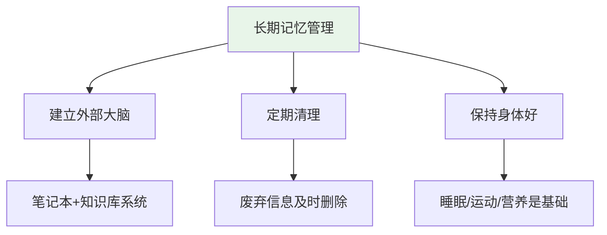
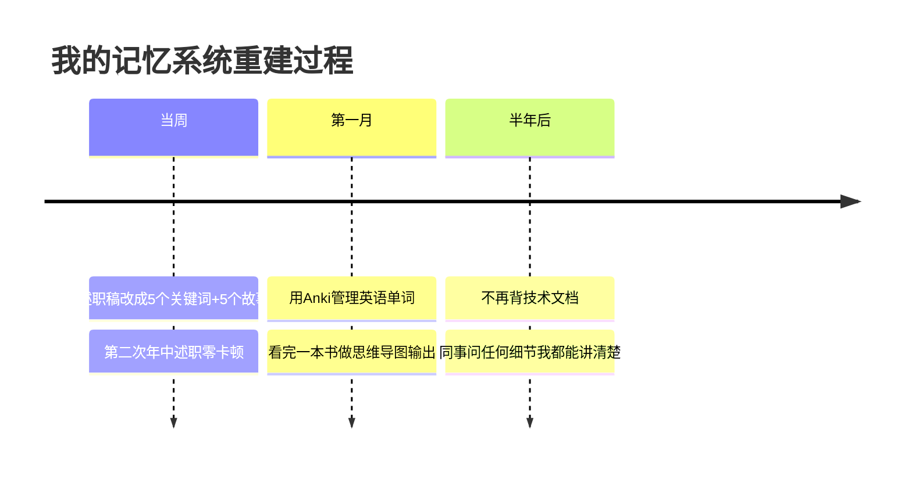
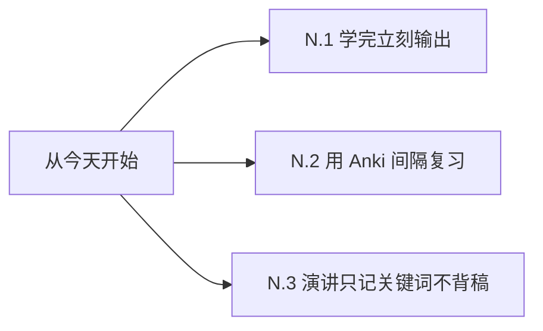

# 7.4记忆能力的训练

#### 目录介绍
- [01.看一个真实案例](#01看一个真实案例)
- [02.记忆是怎么工作的](#02记忆是怎么工作的)
- [03.为什么会记不住](#03为什么会记不住)
- [04.提升记忆力的核心方法](#04提升记忆力的核心方法)
- [05.针对不同场景的记忆术](#05针对不同场景的记忆术)
- [06.记忆与遗忘的长期管理](#06记忆与遗忘的长期管理)
- [07.总结回顾这一节](#07总结回顾这一节)
- [08.后来发生的改变](#08后来发生的改变)
- [09.今天起改变三点](#09今天起改变三点)
- [10.课后作业思考下](#10课后作业思考下)

## 01.看一个真实案例

去年我的年终述职，PPT 写了 30 页，关键数据、关键案例、关键金句我背了 3 天 3 夜。

那天上台，话筒一拿起来，我看着台下的总监和 30 多个同事，**第一句话就忘了**。

脑子里一片空白，PPT 上写着"今年我做了三件事"，我嘴里就一直重复"今年我做了三件事……今年我做了三件事……"。

后面磕磕巴巴讲完，下台时我的衬衫已经全湿了。回到工位的我特别绝望——明明背得滚瓜烂熟，怎么一上台全没了？

事后我请教了部门里述职公认讲得好的师姐，她说："**你不该背稿子，你该理解你说的每句话背后的逻辑**。我从来不背，只记 5 个关键词，每个关键词后面是一段自己亲身经历的故事，故事永远忘不掉。"

我一下醒悟：我之前是把记忆当成"硬盘存储"——不停地复读、不停地背诵。但人脑不是硬盘，**人脑是关联存储**——只有把信息和已有的认知、情感、画面绑在一起，才能记得牢。

这一节就是我从"背了忘、忘了背"的死循环里走出来后，重学的记忆方法。

## 02.记忆是怎么工作的

记忆系统可以分为三种。**感官记忆**是眼睛、耳朵接收到的信号在 1–2 秒内的暂存，绝大多数会被丢弃。**短期记忆**是被注意到的信息进入短期记忆，能保留 20–30 秒，容量只有 7±2 个项目。**长期记忆**是经过反复加工、与已有知识连接后，进入长期记忆，可以保存数年甚至一生。记忆能力的关键，是**让信息从短期记忆顺利进入长期记忆**。

德国心理学家艾宾浩斯发现：学完 20 分钟后遗忘 42%，学完 1 小时后遗忘 56%，学完 1 天后遗忘 74%，学完 1 周后遗忘 77%。这意味着：**如果不复习，你今天学的东西明天就只剩 1/4**。

## 03.为什么会记不住

理解是记忆的基础。一段你不理解的文字，背 100 遍可能也记不住；一段你彻底理解的逻辑，看 1 遍就能复述。

孤立的信息最难记。把新信息和你已有的知识、生活经验、生动画面**关联起来**，才能稳定进入长期记忆。

学了不复习，遗忘曲线让一切努力归零。复习不是机械重读，而是**主动回忆**——合上书自己默述一遍。

一边刷手机一边学习的内容，根本没有进入短期记忆——感官记忆 1–2 秒就丢了。**注意力是记忆的入口**。

## 04.提升记忆力的核心方法

人脑对图像的记忆远超对文字的记忆——这就是"一图胜千言"。记忆电话号码 13800138000，不如想象成"一座 138 层的大楼，地面 0 层种着 138 棵 0 元买的树"。荒诞、具体、画面感，反而记得牢。

新信息一定要找一个"挂钩"挂上去。学到一个新概念，联想生活中类似的现象；记一个人名，联想他的脸加一个特征；记一段历史，联想到自己生活中的某段经历。

故事记忆法的精髓是把要记的内容编成一个故事，越荒诞越好。要记 5 个购物清单：苹果、电池、毛巾、咖啡、灯泡，可以编成"我把**苹果**塞进**电池**仓里，被**毛巾**擦了擦，泡进**咖啡**杯里，结果**灯泡**爆了"。

间隔复习（Spaced Repetition）按艾宾浩斯曲线安排复习节点：第 1 天学，第 2 天复习，第 4 天复习，第 7 天复习，第 15 天复习，第 30 天复习。每次复习不是重读，而是**合上资料默述**。Anki 这类 App 就是基于这个原理。

## 05.针对不同场景的记忆术

记人名要把脸、名、特征绑在一起。第一次见面时立刻在心里说三遍对方的名字，同时观察 ta 一个突出特征（戴眼镜、左脸有痣、声音很低），把名字、脸、特征绑成一个画面记忆。

记演讲不要背稿子，列出 5–7 个关键词，每个关键词背后绑定一个**你亲身经历的故事**。故事不会忘，关键词会触发故事，故事自然带出表达。

记知识要靠输出倒逼输入。学完一个新知识，立刻做一件事：**写一篇 500 字的文章 / 给别人讲一遍 / 做一张思维导图**。**输出是最好的记忆**——只有真正能讲出来，才说明你真的记住了。

记数字可以用数字编码法。把 0–9 每个数字赋予一个固定形象：0 是鸡蛋，1 是蜡烛，2 是鸭子，3 是耳朵，4 是帆船，5 是钩子，6 是哨子，7 是拐杖，8 是葫芦，9 是气球。记 4396 就是"帆船里有一对耳朵，吹着气球的哨子"，画面感记数字。

## 06.记忆与遗忘的长期管理

人脑不擅长精确存储，**让大脑专注于思考，让笔记和知识库专注于存储**。可以用 Notion / Obsidian / 印象笔记搭建个人知识库；重要内容立刻记下来，不要"等会儿再说"；定期整理标签和分类。

不是所有信息都需要记住。该忘的就忘，**为重要信息腾出空间**。定期清理过期笔记、过期联系人、过期信息源。

身体是记忆的硬件基础。**睡眠**：记忆在睡眠中固化，缺觉直接破坏长期记忆。**运动**：有氧运动促进海马体增长，海马体是记忆的核心区。**营养**：Omega-3、维生素 B、足够的水分都对记忆有帮助。

## 07.总结回顾这一节

一句话核心：**人脑不是硬盘，是关联网络——记忆的关键是"挂钩 + 复习"，不是死记硬背**。

你应该带走的三件事：

1. **理解 + 关联 + 图像**，是记忆的三大基石
2. **间隔复习**比"一次背 100 遍"有效 10 倍
3. **输出倒逼输入**，能讲出来才是真记住

## 08.后来发生的改变

下一次的部门分享，我没再背稿。我在便利贴上写了 **5 个关键词**——「上线时间、用户增长、技术难点、协作经验、明年规划」。每个关键词背后绑定一个我自己亲身经历的小故事。上台后，看着关键词就能自然带出故事，**40 分钟讲完，零磕巴**，比上一次的状态强 10 倍。

第一个月开始用工具系统化记忆。我开始用 Anki 管理英语单词、技术概念、读书金句。每天通勤时刷 10 分钟，按艾宾浩斯曲线自动安排。每读完一本书，强制自己做一张思维导图发到朋友圈——**输出强迫我真的把内容内化**。

半年后我意识到，我已经几乎不"背"东西了——所有需要记的内容都通过"理解 + 关联 + 输出"自然地长在了脑子里。部门里讨论技术方案时，同事问我"那个文档第 5 章第 3 节讲的什么"，我能直接讲出核心逻辑——不是因为我背了，而是因为我**真的理解了**。

## 09.今天起改变三点

读完一篇文章 → 写 100 字感想 / 讲给同事听 / 画一张图。不输出 = 没学。这条规则刻在脑门上。

把你想长期记住的内容（单词、概念、金句）做成 Anki 卡片，每天通勤时刷 10 分钟。30 天后你会震惊于自己居然能记住这么多。

挑你最近的一次发言、汇报、分享，**只列 5 个关键词，每个关键词背后绑一个你亲身经历的故事**。试试看，你会发现比背稿放松、自然、还讲得更好。

## 10.课后作业思考下

**自检类**：

1. 回想你过去一年学过、读过、听过的内容，你现在还记得多少？为什么大多数都忘了？
2. 你现在有"外部大脑"系统吗（笔记本、知识库 App）？如果没有，你的重要信息靠什么管理？

**实践类**：

3. 挑一段你需要记住的内容（30 个英语单词 / 一段历史 / 一个技术概念），用本节学到的图像化或故事记忆法处理，第 1 / 3 / 7 / 15 天分别复习一次，记录效果。
4. 把你下次的发言、汇报、述职，**改用 5 关键词 + 5 故事的方式**准备，记录现场表现和自己的感受。
