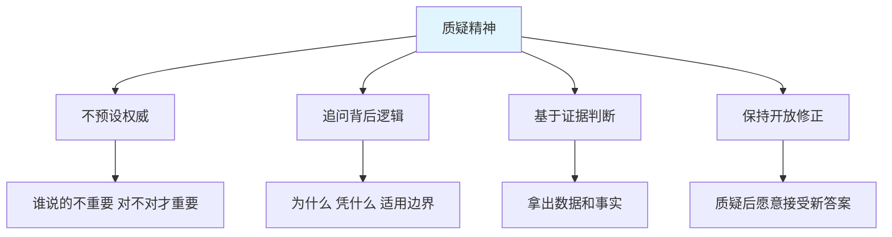
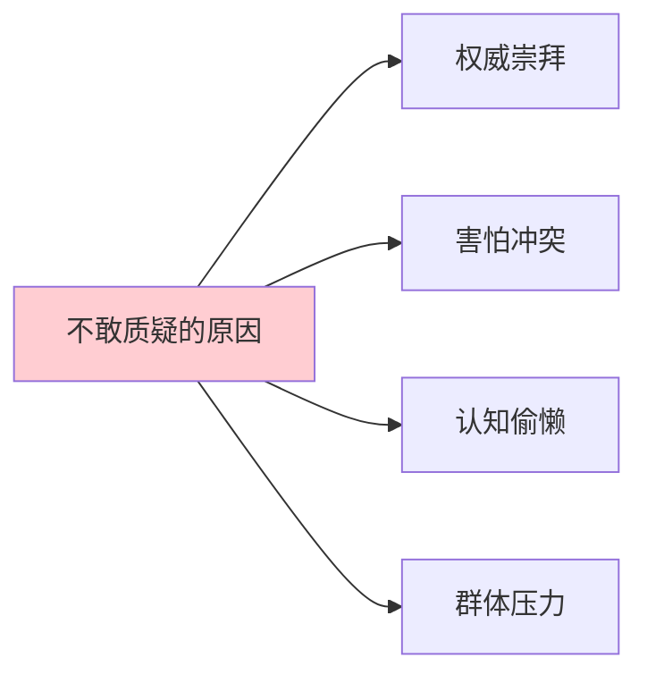
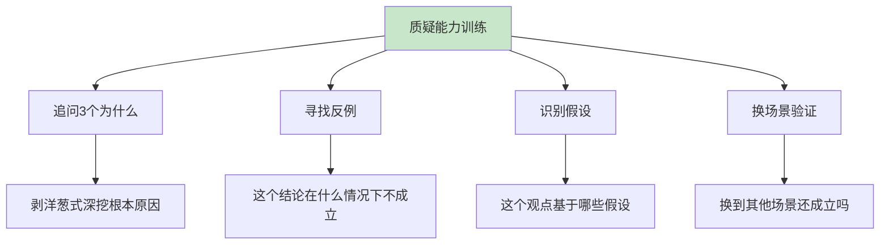
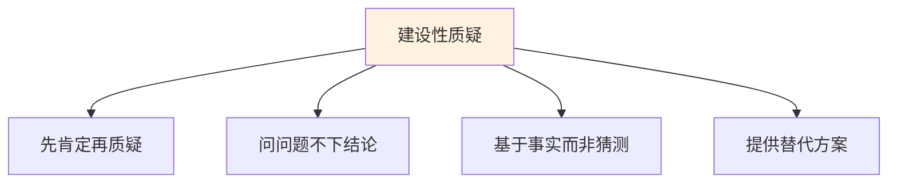
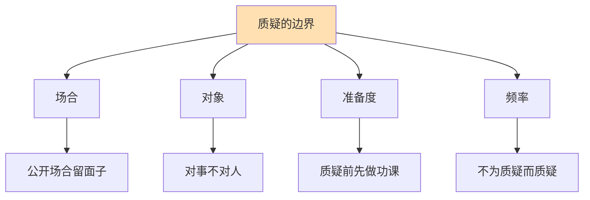
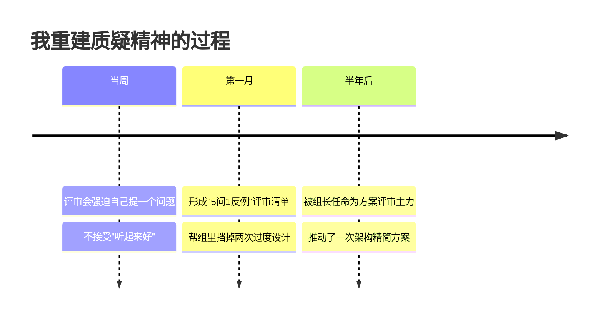

# 7.5质疑精神的分析

#### 目录介绍
- [01.看一个真实案例](#01看一个真实案例)
- [02.什么是质疑精神](#02什么是质疑精神)
- [03.为什么我们不敢质疑](#03为什么我们不敢质疑)
- [04.提升质疑能力的核心方法](#04提升质疑能力的核心方法)
- [05.建设性质疑的表达方式](#05建设性质疑的表达方式)
- [06.质疑的边界和分寸](#06质疑的边界和分寸)
- [07.总结回顾这一节](#07总结回顾这一节)
- [08.后来发生的改变](#08后来发生的改变)
- [09.今天起改变三点](#09今天起改变三点)
- [10.课后作业思考下](#10课后作业思考下)


## 01.看一个真实案例

去年我们要做一个新功能模块，我看到行业某大厂分享的架构方案——拆分微服务、引入消息队列、用 Redis 缓存、走 K8s 部署。

我在评审会上把这套方案完整搬了过来，所有人都说"听起来很专业"。组长问我："**我们日活才 2 万，这套方案是不是太重了？**"

我当时心虚但嘴硬："大厂都这么做的，肯定没错。"

结果上线第一天就出事了：消息队列消息堆积、Redis 命中率不到 30%、K8s pod 来回重启。**因为日活太低，根本撑不起异步链路所需的吞吐量**——大厂的方案是为千万 DAU 设计的，照搬到我们 2 万 DAU 的场景就是负担。

我连夜回滚成单体应用 + MySQL，接下来一周加班修这个雷。

复盘的时候，组长说了一句让我刻骨铭心的话：「**你不是不会做技术选型，你是不敢质疑大厂方案。"权威说的就一定对"，这是工程师最危险的习惯**。」

我突然明白：质疑不是抬杠、不是不尊重，**质疑是把信息从"别人的"变成"自己的"必经之路**。

这一节就是我从那次惨痛事故后，重新认识"质疑"这件事的总结。


## 02.什么是质疑精神



质疑精神可以拆成四个维度。

**不预设权威**：信息是不是对的，跟说的人是谁没关系。哪怕是诺贝尔奖得主，说错了也是错的。

**追问背后逻辑**：不停问"为什么"——为什么这么设计？基于什么假设？适用什么边界？

**基于证据判断**：不靠"我觉得"，而是靠"数据显示"。有证据支持就接受，没证据支持就保留。

**保持开放修正**：质疑不是为了证明自己对、对方错，而是为了找到真相。一旦有新证据，愿意修正自己的观点。

质疑和抬杠完全不是一回事。

| 维度 | 质疑 | 抬杠 |
|------|------|------|
| **目的** | 寻找真相 | 证明自己对 |
| **态度** | 开放、好奇 | 防御、攻击 |
| **逻辑** | 基于证据 | 基于情绪 |
| **结果** | 双方都长进 | 双方都恼火 |

很多人不愿意质疑别人，是因为分不清这两者——以为质疑就是不尊重、就是冒犯。


## 03.为什么我们不敢质疑



第一种是权威崇拜。「他是大牛，他说的肯定对」「这是大厂方案，肯定没问题」「老板说的，照办就行」——把判断权交给权威，是最省心的选择，也是最危险的选择。

第二种是害怕冲突。质疑别人就是在说"你可能错了"，很多人怕引起反感、怕被报复、怕影响关系，所以宁可吞下疑问也不开口。

第三种是认知偷懒。质疑需要消耗大量脑力——要弄清楚原方案的逻辑、要找证据、要构建反例。直接接受现成结论显然轻松得多。

第四种是群体压力。会议上 9 个人都同意，你那 1 个人的疑问就很难说出口。**社会从众压力**会让你下意识地"算了，也许是我想多了"。


## 04.提升质疑能力的核心方法



听到任何结论，强迫自己问 3 个为什么：为什么是这样？这个理由背后又为什么？这个更深的原因又为什么？3 层挖下去，往往就能找到根本逻辑——或者发现根本没有逻辑。

主动寻找反例也很关键。任何观点听起来再正确，都试着想："**有没有什么情况下它会不成立？**"比如「敏捷开发提升效率」——在合规要求很高的场景里成立吗？「学历不重要」——在选拔 1000 人岗位时还不重要吗？「年轻人要敢冒险」——上有老下有小的人也要冒险吗？反例是检验观点最好的方法。

识别背后的假设。任何观点都建立在一系列假设之上。把假设找出来，就能判断观点的边界。比如「这个方案能让我们 QPS 提升 10 倍」——假设是什么？硬件配置？数据量？业务场景？「我应该跳槽」——假设是新公司更好？老公司不变？市场不变？

换场景验证也是好办法。把同一个观点放到不同场景里检验：这个方案在 100 人公司可行，在 1 万人公司可行吗？这个方法对单身的人有用，对有孩子的人有用吗？这个理论在中国成立，在美国成立吗？


## 05.建设性质疑的表达方式



不要上来就"我不同意"，先认真总结对方的观点，让对方知道你听懂了。「您的方案我理解是这样：A → B → C，这个逻辑很清晰。我有一个疑问想请教，关于 B 这一步……」让对方感到被尊重，他才会真的听你说什么。

用问题代替结论。不要说"你这个方案不行"，而是说"我有个问题想确认一下，在 XX 场景下这个方案会怎么处理？"**问题比结论更容易被接受**，而且常常逼对方自己发现问题。

基于事实而非猜测。不说「我觉得不行」，而说「根据上周的压测数据，QPS 5000 时延迟已经到 800ms，这个方案能扛住目标的 2 万 QPS 吗？」事实有力量，猜测没有。

最好的质疑不是"否定"，而是"提出更好的"。「方案 A 我担心 XX 问题，能不能考虑方案 B？方案 B 在 XX 方面可能更适合我们的场景。」


## 06.质疑的边界和分寸



公开场合质疑老板，会让对方下不来台。**私下沟通可以更尖锐，公开场合留余地**。正式评审是质疑的好场合——大家都在准备应对疑问；茶水间闲聊不是——会显得突兀。

要对事不对人。质疑方案 ≠ 否定提出方案的人。把"你错了"换成"这个方案有个点我担心"。

质疑前要做功课。不要张嘴就质疑——先把对方的观点完整理解了、把背景资料看了、把数据查了，再去质疑才有分量。**不做功课的质疑就是抬杠**。

不要为质疑而质疑。有些人养成了"逢提议必反对"的习惯，把质疑变成人设——这反而是另一种偏执。**真正的质疑精神是开放的**——质疑后如果对方给出充分理由，你应该愿意改变看法。


## 07.总结回顾这一节

一句话核心：**质疑不是抬杠，是把别人的结论变成自己的判断的必经之路**。

你应该带走的三件事：

1. **不预设权威**——大牛说的、大厂做的、老板说的，都要追问"为什么"
2. **追问 3 个为什么 + 找反例 + 识别假设**，是质疑的三大武器
3. **建设性表达**：先肯定再质疑，用问题代替结论，提供替代方案


## 08.后来发生的改变



事故后的第一周，组长让我参加 3 个方案评审。**他给我下了死命令：每场至少提 1 个问题**。我特别紧张，每次都提前两小时把方案翻熟、把假设列出来。第一场我憋出了一个问题"这个 QPS 假设的依据是什么？"，提问完全场安静——结果方案作者自己也没想清楚。

一个月后我整理出一个**「5 问 1 反例」清单**：核心假设是什么？适用边界在哪里？失败时的回滚方案？数据和成本怎么估算？跟现有架构怎么衔接？反例：什么场景下方案会失效？带着这张清单参加每场评审。一个月内帮组里挡掉两次过度设计——一次是不必要的微服务化，一次是不必要的多机房部署。

半年后，组长把我列为"方案评审主力人员"，重要方案都要拉我把关。我自己也推动了一次架构精简方案——把组里 3 个微服务合并成 1 个，去掉了 2 个中间件。**上线后整体故障率下降 60%，运维成本下降 40%**。更重要的是，我变得更"敢说话"了——不只是技术评审，连和老板沟通战略时，我也能基于事实提出不同看法。


## 09.今天起改变三点

```mermaid
graph LR
    A[从今天开始] --> B[N.1 听到结论先问3个为什么]
    A --> C[N.2 评审会强迫自己提1个问题]
    A --> D[N.3 不照搬任何"现成方案"]
```

不管是新闻、领导讲话、同事方案，都强迫自己问 3 层为什么。问到自己满意为止。

不管是技术评审、产品评审、还是部门会议，**强制自己至少提 1 个有质量的问题**。可以用模板："这个方案在 XX 场景下会怎么处理？" / "这个数据的依据是什么？" / "失败的兜底方案是什么？"

下次想用一个"大厂方案/最佳实践/行业标杆"时，先问自己 3 个问题：它的适用场景和我一样吗？它的假设条件在我这里成立吗？我的成本能撑起这个方案吗？**先理解，再借鉴，永不照搬**。


## 10.课后作业思考下

**自检类**：

1. 回想你最近一次"完全相信权威"导致的失败经历——为什么当时你不敢质疑？背后的真实原因是什么？
2. 在你的日常工作中，有哪些"大家都这么做"的事其实从来没人深究过逻辑？挑一件出来追问 3 个为什么。

**实践类**：

3. 在下一次评审会或团队会议上，强迫自己提出至少 1 个有质量的问题（基于事实、不预设结论），记录现场反应和自己的感受。
4. 挑一篇你最近读到的"权威观点"文章，写一段 300 字的反思——它的假设是什么？适用边界在哪里？反例是什么？
