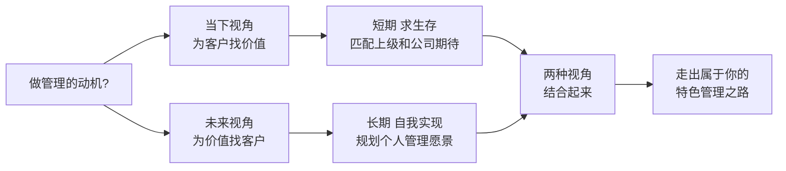
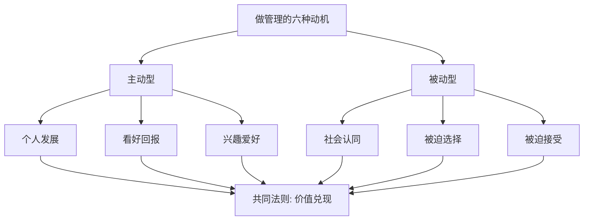
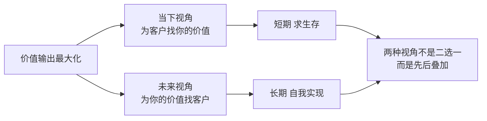
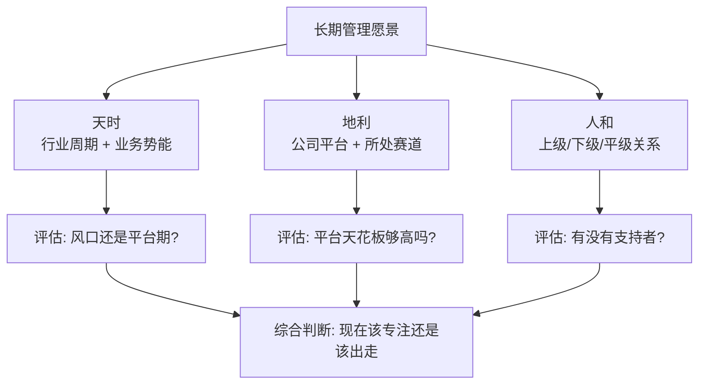
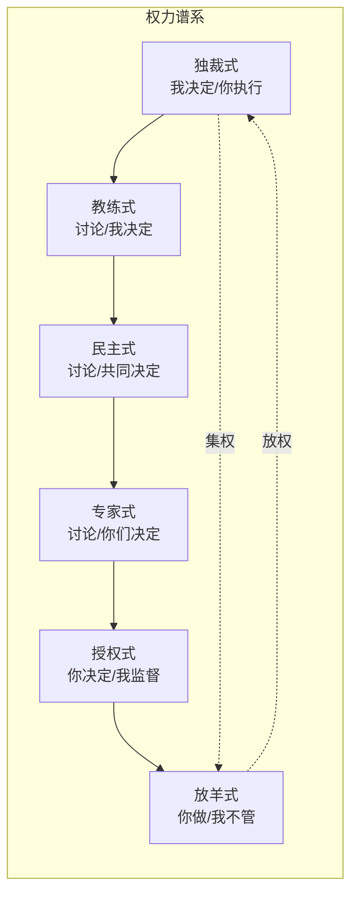
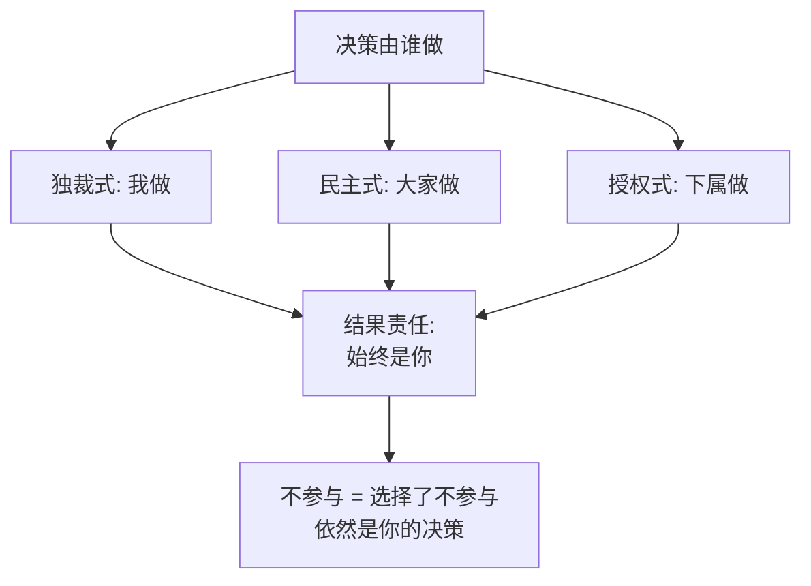
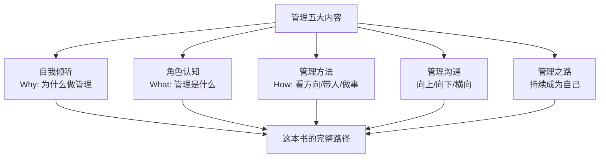

# 1.3特色的管理之路

#### 目录介绍

- [01.开头故事引入](#01开头故事引入)
- [02.做管理到底为何](#02做管理到底为何)
- [03.输出自己的价值](#03输出自己的价值)
- [04.天时地利和人和](#04天时地利和人和)
- [05.管理模式有哪些](#05管理模式有哪些)
- [06.管理模式的指南](#06管理模式的指南)
- [07.管理的五大内容](#07管理的五大内容)
- [08.故事的回响](#08故事的回响)
- [09.思考题和作业](#09思考题和作业)

## 01.开头故事引入

**一次与老同学的酒后对话。** 有次和大学老同学聚会，席间他感慨："我也当了两年 TL 了，每天累得要死，团队也没什么突破，钱也没多拿，真不知道图啥。" 我当时没敢接话，因为我自己也问过这个问题——做管理到底图的是什么？

有的人图钱，有的人图权，有的人图晋升，有的人图成就感，更多的人只是"被上级点名顶上去的"。如果这个问题没想清楚，做管理就像闭着眼开车，开得累不说，往往还开偏。

**一张图理清为什么做管理。** 后来我看到一位前辈总结的"价值兑现法则"：你能收获多少回馈，取决于你能输出多少价值。这句话是我那几年最有启发的一句。它把"我为什么做管理"这个虚的问题，翻译成了"我能为谁、输出什么样的价值"这两个具体的问题。

今天这一节，我就从"价值兑现"这个原点出发，讲清楚新经理怎么用"当下"和"未来"两种视角找到属于自己的管理道路。

## 02.做管理到底为何

聊清楚动机，是走特色管理之路的第一步。

**六种常见的动机。** 一直在思索的——做管理对于你、对于我、对于我们每一位技术职场人，到底意味着什么呢？生活就是这样，如果你不主动去争取你想要的，你就不得不接受一些你不想要的。因此，主动规划自己的管理之路，让我们对未来的发展有更多的掌控感，是很有必要的。

常见的决策依据大体有六类。第一类是个人发展，认为做管理符合自己的职业发展规划，这类人其实是少数。第二类是看好回报，认为做管理可以为自己带来更可观的物质回报。第三类是兴趣爱好，喜欢和人打交道、不喜欢和机器打交道。第四类是社会认同，在家人、朋友等周围人的眼中，做管理尤其是晋升到高管，意味着成功。第五类是被迫选择，觉得做纯技术不是长久之计，而管理就是技术之外的不二选择。第六类是被迫接受，上级要求带团队，自己不能辜负公司的信任和期待。

**价值兑现是共同法则。** 无论是主动也好、被动也罢，无论是出于使命兴趣也好、抑或是欲望压力也罢，只要是在职场中，就有一个基本法则在发挥作用，那就是"价值兑现"——你能收获多少回馈，取决于你能输出多少价值。这条法则对技术路、管理路、业务路一视同仁，所以在管理这条路上能走多远，也得先回到这个问题：你能输出什么。

## 03.输出自己的价值

回馈不仅是指物质回馈，还包括成长感、成就感、幸福感等精神回馈。所以无论是什么初衷、以及选择了什么样的职业道路，最终都会落在一个问题上："我能否最大化地输出自己的价值？" 那么如何才能让自己的价值输出最大化呢？这里提供两个视角。

**当下视角求生存。** 所谓当下视角，就是希望在当下或短期内取得价值输出的最大化。而在这个时刻或短期之内，你服务的"客户"是明确而具体的，所以要考虑的问题就是如何使用和提升自己的能力去匹配"客户"的预期。

对于管理者来说，最大的客户就是上级，因此价值最大化的核心就是去匹配上级和公司的期待。这是一种面向客户的视角，即围绕客户的需要去发挥和提升自己的能力和价值。这个视角在"求生存"的时候特别好用，其逻辑是通过满足别人的期待来获得自己生存的资源，因此也叫"生存视角"。

**未来视角自我实现。** 所谓未来视角，就是着眼长线，期望在更长的时间区间内价值最大化，从而让自己觉得度过的时间是值得的。如果说"生存视角"下的价值认定是围绕着"客户"的期待，那么"未来视角"的价值认定就是围绕"自我"的认同，所以也叫"自我实现视角"。

如何才能让自己更长期的"自我实现视角"的价值最大化呢？前提是需要有一个长期的规划，关于要走一条什么样的管理之路的愿景。要规划这个愿景，就需要综合考虑外部环境和内在因素——也就是下一节要讲的"天时、地利、人和"。

## 04.天时地利和人和

未来视角要落地，绕不开外部环境和内部条件。

**三要素的构成。** 要规划长期的管理愿景，古人总结的"天时、地利、人和"依然是最朴素的框架。天时是行业与时机，地利是平台与赛道，人和是团队与人脉。三者不全有，但至少要识别出自己占了哪两条、缺了哪一条，然后把缺的那条当作这个阶段最重要的补课方向。

**三要素如何自评。** 天时自评问一句：未来 3 年，我所在业务还会增长吗？地利自评问一句：这家公司的平台能不能托住我到下一个职级？人和自评问一句：我在这里有没有愿意为我说话、愿意和我共事的 3 个人？三个问题都答"是"，就该专注深耕；有两个"否"，就要开始做备选方案。

## 05.管理模式有哪些

理解了动机和愿景，接下来是具体"怎么带"——这要从常见的管理模式说起。

**六种模式的定义。** 第一种是独裁式，管理者直接指定下属或团队的具体工作，包括做什么事、怎么做、什么时候做和输出什么结果，全都一一明确，团队成员不能提出不同意见和方案，一句话总结就是"我来决定，你来执行"。

第二种是民主式，管理者组织团队成员针对某项工作进行讨论，然后和团队成员一起选出最终方案，管理者的意见并不是优先级最高的，团队通常采用集体投票的方式来做决策，一句话总结就是"我们讨论，我们决定"。

第三种是专家式，管理者作为某方面的专家，组织团队成员针对某项工作进行讨论，并由团队成员来做决策选出最终方案，管理者不参与决策，只是在讨论的过程中提供专业指导，一句话总结就是"我们讨论，你们决定"。

第四种是教练式，管理者作为某方面的专家，组织团队成员针对某项工作进行讨论，然后自己做决策选出最终方案，团队成员不参与决策，有点类似于 NBA 球队安排战术时球员可以参与讨论但最终拍板的是教练，一句话总结就是"我们讨论，我来决定"。

第五种是授权式，管理者把某项工作全权授权给指定人员，由被授权者来做决策，管理者在任务执行过程中的关键节点进行监督防止出现较大偏差，一句话总结就是"你来决定，我来监督"。

第六种是放羊式，管理者把某项工作交给指定人员然后就不管了，等到最终结果出来的时候可能会去了解一下，一句话总结就是"你去做，我不管"。

**六种模式对比图**

越往左权力越集中、效率越高但团队成长慢；越往右授权越多、团队长得快但需要成员成熟度高。没有最好的模式，只有最匹配场景的模式。

## 06.管理模式的指南

知道六种模式是一回事，怎么选是另一回事。

**新人保底选民主式。** 保底手段：对于新晋管理者来说，如果暂时还不能灵活地运用这五种管理模式，至少可以采取一个保底手段——民主式管理。民主式虽然效率低，但绝大部分情况下不会出现大问题。就算是面对紧急情况，让整个团队一起制定应对措施，也能够集思广益想得周全一些。

**责任始终归管理者。** 管理者需要时刻记住一点：无论采取什么管理模式，最终结果的第一责任人始终都是你自己。不要以为自己没有参与决策，结果的好坏就和自己无关。对于管理者来说，不直接参与决策也是一种决策，你始终都是要承担责任的。

## 07.管理的五大内容

最后把管理这件事拆成五块内容，帮你按图索骥。

**五大内容拆解。** 第一块是自我倾听，主要围绕"Why"的问题，理顺新经理内心的纠结与彷徨，让你心无旁骛地走上管理之路。第二块是角色认知，提供给你一个管理工作的"全景图"，以方便你按图索骥地了解管理工作所涵盖的方方面面。第三块是管理方法，这其中管理规划、团队建设和任务管理合称为"管理三部曲"，分别探讨"看方向"、"带人"和"做事"这三个关键的管理内容。第四块是管理沟通，探讨管理沟通的工具和技巧，并探讨向上、向下、横向等典型沟通场景下的沟通要点。第五块是管理之路，主要探讨如何积累管理方法论，以及如何成为自己所期待的管理者。

## 08.故事的回响

**两年后和老同学再聊。** 两年后我又和那位老同学见了一面。他换了一家公司，依然在做 TL，但精神状态完全不一样——他给自己立了一条"每半年带出一个能独立负责项目的人"的目标，两年兑现了四个，他自己也晋升了一级。下面这张表是他那两年的转变。

| 维度 | 两年前（抱怨阶段） | 两年后（清醒阶段） | 变化 |
|------|--------|---------|------|
| 每天情绪 | 累+迷茫 | 忙但有方向 | 质的变化 |
| 团队人数 | 5 人 | 9 人 | +4 |
| 能独立负责项目的下属 | 0 人 | 4 人 | +4 |
| 个人职级 | P6 TL | P7 TL | +1 |
| 年收入涨幅 | 基准 | 基准 +55% | +55% |

他最后对我说："那顿酒之后我想了很久，不是'要不要做管理'，是'为什么做管理'。想清楚了，路就顺了。"

**我的三个启发。** 第一个启发是：先想清楚动机，再想怎么带人，顺序错了就会一直迷茫。第二个启发是：管理模式没有"最优解"，只有"当前最合适的组合"。第三个启发是：管理是一条长赛道，用"当下视角"保温饱、用"未来视角"定方向，两者缺一不可。

## 09.思考题和作业

**三道思考题。** 第一题，自查题：前文六种做管理的动机中，你真正打动你的是哪一条？有没有"嘴上不说但心里承认"的那条？

第二题，选择题：在"独裁/民主/专家/教练/授权/放羊"六种模式中，你现在对团队用得最多的是哪一种？这种匹配吗？

第三题，情境题：如果你的直属团队出现"交付延期+士气低落"的双重问题，你会先调整"管理模式"还是先调整"团队目标"？说出理由。

**三道实践作业。** 作业 A（必做）：用"天时/地利/人和"三要素，给自己当前的岗位打 0~10 分，写下三个分数和一句判断（专注 or 备选）。

作业 B（必做）：挑选下周的三个决策场景，分别用三种不同的管理模式去处理，一周后复盘效果。

作业 C（选做）：写一份 500 字的《我的管理愿景》，回答三个问题——我想带多大的团队、我想培养出什么样的人、三年后我希望被贴上什么标签。

**延伸阅读书单。** 推荐《卓有成效的管理者》建立"价值兑现"的底层观；推荐《领导梯队》理解每一层管理者应该输出什么价值；推荐《情境领导》系统理解六种管理模式与成员成熟度的匹配关系。

> 本节金句：做管理不是"选了一条路"，是"用你的价值观给团队打了底色"。
