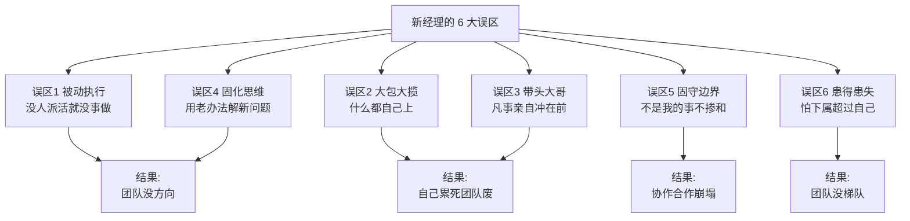
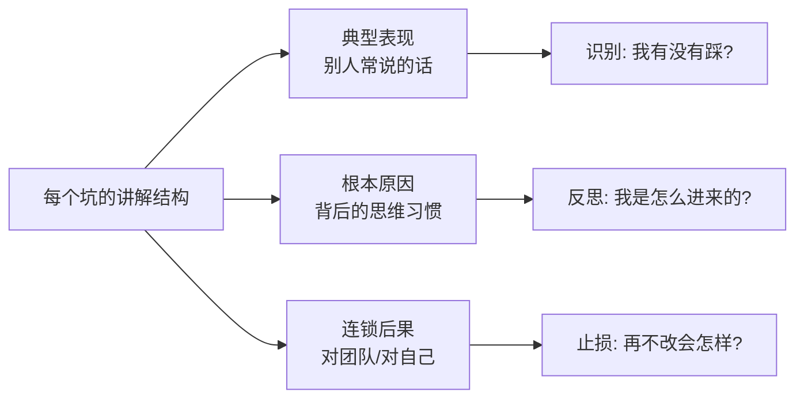
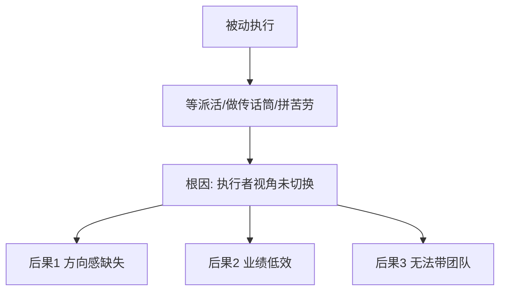
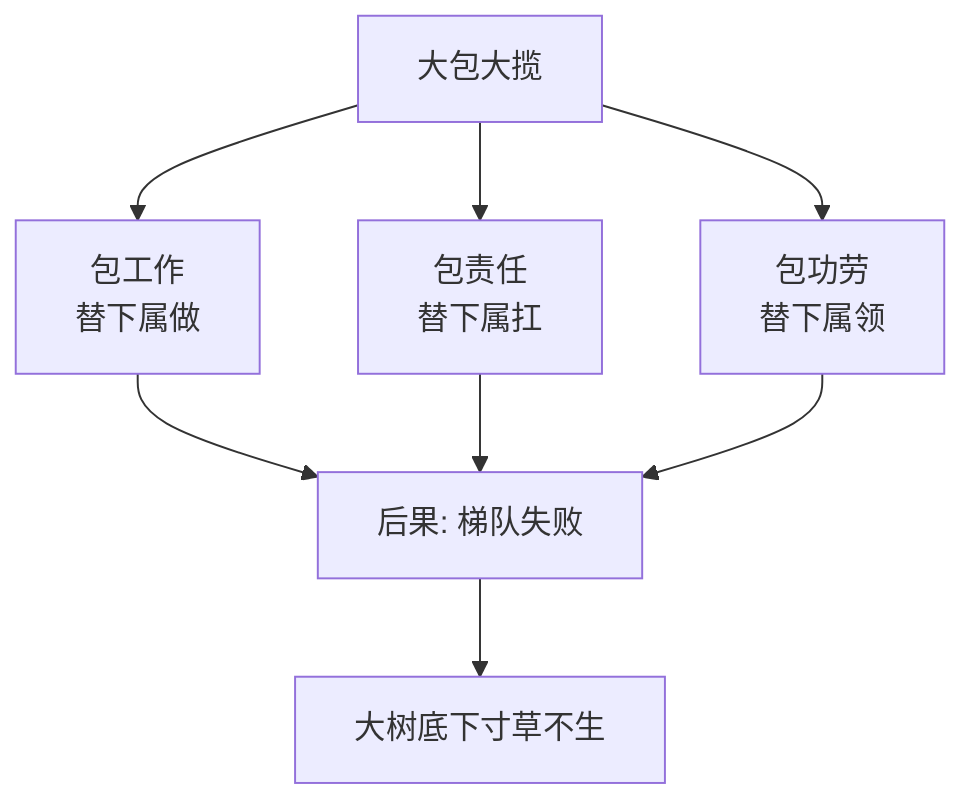
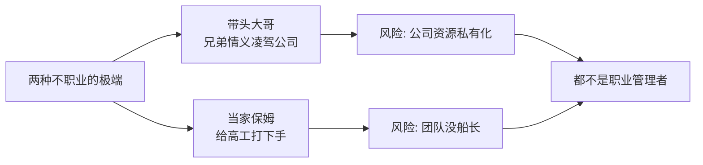
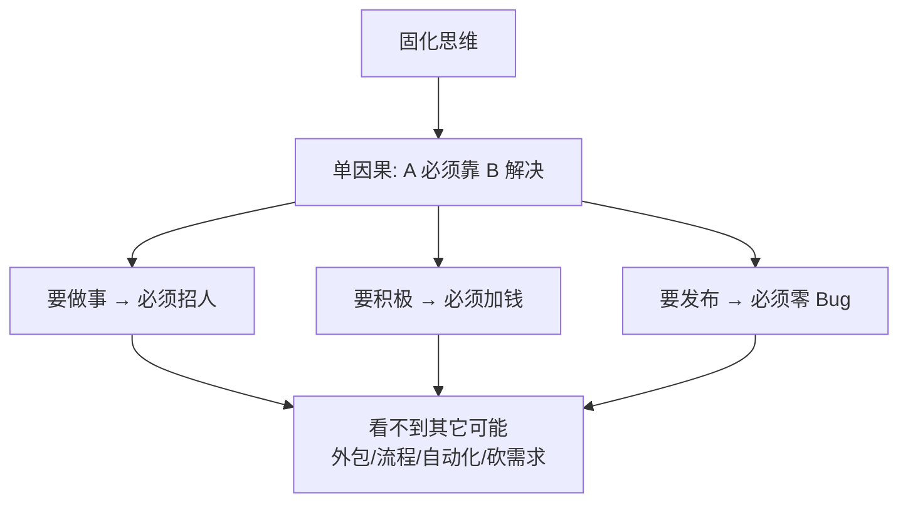
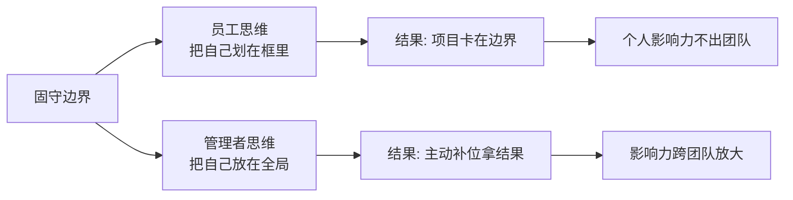
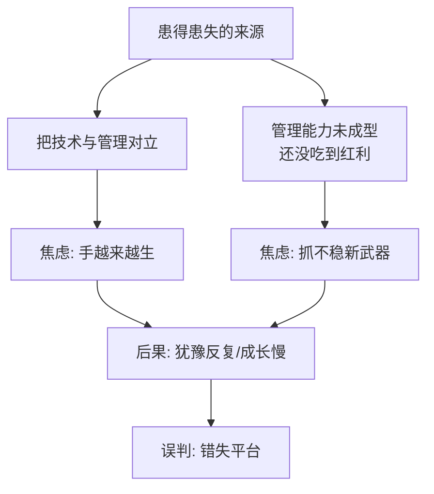

# 1.4管理容易踩的坑

#### 目录介绍

- [01.开头故事引入](#01开头故事引入)
- [02.前言简单的介绍](#02前言简单的介绍)
- [03.误区一被动执行](#03误区一被动执行)
- [04.误区二大包大揽](#04误区二大包大揽)
- [05.误区三带头大哥](#05误区三带头大哥)
- [06.误区四固化思维](#06误区四固化思维)
- [07.误区五固守边界](#07误区五固守边界)
- [08.误区六患得患失](#08误区六患得患失)
- [09.故事的回响](#09故事的回响)
- [10.思考题和作业](#10思考题和作业)

## 01.开头故事引入

**刚当 TL 第一个月做的蠢事。** 我刚当 TL 第一个月，做了整整 6 件事后来回看都想扇自己两巴掌。第一件事是上级没安排任务，我就在工位刷技术文章，心想"没派活就没活干呗"。第二件事是小组新来的同学写的需求文档有问题，我没让他改，直接自己重写了一版。第三件事是团队评审一个技术方案，所有人都等我拍板，我硬是点头同意了所有人都觉得不靠谱的方案。第四件事是别的组找我们协助做一件"半年才用一次"的边缘活儿，我坚决推掉，说"这不是我们团队的事"。第五件事是我做不好团队建设这事，怕做得不好被领导挑刺，结果整整 2 个月没组织过任何团建。第六件事是下属晋升评审前来求助，我表面应付，心里想"他晋升了万一比我强怎么办"。

这 6 件事，一件比一件离谱。但奇怪的是，每件事的当下我都觉得自己"选得挺合理"。直到年底复盘，我才发现这 6 件事精准踩中了新经理最经典的 6 个误区。

**前辈给我画了一张避坑地图。** 年底复盘时，一位做 TL 十多年的前辈听完我的吐槽，在白板上给我画了这张图。

他说："新经理最大的敌人不是上级、不是下属、也不是任务，而是这 6 个从技术思维里带来的老习惯。" 今天这一节，我就按这张地图，把这 6 个坑一个个讲清楚。

## 02.前言简单的介绍

讲误区之前，先同步一个基本认知。

**管理是一门实践科学。** 管理更多的是一门实践科学，从"知道"到"做到"还需要长期地刻意练习。在实际操练过程中，你会碰到各种各样的问题，这会是常态。

**提前知坑才能绕坑。** 如果你能提前知道前面有哪些"坑"是最容易踩到的，你也许就可以提前规避、选择跨过去或绕过去。下面六节就按"典型表现→根本原因→连锁后果"的结构，把每个坑讲透。

## 03.误区一被动执行

**被动执行的典型表现。** 常见的做法和说法包括：不主动找活儿干，总是等待上级派活儿，如果上级没有明确安排就"放羊"；即使上级有了安排，还总是指望上级替他做决定该怎么做、选哪个方案；在和上下级沟通中主要充当"传话筒"的角色，常用句式是"老板说……""某员工说……"，并没有反思每次沟通要达到的目的和效果是什么；过于关注苦劳和付出，常见说法是"某某还是不错的，没有功劳也有苦劳"。这四类行为共同点是什么？都是用"执行者视角"代替了"管理者视角"。

**被动执行的三大后果。** 由于没有从"管理者"的视角出发，至少会带来三个后果。第一个后果是团队方向感缺失，大家都只着眼于手头工作，团队得不到愿景的凝聚和激励。第二个后果是团队做不出有效的业绩，因为团队没有方向感，结果就很难有效。第三个后果是无法带领一个团队，由于视角局限还不具备带领团队的能力。

## 04.误区二大包大揽

**三包行为的典型说法。** 常见的相关说法有："某某做得太慢了，还是我来做吧，他半天的工作我两个小时就搞定了。""团队离了我就不转了，里里外外都靠我操心，他们都担不起这个责任。""某某的工作主要靠我……""在我的指导下，某某才……""这件事主要是我做的……"这些说法可以用三个词概括。

一是"包工作"，作为管理者把团队成员力所能及的工作都做了；二是"包责任"，作为团队负责人把团队成员每个人应该自己承担的责任都包在自己一个人身上；三是"包功劳"，为了体现自己的能干处处凸显自己的功劳，把团队成员的业绩和工作成果也都放在自己头上。由于这类问题突出一个"包"字，所以归纳为大包大揽、唯我最强。

**大包大揽的三个后果。** 你身边一定有这样的管理者，而且对于其中某些大包大揽的行为你可能还挺钦佩他的能力和担当。但是大包大揽会带来三类后果。第一类是梯队问题，大树底下寸草不生，梯队迟迟培养不起来，因为梯队的培养需要授权、需要让高潜人才有发挥空间并承担相应的责任。第二类是激励问题，由于管理者冲得太靠前，团队成员积极性受挫、遇事往后缩。第三类是个人发展问题，由于得不到团队成员的有效支持，自己又忙又累、做不了更大的业务。

## 05.误区三带头大哥

**带头大哥与当家保姆。** 常见的相关说法有："好好干我不会亏待你的，我绝不会让跟着我的兄弟们吃亏！""某某可能会不高兴、可能会离职，怎么办呢？""某某技术比我强，我给他打好下手就行了。" 这三句话其实是两类管理者的表现，合并在一起说。

第一类是"带头大哥"式的管理者，讲究的是兄弟感情，在他们心目中不但兄弟的工作是我的、兄弟人也是我的。这类管理者可能在某些情况下特别有战斗力，但是一旦情况有变，对公司的破坏性也是非常大的，因为他忘记了他带的团队是公司的资源而不是自己的，所以不可能成为一个职业的管理者。

后两句话描述的是和第一类几乎相反的一类管理者——由于团队里有资深的高级工程师，他在技术判断力方面不如这些高工，索性就给这些高工做起了"保姆"，忘记了自己才是这个团队的舵手和船长，因此也不是一个职业的管理者。

**不职业管理的后果。** 把这两类不职业的情况放在一起，归纳为带头大哥、当家保姆。这类问题带来的后果大体如下：不职业的管理风格和文化会给公司带来很大的潜在风险；团队没有方向，所以很难有正确的判断和决策。

## 06.误区四固化思维

**固化思维的典型说法。** 常见的相关说法有："人手不够没人，这真做不了，要做就得招人。""让团队加班的话得给大家发加班费，不然没法提升积极性。""像某某那样的人才适合做管理，我跟他太不一样了，所以不适合做管理。""还有个 Bug 没修复不能发布，我们一直都是这么规定的。" 这些话的共同特征是单一视角、固化思维——往往因为某个要素不具备就否定所有的可能性。比如"要想做事就得招人"、"要想提高积极性就得发加班费"、"只有某某那样的人才能做管理"、"某个 Bug 没修复就不能发布"等等，思维模式非常单一。

**固化思维的后果。** 这样造成的后果是：习惯性卡住，遇到问题和困难很容易被卡住，到处都是绕不过去的鸿沟；认知层次低，由于被单一惯性思维所支配，认知层次和考虑问题的维度无法提升；难堪重任，由于创造性地解决问题的能力不足，难以承担具有挑战性的工作。

## 07.误区五固守边界

**推诿的典型说法。** 常见的相关说法有："这个是测试的问题，这个是产品的问题，这个是别的部门的问题。""产品经理一点逻辑都没有，没法沟通。""这事不赖我们团队，是某某团队没有按时完成。""我查过了，不是我们的问题，惩罚不到我们。" 这类问题的共同特点就是自扫门前雪、固守边界。

角色和责任的边界划分是为了分工和合作，但由于很多大型项目有赖于多个团队一起协作完成，所以又需要有人主动站出来去承担边界模糊的那部分职责。作为一个员工，边界分明无可厚非；但作为一个管理者，就需要以全局的目标为己任，才能拿到公司要的业绩结果。

**自我设限的三个后果。** 这类问题明显的管理者常常带来三种后果：项目推进不畅从而影响全局的结果；自我设限因此个人成长受限；个人影响力无法扩展，因为目光和手脚都局限在团队内所以无法在更大的范围产生影响力，也就无法成为更高级的管理者。

## 08.误区六患得患失

**技术焦虑的典型说法。** 常见的说法有："突然不写代码了，感觉吃饭的家伙没了，心里发虚。""管理工作太琐碎，感觉离技术越来越远，现在特别担心个人发展。""做管理最大的挑战是要舍弃技术，特别难。""管理是个矛盾的事情，自己技术专业性越来越差却要带领整个技术团队。" 这类问题的核心原因是把管理摆在了和技术对立的位置，同时由于管理能力还没有强大到可以作为自己的核心竞争力，因此忧虑自己的技术会落后、从而失去生存能力。这类问题归纳为"患得患失"。

**患得患失的三个后果。** 这造成的后果会有：犹豫反复，无法全力以赴去做好管理、成长缓慢；对技术的看法太狭隘，从而影响技术判断力的提升；由于误判，可能会错失一个好的发展平台。破局之道不是"再回去写代码"，而是把技术作为判断工具而不是生存手段。

## 09.故事的回响

**半年后的避坑成绩单。** 用这张"避坑地图"自查了半年，我把 6 个坑一个个回填了一遍。下面这张表是前后对比。

| 误区 | 开始时状态 | 半年后状态 | 具体变化 |
|------|--------|---------|------|
| 被动执行 | 等上级派活 | 主动提月度规划 | 从"接"到"给" |
| 大包大揽 | 下属任务我重写 | 只做评审不重写 | 下属成长明显 |
| 带头大哥 | 凡事我先冲 | 明确项目 owner | 每月复盘第一责任人 |
| 固化思维 | "没人就做不了" | 用外包/流程/砍需求解决 | 三种以上备选方案 |
| 固守边界 | 不是我的不管 | 主动接 1 个跨团队难题 | 季度加分项 |
| 患得患失 | 怕下属超过我 | 主动推优秀下属晋升 | 一年推出 2 人 |

**我的三个深层领悟。** 第一个领悟：所有管理的坑，根子都在"思维习惯"上，而不是"技巧不够"。第二个领悟：承认自己踩了坑是最难的一步，也是走出坑最快的一步。第三个领悟：避坑的最好办法不是"自律"，而是"每月拿出地图自查一次"，让外部标准替你提醒。

## 10.思考题和作业

**三道思考题。** 第一题，自查题：六大误区中，你最有感觉的是哪一个？上周有没有刚刚踩过？

第二题，选择题：如果必须排序"对团队伤害最大的三个误区"，你会选哪三个？为什么？

第三题，情境题：你的下属两次延期交付，你会选择"自己接手把活干完"还是"让他加班顶上"？各自的坑在哪里？

**三道实践作业。** 作业 A（必做）：把这张"避坑地图"打印出来贴在工位旁，每周末做一次 5 分钟自查。

作业 B（必做）：从六大误区里挑一个你最容易踩的，写一条"避坑规则"给自己（例如"下属交付晚于预期时，禁止自己动手重写"）。

作业 C（选做）：找一位前辈问问他新经理时期踩过哪些坑、是怎么走出来的，把这段故事记下来当你的"反面教材"。

**延伸阅读书单。** 推荐《格鲁夫给经理人的第一课》理解"管理产出 = 团队产出"而不是"你自己产出"；推荐《你就是团队》里对"假性勤奋"的反思；推荐《反脆弱》把"怕下属超越自己"这种自我设限看清楚。

> 本节金句：新经理最难过的坎不是难题，而是承认自己还在用员工的思维做管理。
