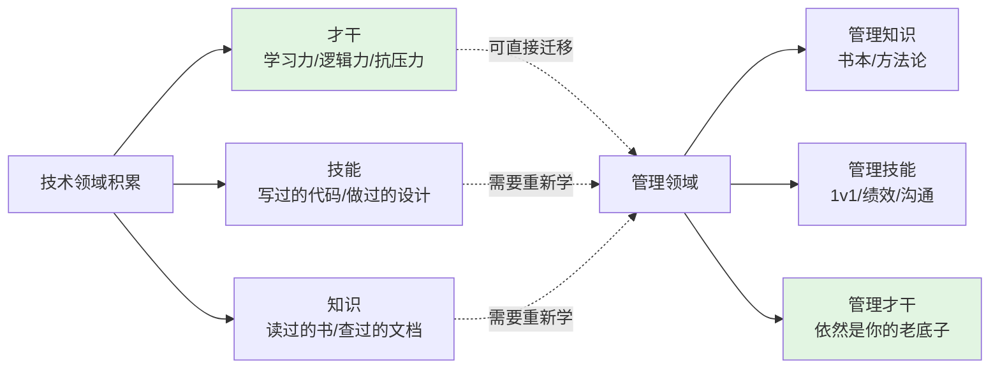
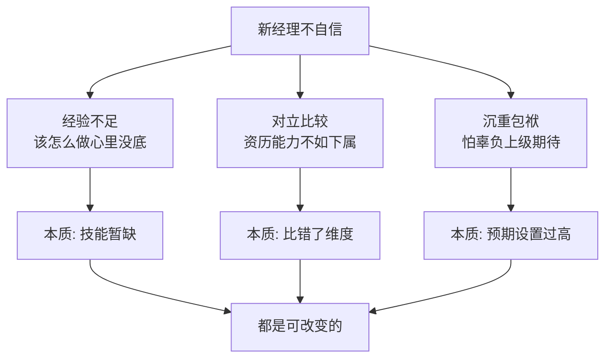
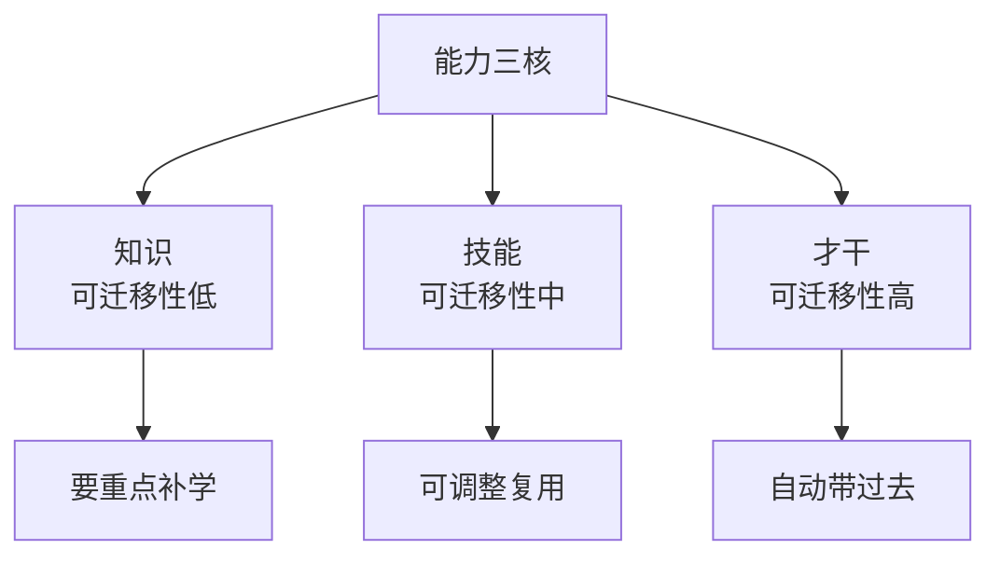
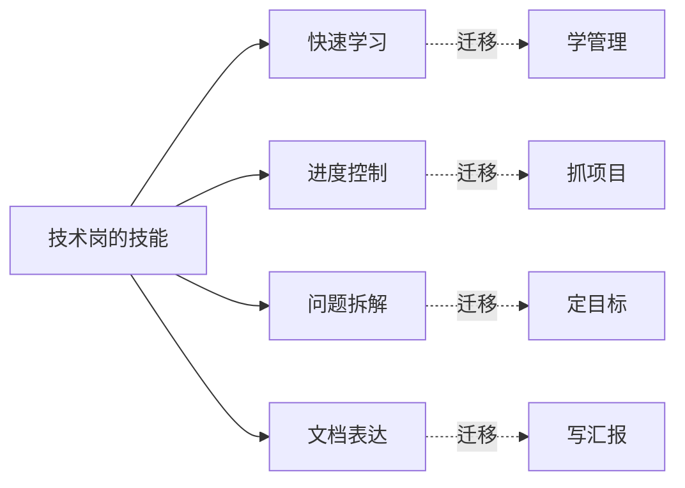
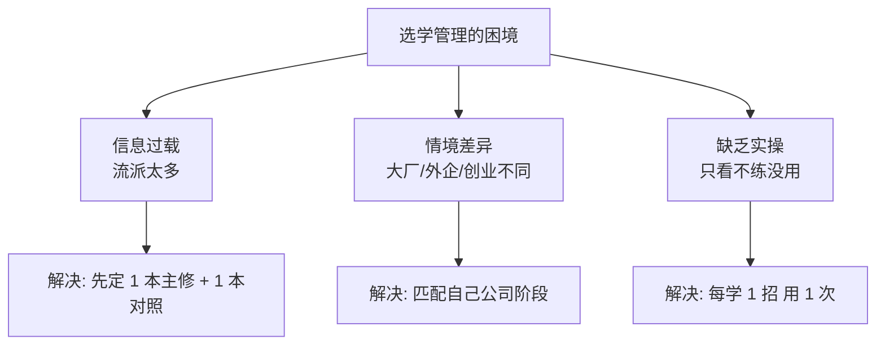

# 1.5如何让大家服我

#### 目录介绍

- [01.开头故事引入](#01开头故事引入)
- [02.做管理遇到困难](#02做管理遇到困难)
- [03.如何去解决迷惑](#03如何去解决迷惑)
- [04.能力三核的说明](#04能力三核的说明)
- [05.提升管理的能力](#05提升管理的能力)
- [06.故事的回响](#06故事的回响)
- [07.思考题和作业](#07思考题和作业)

## 01.开头故事引入

**被老员工当众反驳的那次会议。** 我升 TL 后的第三周，主持了第一次技术评审会。当我讲完我的方案，小组里一个比我资历老 3 年的同学直接说："这个方案我觉得不行，有三个问题……" 他讲了 5 分钟，在场七八个人都沉默了，目光全看着我。

我当时脑子一片空白。一方面觉得他说得有几分道理，另一方面又觉得"他是不是故意给我下马威"。最后我僵硬地说了一句："我们会后再讨论。" 那天散会回工位，我坐下发了 10 分钟呆，脑子里只有一句话循环："我是不是不适合做管理？"

**Mentor 告诉我的能力三核。** 后来我带着这个问题找了当时的 mentor。他没安慰我，只问了我三个问题。你刚写代码时被资深工程师怼，你怀疑过"自己不适合写代码"吗？你刚接手一个陌生系统时被老人吐槽，你怀疑过"自己不适合搞技术"吗？那你为什么第一次被反驳就怀疑"自己不适合做管理"？

接着他在纸上给我画了一张图：知识→技能→才干。他说："新领域的不自信是常态，但你过去在技术领域积累的那些'才干'——学习力、逻辑力、抗压力——是可以直接迁移到管理领域的。你只是缺管理的具体技能，不是缺做管理的潜力。"

这张图让我豁然开朗——原来"不自信"是每个新领域都会经历的阶段，而我从来不是"白纸"上路，我带着过去的全部才干。今天这一节，就把"新经理怎么建立自信"的三步心法讲清楚。

## 02.做管理遇到困难

接受"不自信是常态"之前，先看看这份不自信从哪里来。

**常见的自我怀疑。** 在新经理的常见困惑中，"不自信"是普遍存在的一个情况。尤其是当遇到一些挑战或挫折的时候，很容易产生"自我怀疑"。常见的说法有："这么点小事都没有处理好，我是不是不适合做管理啊？""大家对我的方案有异议，是不是不服我管？毕竟我不是团队里技术最强的。""我进公司晚，资历不如大家老，那应该怎么去管这些'老人'呢？""上级对我的期待那么高，我能做好吗？"

**不自信的三个来源。** 归结起来，新经理不自信的来源主要是三点。第一点是管理经验不足和能力欠缺——对于很多管理事务不知道该怎么着手，在摸索前行中磕磕绊绊，于是怀疑自己没有能力做好管理。第二点是和团队成员对立比较——由于资历或能力不是团队里最突出的，担心团队里资历老或能力强的团队成员会不服自己，尤其是当这些人提出不同意见的时候常常会引起新经理的挫败和颓丧。第三点是背负着沉重的包袱——因为担心管理工作做不好会辜负上级的期望，所以带着很大的压力去工作。

## 03.如何去解决迷惑

把问题归因之后，就有了解法。

**新事物的必经阶段。** 这是每位管理者的必经阶段，其实也是学习所有新事物的必经阶段。你想想你刚接触技术工作的时候，是不是也经常会碰到一些不知所措的问题呢？只不过不同的是，技术问题往往有比较标准的答案，通过查资料就能解决大部分问题；而管理问题则很少有标准答案，很多经验和技巧是在不断实践的过程中积累起来的，掌握起来不像技术问题那样可以查查资料就快速解决。这也正是管理有挑战的地方。

**能力迁移是最快路径。** 那么有没有一些方法可以帮助你快速提升管理能力呢？答案是有的，你可以从之前的工作经验中迁移一些能力过来。你可能会说，之前的工作经验以技术为主，有什么能力可以迁移过来呢？为了回答好这个问题，先介绍一个能力层次模型叫"能力三核"，这个模型把能力分为三个层次：知识、技能和才干。

## 04.能力三核的说明

可以按照知识、技能、才干这三个层次梳理一下自己的能力。虽然很多知识层面的能力很难对管理产生直接帮助，但可以把一些技能和才干迁移过来，帮助你做好管理工作。同时，建立能力的分层意识也会让你更加迅速而有效地积累管理经验。

**知识。** 知识是指你知道和理解的内容和信息，一般用深度和广度来衡量。由于大部分知识都是基于特定工作场景的，所以这部分能力迁移性不好。也就是说，你很难把技术知识直接迁移到管理中来，所以关于管理的知识是新经理要重点补习和加强的。

**技能。** 技能是指你能操作和完成的技术，一般用熟练度来衡量。这个层次的能力就有一定的可迁移性了。比如快速学习的能力——如果你在做技术时积累了快速学习的良好方法和技能，可以稍加调整运用到学习管理中；再比如进度控制能力——你在做工程师时如果对完成一个项目有很好的进度控制能力，就可以把控制进度的方法和要点运用在管理工作中。

**才干。** 才干是你长期生活工作所积淀和锤炼出来的模式、特质和品格。这个层次的"能力"是迁移性最强的，换句话说，你想不迁移过来都难——学习力、逻辑力、抗压力、责任心、沟通习惯，这些都不会因为换了个岗位而消失。真正要做的，就是相信"自己过去积累的底子"，而不是每次都被新情境打回"我是白纸"的自我叙事。

## 05.提升管理的能力

理解了"能力三核"，接下来看看新经理在"技能层"和"知识层"上要补的三个典型短板。

**管理技能积累不多。** 很多人当上管理者都是被赶鸭子上架的，还没做好准备就被"安排"了。虽然公司选拔的一般都比较主动、沟通技能比较好的人，但是这两点只是管理技能中很小的一部分，光是满足这两点，离合格的管理者还有很大的差距。

**管理知识的多样性。** 管理本身其实是一门和专业技术同等级别的学科，但是很多人都没有系统地学习过。大部分人对管理的印象都来自平时工作中对自己 Leader 的观察，这样的学习既不系统也不全面，而且 Leader 也不一定是优秀的管理者，运气不好可能会学越糟糕。

还有很多人在晋升为管理者之后，会想要通过看书学习的方式提升自己的管理能力，但是打开网站一搜可能就傻眼了——书籍五花八门方法多如牛毛，德鲁克、明茨伯格、稻盛和夫、任正非、马云、陈春花、华为管理法、谷歌管理方法等等，看得人眼花缭乱，但还是不知道到底应该跟谁学。

**管理的不确定性。** 技术人员习惯确定性的思维，而管理却需要面对人的不确定性。俗话说，有人的地方就有江湖。怎么让别人信服你、怎么让不同的人达成共识、凝聚力量，没有看上去那么简单，并不是把正确的做法告诉别人就可以了，也并不是你认为最优的做法大家就一定会赞同。所以技术人员晋升管理者后，往往会面临这样的困境：不知道做什么、不知道怎么才能做好。面对不确定性，答案不是"更努力地寻找确定性"，而是"学会和不确定性共处"——这需要你把"怎么让大家服我"这个问题，从"我要证明自己"转成"我要持续创造价值"。

## 06.故事的回响

**半年后那位老员工的反馈。** 半年后，那位当初当众反驳我的老员工在一次 1v1 结束时说了一句话，让我记了很多年："其实那次我故意想看你怎么接。你那句'会后再讨论'当时我觉得你慌了，但后来我发现你真的每次都把我会上提的点带回来认真回复我，这点我服了。" 下面这张表是那半年我的"让人服"指标变化。

| 维度 | 升 TL 第 1 个月 | 升 TL 第 6 个月 | 变化 |
|------|--------|---------|------|
| 评审会主动被反驳次数 | 每周 2~3 次 | 每周 0~1 次 | ↓ |
| 下属来找我 1v1 主动倾诉 | 0 次/月 | 5 次/月 | ↑ |
| 老员工主动支持我的决策 | 否 | 是 | 质变 |
| 自我怀疑频率 | 每天 | 每月 1~2 次 | ↓ |
| 上级对我的综合评价 | 待观察 | 超预期 | ↑ |

**我的三个深层领悟。** 第一个领悟：下属不服的不是"你技术比他差"，而是"你对他的质疑不认真"。第二个领悟：让人服的不是你"赢了争论"，而是你"始终在解决问题"。第三个领悟：自信不是"我证明了我能"，而是"我允许自己暂时不能"。

## 07.思考题和作业

**三道思考题。** 第一题，自查题：你近一个月有没有被下属或同级"顶"过？你的第一反应是"他不服我"还是"他说的有没有道理"？

第二题，选择题：在"知识/技能/才干"三层里，你从技术岗能带到管理岗的最强"才干"是哪一条？请举出一件具体事例。

第三题，情境题：你带的团队里有一位比你资历老 5 年的高工，每次方案评审他都有不同意见，你会怎么处理这种"老员工"关系？

**三道实践作业。** 作业 A（必做）：列出你过去 3 年最值得骄傲的 3 件事，分析每件事锻炼了你什么"才干"，这份清单就是你的管理底子。

作业 B（必做）：选一本公认的经典管理书作为主修（推荐《卓有成效的管理者》或《格鲁夫给经理人的第一课》），每周读 1 章 + 当周落地 1 条。

作业 C（选做）：找一位你"最不自信"时期的老同事，问他当年是怎么看你的，听听你意想不到的正面评价。

**延伸阅读书单。** 推荐古典《跃迁》理解"能力三核"与迁移；推荐《卓有成效的管理者》作为新经理主修；推荐《掌控谈话》学习"被反驳时怎么接话"的具体话术。

> 本节金句：让别人服你之前，先允许自己暂时还做不好；"让人服"不是赢辩论，是持续解决问题。
