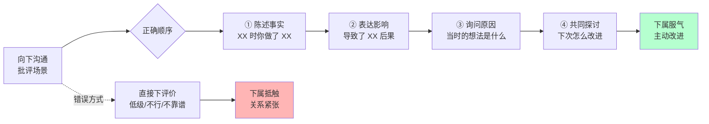
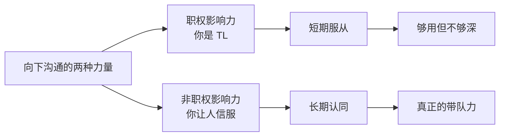
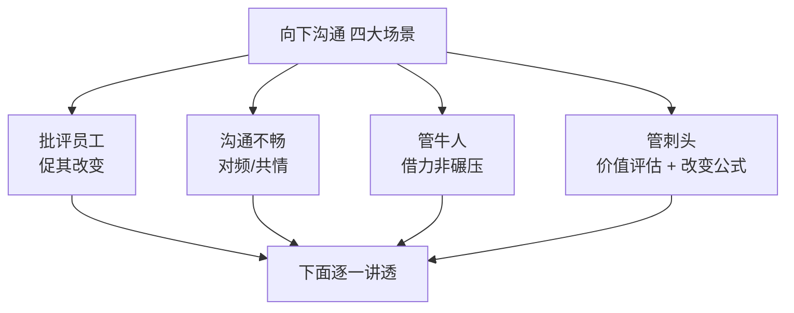
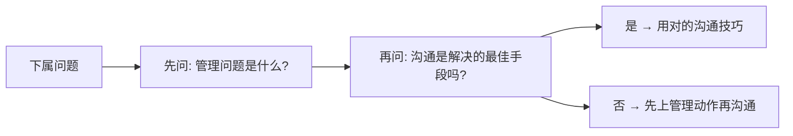
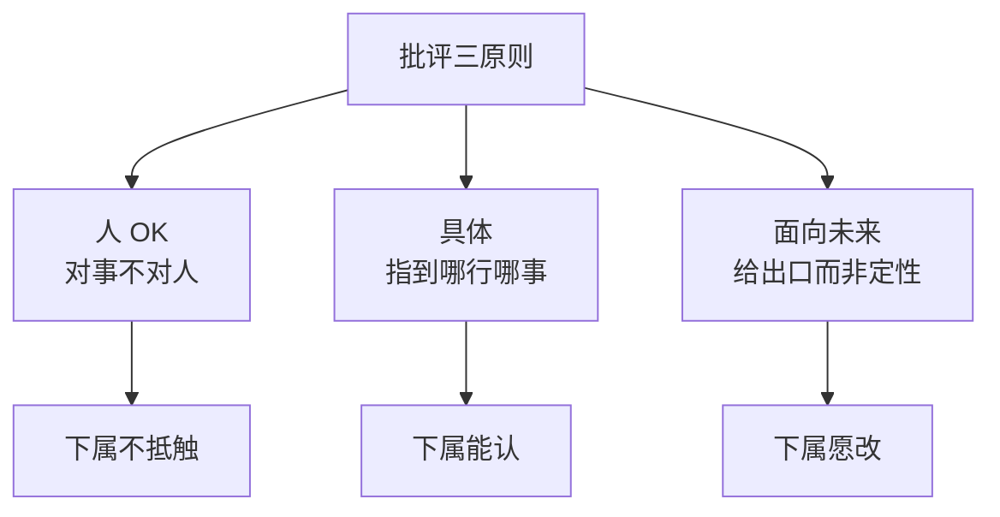
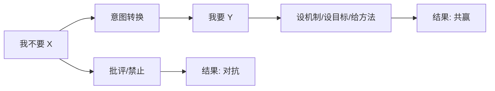
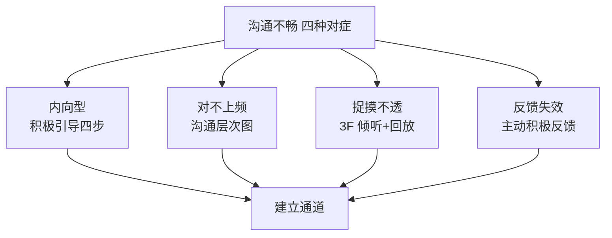
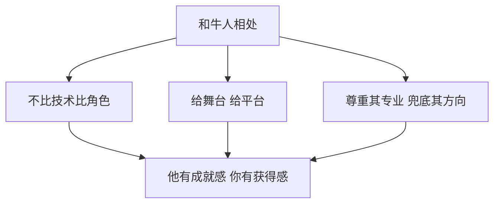
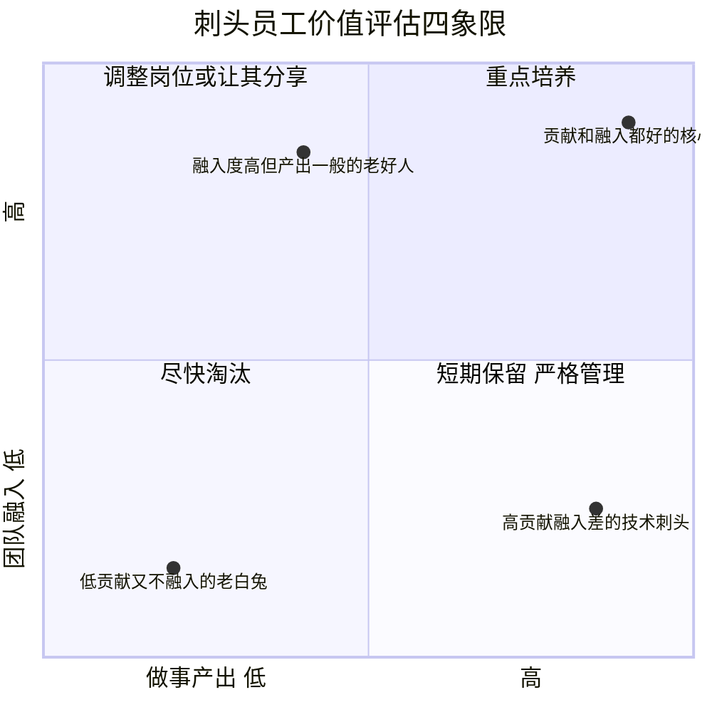
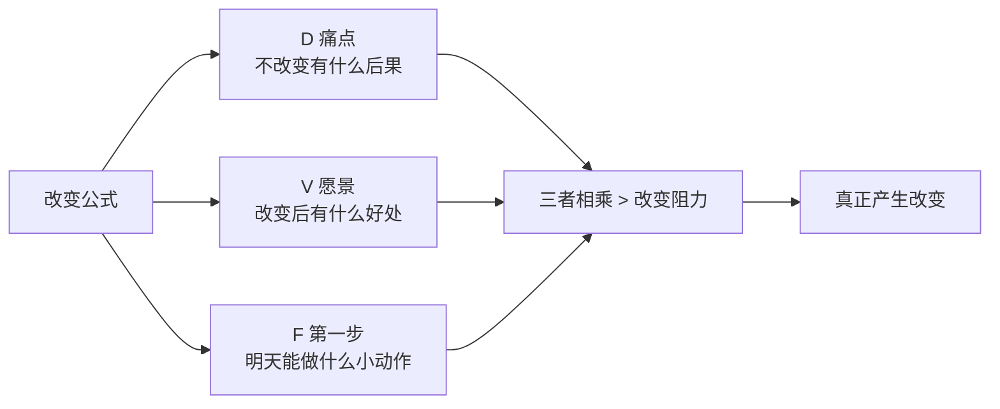

# 2.6管理之向下沟通

#### 目录介绍

- [01.开头故事引入](#01开头故事引入)
- [02.向下沟通的介绍](#02向下沟通的介绍)
- [03.向下沟通四大类](#03向下沟通四大类)
- [04.探讨前一些思考](#04探讨前一些思考)
- [05.如何去批评员工](#05如何去批评员工)
- [06.和下级沟通不畅](#06和下级沟通不畅)
- [07.如何管牛人下属](#07如何管牛人下属)
- [08.如何管刺头员工](#08如何管刺头员工)
- [09.故事的回响](#09故事的回响)
- [10.思考题和作业](#10思考题和作业)

## 01.开头故事引入

**批评下属反而被怼回来。** 组里的小 Z 上线时忘记加灰度，直接全量推了一个改动，结果出了一个 P2 故障。我当天 1v1 约他谈，本来准备好要"严肃批评"一下。我一开口："这次上线没加灰度，是一个很低级的失误……" 话还没说完，小 Z 就打断我："你不是说要给我成长空间吗？我不就是想试一下直接全量？出问题又不是我一个人的事，Review 的时候你也在啊！"

我当场脑子一片空白，憋了半天只说了句："你先回去反思一下吧。" 结束后我一个人在会议室坐了十分钟——我明明是 TL 手里有"评绩效"这把尚方宝剑，为什么一次批评反而像我被批评了？

**老同事提醒我的三件事。** 后来一位做过 HR 的老同事听完，给我指出了三件我做错的事。第一件是没讲"事实"只讲"评价"——一开口就是"低级失误"是给一个事情贴标签，人家天然抵触。第二件是没给"共情"只给"结论"——没问过他"当时为什么会这么操作"。第三件是没留"台阶"只留"指责"——没给他说"我下次可以怎么改进"的空间。

向下沟通的难点不在"说得对"，而在"让对方愿意听你说"。今天这一节，把批评员工、沟通不畅、管牛人、管刺头这四种场景的沟通心法讲透。

## 02.向下沟通的介绍

**比向上沟通容易的原因。** 技术管理者最挑战的管理主题中，向下沟通也名列前茅，仅次于向上沟通、员工激励和团队凝聚力建设。你是否会好奇，显然我们和下级的沟通比和上级更频繁，为什么挑战反而比向上沟通要小呢？向下沟通，我们除了可以依靠非职权影响力之外，职权影响力也在发挥作用，因此很多向下沟通的挑战就被职权影响力化解了。但这只是"看似简单"——真正要让下属从心里认同你、主动推进，职权影响力是远远不够的。

## 03.向下沟通四大类

**如何批评员工。** 第一类也是反馈最多的一类是询问"如何批评员工"。这类常见的说法有："A 的项目总是 delay，每次沟通她总是态度积极、表示一定改正，但行动上却还是老样子，我该怎么批评她呢？""B 的工作做得很粗糙，不追求精益求精、只是做完而不是做好，我要怎么批评他才能让他改正缺点又不打击他的干劲儿呢？""C 的周报发得特别水，请假也不提前打招呼，我问她什么原因，虽然她的解释有一定道理，但是我还是想让她改掉这些问题，有什么办法吗？""公司实施弹性工作制，D 本来 10 点就到公司了，但发现其他人都没来觉得不公平，以后他就故意来晚、结果造成部门的工作时间整体推迟，但是这又很难批评他一个人，你有什么主意吗？""E 不以解决问题为导向、发现问题后不主动跟进解决，总是推托说这不是他的问题，我平时也会跟他说要多担当但是没有效果、该怎么批评他让他改正缺点呢？"

**沟通不顺畅。** 第二类是沟通不顺畅。常见的说法有："在沟通的时候 A 特别沉默、什么都不愿意反馈，问一句答半句、每次沟通都是草草了事，我也发愁后续怎么和她沟通。""和 B 总聊不到一个频道上，我聊目标他聊困难，我聊进展他聊原因……毫无默契可言。""我就从来不知道 C 在想什么，她常常口头上说的是一回事、其实内心想的是另一回事，捉摸不透无法知道她的真实诉求。""D 之前经常会把做出来的成果给我看，我每次都说了'很棒'啊，可为啥看她的反应还是情绪不高、挺闷闷不乐啊？"

**和牛人下属较量。** 第三类是和"牛人"下属之间的较量。常见的说法有："我们团队的 A 技术架构能力很强、独立工作能力也很好，我很难对他的发展和工作给出建议和帮助，不知道怎么带他。""我和团队里的架构师 B，常常在一些技术决策上发生争执，有点合作不下去了。""我团队的 C 成长很快，感觉他越来越不服我，我是不是得把技术捡起来了？"

**应对刺头员工。** 第四类是不知如何应对一些"刺头"员工。常见的说法有："A 总是越级汇报，我非常反感但是又拿他没办法，他特别会讨好我的上级。""B 总是挑活还很固执，怎么辅导也改不了，真是头疼。""C 总是暗示我给他升职加薪，可是我觉得他能力还不够，怎么跟他沟通才能不打击他的积极性呢？""D 特别情绪化、动不动就跟人吵架，经常在会上乱怼一通，大家都不愿和他共事，可是他技术能力挺强的怎么辅导他呢？"

## 04.探讨前一些思考

**先管理后沟通。** 通过上面大家反馈的问题你会发现，虽然大家都认为这是一个"向下沟通"的问题，但是如果我们脱开管理逻辑单纯去探讨如何"沟通"，就会掉入"舍本逐末"的陷阱，导致在和员工沟通的时候很苍白无力、收效甚微。探讨管理沟通问题的时候，需要有"管理逻辑"和"沟通方法"两个层面的视角。所谓"管理逻辑"，就是首先弄清楚这是个什么管理问题，并从管理角度来看完整的解决方案应该是什么样的，然后再来看"沟通"该如何来实施。

**两个举例说明。** 这听上去会不会比较虚？下面举例说明。例一：很多管理者会咨询"如何和低绩效员工做绩效沟通？" 这显然没有意识到更重要的是绩效管理本身，沟通只是绩效管理的一环而已。所以要想解决低绩效员工的绩效沟通问题，首先要从绩效管理入手、然后再来看如何实施沟通。例二：很多管理者会问"员工积极性不高如何和他沟通呢？" 你不难发现，沟通效果好的话的确可以对员工起到激励的作用，但是这整体上是一个员工激励的问题，沟通是不是最有效的手段呢？这需要我们从管理视角和沟通视角两个层面来思考。

## 05.如何去批评员工

关于"如何批评员工"这类问题最为普遍，为什么呢？因为对于一个我们不认可的行为，第一反应就是认定"对方不应该"，于是我们就要通过"批评"这样的手段来"纠正他的错误"。所以你会发现，批评背后的真实意图是"促其改变"。而很多管理者并没有认识到这一点，因为他们所采取的手段和真正的意图直接产生了矛盾——不但不能促使对方改变，甚至还封闭了对方改变的道路。

**不要违背的三原则。** 一旦违背了三个批评的原则，"促其改变"的效果就很难达到。第一个是"人是 OK 的"原则，即对事不对人，批评事、不要打击人，更不能给人贴标签。第二个是具体性原则，指出具体哪里做的不好让对方容易认同。第三个是面向未来的原则，体现负面的暂时性和过去时并提供改变的"出口"。

**具体如何批评。** 在教练领域有一个 AID 批评法，大体上也遵循了上述原则，具体分为三步。第一步是指出具体的言行上的问题而不是人的问题，问题一定要具体不要抽象、也不要模糊不定。第二步是指出该问题带来的影响或者造成了什么问题，把后果分析一下。第三步是期待的结果，探讨如何去达成结果的行动，或者提出改进的建议。

**意图转换。** 当你意图从"你不想让员工跨级汇报"变成了"我想让我们三个人之间的信息保持同步"后，批评员工就不再是最好的选择了。所以当你遇到一些不符合期待的问题时，建议先从"我不要……"这种意图中走出来，问问自己"我要什么"。然后再来审视采取什么手段是最合适的，这就叫意图转换。

## 06.和下级沟通不畅

这就需要用一些工具和技巧来辅助沟通了。针对四种典型场景介绍几个工具。

**内向沉默型用积极引导四步。** 对于内向沉默的员工，可以使用"积极引导四步法"引导员工打开话匣子。主要话题不必局限于工作，跟员工建立起沟通关系和沟通通道是首要任务。积极引导四步包含：从非工作小话题切入（家人、兴趣、周末）、用开放式问题让其说话、听完真诚回应不评价、最后再回到工作上。

**对频困难型用沟通层次图。** 对于总聊不到一个频道上的员工，可以使用"沟通层次图"，从事实、感受（判断）和意图三个层面来和对方进行频道对齐——你在哪一层说话、对方也拉到哪一层，频道就对上了。

**捉摸不透型用 3F 回放。** 对于捉摸不透的员工，也可以使用"沟通层次图"或"3F 倾听"来分辨对方表达的内容。为了避免误会，可以做一些回放和复述，使用类似这样的话术："你是不是这个意思？""你看我的理解对不对？" 这样就可以大幅度减少沟通偏差了。

**反馈失效型用主动积极反馈。** 对于如何给员工的表现进行反馈，推荐使用"主动积极式反馈"——具体事例 + 具体影响 + 表达欣赏 + 鼓励继续。相比泛泛的"很棒"，能让对方知道"哪里棒"并愿意继续棒下去。

## 07.如何管牛人下属

**角色认知是关键。** 从称谓就可以看出，"牛人"下属肯定属于做事很给力的那类员工，常常是专业能力很强的技术高工和架构师。作为管理者，你如果还在和自己团队的架构师在技术上一较高下、甚至是"你死我活"地争执，那么这就不是一个沟通问题而是一个典型的管理问题——确切地说是管理角色认知问题。你作为管理者就要很好地认清自己的角色，认识到自己是团队的带路人和负责人，而不是要和架构师站在一个层次上去争高低输赢的。在这方面我们得向汉高祖刘邦学习一下，他是靠什么把各个方面的"牛人"拢到一起的呢？靠的不是自己事事比别人强，而是让每个牛人都有舞台、有目标、有尊重。

**与牛人相处的三心得。** 与牛人高工相处的心得大致有三条：第一，认清自己的角色——你不是要比他更强，而是要让他更强。第二，把资源和平台给他——让他的技术判断能落地。第三，真诚请教 + 必要时拍板——技术问题让他拿主意、但方向和取舍由你兜底。

## 08.如何管刺头员工

**先做价值评估。** 澄清一下什么叫"刺头"员工——我们约定那些需要你付出非常多的时间和精力去管理的员工叫做"刺头"，也就是管理成本很高的员工。既然是从管理成本角度来看待这类员工，那我们就需要首先从投入产出比来评估一下：这个员工是否值得你耗费那么多管理成本？毕竟你作为一个团队的 leader 是需要对整个团队的发展和业绩负责的，你的角色需要你把精力投入到那些对团队和业绩最为有效的地方，这无关情感和道德。判断值得不值得，可以从团队和做事两个方面来看。

**改变公式的使用。** 评价出来之后，需要淘汰的很明确；如果有需要改变的怎么办呢？关于如何促使一个人做出改变，美国学者理查德·贝克哈德的改变公式可以给我们一些指导——改变 = 痛点 × 愿景 × 第一步 > 改变阻力。你要改变一个人，可以从他的"痛点"、"痒点"出发，并和他一起制定"迈出第一步"的行动计划，从而去帮他克服掉改变的阻力。

## 09.故事的回响

**三个月后团队氛围变化。** 用 AID、沟通层次图、改变公式跑了三个月，小组数据如下。

| 维度 | 冲突期 | 三个月后 | 变化 |
|------|--------|---------|------|
| 1v1 后下属主动约第二次 | 0/月 | 4/月 | 质变 |
| 批评后有行为改进 | 1/5 | 4/5 | +3× |
| 刺头员工离职/改造 | 未处理 | 1 改造 1 优化 | 落地 |
| 下属主动分享问题 | 很少 | 常态 | 质变 |
| 团队氛围满意度 | 3.2/5 | 4.5/5 | +1.3 |

**我的三个深层领悟。** 第一个领悟：批评的真正目的不是"发泄我的不满"，是"促成他的改变"。第二个领悟：所有沟通问题，先判断是不是管理问题。第三个领悟：对刺头下狠手的勇气，就是对其他好员工的最大负责。

## 10.思考题和作业

**三道思考题。** 第一题，自查题：上次你批评下属，有没有在第一句话就贴标签（低级/不行/态度差）？

第二题，选择题：和牛人下属的分歧，你选择"硬压"、"完全听他的"、还是"给定边界让他发挥"？

第三题，情境题：团队有一个高产出但极度不融入的刺头，你留还是让走？理由。

**三道实践作业。** 作业 A（必做）：下次 1v1 强行使用 AID 三步法，全程不贴标签，结束后自我打分。

作业 B（必做）：给你团队每个下属贴一个象限（四象限价值评估），三个月后再评一次看变化。

作业 C（选做）：用"改变公式"帮你一个你最想改变的下属写一份"一个月改变计划"。

**延伸阅读书单。** 推荐《关键反馈》理解 AID 与 BID 的进阶；推荐《谈话的力量》系统学沟通层次；推荐《拥抱 B 选项》与《非暴力沟通》帮你控情绪。

> 本节金句：向下沟通的不是话术，是你愿不愿意让对方"在你面前放下防备"。
