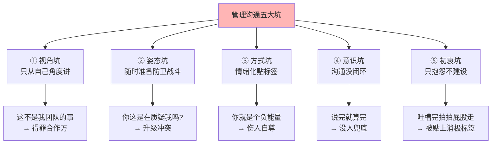
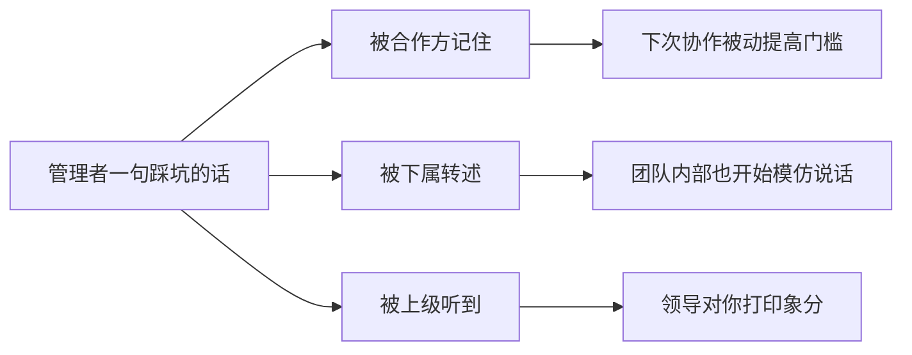
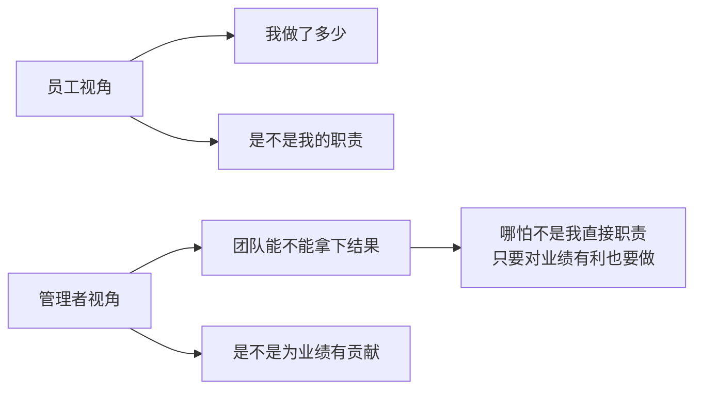
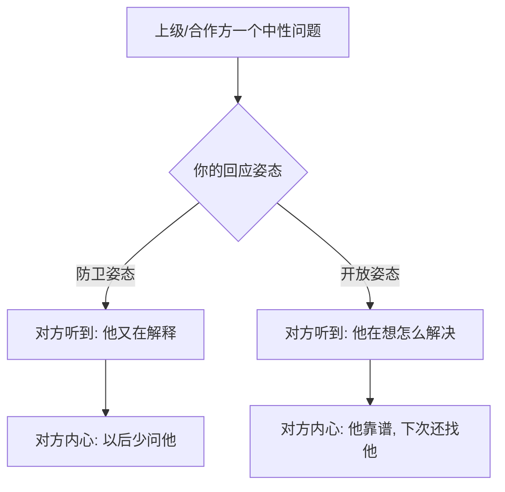

# 2.8 管理沟通一些坑

#### 目录介绍

- [01.开头故事引入](#01开头故事引入)
- [02.沟通五坑的地图](#02沟通五坑的地图)
- [03.视角坑角色认知](#03视角坑角色认知)
- [04.姿态坑随时防卫](#04姿态坑随时防卫)
- [05.方式坑情绪贴标](#05方式坑情绪贴标)
- [06.意识坑没有闭环](#06意识坑没有闭环)
- [07.初衷坑抱怨无建](#07初衷坑抱怨无建)
- [08.故事的回响](#08故事的回响)
- [09.思考题和作业](#09思考题和作业)

## 01.开头故事引入

**一句话让整个团队记恨我三个月。** 我接手一个小组不到一个月，部门里来了一个要跨组支持的紧急项目。我团队当时也忙，我在跨组群里脱口而出："这不是我们团队的事，别找我们。"

这句话在群里还没沉下去五分钟，我老板就私聊我："你这话说错了。" 接着给我打电话讲了半小时。更让我后悔的是，此后整整三个月，其他部门的同事对我们团队的协助需求都变得"懒洋洋"——人家说话也客气，但眼神不对，推进速度比以前慢一倍。

那天之后我才明白，管理者的一句话不是说给一个人听的，是说给一整张合作网听的。你以为你只是在回一条消息，其实你在给自己团队的外部信用评级打分。

**五种沟通误区的深坑。** 这件事让我重新审视自己——我以前以为"沟通"就是"把话说清楚"，其实沟通里有五个大坑，踩中任何一个都会让你之前辛苦积累的人际资产快速清零。

越是高位的管理者，在这五个坑上翻车的代价越大——因为你的每一句话都会被下属、合作方、甚至上级放大解读。今天这一节，就把这五个坑一个一个摊开来讲，每个坑配一句我当年踩坑时说过的"原话"。

## 02.沟通五坑的地图

**五坑的分类与对应场景。** 先把这五个坑列在同一张表上，你能一眼看到它们分别源自哪里、后果是什么、在日常中最容易出现的场景。

| 坑名 | 根源 | 常见场景 | 典型后果 |
|---|---|---|---|
| 视角坑 | 角色认知不够 | 跨团队协同、领导加码 | 被判定"格局小" |
| 姿态坑 | 自我保护过度 | 被追问进度、被挑毛病 | 被判定"说不得" |
| 方式坑 | 情绪管理差 | 下属犯错、合作方拉胯 | 被判定"没胸襟" |
| 意识坑 | 闭环意识缺失 | 消息未读、任务漂移 | 被判定"不靠谱" |
| 初衷坑 | 只输出情绪 | 遇到不合理规则 | 被判定"抱怨机器" |

**五坑对你威信的隐形扣分。** 一线员工踩坑，最多被扣一次小分；而管理者踩坑，会被连带扣掉团队的分，你的每句话都在影响别人对你团队的整体印象。

## 03.视角坑角色认知

**典型原话与场景还原。** 视角坑的核心症状是——只从"我这边"的立场出发看问题，这是角色认知不到位的直接表现。

在项目攻坚初期，有的技术管理者会这样说："需求还没有出来，为什么我们团队要陪产品团队一起 996？" 当上级要求运营任务的时候，有些管理者会这样说："为什么要我们团队傻傻地去点赞？这个又不在我们团队的职责范围内。" 在评审产品设计的时候，有些技术管理者会这样说："怎么会有这么二的设计，一点儿逻辑都没有！" 在确认产品功能和效果的时候，有的产品团队管理者会这样说："怎么研发老是自作主张，看不懂需求文档吗！"

如果这类说法是出自一位管理者之口，无论是技术团队的管理者，还是产品团队的管理者，其视角就未免有些低了。

**员工视角与管理者视角的本质差异。** 先来阐述一个简单的逻辑：一线员工是用工作量来评估价值的，他们只要做出了自己该做的，就是有价值的；而管理者是用团队业绩来评估价值的，即便不是管理者个人的原因，只要结果是团队不出业绩，那么管理者的价值就很难体现。而且，如果"不幸"其团队成员都很能干的话，就更加凸显出管理者的失败。

**拉高视角的三个抓手。** 管理者要做出好的业绩，就需要站高一层，站在自己上级的视角来和各个团队协同，以收获共同期待的成果。大部分时候，帮合作团队一起做好工作，也是为了自己的业绩，你并不会吃亏。

具体到每天要做的事情上，第一是把部门的年度目标贴在桌子上，开会之前先看一眼，提醒自己"我们团队在整张大图里是哪一块"；第二是主动承接一点点非本职的事，让跨团队感觉到你是帮忙的人，而不是推事的人；第三是在本团队内部禁用"这不是我们的事"这种短语，改成"这件事里我们能帮到什么"。

## 04.姿态坑随时防卫

**典型原话与场景还原。** 姿态坑的核心症状是——总觉得对方在针对自己，每一句话都先从"自我保护"出发。

上级问："按照计划进度不是要到 60% 了吗，怎么才到 40% 啊？" 有的管理者这样回答："这也不能怪我啊，产品变更需求了！" 上级问："约定好的流程为什么没有走呢？" 有的管理者这样回应："为啥其他人不走流程你就不说，我已经很认真了啊，流程有这么多问题，我工作又这么紧张……" 合作者说："这里有个问题，帮忙看看怎么回事吧。" 有的管理者这样回应："这不可能，肯定是你看错了"，或者说："只能做成这样子，我也没办法。" 合作者问："这个 BUG 有多大影响？" 有的管理者这样回应："我估不出来，你找别人吧！"

**对方听到这种回应的真实感受。** 对于以上四个管理者的回应，如果你是他的上级或合作者，你会是什么感受呢？我估计你会有如下两个直接反应。第一是疑惑和僵住："我也没说啥啊，咋就毛了呢？这话茬没法接下去了啊……" 第二是远离和放弃："这人说不得啊，没法交流，以后少打交道吧。"

**摘下防卫姿态的两句口头禅。** 防卫姿态对于管理者做好工作不会有正向价值，长此以往，就等于关闭了别人提供帮助的大门，任其自生自灭，这显然是个双输的结果。所以，工作中最好还是以做事为主，少考虑一些个人感受。如果就事论事地去沟通问题，反而会赢得更多合作者的尊重。

有两句话我自己天天在用：一句是"这个问题我记一下，下午给你答复"，替换掉"我估不出来你找别人"；另一句是"这里是我没考虑到的，我们一起看下怎么补"，替换掉"肯定是你看错了"。这两句的共同点是——把"我"从审判席上移到协作席上。

## 05.方式坑情绪贴标

**典型原话与场景还原。** 方式坑的核心症状是——沟通时用"人"代替"事"，先给对方贴一个负面的标签。一旦给人贴上了标签，对方也就放弃了改变自己的意愿，失去了改变自己的动力。因为"反正在你心目中已经是这样的一个人了，何必徒劳无功呢"。

管理者这样对下属说："你怎么这么不靠谱，这么简单的事儿你都搞不定！" 对下属相似的说法还有："你能不能务实一些？你能不能踏实一些？你能不能努力一些？你能不能用点脑子……" 管理者这样抱怨合作方："太脑残了，就没见过你这样的！" 管理者这样对合作的产品经理或设计师说："你到底懂不懂怎么做产品，你根本就不懂设计。"

对于以上四类说法，或许有两种可能：管理者就是想发泄情绪；管理者借情绪表达自己对下属和合作方的期待。只不过，无论是哪种情况，这样的说法都换不来下属和合作方的改变。

**贴标签对管理者的三重损失。** 作为一个管理者，如果没有注意到自己这个沟通方式的弊端的话，你将会承担这样的损失。第一是别人成了你眼中的"屡教不改"，你看不到别人的改变。第二是你在别人心中失去了管理者的威信，大家会觉得你没有管理者的胸襟和风范。第三是和你同心同德的人越来越少，团队人心涣散。

| 你说的话 | 下属听到的潜台词 | 下属的反应 |
|---|---|---|
| 你怎么这么不靠谱 | 我在他心里就是这种人 | 躺平不再改 |
| 用点脑子行不行 | 他觉得我蠢 | 不愿思考, 只执行 |
| 你根本不懂设计 | 我说的都白搭 | 不再主动提想法 |

**从"贴标签"切到"讲事实"的公式。** 一旦意识到问题所在，解决起来倒也简单：学会管理自己的情绪，就事论事地来讨论事情。我日常在用的公式叫"事实 + 影响 + 期待"。比如把"你怎么这么不靠谱"改成："这个需求你漏掉了 A 点（事实），上线后用户投诉了 30 单（影响），下次我希望你在提测前把需求文档逐条打勾（期待）。" 这个公式比骂人有效一百倍。

## 06.意识坑没有闭环

**典型原话与场景还原。** 意识坑的核心症状是——没有形成良好的"沟通闭环"意识，认为消息和邮件发出去了，接收到的人就应该都及时看到；任务安排出去了，别人就得无失真地接收到。

常见的情形是：你发了一条消息石沉大海……你发了一封邮件石沉大海……你安排了一项任务石沉大海……然后开始扯皮："我说了啊；我发了啊；我安排了啊；我通知了啊……" 对面则是："我没看到；我没收到；我没注意；我不会做；我觉得没那么重要；我觉得没那么急；我没时间；我看不懂；不该是我干……"

**闭环意识的三步动作。** 既然是意识问题，应对这类问题的办法也是建立觉察，意识到这一点：不能默认对方一定能收到，而且不能默认对方理解的和你想的是一致的。所以，对于你关心的问题，一定要去确认清楚，跟进到底，形成沟通闭环。

**闭环的三句通用话术。** 第一句是"收到请回一个 1"，用于大群发消息，强制让对方留下一个读痕。第二句是"你再跟我讲一遍你要怎么做"，用于当面交任务，确认对方理解到位。第三句是"我们约定周三下午三点同步一次进度"，用于长周期任务，提前把下一次对齐钉在日历上。

## 07.初衷坑抱怨无建

**典型原话与场景还原。** 初衷坑的核心症状是——沟通初衷只剩下发泄，没有给出应对的建议和解决方案。想必你也肯定和这样的管理者打过交道吧？他们共同的特点就是发泄抱怨。

常见的情形有："这个规定太不合理了，没法遵守！""我们在指定日期肯定做不完，没戏！""这个设计很不合理，完全不考虑用户体验！""团队的氛围太差了，郁闷！"

**意图转换的底层逻辑。** 作为管理者我们需要清楚一点，的确会有很多事情是我们掌控之外的，其中不乏不合理或不完善的。对于这样的情况，发泄抱怨则意味着我们内心深处已经对此无能无力了。而实际上，我们也许并不需要完美地解决这个问题，我们也把事情往好的方向上推进了一点点，这也是我们的价值。

应对这类问题，需要做的是意图转换，从"我不要……"转换到"我想要……"，然后看看有哪些事情可以做。

**四句抱怨的自问自答。** 比如对于上述四个问题，我们可以这样问自己。"这个规定太不合理了，没法遵守！" 问自己：那么，怎么样就合理了？"我们在指定日期肯定做不完，没戏！" 问自己：那么，什么条件满足之后，就能做完呢？或者，认为什么时候能做完？"这个设计很不合理，完全不考虑用户体验！" 问自己：那么，怎么样会合理一些呢？"团队的氛围太差了，郁闷！" 问自己：那么，怎么做氛围会变好一点点呢？

通过问自己这些问题，相信你会有"意外"的发现，而正是这些"意外"的发现，才是你的创造力、价值以及管理能力的体现。

## 08.故事的回响

**五坑一年后的量化对比。** 那句"这不是我们团队的事"让我吃了整整三个月苦头，之后我按这五个坑逐一校准自己说话方式，一年后回看，数据上的变化是实打实的。

| 观测维度 | 踩坑时期 | 意识校准半年后 | 变化 |
|---|---|---|---|
| 跨部门协助请求响应速度 | 平均 3.2 天 | 0.9 天 | 提速 3.5 倍 |
| 下属主动汇报频率 | 每周 1.2 次 | 每周 4.6 次 | 提升 280% |
| 任务布置后遗漏率 | 38% | 6% | 下降 84% |
| 被上级点名"说话有格局" | 0 次 | 5 次/季 | 从 0 到有 |
| 团队对我信任分(NPS) | 22 | 71 | +49 分 |

**作者亲历后的三点领悟。** 第一点领悟是，管理者的嘴是团队的名片。员工说错一句，是个人失误；管理者说错一句，整个团队要跟着还利息。所以每次开口前，先在心里默念一下："这句话被录音了播给全公司听，我还说得出口吗？"

第二点领悟是，沟通的效率不是说得多快，而是闭环得多牢。以前我把"我已经说了"当成自己尽责的证据，后来才明白，对方没接住之前，这条消息跟我没发是一回事。真正的尽责是持续追到闭环落地。

第三点领悟是，抱怨是最便宜的表达，建议是最贵的能力。一个管理者在团队里的溢价，不在于你比别人更敏锐地发现问题，而在于你比别人多迈一步——给出哪怕只是半个解决方向。这半步，就是你区别于一线员工的全部原因。

## 09.思考题和作业

**三道思考题。** 第一题：回想你过去一个月里说过的最"冲"的一句话，按本文的五坑地图，它属于哪一坑？当时如果换成"就事论事版"，你会怎么说？

第二题：你所在组织里，哪一种坑最容易被当成"性格直"被默认？这种默认对整个部门沟通氛围的长期伤害是什么？

第三题：如果你每天只能改掉其中一个坑，你会优先改哪一个？改掉之后，你预期最先发生变化的信号是什么？

**三个可执行作业。** 作业 A：给自己做一份"本周口误记录"。每天下班前用 3 分钟回忆今天说错的一句话，归到五坑之一，并写出"应该怎么说"的替代句。坚持两周，复盘进步曲线。

作业 B：挑一个你最常忽略闭环的任务类型（例如消息群发、跨部门协作、小任务分配），为它设计一套三步闭环模板（发起话术 / 复述话术 / 追踪话术），本周试用到三次实际场景中。

作业 C：找一个你最近抱怨过三次以上的问题，用"意图转换"写出三件你这周能做的小事（哪怕只推进 1% 也算），按一周为周期执行，记录事后变化。

**延伸阅读书单。** 《关键对话》——帮助你在高风险、情绪化的场景里仍能把话说清楚。《非暴力沟通》——系统讲"观察—感受—需要—请求"的四步法，专治贴标签。《第 5 项修炼》——从系统思维的角度理解为什么你一个人的抱怨背后往往是整个结构的问题。《金字塔原理》——教你把抱怨翻译成有结论、有支撑、有建议的表达结构。

---

**本节金句**：你每说一句话，都在给自己的团队的外部信用评级打分；管理者嘴里没有小事，只有被放大的事。
