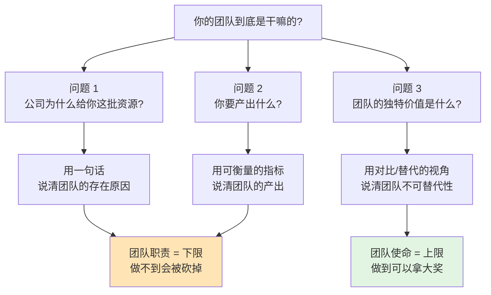
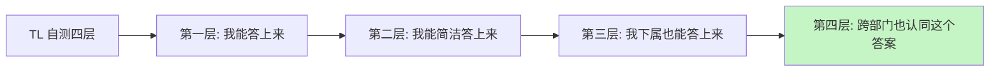
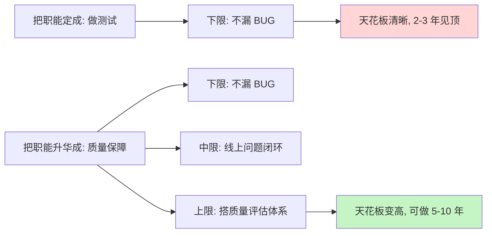
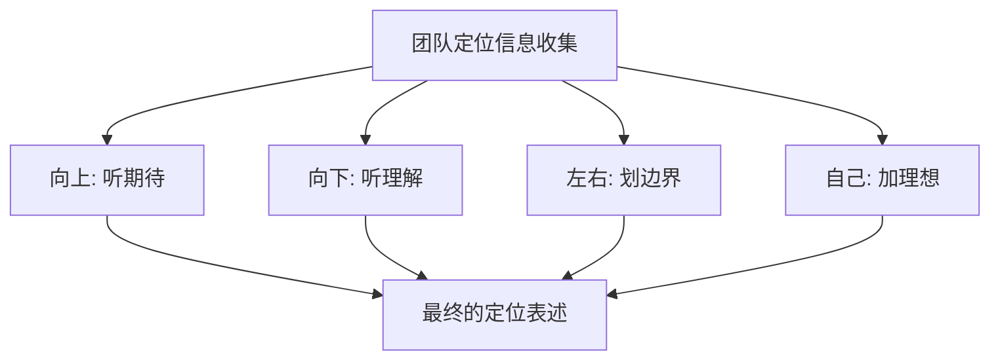

# 3.1 界定团队干什么

#### 目录介绍

- [01.开头故事引入](#01开头故事引入)
- [02.界定团队的职能](#02界定团队的职能)
- [03.明确团队的职能](#03明确团队的职能)
- [04.讲一个通俗案例](#04讲一个通俗案例)
- [05.团队职责和使命](#05团队职责和使命)
- [06.故事的回响](#06故事的回响)
- [07.思考题和作业](#07思考题和作业)

## 01.开头故事引入

**老板的一句"你团队到底是干嘛的"。** 那年半年度述职会，轮到我上台做汇报。我讲了 15 分钟，满满都是数字："我们做了 20 个需求、上线了 8 个功能、处理了 50 个工单、推动了 3 个跨部门合作……" 讲完我很满意地坐下。

结果老板抽着烟问了我一句："你讲了半天我就想问你一个问题——你团队到底是干嘛的？如果把你这个团队撤了，公司会少什么？"

我当时大脑直接卡壳。我能讲出"我们做了什么"，却讲不清"我们这个团队存在的独特价值是什么"。事后我想了很久，这个问题就像一道灵魂拷问——如果一个 TL 连自己团队的定位都讲不清楚，怎么指望下属有方向感、怎么指望跨部门给你资源？

**前辈告诉我的"三连问"。** 后来我请教一位资深总监，他给了我一个简单但极有杀伤力的工具——团队定位三连问。

他说："每一个管理者都应该在脑海里反复回答这三个问题。答不上来，就是你团队随时可能被砍掉的信号。" 今天这一节，就从这个"三连问"开始，讲如何给自己的团队做准确定位。

## 02.界定团队的职能

**多数管理者没真正想清楚。** 如何明确界定一个团队的职能？真正用心思考自己团队的职能，并用简洁凝练的几个词或一句话提炼出来的管理者只是少数。大部分 TL 开口讲团队都是在列工作清单，而不是在讲团队价值定位。

**判断自己是否清楚的三连问。** 要判断自己是否真的清楚团队职能，你可以试着问一下自己这三个问题。第一个问题：公司为什么要给我这批资源（指这个团队）？第二个问题：是希望我产出什么？第三个问题：这个团队存在的独特价值是什么？你用什么维度来衡量团队的价值高低？

你能立即对这三个问题做出回应吗？如果能够毫不迟疑地作答，说明你很清楚自己团队的职能。如果你的表现确实如此，想追问一句："你可以用很简洁的语言来陈述它吗？" 如果你的答案依然是肯定的，想再追加一个问题："你团队的成员，也都能准确无误地说出来吗？"

能走到第四层的 TL，不超过 10%，这也是为什么越往上走，"团队定位"这件事的分量越重。

## 03.明确团队的职能

**职能的两个层次总览。** 究竟该如何明确团队的职能定位呢？首先，介绍一下团队职能的两个层次：基本的职责和升华的使命。

| 层次 | 含义 | 来源 | 举例（移动端团队） |
|---|---|---|---|
| 职责（下限） | 至少要完成 | 上级给定 | 保证每个项目高质量开发和顺利发布 |
| 使命（上限） | 做好可承担更大 | 你规划 | 沉淀通用组件、建行业标准、扩大影响力 |

**职责是下限,做不到会失职。** 职责，是团队职能的下限，即至少要完成的工作，如果这些职责都搞不定，意味着团队的基本价值都不能体现。拿移动端团队来举个例子，他们的基本职责就是要保证每个项目高质量开发和顺利发布，如果项目常常不能按时保质完成，就说明前端团队连基本的职责都不能胜任。

团队的基本职责，是由上级给定的，上级在把这个团队交给你负责的时候，已经给你提了期待，只不过有的上级会明确交代，而有的上级默认你很清楚。所以，你无论如何都需要弄清楚团队的基本职责，否则肯定会失职。

**使命是上限,做好能拿更多资源。** 使命，是团队职能的上限，即如果我们团队做得好，就能承担更大的职责，体现出更大的价值。使命达成后的愿景，常常是令人期待和憧憬的。

还是拿移动端团队来举例子，如果团队的 leader 认为，除了保证项目的高质量发布之外，还能做出一些通用组件、服务平台，甚至是行业标准，在整个前端领域都有更大的影响力，那么这就是这位 leader 为团队规划的使命和愿景。

使命不是摆设，它意味着在每年争取人头、争取预算、争取跨部门合作时，你有一张更大的牌可以打。

## 04.讲一个通俗案例

**一位觉得"没挑战"的测试经理。** 一位测试经理，他带的测试团队工作非常认真负责，他个人和他团队在整个技术部有口皆碑，很受认可。就是这么靠谱的一位 leader，一天突然说想看看别的发展机会，因为做了几年测试，工作太熟悉了，没有挑战，也没有成长。

**用三个追问撬开他的使命感。** 于是我问他："你觉得你团队的工作没有挑战，你能否告诉我你团队是做什么的吗？" 他说："我负责的是测试团队，负责交付高质量的项目，目前大家做得不错，也比较熟练。" 我继续问他："你的团队叫'QA'团队，你知道'QA'是什么意思吗？" 他回答说："Quality Assurance，质量保证吧？" 我继续问："既然你负责咱们公司所有产品的质量保证工作，那你觉得就是做好测试吗？" 他若有所悟。

我继续对他说："如果你认为自己团队就是做测试的，保证项目的高质量发布就是你的使命；而如果你把用户能感知到的所有产品质量问题，都纳入质量保障的工作范畴，那你团队还有太多的事情没有做，比如线上质量问题的搜集、整理、跟进、解决、反馈等，以及你是否搭建了产品质量的评估体系。显然都还没做。"

**做"测试"和做"质量保障"是两个职业。** 所以你看，一个仅仅做好测试工作的团队 leader，和一个能搭建公司完整质量保障体系的团队 leader，挑战和能力要求是一样的吗？你是否也感受到了，团队职责的升华，可以为自己和团队带来何其广阔的发展空间？你是否还认为团队使命是可有可无的呢？

## 05.团队职责和使命

**第一步 收集信息。** 团队职责和使命的界定，不是闭门造车，而是从四个方向收集信息。

向上沟通，听听上级对你团队的期待和要求，以及希望用什么维度来衡量你做得好还是不好。这个信息非常重要，团队的初始定位和基本职责一般都是上级直接给定的。

向下沟通，主要是和大家探讨对团队业务的看法和理解，以及对未来发展的期待，为以后的沟通做好铺垫。

左看右看，主要是看职能定位的边界在哪里，最好和兄弟团队的职能是无缝对接的。但不要覆盖兄弟团队的职责，否则会带来各种合作上的冲突。其实，快速发展的公司要做的事情非常多，海阔天空，即便是广度不够，深度也还有作为空间，真没必要和兄弟团队争抢地盘。

你的理解，即你对业务的理解、对领域的理解、对团队的期待，以及对自己的期待。团队的更高职责，即团队使命和愿景，往往来自于你的设想。

**第二步 提炼和升华。** 团队的职责和使命，不能只停留在 leader 的脑海中，为了方便记忆和传播，则必须从上述信息中进行提炼和升华。提炼和升华有三个要点。

职责的提炼，基于上级的期待和要求，以及你对业务核心价值的理解，最好用上级和团队成员、兄弟部门都易于理解的语言，对职责进行简短化提炼，并尽可能长时间稳定下来。

使命的升华，基于基本职责，寻找团队对于部门和公司的独特价值，并和行业发展趋势结合，设定自己的期待。要注意使用基于"结果"的描述，而非基于"过程"的描述。比如保证项目交付质量，是对结果的描述；而负责项目测试，则是对过程的描述。相比之下，基于结果的描述会更有使命感。

确定衡量维度，一般来说，团队的职责和使命决定了衡量的维度，但是如果有明确的关于衡量维度的说法，会让员工对职责和使命有更深刻的理解。常见的案例是：服务端团队会特别重视性能、稳定性、扩展性等维度；前端团队往往重视开发效率、兼容性、安全性等维度；数据团队关注数据准确性、完整性、及时性、安全性等维度。你也需要根据自己团队的职能，向员工明确传递，什么指标维度对团队是最重要的。

**第三步 确认和主张。** 提炼完成之后，接下来就是确认和主张。确认主要是和自己的上级确认，得到上级的认同和支持后，就可以向团队内外进行主张了。当然，最好是在合适的场合，比如季度会、合作沟通会等，有计划、有步骤地把团队的职责和使命宣贯给大家。团队职能的设定和宣贯是一个长期工程，不要期待一蹴而就。当然，如果做得好的话，效果也很快就能显现出来。

## 06.故事的回响

**半年后重新述职的数据对比。** 那次被老板问"你团队到底是干嘛的"以后，我花了两个月做了团队定位的三连问与重新宣贯，半年后再看数据，变化是我自己都没想到的。

| 观测维度 | 被灵魂拷问前 | 定位重做半年后 | 变化 |
|---|---|---|---|
| 我能一句话说清团队价值 | 不能 | 能 | 从 0 到 1 |
| 下属能准确复述团队使命 | 0/8 | 7/8 | +87.5% |
| 争取年度人头 | 申请 4 批 2 | 申请 4 批 4 | 通过率翻倍 |
| 跨部门主动找我们合作 | 2 起/季 | 9 起/季 | 增长 350% |
| 年终评优 | B | A | 跨一档 |

**作者亲历后的三点领悟。** 第一点领悟是，定位讲不清，所有的努力都在做无用功。我以前总想着"埋头干活，结果自然好"，被这句拷问后才明白，你干的事别人不认同是你团队应该干的，干多少都白搭。定位是让"努力变成价值"的翻译器。

第二点领悟是，职责给的是下限，使命决定的是天花板。只讲职责，你团队永远只能拿到"刚刚够用"的资源；只有把使命讲出来，你才有机会申请更多人、更多预算、更多机会。

第三点领悟是，定位不是一个人在会议室里想出来的。我后来在做团队定位时，先向上问、再向下听、再左右看，最后才加上我自己的理解。定位的"认同半径"决定了它有多结实——只有上下左右都认同的定位，才经得起一次组织架构调整。

## 07.思考题和作业

**三道思考题。** 第一题：如果明天公司做一次组织架构裁撤，需要砍掉 20% 的团队，你的团队为什么不该是被砍的那一个？用一段 60 字以内的话回答，然后问自己这个回答有没有被老板和跨部门同事"听到过"。

第二题：你现在对团队的描述，更偏"过程型"（做测试、做开发、做运营）还是更偏"结果型"（保障质量、构建平台、驱动增长）？两种描述对你申请资源的说服力差多少？

第三题：你团队里有没有"使命感缺失"的老员工？他们的倦怠是不是因为职责早就熟练，但你没给他们画过更大的画面？

**三个可执行作业。** 作业 A：写一份《团队定位三连问答卷》。用一页 A4 纸的篇幅，把三连问的答案用尽可能简洁的语言写出来，先自己改三版，再找上级对一次。

作业 B：本周开一次内部宣贯会。把定位答卷讲给团队听，让每个人用自己的话复述一次团队使命，记下与你原版差异最大的表述——那就是你还没讲清楚的地方。

作业 C：做一张"兄弟团队边界图"。把部门内所有平级团队的职责都列出来，用一种颜色画出你团队的边界，找出三处与邻居职能"粘连"或"真空"的地方，在下次部门会上跟总监正式对齐。

**延伸阅读书单。** 《从 0 到 1》——帮你理解"独特价值"这件事对一家组织（乃至一个团队）意味着什么。《好战略，坏战略》——区分"口号式战略"和"真战略"，对你写团队使命特别有帮助。《华为基本法》——看看一家巨头怎么用一份文档把全公司的定位锁死。《OKR 工作法》——把职责与使命翻译成能被每个人执行的目标。

---

**本节金句**：一个讲不清自己团队在干嘛的 TL，不是在带团队，而是在等被优化；定位，是你从"干活的人"升级成"带队伍的人"的第一道分水岭。
