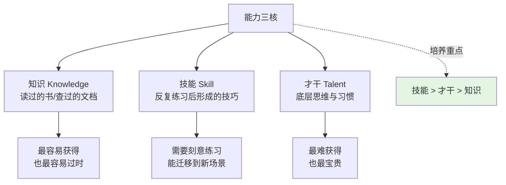
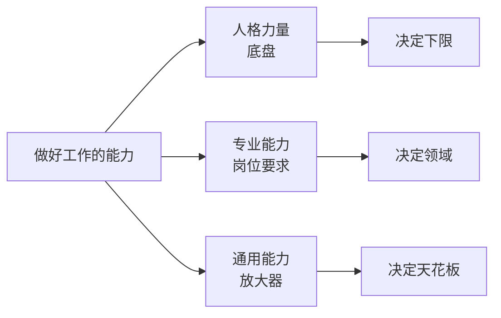
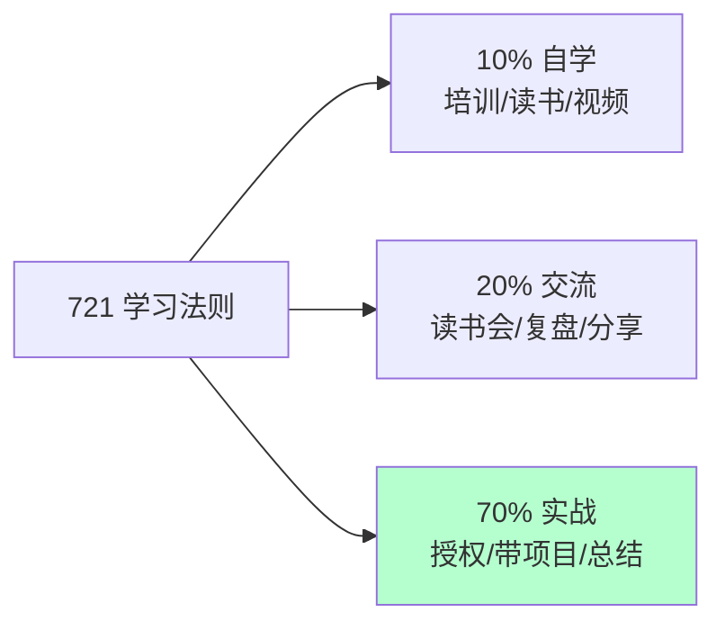
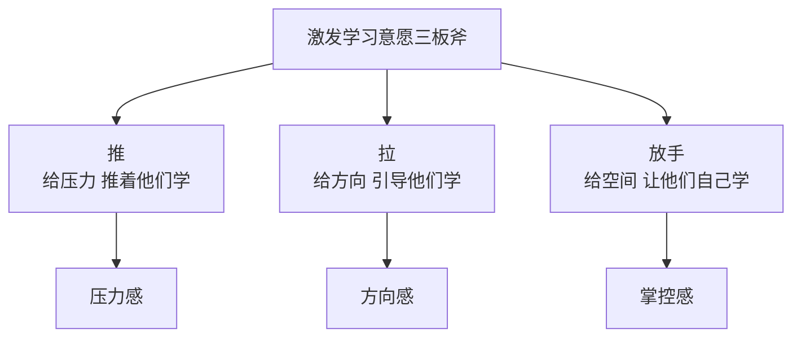
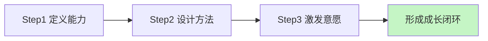

# 3.4 提升员工的能力

#### 目录介绍

- [01.开头故事引入](#01开头故事引入)
- [02.提高战斗力前提](#02提高战斗力前提)
- [03.工作能力的划分](#03工作能力的划分)
- [04.着重提高的能力](#04着重提高的能力)
- [05.达到提升的目标](#05达到提升的目标)
- [06.激发学习的意愿](#06激发学习的意愿)
- [07.提升员工的信念](#07提升员工的信念)
- [08.提升员工的梳理](#08提升员工的梳理)
- [09.故事的回响](#09故事的回响)
- [10.思考题和作业](#10思考题和作业)

## 01.开头故事引入

**团队招的人很牛产出却很差。** 我团队有个 P6 同学小 Y，简历漂亮、面试表现炸裂，我当时认定"这是我招到的最聪明的人"。结果入职半年下来，给他的需求都能按时做完，但每一次复盘都能找出 3 个可以做得更好的地方；让他独立带一个技术方向，结果做了一份 30 页的文档，没有任何可落地的决策；季度总结，他说自己学了 Vue、Rust、设计模式，但工作里一样都没用上。

我私下和他 1v1："你觉得你这半年成长在哪里？" 他想了很久说："我学了很多东西啊。" 我问："那怎么变现成工作价值？" 他愣住了。那一刻我也愣住了——我招到了一个学习能力很强的人，但他并没有变成一个产出能力很强的人。

**一位前辈把"能力"这件事讲透了。** 后来我请教一位做人才发展的前辈，他给我画了一张图，把我从"学了很多但用不上"的迷雾里拉了出来。

他说："小 Y 的问题很典型——他一直在补知识，却没刻意练技能。知识是水，装在脑子里容易蒸发；技能是肌肉，练一次少不了一次。管理者培养员工，最该重点投入的是技能这一层。" 今天这一节，就讲如何用"能力三核"模型有针对性地帮员工成长。

## 02.提高战斗力前提

**从团队战斗力回到个体能力。** 提升团队战斗力的基础和前提，是提升员工的个体能力。显然，如果一个团队中员工的个体能力都不提高，整体的战斗力又如何提上去呢？战斗力不是打鸡血打出来的，它从底层看就是每个人的能力叠加。

**搞清楚"要提升哪种能力"这一步最容易被跳过。** 要探讨如何提升员工的能力，第一个要回答的问题就是——你要提升员工的什么能力？"工作能力"这个概念看似具体，其实在沟通中会产生很多误会和分歧。那么工作能力到底有哪些呢？很多 TL 直接跳过这一步去讲方法论，结果员工学了一堆没用的。先定义清楚再谈培养，这是所有员工能力提升的第一步。

## 03.工作能力的划分

**能力三核 知识 技能 才干。** 这里介绍一下关于"能力"的两个最常见的划分方法。

第一个分法，就是探讨"管理自信"时提到的"能力三核"，把人的能力分为知识、技能和才干三个层次。如果没有说错的话，大部分管理者希望员工提升的能力是在"技能"这个层次，也就是员工能操作和完成的技术，比如快速学习能力、进度控制能力等。

| 层次 | 含义 | 获取方式 | 容易过时? |
|---|---|---|---|
| 知识 | 你知道什么 | 看/听/读 | 非常容易 |
| 技能 | 你能做到什么 | 刻意练习 | 较慢 |
| 才干 | 你是什么样的人 | 多年沉淀 | 几乎不过时 |

**另一个分法 人格 专业 通用。** 第二个分法，是把做好一份工作的能力分为人格力量、专业能力和通用能力。人格力量是底盘（责任心、学习意愿、抗压性），专业能力是标签（前端、后端、算法），通用能力是放大器（沟通、表达、项目管理、结构化思考）。

大部分 TL 容易只盯着专业能力，忽略通用能力——结果专业做得很强的人，到了 P7 就上不去了。

## 04.着重提高的能力

**把重心放在"技能"层。** 通过上面的分层次探讨不难发现，提升员工个人能力的重点会放在工作技能层面，包括专业能力和通用能力。这两类能力可练、可迁移、可增值，是"投入产出比"最高的培养对象。

**什么能力够用就好 什么能力持续拔高。** 那么，要把这些能力提升到什么水准呢？或者说，其中的哪些能力够用就好？哪些能力要持续不断地提升呢？

关于这个问题的答案，我得先请你回答一个问题：你提升员工个人能力的初衷是什么呢？你也许会毫不迟疑地回答说："当然是为了做好工作了，这还有什么疑问嘛！" 但这个回答背后藏着一个陷阱——有些能力在当下这个岗位"够用就好"，而不是"越高越好"。

一般原则是：和岗位强相关的能力要持续拔高；和岗位弱相关的通用能力做到"不拖后腿"即可；与职业长期发展强相关的能力（学习、沟通、结构化思考）要一直投入。

## 05.达到提升的目标

**721 学习法则。** 关于做哪些事情来帮员工提升个人能力，相信你会有自己的经验和偏好。但也不外乎"7-2-1"法则：10% 靠听课和看书自学，20% 靠相互交流和讨论，70% 靠工作实践。

我们可以按照这个思路去盘点一下常见的学习方式或方法。

**自学类动作。** 第一类，关于帮助员工自学。对于管理者来说，常见的做法是组织员工参加培训、为员工推荐和购买书籍、提供学习文档、视频等。注意自学类动作投入产出比最低，只能覆盖 10%，TL 别把它当作主战场。

**交流讨论类动作。** 第二类，关于相互交流讨论。对于管理者来说，常见的做法是组织兴趣小组、读书会等；举办技术分享交流会、代码评审会等；开展重点工作复盘，即 case study 等。这一类动作不需要太多预算，但 TL 得亲自"下场"——你不带头讨论，下面不会自发形成风气。

**工作实践类动作。** 第三类，关于工作实践，这是培养的主战场。对于管理者来说，常见的做法有授权和辅导。给员工独立负责重要工作的机会，并给予辅导和反馈；调研工作项目化，即把调研学习的工作进行项目化管理；总结并内化，对于员工完成的重要工作，有必要请他们做一个工作总结，看看从中学到了什么。员工在这个总结和反思过程中的收获，甚至比总结的结果本身更重要。

## 06.激发学习的意愿

**意愿比方法更重要。** 探讨一个很重要的话题。你有没有发现这样的一个情况，对于提升员工个人能力来说，最关键的往往不是学习的方法，而是学习的意愿。

那么，作为管理者，你应该如何激发员工学习的动力和意愿呢？大体上可总结为如下三板斧：推、拉、放手。

**推 给压力推着学。** 所谓"推"，就是给压力，推着他们学。常见做法：第一是提出明确的工作要求，比如在一周内熟悉某个业务并可以做开发；第二是设置学习机制，也就是强制要求遵守学习规则，并完成学习任务；第三是 peer pressure，团队整体学习成长的氛围会给不学习的员工带来压力；第四是惩罚，包括从绩效等级、晋升机会、调薪幅度等方面，对于学习意愿低的员工有适当的"关照"。

**拉 给方向引导学。** 所谓"拉"，就是给方向，引导他们学。

第一是树立榜样，把特别有学习意愿和成长快速的员工设为标杆人物，在团队内给予认可和奖励。

第二是配备导师，有明确导师的新人和员工更愿意请教问题并快速融入团队。也许有的管理者会说："我们团队氛围很好，新人来了随便问谁都可以。" 而事实上，有名义上的导师比没有指明导师要好很多。"找谁都行"即意味着没有人对此负责。所以，请为你团队成员配备导师，新人导师最好是团队内的，而资深员工的导师可以找团队外更资深的人。

第三是给地图，成熟的公司往往会有技术方面的"技能图"。作为管理者，你也可以为自己团队制定一个成长的"技能图"，并标记出重要等级。这样团队成员就有了学习和成长的方向，知道该往哪里使劲了。

**放手 给空间让自己学。** 所谓"放手"，就是给发挥空间，让他们自主学习。

第一是给员工勇挑重担的机会，在风险可控的情况下，给员工承担责任的机会，让他们去负责一些有挑战的工作。第二是给员工自主空间，让他们独立思考、独立决策，你的辅导仅限于在他们的决策之后给出看法和建议。第三是给员工信心和耐心，允许他们犯错、走弯路。因为很多经验都是踩坑儿踩出来的，所以不能一出问题就劈头盖脸一顿批，甚至是剥夺其做事的机会。

## 07.提升员工的信念

**相信能力差异性。** 关于提升员工的能力，有两个信念特别重要。

第一个信念是相信员工能力的差异性，即看到差异、重视丰富性。在工业时代，整齐划一、严格服从是团队管理的哲学；而在知识经济时代，员工的创造力能为团队带来更大的价值。创造力往往来源于差异的碰撞，所以作为管理者，你要特别关注能力的丰富性，标准不能太单一。

**相信能力系统性。** 第二个信念是相信团队能力的系统性，即欣赏差异、重视互补性。员工能力的差异往往是他们对于团队的独特价值所在，管理者就是要像一位音乐指挥家一样，把各种优势各异的人统筹在一起，演奏出美妙的乐章。正如优势理论中所说的，所谓完美的团队，就是价值观相同、优势互补的团队。所以，作为管理者，你要看到团队能力的系统性，不要把各个员工的能力割裂来看。

## 08.提升员工的梳理

**能力提升三步法。** 对于如何提升员工的个人能力这个话题，归结起来无非就是三个步骤。第一步，定义你所谓的员工能力；第二步，设计出一些可行的方法；第三步，激发员工的学习动力。

**落地时最容易跳过哪一步。** 十个 TL 里有九个只讲第二步——给员工加培训、安排分享。但第一步和第三步才是决胜关键：第一步让培养不偏题，第三步让培养真的发生。

## 09.故事的回响

**小 Y 从"学习达人"到"产出之星"的对比。** 那次和小 Y 的对话后，我给他重新设计了成长路径——减掉了一半"新技术学习"的时间，把这部分时间砸到"实战 + 复盘"里。半年后的变化非常显著。

| 观测维度 | 调整前半年 | 调整后半年 | 变化 |
|---|---|---|---|
| 读完的新技术书 | 9 本 | 2 本 | 下降, 但刻意 |
| 独立负责的项目数 | 0 | 3 | 从 0 到 3 |
| 复盘次数 | 2 | 14 | 提升 6 倍 |
| 绩效考评 | C | A | 跨两档 |
| 主动承接任务的比例 | 30% | 80% | +50pp |

**作者亲历后的三点领悟。** 第一点领悟是，员工能力不是"学出来"的，是"练出来的"。知识层最容易给 TL 一种"我在培养员工"的错觉，但它是所有三层里最不经用的。真正的能力提升一定发生在实战 + 复盘的循环里。

第二点领悟是，意愿问题是培养问题的 80%。有意愿的人，只要给点方向，他自己会长得很快；没意愿的人，再系统的培训也没用。所以 TL 比设计课程更重要的事，是在员工心里点燃"我要学"这把火。

第三点领悟是，不要把所有人都培养成同一个样子。我以前总想"小 Y 要像小 Z 一样会写代码、也要像小 A 一样会写文档"——结果谁都不像。后来我学会了看员工的优势差异，配上不同的培养地图，这支团队才真的有了乐队的感觉。

## 10.思考题和作业

**三道思考题。** 第一题：你团队里"学了很多但用不上"的员工多不多？他们的学习投入如果换到实战+复盘上，产出会差多少？

第二题：你自己是靠"知识/技能/才干"哪一层走到今天的？下一个三年你该重点拔高哪一层？

第三题：在你团队里，"推、拉、放手"三板斧你习惯用哪一种？你最不擅长哪一种？最不擅长的那一种，是不是恰恰是你团队缺的那种？

**三个可执行作业。** 作业 A：为每位下属画一张《能力三核盘点表》。分别写出他目前的知识、技能、才干现状，以及下一阶段重点提升的一项（注意只写一项，别贪多）。

作业 B：为团队做一张《技能图谱》。横轴是方向（前端/后端/测试/数据等），纵轴是深度（入门/熟练/精通/专家），把现有员工标在对应格子里，空缺的格子就是你下一阶段的招聘或培养重点。

作业 C：本周为一位"意愿低"的员工做一次专门的 1v1。用"推-拉-放手"三板斧按顺序走一遍——先给一件有压力的任务，再给一位匹配的导师，最后给一块他可独立决定的小空间，观察一个月的行为变化。

**延伸阅读书单。** 《刻意练习》——把"技能层"讲透，从原理到方法再到反例。《优势识别器 2.0》——帮助你识别每个下属的"才干层"，不再把人套模板。《终身成长》（Dweck）——从心智模式角度理解"学习意愿"怎么被塑造和毁掉。《拆掉思维里的墙》——帮你拆掉自己对"员工能力"的刻板想象。

---

**本节金句**：员工的能力不是被讲出来的，是被练出来的；你作为 TL 的功课，是让他在每一件真实的事里都比昨天更熟一点点。
