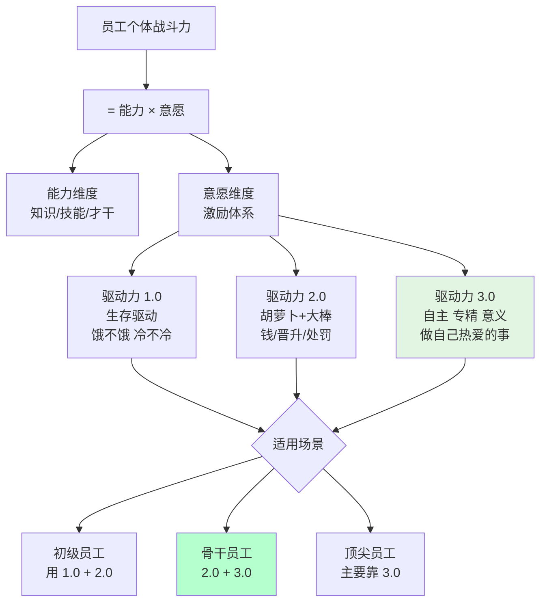
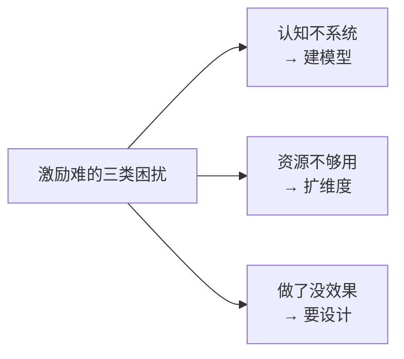
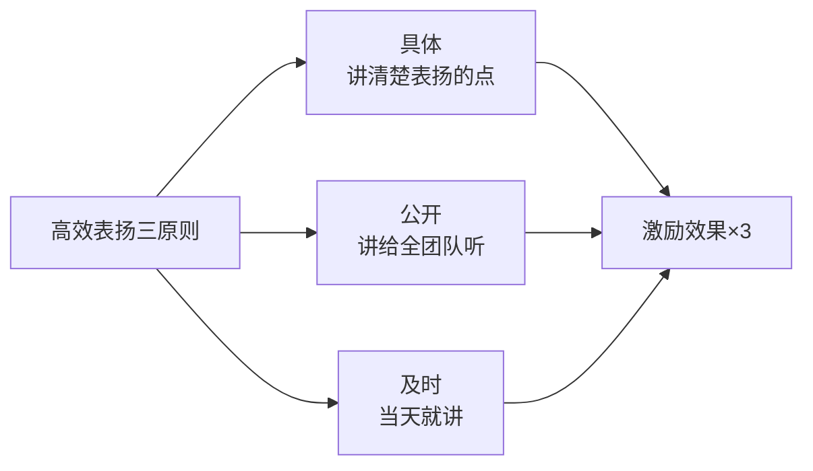
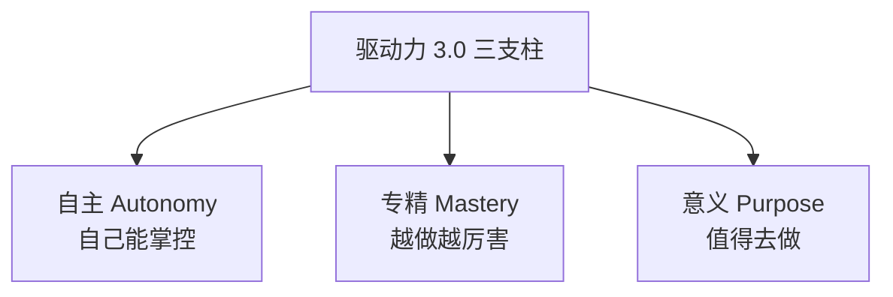
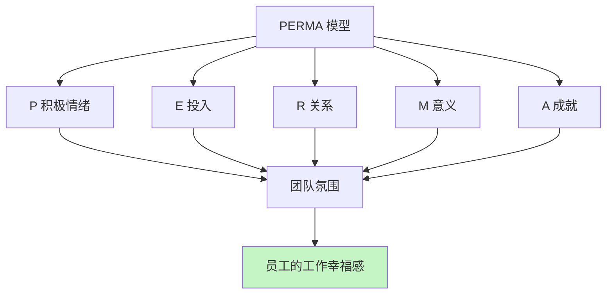

# 3.5 提升员工积极性

#### 目录介绍

- [01.开头故事引入](#01开头故事引入)
- [02.如何提升战斗力](#02如何提升战斗力)
- [03.积极性管理头痛](#03积极性管理头痛)
- [04.激励的系统认知](#04激励的系统认知)
- [05.驱动力1.0分析](#05驱动力10分析)
- [06.驱动力2.0分析](#06驱动力20分析)
- [07.驱动力3.0分析](#07驱动力30分析)
- [08.驱动力发展阶段](#08驱动力发展阶段)
- [09.全面可持续幸福](#09全面可持续幸福)
- [10.激励的资源匮乏](#10激励的资源匮乏)
- [11.激励达不到效果](#11激励达不到效果)
- [12.最后总结和梳理](#12最后总结和梳理)
- [13.故事的回响](#13故事的回响)
- [14.思考题和作业](#14思考题和作业)

## 01.开头故事引入

**能力强的下属突然"摆烂"。** 团队里有个做了 3 年的骨干小 L，是那种拿需求不到一周就能给出可落地方案的人。但最近两个月，他像变了个人：周会上不发言了，问一句答一句；下班点一到立刻走，从不主动加班；Code Review 的意见越来越少，不再对方案提出建设性反对；上次给他一个技术方向让他 Own，他只说了一句"可以，安排个人来配合我吧"。

我一开始以为他"累了"，但随着时间推移，我意识到这不是累的问题——他不是能力下降了，他是意愿下降了。

**公式"战斗力 = 能力 × 意愿"。** 我找部门做过 HRBP 的老同学聊，她问了我一个关键问题："他薪资没涨？晋升被卡？还是手头这摊事他早已经会了没挑战？" 我一下子醒了——小 L 的年终绩效是 A-，加薪比同级少，而且他干的活越来越没挑战。

她接着说："战斗力 = 能力 × 意愿。能力再强，意愿为零，战斗力就是零。你作为管理者，不能只盯着能力提升，意愿的维护甚至更重要。"

小 L 这种骨干，物质激励（2.0）他早已边际效用递减，真正能拉他回来的是给他自主权、新挑战和成就感（3.0）。今天这一节，就把三代驱动力模型讲透，让你知道"什么阶段的员工用什么激励方式"。

## 02.如何提升战斗力

**战斗力公式的双因子。** 只有每个个体员工都奋力向前，团队才有可能快速前进。那么如何提升每个个体的战斗力呢？这主要与两个要素有关，即个体能力和他使用能力的意愿，如果要用一个公式来表示，那就是"个体战斗力 = 个体能力 × 个体意愿"。能力的上一节已经讲了，这一节专攻意愿。

**TL 为什么总说激励这件事头疼。** 员工激励是管理者的日常工作之一，为什么会让很多管理者头疼呢？大体上有如下几类说法："没有头绪，无从下手。员工激励这事，想起来就做做，忙起来就顾不上了。""员工没有工作热情，怎么激励也提不起积极性，他们依旧我行我素。""对员工激励效果最好的就是股权、晋升、调薪、奖金，我会向上级去争取，但是可能很难争取下来。""没法左右加薪和奖金，只能是给员工画饼了，但是工程师对此都很无感。"

## 03.积极性管理头痛

**三个核心困扰。** 把上面的 TL 声音归纳一下，其实是三类核心困扰。

第一，激励认知不系统。不清楚激励都有哪些手段，以及如何使用，各种零散的说法让人无所适从。

第二，激励可用资源匮乏。实实在在的物质激励不受自己掌控，画大饼的精神激励员工又不买账。

第三，激励达不到效果。虽然激励的动作都做到位了，但是并没有收到激发员工动力的效果，或者效果不够令人满意。

## 04.激励的系统认知

**从马斯洛到驱动力 3.0。** 关于对激励的系统认知。于此我们比较熟知的就是马斯洛的需求层次模型了，这个模型可以指导我们从人的五个不同层次的需求来激发动力，不过操作起来还是有点不太清楚该怎么做。

所以我更喜欢丹尼尔·平克的《驱动力 3.0》，他把驱动力的发展归纳为三个阶段：驱动力 1.0、2.0 和 3.0。这套模型比马斯洛更"管理者友好"——它直接告诉你：什么阶段的员工，要换什么激励工具。

## 05.驱动力 1.0分析

**生存与安全驱动。** 驱动力 1.0 是指驱动力主要来源于对生存和安全的渴望，需求层次处于"马斯洛需求模型"的最底层。这类驱动力在 200 年之前的大部分时间都处于主导地位，人们为了寻求生存下去的基本要素而努力。

**在现代职场里它还适用吗。** 在现代职场里，驱动力 1.0 并没有彻底消失——试用期保护、基础五险一金、稳定发薪、安全工作环境，都还属于 1.0 的范畴。对新入职和基层员工来说，这一层是"不做好会出事"的底线，但做得再好也无法形成差异激励。

## 06.驱动力 2.0分析

**胡萝卜加大棒的基本哲学。** 驱动力 2.0，其基本哲学就是认为人们都是"寻求奖励、避免惩罚"的，所以采取的方案是"奖励好的行为、惩罚坏的行为"，也就是人们经常念叨的"胡萝卜加大棒"。这是近 200 年来工业时代被广泛认同的激励方式，也是当前大部分管理者最常用的激励手段。

TL 们认为最有效的激励方式，你会发现大家呈现出的结论，80% 以上都是奖金奖品、升职加薪、口头表扬、通报表彰、出国旅游、加班费等，与此对应的惩罚就是罚款、批评等。"效果怎么样？" 一般收到的回答是："效果还不错，但就是越用效果越差。" 不得不说，这是很正常的。

**为什么越用越无感。** 为什么正常呢？因为无论是奖励还是惩罚，这类驱动力最大的特点是来自外部刺激。人对外部刺激的应对机制是增强免疫力，这个道理用在害虫身上就是提升"抗药性"。所以无论是用惩罚来"威逼"，还是用奖励来"利诱"，用多了就没效果了。古人早就告诫我们"善用威者不轻怒，善用恩者不妄施"，也是这个道理。

**表扬要用好 必须符合三原则。** 就拿"表扬"这样的小奖励来举例，表扬一个员工，若遵循下面这三个原则和要素就会让你的表扬效果倍增。

第一原则是具体。就是表扬的内容和原因要非常具体，让员工和团队都知道他是因为哪一两点得到了认可。比如"员工 A 非常主动及时地处理了一个线上故障""员工 B 在带新员工方面成绩突出"等。这样做大家就能够清晰地接收到你在倡导什么，而且还能有效防止对没有受到表扬的人造成负激励。如果你要是泛泛地说"A 很积极主动""B 干得很不错"，其他人就会心里不爽："我也很积极主动好吧，而且我项目干得也不错。" 因此，表扬一定要具体。

第二原则是公开。公开表扬有两大好处，一个是被表扬的同学受到了更大的激励；另一个更大的好处是，你其实告诉了团队每个人什么样的行为和价值观在你们团队是被认同和倡导的。因此，表扬要公开。

第三原则是及时。所有的期待都有时效性，表扬及时其实就是对员工的反馈要及时。一个不及时的表扬不但会让激励效果大打折扣，而且还会让团队成员很不理解——"这么点事，至于挖坟拿出来说吗！"

## 07.驱动力 3.0分析

**自驱力是躲不掉的选择。** 你可能会说，"胡萝卜加大棒"都搞不定，靠员工自驱岂不是更不靠谱？但我不得不告诉你的一个事实是：用驱动力 3.0 的思路来激励员工，不是你愿不愿的问题，而是不可回避的选择。

驱动力 3.0 主要是指自驱力，那么究竟怎么激发员工的自驱力呢？丹尼尔·平克从三个方面给出了建议：自主、专精、意义。

**提升员工工作的自主性。** 第一，提升员工工作的自主性，即给员工一定程度的自主掌控感。

首先是工作时间和地点上的自由度。弹性工作时间在互联网领域非常常见，这和互联网业务特别依赖员工创造力是分不开的。时至今天，还是有不少管理者抱怨员工总是迟到，如果他们管理的是知识型工作者，我一般会建议他们把焦点放在对结果的评价上，而不是把焦点放在员工的作息习惯上。

其次是工作内容上的自由度。员工可以在一定程度上选择自己的工作内容。Google 原来有个"20% 自由时间"的策略，即员工有 20% 的工作时间可自由支配，很受工程师们的热捧。所以你在做季度规划的时候，也可以聊聊员工的意愿，看看能否兼顾个人兴趣和工作要求。

最后是工作方法上的自由度。也就是员工可以自主选择工作的实现方法，这在技术人的日常工作中是非常常见的。

**提升员工专精度。** 提升员工专精度，让员工持续有成长。这里的"专精"强调的不是要设定目标去成为某个"专家"，而是强调"自主投入"的过程，为员工创造愿意自主投入的条件，因为只有自主投入才能带来专精。那么都要创造哪些条件呢？

第一是明确的工作目标，即对员工的要求越清晰，他就越愿意投入努力。那么什么叫明确呢？以明确到他能着手执行为标准。

第二是目标要略有挑战，即对员工的要求要有一定挑战，但又不能太高。要求太高带给员工的是焦虑；要求太低带给员工的是无聊。如果你觉得难以理解，你回想自己玩过的游戏就明白了——太难了让人放弃，太容易了没意思，难度适中的时候你才最容易沉浸其中、物我两忘。

第三是要能发挥其优势。每个人都愿意做自己擅长的事情，如果某项工作能发挥员工的独特优势，必定会给他带来投入的热情。你可能会说，哪有那么多可以发挥员工优势的工作？我想说，优势是有很多层次的。你可能满足不了某员工所期望的工作内容，但是还有行为模式和思维模式方面可以考虑，比如某些人特别爱和人沟通协调，那就让他用沟通讨论的方式去工作；如果有人特别善于独立思考和筹划，那就发挥他的思维优势；有的人行动特别迅速，那就让他去快速启动一项工作。总之千万别简单认为发挥员工优势就是鼓励员工"挑活"；优势是多层次的，所以让员工发挥优势这件事并不困难。

**给予员工意义和使命。** 作为管理者你可以亲身感受得到，总会有一批人因为工作没有价值而离职。他们不是矫情，而是真的需要看到自己给公司和社会带来什么价值。所以，管理者的一项重要修炼就是去梳理团队的使命和项目的意义。

但很多时候，管理者分配工作的方式是直接交代要做什么，并不会和员工去分享和探讨这项工作的价值，以及对团队和公司意味着什么，所以起不到激励效果。

## 08.驱动力发展阶段

**三代驱动力对照表。** 把驱动力发展的三个阶段整理如下，供你参考。在以后设计激励方案的时候，你可以关注一下，自己正在从哪个角度去激励员工。

| 阶段 | 核心 | 适用场景 | 典型工具 | 副作用 |
|---|---|---|---|---|
| 1.0 | 生存与安全 | 底线保障 | 薪资/五险/安全环境 | 单独使用激励为 0 |
| 2.0 | 胡萝卜+大棒 | 短期/显性行为 | 奖金/晋升/表扬/批评 | 边际效用递减 |
| 3.0 | 自主+专精+意义 | 骨干/长期 | 授权/挑战/使命 | 需要 TL 投入精力设计 |

**3.0 时代是不是不用 2.0 了。** 你也许会问，驱动力 3.0 时代，是不是就不需要外部的奖惩激励了呢？我的看法是：需要。虽然驱动力 2.0 的激励效果在不断打折扣，但是基本的奖惩还是要做到位，这是基线。基线不做，3.0 的楼盖不起来。

## 09.全面可持续幸福

**PERMA 五根支柱。** "积极心理学之父"、美国心理学会主席马丁·塞利格曼在《持续的幸福》一书中提供了一个"全面可持续幸福"（well-being）模型，即"PERMA"模型，为我们提升幸福感提供了一个可操作的框架。正面情绪、人际关系、投入、成就、人生意义，是通往全面幸福的五根支柱。若你想要提升员工工作幸福感，也可以从这五个方向去开展工作。

**五个维度在团队的落地做法。** 第一维度是积极正向的情绪。你在营造什么样的团队氛围呢？团队里是轻松愉快、互帮互助的，还是抱怨指责、死气沉沉的？现在你知道了，积极正向的情绪本身就是提升员工工作动力、增强员工留任意愿的重要手段，那你能为此做点什么呢？

第二维度是良好的人际关系。在团队工作中，你做了哪些工作来提升员工的归属感、融入感呢？你是否设计了一些活动和机制，让彼此之间更愿意互相支持？每个团队会因为管理者的风格选择自己的有效形式，但一个常见做法是为每位新人指定导师，你做了吗？

第三维度是自主投入。你为员工自主投入提供条件了吗？如前面我们所提及的，为员工设定清晰的目标、给他们适当的挑战、支持他们发挥自己的优势，可以帮你的员工提升自主投入的意愿，体验到"心流"带来的愉悦。

第四维度是取得成就。迎接挑战并取得成就，是大部分工程师非常享受的事情，但是这需要一个前提，就是对于"成就"的刻画和设计。很多管理者往往缺乏这个意识，尤其对于一些长线工作，或日常的琐碎工作，员工做下来觉得没有成就感，甚至是觉得浪费时间。所以把长线项目里程碑化、把日常工作项目化，让员工走一步有一步的成果，会提升员工的成就感。

第五维度是意义和使命。你可能会说："工作就是工作，哪里有那么多的意义和使命啊。就别说员工了，我自己都觉得很缥缈！" 但是员工越来越追求工作背后的价值和意义这件事是不可忽略的。所以作为管理者，你需要有能力为员工梳理清楚这个问题。

## 10.激励的资源匮乏

**从"只有胡萝卜大棒"到"立体激励"。** 关于激励可用资源匮乏——实实在在的物质激励不受自己掌控，画大饼的精神激励员工又不买账。针对这个问题，如果你把"驱动力 3.0"和"PERMA 模型"两个激励框架结合起来使用，你会发现，现在你可用的激励手段已经非常丰富了。

你之前觉得匮乏，是因为你觉得只有"胡萝卜"和"大棒"可以用，而现在你可以设计更为立体的激励体系了，而不是靠单一的激励来决定效果。

**画饼有没有用。** 说起"画大饼"，在我看来，"画饼"越来越成为管理者的必备技能，只不过不宜过大，饼太大了是没有激励效果的，要注意和员工有切实的联系。而且作为管理者，只有言行一致、保持承诺一致性，才能赢得团队的信任。

## 11.激励达不到效果

**效果不明显的根因是没"设计"。** 虽然激励的动作都做到位了，但是并没有收到激发员工动力的效果，或者效果不够满意。关于这个问题，我认为效果不明显最大的原因是你只是做了一套"激励动作"，这套"动作"可能是很多管理者前辈告诉你的，而不是你根据自己团队和员工的具体情况，结合激励框架定制化设计出来的。

每一个激励方案都需要去思考和设计——把外驱和内驱结合起来，把长期和短期结合起来，把业务推进和职业幸福结合起来，把个人工作和团队使命结合起来。

## 12.最后总结和梳理

**激励的三条总纲。** 第一，激励要立体。本文介绍了非常丰富的激励要素，你需要从单一的激励维度升级为更加立体的激励体系，从而适应新职场环境的要求。

第二，激励在平时。你不能指望一些临时性刺激方案来做好激励，激励体系的搭建应在平时。当员工跟你提离职的时候，它就已经不再是一个激励问题了。

第三，激励要设计。由于每个人的业务特点不同、团队性质不同、管理风格不同、员工特征不同、问题挑战不同，所以不要迷信别人给你的激励建议，我更建议你充分考虑自己面临的实际情况，结合自己的特质和激励框架，来设计适用于自己的激励体系。

## 13.故事的回响

**小 L 从摆烂到最佳员工的数据对比。** 那次和 HRBP 的对话后，我针对小 L 做了一整套 3.0 激励调整——给他 Own 一个新方向、拉他一起设计 KR、把 Code Review 的最终决策权放给他。两个季度后看数据，这个"摆烂骨干"又回来了。

| 观测维度 | 摆烂期 | 3.0 激励两季后 | 变化 |
|---|---|---|---|
| 周会主动发言次数 | 0 | 6 | 从 0 到 6 |
| 主动加班 | 0 次/月 | 视情况主动 | 不靠命令 |
| CR 建设性意见 | 0.3 条/次 | 4.2 条/次 | 提升 14 倍 |
| 主动申请新项目 | 0 | 2 | 从 0 到 2 |
| 绩效 | A- | S | 跨两档 |

**作者亲历后的三点领悟。** 第一点领悟是，员工摆烂不一定是态度问题，很多时候是激励层错配。你在用 2.0 的工具激励一个需要 3.0 的骨干，怎么用都没效。

第二点领悟是，激励是做出来的，不是发出来的。TL 要把 30% 的时间花在设计每个人的激励组合上，而不是把全部希望押在"年终奖能发多少"上。

第三点领悟是，激励必须在离职之前发生。当员工递辞呈的那一刻，激励就失效了，那时候你加再多薪留下来的也只是"躯壳"。真正的激励，是在员工还热爱这份工作的时候，去呵护他的自主、专精和意义感。

## 14.思考题和作业

**三道思考题。** 第一题：你团队里最近一位"突然冷下来"的员工，回头看他的冷却点发生在哪个关键事件之后？他需要的是 2.0 的补偿，还是 3.0 的重启？

第二题：你过去一年给团队的激励，2.0 占几成，3.0 占几成？骨干和新人的比例是不是应该不一样？

第三题：如果老板告诉你"今年没有加薪名额"，你手头还能打出哪些"非金钱"牌？列不出 10 张说明激励工具盒太小。

**三个可执行作业。** 作业 A：为每位下属做一张《激励画像卡》。写出他现在最卡住的是 1.0、2.0 还是 3.0 的哪一层，对应给出一条可以马上实施的激励动作。

作业 B：给团队做一个"非金钱激励工具表"。至少列出 15 种你能自己掌控的激励方式（如公开致谢、项目冠名、决策权下放、出差参会指标、Own 方向、配影子接班人等），按"好用程度 + 使用成本"排序。

作业 C：挑一位你最想激励回"心流态"的骨干，本周为他定制一份"3.0 激励方案"——给他一份他能 Own 的新目标、对应一段没人干扰的自主时间、让他在季度会上亲自讲这件事的价值，观察三个月的行为变化。

**延伸阅读书单。** 《驱动力》（丹尼尔·平克）——系统讲 3.0 激励的底层逻辑。《持续的幸福》（马丁·塞利格曼）——PERMA 模型的原典。《Drive at Work》（Dan Ariely 相关研究）——用行为经济学解释金钱激励为何边际递减。《你能让你的团队成为高绩效团队》（高德拉特相关）——把激励设计纳入管理系统。

---

**本节金句**：战斗力等于能力乘以意愿，骨干摆烂不是懒，是你用错了激励工具；激励不是发礼物，是 TL 设计出来的系统工程。
