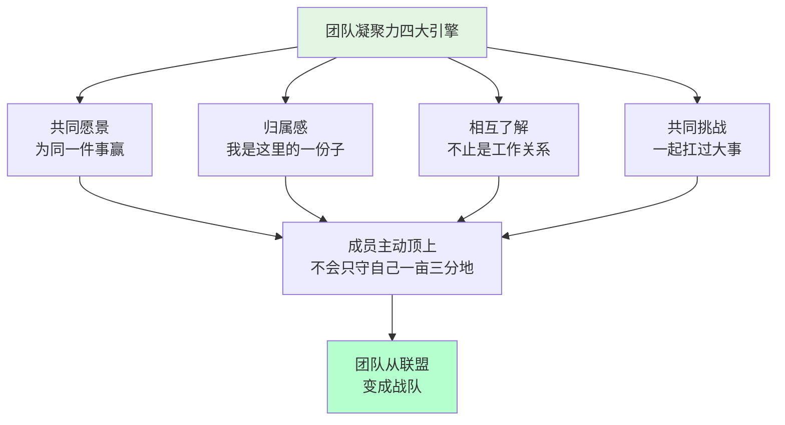
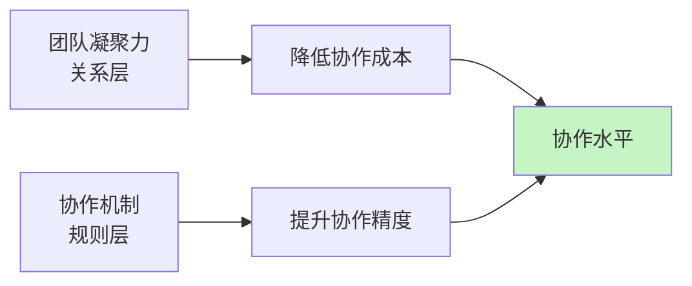
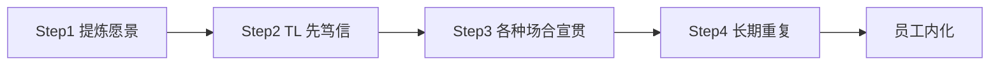
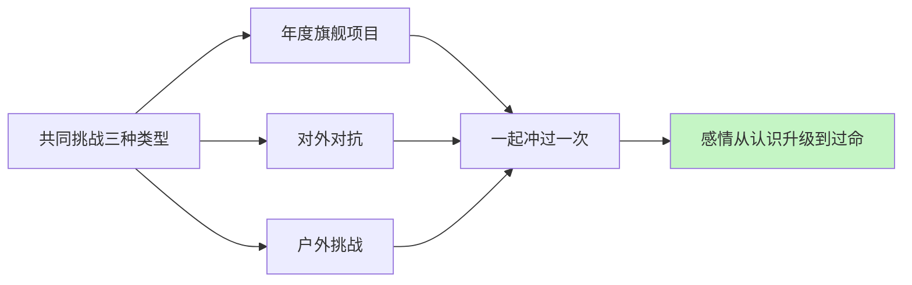

# 3.6 提高团队凝聚力

#### 目录介绍

- [01.开头故事引入](#01开头故事引入)
- [02.如何提升协作力](#02如何提升协作力)
- [03.设立共同的愿景](#03设立共同的愿景)
- [04.提升员工归属感](#04提升员工归属感)
- [05.加强相互的了解](#05加强相互的了解)
- [06.共同去面对挑战](#06共同去面对挑战)
- [07.故事的回响](#07故事的回响)
- [08.思考题和作业](#08思考题和作业)

## 01.开头故事引入

**团队"能打但不抱团"的尴尬。** 我接手过一个小组，6 个人个个能力不错，每个人单独拉出来都能独当一面。但放在一起我发现一个奇怪现象：每天大家各干各的活，群里除了工作通知几乎没有讨论；有人上线出了问题，其他人看热闹一样看着，没有主动去兜底；团建报名总是稀稀拉拉，吃饭的时候大家低头刷手机；遇到跨组合作，每个人只关心"我的那块任务"，没有团队荣誉感。

这种团队我叫它"联盟型团队"——成员之间只是"共用一个老板的人"，不是"一起打仗的战友"。联盟型团队最大的问题是：单兵战力都很强，但整体输出是线性叠加，没有组合增益；一旦遇上跨部门、跨周期的大仗，它根本不够看。

**做了三件事把团队粘起来。** 我从一位做过军官的朋友那里学了一个心法——凝聚力不是吃出来的，是一起打过仗打出来的。后来我做了三件事。

第一件是设了一个"全组都想赢"的目标：让团队从 P4 升级到部门级重点团队。第二件是在团建里加了"共同挑战"：一起夜爬泰山，10 个小时走下来没人掉队。第三件是建立了"互相了解"机制：每周 30 分钟的非正式茶话会，分享一个"本周最有成就感的事"。

半年后，这支队伍从"联盟"变成了"连队"。



今天这一节，就把这四个"粘合剂"的做法讲清楚——每一种都有可落地的具体动作。

## 02.如何提升协作力

**协作的两个切入角度。** 协作水平很高的团队，就好像一部良好运转的机器一样，既有分工，又彼此紧密连接，形成一个有机整体。那么该如何不断提升团队的协作水平呢？主要是从两个角度来做工作。

第一个角度是建立协作机制，通过机制来约定协作的动作，以此来保证大家"动作协调"。

第二个角度是提升团队凝聚力，通过提升团队成员间的信任度、认同度和默契度来降低协作成本、提高协作效率。

**凝聚力和协作水平的关系。** 团队凝聚力和协作水平是两个非常有意思的概念，它们含义不同，又紧密相关。团队凝聚力更侧重团队成员间的关系，体现他们的信任度和向心力如何；而协作水平则更关注做事过程中的互动情况。



机制决定了"能不能协作起来"，凝聚力决定了"愿不愿意多协作一步"。这一节只聊凝聚力这条路。

## 03.设立共同的愿景

**没有愿景大家不知道"一处"在哪。** 当我们想提升团队凝聚力的时候，总是希望大家"心往一处想，劲往一处使"，而我们常常忽略一点——大家首先得清楚把劲儿用到哪"一处"。这就要求团队首先要有一个使命和愿景，有一个共同的长远目标，供大家"往一处想"。

**共同愿景的设立四步。** 如果团队有着自己的使命，又能得到团队成员的普遍认同，大家会更容易朝着一个方向共同努力，也更容易肩并肩地一起迎接挑战，即所谓的"志同道合"。它是如此重要，下面简要描述一下其设立步骤。

第一步是明确你团队的职责、使命和工作目标，这里的工作目标是长远的共同目标。

第二步是管理者自己要笃信第 1 条的内容，如果不笃信，就返回步骤 1 继续提炼。你自己都不信的愿景，员工一秒就能闻出来。

第三步是在各种合适的场合宣贯这一内容，比如季度会、总结会、沟通会、启动会，以及 1 对 1 沟通等，都要不失时机、不突兀地把使命和愿景同步给大家。

第四步是坚持不懈地做步骤 3。不要指望一蹴而就，开个会大家就都认同了的好事，现实中不会发生，只有时间长了、频次够了，才会内化，才会深深植入员工的内心。



## 04.提升员工归属感

**归属感是把员工凝到团队上。** 如果说，设立共同的愿景是为了让员工凝聚到共同的事业上的话，那么提升员工归属感则是为了让员工凝聚到团队上，让员工从心里就认为自己是团队的一份子。那么，如何才能让员工有这种感觉呢？主要从以下三个层次来做。

**给一个位置 给一份职责。** 第一层是要给他一个位置，给他一个"立足之地"，也就是要分给他一份职责。职责并不总是意味着压力，也意味着归属，人的内心深处是渴望承担适当的责任的。只有当员工清楚自己能为团队做出什么贡献的时候，才会心安，才会感受到自己是团队的一份子。

**营造良好的人际关系。** 第二层是要营造良好的团队人际关系，让彼此间形成紧密的连接。团队成员间良好的关系和团队凝聚力的提升是互为因果的，所以不要小看能促进员工间关系的一些小事，恰恰是这些小事能够促使员工间的合作关系走上正向循环的轨道，员工会因为喜欢和团队的人相处而觉得有归属感。

**亮出团队文化价值观。** 第三层是明确亮出团队的文化价值观。团队的文化和价值观是否是员工认同和欣赏的，决定了他能否长期留在团队。价值观方面的冲突是很难调和的，如果员工从价值观层面就不认同团队，是很难让他找到归属感的。好在团队文化本身就是一个筛选器，最终留在团队发挥核心作用的都会是认同团队价值观的人，当然前提是团队先有明确的价值取向。

```mermaid
flowchart TD
    A[归属感三层] --> B[位置<br/>给一份职责]
    A --> C[关系<br/>营造正向人际]
    A --> D[文化<br/>亮出价值观]
    B --> E[员工感觉"我有份"]
    C --> E
    D --> E
    E --> F[愿意把团队当自己的家]
```

## 05.加强相互的了解

**不了解就没信任。** 作为管理者，我们总是习惯于对员工提要求，比如希望员工能不能更包容些、相互之间能不能多一些体谅和理解、彼此之间能不能多一些信任等等。作为管理者，我们总是期待"不劳而获"，认为员工之间天生就要互相包容、体谅、理解和信任。殊不知，所有这些并不会自然而然地发生，都要基于团队成员间不断深入地相互了解和认同。你为此做了什么呢？你有持续地做吗？

**TL 可以做的五件加深了解的事。** 实际操作上，我会让团队做五件事：第一是每周一次 30 分钟的非工作茶话会，每人分享一个"本周最有成就感的事"；第二是每季度一次的结伴午饭，两人一组随机抽签；第三是每位新人入职后的"15 人拜访"任务，每人喝一次咖啡；第四是每半年一次的"优势卡"环节，让每个人写出其他成员的三个独特优势；第五是在集体活动里分小组而不是大群，便于自然交流。

| 做法 | 频率 | 所需时间 | 凝聚力贡献 |
|---|---|---|---|
| 茶话会 | 每周 | 30 分钟 | ⭐⭐⭐⭐ |
| 结伴午饭 | 每季 | 1 小时 | ⭐⭐⭐ |
| 15 人拜访 | 新人入职 | 累计 3 小时 | ⭐⭐⭐⭐⭐ |
| 优势卡 | 每半年 | 1 小时 | ⭐⭐⭐⭐ |
| 小组活动 | 每次集体活动 | 取决于场地 | ⭐⭐⭐ |

## 06.共同去面对挑战

**"一起打过仗"的本质。** 有一句经典台词就是这么说的："今日谁与我共同浴血，他就是我的兄弟。" 显然一起扛过枪的兄弟，感情是很铁的，毕竟是经历过不离不弃的并肩作战。虽然我们现在没有仗要打，但至少有如下两个方面的事情近似打仗。

第一方面是一些有挑战的大型项目或紧急事故的应对。第二方面是跨团队的对抗性活动，比如趣味运动会、趣味游戏比赛等。毋需去说教，而是让大家在"硝烟"和"炮火"中去建立深厚的感情，这就是所谓的"事上练"。

**如何在日常里有意设计"共同挑战"。** TL 可以主动安排三种"共同挑战"。第一种是年度旗舰项目——每年给团队设一个"如果这件事做成，我们整支队伍都上一个台阶"的大仗，然后所有人一起冲。第二种是对外对抗——报名部门级、公司级比赛（代码马拉松、运动会、文化比赛），代表团队出征。第三种是户外挑战——夜爬、徒步、骑行，不靠嘴上说，靠一起撑过的那一晚。



## 07.故事的回响

**从联盟到连队半年后的数据对比。** 按照四大引擎（共同愿景 + 归属感 + 相互了解 + 共同挑战）系统做下来，那支最开始"能打但不抱团"的团队半年后的数据变化是惊人的。

| 观测维度 | 联盟期 | 连队期 | 变化 |
|---|---|---|---|
| 团建参与率 | 43% | 100% | 到齐 |
| 主动互相兜底事件 | 1 起/月 | 9 起/月 | +800% |
| 非工作群消息量 | 几乎没有 | 日均 80+ | 从 0 到高频 |
| 主动离职率 | 25%/年 | 0%/半年 | 清零 |
| 团队在部门的评级 | P4 | P2 (重点) | 跨两档 |

**作者亲历后的三点领悟。** 第一点领悟是，凝聚力不是靠 TL 的"爱"堆出来的，是靠一次次"一起赢"沉淀下来的。你想给团队多一份情感，就先给它一件值得一起赢的事。

第二点领悟是，归属感的第一句话是"这里有你的位置"。很多员工不是缺钱走人，是在团队里感觉不到自己"是被需要的"。给清楚一份职责，比多发一个月奖金都有效。

第三点领悟是，日常的"小温度"比偶尔的大团建更有用。每周 30 分钟的茶话会积累下来的信任，远超一次周末的豪华团建。凝聚力从来不是一个事件，而是一条时间轴。

## 08.思考题和作业

**三道思考题。** 第一题：如果今天公司要做组织架构调整，你团队有多少人会主动留在你身边？凝聚力在这件事上会给出最诚实的答案。

第二题：你现在团队里的"能打但不抱团"的比例有多高？他们是因为不熟，还是因为不认同团队愿景？

第三题：过去半年，你团队有没有"一起打过一场仗"？如果没有，下一个共同挑战你会放在什么时候？

**三个可执行作业。** 作业 A：写一段 60 字以内的团队愿景。拿去在下一次周会上宣贯，让每个人复述一次，把"说得最不一样"的那句话作为你下一版的修订依据。

作业 B：本月设一个"每周茶话会"机制。固定周五下午最后半小时，不谈工作，只分享"本周最难忘的一件事"，坚持三个月后再看团队内部消息量的变化。

作业 C：策划一场"共同挑战"。挑一件有难度但安全的事（夜爬、骑行、公司级比赛报名等），让全组无人缺席，事后开 30 分钟"挑战总结会"，让每个人讲一句别人给自己留下最深印象的时刻。

**延伸阅读书单。** 《团队协作的五大障碍》——讲透了凝聚力的反面：信任缺失、惧怕冲突、缺乏承诺、逃避责任、无视结果。《联盟》（LinkedIn 创始人）——重构"员工与公司的关系"，帮你理解现代团队的归属感。《不拘一格》（奈飞文化）——看看一家顶级公司如何靠"文化筛选"保持凝聚力。《第五项修炼》——理解共同愿景、自我超越、心智模型之间的系统关系。

---

**本节金句**：一起吃饭的是同事，一起打过仗的才是战友；凝聚力不是吃出来的，是共同赢过的记忆沉淀下来的。
