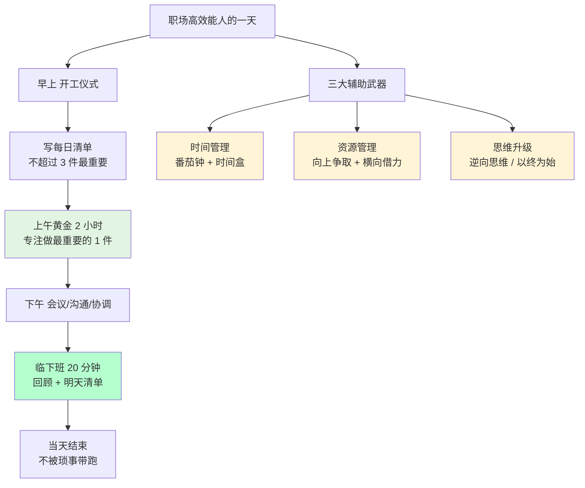
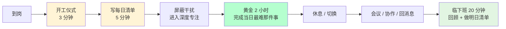
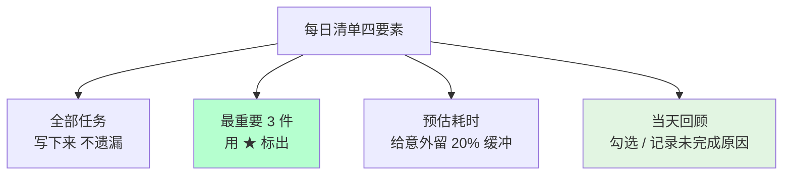
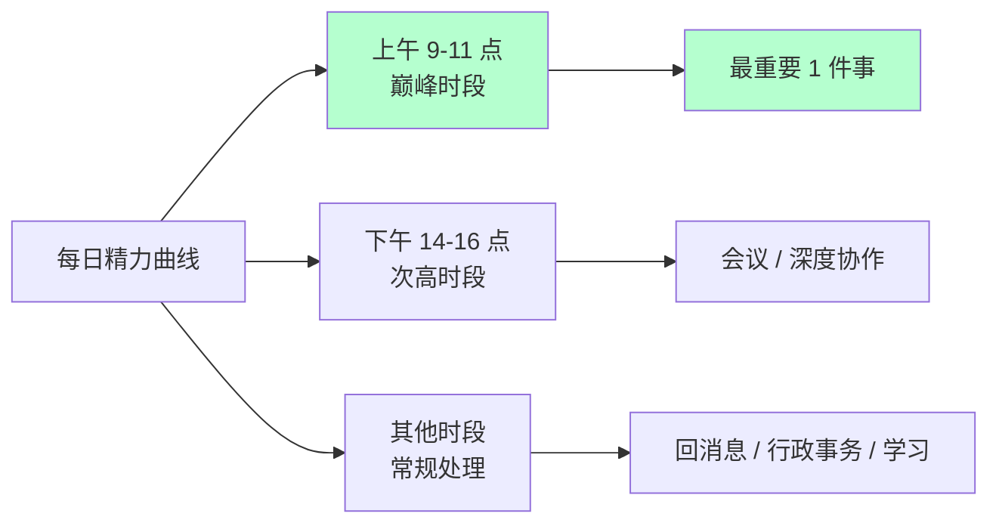
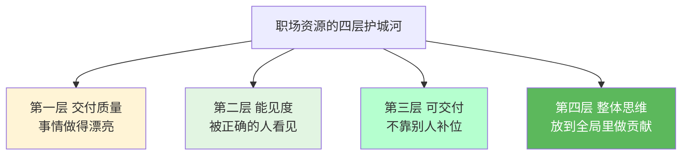
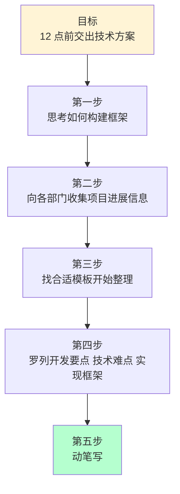
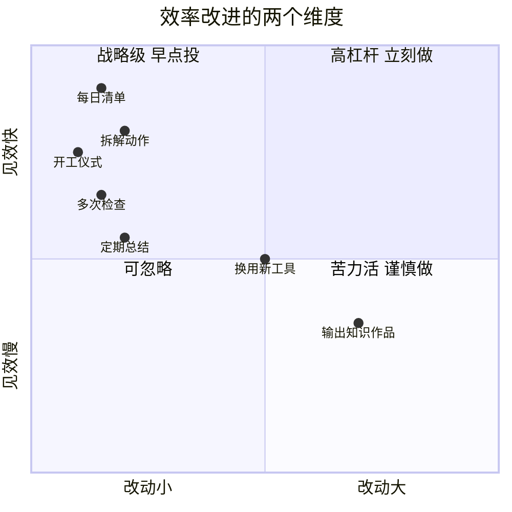

# 4.3职场效率的提升

#### 目录介绍

- [01.开头故事引入](#01开头故事引入)
- [02.快速进工作状态](#02快速进工作状态)
- [03.做职场时间管理](#03做职场时间管理)
- [04.争更多职场资源](#04争更多职场资源)
- [05.定期总结和反馈](#05定期总结和反馈)
- [06.做事情逆向思维](#06做事情逆向思维)
- [07.来看一个小故事](#07来看一个小故事)
- [08.故事的回响](#08故事的回响)
- [09.思考题和作业](#09思考题和作业)

## 01.开头故事引入

**每天加班到 11 点活却没干完。** 工作第三年那段时间我非常拼，早 8 点半到公司，晚上加班到 11 点，几乎没有完整周末。但诡异的是：**每周五复盘，我都发现这周计划里的重要事情只完成了 50%**，更多时间被临时会议、线上 Bug、群里讨论碎片化掉了。

领导找我 1v1，问了一个问题："你每天写周报说你加班到 11 点，但你加班的那几个小时，都在做什么？" 我翻了翻聊天记录："大多是接一些临时需求、回一些消息、或者处理一些查不出根因的 Bug。" 领导笑："那些都是'消耗'，不是'投入'。**你的时间不是不够用，是花在了不值得的事情上。**"

那天晚上我做了一件从没做过的事：把上周所有加班的时段倒推了一遍，发现其中 60% 的时间根本没有产生任何可交付的结果 —— 要么是在等别人回消息，要么是在反复切换任务，要么是在做一些"看起来很忙但不重要"的事。那一刻我才明白，**忙碌是最廉价的勤奋**，它让你感觉自己很努力，却掩盖了真正的低效。

**从"忙忙碌碌"到"事半功倍"的转变。** 后来我学了几套时间/效率方法，实践了半年，效率提升肉眼可见：**加班少了，核心产出反而翻倍**。这些方法不复杂，但有一个共同点 —— **它们都在帮你把有限的注意力，聚焦在少数真正重要的事情上。**

今天这一节，就把我亲身实践、让效率至少翻倍的一套做法讲给你 —— 从**开工仪式**到**每日清单**到**逆向思维**，都是拿来就能用的武器。效率的本质不是"做得多"，而是"做得准"；不是"加班到几点"，而是"产出在哪里"。

## 02.快速进工作状态

一个职场人最大的困扰，可能就是**不知道怎么快速进入工作状态**。时间久了，没人安排工作了，久而久之，容易陷入一种"我怎么成了打杂"、"找不到事做"的怪圈。

比工作更重要的是，在大脑中不断强化"我要工作"的信号。一旦你拥有了这个认知，你就很清楚自己每天该干嘛、什么时间段做什么事。下面这张图把一个工作日的"进入状态曲线"画出来，你可以对照检查：自己是卡在哪个环节上不去？

**完成开工仪式。** 早上刚到公司，是不是还没走到工位就没了工作状态？我建议你给自己设计一个"开工仪式"：收拾桌面、清洗茶杯、倒一杯水、戴上降噪耳机、打开今天要用的三个窗口。这套动作不超过 3 分钟，但它像一个心理开关，把你从"通勤模式"切换到"工作模式"。

我自己的习惯是提前 30 分钟到公司。这 30 分钟不是用来加班的，而是用来给自己一个"没有人打扰的起步时段"：大脑尚未被消息轰炸，桌面尚未被任务堆满，这是全天最宝贵的一段时间。仪式感不是形式主义，它是你对"今天要好好工作"这件事的郑重承诺。

**拟好每日清单。** 在开展具体工作之前，写一个每日清单，把今天要做的事按轻重缓急列出来。一份好的每日清单，首先是把今天打算做的事情写到纸上或 Wiki 清单；其次是标记出最重要的 3 件事，只用"★"号标注，其余任务不用加标记；再次是预估每件事的耗时和可能发生的调整，给意外留一点缓冲；最后是每天留 20 分钟回顾，看清单上哪些勾了、哪些没勾、为什么没勾。

看看自己的日程表：今天是否有几个会议要占用时间？今天要沟通的事情是否特别多？今天是否有事要外出？如果答案是肯定的，就尽量少安排核心计划，避免事情做不完产生挫败感。**清单不是"写给自己看的决心书"，它是你和时间之间的谈判协议。**

**学会做笔记。** 很多时候你会发现职场上的事靠脑子是记不住的，所以我的建议是手边常备笔记本。针对一些突发的、计划外的、又不得不承接下来的事情，写在笔记本上。一方面是不要忘记，另一方面是别让这些打扰影响你当前的工作状态 —— 你写下它就是在告诉大脑："这件事我已经记住了，现在可以放心做手头的事。"

做笔记这个习惯，结合上文的"每日清单"，你会发现坚持越久、工作思路越清晰越有条理。一般来说，做事的思维不好短时间改变，但可以慢慢改变习惯，再由习惯反过来影响思维。**习惯是思维的外壳，你先改变外壳，内核会自然随之改变。**

## 03.做职场时间管理

当你慢慢进入工作状态之后，会遇到一个新难题：手上的事情越来越多，每天要和不同部门对接、参加技术方案评审，每次工作推进都花费大量时间，长此以往容易生出一种无力感。

怎么才能做好职场上的时间管理？核心思路是一句话：**把时间从"消耗"里拿回来，投到"投入"里去**。下面几个方法是我自己实践过、有效的。

**打磨时间颗粒度。** 大家对"时间颗粒度"这个词应该不陌生：它指一个人安排时间的基本单位，代表着一个人的职业化程度。王健林的颗粒度是 15 分钟，普通白领的颗粒度是 1 小时，学生党的颗粒度可能是半天。颗粒度越细，意味着你对时间的掌控越强。

每个人的时间都是公平的，你我都是一样的 24 小时，但最终有人保质保量不拖延地完成，也有人时间花了却一事无成。如何高效利用每一分钟，才是问题的关键。这块我自己也没做得完美，道理简单但做到挺难 —— 但至少你可以从"把下午切成 4 个 1 小时块"开始练习。

**完成每日清单。** 上文提到每天写每日清单，这能帮助你养成每天开列工作计划、每晚写工作日报的习惯，不会占用很长时间，刚好可以用早到公司那 30 分钟写好。

当然，这并不是为了给领导看，而是为了培养自己的觉察能力和时间掌控力。短期不好看效果，长期积累会让你对"自己每天到底干了什么"有清醒的认知。一个进阶的工作习惯是每一个月自己拿出两个小时，拉一遍重要事项清单，看看哪些是反复出现的、哪些是本该做但一直拖延的。

需要注意：这些计划和清单一定要用能勾选的模式，每完成一项就打勾 —— 这是你能给自己创造的**"最小化正反馈"**。大脑对勾选的反馈极度敏感，每一个"√"都是一剂多巴胺。

**堵住时间缺口。** 我自己亲身经历过：在某一个项目上花费大量时间，结果投入产出严重不成正比。所以很多时候，并不是你花了时间就一定能得到正向反馈。时间像水，总会从最低处的缺口悄悄流走，而缺口往往就藏在那些"看似重要其实不紧急、看似紧急其实不重要"的事情里。

这个时候的建议是：**把严重消耗时间的低产出项目从计划表里删掉**。不要舍不得你在这件事上已经投入的时间，那叫"沉没成本"；真正该计较的是"从现在到未来"你能拿回多少时间。只有这样，才能更好地堵住时间的缺口。

**找到协助对象。** 职场到最后总是要找人合作的，不管是别人找你，还是你找别人。当你找到一个可以授权和协作的对象，积极"传球"的时候，你会发现工作效率大大提升 —— 就像一场篮球赛，你一个人打五个和五个人一起打，结果肯定不一样。

职场的特点恰恰又是需要团队作战，开展工作时就像球场上的中场发动机：不仅自己善于带球突破，还要眼观六路随时准备传球，及时请别人帮忙，让自己聚焦于主线任务。在这一块还需要多向同事请教："这件事你有更快的办法吗？这个环节谁更擅长？"

**找到最佳状态。** 最后还有个事想提一句，以自己为例：发现自己在状态差的时候，工作和学习的质量和效果也是最差的。如果是早上或上午，我可以心无旁骛地完成各种事情；但到了下午或晚上，整个人时常会出现懈怠和注意力不集中的情况，甚至一个晚上都看不完一篇 1000 字的文章。

所以我最后一个建议是：**在自己状态最好的时候去做最重要的事情**，而不是在状态最差的时候浪费最宝贵的时间。把你一天中的"精力曲线"画出来，标出哪两个小时是你的巅峰时段，然后把那段时间像保护 VIP 客户一样保护起来 —— 不开会、不回消息、不刷手机。

## 04.争更多职场资源

当你一步步走向职场更深处的时候，会慢慢发现比工作更重要的是：你需要更多的人来帮你工作，或者说，你需要和更多的人一起去完成工作。这个能力在初期是最欠缺的。

而这个时候你会发现，别人也是同样的状态，而本身固有的资源只有这么多，于是问题就爆发了：**在一个存量的世界里，如何在变量的过程中，去尽可能实现资源最大化？**答案不是"去抢"，而是"让资源自己向你流动"。

**珍惜每次合作。** 能拿到更多资源的人，不是因为在抢资源的时候有办法，而是因为日常工作中就表现出来的靠谱，让大家对他有信任。这也是我的师父常跟我说的一句话：**做事情交付质量高，可以提高信任度。**

有句话说得好：信心比黄金更重要。同样的，在职场，信誉比加薪更重要。可以说，重视积累自己的工作信用远比一次加薪更重要，因为工作信用本身就是一笔巨富 —— 它是你下一次申请资源、下一次跨部门协作、下一次晋升答辩时真正能兑现的硬通货。

**提高能见度。** 一个常被忽视的观点是：**有意识地提高工作曝光度**。主动与上下游的同事、分管的领导聊聊工作进展，让大家知道你在做什么、取得了什么阶段性成果。千万不要只顾埋头拉车、不与别人交流。**只有你被看见的，你的努力才能被看见。**

最后要强调的是，提高能见度不是"表演式汇报"，它的前提永远是"你的产出确实有价值"。所以最重要的还是提高自己的产出，以及思考如何持续提高产出。有的时候在业务开发工作量少的情况下，反而是沉下心来做一个"大家都需要但没人做"的基础能力，能带来最高的能见度。

**尽量不等于交付。** 谁都有不想工作的时候，特别是你不想接的项目和案子。但既然任务已经派给了你，建议别用"尽量搞定"这种思维去敷衍。记得以前上学时老师常说："人哄地皮，地哄肚皮。" 凡事要是到了"尽量"和"敷衍"的地步，可想而知未来的路恐怕很难走。

而如果你能做到**"可交付"**的地步，至少说明这个结果在离开你手的时候已经是个完成品，不需要下家或者测试修补你的工作才能继续下一个流程。公司生态中，谁的结果最可交付，也就说明他的投入产出比最高，而自然资源和收益就会迅速集中到那里 —— 这是职场最朴素也最冷酷的规律。

**整体大于局部。** 我们在观察和认识一个人时，要看他是"整体大于局部之和"，还是"整体小于局部之和"。而我们自己，也要争取成为一个整体大于局部之和的人：把自己的工作放到业务全局里做对照，找到自己对全局做贡献的方式。

而不是不管做什么事都只想着自己那点利益；也不是不管身在什么位置都只盘算自己那点私欲。只有当你放下眼前这点蝇头小利的时候，你才有可能看到更远方的星光黎明 —— **职场资源的本质是"大家愿不愿意和你一起做大"，而不是"你能从别人碗里夹走多少"。**

## 05.定期总结和反馈

如果说前面四节讲的是"怎么把事情做对"，那这一节要讲的就是"怎么让自己越做越对"。总结和反馈是职场效率的放大器 —— 没有总结，你的每一天都是重复的第一天；有了总结，你的每一天都是升级的新一天。

**周和月总结。** 为什么要做周总结或者月总结呢？这是对自己工作的一个反馈，**不要把它当作工作来完成，重视它**。如果觉得周总结太频繁了，那么至少要有月总结：这个阶段主要做了哪些事情、做的效果怎么样、还有哪些遗漏或未解决的问题、下一个阶段该做哪些事情，都可以思考一下，主要是让自己对一个月的产出有个清醒的认识。

我用的是一个简单的"本周小模板"，分为两部分。本周要写的小计划包括：本周让我感激的三件事情（感恩 → 柔软平和）；本周让我变得更好的三件事情（Todo List Top 3 → 目标聚焦）；本周我认可自己的一句话（自我激励）。本周要去回顾的内容包括：本周发生的三件很棒的事情；可以让本周做得更好的一件事（反思精进）；检查它完成得如何（形成闭环）。强烈建议每周花个三十分钟试一下，让自己的生活更加有条理、更加结构化。

**输出知识性作品。** 在职场上，想让别人认可你的工作能力，有一个捷径 —— **输出知识性作品**。你写的技术方案、写的组件库、写的开源库、你出版的图书、你撰写的产品问题手册、你开发的新员工培训课程……都是知识性作品。这些作品可以被广泛传播、被更多人看到。如果这些作品真正能帮助别人解决问题，是一个好作品，就自带说服力，你的工作能力就不言自明。

很多人可能觉得"作品"太高大上、自己很难拥有。实际上，知识性作品是分层次的，每个人都可以根据自己的工作情况，创造贴合工作的作品。根据抽象程度不同，知识可以分为四个层次：工作过程记录、工作指引、步骤流程、策略。

| 层次 | 抽象度 | 举例 | 受众 |
| --- | --- | --- | --- |
| 工作过程记录 | 低 | 会议纪要、项目日志、Bug 复盘 | 团队内部 |
| 工作指引 | 中 | 月度会议组织指南、上线 Checklist | 部门/团队 |
| 步骤流程 | 较高 | 通用会议指南、需求评审 SOP | 全公司 |
| 策略 | 高 | 组件化方案、技术选型方法论 | 行业 |

你可以结合自己的具体情况，创造某个层次的知识性作品。比如部门月度会议，你做一份会议记录，就是一种作品，属于"工作过程记录"这个层次。比如你发现月度会议经常人不齐、过程也很混乱，你整理了一份月度会议组织指南，这也是一种作品，属于"工作指引"这个层次。比如这个指南运行了一段时间，你发现它不仅可以指引月度会议，对项目回顾会议、需求分析会议等也适用，于是你剥离了其中和月度经营会议紧密相关的内容，总结出一份抽象层次更高的"会议指南"，那这也是你的作品，属于"步骤流程"这个层次。

上面这些都是看书举出的案例，知识的层次性这个概念来自《卓越密码：如何成为专家》一书，想深入了解的话可以入手一本仔细研读。理解了知识的层次性，你就会发现：你完全可以创造自己的知识性作品，让作品来展示你的能力。

**多次重复检查。** 做事要认真！这个再朴素不过的道理，从小到大不知道多少人曾经这样教导过我们。那么作为一个技术职场人，你在工作中真的做到了认真吗？反思自己后，发现我做得还是不够好。瞬间有无数个回忆场景涌上心头：电脑忘记带回家；提交代码没去掉无效代码；备注地方需要加 Todo；这个操作步骤又忘了；这个 Bug 以前改过了怎么又有；忘记及时跟领导反馈进度……

多次反思后我意识到这是个大问题，于是努力寻求解决办法。我的方法可能并不高明，但经过实用证明是有效的，那就是**「重复多次的检查」**。每做完一个技术动作，我都会从结果到过程重复检查、验证好几次。在确保自己做对了之后，才会把结果传递给下一个环节的处理人。我还在前进的路上……

通过「认真」把事情做对，会积累别人对你的信任，这有助于你日后乃至一生的职业发展，因为你做事让人放心。**"让人放心"三个字，值千金。**

## 06.做事情逆向思维

讲完了总结与反馈，这一节讲一个更底层的武器 —— **思维方式**。很多时候效率低不是方法不好，是思路反了。

**主动安排任务。** 如果你一天的工作全都是由别人安排的，所谓的努力工作、加班加点其实不过是在为别人的目标进行的自我消耗。问一下自己：有属于自己的事要做吗？似乎有过，那是什么呢？似乎从来就没有！事实上这种情况在生活中也非常普遍。

忙完了别人安排的事，就找不到属于自己的事，这是身上普遍存在的一种另类的懒惰。**你必须有一件"属于你自己的事"**：它可以是一个小的技术优化项目，可以是一本正在啃的专业书，可以是一门正在学的新语言。难道不该站出来拯救一下自己吗？

**不断优化和思考。** 自己写的代码先运行起来，然后对业务是否都完全了解和深入、怎么去优化技术方案、对系统现有架构提出合理化的改造建议、用前后优化的数据对比来优化项目。给自己做个立项，在工作忙的时候认真完成工作，在工作空闲期的时候，主动参与和规划有利于工作进步的计划并落实执行。

锻炼了自己的能力、证明了自己的价值，同时还拯救了生活 —— 这难道不是有益的结果吗？**空闲期是普通人和高手的分水岭**：普通人用空闲期休息，高手用空闲期播种。

**学会拆解动作。** 在职场上你会遇到一些"需要你花费最多时间"去解决的问题。很多人常常觉得"要事第一"，一定要先搞完最难的那一个。可想而知，最难的永远是最难搞定的 —— 因为最重要的事通常都是最困难、最困惑的，你想搞定它又不知道怎么下手，就无法进入工作状态，自然也就无法提高工作效率。所以建议学会拆解动作。

你需要思考的只有一个问题：**这件事情的下一步行动是什么？** 比如今天上午 12 点之前你需要完成地图开发技术方案，那么完成这个方案下一步行动是什么？

你看，这样一来就把"做项目开发"这个事拆解成了若干个步骤，而不是胡子眉毛一把抓，最烦的是又抓不到重点、还浪费时间。**拆解动作的本质，是把"畏难情绪"换成"下一步行动"**。当你不再盯着那座山，只盯着脚下这一步的时候，山自己会一点点变矮。

## 07.来看一个小故事

**自行车比赛故事。** 在上个世纪 100 年的时间里，英国自行车手的成绩很差，差到什么地步呢？在过去这么多年里，只收获过一块奥运金牌，而在"环法自行车赛"里没有拿过任何一枚奖牌。以至于自行车制造商都不愿卖给他们装备，觉得有损自己品牌和声誉。

2003 年，英国自行车协会聘请了一位新教练，仅仅 5 年时间，在 2008 年奥运会上，英国自行车队就拿下了项目中 60% 的金牌。这位教练做了什么？其实也没什么，只不过是：重新设计自行车座、使其更加舒适；用酒精擦涂车胎、以获得更好抓地力；让医生教每个队员怎么正确洗手、减少患感冒的概率；测试不同纺织品在空气中的阻力大小、给队员换上更轻便阻力更小的衣服；把运送自行车的卡车内部漆成白色、及时清理灰尘、降低对自行车性能的影响。他们车队进行了数百个这样细节上的改进，最后取得了让人刮目相看的好成绩。

**看故事的启发。** 这也是最后想表达的：有时候我们常常迷失在宏大的目标当中，却又止步于一次次琐碎又乏味的重复之中。任何伟大的目标，都源于无数次微小习惯的坚持。也正是这些微小习惯的坚持，能让你在未来有机会走得更远、飞得更高。

学会拆分，学会不断完善，不断地去升级和优化，无数个小的积累最终会出现质的变化。**效率提升不是找到某一把神奇的钥匙，而是把 100 把普通钥匙都打磨得比昨天快 1%**，一年之后你会发现自己已经跑在了所有人前面。

## 08.故事的回响

回到开头那个"每天加班到 11 点"的我。半年之后，当我把下面这套方法实践下来以后，同一个我、同一份工作，状态完全不一样了。

| 维度 | 方法实施前（半年前） | 方法实施后（半年后） |
| --- | --- | --- |
| 日均在岗时长 | 14 小时（8:30-22:30） | 10 小时（8:30-18:30） |
| 每周加班天数 | 6 天 | 1~2 天 |
| 核心任务按时完成率 | 50% | 92% |
| 一周深度工作时间 | 约 6 小时 | 约 18 小时 |
| 每月产出"可交付成果"数 | 1~2 个 | 4~5 个 |
| 对工作的主观满意度 | 焦虑 疲惫 挫败 | 从容 清晰 有成就感 |
| 当年绩效结果 | 中等偏下 | 进入 Top 20% |

这张表是我那段时间真实发生的变化。数据只是表象，**真正变化的是我对"效率"这件事的三个底层认知**：

**领悟一：效率不是"做得多"，是"做得准"。**
过去我以为"加班到 11 点"就是效率高，其实那是在用工作时长掩饰无效忙碌。真正的效率是：每一小时的工作，都能指向一个具体的、可交付的结果。一小时做成一件事，胜过五小时做半件事。你应该追求的不是"忙了多久"，而是"今天这一天结束时，世界上多了什么以前没有的东西"。

**领悟二：效率的底座不是方法，是注意力。**
市面上的时间管理方法有上百种，番茄钟、GTD、四象限、子弹笔记……真正把我救出来的不是某一种方法，而是"把注意力从琐碎的事情上夺回来"这个底层动作。方法只是工具，注意力才是资源。所以写每日清单、做开工仪式、设置黄金 2 小时，这些动作的共同目标都只有一个 —— **保护你的注意力，不让它被廉价的事情消耗掉**。

**领悟三：效率是一场复利游戏，而不是一次冲刺。**
英国自行车队 5 年拿下 60% 金牌的秘密，不是他们突然发明了什么神器，而是"每一个细节比昨天好 1%"。效率也是一样：每天在同一时段做最重要的那件事、每天写一份清单、每周总结一次、每月输出一篇笔记……这些动作单独看平平无奇，但叠加三年之后，你会和起跑线上的同事拉开一条看得见的鸿沟。**别追求一夜之间脱胎换骨，追求让自己每天比昨天好 1%。**

回头看，那位领导 1v1 问我的那个问题 —— "你加班的那几个小时都在做什么？" —— 其实是一份礼物。它把我从"用苦劳感动自己"的陷阱里拽了出来，逼我直面一个真相：**低效的努力，本质上是一种体面的懒惰。**

## 09.思考题和作业

**三个思考题。** **思考一：把你上周的加班时段倒推一遍，其中有多少比例真正产出了"可交付成果"？**
找一张白纸，把上周每一次加班的日期、时长、主要做的事、产出的结果列出来。然后算一下：真正可交付的成果时长，占加班总时长的多少？如果低于 50%，说明你和从前的我一样，陷入了"用时间换心安"的陷阱。

**思考二：你每天精力最好的两个小时，实际上在做什么？**
观察自己 3 天，记录每天上午 9-11 点（或你的个人巅峰时段）实际在做的事情。如果这两小时主要用来回消息、开会、刷工作群，那么问题就找到了 —— 你把黄金时段用在了白银任务上。

**思考三：如果让你现在停止做一件"占用时间但产出极低"的事，你最想停的是哪一件？**
为什么过去没有停？是因为领导要求、是因为同事压力、还是因为自己不敢？把阻碍写下来，很多时候"阻碍"只是你想象出来的。

**三个作业。** **作业 A（本周做）：连续 5 天写"每日清单 + 当天回顾"。**
每天早上花 5 分钟写清单（全部任务 + 用 ★ 标出最重要的 3 件），每天下班前花 10 分钟做回顾（勾选、记录未完成原因、列明天清单）。5 天后回看：哪 3 件你标了 ★ 却没完成？为什么？

**作业 B（本月做）：设置一段不可侵犯的"黄金 2 小时"。**
选择你精力最好的两小时（比如每天上午 9:30-11:30），作为"深度工作时段"：不开会、不回消息、手机静音、关闭邮件通知。告诉同事你这两小时在做关键任务，坚持 4 周。一个月后对比：你的核心项目进展是加速了还是减速了？

**作业 C（本季度做）：输出一份"知识性作品"。**
层级不限：可以是一份"本部门 Bug 复盘模板"、一份"新同事入职 Checklist"、一个内部培训分享、一篇技术博客。目标是让它能被其他人复用。完成之后主动分享到团队群或 Wiki，观察接下来 3 个月内有多少人真的用到了它。

**延伸阅读。** 想把效率这件事做成一种能力而不是一次鸡血，以下这些书可以给你完整的武器库：

| 书名 | 作者 | 你能带走什么 |
| --- | --- | --- |
| 《深度工作》 | 卡尔·纽波特 | 为什么"深度工作"是这个时代最稀缺也最值钱的能力 |
| 《搞定：无压工作的艺术》 | 戴维·艾伦 | GTD 方法论的原典，把大脑从"记事本"解放出来 |
| 《高效能人士的七个习惯》 | 史蒂芬·柯维 | 时间四象限 + 以终为始 + 要事第一 |
| 《卓越密码：如何成为专家》 | 田志刚 | 知识的层次性、如何输出知识性作品 |
| 《原子习惯》 | 詹姆斯·克利尔 | 微小习惯的复利效应、身份驱动的行为设计 |
| 《番茄工作法图解》 | 斯塔凡·诺特伯格 | 最简单也最有效的专注力工具 |
| 《精力管理》 | 吉姆·洛尔 | 管理精力比管理时间更重要 |

---

**本节金句：效率的本质不是让你"做完更多事"，而是让你"做完真正重要的事"；你抢回来的每一个黄金 2 小时，都会在三年后变成你和同龄人之间看得见的鸿沟。**
