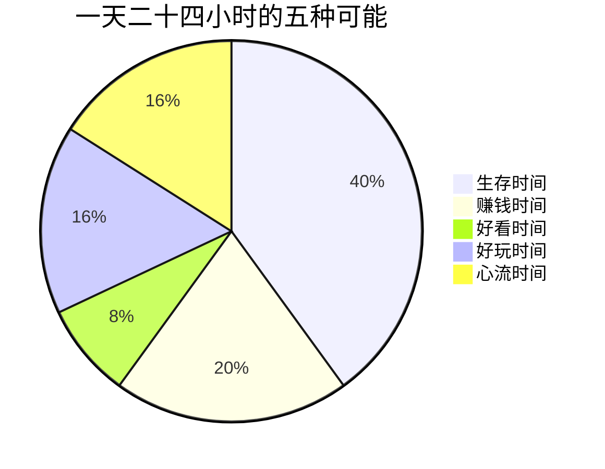

## 序章·时间管理，其实是生命管理

- [01.一个平常人的一天](#01一个平常人的一天)
- [02.传统方法为什么失灵](#02传统方法为什么失灵)
- [03.五种时间的地图](#03五种时间的地图)
- [04.三十天能走多远](#04三十天能走多远)

---

## 01.一个平常人的一天

我想先带你看看一位二十八岁职场人的一天。

早上七点被闹钟惊醒，赖床十分钟，然后是洗漱、通勤、买早餐。九点坐进工位，先刷十分钟手机热身，再打开邮箱处理昨夜积压的消息。上午被两个会议切开，真正属于自己的完整时间不超过四十分钟。中午外卖，边吃边刷短视频。下午继续开会、对齐、改需求，在被打断和重新专注之间来回切换。晚上八点到家，瘫在沙发上，点开一个又一个推荐视频，一抬头十一点了。带着一点自责洗漱，凌晨一点入睡，第二天七点被闹钟惊醒。

这一天里没有发生任何戏剧性的事故，也没有任何决定性的错误，但循环往复三个月，他会告诉你一件事：我很累，累到不知道自己在累什么。再循环三年，他会告诉你另一件事：我好像什么都没变，除了长了一岁。

问题出在哪里？他没偷懒，甚至还挺忙。他试过番茄钟，试过四象限，试过把待办事项列满一整页。工具都对，方法都对，可他的生活没有变好，只是变得更满了。

这就是这本书要回答的问题。**你如何管理时间，就如何管理人生**。时间的用法决定了生命的样子，而大多数人从来没有认真看过自己的时间用法，就像从来没有认真看过自己的脸。

## 02.传统方法为什么失灵

番茄钟告诉你二十五分钟专注一次，四象限告诉你按重要和紧急排序，GTD 告诉你把所有事项装进收件箱再逐一清空。这些方法都不坏，但它们有一个共同的前提假设：**你清楚地知道自己的时间正在流向哪里，也清楚地知道自己的时间应该流向哪里**。

而这个假设在绝大多数人身上是不成立的。

传统时间管理解决的是事项管理，不是生命结构。它教你把事情做完，却不问你为什么做这些事；它教你提高效率，却不问省下来的时间拿去做什么；它教你对抗拖延，却不问你在逃避的到底是什么。**工具越用越熟练，生活却越来越空**，这是很多人时间管理之路的终点站。

问题不在于你不够自律，而在于你手里拿着一张错误比例尺的地图。当地图本身画错了，走得越快，偏得越远。你缺的不是又一款待办 App，而是一套重新认识时间的框架。

## 03.五种时间的地图

这本书的核心工具，是一套叫五种时间的分类法。它把你生命里所有的时间，重新分成五类：**生存时间**，是为了活着必须兑换出去的时间；**赚钱时间**，是主动用于创造价值、构建长板的时间；**好看时间**，是让身体和生命力变得更好的时间；**好玩时间**，是主动获取乐趣的时间；**心流时间**，是完全沉浸其中、当下满足与未来成就并存的时间。

五种时间不是让你给一天贴标签，而是让你第一次有机会问自己一个根本性的问题：我的一天被兑换成了什么？如果说人生是一笔预算，那么这张饼图就是你的账本。大多数人的账本里，生存时间占了绝对大头，心流时间几乎为零，而他们对此一无所知，因为从来没有记录过，也从来没有分类过。

辨认当下，是一件非常、非常重要的事情。你只有先看清自己正处在哪种时间里的，才谈得上重新分配它。这三十天的每一天，都在帮你练习这种辨认，然后是选择，然后是构建。

## 04.三十天能走多远

这本书按照七天一个篇章的节奏展开，一共七章三十篇。第一章重新审视时间，用记录、极限情景、起落图和追悼会四把镜子，让你从过日子回到看着自己在过日子。第二章展开五种时间的完整地图，逐一举证每一类时间的定义、价值和陷阱。第三章引入运动员模型，用训练计划、教练、对手和赛点四件套，把改变从口号变成结构。第四章讲长期主义与复利，回答为什么值得做十年。第五章解决现实问题，从理想的四要素到没时间怎么办。第六章抵达全书巅峰，把心流从神秘的巅峰体验变成可工程化的日常能力。第七章收官整合，让方法论沉淀为哲学。

三十天之后，你可以期待三个变化。第一个是看得清，你对自己的时间流向不再靠感觉，而是靠数据。第二个是划得动，你能主动把时间从低价值区域挪到高价值区域，而不只是被日程推着走。第三个是走得远，你拥有了长期主义的视角和心流的钥匙，时间开始站在你这一边。

在翻开第一章之前，请拿出一支笔，在书末附录的起始画像卡上写下今天的日期、此刻的感受、三十天后的期待。然后做一个承诺：三十天，不缺席。

一天一篇，每篇一个动作。从明天开始算也来得及，但最好就是现在。

我们出发。
