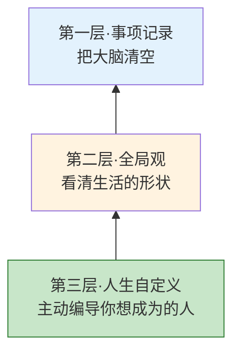
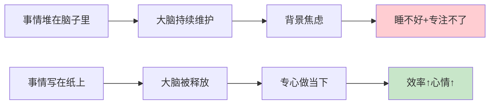
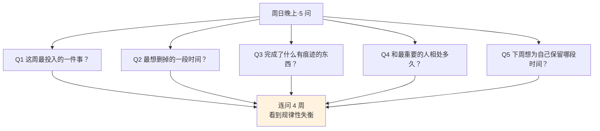
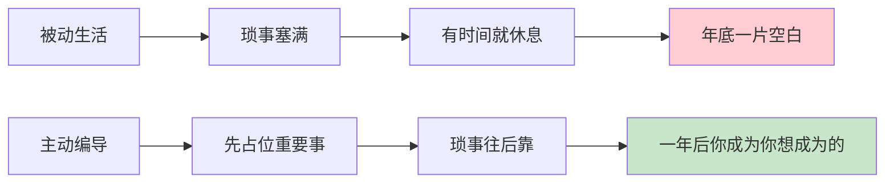
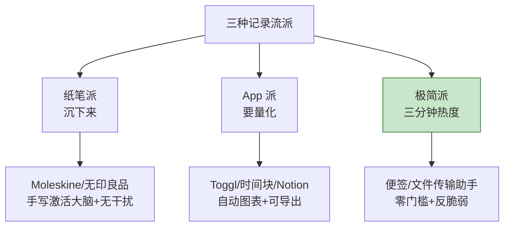
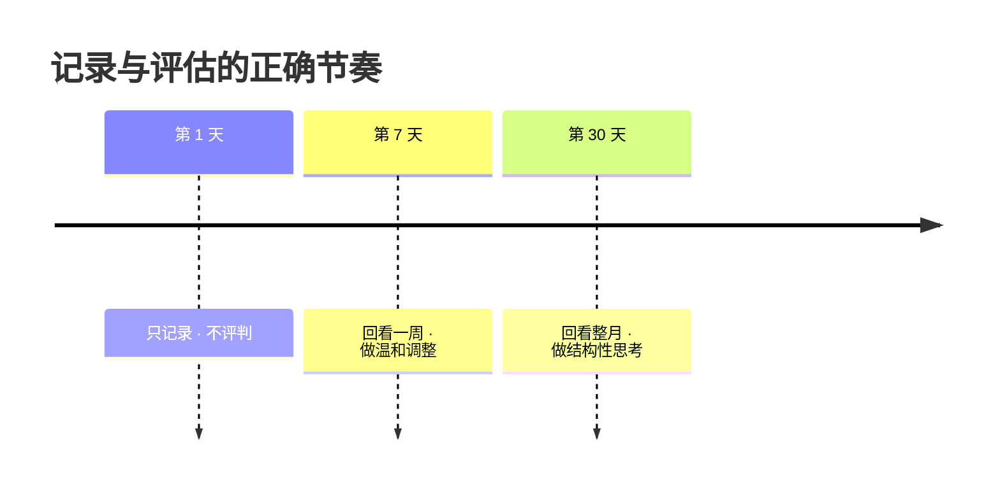
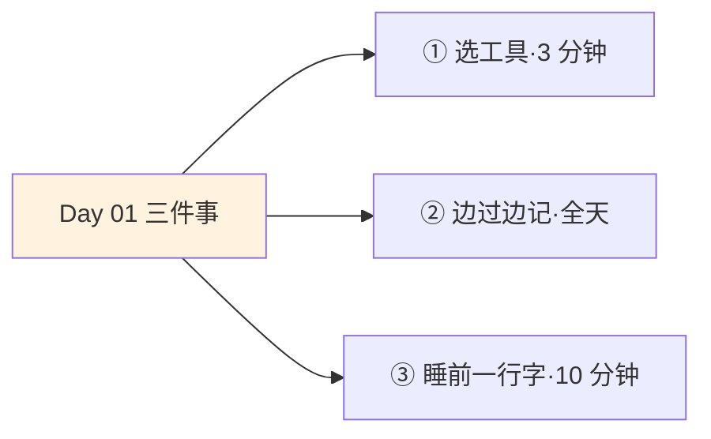
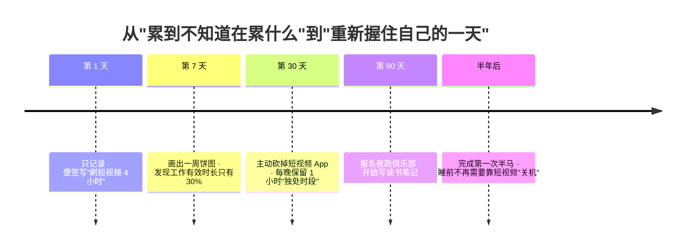

## Day 01·记录生活：从"过日子"到"看见时间"

- [01.看一个真实案例](#01看一个真实案例)
- [02.看见是改变起点](#02看见是改变起点)
- [03.记录的三层进阶](#03记录的三层进阶)
- [04.第一层单纯记录](#04第一层单纯记录)
- [05.第二层建全局观](#05第二层建全局观)
- [06.第三层自我实现](#06第三层自我实现)
- [07.挑一个记录工具](#07挑一个记录工具)
- [08.真实读者惊讶单](#08真实读者惊讶单)
- [09.记录不是审判你](#09记录不是审判你)
- [10.今天要做的三件事](#10今天要做的三件事)
- [11.总结回顾本章节](#11总结回顾本章节)
- [12.后来发生的改变](#12后来发生的改变)
- [13.今天起改变三点](#13今天起改变三点)
- [14.课后作业思考下](#14课后作业思考下)

---

## 01.看一个真实案例

去年冬天，一位读者给我发来一段语音，声音是哑的，大概是刚下班到家。她说自己最近一个月都很累，累到不知道自己在累什么。她把一天描述给我听：早上七点起床，赶最早一班地铁；上午被三个会议塞满，午饭是外卖，边吃边回消息；下午继续开会、写方案、改需求；晚上八点回到家，先躺半个小时，然后洗漱、刷手机、追剧，凌晨一点睡觉。她问我，你觉得我哪里不对？

我没有直接回答，只让她做一件事：明天开始，随身带一张便签，每两个小时写一行字，记下自己刚才这两个小时做了什么，不评判、不总结，只记录。

一周之后她又发来消息。这一次她只说了一句话："原来我一天要刷四个小时短视频。我以为是四十分钟。"

这就是记录的力量。它不能替你解决任何问题，但它能做一件更重要的事：让你看见问题。

## 02.看见是改变起点

在传统时间管理教程里，记录经常被当成一件过时的、老派的、太麻烦的事情被跳过，所有人都想直接学番茄钟、GTD 和四象限。可你连自己的时间到底去哪了都不知道，学任何方法都是在替一个陌生人做安排，就像还没测量身材就开始买衣服，怎么可能合身。

Day 01 只做一件事：让你重新看见你自己的一天。

这不是我发明的道理。苏联昆虫学家柳比歇夫从二十六岁开始用他自己发明的时间统计法记录每一天，一直到八十二岁去世，整整坚持了五十六年。他一生留下七十多本学术专著和上万页笔记，传记《奇特的一生》里记下了他那句话："我记录时间，不是为了节省时间，而是为了不让时间消失。"

时间不会消失，它只会偷偷跑到你没有意识到的地方。记录，就是把它揪出来。

如果你有过任何一种感觉：一天过完，回想起来记不清做了什么；一周过完，觉得很忙但拿不出一件像样的成果；一年过完，感觉自己什么都没变，除了长了一岁。那你就必须认真做完今天的功课，它是全书三十天的地基。

## 03.记录的三层进阶

真正的时间记录，不是写日记，也不是打卡。它是一个逐层深入的认知工具，从浅到深有三层。



绝大多数人一辈子停在第一层。三十天之后，你会至少来到第二层，最好的情况是摸到第三层。接下来三节，我们逐层展开。

## 04.第一层单纯记录

第一层是最初级、也是最容易开始的一层，所有形式的写下来都算数。比如早上出门前，在便签上写今天要买牛奶、要给妈妈打电话；假期之前，列一张清单，写下想去哪儿、想做什么、想见谁；每天睡前，在备忘录里记一句今天最开心、最累或者最后悔的一件事。

为什么单纯记录就有用？因为大脑不是用来记录的，是用来思考的。当你不断把该做的事堆在脑子里，大脑就会分出一部分算力持续维护这个清单，让你处于一种低强度的背景焦虑之中。这种焦虑你察觉不到，但它持续消耗你，让你晚上睡不好，白天专注不了。

心理学上叫蔡格尼克效应：未完成的任务会占据心智，直到它被完成或被外化。一九二七年，心理学家蔡格尼克在维也纳一家咖啡馆里注意到，服务员对未结账的订单记得清清楚楚，一旦结完账就立刻忘光。她把这个现象写进了博士论文。未完成，占心智；写下来，就释放。



很多人以为记不下来是因为记性不好，其实是大脑一直被迫记，反而越记越乱。

第一层的操作极其简单，只有三步：看到、写下、放下。看到一件需要做的事，写在你选定的载体上，可以是一张便签、一个 App，也可以是文件传输助手，然后立刻从大脑里放下。你的大脑不再是仓库，而是加工厂。这是零焦虑生活的第一块砖。

## 05.第二层建全局观

如果只停留在第一层，你会有一堆便签、一堆待办清单，但你不会知道自己的生活形状是什么样的。第二层，就是把一天、一周、一个月连起来看。

三种做法，任选一种。

第一种是时间块记录法。把二十四小时切成四十八个半小时格，每两小时打一次卡，用一行字写下这两个小时干了什么。周日晚上把七天摊开来看，你会发现：以为工作了十小时，有效时间可能只有四小时；以为睡了八小时，实际入睡加干扰只有六个半小时；以为陪家人的时间不少，实际每天只有半个小时真正在场。

第二种是月度饼图。到月底，把这三十天所有时间分成几大类：工作、睡觉、通勤、吃饭、娱乐、运动、学习、社交、其他，画成一张饼图。一张饼图能看出比三十篇日记还多的东西，你会看到自己生命的形状。

第三种是我最推荐的关键指标周报。每周日晚上花十五分钟，问自己五个问题，一句话回答。这五个问题是：这一周我最投入的一件事是什么？最想删掉的一段时间是什么？完成了什么可以留下痕迹的东西？和最重要的人相处了多久？下一周我最想为自己保留哪段时间？



这五个问题连问四周，你会看到一些规律性的失衡。比如你连续四周都后悔周三晚上刷手机，或者连续四周都想给自己周六上午留一段完整时间。这些规律，就是你调整生活的入口。

一位程序员读者做了八周周报后，把一张纸拍给我看。八次里有七次，最想删掉的时间都是周会；七次里有五次，最投入的一件事都是周五下午一个人调代码。他做的调整只有一件：跟主管申请把周会改成异步文档加十五分钟站会，然后把周五下午彻底封起来。三个月后他晋升了。他跟我说，这个决定我八周前就该做的，只是我没看见。

## 06.第三层自我实现

到了第三层，记录不再是被动的记账，而是主动的编导。你会在一天开始时，就先给最重要的两件事占位，不是等琐事做完再看剩多少时间；你会在每周主动规划想让下一周被什么样的时间填满，而不是被会议、临时需求、家庭琐事牵着走；你会在每月做一次和"我想成为什么样的人"的对齐，看看正在做的事，是不是正在把你带到想去的地方。

这一层的核心变化，是你开始意识到时间和你想成为的人之间存在关系。你不再问今天有没有做完事，而是问今天有没有更接近那个我想成为的人。



举个例子。一位读者以前每天回家瘫在沙发上刷三个小时手机，进入第三层之后，她把其中一小时切出来学英语，目标是两年后能自由旅行。半年后她能读英文小说，一年后她真的独自去了一趟英国。时间的用法，决定了她成为了会读英文小说、能独自去英国旅行的自己。

从第一层到第三层，本质是三次身份跳跃：从生活的记账员，到生活的观察员，再到生活的编剧。这本书接下来的二十九天，每一天都在帮你完成这三次跳跃。

## 07.挑一个记录工具

我经常被问，我该用哪个 App。答案是用哪个都可以，但你必须现在就选一个，不能拖到明天。工具永远是工具，重要的是今晚就用起来。三种流派，按性格挑。



| 流派 | 代表工具 | 优点 | 缺点 | 适合谁 |
|:---|:---|:---|:---|:---|
| **纸笔** | Moleskine·Hobonichi·任意便签本 | 手写激活大脑，脑区激活多三倍；无干扰；仪式感 | 需随身带；不易统计；丢了没了 | 想离手机远一点的你 |
| **App** | Toggl·时间块·Notion·aTimeLogger | 自动出图；多端同步；可导出 CSV | 打开就被推送带走；忘记点结束；爱在配模板上耗 | 爱数据、要出周报的你 |
| **极简** | 便签·文件传输助手·A4 纸 | 零门槛；不会放弃；漏一两天无所谓 | 颗粒度粗；不易统计 | 试过很多方法都放弃的你 |

纸笔派的优点来自手写本身。脑科学研究发现，手写时激活的脑区比键盘输入至少多三倍，尤其是负责意义处理的区域。你手写"我下午刷了两小时手机"，比在 App 里点几下选项更容易让大脑真正接收这个事实。App 派的优点是自动化，一周结束你能看到饼图、柱状图和趋势线，数据还能导出。极简派的优点是零门槛，越简单越持久，而且反脆弱，漏记一两天完全无所谓，直接续上就行。

新读者我最推荐极简派，理由只有一条：一个能坚持三十天的极简方法，永远比一个只能坚持三天的完美方法有效。

给数字派再补一个提醒：永远选最简单的那个 App。你花在挑 App 上的时间，一定比 App 帮你省下的时间多。不知道选什么，就直接用手机自带的备忘录。工具越花哨，坚持越困难，这是过去十年时间管理领域被反复验证的一条规律。

## 08.真实读者惊讶单

我收集了两百多位读者做完第一天记录后发来的惊讶清单，出现频率最高的十条列在下面。对照看看，哪几条也是你。

| # | 读者原话 | 出现频率 |
|:--:|:---|:--:|
| 1 | 我以为在工作，实际一半时间在等别人回消息 | ★★★★★ |
| 2 | 刷短视频比我以为的多三倍 | ★★★★★ |
| 3 | 我一天真正独处的时间不到二十分钟 | ★★★★☆ |
| 4 | 开会四小时，真正和我相关的不到四十分钟 | ★★★★☆ |
| 5 | 我说没时间陪家人，实际每天陪一点五小时，只是我一直在看手机 | ★★★★☆ |
| 6 | 我一天在切换任务上花了差不多一小时 | ★★★☆☆ |
| 7 | 我以为早睡了，实际躺床上玩手机四十五分钟 | ★★★☆☆ |
| 8 | 通勤两小时，完全想不起来这两小时听了什么想了什么 | ★★★☆☆ |
| 9 | 一天喝水次数比我以为的少一半 | ★★★☆☆ |
| 10 | 一天最开心的十分钟是遛狗，我却一直嫌它烦 | ★★★☆☆ |

读完停一下，写下你最可能对应的三条，然后带着这三条去做今天的记录。只要你带着问题去看，你一定看得见答案。

我特别想强调第四条和第五条。很多人以为自己忙到没时间陪家人，实际每天有一点五小时和家人在同一屋檐下，只是那段时间里他一直在看手机。人在这里，心不在这里，比不在更让家人受伤。做完三十天记录，很多读者最大的改变不是效率提升，而是开始理解自己在家人心里到底是什么样子。这是记录法带来的隐藏福利：它不只让你看见时间，也让你看见关系。

## 09.记录不是审判你

这一节我要提前打一个预防针。很多人做完第一天记录会陷入一种情绪：自责。原来我这么浪费时间，原来我一天什么正事都没做，连番茄钟都用不好，我这辈子完蛋了。这种情绪如果处理不好，会直接毁掉后面的二十九天。很多人放弃时间管理，不是因为方法不好，是因为受不了记录之后带来的挫败。

请记住这句话，它是全书的心态基石：自责让人放弃，看见让人改变。

记录的目的不是审判你自己，而是把时间从感觉里的模糊物变成眼前的具体物，你才有可能对它做点什么。心理咨询里有个原则：任何评估性的问题，都要在数据完整之后才问。



第一天，你只做记录，不做评判。第七天，你回头看一周的数据，做温和的调整。第三十天，你回头看整月的数据，做结构性的思考。你不需要在第一天就成为完美的自己，你只需要今天认真看一眼自己。

如果第一天记完之后你确实觉得难受，做两件事。第一，把那些让你自责的记录用另一种颜色圈出来，不删也不改，它们是你三十天最珍贵的起点数据。第二，在旁边写一句话：我今天看见了它。仅此而已。看见本身就是胜利，你上一次真正看见自己的时间，可能已经是很多年之前了。

## 10.今天要做的三件事

说了这么多，现在到了今天真正要做的事。只有三个动作，加起来不到十五分钟。



动作一是选定你的工具，三分钟搞定。如果你选纸笔，现在拿出一个本子，写下 Day 01 和今天的日期；如果你选 App，现在下载一个，并在里面新建一个叫"三十天时间记录"的项目；如果你选极简法，现在打开微信的文件传输助手或者手机备忘录，新建一条叫"Day 01 时间记录"的笔记。别多想，选完就去做，三十秒内完成。

动作二是把今天剩下的时间记录下来。从读完这本书这一刻起，你就正式进入记录状态。不需要精细，每两小时记一行字就够了，格式可以这样：

```text
08:00-10:00  上班路上 + 早会
10:00-12:00  写方案，中间被打断 5 次
12:00-14:00  午饭 + 和同事聊天 + 刷了 30 分钟微博
14:00-16:00  改需求文档 + 回复 8 条工作消息
16:00-18:00  开会，后半段走神
18:00-20:00  回家 + 晚饭 + 刷小红书 40 分钟
20:00-22:00  追剧，中间被工作消息打断 3 次
22:00-00:00  洗漱 + 躺床上刷手机，具体做了什么忘了
```

格式不重要，颗粒度粗一点也没关系。重点不是完美记录，而是开始。今天你只需要证明给自己一件事：你能连续十二个小时不间断地对自己诚实。

动作三是睡前五分钟复盘。睡觉之前做两件事：先把二十四小时铺开看一眼，哪一段时间是你真正满意的，哪一段时间让你觉得不该这么用。然后写一行字：今天最让我惊讶的时间去向是什么。这行字是你三十天旅程的第一个锚点，三十天之后你回头看这三十行字，会看到一个不一样的自己。

## 11.总结回顾本章节

看见时间是所有时间管理方法能生效的前提。第一天不学理论、不背概念，只做一件事：让今天的自己被自己看见。

记录有三层进阶：事项记录、全局观、自我实现。绝大多数人停在第一层，三十天带你至少到第二层，最好摸到第三层。三种工具任挑一种，纸笔、App 或者极简法，新读者选极简派，只要能坚持三十天就赢。工具不重要，今晚就用最重要。心态基石是自责让人放弃、看见让人改变。第一天只记录不评判，第七天再温和调整，第三十天做结构性思考。

一句话总结整章：先量身，再买衣服；先看见，再改变。今天你只需要做量身这一件事，接下来二十九天我陪你做剩下的事。

## 12.后来发生的改变

回到开篇那位刷四小时短视频的读者，我告诉你她后来发生了什么。



第一周，她只做了记录这一件事，什么都没有改。到第七天，她把一周的时间摊在桌上，才发现有效工作只占百分之三十，剩下七成分给了看似在忙、其实在等的碎片。她说那一刻的感受不是自责，而是松了一口气：原来我不是能力不行，是我的时间一直在漏。

第二周开始，她做了一件小事：每天晚上八点半到九点半，手机放在客厅，人在书房。就这一件事，两周后短视频时间自然掉到一小时以内。她并没有戒掉手机，她只是把手机放到了看不见的地方。

第三十天她做了另一件事：把每周日晚上十五分钟的五问周报写在墙上。她说这是整套动作里唯一让她忍不住继续的部分。她说自己第一次感觉在设计中生活，而不是被生活推着走。

她跟我说过三句话，我印象很深。第一句是，我发现很累的真相不是事情多，而是我从来没有一段时间是留给自己的。第二句是，我不再纠结今天有没有高效，而是问今天有没有一段时间只属于自己。第三句是，以前时间像流走的水，现在时间像手里的沙，我看得见每一粒。

改变她的不是任何一个复杂工具，是那本便签，是看见这个动作本身。三十天前她以为要靠意志力对抗手机，三十天后她意识到根本不需要对抗，只需要看见。看见之后，选择自然会发生。

## 13.今天起改变三点

对于时间，看见和分配同样重要。

第一，从今晚起，只记录不评判。挑一种工具，从这一刻起进入记录状态。今天不问自己该不该这样过，只问自己刚才这两个小时到底做了什么。记录本身不产生价值，连续记录才产生价值。你的第一次真正的看见往往发生在第五到第七天，那时你会突然意识到某个反复出现的模式。在那之前，你要做的只有一件事：不断线。

第二，每周日晚上留十五分钟做周复盘。用第五节的五问周报，连问四周，你会看到规律性失衡，它就是你调整生活的入口。很多人做一周就放弃，是因为一周看不出规律，这是正常的，规律至少要在第三周才会浮现。请忍到第三周再评估要不要继续。

第三，扉页写下一个大问题。在你记录本的第一页写下这句话：如果我按现在这种方式再过十年，我会成为什么样的人？每次翻开都看一眼，这是你三十天最有力的锚。当三十天里的任何一天感到不想记了，翻回第一页看一眼这个问题，你就会继续。

## 14.课后作业思考下

第一，今晚就完成 Day 01 的三个动作：选工具、全天记录、睡前一行字。并把睡前那句"今天最让我惊讶的时间去向"发给一位你信任的朋友。说出来的承诺更容易兑现。

第二，对照第八节的十条惊讶清单，圈出你觉得最像自己的三条，写下每一条你希望在三十天后变成什么样子。

第三，回想一件最近一个月你后悔的时间使用，可以是一次刷手机到凌晨，一次答应了不该答应的应酬，或者一段被浪费的通勤。如果重来一次，那段时间你希望怎么用？把答案写在记录本的第一页。

第四，挑选一种记录工具用整整一周。周末盘点你实际坚持了几天。如果不到五天，说明这个工具不适合你，换一种；如果五天以上，说明它是你的搭档，接下来三十天就用它。

---

**明日预告 · Day 02 极限情景：如果生命只剩下一年。** 目标的单一性是治疗错乱的良药。明天我们从看见一天跳到看见一生：假设生命只剩下一年，你会立刻做什么？谁是你想告诉他我爱你的人？不是让你悲观，是用未来审视今天。记得今晚认真做完第一天的记录。明天见。
