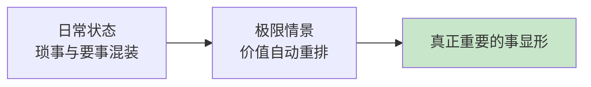
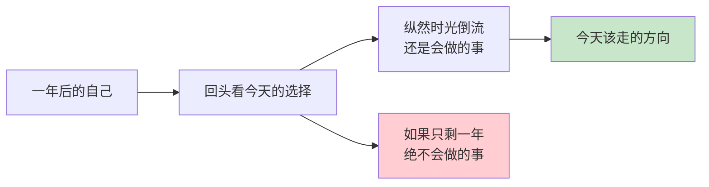

## Day 02·极限情景：如果生命只剩下一年

- [01.看一个真实案例](#01看一个真实案例)
- [02.什么是极限情景](#02什么是极限情景)
- [03.目标单一性治愈力](#03目标单一性治愈力)
- [04.只剩一年的假设](#04只剩一年的假设)
- [05.从假设回到今天](#05从假设回到今天)
- [06.总结回顾本章节](#06总结回顾本章节)
- [07.后来发生的改变](#07后来发生的改变)
- [08.今天起改变三点](#08今天起改变三点)
- [09.课后作业思考下](#09课后作业思考下)

---

## 01.看一个真实案例

一位朋友的父亲在体检中查出问题，复查等待的那两周，全家陷入了沉默。他后来跟我描述那两周：他突然不再纠结年终评优，不再在意同事的那句阴阳怪气，删掉了手机里三个购物 App，每天下班准时回家陪父亲吃饭。他说那两周里他做的每一个决定，都干脆得不像自己。

复查结果出来，虚惊一场。三个月之后，他又开始为评优焦虑，为同事的话失眠，购物车又满了起来。他跟我复盘时说了一句很诚实的话：那两周才是我，剩下的时候我都在过日子，只有那两周我在活。

问题来了：为什么一个假设性的危机，能在两周内重构一个人的全部优先级？而这份清醒，又为什么如此难以保持？这就是今天要讲的东西：极限情景。

## 02.什么是极限情景

极限情景是心理学里的一个概念，指的是人处于重大危机时刻的处境。在那个时刻，内心被绝望或者恐惧充满，以至于感受不到外界的琐事，会暂时忘记周围的一切，眼前只浮现出对自己来说真正重要的事。

日常状态下，我们的注意力被摊得很薄：领导的评价、同事的关系、房贷的数字、朋友圈的点赞，每一样都占用一点心智带宽，重要的事和琐碎的事混在一起，权重难以分辨。而极限情景像一台巨大的磁铁，把所有铁屑吸到一边，真正重要的事立刻显形。

你不需要真的经历一场危机才能获得这种视角。极限情景的价值不在于危机本身，而在于它揭示的那个排序结果。既然结果可以被看见，它就可以被主动提取。今天我们做的，就是一次安全的提取。

## 03.目标单一性治愈力

人一旦在选定的道路上开始奔跑，目标的单一性带来的执着感，其实是治愈错乱的良药。

这句话值得慢慢读。现代人的焦虑，大部分来自目标的 plural：既想要升职又想要自由，既想陪伴家人又想在事业上搏杀，既想健康又舍不得熬夜换来的一切。目标越多，撕扯越大，每一刻都在错位感里度过。而极限情景之所以让人平静，是因为它强制收敛成了一个目标，撕扯消失了。

有梦想激励的日子，不会觉得疲惫。工作中需要找到成就感和满足感，记录喜欢的一切并经常去分享。这不是鸡汤，是注意力经济学：当所有资源投向一个方向，反馈就会密集地回来，人就进入正循环。

## 04.只剩一年的假设

现在，请你放下书，拿出一支笔，完成下面这个练习。规则只有一条：不要想太久，想到什么写什么，写完不许涂改。

假设你的生命只剩下一年。你会立刻辞职吗？你会告诉谁我爱你？你想去哪里，做完什么？你会停止做什么？谁是你最想见的人？什么是你终于可以放下的？

写的时候留意三个信号。第一个信号是写到某一条时笔停住了，那一停顿里藏着你一直在回避的东西。第二个信号是某一条让你鼻子发酸，那大概率是你真正在乎却长期亏欠的。第三个信号是某些你现在投入大量时间的事，在清单里完全没出现，那些就是该重新审视的。

这个练习的心理学基础是柯维在《高效能人士的七个习惯》里提出的原则：以终为始。所有事物都经过两次创造，先是心智上的创造，然后是实际的创造。你刚才在纸上完成的，就是第一次创造。

## 05.从假设回到今天

一天的假设不是让你及时行乐，而是用未来审视今天。

那些看似用不完的明天，总有一天会用完。看起来到不了的未来，也总有一天会到来。如果说时间可以解决一切问题，那么今天问题的答案，会写在未来。用遥远未来的自己审视今天的决定，你会做出完全不同的选择：这份还要不要忍，这个人还要不要处，这件事还要不要拖。

清单里那些纵然时光倒流都还是会去做的事情，就是今天需要的答案。清单里那些立刻消失的事，就是今天可以开始放下的负资产。

## 06.总结回顾本章节

极限情景是价值排序的显影液，它不需要被经历，只需要被提取。目标单一性是治愈错乱的良药，撕扯来自目标 plural，平静来自收敛。一年假设的目的不是悲观，而是以终为始：答案写在未来，行动落在今天。

## 07.后来发生的改变

那位虚惊一场的朋友后来做了一件事。他没有辞职，没有卖房去环游世界，而是把那张清单拍了照，设成手机锁屏。半年后他告诉我三件事：他把每周三晚上固定留给了女儿，因为清单里她排第一；他推掉了一个应酬型的兼职，因为清单里它根本不存在；他重新捡起了搁置十年的摄影，因为写清单时笔停住的那一条，就是它。

他说清单没有改变他的生活轨迹，但改变了他每个周末早上醒来后做的第一件事：先看一眼锁屏，再决定今天怎么过。

## 08.今天起改变三点

第一，完成只剩一年的七问清单，写完拍照存好，不许涂改。第二，从清单里圈出一件纵然时光倒流还是会做的事，把它安排进下一周的日程，给它一个具体的时间格子。第三，把清单里立刻消失的那些事各写一行，贴在办公桌能看到的地方，它们是你今天就可以开始说不的对象。

## 09.课后作业思考下

第一，对照昨天 Day 01 的时间记录，看看清单里排在前列的人和事，昨天分到了多少时间，差距有多大。第二，回想一次你曾经的目标单一时期，可以是一次大考、一次比赛、一段热恋，分析那段时间你为什么效率惊人。第三，问自己一个问题：如果这张清单一年后要重写，你希望哪一条从纸上换到现实里，答案就是今年的主目标。

---

**明日预告 · Day 03 人生起落图：观察每一次决定性瞬间。** 极限情景让你看到了终点的重要性，明天我们把镜头转向来路。一张画着曲线的图，会告诉你自己是怎么一步步走到今天的，以及你此刻站在哪个位置。
