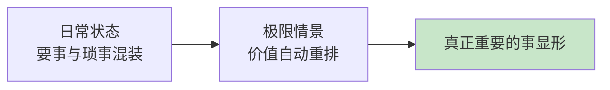
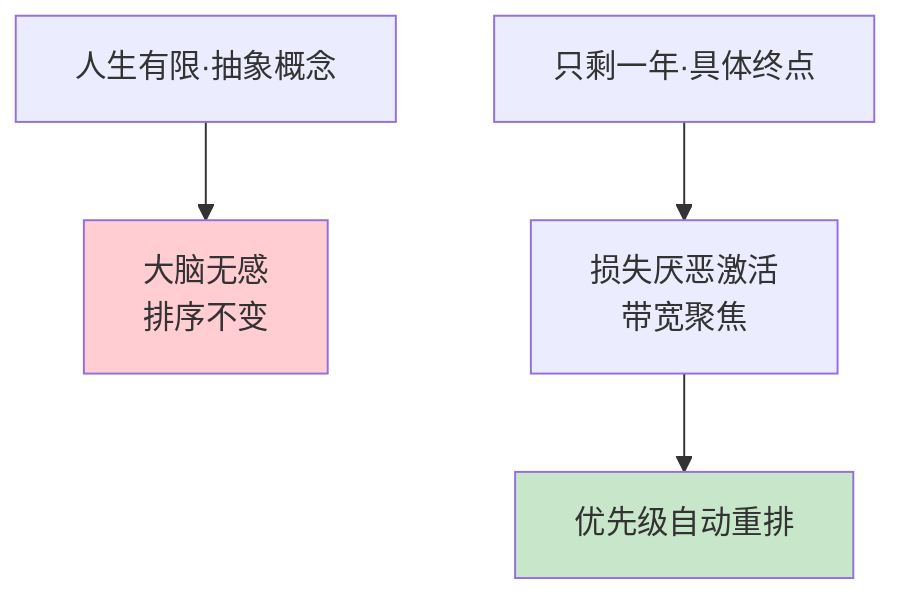
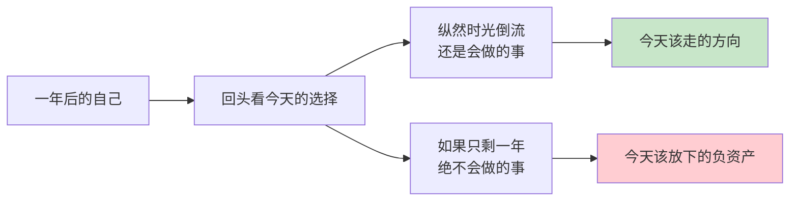
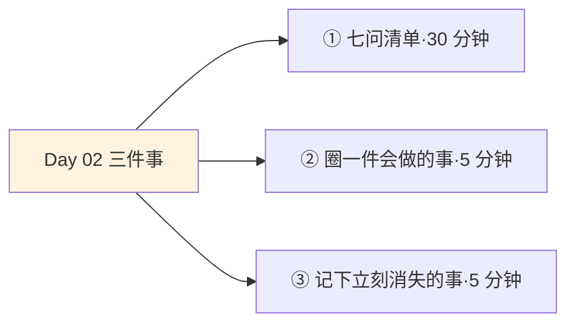
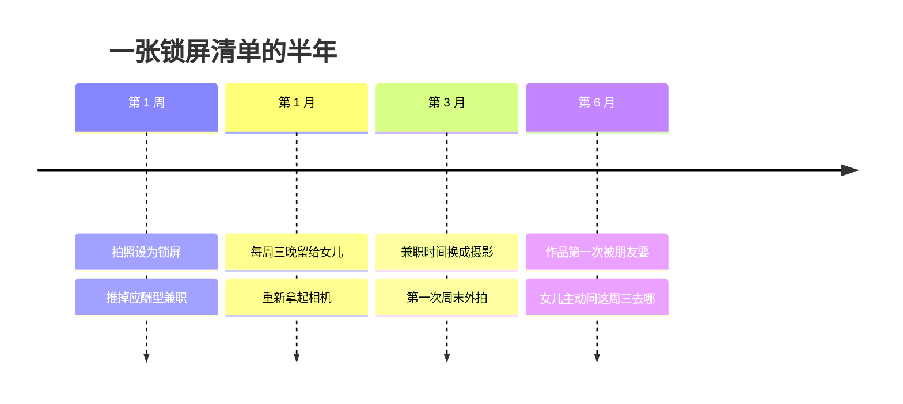

## Day 02·考虑极限情景：如果生命只剩下一年

- [01.看一个真实案例](#01看一个真实案例)
- [02.什么是极限情景](#02什么是极限情景)
- [03.为什么假设也能生效](#03为什么假设也能生效)
- [04.目标单一性治愈力](#04目标单一性治愈力)
- [05.临终床前的五个答案](#05临终床前的五个答案)
- [06.只剩一年的七问](#06只剩一年的七问)
- [07.写的时候留意三个信号](#07写的时候留意三个信号)
- [08.从假设回到今天](#08从假设回到今天)
- [09.一个误区要提前说清](#09一个误区要提前说清)
- [10.今天要做的三件事](#10今天要做的三件事)
- [11.总结回顾本章节](#11总结回顾本章节)
- [12.后来发生的改变](#12后来发生的改变)
- [13.今天起改变三点](#13今天起改变三点)
- [14.课后作业思考下](#14课后作业思考下)

---

## 01.看一个真实案例

一位朋友的父亲在体检中查出问题，复查结果要等两周。那两周，全家陷入了沉默。

他后来跟我描述那两周的自己：推掉了所有能推的应酬，删掉了手机里三个购物 App，购物车清了空，每天下班准时回家陪父亲吃饭，饭桌上聊的都是小时候的事。工作上的事一件没耽误，但好像突然都不重要了。他说那两周里他做的每一个决定，都干脆得不像自己。

复查结果出来，虚惊一场。全家长舒一口气。然后有意思的事情发生了：三个月之后，他又开始为年终评优焦虑，为同事的一句阴阳怪气失眠，购物车又慢慢满了起来。他跟我复盘时说了一句很诚实的话：那两周才是我，剩下的时候我都在过日子，只有那两周我在活。

问题来了。为什么一个假设性的危机，能在两周内重构一个人的全部优先级？而这份清醒，又为什么如此难以保持？如果那两周里的排序才是真的，有没有办法不经历危机，就把真的东西拿出来？

这一篇要做的就是这个：用一次安全的提取，把极限情景里的清醒，搬到你的日常里来。

## 02.什么是极限情景

极限情景是心理学里的一个概念，指的是人处于重大危机时刻的处境。在那个时刻，内心被绝望或者恐惧充满，以至于感受不到外界的琐事，会暂时忘记周围的一切，眼前只浮现出对自己来说真正重要的事。

日常状态下，我们的注意力被摊得很薄。领导的评价、同事的关系、房贷的数字、朋友圈的点赞，每一样都占用一点心智带宽，重要的事和琐碎的事混装在同一个包里，权重难以分辨。而极限情景像一台巨大的磁铁，把所有铁屑吸到一边，真正重要的事立刻显形。

注意这个词：显形。极限情景不创造新的重要的事，它只是让原本就重要的事显形。父亲对你重要，不是那两周才重要的；家人的陪伴重要，也不是危机发明出来的。危机只是把别的声音调小，把它们调大。

这个区分很关键，因为它意味着：**你不需要真的经历一场危机才能获得这种视角。极限情景的价值不在于危机本身，而在于它揭示的那个排序结果。既然结果可以被看见，它就可以被主动提取。**

## 03.为什么假设也能生效

你可能会怀疑：只是假设一下，真的有用吗？有两个被反复验证的心理学机制，支撑着这件事。

第一个机制叫稀缺俘获。经济学家穆来纳森在《稀缺》这本书里给过一个结论：任何形式的稀缺，都会自动俘获大脑的注意力。时间富余的时候，你的注意力像摊开的黄油，抹得到处都是；一旦终点变成稀缺的，比如只剩一年，大脑会自动把全部带宽聚焦到和这个终点相关的事情上。这不是意志力，是大脑的出厂设置。极限情景做的事，是人为制造一次终点稀缺，借用大脑自己的聚焦机制。

第二个机制叫损失厌恶。心理学家卡尼曼和特沃斯基的研究表明，失去带来的痛苦，强度大约是等量获得带来的快乐的两倍。平时说人生有限，是一个抽象概念，大脑无感；只剩一年把失去变成了具体的、可以计算的、有截止日期的东西，于是损失厌恶被激活，价值排序立刻重排。

所以今天要做的七问清单不是心灵游戏，它是一次合法的心理学操作：用具体的假设，触发大脑对终点的稀缺反应。

## 04.目标单一性治愈力

人一旦在选定的道路上开始奔跑，目标的单一性带来的执着感，其实是治愈错乱的良药。

这句话值得慢慢读。现代人的焦虑，大部分来自目标的繁多：既想要升职又想要自由，既想陪伴家人又想在事业上搏杀，既想健康又舍不得熬夜换来的一切。目标越多，撕扯越大，每一刻都在错位感里度过。心理学给这种状态起了个名字，叫目标冲突：两组都想要的结果互相争夺同一份时间和注意力，结果是谁都得不到全力，还平添一层我怎么什么都做不好的二次焦虑。

而极限情景之所以让人平静，是因为它强制收敛成了一个目标。撕扯消失了，带宽全给了唯一的方向，反馈开始密集地回来，人就进入正循环。回想一下你人生里效率最高的几段时间：备考的最后一个月、备赛的那几周、热恋的那阵子。共同点只有一个，那段时间里，你心里基本只装着一件事。

有梦想激励的日子，不会觉得疲惫。这不是鸡汤，是注意力经济学：当所有资源投向一个方向，反馈就会密集地回来。极限情景的作用，是替你砍掉目标，留一个。

给你看一个对照案例。一位读者曾经同时进行着四件事：考研、做自媒体、健身、学英语，每一件都对，四件加起来就是灾难。她每天的日程表排得很满，但每做一件的时候都在惦记另外三件没做，晚上躺在床上算一算四件事的进度，全是焦虑。后来她做了一个决定：一年只考研，其他三件全部冻结，不是放弃，是排到明年。她跟我说冻结之后的第一周，她体验到了久违的东西：做完一天的题，晚上居然是满足的，不是欠债的。那一年她考上了。她的总结是：**原来不是我不行，是我同时想行的太多了。**

这不是她意志力变强了，是撕扯消失了。同样的脑力，四条战线互相拉扯时全是内耗，一条战线上时全是推进。目标单一性的治愈力，就体现在这里：它不给你更多能量，它只是不再浪费你已有的能量。

## 05.临终床前的五个答案

如果极限情景揭示的排序是真的，那么有一群人最有资格作证：真正站在终点的人。

澳大利亚有一位叫布朗妮·维尔的临终关怀护士，八年时间里陪伴临终者走过最后的日子。她把病人们在生命尽头最常说的话记录下来，写成了一本书，叫《临终前最后悔的五件事》。这五个遗憾，等于几千次极限情景的采样结果：

| 排序 | 临终的遗憾 | 它在问今天的你 |
|:--:|:---|:---|
| 一 | 我希望我有勇气过自己真正想要的生活，而不是别人期望我过的生活 | 你现在过的是谁的日子 |
| 二 | 我希望我没有那么拼命工作 | 你卖掉的时间换回了什么 |
| 三 | 我希望我有勇气表达自己的感受 | 你咽下去的那句话是什么 |
| 四 | 我希望我和朋友们保持了联系 | 你上次主动联系老朋友是什么时候 |
| 五 | 我希望我能让自己活得开心一点 | 你在等谁批准你快乐 |

把这张表读三遍，你会发现两个惊人的事实。第一，五个遗憾里没有一个和钱有关，没有一个和再努力一点有关。第二，五个里有四个的措辞是我希望我有勇气。不是没时间，不是没能力，是没勇气。

**濒死的人回头看，看见的障碍从来不是资源，是勇气。**这大概是对到底什么在拦着我这个问题，能给出的最权威的回答。

## 06.只剩一年的七问

现在，请你放下书，拿出一支笔，完成下面这个练习。规则只有三条：不要想太久，想到什么写什么；写完不许涂改；写完之前不回头看。

假设你的生命只剩下一年。逐个回答下面七个问题，每题一行。

第一问，你会立刻辞职吗？第二问，你会告诉谁我爱你？第三问，你想去哪里，做完什么？第四问，你会停止做什么？第五问，谁是你最想见的人？第六问，什么是你终于可以放下的？第七问，今天，也就是你还剩一年的第一天，你最想改变的一件事是什么？

写得越快越好。第一反应的答案，比深思熟虑的答案诚实得多。写完之后把清单拍照存好。这份清单，就是你此刻人生优先级的显影底片。

## 07.写的时候留意三个信号

写的时候留意三个信号，它们比答案本身更有信息量。

第一个信号是写到某一条时笔停住了。那一停顿里藏着你一直在回避的东西。笔停不是没答案，是答案太清楚，清楚到写下来会觉得烫。

第二个信号是某一条让你鼻子发酸。那一条大概率是你真正在乎、却长期亏欠的。人在纸上诚实的程度，远超过在嘴上。

第三个信号是反面的：某些你现在投入大量时间的事，在整张清单里完全没出现。你现在天天纠结的评优、你每周花十几小时维护的某个圈子、你每天刷两小时的软件，如果它们在你只剩一年的清单里一个字都没有，那它们就是该被重新审视的对象。**清单里出现的，是你的资产；清单里没出现的，是你的惯性。**

惯性这个词值得多说一句。惯性最大的特点是安静：它不制造冲突，不引发思考，它只是每天顺理成章地吃掉几个小时。评优的焦虑、圈子的维护、软件的刷新，每一项单看都有正当理由，加起来就是你的人生。极限情景像一次断电：灯全灭了，再亮起来的时候，你才看见哪些是真房间，哪些是布景。一位读者做完七问清单后跟我说，最吓人的不是答案，是答案里干干净净没有我每天花时间最多的那些东西。他说那一刻感觉自己像查账查出了黑洞。

三个信号之外，还有一个总原则：**清单写完的当天，什么都不要改。**让它过一夜。第一晚的情绪太满，满情绪做的决定容易过头，这正好衔接下一节要说清的那个误区。

## 08.从假设回到今天

一天的假设不是让你及时行乐，而是用未来审视今天。

那些看似用不完的明天，总有一天会用完。看起来到不了的未来，也总有一天会到来。如果说时间可以解决一切问题，那么今天问题的答案，会写在未来。用遥远未来的自己审视今天的决定，你会做出完全不同的选择：这份工作还要不要忍，这个人还要不要处，这件事还要不要拖。

这个做法的心理学出处，是柯维在《高效能人士的七个习惯》里提出的原则：以终为始。他说所有事物都经过两次创造，先是心智上的创造，然后是实际的创造。你刚才在纸上完成的，就是第一次创造。第二次创造，从你把清单里的某一项放进下周日程的那一刻开始。

## 09.一个误区要提前说清

这一节必须单独立在这里，因为我见过太多人把极限情景做歪了。

做完清单的当晚，有人第二天就递了辞职信，有人当场和伴侣提了分手，有人清空了存款。三个月后他们中的大多数陷入了新的混乱，然后得出结论：这套东西是骗人的。

要提前说清楚的是：**极限情景给你的不是一段新的人生，是一把新的比例尺。它的用途是校准，不是爆破。**

清单上的答案是方向，不是动作。从方向到动作之间，需要一个翻译过程，把我想怎样活着翻译成我下周具体做什么。翻译的原则是最小化：为每个答案找一个不推翻现有生活的最小版本。

| 清单里的答案 | 错误反应 | 最小正确版本 |
|:---|:---|:---|
| 陪家人 | 辞职回家 | 每周三晚上，手机放客厅 |
| 去远方 | 立刻订机票环游世界 | 定下明年一个目的地，每月存一笔旅行基金 |
| 重拾爱好 | 裸辞转行 | 每周日两小时，只给这件事 |
| 告诉某人我在乎 | 连夜长谈三小时 | 今天发一条不敷衍的消息，约一顿饭 |

回头看开篇那位朋友。虚惊一场之后，他没有辞职，没有卖房去环游世界，他只是把那两周里冒出来的东西，各安排了一个最小版本。具体做了什么，第 12 节告诉你。

## 10.今天要做的三件事

现在到了今天真正要做的事。三个动作，加起来不到四十分钟。

动作一，完成只剩一年的七问清单。三十分钟，一支笔，七行字。规则再重复一遍：写快、不涂改、写完再回看。写完拍照存好，这份底片三十天里还会用到。

动作二，从清单里圈出一件纵然时光倒流还是会做的事，把它安排进下一周的日程，给它一个具体的时间格子。注意是具体的格子，不是下周找时间这种没有落地形态的愿望。

动作三，把清单里立刻消失的那些事，一行一行写下来，贴在办公桌能看到的地方。它们从今天起就是你说不的对象：下一次它们来敲门，你有一张纸替你拒绝。

## 11.总结回顾本章节

极限情景是价值排序的显影液：稀缺俘获和损失厌恶，让假设性的终点也能触发大脑的重排机制。目标单一性是治愈错乱的良药，撕扯来自繁多，平静来自收敛。临终者的五大遗憾作证：拦住人的从来不是资源，是勇气。

七问清单不是心灵游戏，是人生优先级的显影底片。三个信号比答案更有信息量：笔停住的是烫的，鼻酸的是亏欠的，没出现的是惯性。答案的方向要用最小版本来落地，比例尺是用来校准的，不是用来爆破的。

一句话总结整章：用一年后的自己看今天，那些纵然时光倒流还是会做的事，就是今天该走的路。

## 12.后来发生的改变

回到开篇那位虚惊一场的朋友，说说他后来做了什么。

他做的第一件事，是把那两周里的那份清单拍了照，设成手机锁屏。没有辞职，没有卖房，只是从那以后每次点亮屏幕，都会先看见一遍自己的排序。

然后他做了三件最小版本的事。第一件，每周三晚上固定留给女儿，不排任何应酬，手机放在玄关，因为清单里她排第一。第二件，推掉了一个纯应酬型的兼职，那份兼职每个月带来几千块收入，但在清单里它一个字都没出现。第三件，重新捡起了搁置十年的摄影，因为写清单时笔停住的那一条，就是它。

半年后他跟我说了三句话。第一句是，清单没有改变我的生活轨迹，但它改变了我每个周末早上醒来后做的第一件事：先看一眼锁屏，再决定今天怎么过。第二句是，女儿现在会主动问我这周三去哪儿。第三句是，我删掉的那个兼职换来的摄影时间，是我这半年最不后悔的一笔交换。

他说最意外的收获是这个：**以前我以为清醒需要一场危机，现在我知道清醒只需要一张清单，和每天看它一眼。**

## 13.今天起改变三点

第一，七问清单不是做一次就束之高阁的。建议每个季度重做一次，因为答案会漂移：这一次排在第一的，下一次可能换了。**漂移本身就是最重要的信息，它告诉你生活在把你往哪里带。**

第二，用锁屏做校准器。把清单里最重要的一条写成一句话，设成手机锁屏。你每天点亮几十次屏幕，就免费做几十次优先级校准。这是成本最低的清醒工具，没有之一。

第三，警惕等我有空再说。极限情景最大的价值，是把以后变成现在。凡是清单里真正重要的事，最晚本周内给它一个时间格；凡是没有时间格的，就默认它其实没有那么重要，别再拿它安慰自己。

## 14.课后作业思考下

第一，对照昨天 Day 01 的时间记录，看看清单里排在前列的人和事，昨天实际分到了多少时间，差距有多大。把这个差距写下来，不用评判，只需要看见。

第二，回想一段你目标单一的人生时期，可以是一次大考、一次比赛、一段热恋、一个项目冲刺。分析那段时间你为什么效率惊人，撕扯消失之后省下来的心力去了哪里。

第三，布朗妮·维尔的五大遗憾里，哪一条最刺痛你？为这一条写下你现在就能做的最小的一件事，并给它一个本周内的时间格。

第四，问自己一个问题：如果这张清单一年后要重写，你希望哪一条从纸上换到现实里？答案就是你的年度主目标，Day 12 讲训练计划的时候，我们会再见到它。

---

**明日预告 · Day 03 人生起落图谱。** 极限情景让你看见了终点的排序，明天我们把镜头转向来路。一张画着曲线的图，会告诉你自己是怎么一步步走到今天的、你在哪年跌倒、哪年爬起，以及你此刻正站在曲线的什么位置。回望和远眺一样重要，因为下一段曲线的起点，就是你今天站的这个点。
