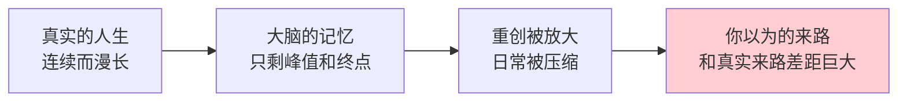
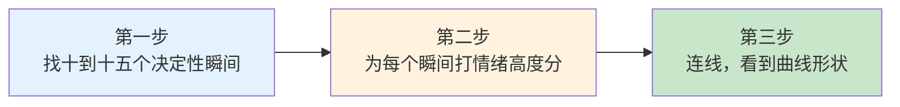
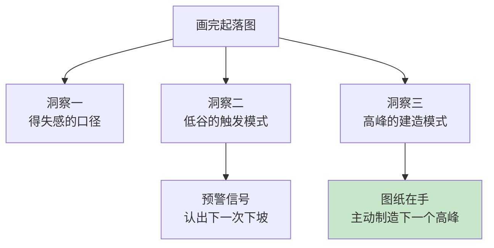

## Day 03·人生起落图谱

- [01.看一个真实案例](#01看一个真实案例)
- [02.什么是人生起落图](#02什么是人生起落图)
- [03.画图三步骤](#03画图三步骤)
- [04.看什么](#04看什么)
- [05.画完的三个洞察](#05画完的三个洞察)
- [06.总结回顾本章节](#06总结回顾本章节)
- [07.后来发生的改变](#07后来发生的改变)
- [08.今天起改变三点](#08今天起改变三点)
- [09.课后作业思考下](#09课后作业思考下)

---

## 01.看一个真实案例

去年我请一位三十岁的读者做一件事：把她出生到现在的人生画成一条曲线。

她的第一反应是抗拒。她说我的人生很平，没什么好画的，读书、毕业、工作、跳槽，普通得不能再普通。我说没关系，你就当帮个忙，画完发我看看。

三天后她发来一张照片。A4 纸上，一条歪歪扭扭的曲线从左画到右，上面标了十一个点。她附了一段话，大意是：画到第三个点的时候她哭了，画完之后她在桌子前坐了半个小时没动。

那条曲线上有一个很深的谷，落在她二十四岁那年。她标的事件是被动离职。曲线往上最陡的一段在二十七岁，她标的事件是自学转行成功。再往前，十八岁有一个小高峰，她标的是考上大学；二十二岁有一个中等深度的谷，她标的是毕业即迷茫。

发来的那段话里有一句我印象最深。她说：**我第一次看见，我所有的低谷都是别人替我做的决定，我所有的高峰都是我自己学的本事。**

这句话就是这一篇要讲的东西。你不需要马上明白它，画完你自己的图，你会得到你自己的版本。

## 02.什么是人生起落图

人生起落图是一张很简单的图。横轴是年龄，从零岁到你现在的年龄；纵轴是情绪高度，从负十到正十；然后在你的人生里标出十到十五个点，每一个点是一次你觉得「自己变了」的决定性瞬间。把这些点连起来，就是你的人生曲线。

它是终极判断法的第一半，用来回顾前半生、瞄定重大事件。Day02 我们用极限情景向前看，看到生命的终点；今天我们把镜头转过来向后看，看出发的来路。一前一后，你才知道自己此刻站在整个人生的哪个位置。

为什么这件事值得单独用一天来做？因为人的记忆是有系统偏差的。

心理学里有两个著名的效应。一个叫峰终定律，人们对一段经历的记忆，几乎完全由体验最强烈的时刻和结束时的感受决定，过程中的漫长平淡会被压缩到忽略不计。另一个叫消极偏差，坏事的记忆强度大约是好事的三倍，一次重创会在记忆里占据远超其实际比重的位置。

这两个效应叠加的结果是：**你记忆里的人生，不是你真实的人生**。你以为自己总是倒霉，可能只是低谷被记忆放大了；你以为自己一事无成，可能是因为日常的积累根本没有被存档。

举一个更直观的例子。你写日记的时候，是不是大部分时候写的都是烦心事？开心的日子总觉得没什么可写的，一天的顺利压缩成一句「今天挺好的」，而一天的糟心能写满一页。十年之后翻回去看，你会得出「我这些年过得真差」的结论，而真实的十年里，顺利的天数可能远多于糟糕的天数。**日记放大了谷，抹平了原野。**

人生起落图做的事，就是把记忆里的点强制摊开在一张纸上，让连续的、漫长的人生重新变得可见。它和日记的区别在于：日记是顺着时间记的，一段一段，看不到整体；起落图是站在终点回头看，一眼看到全部。它的价值不在画的过程，而在画完之后你看见的那个形状。**形状里藏着日记永远给不了的东西：模式。**

## 03.画图三步骤

现在拿出一张 A4 纸，或者翻开附录 B 的起落图模板，我们分三步来画。整个过程大约需要四十分钟，建议找一个不被打扰的时段，手机放在另一个房间。

第一步，从出生到现在，找出十到十五个决定性瞬间。判断标准只有一条：那一刻之后，你变得不一样了。它可以是一件大事，比如升学、失恋、离职、亲人离世；也可以是一件小事，比如某天下午你读到一句话，从那以后你看问题的角度变了。找的时候不要追求全面，脑子里最先冒出来的那些，往往就是最重要的。如果超过十五个，就砍掉那些「发生了但没有改变我」的，留下「发生之后我变了」的。

第二步，为每个瞬间打一个情绪高度分，范围从负十到正十。正十分是狂喜，比如拿到梦寐以求的录取通知；负十分是至暗，比如至亲离开。打分的依据不是事件在别人眼里的大小，而是它在你心里的重量。同一场失恋，有人打负三，有人打负九，都对，因为这是你的图，不是标准答案的图。

第三步，把这些点按年龄顺序放在坐标系里，连成一条线。连线的时候你会经历一种奇怪的感受：有些年份曲线很高，有些年份一整个区间都趴在零线以下，那些你以为自己「也就那样」的时期，在图上呈现出漫长的低谷形状，一目了然。

这里有一个几乎人人都会遇到的发现：两次相邻的决定性瞬间之间，可能隔着五六年。比如二十二岁毕业那年是谷，二十九岁转行那年是峰，中间整整七年，你能想起来的点一个都没有。这七年去哪了？不是没有生活，是那段生活里没有任何一件事让你「变了」。**这种长长的平直区间，起落图会诚实地标出来，它有一个名字：停滞期。**很多人画完图最震惊的不是低谷有多深，而是停滞期有多长。

画完之后，在曲线上标出你现在的位置：你的年龄，你此刻的情绪高度，你正处在曲线的哪一段。**一定要标记出你目前所在的位置**，这是整张图最重要的一个点，因为它决定了下一段曲线的方向。

## 04.看什么

图画完了，接下来是看。看四个东西。

第一，什么事曾让你狂喜。找到曲线上最高的两三个点，看看它们分别是什么事件。这些事件藏着一个问题的答案：什么东西能真正点燃你。注意区分「事件的荣耀」和「事件本身」，比如考上大学是荣耀，但你狂喜的可能不是那所学校，而是「我的努力被证明了」这件事本身。

第二，什么事让你愤怒和悲伤。找到曲线上最低的两三个点，看看它们分别是什么事件。这里藏着你真正的软肋和你在意的东西。你因为什么跌落，说明你把什么看得最重。

第三，哪些决定改变了后来的轨迹。在每个点上问一句：这件事是我选的，还是发生在的我身上的？我刚才那位读者看见的规律，就是这一问照出来的。**主动的选择和被动的事故，在曲线上是两种完全不同的能量。**主动选择带来的低谷，往往是转机的前奏：你选了一条难的路，痛是学费；被动事故带来的低谷，往往需要更长的恢复期：伤是别人给的，账却要你来还。分清这两种谷，你就知道自己的低谷属于哪一种，该用什么方式走出来。

第四，你现在在哪个位置。你此刻站在曲线的什么高度，正处在上升段、下坡段，还是长长的平台期？你的情绪和时期，起落图会让你对当下有更清晰的全新理解。很多人画到这里会愣住：原来我已经在同一个高度上待了五年了。这个愣住，就是改变的起点。

看这四个东西的时候，有一个心法要带上：**只看，不判**。看到了低谷，不要急着骂当年的自己；看到了停滞，不要急着焦虑。评判会把看的过程提前打断，很多人画到一半就开始情绪上头，然后整张图就画不下去了。前两天我们说过那条原则，这里同样适用：自责让人放弃，看见让人改变。画图和看图，都只是看见。

## 05.画完的三个洞察

如果只是看了四个东西就收起来，这张图的价值只发挥了三成。真正的价值在三个洞察上，它们需要在看完之后的安静里浮现。

**第一个洞察：你的得失感取决于什么。**每个人的坐标系刻度不一样。有人一次考试失利就是负八，有人创业失败也只打负四。回看你打过的所有分，你会发现你的分数是有口径的：你习惯用什么衡量得失，是别人的认可，是物质的增减，还是自我评价的升降。看清这个口径，你就知道自己的情绪为什么总在某个区间里震荡。

**第二个洞察：你的低谷模式。**把所有负分事件排成一列，看它们的触发点有什么共性。是都在关系破裂之后？是都在换了环境之后？是都在付出没有被看见之后？低谷不是随机分布的，它们有你的专属模式。我那位读者的模式是「被动接受安排」，她的每次大跌都发生在别人替她做了决定、而她没有反抗的时候。另一位读者的模式是「用力过猛后的塌陷」，他的每次大跌都发生在一阵高强度冲刺之后，透支把下一段拖成了深谷。还有一种常见的模式是「验证焦虑」，每次大跌都在等待一个重要结果的时候，比如等 offer、等成绩、等对方的答复，他的情绪命脉常年挂在别人手里。

**看清触发点，你就拿到了下次的预警信号：当同样的情境再次出现，你会认出它。**认出它的意义不是避免，低谷无法避免，低谷甚至是必需的，下一段会讲为什么。认出的意义是让你在下坡路上知道自己在下坡，而不是下到谷底了还不知道发生了什么。这两种状态的心理体验完全不同：前者是清醒地经历，后者是被淹没。

**第三个洞察：你的高峰模式。**把所有正分事件排成一列，看它们的共性。是都在学会新东西之后？是都在被信任委以重任之后？是都在帮到别人之后？高峰同样不是随机分布的。我那位读者的高峰模式是「通过学习重获主动权」，她的每次大涨都发生在自学了一样东西并且用上了的时候。另一位做销售出身的朋友，他的高峰全部长在「赢下硬仗」上，越是别人不看好的单子，拿下来之后他的情绪越高。还有一位老师朋友，她的高峰全部指向「被学生记住」的时刻，那些时刻在别人看来微不足道，在她图上全是正八正九。

**看清高峰模式，你就拿到了造高峰的图纸：你知道往哪个方向使力，自己会涨。**每个人的图纸不一样，别人的图纸对你无效。靠学习涨的人硬逼自己去社交，靠硬仗涨的人守着安稳度日，都会事倍功半。起落图最重要的产出，就是这张只属于你的图纸。

这三个洞察加起来，就是那句话：**你的曲线，就是你的密码。**密码的意思是，它解释了你的过去为什么是这个形状，也提示了你的未来可以是什么形状。

## 06.总结回顾本章节

人生起落图是终极判断法的第一半，用一张横轴年龄、纵轴情绪高度的曲线，回望前半生的决定性瞬间。它对抗的是记忆的两个偏差：峰终定律让你只记得峰值和终点，消极偏差让坏事占据三倍的记忆比重，所以你以为的来路不是真实的来路。

画图三步：找十到十五个决定性瞬间，为每个瞬间打情绪高度分，连线看到形状。看完四个东西：狂喜的事、悲伤的事、改变轨迹的决定、此刻的位置。最后沉淀三个洞察：得失感的口径、低谷的触发模式、高峰的建造模式。

一句话总结：看清楚了自己怎么走到这里，才知道下一步该往哪走。

## 07.后来发生的改变

回到开头那位三十岁的读者，说说她后来怎么样了。

画完图的那一周，她做了两件事。第一件，她把那张 A4 纸拍下来设成了手机壁纸，锁屏一亮就是那条曲线。她说每次想点开招聘软件又犹豫的时候，看一眼二十四岁那个深谷，就不犹豫了。第二件，她给自己报了一个一直想学但拖着没学的数据分析课。理由很简单：她看见了自己所有的上涨都始于「学一样新东西」，那么下一次上涨的起点，也应该是一个。

四个月后她发来消息，说课程学完了，她在公司内部转了岗，做上了和数据分析相关的活。她说面试那天她特别平静，因为她知道这次不是「被动接受安排」，是她自己挑的。她还说了一个细节：转岗后的第一个月特别难，好几次想退回去，每次都是锁屏上那条曲线把她拽住的。她指着二十四岁那个谷对自己说，退回去就是回到这个点旁边，我不想再画一个一样的谷。

还有一个小细节她后来才告诉我。画完图那天晚上，她把十一个点里唯一一个她标了正九、却一直不敢承认的事重新圈了出来：大学时她给校刊写了两年稿，那是她整个学生时代情绪最高的持续期。她现在又开始写了，每周一篇，发在自己的公众号上，没什么人看，但她说是写给曲线上的那个点看的。

她说：**以前我觉得我的人生是散的，一件事和一件事没关系。现在我看它是一条线，每个点都踩在点上。**

## 08.今天起改变三点

第一，今天画出你的起落图。四十分钟，一张 A4 纸或者附录 B 的模板。十到十五个决定性瞬间，每个打一个情绪高度分，连成线，标出你此刻的位置。不追求好看，只追求诚实，打分的时候问心里的重量，不问别人眼里的大小。

第二，画完之后做三个洞察的追问。拿出一张便签，写下三行字：我的得失感取决于什么；我的低谷都被什么触发；我的高峰都由什么建成。写完贴在起落图旁边，这是你的密码卡，以后每次重大决定前看一眼。

第三，圈出你想制造的下一个高峰。在曲线的延长线上，在你现在位置的前方，画一个虚线的点，标上你想在一年内抵达的高度和它可能对应的事件。注意，这个事件应该长在你的高峰模式上，而不是别人的模式上。靠学习涨的人，就标一门想学会的硬本领；靠硬仗涨的人，就标一场想赢下的挑战；靠被记住涨的人，就标一件想留给别人的东西。不用现在就知道怎么到达，先把它标出来，虚线的点会自己开始拉动你。

最后说一句给今天晚上的你。画这张图可能会勾起一些你压了很久的情绪，有人会在某个点上停下来很久，有人会画到一半哭出来，这些都正常，也都值得。给这些情绪一点时间，不要急着用娱乐把它盖掉。Day22 我们会专门聊聊情绪和无聊的去处，今天只需要记住：你能坐下来画完这张图，本身就已经是曲线上的一个决定性瞬间了。二十年后回看，今天可能就是那个点。

## 09.课后作业思考下

第一，对照你的起落图，找出那个情绪高度最低的点，写一段一百字的复盘：这件事里，哪些部分是我可以影响的，哪些不是？如果重来一次，我会在哪个环节做出不同的选择？

第二，统计你图上主动选择和被动事故的比例。主动选择带来的结果里，正分和负分各占多少？被动事故带来的结果里，正分和负分又各占多少？这个统计会让你对自己「该多主动还是该多谨慎」有一个数据化的答案。

第三，回想你人生中最长的平台期，也就是曲线趴在同一个高度上最久的那一段。是什么让你在那个高度停了下来？是环境不需要你变了，还是你自己不敢变了？

第四，把你的起落图讲给一位熟悉你的人听，请他指出你没画上去的、但他记得的你的决定性瞬间。别人的记忆会补上你的盲区，通常至少能补上两三个你自己完全忘了、但对别人影响很深的点。讲的过程还有一个额外的好处：当你把曲线说出口，你会听到自己如何评价那些点和分，很多人是在讲述里第一次意识到，自己对某段经历的态度已经变了。

这四道题不必今晚做完。图是今晚画的，题是留给这一周的。今晚最重要的动作只有一个：把图画完，把此刻的位置标上。

---

**明日预告 · Day 04 追悼会策划书。** 回望完毕，明天我们把镜头拉到最远处。如果给你的人生写一份追悼会策划书，谁会来？谁上台？你的墓志铭是什么？听起来沉重，做起来清醒。前半生的曲线已经画完，后半生的答案，明天揭晓。
