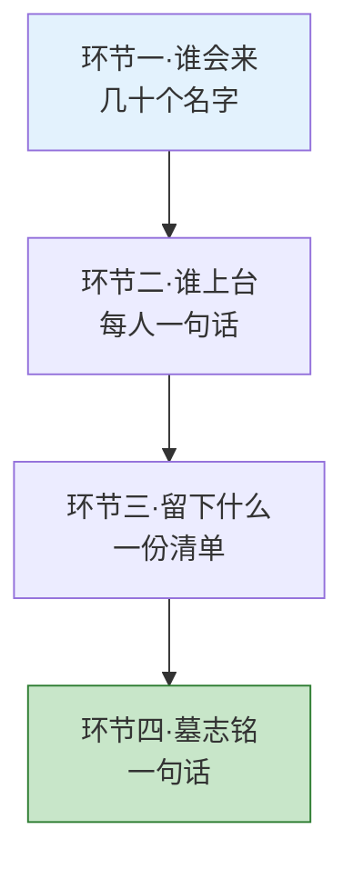
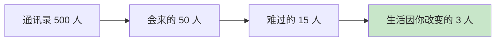
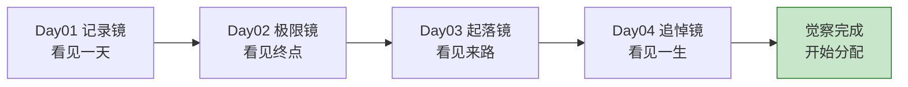
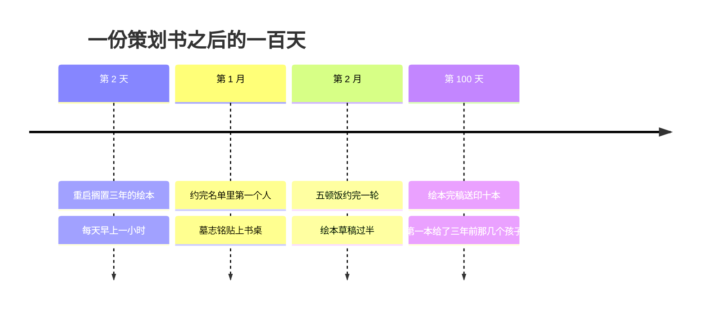

## Day 04·追悼会策划书：远眺后半生

- [01.看一个真实案例](#01看一个真实案例)
- [02.为什么是策划追悼会](#02为什么是策划追悼会)
- [03.一个用了两千年的工具](#03一个用了两千年的工具)
- [04.策划的四个环节](#04策划的四个环节)
- [05.环节一谁会来](#05环节一谁会来)
- [06.环节二谁上台](#06环节二谁上台)
- [07.环节三留下什么](#07环节三留下什么)
- [08.环节四墓志铭](#08环节四墓志铭)
- [09.常见的三种发现](#09常见的三种发现)
- [10.从追悼会回到明天](#10从追悼会回到明天)
- [11.总结回顾本章节](#11总结回顾本章节)
- [12.后来发生的改变](#12后来发生的改变)
- [13.今天起改变三点](#13今天起改变三点)
- [14.课后作业思考下](#14课后作业思考下)

---

## 01.看一个真实案例

一位三十五岁的读者，在一次工作坊里被要求完成一份策划书。策划的对象是她自己的追悼会。

她后来把那份手写的策划书拍照发给我。前三栏她写得很顺：谁会来，她列了五十多个名字；谁上台，她写了几个同事和朋友；留下什么，她卡住了。整整卡了十分钟，笔悬在纸上，一个字都写不出来。

她跟我说卡住那一刻脑子里过了什么：工作十二年，她参与过二十多个项目，加过的班连起来能绕城市一圈，可是没有一个项目会因为少了她而被记住。轮到朋友上台，她能预演的发言只有一句：她人挺好的，做事很靠谱。她给自己拟的墓志铭第一版，是"一个认真负责的人"。

写完那天晚上她失眠了。她说的原话是：**"我不怕死，我怕的是白活。这两件事我到三十五岁才分清。"**

第二天她做了一件事：把搁置了三年的绘本创作计划从收藏夹里翻了出来。为什么是这件事，第 12 节告诉你。先说清楚这个练习为什么值得做，以及怎么做。

## 02.为什么是策划追悼会

Day02 的极限情景问的是：如果只剩一年，你想做什么。它校准的是方向。今天的追悼会问的是另一个问题：当一切都结束时，你活成了什么。它校准的是整个人生。

注意这个练习的名字里有一个词是故意的：策划。不是想象，不是感伤，是策划。策划的意思是主动设计：场地放什么花、谁上台、说几分钟、幕布上挂哪张照片，全由你定。**你在给自己的终点做甲方。**而现实中绝大多数人只是自己葬礼的宾客，一切被安排，全程不发言。

原稿里有两句话，我把它们原样放在这里，因为没法写得更好：那些看似用不完的明天，总有一天会用完；看起来到不了的未来，也总有一天会到来。

如果说时间可以解决一切问题，那么今天问题的答案，会写在未来。极限情景用一年后的自己看今天，追悼会用终点处的自己看今天。镜头拉得越远，今天的噪点越少。

## 03.一个用了两千年的工具

用死亡做镜子，不是这本书的发明，是一个用了两千年的工具。

古罗马的斯多葛学派把它做成了一门功课，叫 memento mori，意为记住你终有一死。马可·奥勒留在《沉思录》里反复给自己写：你可能随时离开人生，要让每一个行为和思想都配得上这件事。塞涅卡说得更直接：人生不是太短，是我们浪费了太多。

两千多年后，乔布斯把同一个工具用在了同一块镜子上。二零零五年斯坦福毕业演讲里，他说了那段被引用了千万次的话：记住你即将死去，是我所知道避免患得患失的最好办法。你已经一无所有，没有理由不追随内心。他补充了一个细节：三十三年里的每个早晨，他都会对着镜子问自己，如果今天是最后一天，我还愿意做今天要做的事吗？只要连续太多天答案是摇头，他就知道该改变了。

心理学也没有缺席。恐怖管理理论的研究发现，适度的死亡提醒会让人做出一个一致的转向：更看重关系和意义，更看轻物质和虚荣。这个转向不靠意志力，它是被死亡意识自动触发的。

一个更具体的实验：研究者让一组志愿者在墓园旁回答问卷，另一组在普通街道上。墓园旁的那组，对陌生人表现得更友善，对承诺表现得更认真，对名表名车的渴望明显下降。**死亡意识就在那里站了几分钟，人的价值排序就重排了一遍。**这就是两千年来无数聪明人反复使用这个工具的原因：它可能是人类已知成本最低、见效最快的自我校准器。

所以追悼会策划书是一台合法的心理学设备：**它用一次可控的、纸面上的终点，借用大脑的死亡转向机制，把你从每天的惯性里捞出来看一眼全局。**沉重是入口，清醒是出口。

## 04.策划的四个环节

策划书一共四个环节，从松到紧，一层一层收窄，最后收进一句话。

| 环节 | 要回答的问题 | 盘点的是什么 | 建议篇幅 |
|:--:|:---|:---|:---|
| 一、谁会来 | 棺木与你之间站着谁 | 你的关系 | 名单，二十到五十人 |
| 二、谁上台 | 他们各自会说什么 | 你的价值 | 每人一句你预演的发言 |
| 三、留下什么 | 你走了，什么还在 | 你的作品 | 一份清单 |
| 四、墓志铭 | 一句话概括你 | 你的一生 | 只有一句 |

四个环节的顺序不能乱：先看人数，再听发言，再看遗物，最后看碑。每一层都比上一层残酷，也比上一层诚实。接下来四节，逐个展开。

## 05.环节一谁会来

第一个环节，列出会来的人。

规则很简单：不看通讯录，凭第一反应写。你会自然想起的面孔，就是真名单；需要翻通讯录才想起来的，是客名单。写二十到五十个名字，给每个名字标注一个身份：家人、挚友、同事、恩人、学生。

写完之后做三个统计。第一个，通讯录总人数除以名单人数，得到一个比例，通常在几十分之一，这个数字会让你重新理解什么叫人脉。第二个，数一数难过的人有几个，就是那种散场后会哭、一个月后还会想起你的人，通常不到名单的三分之一。第三个，数一数生活真的会因此改变的人，他们不只是难过，他们的人生轨迹里有一个窟窿是你留下的，这个数字通常是个位数。

**这最后几个名字，才是你的关系资产负债表。**剩下的几百人，是社交货币，礼貌维护即可，不必，也不可能，人人深交。看清这个漏斗，你就不必为维护不过来的关系而愧疚，也不必再假装热闹是充实。

一位读者做完这个统计后跟我说了两个发现。第一，她的真名单里有两个人，已经两年没有任何主动联系，其中一个是她大学时最好的朋友，两个人只是都忙，谁也没先开口。第二，她每天花最多时间维系的一个群，里面没有任何一个人在名单上。她说那天晚上她给那个两年没联系的朋友发了条消息，第二天收到回复，对方说：我等你这条消息等了很久了。**有些关系不是淡了，是都在等对方先做那个出现在名单里的人。**

## 06.环节二谁上台

第二个环节，预演每个上台的人会说什么。

这不是写作练习，是诚实测试。你会自然发现发言分成三种。第一种是职务性发言：她负责过某某项目、他在某某公司干了多少年。这种发言谁都能讲，念稿即可，和你是谁没有关系。第二种是情感性发言：她对我很好、那年多亏了他。这种发言有温度，但换一个同样对他好的人，句子照样成立。第三种是作品性发言：她做的那个东西还在，他改变了我看待这件事的方式。**只有第三种发言，是拿走你就不成立的。**

开篇那位读者卡住的，就是这里。她能预演出大量职务性发言、几段情感性发言，而作品性发言，一句都没有。

所以这个环节真正的问题只有一个：**你希望谁上台，说哪一句拿走你就不成立的话？**把这句话写下来，它就是你未来十年的作品简介。注意，这句话和你现在的职位、职级、收入都没有关系，它只和一件事有关：你生产了什么。

## 07.环节三留下什么

第三个环节，写下你走了之后还在的东西。

这里要分清两个词：岗位和作品。岗位是组织机器上的一个插槽，你在时是你的，你走后第二天就换了别人，机器照转。作品是你的名字焊在上面的东西：一篇被引用的文章、一个被使用的产品、一个被改变的人、一门被传下去的手艺。岗位写在别人的清单上，作品写在你自己的清单上。

这个区分在当下尤其重要。因为现代社会评价一个人的默认语言全是岗位语言：在哪儿工作、什么职级、带多少人的团队。这套语言说着说着，人会把岗位的成就自动当成自己的作品，直到离开那天才发现两者根本不是一回事。**检验方法简单到残忍：把你的职位从句子里删掉，看看剩下的主语和谓语还站不站得住。**"我是某某总监"删掉职位就什么都不剩了；"我写过一个被三千人用的工具"不需要任何头衔也成立。

这个环节的产出是一份清单，原稿给它起了个名字：长期作品清单。**你不用现在就有一件像样的作品，你要有的是这份清单，清单本身就是承诺。**

一件作品的标准只有三条：有明确的输出物；需要超过一年的时间跨度；完成后属于你。一篇文章、一个开源项目、一个被你带出来的徒弟、一片你种的林子，都算。这份清单在 Day23 会正式展开成创造清单，今天先写下第一版，哪怕只有三行。

## 08.环节四墓志铭

第四个环节，也是整份策划书的核心：一句话，刻在你的碑上。

规则有三条。第一，只能一句话，路人停留三秒能读完的长度。第二，不许用简历词汇，认真、负责、敬业、优秀，这些词没有信息量，刻上去等于没刻。第三，具体压倒抽象。

**具体和抽象的差距，就是重量的差距。**"一个被爱着也爱着别人的人"是抽象的，谁都能刻；"她让三千个孩子第一次摸到键盘"是具体的，只能是她的。抽象是形容词的人生，具体是动词的人生。

建议写三版再挑。第一版，从关系的你出发：你是谁的父母、谁的伙伴、谁的什么。第二版，从作品的你出发：你做成了什么事，改变了什么。第三版，从体验的你出发：你怎样度过了这一生，按什么原则活。三版写完，哪一版让你写的时候最卡、最心虚，那一版就是你眼下欠的账。

## 09.常见的三种发现

四份策划书收集多了，会发现做完的人普遍撞见三样东西。

| 发现 | 内心台词 | 它指向的行动 |
|:--:|:---|:---|
| 在乎的人比以为的少得多 | 我维护了几百个关系，名单只有三十个 | 关系断舍离，把真名单写进日历 |
| 完成的事比以为的少得多 | 十二年，没有一件作品性发言 | 启动长期作品清单 |
| 最遗憾的是没做那件事 | 那件事我在等什么 | 本周给它一个时间格 |

第一个发现的正确反应不是心寒，是如释重负：你终于知道自己该把有限的时间给谁。第二个发现的正确反应不是挫败，是立项：从今天开始，你至少有一件值得被发言的事可以做了。第三个发现最私人也最锋利：几乎每个人写下那件事时，都会发现它需要的启动成本远比想象的小，拦住它的从来不是钱和时间，是没说出口的勇气。

**策划书不会告诉你怎么活，它只负责让你看见你打算怎么活的和实际的差距。**看见之后的事，是接下来二十六天的内容。

## 10.从追悼会回到明天

做完策划书，最后一个动作是写一封信：三十年后的你，写给今天的你。

Day02 的信是一年后的你写的，管的是方向校准；这封信是终点处的你写的，管的是一生校准。信分三段。第一段，画面：三十年后的你回头，希望看到今天的你正在做什么，希望那个画面里有哪些人。第二段，提醒：那个走完全程的你，会提醒今天的自己不要忘记的三件事是什么。第三段，一句话：如果只剩一句话可以从终点传回来，那句话是什么。

写完这封信，你会得到一个副产品：一份被死亡检验过的优先级。它和你手机日历里的优先级之间有多大出入，就是你未来要挪的距离。

信不用寄出去，它的收件人和寄件人都是你。但建议写在一个真实的载体上，纸质信纸或者一个不会被清理的备忘录。仪式感在这里不是矫情，是给这封信一个物理的容身之处：**漂在心里的东西会被日常冲走，落在纸上的东西会一直在那里等你回来。**

最后说一句给担心做完会emo的你。这个练习的出口不是灰心，四份策划书的回收数据显示的恰恰相反：**完成的人在接下来一周里的行动率，远高于没做的人。**原因在 Day03 已经讲过：看见让人改变，自责让人放弃。策划书给你的全部是看见，一次也没让你审判自己。终点是用来照今天的，不是用来吓今天的。

## 11.总结回顾本章节

追悼会策划书是终极判断法的第二半，用终点的自己校准整个人生。四个环节从松到紧：谁会来是关系盘点，谁上台是价值盘点，留下什么是作品盘点，墓志铭是一生的压缩。三个经典发现：在乎的人比以为的少，完成的事比以为的少，最遗憾的事启动成本比以为的小。

到今天，第一章的四把镜子全部到齐。

一天、终点、来路、一生。四把镜子照完，你已经完成了全书的地基：看见。从明天开始，不再照镜子，开始动手术：你将拿到那张真正的地图，五种时间。

## 12.后来发生的改变

回到开篇那位三十五岁的读者，说说她后来做了什么。

第二天她翻出绘本计划，不是冲动。她说卡在留下什么那一栏的时候，脑子里浮现的就是那批画到一半的草稿：三年前她给朋友的孩子们画过一套小故事，画了二十几页，被一次加班打断，从此躺在收藏夹里。追悼会策划书里作品一栏，她的手自动写下的第一行，就是那套没画完的绘本。

她做了三件事。第一件，重启绘本，每天早上一小时，画完才上班。第二件，从谁会来的名单里挑了五个人，每周末约一位吃饭，两个月约完一轮，她说这五顿饭比过去一年的应酬加起来都有用。第三件，把那版她不满意的墓志铭"一个认真负责的人"打印出来，贴在书桌正前方。她说这是故意的：**等哪天我能心甘情愿写下新的那一句，我就换掉它。**

第一百天，她把画完的绘本印了十本，第一本寄给了三年前那几个孩子。她妈妈收到电话里说了一句话，她记到现在：闺女，你终于又干你自己的事了。

她的原话总结：**"我以前总以为一辈子很长，长到所有事都可以以后再说。写完那天我才知道，一辈子只够认真做几件事、爱几个人。"**

## 13.今天起改变三点

第一，今晚完成追悼会策划书的四个环节。六十分钟，一支笔，一个不被打扰的角落。顺序别乱：名单、发言、清单、墓志铭。写不下去的地方别跳过，卡住的位置就是信息量最大的位置。

第二，从谁会来的名单里挑一位，本周约一顿饭。不用谈人生，就是吃饭。被死亡检验过的关系清单，要用日历兑现它。真名单上的人，值得占用你一个真实的时间格。

第三，墓志铭写三版，都留着，三十天后再挑。版本之间不着急分高下，你只需要让它们都活在你看得见的地方。哪一版最卡，就多看哪一版，卡是欠账的利息，提醒你别忘。

## 14.课后作业思考下

第一，对照 Day03 的起落图：你最想制造的下一个高峰，对应策划书里哪个环节的答案？如果它属于留下什么，那它就该出现在你的长期作品清单第一行。

第二，数完你的三层漏斗（会来的、难过的、生活因你改变的），写下感受。不必评判自己人缘如何，只需回答：最后那个个位数名单里的人，上一次见面是什么时候？

第三，三版墓志铭分别对应职务的你、关系的你、作品的你。哪一版写得最卡？为那一版写下一个本周就能做的最小动作。

第四，如果第 10 节的那封信还没写完，今晚写完它。写完之后把信和 Day01 的起始画像卡放在一起，全书读完的那天，你会同时打开它们。

---

**明日预告 · Day 05 认识五种时间。** 觉察篇收官，地图篇开启。明天你将拿到全书最重要的那张地图：生存、赚钱、好看、好玩、心流，你生命里的所有时间，将第一次被分成五种颜色。你昨天、今天、此刻正在度过的时间，各属于哪一种？答案可能让你不舒服。我们明天见。
