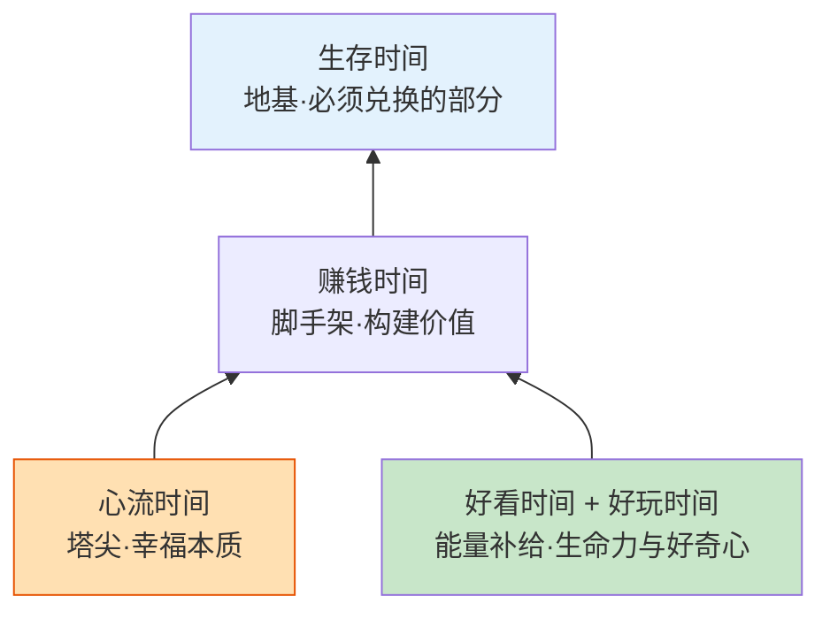
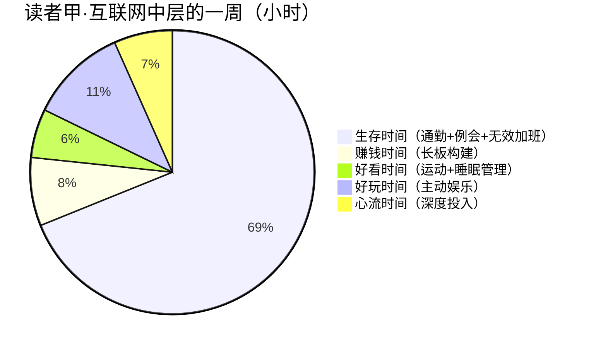
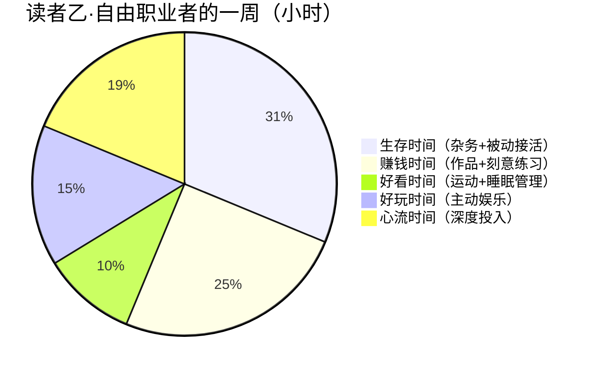
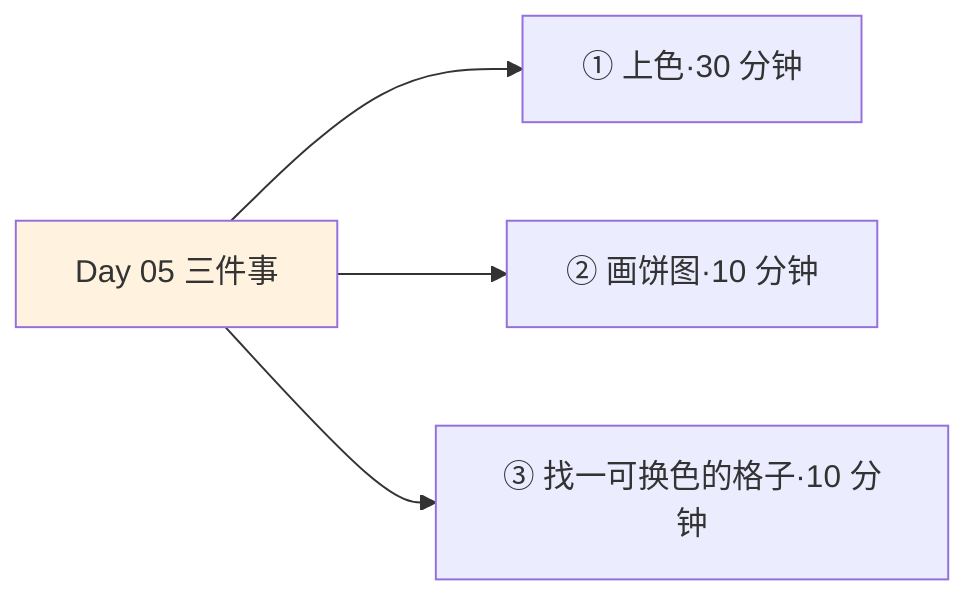
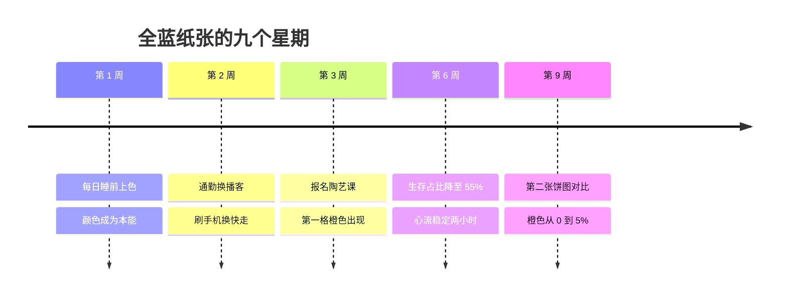

## Day 05·认识五种时间：生命的一张新地图

- [01.看一个真实案例](#01看一个真实案例)
- [02.现有分类法为什么失灵](#02现有分类法为什么失灵)
- [03.五种时间的完整定义](#03五种时间的完整定义)
- [04.五种时间的关系](#04五种时间的关系)
- [05.马斯洛的影子](#05马斯洛的影子)
- [06.健康的时间结构长什么样](#06健康的时间结构长什么样)
- [07.辨认当下](#07辨认当下)
- [08.给记录上色](#08给记录上色)
- [09.三种典型的失衡饼图](#09三种典型的失衡饼图)
- [10.今天要做的三件事](#10今天要做的三件事)
- [11.总结回顾本章节](#11总结回顾本章节)
- [12.后来发生的改变](#12后来发生的改变)
- [13.今天起改变三点](#13今天起改变三点)
- [14.课后作业思考下](#14课后作业思考下)

---

## 01.看一个真实案例

一位读者在完成 Day01 记录的一周后，做了一件我请她做的事：把一周的时间记录打印出来，用五支荧光笔重新涂色。蓝色涂生存，金色涂赚钱，粉色涂好看，绿色涂好玩，橙色涂心流。

她涂完拍了一张照片发给我。整张纸几乎是蓝的。通勤蓝、例会蓝、加班蓝、给甲方改第四遍方案的晚上也是蓝。粉色有一小条，是两次敷面膜。绿色有一小块，是周六下午刷了三小时短视频，她自己拿不准该涂绿色还是留白，最后勉强涂了。金色有两个小点，是两次通勤路上听了行业播客。橙色，没有。

她附的话我看了好几遍。她说：**"我以为我这周过得还挺平衡的，有工作有生活。涂完才知道，我一周一百六十八个小时里，橙色一格都没有。我连一次忘记时间是什么感觉都忘了。"**

这就是今天要做的事。你已经用四天看清了自己的一天、终点、来路和一生，从今天开始，我们进入全书的核心工具：把你的所有时间，分成五种。这不是又一次给你贴标签，而是给你一张能看懂自己的地图。

## 02.现有分类法为什么失灵

在讲五种时间之前，先回答一个问题：已有的分类法那么多，为什么还要一个新的？

最流行的是两分法：工作与生活。这个分法的问题在于它太粗了，粗到几乎不产生信息。按这个分法，上面那位读者的一周毫无问题：白天工作，晚上生活，挺平衡。可蓝色和橙色的巨大反差，被这个分法完全遮蔽了。工作里既有为饭碗不得不做的部分，也有构建自己长板的部分，两者的价值天差地别，两分法把它们打包成一个词。

更精细一点的是四象限：重要且紧急、重要不紧急、紧急不重要、不重要不紧急。四象限是个好工具，但它回答的问题是这件事该不该做、先做还是后做。它有一个从不回答的问题：**做了之后，我的生命里多了什么。**换句话说，四象限管理的是事项，不管理生命结构。你可以把一整年的事项全部正确地分进四个格子，然后发现自己的生活结构一塌糊涂。

原稿里有一段话说得极准：很多世俗的成功，原本是获得这些珍贵的桥梁。桥梁不是珍贵本身，我们想要珍贵本身，也想要桥梁，我们的愿望根本就是想要一切。现有工具管理的是过桥的效率，从来没人问你桥要通向哪里。

所以你需要一个从生命结构出发的分类法。它要能回答的不是怎么把事做完，而是我的时间被兑换成了什么。

## 03.五种时间的完整定义

五种时间，把人生命中所有需要和可能重新分成五种。先上总表，再逐个展开。

| 时间 | 一句话定义 | 判据一问 | 典型活动 |
|:--:|:---|:---|:---|
| 生存时间 | 为保证生存必须兑换出去的时间 | 不为饭碗和人情，我还会做吗 | 通勤、例会、无效加班、被动应酬 |
| 赚钱时间 | 主动用于创造价值、构建长板的时间 | 这段时间让我的核心竞争力更强了吗 | 刻意练习、做作品、研究方法论 |
| 好看时间 | 用于让自己更有生命力的时间 | 这段时间让我的身体状态更好了吗 | 运动、睡眠、护肤、体检 |
| 好玩时间 | 主动选择投入、用于获取乐趣的时间 | 玩完我是更充实还是更空虚 | 旅行、爱好、和朋友的长谈 |
| 心流时间 | 完全沉浸、当下满足与未来成就并存的时间 | 这段时间里我注意过时间吗 | 写作、编程、演奏、深度创作 |

生存时间是为了保证你的生存必须兑换出去的时间。它有个残酷的检验：假如这件事不算钱、不算人情、不关乎饭碗，你还会做吗？答案是不会的，就是生存时间。注意生存不低级，它是地基，第五章我们会专门为它正名。

赚钱时间不是上班时间，这是最常见的误解。上班时间里只有让长板变长的部分是赚钱时间，其余都是生存时间。赚钱时间的判据是核心竞争力有没有变强，明天的 Day07 会专门拆它。

好看时间在一天的可用时间内，只用来做能让自己看上去更好的事。看上去更好的意思是生命力的好看：身材紧实、皮肤有光、精神饱满，不只是脸。Day08 展开。

好玩时间的关键词是主动。被动瘫在沙发上被算法投喂，严格说不算好玩时间，它是情绪反弹。判据是玩完之后的感受：更充实，还是更空虚。Day09 展开。

心流时间是五种里最珍贵的：完全投入、忘记自我、时间感消失，同时带来当下的深度满足和未来的成就积累。Day24 至 Day27 用整整四天讲它。

## 04.五种时间的关系

五种时间不是五个平级的选项，它们之间有结构。原稿里给过一个精准的建筑比喻，我把它画出来：生存是地基，赚钱是脚手架，好看和好玩是能量补给，心流是塔尖。

这个结构讲清楚了三件事。第一，心流站在塔尖，但它的下面必须有人撑着：一个连饭都吃不上的人，谈心流是奢侈的。所以不要因为生存时间占比大而自责，先有地基，才有塔。第二，好看和好玩不是可有可无的点缀，它们是整栋建筑的能量补给：没有它们，脚手架搭到一半人就塌了，很多过劳的故事坏就坏在砍掉了这两项。第三，五种时间没有鄙视链，只有结构关系。在塔尖的时间不比地基高贵，只是位置不同、稀缺程度不同。

原稿那句话值得完整放在这里，它解释了这套分类的世界观：**我们想要珍贵本身，也想要桥梁，我们的愿望根本就是想要一切。**五种时间不让你二选一，它让你看清五者各自有多少，然后再谈怎么挪。

## 05.马斯洛的影子

如果你觉得这个结构有点眼熟，你的直觉是对的。它有马斯洛需求层次的影子。

马斯洛把人的需要从低到高分为生理、安全、归属与爱、尊重、自我实现。对照过去：生存时间对应生理和安全需要，赚的是活下去的资本；赚钱时间对应尊重和成就需要，赚的是被看见的地位；好看时间对应生理和生命力的需要，好看是生命力的显性表达；好玩时间对应探索和愉悦的需要，好奇心本身就是一种需要被喂养的生命力；心流时间对应自我实现，马斯洛晚年反复引用的巅峰体验，正是契克森米哈赖定义的心流。

这个对照不是为了给五种时间镀金，而是为了说明一件事：**你的时间分配，就是你的需求满足状况的 X 光片。**马斯洛说，一个健康的人会让各层需要依次被满足；五种时间说，一个结构健康的人生，会让五种时间各有其位。只填饱一种、饿死其他四种的人生，和只满足一层需求的人生一样，都是畸形。

心理学的实证研究也站在这个方向上。积极心理学的 PERMA 模型把幸福拆成五个可测量的维度：正面情绪、投入、关系、意义、成就。对照五种时间：好玩对应正面情绪，心流对应投入，好看背后是关系里的呈现，赚钱对应成就，生存撑住意义的地基。两套体系各说各话，指向却惊人一致：**幸福不是一个总开关，它是一组需要分别照顾的仪表盘。**

## 06.健康的时间结构长什么样

先说结论：没有标准答案，只有经验区间。给出参考值之前，先看两个真实读者的一周。

读者甲的一周，生存时间六十二小时，占清醒时间的一半以上。他自己的评价是：一直在还债的感觉，每周一睁眼就欠着这个世界六十个小时。这不是个例，这是大多数上班族的默认结构。

读者乙的一周，生存只有二十五小时，心流十五小时。代价是收入不稳定、社保自己交、焦虑常驻。她说：我用安全感换了心流，不确定值不值。

综合大量读者数据，健康的经验区间大致是：生存百分之三十到五十，赚钱百分之十五到三十，好看百分之五到十，好玩百分之十到二十，心流百分之十到二十五。**注意这是区间，不是处方。**上升期的人生，生存和赚钱占比高是正常的；学生时代，心流和好玩占比高是健康的；中年以后，人们自然会把重心挪向心流和关系。区间只告诉你一件事：任何一种低于或远高于这个范围的结构，都会在情绪上给你发信号，下一节讲怎么收这个信号。

## 07.辨认当下

地图拿到了，接下来是使用说明书。核心技能只有一个：辨认当下。

辨认当下，是一件非常、非常重要的事情。原稿把这句话加了括号郑重强调，我把它升格成正文标题：**只有先辨认出自己正处在哪种时间里，你才谈得上分配它。**一个认不出自己时间的人，谈不上拥有自己的时间。

辨认的方法是三连问。第一问，我此刻是主动选择做这件事，还是被迫的？被迫的，往生存归。第二问，这件事做完，我身上有什么东西变强了？能力变强，往赚钱归；身体变好，往好看归。第三问，这件事进行的时候，我注意过时间吗？完全没注意，往心流归；轻松愉快地注意着，往好玩归。

这里有一个必须讲透的精妙之处：**分类的对象不是活动本身，是你和活动的关系。**同一件事，可以是完全不同的时间。跑步：为了减肥跑，是好看时间；为了马拉松成绩训练，是赚钱时间；为了纯粹的快乐跑，是好玩时间；跑到忘我、体验跑者高潮，是心流时间。同样，写代码可以是赚钱时间（做作品），可以是生存时间（还需求的债），可以是心流时间（进入状态的那两小时）。这意味着一个重要推论：**你不一定需要换工作、换生活才能改变时间结构，有时候只需要改变你和现有活动的关系。**把还债式加班里的两小时，换成打磨作品的两小时，做的是同一份工，时间却换了颜色。

## 08.给记录上色

理论讲完了，现在把它接到你已有的工具上。Day01 你已经记录过自己的一天或一周，今天让那份数据换一种活法：上色。

准备五支荧光笔，或者电子表格的五列。蓝色给生存，金色给赚钱，粉色给好看，绿色给好玩，橙色给心流。把你已有的记录逐格涂色。涂的时候遵守三个规则。第一，按真实感受涂，不按应该涂：那场和朋友的晚餐，如果聊得尽兴，涂绿色；如果全程在维系关系、身心俱疲，涂蓝色。第二，一格只能涂一个主色，拿不准的时候问自己那一格里占主导的颜色是什么。第三，涂完统计五个数字，算出百分比。

然后做一件有仪式感的事：把五个百分比画成一张饼图，你的第一张五种时间饼图。手画就行，不精确没关系，比例悬殊的部分自己会跳出来。

**这张饼图就是你当前人生的资产配置表。**上面那位读者看到全蓝的纸面时那种震动，你马上也会体验到一次。别急着难受，先记住 Day01 教过的：看见是改变的起点，不是审判的开始。

## 09.三种典型的失衡饼图

大量饼图收上来之后，失衡是有模式的。三种最常见的如下。

第一种，生存过载型。生存百分之七十以上，其余四项挤在边缘。体感是持续的疲惫感和被推着走：每天在还债，周末在回血，永远没有盈余。常见于大厂加班期、上有老下有小的家庭阶段。这种结构最危险的地方是它会自我安慰：忙说明我有价值。判断真伪的检验是赚的钱和还的债是否在互相抵消，如果加班换来的收入全部用来恢复加班透支的身体和情绪，这笔账其实是负的。

第二种，赚钱独大型。赚钱百分之五十以上，好看好玩心流被压扁。体感是紧张和成就并存，但底色发空：事业上一路向上，夜里偶尔心慌。常见于创业冲刺期、职业上升期的狠人。这种结构短期是高效的，问题是不可持续，塔尖越重，地基越需要维护，而好看和好玩正是维护费。

第三种，好玩泡沫型。好玩百分之四十以上，涂的时候甚至有点不好意思。体感是快乐高频但保质期极短，快乐结束的那一刻更空。常见于报复性娱乐、职业倦怠期。这种结构最隐蔽，因为每一格看起来都在享受生活，只有拉长了看才发现快乐没有复利：玩了三年，没有任何一段快乐沉淀成能力、关系或作品。

三种失衡没有谁比谁高级，共同点是同一种：**用一种时间的过量，掩盖另外四种的欠账。**后续章节会分别给出每种的还账方案，Day29 还会专门讲怎么把这张饼图调平衡。

## 10.今天要做的三件事

动作一，给 Day01 的记录上色。五支荧光笔或者五个表格列，按真实感受涂，涂完统计五个百分比。如果记录已经找不到了，今晚重新记半天再涂，半天也够出结构。

动作二，画出你的第一张五种时间饼图。手绘即可，画完拍下来，标注日期。这张图三十天后会和 Day29 的第二张饼图对照，中间隔着你整个的三十天。

动作三，找一格可以换色的格子。在饼图里找一格你最有把握的活动，用第 07 节讲的关系改变法，把它从一种时间换成另一种：通勤听一集行业播客，蓝色换金色；刷手机换成出门快走三十分钟，绿色换粉色。今晚只换一格，明天见效就行。

## 11.总结回顾本章节

五种时间是全书的核心地图：生存、赚钱、好看、好玩、心流，把生命所有需要和可能重新分成五种。它比两分法和四象限多回答一个问题：你的时间被兑换成了什么。五种之间有结构：生存是地基，赚钱是脚手架，好看好玩是补给，心流是塔尖；这个结构有马斯洛的影子和 PERMA 的印证。

分类的对象不是活动，是你和活动的关系，所以换色比换生活更先可行。辨认当下是主动分配的前提，三连问是辨认的工具。三种典型失衡：生存过载、赚钱独大、好玩泡沫，共同点是用一种的过量掩盖其余的欠账。

一句话总结整章：**你以为你缺时间，你缺的是对时间的辨认。**从今天起，你看见的不再是一天二十四小时，而是五种颜色的总和。

## 12.后来发生的改变

回到开头那位涂出全蓝纸张的读者，说说她后来怎么样了。

她做的第一件事，是每天睡前花五分钟给当天上色，坚持了一周。她说上色这个动作本身开始改变她的白天：下午三点坐在一场与她无关的例会里，脑子里会冒出一个念头，这格是蓝的。这个念头出现得越来越频繁，她说**一旦颜色成了本能，时间在你眼里就不再是连续的一团，而是一格一格可以挑选的东西。**

第二周她做了两个换色动作。通勤的四十分钟换成行业播客，一周多出三个多小时的金色；晚上报复性刷手机的两小时，砍掉一半换成快走和拉伸，绿色换成了粉色。第三周她报了一直想学的陶艺课，周六上午两小时。她说上第一次课的时候有个瞬间，手上全是泥，完全忘了看手机，下课抬头发现两小时没了。她在记录里给那格涂了橙色，备注写着：**这格橙色我等了一年。**

第九周她画了第二张饼图，和第一张放在一起。生存从百分之七十降到五十五，心流从零涨到百分之五。数字不大，但她说了句我很喜欢的话：**我的生活一件大事都没变，工作没换，房子没搬，但我的饼图换了颜色，感觉像换了一种活法。**

## 13.今天起改变三点

第一，让颜色进入日常。上色不是一次性的练习，从今天起每晚五分钟，给这一天快速上色。坚持七天，颜色会从记录工具变成观察本能，那个变化发生时你会自己察觉到。

第二，记住区间，忘掉处方。健康区间供参考，你的正确比例由你的人生阶段决定。唯一需要警惕的是任何一项长期归零，尤其橙色：心流为零的人生是可以运转的，但它是一台只出不进的机器。

第三，每次焦虑先看饼图。以后每当陷入说不清的疲惫、空虚或焦虑，先画一张本周饼图再说话。三种失衡在饼图上一眼可见，情绪说不清的东西，颜色说得清。**给情绪做体检的方法，就是给时间做盘点。**

## 14.课后作业思考下

第一，用第 03 节的判据表，检查你今天已经度过的时间：各涂了什么颜色？其中占比最大的是哪一种？这个结果和你涂之前的预期差多少？

第二，找出你生活中同一件事的至少两种颜色。比如你也在跑步、也在写代码、也在做饭，它们分别在什么情况下是好看、赚钱、好玩或心流？分析颜色切换的那个开关是什么。

第三，你的饼图里最接近零的是哪一种？回想上一次它不是零，是什么时候、什么场景？那段时间和现在的差距在哪里？

第四，把你的第一张饼图发给一位你信任的人，请他猜猜哪个颜色你觉得最扎眼。别人的视角常常先于你自己指出那个你一直在回避的空洞。

---

**明日预告 · Day 06 基本生存时间。** 地图拿到手了，明天从地基开始。生存时间是五种里最面目可憎的一种，也是大多数人在大多数时候所处的区域。它到底是什么，能不能逃，为什么说不要想着逃避它？关于地基的故事，比你想的更有骨气。我们明天见。
