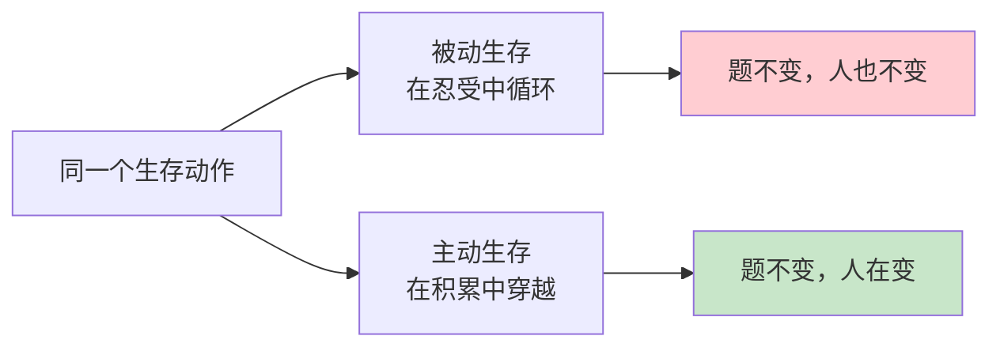
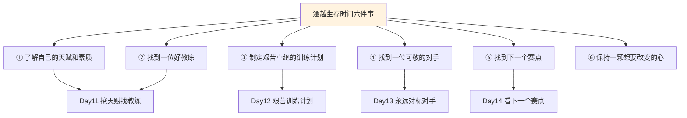
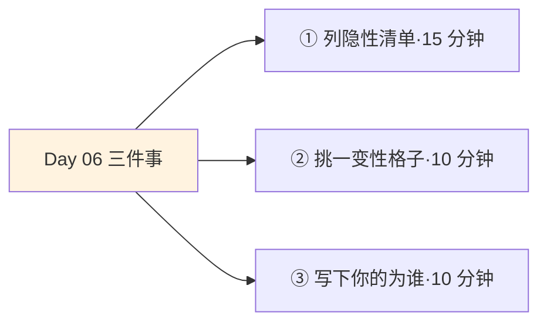
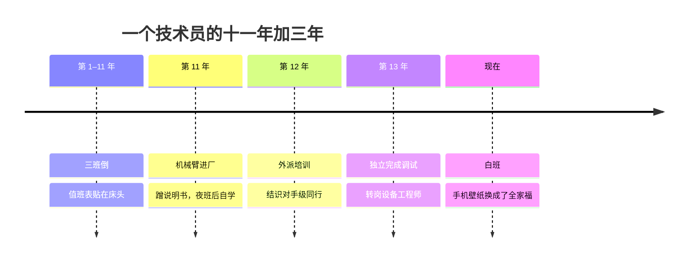

## Day 06·基本生存时间：地基的故事

- [01.看一个真实案例](#01看一个真实案例)
- [02.什么是生存时间](#02什么是生存时间)
- [03.生存时间的完整清单](#03生存时间的完整清单)
- [04.被动生存的体感](#04被动生存的体感)
- [05.主动生存与被动生存](#05主动生存与被动生存)
- [06.为什么不要想着逃避](#06为什么不要想着逃避)
- [07.题越做越难的深意](#07题越做越难的深意)
- [08.逾越生存时间的六件事](#08逾越生存时间的六件事)
- [09.一个真正的问题：你在为谁生存](#09一个真正的问题你在为谁生存)
- [10.今天要做的三件事](#10今天要做的三件事)
- [11.总结回顾本章节](#11总结回顾本章节)
- [12.后来发生的改变](#12后来发生的改变)
- [13.今天起改变三点](#13今天起改变三点)
- [14.课后作业思考下](#14课后作业思考下)

---

## 01.看一个真实案例

先讲一位工厂技术员的故事。

他在同一家工厂待了十一年，三班倒。早班五点半起床，中班到家半夜十二点，夜班下了天是亮的。他的值班表贴在床头，十一年没挪过位置。有一年我问他，这十一年你印象最深的一天是哪天。他想了半天说，发工资那天。

我问他为什么。他说因为只有那天他觉得自己是在为自己上班，其他的日子都是替班表上班。

更扎心的是后面一句。他说他翻过自己的手机相册，十一年里他的照片几乎全部来自别人的镜头：车间集体照里他站在第三排，团建合影里他被同事搂着，家里的照片是老婆孩子拍的。**没有一张照片，是他清醒着、主动地、为自己拍的。**他说这话的时候语气很平，像在说别人的事。

这是大多数人在大多数时候所处的区域。昨天的地图上它是蓝色的地基，今天我们把这块地基翻开看看：它到底是什么，为什么不能只是忍受它，以及那条唯一的出路。

## 02.什么是生存时间

生存时间，是为了保证你的生存必须兑换出去的时间。

原稿里有一段极准确的描述：你每天早上六点多起床吃早饭，八点多到公司，到下午五点之前都没有自己的时间。因为你为了保证生存，把这段时间兑换出去了。它就是生存时间。

注意这个动词：兑换。不是浪费，不是消磨，是兑换。你拿生命的一部分，换回了饭碗、房租、社保和一家老小的口粮。这个交易本身是正当的，甚至是光荣的，地基不低级，没有地基什么塔都别想盖。

问题出在另一个地方。原稿紧接着说了一句：**如果不主动去逾越它，它就会反过来占据、消耗和吞噬你的生活。**

这句话里藏着一个动态过程。生存时间的危险，不在于它存在，而在于它的扩张性：它没有自动停止的边界。你为了生存加班，加班透支了身体，身体垮了要花更多钱，需要更多钱就要加更多班。这个循环一旦形成，生存时间会从你一天的一部分，长成一整天的全部，再长成你整个人的定义。那位技术员说替班表上班，就是这个过程的终点形态。

原稿还有一句被很多人划线的话，放在这里正合适：**时间的确是个用来计算变化的单位，只要持续采取行动，不存在卡住，改变一定会发生。**这句话的前半句是警告（时间在变，你不在变，就等于在后退），后半句是承诺（只要行动，卡住就只是暂时的）。

## 03.生存时间的完整清单

昨天你已经用判据一问辨认过生存时间：不为饭碗和人情，我还会做吗？答案是不会的，就是生存时间。今天把清单补完整，很多人对生存时间的理解窄了。

显性的生存时间人人认得：通勤、例会、无意义的加班、机械的重复劳动、被动的应酬。隐性的生存时间才是大头，它们伪装成别的样子。

伪装成必要的：为了维持关系而参加的饭局，为了显得合群而跟风的团建，为了不显得不懂而参加的会议。伪装成休息的：因为加班太累而瘫着刷的两小时手机，那不是好玩时间，是生存时间的工伤恢复期。伪装成进步的：为了不被淘汰而考的证、为了简历好看而学的课。如果驱动力是不安而不是想要，它们都属于生存时间。

| 类别 | 伪装形态 | 鉴别方法 |
|:--:|:---|:---|
| 显性 | 通勤、例会、流水线式的劳动 | 一眼可辨 |
| 伪装成必要 | 应酬、跟风活动、防御性社交 | 问：拒绝的真实代价有多大 |
| 伪装成休息 | 报复性瘫倒、无意识刷手机 | 问：之后是恢复还是更空 |
| 伪装成进步 | 防御性考证、焦虑型学习 | 问：驱动是不安还是想要 |

把清单摊开不是为了清算，而是为了一个更实用的目的：**看见隐性生存时间，是把它变性的第一步。**同样两小时的通勤，可以纯蓝地刷过去，也可以变成金色，这个秘密今天先按下，第 05 节和第 07 节会讲到。

## 04.被动生存的体感

被动生存的体感，值得用一整节来描写，因为很多人身在其中却叫不出它的名字。

它的核心感受是循环感。周一到周五是五连击，周六是回血，周日晚上焦虑重启。每一周的结束不带来任何累积：干完了，但什么也没长出来。你像一台机器，每周保养一次，然后继续折旧。

第二个感受是时间不归你。你想做的事永远排在待办清单的最后，而且那个最后永远轮不到。你手机里存着一辈子想做的事：想学的课、想去的地方、想恢复的爱好。它们不吵架，它们只是安静地排队，一排就是十年。

第三个感受是麻木。刚工作那几年还会愤怒，会不甘，会跟朋友吐槽到深夜。后来连吐槽都省了，因为吐槽的前提是觉得不对，而你已经开始觉得本来就该如何。

心理学家塞利格曼在六十年代做过一组著名的实验，后来被称为习得性无助。把狗关进有电击的笼子，无论它怎么跑都躲不开电击。反复几次之后，把笼门打开再电击，狗不跑了。**它躺在原地承受，因为它的经验告诉它：跑没有用。**人也一样。被动的生存时间待久了，人不再评估出口，只评估忍耐。麻木不是性格，是习得的。

叫出这个名字的意义在于：塞利格曼实验还有后文。那些后来被放进可以逃脱的环境的狗，在引导下重新学会逃跑。**无助是习得的，因此也是可以退习的。**这就是下一节。

## 05.主动生存与被动生存

原稿把生存时间切成两半：被动生存和主动生存。这一刀，是整本 时间管理三十天 里最重要的几刀之一。

同一个动作，可以是两种时间。同样是早上五点半起床，为流水线爬起来是被动生存，为训练计划爬起来是主动生存。同样在车间拧十年螺丝，拧完就走是被动生存，一边拧一边琢磨工艺改进、攒了一脑子改造方案的是主动生存。区别不在动作，在你和这个动作之间的关系：它是在消耗你，还是在给某种积累供料。

判断标准有两条，昨天埋过伏笔，今天正式展开。第一，你是否瞄准了核心竞争力：这段被迫的时间里，有没有一部分在给你的长板上供料。第二，是否进入循环增强：做得越多，下一步越轻松，还是做得越多，只是做了越多。

读者里有个典型案例。一位客服姑娘，每天接一百四十个电话，标准话术，蓝色时间八小时。她的转化动作只有一个：下班后花二十分钟，把当天遇到的最难缠的三个客户记录下来，分析他们的真实诉求。半年之后，她整理出一份行业少见的客户心理笔记，跳槽去了培训部，专门教新人怎么处理高压沟通。同样的接电话，后半段是金色的。

原稿说得干脆：当你不止满足于现状，想要改变并且了解自己的天赋和素质，有具体的计划，有可以请教的教练，有可敬的对手，期待下一场比赛的到来，这个时候，你真正进入了主动生存时间，并且终将逾越它。

## 06.为什么不要想着逃避

面对生存时间，大多数人的第一反应是逃：辞职、gap、换个城市、换个行业。原稿用一段话把这条路堵死了，我把它拆成三层。

第一层，逃出是暂时的。即使逃出了这个生存时间，还会进入新的生存时间去煎熬。你厌倦了职场的会，逃去自由职业，很快发现给甲方改方案、催回款、自己交社保，是新的一套会。你逃离了小城市的人情，到了大城市发现房租和通勤是更硬的人情。

第二层，舒适永远是相对的，困难永远是绝对的。这句话值得单独抄下来。它不是悲观，是定价：**它告诉你不存在一个没有困难的位置，只存在困难形态不同的位置。**既然如此，挑选困难就比逃避困难更有性价比：至少可以挑一个你愿意为之受苦的难。

第三层，也是最有力量的一层：**逃出，意味着去往更高的地方去经受考验，题永远越做越难。**注意，原稿没有说不要逃，它说的是逃的方向要往上。往上逃，难度升级是购买更高人生的对价；平行逃，难度原样再来一遍，你只是换了个考场重考同一张卷子。

那位技术员也动过逃离的念头。他最想去的是开个小吃店，说他表哥开店一个月挣他三倍。我问他为什么不去。他说了一句话，我记到现在：**我算过账，我逃走之后的生活，还是三班倒，只不过那个班表改名叫营业额。**

## 07.题越做越难的深意

题永远越做越难，这七个字值得专门用一节来讲，因为它是把前面所有内容焊在一起的那根钢梁。

它首先是一个事实陈述。观察任何一个往上走的人生：新手的题是入门题，熟练后的题是进阶题，到了高手阶段，题的难度和分量都翻倍。学生时代解题，越往高年级题越难；运动员晋级，对手级别越高越难打；管理岗位上升，要处理的模糊和复杂度指数上升。**难度是层级的位置标识。你觉得难，往往正说明你在往上的位置上。**

其次它是一个筛选机制。难度拦住的从来不是所有人，是所有人里那些期待一路舒适的人。剩下的那批人有个共同点，管理学家柯林斯在研究越战战俘营幸存者斯托克代尔时总结过，叫斯托克代尔悖论：**你必须坚持你最终会走出去的信念，同时直面眼下最残酷的事实。**盲目乐观者先死于幻灭，盲目悲观者死于放弃，活下来的是同时拿着信念和现实这两块石头的人。

最后它是一个安慰。是的，题会一直难下去，但解题的你会一直强上去。这两条曲线是同步爬升的，而人真正的满足感，恰恰来自这条同步爬升。你可以回想你人生里最有成就感的几个阶段，大概率不是最轻松的时期，而是那个题很难、但你正在破解的时期。**轻松给人快感，攻坚给人意义。**生存时间的问题从来不是它难，是它难得没有意义。

## 08.逾越生存时间的六件事

讲完了不要逃，讲往哪走。原稿给出了一份完整的逾越清单，一共六件事，今天先立全景，后面的章节逐件展开。

第一件事，了解自己的天赋和素质。知道自己是块什么料，才能决定往哪儿使劲。第二件事，找到一位好教练。学习的本质是数不清的模仿与他人的指点，独行侠在生存时间里的折损率高得惊人。第三件事，制定艰苦卓绝的训练计划，把改变拆到每一天。第四件事，找到一位可敬的对手，让你随时知道差距。第五件事，找到下一个赛点，让训练有验收的地方。第六件事，保持想要改变的心，它是前五件事的发动机。

看出规律了吗？这六件事的全部展开，就是本书第三章运动员模型的四天内容。这不是巧合，是设计：**第三章不是新章节，是本节的放大图。**运动员之所以被选为模型，因为运动员是最早认清生存时间本质的人群：他们的每一天都是生存时间（重复、枯燥、服从训练表），也是每一天都在逾越它（为下一个赛点）。生存时间的解药，从来不在别处，就藏在它自己的结构里。

## 09.一个真正的问题：你在为谁生存

最后讲一个所有内容的地基下的地基。

前面讲的逾越、主动、训练，都有一个隐含前提：你在为自己。这个前提不成立的时候，全套方法会失效。一个为了父母期待而考编的人，给他六件事的清单，他会做，做得也不错，但做不长久，因为他的引擎装在别人的车上。

尼采那句被引用了太多却依然锋利的话：**知道为什么而活的人，便能承受几乎任何一种生活。**反过来也成立：不知道为什么而活的人，任何一种生活都只是忍受。生存时间最消耗人的形态，不是辛苦，是辛苦得不知道为谁辛苦。

所以这一节只留一个问题，请今晚认真回答：你现在的生存，是为了谁的什么？为了父母的安心、为了伴侣的期待、为了社会的时钟、为了恐惧没得选，还是为了你自己选定的那个终点？答案不必立刻完美，但必须诚实。**如果只是为了别人，你永远逾越不了它；哪怕答案只是"暂时为了别人，但我在攒自己出发的盘缠"，也算迈出了第一步。**

那位技术员的答案后来变了。他说：以前我是替一张值班表活的，现在我想清楚了，我熬的每一个夜，一半是给家里的，另一半，是给我自己攒学费的。他攒的什么学费，第 12 节说。

## 10.今天要做的三件事

动作一，列出你的隐性生存时间清单。对照第 03 节的四类伪装，把你上周时间记录里的蓝色格子逐个过一遍，把伪装成必要、休息和进步的那些单独抄出来。这是你手里的变性候选名单。

动作二，从名单里挑一格，做转化实验。挑一格里你最有把握的一件事，把它的用途改掉：通勤听一集和你长板相关的播客，饭局提前四十分钟走，把防御性考证换成真想学的那门。今晚只转一格，用一周观察它的体感变化。

动作三，回答那个问题。拿一张便签，写下：我现在的生存，是为了谁的什么。写完贴在床头。这个问题每月问一次，答案的变化轨迹，比任何时间记录都更接近你的真实人生。

## 11.总结回顾本章节

生存时间是为保证生存必须兑换出去的时间，它不低级，它是地基，但它有扩张性：不主动逾越，就会反过来占据、消耗和吞噬你的生活。被动生存的终点是习得性无助的麻木，好在无助既然是习得的，就可以退习。

出路不是逃避。逃出是暂时的，舒适永远相对，困难永远绝对，唯一正确的逃法是往上逃，接受题越做越难的对价。逾越的具体路径有六件事：天赋、教练、计划、对手、赛点、想要改变的心，它们在第三章会全部展开。而这一切的地基是：你在为自己生存。知道为什么而活的人，便能承受几乎任何一种生活。

一句话总结整章：**逾越生存时间的秘密，是把不得不变成我选择。**

## 12.后来发生的改变

回到那位三班倒十一年的技术员。

他攒的学费，是工业自动化的转型课程。三年前他厂里上了第一批机械臂，别的老师傅躲着走，他凑上去看，跟着调试的工程师问东问西。工程师看他肯学，扔给他一册说明书。他把那册说明书翻烂了。后来厂里送他去培训，再后来，他成了车间里唯一会调机械臂的技术员。去年他给我看新名片，岗位那一栏写着设备工程师，白班。

回看他的路径，六件事一件不少。天赋是他拆东西的手感，教练是那位扔说明书的工程师，训练计划是翻烂的那册说明书加三年夜班后的自学，对手是同期送去培训的另一家厂的技修，赛点是第一次独立完成调试的那个月，以及他后来跟我说的那句话：**我不是想逃离夜班，我是想让夜班白熬这么多年之后，能换个白天。**

他说现在手机壁纸换成全家福了，是他自己拍的，清醒着，主动地，为自己拍的。那张照片里他站在车间新到的机械臂旁边，工装口袋里插着那册已经翻烂的说明书。

**他没有逃离那家工厂。他只是让那家工厂里的人，换了一个活法。**

## 13.今天起改变三点

第一，警惕麻木。以后每当发现自己在用忍一忍、就这样吧、大家都这样来回答问题时，停一下，那是习得性无助正在续费。续费可以，但至少要在收据上签自己的名字：我知道我在忍，我也知道我在攒。

第二，把往上逃刻进决策。以后每次想逃离一段生存时间时，先问一个问题：我要去的地方，题是更难了还是一样难。一样难的逃离，是换个考场重考；更难的逃离，才值得押上筹码。

第三，每月问一次为谁。第 10 节那张便签，每月更新一次。答案往自己这边挪一寸，行动就有一寸的活路；答案一动不动，就该去 Day02 的清单和 Day15 的小念头里找线索了。

## 14.课后作业思考下

第一，对照第 03 节的隐性清单，找出你上周时间记录里最大的一个伪装成别的颜色的生存时间。它伪装成了什么？维持这个伪装，你每月付出多少小时？

第二，回想你人生中一次逃离。你逃到了哪里，新位置的题比原来更难了还是一样难？用第 07 节的两条曲线复盘：那段逃离是升级了，还是平移了？

第三，客服姑娘的转化动作每天只花二十分钟。你的生存时间里，最有可能长出你自己的版本的那个二十分钟是什么？写下来，明天开始跑一周试试。

第四，回答第 09 节的问题：我现在的生存，是为了谁的什么。写完之后再看一遍，那句答案里，你出现了几次？

---

**明日预告 · Day 07 何为赚钱时间。** 地基讲完了，明天讲脚手架。赚钱时间是五种里被误解最深的一种：它不等于上班时间，不等于挣钱的时间，甚至不等于忙碌的时间。一小时就是一小时，什么样的一小时才能让长板循环增强到无限长？答案里有一个飞轮。我们明天见。
