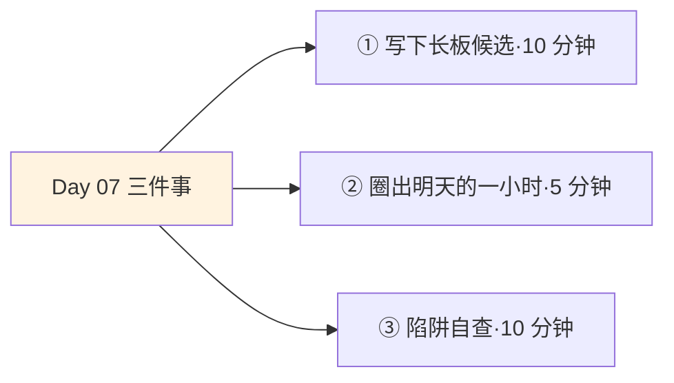
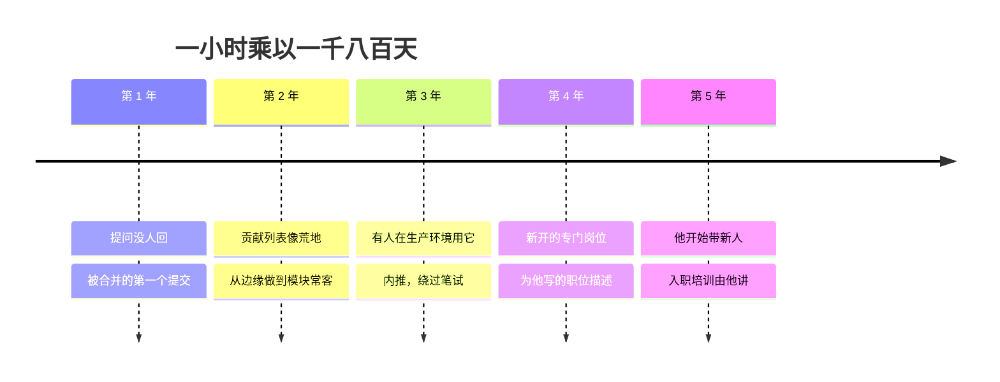

## Day 07·何为赚钱时间：长板与飞轮

- [01.看一个真实案例](#01看一个真实案例)
- [02.赚钱时间的定义](#02赚钱时间的定义)
- [03.一小时的身体感受](#03一小时的身体感受)
- [04.两个辨认判据](#04两个辨认判据)
- [05.循环增强的飞轮](#05循环增强的飞轮)
- [06.每天一小时的三种示范](#06每天一小时的三种示范)
- [07.长板与短板](#07长板与短板)
- [08.一万小时的真相](#08一万小时的真相)
- [09.赚钱时间的三个陷阱](#09赚钱时间的三个陷阱)
- [10.今天要做的三件事](#10今天要做的三件事)
- [11.总结回顾本章节](#11总结回顾本章节)
- [12.后来发生的改变](#12后来发生的改变)
- [13.今天起改变三点](#13今天起改变三点)
- [14.课后作业思考下](#14课后作业思考下)

---

## 01.看一个真实案例

两位读者，同年同月同日入职同一家公司的同一个部门，岗位相同，起点相同，甚至在同一间合租的房子里住过一年。

五年之后，一位成了团队里不可替代的专家：架构升级叫他，疑难杂症找他，新人的入职培训由他讲。另一位依然优秀，但他的优秀是胜任式的：需求按时交付，绩效不温不火，简历投出去，面试官问不出什么特别的。

差别来自一件事。前一位从入职第三个月起，每天雷打不动给一个开源项目提交一小时：读源码，提问题，改文档，修小 Bug，从最边缘的贡献者做起。后一位不是没想过学点什么，也报过课、买过书，但都在忙起来之后暂停了。用他的话说：我天天加班到九点，哪有他那闲工夫。

我算过一笔账给他看。一小时乘以一年，三百六十五小时；乘以五年，一千八百多小时。**相当于在全职工作之外，他悄悄多干了一整年的全职工作，而且那一年干的全是他自己的活。**

这个差距在每一天小到看不见，一比时间表，两个人都忙；五年一拉曲线，一个在原地重复，一个在复利爬升。昨天讲了地基，今天讲脚手架：赚钱时间，以及让它自动升值的那个飞轮。

## 02.赚钱时间的定义

原稿的定义，一字不多，一字不少：赚钱的时间，是在一天可选的时间中，用于创造价值的时间。

拆开看有三个关键词。第一个是可选：排在被动的会议、通勤、还债式加班之后的、你真正能说了算的时间，才有资格被讨论怎么用。第二个是创造：注意是创造价值，不是重复劳动。重复一百遍的同一个动作，不产生增量，那是生存时间的蓝色；每一次都让成品比上一次好一点，才是金色的开始。第三个是价值：提高你提供的有形产品或无形产品的价值，让别人为你出的价变高，或者让愿意为你买单的人变多。

原稿还给了一个极简的操作定义：赚钱时间就是，今天我安排出一个小时，在这一小时里我就做一件事，让我提供的产品价值提高。**一小时，一件事，价值提高一点。**这个定义的狠处在于它把门槛降到了地板：无论你从事什么职业，都可以定义自己的赚钱时间。

注意赚钱时间不等于挣钱的时间。这一条要在脑子里多过几遍，因为直觉会不断骗你。为了工资出卖的八小时，大部分是生存时间；晚上为长板投入的一小时，才是赚钱时间。**挣钱的多少不决定时间的颜色，时间的走向决定时间的颜色。**

## 03.一小时的身体感受

辨认赚钱时间，除了看定义，还有一条更快的通道：身体感受。

原稿写得极其精确：在赚钱时间里，人是高度紧张的、自驱的、焦虑的。

紧张，是因为这一小时做的事在能力的边缘。太熟练的东西不需要你，你闭着眼都能做好的事不会提高你的价值；够得着但吃力的东西才会。这种紧张不是被追着跑的紧张，是运动员起跑前的绷紧。

自驱，是因为没人要求你做这件事。老板不知道，考核不包含，不做没有任何后果。这一小时完全靠你自己按亮，这正是它难的地方，也是它值钱的地方：**不做的成本是隐形的，做的收益也是远期的，所以全靠内驱。**

焦虑，是最容易被误解的一条。很多人以为好状态应该是轻松愉悦的，于是焦虑一来就觉得自己做错了。恰好相反。这种焦虑是成长痛：练力量的人第二天肌肉酸，说明练到位了；赚钱时间里的焦虑是脑子的酸，说明你在够更高的位置。**要区分的是两种痛：训练后的酸痛是信号，受伤的刺痛是警报。**让你更想继续的焦虑是前者，让你想逃的焦虑是后者。

所以体感上，赚钱时间像锻炼，不像按摩。如果你安排的那一小时做完浑身舒坦毫不费力，那大概率不是赚钱时间，是好玩时间涂错了金色。

## 04.两个辨认判据

身体感受是快通道，正式的辨认要走两个判据，都来自原稿。第一，你是否发觉到并且瞄准了核心竞争力。第二，核心竞争力是否进入了循环增强的模式。

第一个判据先要过一关：很多人说不清自己的核心竞争力是什么。三个问题可以逼出来。别人反复找你帮忙的领域是什么？你做起来比别人省力的事情是什么？如果明天行业地震只能留下一种能力，你希望是哪一种？三个答案的交集，就是长板的候选区。

第二个判据是分水岭，它把赚钱时间和主动生存时间分开。昨天讲过的主动生存：在被迫的生存时间里积累，态度端正，方向向上。主动生存和赚钱时间都长着金色的边，区别就看循环增强有没有发生。给公司学英语是主动生存，用它翻译出作品、作品带来 tougher 的稿约、稿约逼出更好的英语，才是赚钱时间。判据一句话：**你做的事，有没有让下一件同类的事变得更容易、更值钱。**

## 05.循环增强的飞轮

循环增强，是赚钱时间的发动机，值得画出来看。

看这个环的运转方式：练习让能力上升，能力让产出可见，可见的产出吸引更高级的机会，高级的机会提供更高质量的练习素材，素材又反哺练习。每一圈转下来，同样的努力换来更多的增量。**飞轮的可怕之处在于自增强，同样的输入，收益一圈比一圈大；飞轮的可爱之处也在于此。**

社会学早就给这个现象起过名字：马太效应。强者愈强，弱者愈弱，因为优势本身会吸附资源。它的公式形态，原稿里写过一个，叫硬核人生终极等式：D 等于 P 乘以一加 R 的 N 次方。P 是现在的起点，R 是每天的进步率，N 是时间。这个公式 Day18 会专门拆，今天只记一个直觉：**指数曲线的前段平得让人绝望，后段陡得让人不敢认。**开头那位程序员的第一年，贡献列表寒酸得不好意思给人看，那正是前段；第五年，曲线开始替他说话。

反过来，飞轮也解释了穷忙的死循环为什么难逃：重复劳动不产生可见产出，没有产出就没有机会升级，没有升级，明天的练习和今天一样廉价。两个环都成立，一个向上，一个向下，你在哪个环里，决定了十年后的你在哪。

## 06.每天一小时的三种示范

定义和机制都清楚了，落地到不同职业是什么样。三种示范。

程序员的算法小时。每天下班后一小时，只做算法题或读源码，不做需求不回消息。判断标准：一年后，你能不能接别人接不了的活。这个小时的价值不在学会了多少题，在于它持续把你的天花板往上顶，让明天的工作比今天更有含金量。

销售的话术小时。每天挑一个当天真实发生的丢单或成交，复盘对话，写下那句起作用的和那句坏事的话，改写一遍。判断标准：一年后，你的转化率是不是同类里的异常值。顶尖销售的练法从来不是多打电话，是复盘。

写作者的千字小时。每天固定时段写一千字，好坏不论，发表与否不论，写满为止。判断标准：一年三十六万字，你有没有攒出一批像样的存货和一个明显的个人风格。大多数写作者败在根本不生产，灵感和状态是幻觉，产量才是本金。

| 职业 | 一小时内容 | 一年后的验收 |
|:--:|:---|:---|
| 程序员 | 算法题或源码 | 能接别人接不了的活 |
| 销售 | 复盘一个真实案例 | 转化率成为异常值 |
| 写作者 | 一千字，写满为止 | 存货与风格成型 |

注意三种示范的共同点：内容具体到不用思考就能开始，验收具体到一年后可以量化。**含糊的一小时是幻想，具体的一小时才是资产。**

## 07.长板与短板

赚钱时间讲的是长板，这一节必须正面回答那个从小听到大的词：短板。

传统教育给我们装了一套评分系统：木桶理论。一只桶能装多少水，取决于最短的那块板。所以我们的十二年基础教育干的事，是补短板：数学差补数学，英语弱补英语，总分是那只桶的水位。这套逻辑在考试系统里完全成立，因为高考考的就是那只桶。

问题出在毕业那天。社会的计价方式一夜之间换了：**没有人再为你的总分付钱，人们只为你的长板付钱。**没有患者关心医生的平均分，只关心他手术台上的水平；没有客户关心律师的体育成绩，只关心他庭上的胜率。分工社会就是这么运转的：亚当·斯密讲制针工厂，一个人专磨针尖一个人专砸针帽，产出翻了几百倍。分工的本质，就是用我的长板和你的长板交换。

所以毕业后的正确策略是双轨的。短板补到不拖后腿即可：及格、不致命、不构成硬伤，这个目标用零碎时间就能维持。长板则要炼到别人绕不开：明显超出平均水平，提到这个领域，你的名字会被想起。原稿说得更狠：**让你的长板远远超出大家的平均水平，成为所有人一眼看出的强项。**一眼看出，是长板的及格线。

## 08.一万小时的真相

赚钱时间绕不开那个著名的数字：一万小时。

先讲清楚它的来源。心理学家埃里克森研究柏林音乐学院的小提琴学生，发现顶尖组到二十岁平均积累了约一万小时的刻意练习，远超平庸组。这个研究被格拉德威尔写进《异类》，变成流行的一万小时定律。但格拉德威尔的转述丢掉了最关键的定语：**刻意**。埃里克森本人后来专门抱怨过，人们把一万小时理解成时间堆砌，这是误读。

真相用两个司机就能讲清。一个出租车司机，开车三十年，每天八小时，累计远远超过一万小时。一个职业赛车手，系统训练五年。谁的驾驶水平高？时间堆得多的是前者，但答案显然是后者。差别不在小时数，在每小时里发生了什么：**重复的一万小时制造熟练，循环增强的一万小时制造卓越。**

埃里克森管那件事叫刻意练习，三个要件：在能力边缘练习，刚好够不着的地方；有即时反馈，知道每一下好在哪差在哪；全程专注，一小时就是一小时。对照昨天讲的赚钱时间体感：紧张、自驱、焦虑，严丝合缝。**赚钱时间，就是自我管理版的刻意练习。**所以原稿那句话值得裱起来：所有的一切，体力、技能、智识，都可以训练变强，或者沉沦变废。变强还是变废，不取决于你花了几小时，取决于每小时是否比上一小时难一点点。

## 09.赚钱时间的三个陷阱

最后排雷。三个最常见的陷阱，几乎人人中过。

第一个，把忙当赚钱。忙是时间被填满的状态，赚钱是价值在累积的状态，两者可以同时发生，也可以毫无关系。识别方法很简单：问这周的忙碌让下周的哪件事变容易了。答不上来，就是用战术上的勤奋，掩盖战略上的懒惰。忙碌感是最容易上瘾的安慰剂，因为它至少证明我没有偷懒。

第二个，把打工当赚钱时间。打工的大部分是生存时间，只有给长板供料的部分是金色。检验法：把你从岗位里抽走，公司多久能补上你。能立刻补上的，你挣的是岗位的钱；补不上的，你挣的才是长板的钱。前者天花板是工资单，后者的天花板是市场。

第三个，追风口。今天看到别人做视频赚钱就学剪辑，明天看直播火了就学话术，每次切换，之前的积累全部清零，复利从一重新起算。风口本身不是问题，问题是用别人的长板方向，烧自己的时间。**风口是长板的结果，不是长板的替代品。**先在原地炼出绕不开的那一块，风口来了才接得住；没有长板的人追风口，追到的永远是下一个风口。

| 陷阱 | 麻烦之处 | 一句话解药 |
|:--:|:---|:---|
| 忙当赚 | 忙碌感是安慰剂 | 问：这周让下周的什么变容易了 |
| 打工当赚 | 误把岗位当长板 | 问：抽走我，多久能补上 |
| 追风口 | 切换即清零复利 | 问：这块板是我的，还是风口的 |

## 10.今天要做的三件事

动作一，用第 04 节的三问，写下你的核心竞争力候选。三个问题各答一行，找交集。找不准没关系，先圈一个方向，赚钱时间的试错本身就是长板显影的过程。

动作二，在明天的日程上圈出一小时，给它名字。不是有空再说，是具体到明天几点到几点、做什么、在哪做。这一小时的标准只有一个：让长板加一。写作就写满，练题就算数，复盘就成文。

动作三，对照第 09 节做陷阱自查。三个陷阱各给自己打一个分：最近一周的忙碌里有多少在累积，打工时间里哪部分在给长板供料，过去两年换过几次方向。诚实打分，不及格的地方就是下个月的功课。

## 11.总结回顾本章节

赚钱时间是一天可选时间中用于创造价值的时间，操作定义是一小时做一件事让价值提高。它的体感是高度紧张、自驱、焦虑，像锻炼不像按摩。两个辨认判据：瞄准核心竞争力，进入循环增强。飞轮是它的发动机，马太效应和指数公式是它的数学；重复的一万小时制造熟练，循环增强的一万小时制造卓越。

长板是赚钱时间的靶心：短板补到不拖后腿，长板炼到别人绕不开。三个陷阱要终身防：忙不是赚，打工不是赚，风口不是板。

一句话总结整章：**找到你的长板，并花时间让它循环增强到无限长。**

## 12.后来发生的改变

回到开头那两位程序员，讲讲后来。

坚持开源的那位，贡献列表的头两年难看得像荒地：提的问题没人回，改的文档没动静，第一个被合并的代码是他提交后的第七个月。第三年，他修过的一个模块被另一家公司的人在生产环境用上了，对方在项目里提了个深入的问题，只有他能答。一来一往，那家公司内推了他：没有笔试，没有算法面，两轮聊的都是他自己写过的代码。他的薪资，比当时同级的市场价高出一段，而且岗位写着专门为这个方向新开的。

另一位呢，他其实也变了。第五年的一次聚会上他跟老同事说：我以前觉得他运气好，赶上了好项目。后来我看了他的提交记录，从第一年看到第五年，看完那天晚上我失眠了。他说第二天他做了一件事：把自己想了三年没动的一个副业项目，仓库建了，第一个文件提交了。他说：**我算明白了，差距不是那五年，是每一天的一个小时。我打算从今天的一小时开始还。**

## 13.今天起改变三点

第一，每天一小时，给长板供料，先连续三十天。别贪多，就一小时；也别间断，就三十天。三十天结束时用第 06 节的验收标准查一次：这三十小时让什么变容易了。飞轮第一圈最难，转起来之前，全靠日历撑着。

第二，每次排日程先放金子。以后安排一天，先把赚钱时间那一小时放进日历最硬的位置，再让其他事项去挤剩下的时间。顺序反过来，金色永远会被蓝色吃掉，因为紧急永远比重要嗓门大。

第三，季度做一次长板盘点。每季度末问一句：我的长板比上季度厚了吗，证据是什么。证据必须是可见的：一个作品、一次内推、一段别人做不到的活。感觉变强不算数，感觉是复利曲线上最会说谎的指标。

## 14.课后作业思考下

第一，用三个问题写出你的长板候选：别人反复找你帮忙的领域、你做起来比别人省力的事、行业地震时你想留下的能力。三行的交集在哪？

第二，回顾你过去为学某样东西投入的时间总量，再用刻意练习的三要件（边缘、反馈、专注）复查：那段时间是循环增强的，还是重复堆砌的？这个答案解释了你现在水平的多少？

第三，三个陷阱各找一个自己的实例。最近一次用忙碌安慰自己是什么时候？你的岗位和长板重合度有多高？你上一次因为风向切换方向，烧掉了多少已有积累？

第四，把你明天那一小时的具体安排写下来：几点，在哪，做什么，验收标准是什么。写完发给一位朋友，请他明天这个时间点问你一句：昨天说的一小时，做了吗。

---

**明日预告 · Day 08 好看时间运动。** 脚手架讲完了，明天讲能量补给的第一块：好看时间。为什么说人和人的差距先于思想铭写于身体之上？为什么运动必须是不间断的、非脉冲式的？还有一套让你真的能动起来的七步激励法。明天见。
