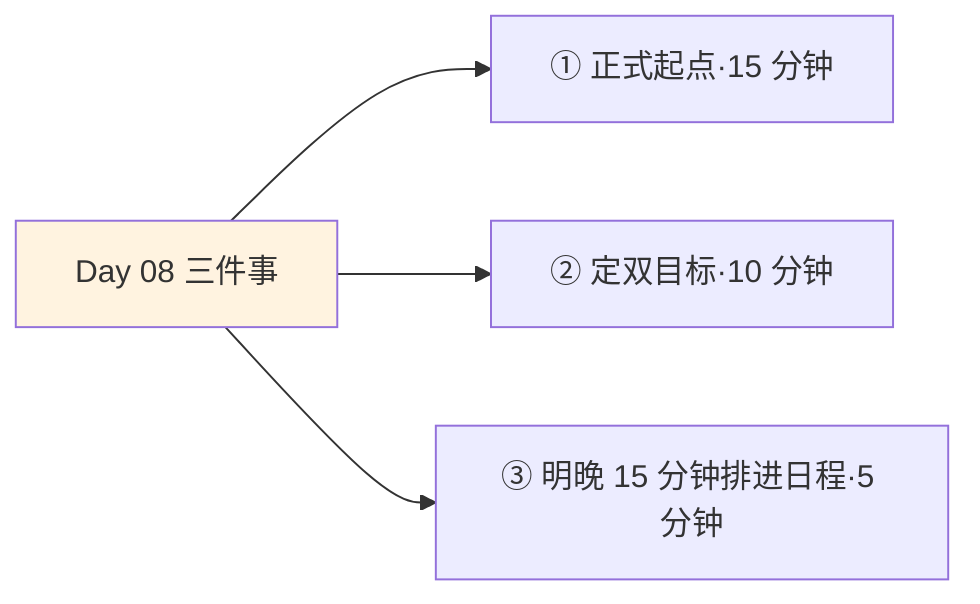
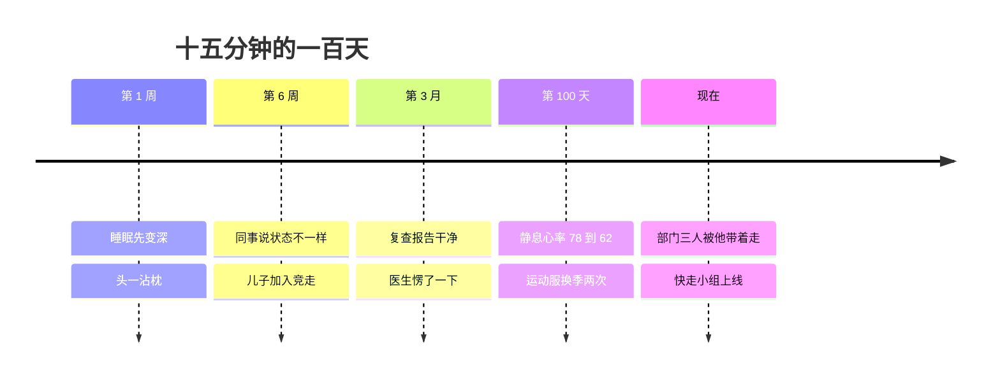

## Day 08·好看时间运动：生命力的显性表达

- [01.看一个真实案例](#01看一个真实案例)
- [02.好看时间的定义](#02好看时间的定义)
- [03.为什么好看重要](#03为什么好看重要)
- [04.生命力，不是颜值](#04生命力不是颜值)
- [05.好看时间的四大支柱](#05好看时间的四大支柱)
- [06.为什么运动排第一](#06为什么运动排第一)
- [07.七步激励法·上](#07七步激励法上)
- [08.七步激励法·下](#08七步激励法下)
- [09.脉冲式运动的陷阱](#09脉冲式运动的陷阱)
- [10.今天要做的三件事](#10今天要做的三件事)
- [11.总结回顾本章节](#11总结回顾本章节)
- [12.后来发生的改变](#12后来发生的改变)
- [13.今天起改变三点](#13今天起改变三点)
- [14.课后作业思考下](#14课后作业思考下)

---

## 01.看一个真实案例

先看两份体检报告。

一位三十五岁的程序员，姓氏老陈，体重和代码一起涨了八年。去年的报告上，中度脂肪肝、甘油三酯超标、静息心率每分钟七十八次，医生的批注是建议生活方式干预。今年他给我看新报告：脂肪肝那一栏空了，静息心率六十二，全部箭头归位。

变化怎么来的，说出来毫不性感：每天晚饭后快走加慢跑十五到二十分钟，加上十一点前睡，坚持了一百天。没有私教，没有训练营，没有节食。

比数据更早到的是同事的嘴。大概第六周，茶水间有人跟他说，你最近状态不一样了，具体说不上来，就是不一样了。他跟我复盘这一百天的时候说了一句话，值得放在这本书里：**"好看时间是一天里唯一当天投入、当天就有反馈的时间。"**他说得极准确。工作要季度才验收，学习要考试才知道，只有睡眠和运动，当天晚上就告诉你身体今天的账清了。

昨天的饼图里，这块时间涂的是粉色。今天讲它：好看时间，以及让绝大多数人卡在门口的那道坎，运动。

## 02.好看时间的定义

原稿的定义：在一天的可用时间内，这段时间只用来做能帮助我看上去更好看的事。

范围比想象中宽。早晚做面膜，下厨煲个汤，去健身房做几组深蹲，让我身材紧实、皮肤有光彩、精神状态更好的一切，为之付出的时间，都归属好看时间的范畴。注意定义的落点是看上去更好，不是变美变帅那种社交媒体标准的变：皮肤有光、身姿挺、眼里有神，都算。

讲定义必须先拆一颗地雷：很多人一听外表两个字就皱眉，觉得肤浅，觉得不上台面，觉得讨论它掉价。这个反应可以理解，但站不住。

第一层辩护，好看是生命力的显性表达，这句话原稿有，第 04 节展开。第二层辩护更硬：好看时间的投资回报，是被经济学实打实研究过的。承认这一点不丢人，假装它不存在才吃亏。

先说清楚粉色的边在哪里，免得涂糊了。刷两小时穿搭视频而不出门、为容貌焦虑到失眠、透支健康的美容手段，这些不是好看时间：第一种是好玩时间涂错了颜色，第二种是焦虑时间的伪装，第三种干脆是好看时间的反面。判据和第 05 天一样简单：**做完之后，我的身体状态是更好了，还是更差了。**

## 03.为什么好看重要

把话说透：外表在人类社会里的权重，大到了多数人不愿承认的程度。

普林斯顿的心理学家托多罗夫做过一个著名实验：给人看一张陌生面孔，要求判断这个人可不可信。结果，一百毫秒之内，判断就形成了。更扎心的是后续发现：给被试更长的观看时间，三秒、五秒，他们只会进一步强化第一印象，而不是修正它。**大脑用零点一秒给你定了稿，然后用余下的时间找证据。**

经济学家哈默梅什把这件事算成了钱。他在《美即正义》里汇总了数十年的数据：相貌高于平均水平的员工，收入显著高于相貌低于平均的同行，溢价量级在百分之十上下，而且这个差距随职业生涯累积。他给这个现象起了个直白的名字，美貌溢价。

这些研究的意思不是让你去动脸，而是让你面对一个事实：原稿那句话是社会学级别的准确：**人和人的差距，总是先于思想、经历和教养，铭写于身体之上，呈现于人前。**你的思想需要三小时的长谈才能被看见，你的身体零点一秒就交卷了。

好消息也在这个事实里：铭写在身体上的那部分，恰恰是五种时间里最可控的一块。思想难改，教养费时，而身体，是你在今天到未来三个月之间唯一能明显改变的东西。粉色的投入产出比，其实是五种时间里最高的之一。

## 04.生命力，不是颜值

讲完残酷的部分，讲这个概念的真正内核，也是最容易被误解的部分。

好看时间的好看，不是医美广告里的好看。原稿有一句话，我第一次读到就抄在了本子上：**我们会发现所有的赞美都归于人的挺拔或清澈，全是生命力充沛的特征。**

拆开这两个词。挺拔，说的是姿态和结构：肩膀是打开的还是垮的，背是直的还是弓的，步子是有弹性的还是拖的。清澈，说的是质地和光泽：皮肤是不是透亮，眼神是不是有神，头发是不是有光。回想一下你真心夸过的人，会发现你夸的从来不是五官的精巧，而全数落在挺拔和清澈这两个词上：状态真好，人真精神，看着真舒服。

这两个词的共同点是什么：它们全是生命力的外显，而且全是可训练的。挺拔靠肌肉和姿态训练，清澈靠睡眠、循环和代谢。**五官是父母给的图纸，生命力是你自己施工的工地。**医美改的是图纸，好看时间经营的是工地。前者是一次性的，后者每天都在进展。

原稿还有一句，把这一节钉死了：**你的外表和能力，共同决定了你的命运。**注意它的措辞：外表和能力，不是外表或能力。它俩不是竞争关系，是乘法关系。好看时间从来不是让你靠脸吃饭，是让你身体这台机器，配得上你脑子里的计划。

## 05.好看时间的四大支柱

好看时间的展开结构是四大支柱，原稿给出了其中三条的量化标准，我补一条，凑成完整的四柱。

支柱一，运动。每天十五分钟起，这是原稿给的最低门槛，第 06 节专门讲。支柱二，饮食。每天规律早餐。规律比内容更重要：代谢系统要的首先是节奏，固定时间吃、别用咖啡因硬顶饿感，把血糖的过山车换成平缓的小坡。支柱三，睡眠。每晚十一点前睡。睡眠科学家沃克在《我们为什么要睡觉》里给出的结论可以概括成一句：睡眠是单利无法偿还的高利贷，今晚的欠账会直接记进明天的认知、免疫和情绪账单。支柱四，护理。皮肤、毛发、牙齿。给三条最小动作：每天防晒，皮肤老化的头号外部推手是紫外线，不是岁月；每半年洗一次牙；别用热水烫脸。

| 支柱 | 最低标准 | 一句话原理 |
|:--:|:---|:---|
| 运动 | 每天 15 分钟 | 给出结构和循环 |
| 饮食 | 每天规律早餐 | 代谢要的是节奏 |
| 睡眠 | 晚 11 点前 | 今晚的账单记进明天 |
| 护理 | 防晒·洗牙·温水洗脸 | 抗的是紫外线，不是岁月 |

四根柱子一起撑起的那个东西，叫状态。别人嘴里你最近状态不一样了，说的就是四柱整体抬高的那一下。**状态不是玄学，是四项基础分的总和。**

## 06.为什么运动排第一

四大支柱里，运动的优先级排第一，原因有三层。

第一层，它是唯一的跨柱支柱。运动同时改善另外三柱：练过的那晚睡眠更深，规律消耗让食欲和饮食自动归位，出汗加速循环直接改善皮肤。一根柱子的投入，四根柱子的回报，这笔账在任何投资里都算天才操作。

第二层，它直接给大脑供能。精神病学家瑞迪在《运动改造大脑》里梳理的证据链，结论是运动时肌肉分泌的蛋白会促进脑源性神经营养因子的分泌，这种因子被称作大脑的肥料，它直接参与记忆形成和神经新生。翻译一下：运动不是从学习时间里偷时间，它是给学习时间施肥。十五分钟运动换回来的专注度，远超它占掉的时长。

第三层，也是被低估的一层：**运动的反馈速度，是所有长期主义项目里最快的。**Day07 讲过，工作的验收以季度计，长板的验收以年计，只有运动，一周就能在体重秤和睡眠质量上打出回执。人是需要即时反馈的动物，革命性的反馈慢项目全靠信念硬撑，运动是那个每周给你发糖的项目。先把它跑通，体验几轮小反馈，你对所有慢项目的耐心都会变好。

原稿给的门槛是每天十五分钟。这个数字妙在两头堵：低到你说不出没时间，因为它只是一集短视频的长度；又高到必须认真对待，因为它每天都会真实消耗你一点意志力。**十五分钟，是懒和馋的第一道防线。**

## 07.七步激励法·上

运动的好处讲完了，现在讲真正难的部分：怎么开始，以及怎么不放弃。原稿给了一套完整的方法，叫七步激励法，激励的敌人写得明白：人性中的懒和馋。这七步我拆成两节讲，先讲前三步。

第一步，正式起点。原稿用词极准：认真、客观、科学地打量自己，测量自己，并做记录。打量的内容：正面侧面各拍一张素颜照，量体重、腰围、静息心率，有条件加体脂率。关键在正式二字：不记录的起点等于没有起点，一百天后你拿什么对照。这一步的潜台词是把脸凑近镜子，很多人多年没认真看过自己的身体现状，这是整个七步里心理门槛最高的一步。

第二步，确定目标。原稿要求双目标：状态目标加尺寸目标。尺寸目标是数字：腰围减几厘米，静息心率降到多少。状态目标是体感：睡醒不昏沉、下午三点不垮、爬六层楼不喘。**把状态目标写在尺寸目标前面。**尺寸有平台期，状态几乎周周有反馈，先靠状态目标维持燃料，尺寸目标是顺手收获。

第三步，监督制度。自我监督或者他人监督，执行订立有节奏的时间点。行为科学管这个叫承诺装置：把承诺从脑子里搬出来，交给一个外部结构。形式随意：运动打卡群、跟朋友的赌约、一张贴在冰箱上的表格。要点是节奏感：固定时间点检查，而不是想起来才看。

## 08.七步激励法·下

第四步，遵循计划，把健身计划写入每天的待办事项。注意是每天，不是每周三次。计划写成这周运动三次，三次大概率一次都发生不了；写成今晚七点半，快走十五分钟，它就发生了。**频率先于强度，日程先于心情。**

第五步，记录对照。原稿这句话是整套方法的灵魂：**肉眼可见的差异，会带来巨大的驱动力。当你看到好的变化，就会在潜意识里想要变更好。**每两周同角度拍一张照，同条件量一次围度。变化会在你以为没变化的地方出现：第二十八天，照片里的下颌线清楚了一线。人会被自己身体的变化说服，这个说服力超过任何教练的嘴。

第六步，找到同伴。激励和陪伴，两个词缺一不可。研究运动依从性的数据反复指向同一个结论：结伴训练的坚持率显著高于独行。原因不神秘：同伴把我不想去了从终点变成了迟到，从放弃变成了爽约，背叛自己的成本是零，辜负同伴的成本不是。

第七步，金钱奖励。给自己设置一个物质奖励，并且把它押在一个具体条件上：坚持满九十天，买那双看了很久的鞋。要点是先押后得：奖励在你开始前就定好、写下来、最好让别人知道，让未来的糖，拉住现在的你。

七步的底层逻辑只有一条：**不指望意志力，搭一套让放弃变得困难的系统。**懒和馋不是道德缺陷，是出厂设置，对付出厂设置，不能靠决心，只能靠结构。

## 09.脉冲式运动的陷阱

最后排一颗雷，原稿点过它的名：但凡想要好看，必须开始运动，持续运动，不能是一时兴起的脉冲式运动。

脉冲式运动的标准剧本，你大概率经历过其中一幕：某天受到刺激，体重、体检单、或一张老同学合影，当晚办卡买装备，第一周练五次，第二周膝盖疼，第三个月卡在抽屉里长灰。下次再受刺激，循环重启。健身房商业模式就建立在这个循环上：赌你办了卡不来。

脉冲的三宗罪。第一宗，身体账：冷启动猛练是受伤的头号来源，一次拉伤，三个月起步的停摆。第二宗，信心账：每次失败都记在我是坚持不下来的人这份档案里，档案越厚，下次启动越难。第三宗，效果账：断续的刺激无法形成累积，等于每次都在付学费、从不读完学期。

解药是原稿那句长期主义的好看：不求三十天惊艳所有人，求五年后比同龄人状态好一截。它对应的是 Day18 会讲的复利思维：**脉冲是把自己反复拉回起跑线，持续是让同一条曲线一直往上爬。**判断你现在处于哪种状态，有个残忍的问题：你鞋柜里那几双运动鞋，分别是哪年买的，各自停在了七步中的哪一步。

## 10.今天要做的三件事

动作一，完成正式起点。今晚，正面侧面两张素颜照，体重、腰围、静息心率（早晨醒来躺着数一分钟脉搏），记在同一个地方。不舒服就对了，一百天后它就是战前地图。

动作二，写下双目标。状态目标一条，尺寸目标一条。写下来，贴起来。别写减二十斤这种半年度目标，写九十天够得着的那种。

动作三，把明晚的十五分钟排进日程。具体到几点、穿什么、去哪走。就十五分钟，先把第一格涂上粉色，后面的九十天是它的复利。

## 11.总结回顾本章节

好看时间是一天可用时间里，只用来做让自己看上去更好的事的时间。它不肤浅：大脑零点一秒定稿第一印象，美貌溢价是经济学事实，但好看时间的靶心不是颜值，是生命力的外显，挺拔和清澈，全是可训练的。

四大支柱：运动、饮食、睡眠、护理，状态是四项基础分的总和。运动排第一，因为它是跨柱投资、大脑肥料、反馈最快。开始和坚持靠七步激励法：正式起点、双目标、监督、日程化、记录对照、同伴、金钱奖励，本质是不指望意志力，搭一套让放弃变难的结构。警惕脉冲式运动：不求三十天惊艳，求五年后领先。

一句话总结整章：**外表和能力，共同决定命运；而外表里可控的那部分，全在好看时间里。**

## 12.后来发生的改变

回到那位程序员老陈，一百天之后呢。

他说最先变化的是睡眠，第一周就变了：以前靠刷手机才能困，现在头一沾枕。第二个月，五岁的儿子看他每晚换鞋出门，闹着要跟，于是快走变成一大一小的竞走，十五分钟变成四十分钟，同伴这个环节被儿子主动补上了。第三个月复查，就是开头那份干净的报告。医生问他是怎么做到的，他说就是走路，医生愣了一下说，大部分人是做不到每天走路的。

最新进展：他部门里另外两个人开始跟着他走，理由特别好笑，说看他天天准时消失十五分钟，以为他升职了有什么秘密安排，跟了两周才知道是走路，走完也就一起走下去了。

他自己的总结很平静，我原文记下：**"我没有变成健身博主，也没练出什么身材，我只是把一个透支的身体，还成了一个正常的身体。原来正常就已经赢过大多数人了。"**

## 13.今天起改变三点

第一，十五分钟写进每天的待办，先九十天。不设强度要求，只设出现要求：到点出现，走完就是胜利。九十天后再谈加强度，先让粉色格子连续出现，再让它变深。

第二，每两周做一次记录对照。同角度照片、同条件数据，放进同一个相册或表格。状态目标每次问一遍：睡醒昏沉吗，下午三点垮吗。让身体的变化替教练说话。

第三，把一个奖励押出去。今天就定好九十天的物质奖励，写下来，告诉一个人。别小看这一步，它是七步里最便宜的一步，也是被放弃率最高的一步，因为它要你现在就为一个远期的事花心思，而这恰恰是全书要训练的肌肉。

## 14.课后作业思考下

第一，完成正式起点的全部测量，写下看数据时的第一感受。不舒服是正常的，记下这个感受，九十天后对照的是数据，更是此刻的心态。

第二，清点你的运动史：历次开始分别停在七步中的哪一步？是没记录起点就开练，是目标只有尺寸没有状态，还是缺监督和同伴？找出你个人的死亡步骤，这一次绕开它。

第三，状态目标和尺寸目标各写一条。检查尺寸目标是否九十天够得着，检查状态目标是否具体到可以自问自答。两个都写太高的，回到第 07 节重写。

第四，今天就把同伴或订金二选一落实：约一个人一起，或者把一个奖励写下来押给一个人。九十天后，问那个人要答案。

---

**明日预告 · Day 09 何为好玩时间。** 能量补给讲完一半，明天讲另一半：好玩时间。为什么说所有你乐于挥霍的时间都不能算浪费？为什么你周末躺了两天反而更累？报复性好玩和真正的好玩，一墙之隔，两种人生。还有两张清单：体验清单和创造清单。明天见。
