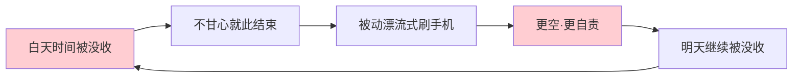
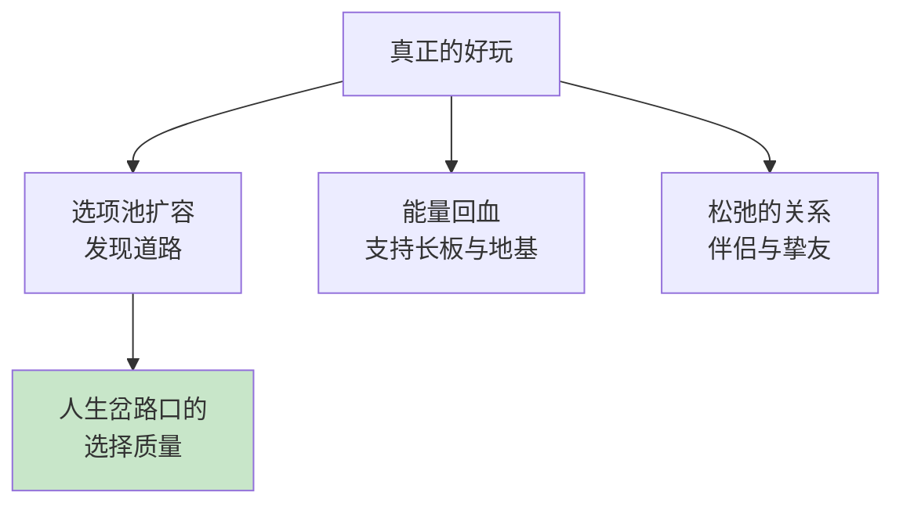
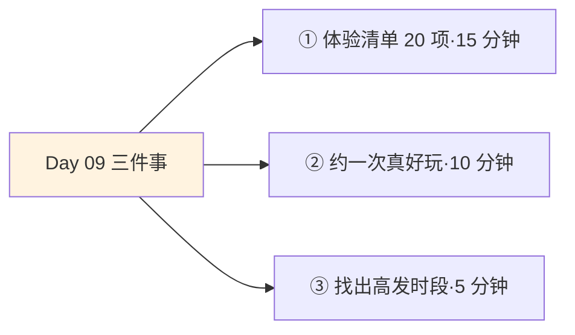
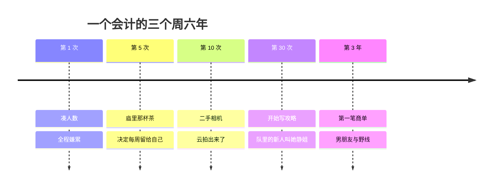

## Day 09·何为好玩时间：好奇心与选项池

- [01.看一个真实案例](#01看一个真实案例)
- [02.好玩时间的定义](#02好玩时间的定义)
- [03.先还一笔债：玩不是罪](#03先还一笔债玩不是罪)
- [04.报复性好玩的解剖](#04报复性好玩的解剖)
- [05.真正的好玩是什么](#05真正的好玩是什么)
- [06.一条辨认的分界线](#06一条辨认的分界线)
- [07.好玩时间的复利](#07好玩时间的复利)
- [08.五条通向好玩的路径](#08五条通向好玩的路径)
- [09.两张清单的底稿](#09两张清单的底稿)
- [10.今天要做的三件事](#10今天要做的三件事)
- [11.总结回顾本章节](#11总结回顾本章节)
- [12.后来发生的改变](#12后来发生的改变)
- [13.今天起改变三点](#13今天起改变三点)
- [14.课后作业思考下](#14课后作业思考下)

---

## 01.看一个真实案例

一位做会计的读者，姓阿静，每个周六雷打不动消失一天，跟户外队爬山。

这事起头特别随意：三年前同事把她拉去凑人数，她嫌累，一路骂骂咧咧爬完，回来腰酸了三天。但山顶那张照片里她的笑，是那一年里最真的。第二周她鬼使神差自己报了名。第十次左右，她买了一台二手相机，因为手机拍不出她看到的那种云。第三十次左右，她开始写爬山攻略，发给队里的新人。

上个月她跟我说了三件事的近况。攻略账号接到了第一笔商单，收入不多，但她说那是她这辈子第一笔不为工资挣的钱；她的男朋友是队里认识的，第一次约会就是两个人探了一条野线；还有一句总结，我原文抄下：**"我回顾了一下，我成年后所有重要的东西，居然都是玩出来的。"**

注意她没说努力出来的，没说坚持出来的，她说玩出来的。这就是今天要讲的时间：五种颜色里的绿色，好玩时间。它是最被低估、最常被误解、也最常被报复性赝品顶替的一种。

## 02.好玩时间的定义

原稿的定义：好玩时间，是主动选择投入、用于获取乐趣的时间。

两个关键词。第一个，乐趣：这段时间的直接目的就是快乐本身，不为别的。爬山不为健康，吃一顿好饭不为社交，看一场电影不为谈资。**玩得理直气壮，是这段时间的出厂设置**，一旦开始问这有什么用，绿色就开始褪色了。

第二个，主动：这两个字是绿色的身份证，也是它和赝品的分水岭。同样刷三小时手机，你主动选了一部纪录片看完，和你在信息流里被动漂流三小时，是两种时间。前者好玩，后者什么都不是。这个区分重要到需要专门解剖，第 04 节讲赝品，第 05 节讲真品。

原稿在这里引了约翰·列侬的一句话，是整套好玩时间的题眼：**所有你乐于挥霍的时间，都不能算作是浪费。**挥霍这个词用得极好：心甘情愿、明码标价、绝不心疼。列侬的意思不是鼓励堕落，而是指出一个朴素的真相：你乐于挥霍的那一刻，你是活的。

## 03.先还一笔债：玩不是罪

讲好玩时间之前，得先还一笔多数人从小学开始欠的债。

我们的文化词典里，玩是个带原罪的词：玩物丧志，不务正业，就知道玩。这套话语训练出来的成年人，普遍患有玩乐负罪感：休息半天觉得自己堕落，旅游途中还惦记工作，连打游戏赢了都不敢承认高兴。于是出现一种拧巴的活法：一边玩，一边骂自己玩，玩也没玩好，正事也没干。

心理学在这件事上站得比文化传统靠前。自我决定理论几十年的研究反复验证：人有三种基本心理需要，自主、胜任、联结，长期不被满足就会出问题。**乐趣不是基本需要的奢侈品，是基本需要本身。**一代代孩子长大后被观察到同一种现象：小时候没玩够的，成年后会用变形的方式补，而且补得很狼狈。

这个现象值得多看一眼。没玩够的成年人怎么补？不是去痛快地玩，而是控制不住地磨：守着电视一个台一个台地换，守着手机一条一条地划，末了说一句没意思。他不是在玩，他是在找，找一个小时候没拿到的许可。许可这东西有个残酷的特性：当年不发，如今补发也没用了，**真正的解法不是补玩，而是补上那句批准：你现在可以玩了。**这句话没人能替你说，它就是这一节的还债动作。

所以这一节的还债动作是：允许自己无用地快乐。注意无用地这个词，它是这道赦免令的核心。有用的事你天天都在做，无用的事，恰恰是被砍得最狠的。原稿说得直接：玩不一定是负面和需要焦虑的事情，好玩时间中同样存在创造性价值。下一节你会看到，赝品才需要焦虑，真品连焦虑的资格都没有。

## 04.报复性好玩的解剖

现在解剖那件赝品：报复性好玩。

它的标准剧本你一定演过。周一到周五，时间全被工作没收，晚上十一点到家，你瘫在沙发上打开手机。你并不想看什么，但你不甘心就这么睡：今天还没有一分钟是自己的。于是你刷，一集接一集，一条接一条，凌晨一点半，你终于放下手机，比睡前更空，还多了一层自责。

行为科学家克鲁瑟给这个现象起了个精确的名字：报复性睡前拖延。她二零二零年的研究发现，白天缺乏自主时间的人，会在深夜用拖延睡眠的方式夺回控制感，哪怕明明困得睁不开眼。**不是不知道该睡，是不甘心今天就这么交出去。**

报复性好玩的机制就这一句话：不是想玩，是白天欠的债在夜里讨。它在饼图上涂着绿色，但它其实是蓝色的工伤恢复期，是时间被捆绑之后情绪的反弹。反弹出来的快乐有几个特征：开始得不由自主，过程里几乎没有我，结束后不会想再来一次，只想逃。

注意这个环的闭环性：报复性挥霍不但解决不了被捆绑，还会因为熬夜掏空第二天，让捆绑更紧。它是绿色的赝品，机制和出路上 Day10 会专门讲一整章，今天先记住辨认的特征就够了。

## 05.真正的好玩是什么

真品长什么样。原稿的描述：满足好奇心的好玩让你体验最大化，探索认知范围边界的主动选择，会带来好奇心的满足和人生选项池的持续积累。

拆出三个要件。第一个，好奇心在前。真正的好玩是被好奇心牵引的：想知道那座山后面是什么，想知道这道菜怎么做出来的，想知道那本书的结局。好奇心是人类出厂就装好的驱动力，神经科学的研究显示，好奇状态下大脑的多巴胺系统被激活，学习效率反而提高。原稿那句被划线最多的话就在这里：**好奇心就会诱发生命力。**

第二个，主动选择。你在挑，而不是被推。选哪条线路、哪道菜、哪本书，哪怕选错了，痛也是自己的。自我决定理论说的自主感，落在玩这件事上就是这个选字，报复性好玩最缺的恰恰是它。

第三个，认知边界被推开一点。真正的好玩结束之后，你对世界的地图比之前大了一圈：知道了没吃过的味道，见过了没见过的地形，认识了没想到会认识的人。**体验最大化不是爽感最大化，是你人生选项池的一次扩容。**原稿的这个词极妙：选项池。今天多知道一种活法，明天做选择时，池子里就多一个可选项。

## 06.一条辨认的分界线

真伪之间，只隔一条线，原稿已经给出：玩完之后，你是更充实，还是更空虚。

这条主线之外，补三条辅助问法，管用在腿上。第一问，是我选的还是被推的：打开之前有没有一个具体的我想，还是只是手指的惯性。第二问，过程里我在不在场：真正的好玩里你是有知觉的，能看到细节、记住名字、事后讲得出来；赝品里你是失联的，三小时像被抽走了。第三问，结束时想不想再来：真品的结尾是意犹未尽，赝品的结尾是赶紧合上。

| 辨认项 | 报复性好玩 | 真正的好玩 |
|:--:|:---|:---|
| 起点 | 不甘心和惯性 | 好奇心和一个选择 |
| 过程 | 人在失联状态 | 人在场，细节鲜活 |
| 结束 | 更空，想逃 | 更满，想再来 |
| 长期 | 池子不变，越玩越依赖 | 选项池持续扩容 |

这里要提醒一个诚实的问题：绿色格子也会骗人。阿静爬山是绿色，躺平刷手机也自以为是绿色，区别只在表格最后一栏。**好玩时间是五种时间里最容易自我汇报失真的一种**，所以这张对照表，建议夹在你的时间记录本里，每周对账一次。

## 07.好玩时间的复利

好玩时间的深层价值，原稿用一句近乎轻描淡写的话交代了：我们可能在好玩时间中发现未来的道路、终生爱好，甚至是人生伴侣。

把这句话当真，它其实是复利的三种形态。第一种，选项的复利：每一次真好玩都在扩容选项池，池子越大，人生岔路口的选择质量越高。阿静的商单就是从池子里长出来的：没有爬山，她的人生里根本没有这条选项。第二种，能量的复利：真好玩回血，回的血支持下周的赚钱时间和好看时间，它是塔尖和地基之间的循环系统。第三种，关系的复利：玩伴是人最松弛时筛出来的同伴，比工位邻居可靠得多，伴侣、挚友、合伙人的故事在玩里发生的概率，远高于在任何会议室。

回头看一个容易忽略的事实：阿静的副业、伴侣、以及她整个人状态的改变，起点只是一次凑人数的周六。好玩时间的复利就是这样：**它从不承诺任何结果，但它不断把你扔进可能有结果的场景里。**待在家里的沙发是零概率事件，山顶的云是正概率事件。

有人会问，那玩游戏算吗？算不算好玩时间，判据不在活动，在关系。带着好奇去通关一个设计精妙的世界，过程里你在场、在惊叹、在记住细节，那就是真好玩；被日常压力赶着进游戏，麻木地清任务到凌晨两点，那就是赝品。同一个活动里两种人，同一个人也有两种夜晚。**问题是你可以自问的那一句：今晚是我去了游戏，还是我被赶去了游戏。**

## 08.五条通向好玩的路径

怎么让真品多起来。原稿给了五条路径，逐条过。

第一条，花时间探索自己真正的好玩。多数人其实不知道自己爱玩什么，因为答案被别人的玩刷屏了。问自己一个溯源问题：小时候没人管你的时候，你自己在玩什么？那个原型往往还在。第二条，看看爱玩的人都在玩些什么。爱玩的人是一种稀缺资源，他们对乐趣的雷达比你灵敏，跟着他们买错误率极低。第三条，忙里偷闲的好玩会格外有趣。同一场电影，赶完工作溜出去看的，比无所事事去看的香得多，稀缺本身给快乐加成。第四条，延迟满足的好玩，阶段性自我奖励。把一次期待已久的好玩押在里程碑后面，它能反过来给苦日子供能，这是 Day14 赛点思维的预告。第五条，设置不同级别的好玩，如创造清单。有大的有小的，有周末级的也有假期级的，让不同预算的日子都发得出工资。

| 路径 | 一句话要领 | 今晚的动作 |
|:--:|:---|:---|
| 探索自己的好玩 | 溯源童年原型 | 写下小时候自发玩的三样 |
| 看爱玩的人 | 借用别人的雷达 | 挑一位，看他在玩什么 |
| 忙里偷闲 | 稀缺给快乐加成 | 下次安排一次见缝插针 |
| 延迟满足 | 把玩押在里程碑后 | 定一个完成后的奖励 |
| 分级好玩 | 让每天都发得起 | 列出周末级和假期级各一 |

## 09.两张清单的底稿

五条路径是过程，落到纸上是两张清单：体验清单和创造清单。

体验清单是颗粒状的：还没去过的地方、没吃过的东西、没见过的风景，每项独立，完成即结项，像一把撒开的珠子。创造清单是线性的：从无到有做出一件事，跑完一次马拉松、拍完一部短片、做出一门课，像一条串起的线。原稿的要求是两张都要：**体验负责扩容世界的宽度，创造负责刻下自己的深度。**只有体验没有创造，玩成了观光；只有创造没有体验，玩成了苦役。

今天只立底稿，不展开：写下体验清单的第一版，二十项，先不管可行性，敢写就行。去哪、吃什么、看什么、见谁，颗粒越小越好。创造清单留到 Day23 专门讲，那里会给三个层级：三十天的微创造、一年的中创造、一生想留下的大创造。今天如果手痒，可以先在心里留个位置。

## 10.今天要做的三件事

动作一，写下体验清单第一版二十项。不设限、不审查、不排序，写的时候心跳快的那几条，就是真品方向。

动作二，从清单里挑一件本周末就能做的小颗粒，现在就安排。约人、订票、查路线，五分钟内完成一个不可逆的动作。真好玩和空想的差别，就看你有没有把一件小事钉进日程。

动作三，找出你报复性好玩的高发时段。回看时间记录，那几个每次醒来都后悔的深夜或周末下午，把时段写下来。不用改它，标注它。标出来的赝品会自己开始贬值，这是明天 Day10 的起点。

## 11.总结回顾本章节

好玩时间是主动选择投入、用于获取乐趣的时间。玩不是罪，乐趣是基本心理需要，无用地快乐是应得的。赝品叫报复性好玩：不是想玩，是白天欠的债在夜里讨，特征是失联、更空、想逃。真品由好奇心牵引，主动选择，把认知边界往外推一点，给人生选项池持续扩容。辨认只有一条线：玩完更充实还是更空虚。

它的复利是三种形态：选项、能量、关系，能把人扔进正概率的场景里。五条路径让它变多，两张清单让它落地：体验清单管宽度，创造清单管深度。

一句话总结整章：**好奇心诱发生命力，好玩时间是你有生之年里，好奇心和生命力的延续。**

到今天，第二章收官。五种时间的地图全部展开：生存、赚钱、好看、好玩已经深潜完毕，心流留了一整章在第六天篇等你。从明天开始，全书换挡：不再分类，开始训练。

## 12.后来发生的改变

回到阿静，补全她的故事。

三年前那次凑人数的爬山，她全程骂骂咧咧，这是她自己承认的。转折发生在第五次：那次爬到一半下雨，全队躲进一个山间小庙，庙里的老阿姨给每人倒了一杯热茶。她说她坐在门槛上喝茶看雨的那十分钟，突然想起自己上一次这么闲，还是小学放学路上。**那天她决定，以后每周给自己留一个这样的十分钟。**

商单和男朋友都是第三年的事。她跟我说，最意外的变化其实最小：她现在周日下午会主动想下周去哪，而以前周日下午的情绪只有一个名字，叫周日恐惧。**同一张床，同一个周一，人不一样了，日子就不一样了。**

她那句话值得再引一遍，因为它就是这一章的全部：我成年后所有重要的东西，居然都是玩出来的。

## 13.今天起改变三点

第一，给好玩时间一个正式的位置。像 Day07 给赚钱时间圈一小时那样，每周给真好玩圈一个格子。**好玩不该吃剩余，剩余里长不出好东西**：把绿色排进日程的黄金时段，而不是等所有事做完再玩剩的。排进去的那一刻，你已经不一样了。

第二，警惕等有空再玩。体验清单最大的敌人不是没时间，是永远觉得现在不是时候。规矩定死：清单上的事，最晚两个月内必须兑现一件，过期作废，换下一件。选项池的扩容靠兑现，不靠收藏。

第三，每月喂一次好奇心。每个月从清单里挑一件从没做过类型的事，小小地试一次。好奇心是那种越用越灵的肌肉，长期不用，它会萎缩成一句好无聊啊。

## 14.课后作业思考下

第一，盘点上周的绿色格子：对照第 06 节的表格，真品和赝品各占多少？赝品集中在哪个时段？这个比例和你上一次认真玩了个痛快的记忆，隔了多久？

第二，写下你人生选项池的现况：过去一年，好玩时间给你带来了什么新的可能性，哪怕小到一家新店、一项新技能、一个新认识的人。如果一片空白，说明绿色需要换血了。

第三，从爱玩的人里挑一位，观察他最近在玩什么，挑一样你觉得可能有意思的，加进你的体验清单。顺便问问他要个好玩的定义，答案常常出人意料。

第四，写下小时候没人管的时候，你自己在玩的三样东西。对照今天的体验清单，有重叠吗？如果没有，考虑把其中一个原型捡回来，它认得你。

---

**明日预告 · Day 10 觉知抚平情绪。** 第二章地图集齐，明天开始第三章：像运动员一样活着。但运动员的第一课不是训练，是安顿情绪。因为不觉知情绪的人，拥有的不是自由，是时间被捆绑后情绪的反弹。报复性挥霍的完整机制、觉知的三个层次、五个日常练习，明天见。
