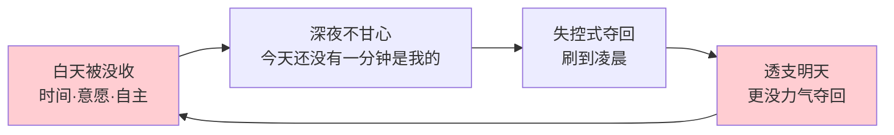
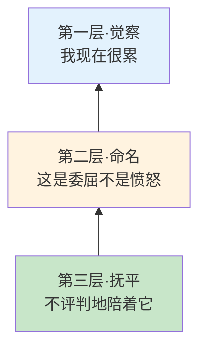
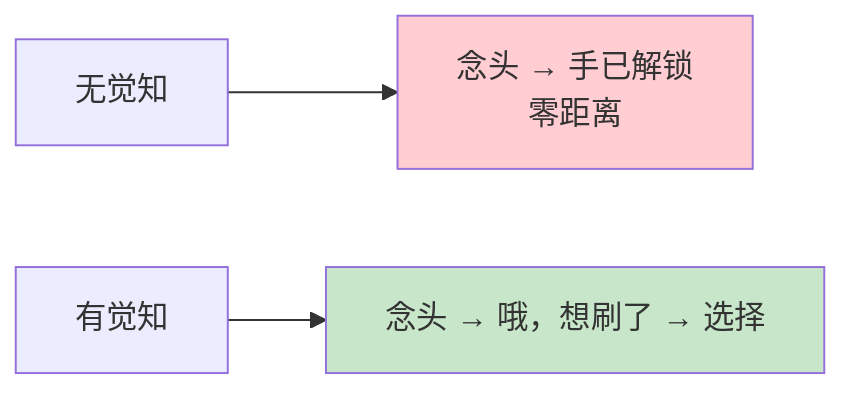
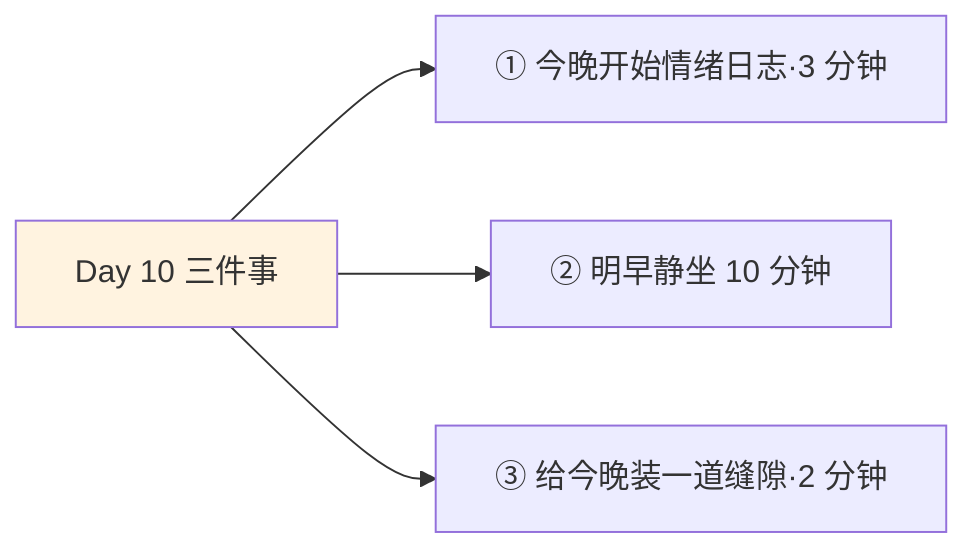
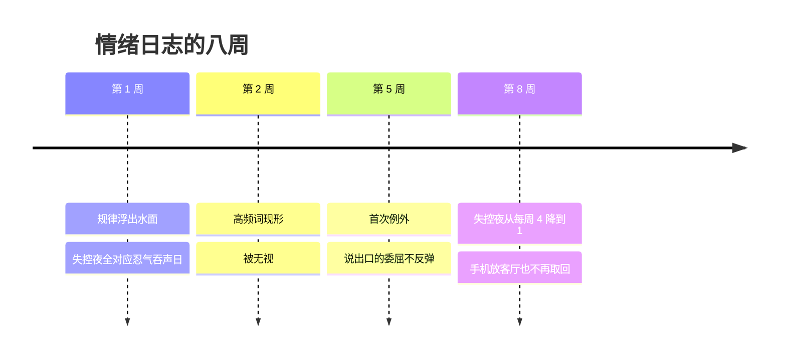

## Day 10·觉知抚平情绪：训练篇的地基

- [01.看一个真实案例](#01看一个真实案例)
- [02.训练篇第一课为什么是情绪](#02训练篇第一课为什么是情绪)
- [03.反弹的完整机制](#03反弹的完整机制)
- [04.爱因斯坦的追根溯源](#04爱因斯坦的追根溯源)
- [05.觉知是什么](#05觉知是什么)
- [06.觉知的三个层次](#06觉知的三个层次)
- [07.命名即疗愈](#07命名即疗愈)
- [08.五个日常觉知练习](#08五个日常觉知练习)
- [09.从觉知到选择：那个缝隙](#09从觉知到选择那个缝隙)
- [10.今天要做的三件事](#10今天要做的三件事)
- [11.总结回顾本章节](#11总结回顾本章节)
- [12.后来发生的改变](#12后来发生的改变)
- [13.今天起改变三点](#13今天起改变三点)
- [14.课后作业思考下](#14课后作业思考下)

---

## 01.看一个真实案例

先讲一位读者和她的熬夜战争。

她戒手机的历史可以写一本失败史。卸载过短视频 App，没用，重装只要两分钟；设置过屏幕使用时间，密码让男朋友保管，最后软磨硬泡把密码要了回来；试过把手机放客厅充电，结果是躺着清醒到两点，爬起来拿回手机报复性刷到四点。她给我发消息的原话是：**"我是不是意志力有缺陷，为什么别人说戒就戒，我像有瘾。"**

我让她把所有戒断方法全停了，只做一件事：每晚十点，写下两行字。第一行，今晚想不想熬夜刷手机；第二行，今天白天发生过什么让她不舒服的小事，任何小事。

第七天她把七组记录发给我。规律明晃晃地躺在纸上：想熬夜的四个晚上，白天全都发生过同一类事，她的话被否定、她被安排、她的意见被无视。其中一天她甚至能背出那句原话，同事在会上说这个不用你管。那晚她刷到了三点。而不想熬夜的三个晚上，白天风平浪静，她自己写了句今天没忍气，正常刷二十分钟就睡了。

**熬夜根本不是她的习惯问题，是她的情绪问题。**她戒错了东西，所以怎么戒都失败。

今天讲的就是这个：觉知和抚平情绪。这是第三章的第一课，也是后面十四天所有内容的地基。

## 02.训练篇第一课为什么是情绪

先回答一个疑问：第三章不是叫像运动员一样活着吗，运动员的第一课难道不应该是训练？

恰恰相反。看任何一个专业运动队的日程表，你会发现现代训练科学里占比越来越重的模块，不是练得更多，而是恢复与心理：睡眠监测、压力指标、心理咨询、赛前情绪管理。原因很朴素：**训练建立在系统上，系统跑在情绪上。**情绪崩了的运动员，训练计划再科学也是一张废纸。

这套逻辑平移到普通人身上更成立。前九章你手里已经有了一张地图和五种颜色，接下来要训练、要教练、要对手、要赛点。但只要反弹还在，这一切都会被周期性掏空：练了五天，一次深夜崩溃全部清零。原稿把这件事说到了根上：**如果不觉知和抚平情绪，那你拥有的其实不是自由，而是时间被捆绑后情绪的反弹，是报复性地挥霍时间。**

注意这句话的用词顺序：不觉知，则不自由。不是意志力不够，不是方法不对，是顺序错了。情绪不先安顿，后面所有章都是沙上盖楼。这就是为什么训练篇的第一课，讲的是看起来最不运动员的东西：坐下来，看见自己的情绪。

## 03.反弹的完整机制

反弹的全过程，值得逐帧拆解一遍。

原稿给过一个精确到分钟的剧本：结束一天的工作，吃完饭，回到家之后时间也不早了，这时候你也觉得累了，想做一点开心的事，于是，不知不觉中就看了两个小时的电视，日子就这样一天天过去了。这就是我们潜意识中的报复性心理，无意识地肆意挥霍。

这个剧本里有三个角色。第一个是白天的没收：会议没收你的时间，妥协没收你的意愿，忍气吞声没收你的自主。第二个是深夜的不甘心：今天还没有一分钟是属于自己的。第三个是用失控夺回：既然正常途径拿不回来，就透支明天的精力，硬抢今晚的两小时。Day09 讲过克鲁瑟的研究结论：这不是不知道该睡，是不甘心今天就这么交出去。

注意最后一条边：透支明天，让明天更没力气用正常途径夺回时间，于是更依赖深夜失控。这个环每转一圈收紧一格，这就是为什么单纯靠戒，戒不掉。

机制里还有一个被忽略的真相：反弹消耗的不是意志力，是意志力的余额。心理学家鲍迈斯特把人的自控比作肌肉资源，白天每一次开会忍住不怼、每一封措辞得体的邮件、每一个忍下来的安排，都在花余额。晚上瘫在沙发上时，你不是变坏了，你是花完了。**深夜的那个你，是白天所有忍耐的账单。**看清这一点，你对那个凌晨两点的自己，会多一点理解，少一点审判。

## 04.爱因斯坦的追根溯源

机制清楚了，接下来是最关键的一句方法论。

原稿引用了爱因斯坦：一个问题不可能通过引起这个问题的思维模式本身来解决。

套在熬夜战争上就一目了然。熬夜是情绪反弹引起的，而她用来对付它的所有方法，卸载、限时、藏手机，全都是对抗习惯的思路。**用解决习惯的兵器，打一场情绪的仗，打赢才怪。**这不只是她一个人的错位，这是大多数自我管理失败的通用模板：拖延的人怪自己不够自律，焦虑的人逼自己别想太多，暴食的人研究减肥食谱。全都在用引起问题的那个思维层次，去解决问题本身。

所以原稿接着说的那句话是对的：我们追本溯源，从最根本开始。根本是什么？是那个被忽略了一天的情绪。它不是敌人，它是信使：每一份委屈都在报告一件被越界的事，每一份不甘都在指认一段被没收的时间。**信使被无视久了，就会变成劫匪。**深夜失控就是劫匪上门。

追根溯源的路径只有一条：先看见信使，听清它带来了什么消息。这就是觉知。

## 05.觉知是什么

先把觉知和三个邻居区分开，因为它最常被认错。

觉知不是控制。控制是我不许自己难受，觉知是哦，我难受了。控制是压，觉知是看，被压下去的情绪改天连本带利地反弹，被看见的情绪自己会松动。觉知也不是分析。分析是为什么我会这样，是不是跟我原生家庭有关，觉知只是此刻我在生气。分析在讲故事，觉知在看现场。觉知更不是正能量。它不要求你转化情绪、想开一点，它只要求一件事：**在场，并且如实。**

正念研究的创始人卡巴金给过一句经典定义：有意识地、不加评判地对当下此刻的觉察。三个要件拆开：有意识地，是你主动调转注意力，不是被情绪拖着走；不加评判，是看见累了就是累了，不追加一句我怎么这么没用；对当下，是不追悔刚才，不预演明天，就在这一秒。

用一句话概括觉知的本质：**在你的思维和情绪之外，存在一个能观察它们的位置。**你在生气的时候，有一个知道自己在生气的你。平时这个观察者隐身了，情绪就是你的全部天气；觉知的练习，就是把这位观察者请回驾驶室。它不解决问题，但它是所有解决的前提，车上得先有个清醒的司机，才谈得上往哪开。

## 06.觉知的三个层次

觉知不是一步到位的开关，它有三层台阶，原稿的框架，我把它铺成楼梯。

第一层，觉察。最粗颗粒：我现在有情绪了。别小看这一层，绝大多数反弹都发生在它缺席的时候，刷了两小时手机，全程没有一秒钟意识到我在报复什么。觉察的作用是拉响警报：情绪已经在了，哪怕还叫不出名字。

第二层，命名。中等颗粒：这是什么情绪？累是哪种累，委屈的累还是挫败的累？烦是哪种烦，被无视的烦还是被辜负的烦？这一层是整个楼梯的关键一步，下一节专门讲为什么它有近乎魔法的效果。

第三层，抚平。最细颗粒：不评判地陪着这个情绪待一会儿。不赶它走，不喂它长大，就像陪一个哭的孩子坐在台阶上，不问你怎么还哭，只是坐在旁边。原稿的用词是抚平而不是消灭，这个词选得极好：情绪像水面的波纹，你越搅越乱，你只是看着，它自己会平。

三层不能跳级。没觉察就谈不上命名，没命名就谈不上抚平。但好消息是，每上一层都有立刻的回报，不需要爬到顶才见效。

## 07.命名即疗愈

为什么给情绪起名字这件事，效果大到可以单独成节。

心理学家巴瑞特研究了几十年情绪，她提出一个概念叫情绪粒度：**一个人区分和描述情绪的精细程度。**她的数据发现，粒度高的人，能分清烦躁、委屈、失落、不甘的人，情绪调节能力显著更强，冲动行为更少。粒度低的人只有两三个笼统的词：不爽、烦、心情不好，他们的情绪像没有刻度的黑箱，只能整体炸掉。

原因不神秘。命名这个动作本身，就在改变情绪在大脑里的处理方式。神经科学里有个说法：**用语言标注情绪时，主管情绪的脑区活动会实际下降。**把感受从模糊的全身泛滥，压缩成一个具体的词，等于把敌人从迷雾里逼出来站到灯下。灯亮了，才谈得上下刀。

所以疗愈不是发生在想通之后，疗愈从命名那一下就开始了。实验也给出了朴素的支持：让被试看引发负面情绪的图片，一组只要求看，另一组要求给图片的情绪起个名字，起名那组的生理唤起显著更低。**起名字的人，先冷静一半。**

| 笼统词 | 可以拆成的精确词 |
|:--:|:---|
| 心情不好 | 委屈·失落·怅然·低落 |
| 烦 | 被无视的烦·被打断的烦·无能为力的烦 |
| 累 | 身体的累·心累·倦怠·耗尽感 |
| 压力大 | 焦虑·恐惧·超载·被追赶感 |

那位熬夜的读者后来跟我说过一句大实话：以前晚上只有一个词，烦；现在我能说出来，我是白天被当空气了。**就这一句说出口，手机好像就没那么必刷了。**

## 08.五个日常觉知练习

觉知不靠悟，靠练。五个练习，全是十分钟以内的小动作，配场景使用。

练习一，十分钟静坐。早晚各一次，坐直，闭眼，注意力放在呼吸上。走神了不骂自己，发现走神的那一下，就是觉知闪了一下，把注意力领回呼吸就算完成。这是最基础的觉察训练。练习二，一句话情绪日志。每天固定三个时间点，各写一句：此刻的情绪是什么。写不出就写此刻说不清，这也是数据。那位读者用的正是这个。练习三，四七八呼吸。吸气四秒，屏息七秒，缓慢呼气八秒，做四个循环。呼气拉长会激活副交感神经，这是情绪上来时最快的物理刹车。练习四，步行冥想。通勤路上不塞耳机，注意力放在脚底接触地面的感觉，十五分钟的就够。练习五，五感回归。情绪要淹没你的时候，依次说出：五个看到的东西，四个摸到的，三个听到的，两个闻到的，一个尝到的。它把注意力从情绪里硬拽回当下。

| 练习 | 时长 | 适用场景 |
|:--:|:---|:---|
| 静坐 | 10 分钟 | 早晚固定，练觉察底子 |
| 情绪日志 | 每句 1 分钟 | 白天三个时间点 |
| 四七八呼吸 | 2 分钟 | 情绪上头的一刻 |
| 步行冥想 | 15 分钟 | 通勤路上 |
| 五感回归 | 3 分钟 | 情绪将淹没时 |

五个不必全做。**选两个，一个固定时段的打底，一个应急场景的刹车，够了。**觉知练习的敌人从来不是不够多，是三天后停掉。

## 09.从觉知到选择：那个缝隙

练觉知为了什么？为了一个缝隙。

心理学家弗兰克尔在集中营的至暗岁月里想通了一件事，后来成了他一生工作的核心：刺激与反应之间存在一个空间，你的成长与自由，就住在这个空间里。平移过来：**不是你受了刺激就必然有反应，在刺激和反应之间，有一个可以撑开的缝隙。**

没有觉知的人生，这条通路是直连的：想刷手机的念头一起，手已经解锁了，中间零距离。觉知做的事，就是在中间插进一段距离：念头起了，那个观察者说了一句哦，想刷了，就在这一秒的间隔里，你忽然有得选。可以刷，明明白白地刷，也可以不刷，明明白白地不刷。

注意这里的关键：觉知不站在刷的一边，也不站在不刷的一边。**它只负责让你从被迫，变成有得选。**原稿那句话到今天才算真正落地：不觉知的人拥有的不是自由，是反弹。自由的定义在这里补全：自由不是想做什么就做什么，自由是在那个缝隙里，还来得及说一句我选。

## 10.今天要做的三件事

动作一，今晚开始一句话情绪日志。定三个时间点，比如中午、傍晚、睡前，各写一句此刻的情绪，粒度尽量细。先写七天，第七天统计高频词，那个词就是你最近的主要信使。

动作二，明早十分钟静坐。闹钟调早十二分钟，坐直，闭眼，跟呼吸。走神一百次就领回一百次，每一回合都算数。这是往后二十天的底层练习。

动作三，给今晚装一道缝隙。睡前想拿手机的那一刻，先做两件事：一个四七八呼吸，然后说出那句哦，我想刷了。之后刷不刷随你，你已经不是被推着走的那个人了。

## 11.总结回顾本章节

情绪是训练篇的地基：不觉知和抚平情绪，拥有的不是自由，是时间被捆绑后的反弹。反弹的机制是三段式：白天被没收，深夜不甘心，用失控夺回，且透支明天让环越收越紧。用解决习惯的方法打情绪的仗，注定失败，因为问题不可能由引起它的思维模式本身解决。

解法是觉知，不是控制、不是分析、不是正能量，只是有意识地、不加评判地在场。三层台阶：觉察、命名、抚平。其中命名即疗愈，情绪粒度决定调节能力，起名的那一下，敌人就站到了灯下。五个练习选两个打底加刹车。最后，觉知撑开刺激与反应之间的缝隙，自由住在缝隙里。

一句话总结整章：**你戒不掉的从来不是手机，是白天没被看见的自己。**

## 12.后来发生的改变

回到那位打输熬夜战争的读者。

她坚持了情绪日志八周。第二周，她给四个想熬夜的夜晚找到了对应事件，规律比第一个七天更清晰：她的失控夜几乎全部落在白天说了忍气吞声的话的日子。第五周开始，出现一个新变化：有两天她明明记录了委屈，晚上却没有失控。她复盘那两天做了什么，答案朴素得可笑：一天她下班路上给好朋友打了个电话，把事说了；另一天她在日志里多写了三行，把同事那句原话骂了出来。

第八周，她的失控夜从每周四个降到一个。她主动卸载了一个 App，这次没失败，理由她自己说得特别透：**"以前我是靠戒，戒是压，压久了必炸；现在我不是戒掉了手机，我是不再需要靠它夺回什么了。"**

她现在还留着一个习惯：每天傍晚那格日志，写完顺手看一眼，如果当天有忍气吞声，就在晚上给自己排一件小事，买杯好咖啡、绕路走一段河边。用她的话说，白天亏欠的，天黑前结清，别留到深夜让劫匪上门。

## 13.今天起改变三点

第一，情绪日志长期化。三个时间点的那一句话，建议写满三十天。粒度会越来越细，第一天只能写烦的人，第三周开始能写出被无视的委屈。粒度的变化，就是调节能力的生长本身。

第二，每天至少撑开一次缝隙。凡是自动导航的动作，拿手机、开购物 App、点开短视频，都值得在伸手前做一次四七八加一句命名。不求每次都拦住，每天成功一次就算赢，**缝隙是练出来的，不是悟出来的。**

第三，天黑前结清当天的账。学那位读者：傍晚检查一眼当天的忍气吞声，有，就在睡前安排一件属于自己的小事结清它。反弹的燃料是积压，天黑前清仓，深夜就没得烧。

## 14.课后作业思考下

第一，写满七天情绪日志后，统计你的高频词是什么。这个词指向的，是你白天被没收最多的那样东西，是时间、意愿，还是被看见的权利？

第二，对照 Day05 的饼图复盘：你最近三次失控，当天的生存时间占比分别是多少？三个数字连起来看，验证反弹机制在你身上的具体形态。

第三，做一次粒度练习：把你最常用的那个笼统词，心情不好或者烦，拆成至少三个精确词，分别写下一个对应场景。你会发现每次笼统的背后，是三个不同的信使。

第四，回想你最近一次忍气吞声。当时如果有一道缝隙，你希望自己在缝隙里说出的那句话是什么？写下来。不用真的说出口，但要让它在纸上存在过一次。

---

**明日预告 · Day 11 挖天赋找教练。** 地基打好了，明天开始运动员四件套的第一件。你到底适合练什么，你的天赋藏在哪里？还有那个改变无数人路径的问题：为什么说学习的本质，就是数不清的模仿与他人的指点，而你该去找的那位教练，可能已经在你的关注列表里。我们明天见。
