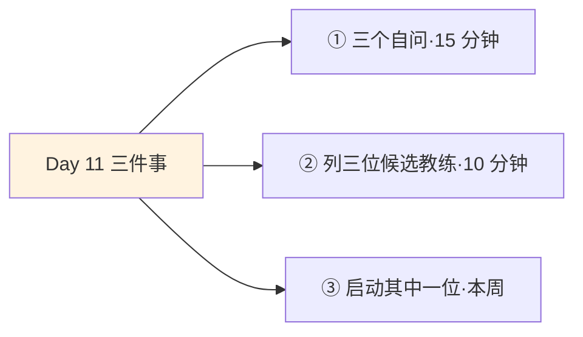
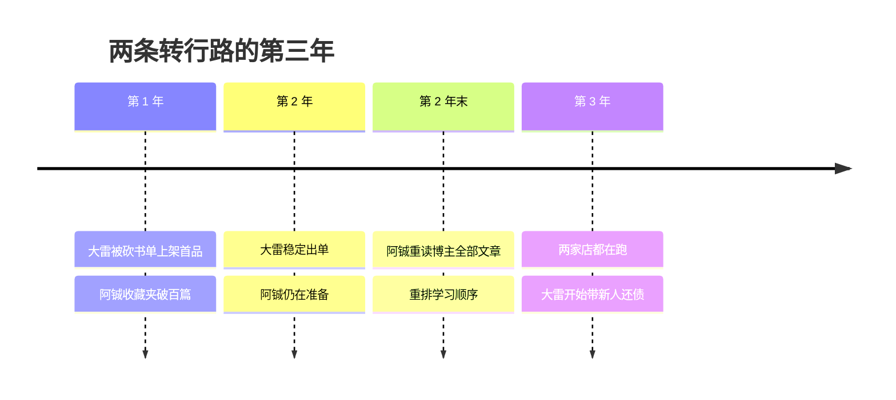

## Day 11·挖天赋找教练：捷径的活地图

- [01.看一个真实案例](#01看一个真实案例)
- [02.运动员密码：像了解器材一样了解自己](#02运动员密码像了解器材一样了解自己)
- [03.三样东西：天赋、素质与位置](#03三样东西天赋素质与位置)
- [04.三个自问](#04三个自问)
- [05.为什么必须有人指点](#05为什么必须有人指点)
- [06.好教练的三条标准](#06好教练的三条标准)
- [07.攀登者、抵达者与观望者](#07攀登者抵达者与观望者)
- [08.到哪里找教练](#08到哪里找教练)
- [09.教练关系的三个阶段](#09教练关系的三个阶段)
- [10.今天要做的三件事](#10今天要做的三件事)
- [11.总结回顾本章节](#11总结回顾本章节)
- [12.后来发生的改变](#12后来发生的改变)
- [13.今天起改变三点](#13今天起改变三点)
- [14.课后作业思考下](#14课后作业思考下)

---

## 01.看一个真实案例

先讲两位同时转行的人。

同一年，同一个起点，同一个目标：从传统行业转做电商运营。阿铖选了零成本路线，网上什么都有，他收藏了三十七篇教程，买了四本书，加了五个交流群。大雷花了一笔在当时的他看来肉疼的钱：找到一个做了八年的运营，约每周半小时通话，持续指导。

第一次通话，教练看了一眼他的学习清单，砍掉了三本书两门课。大雷懵了：这些不都是经典吗？教练说：**"是经典，但不是你现在的经典。你现在需要的不是学完什么，是三十天内上架你的第一个产品。"**第二周，教练让他把准备了半个月的选品报告扔掉一半，理由是你还在用老行业的直觉选品，先用最笨的方法上架，让市场教你。

一年后我见到他俩。大雷的店做到了稳定出单，人在行业里站住了。阿铖还在准备，收藏夹涨到了一百多篇，书读完了一半，群换了三个，他的说法是：感觉还差点火候。同样的一年，一个在赛道上跑完了第一圈，一个还在原地热身。

阿铖后来跟我说了句反思，我原文记下：**"我以为我省钱了，其实我花了最贵的东西：一年。"**今天讲的就是这两件事：知道自己该练什么，以及找到那个替你砍书单的人。

## 02.运动员密码：像了解器材一样了解自己

运动员四件套从今天开始装机。第一件，听起来最不像训练：像运动员一样了解自己。

看专业运动员的日常，你会发现他们对自己身体的了解，精细到吓人：哪块肌肉容易代偿、什么心率区间状态最好、自己的爆发力和耐力哪个是长板、恢复期需要几天。教练团队每天测的数据，比多数人一年体检一次对自己的了解还细。

这种了解在运动员那里不是自恋，是工程前提。**不知道自己的器材性能，就没法制定训练计划**：让短跑型选手去练马拉松，训练越刻苦，错得越远。这就是运动员密码的第一条：先搞清楚自己是块什么料，再谈怎么练。

反观普通人，我们对自己这台器材的了解，浅到近乎陌生。买房子会看十份户型图，选工作却说不清自己擅长什么；研究一部手机能查三天参数，自己的天赋是什么，答案是还行吧、都可以、看情况。原稿在这里有句狠话：**真正的时间管理，不能奢望用局部方法论去解决整体问题。**你连自己是什么系统都不知道，调什么参数都是瞎调。

Day06 说过，了解自己的天赋和素质，是逾越生存时间六件事的第一件。今天补上这一课，顺便解决第二个问题：了解了自己之后，去找谁来指点。

## 03.三样东西：天赋、素质与位置

像运动员一样了解自己，具体了解三样东西。

第一样，天赋。定义是自然禀赋：那些你几乎不用费力，就比一般人做得好的事。注意天赋的体验是透明的，鱼不知道水的存在，你也常常不知道自己的天赋，因为它对你来说太容易了，容易到你以为人人如此。有位读者做Excel函数特别快，她一直以为这算什么本事，直到换了个部门发现全组没人会。

第二样，素质。这是可训练的底盘：精力好不好，能不能长时间专注，抗压程度如何，表达是否清楚。天赋决定上限，素质决定你能不能把天赋兑现。它和天赋的区别在于变化速度：天赋基本不动，素质每月都在随你的睡眠、运动和情绪管理浮动，它就是 Day08 和 Day10 那些投资的总收益。

第三样，位置。你在专业领域的坐标系：这个赛道的地图长什么样，你现在站在哪一段，距离你想去的地方还有多远，中间隔着什么。没有位置感的努力是漂流，这是很多人勤奋却停滞的原因：一直在划桨，从不看自己在哪条河上。

| 三样东西 | 一句话定义 | 判断问题 | 常见误区 |
|:--:|:---|:---|:---|
| 天赋 | 不费力就比别人好的部分 | 别人费劲的事里，哪些你不费劲 | 把熟练当天赋 |
| 素质 | 可训练的底盘 | 我的精力和专注现在什么水位 | 把状态当性格 |
| 位置 | 赛道上的坐标 | 我距离目标还隔几段 | 用忙替换看地图 |

三样东西合起来，回答一个总问题：**我这块料，练什么最划算。**下一节给探测方法。

## 04.三个自问

天赋的探测，靠三个自问。各答三条，找交集。

第一问，什么事做起来最不费力？注意问法的刁钻处：不问你喜欢什么，问你不费劲的是什么。喜欢是态度，费力程度是信号。别人啃一周的报表你半小时捋顺，全班背不下的文言文你读两遍记住，这些都是。**最不费力是最可靠的探针**，因为天赋的第一体验就是我以为人人都会。

第二问，别人夸你最多的是什么？规矩有两条。一是要听多人重复的，夸一次的可能是客气，夸十年的东西里面一定有货。二是要区分夸的是你还是你的位置：夸你靠谱，是你；夸你平台好，是位置的坑。后者删掉，前者留下。

第三问，你最容易在什么场景忘记时间？这是心流的入口，Day24 会专门展开，今天先用它的探测功能：**让你忘记时间的事，就是你的天赋和热情的重叠区。**留意那些具体场景：改方案改到错过饭点、给朋友讲一件事讲到对方喊停、拆一个问题拆到半夜。

三问的交集处，画个圈。那个圈里就是天赋候选区，可能有两个，不必是一个。圈出来之后，交给下一个问题：这块料，谁来指点着练？

## 05.为什么必须有人指点

原稿有句话，把学习的本质说穿了：**学习的本质，就是数不清的模仿，与他人的指点。**

这句话有扎实的心理学背书。班杜拉的社会学习理论是二十世纪被验证最多的理论之一：人的绝大部分复杂技能，不是靠试错学来的，是靠观察模仿学来的，看别人怎么做，提取，再在自己身上试。婴儿学语言、新人学做事、你学用手机，全是这条路。**人是彻头彻尾的模仿型学习者**，这条出厂设置决定了：站在你前面的人是谁，直接决定你学成什么样。

而模仿有个孪生兄弟，叫反馈。埃里克森研究刻意练习时反复强调：没有即时反馈的练习，练得越多，错的越稳。自己练最大的问题从来不是学不会，是两个盲区：**你不知道自己哪里错了，你也不知道该先学什么**。前者需要一双看过千百人的眼睛，后者需要一张走过整条路的地图。知识是平的，到处都能下载；路径是陡的，只长在走过的人身上。

阿铖的收藏夹里其实什么知识都有，他缺的不是信息，是排序和纠错：哪个先学，哪个不用学，哪个是坑。这三样，恰恰是免费的扁平信息里最不包含的东西。**教练不是知识的来源，是路径的活地图。**

## 06.好教练的三条标准

什么样的人算好教练。原稿给了三条标准，逐条过。

第一条，行业前辈：达成过你想达成的目标。注意措辞的精确：是**你的**目标，不是他有没有名。你想开一家社区咖啡店，连锁品牌的创始人给你上课，不如街角那家开了十年、活得很好的店主。目标要对齐，成就才可迁移。

第二条，向上寻找：竞赛水平上高于你。注意是高一档，不是高一万倍。心理学在这里有个反直觉的发现：对自我效能提升最大的榜样，是那些和你起点相近、比你先走了几步的人，而不是遥远的传奇。原因朴素：**够得着的差距，才能被模仿；够不着的差距，只能被仰望。**仰望产生感动，模仿产生行动。

第三条，全面了解：了解行业信息。他不能只懂自己那段路。只走过A路线的人会告诉你A是唯一的路，看过整张地图的人才能告诉你：你的情况，可能B路线更快。判断方法：问他关于行业的宏观问题，比如这行未来三年怎么变，答得出格局的，是地图；只答得出自己生意的，是路段。

三条合起来一句话：**达过你想达的标，比你现在高一档，看得见整张图。**

## 07.攀登者、抵达者与观望者

这一节讲原稿里最锋利的那句话：**当你想去到一个地方，永远要向攀登者和抵达者提问，而不需要征询观望的人。**

它把所有会给你建议的人分成三类。攀登者：正在山上爬的人，他的价值是新鲜，昨天刚踩过的坑还热着，那句经验带着体温。抵达者：已经登顶的人，他的价值是全程，他知道哪段路看着可怕其实好走、哪段看着平缓其实是陷阱，代价是他离最近的泥泞远了一层。观望者：山脚下的人，他的特征是永远在评论：这山不好爬、那路线不行、现在上山晚了。

观望者的建议为什么最常见？因为他们人最多、嗓门最大、时间最闲。为什么最不值钱？因为他们的一切结论都来自想象，**从没下过场的理论，从未被现实修正过**，所以常常自洽且流畅，流畅到你以为那是智慧。辨认观望者的金标准就一条：问他上次自己下场是什么时候，答不出的，礼貌致谢，转身离开。

这不势利，这只是止损。你人生每一个路口收到的建议，都在参与塑造你走的方向。原稿那句话换个说法更重：**你征询谁，就是在让谁投票你的人生。**让观望者投票，是最贵的浪费，因为你自己出的学费。

## 08.到哪里找教练

标准清楚了，人到哪里找。四条路，由近及远。

第一条，身边人推荐。同事、朋友、校友、行业饭局上被反复提到名字的那个人。优点是知根知底，缺点是你的圈子可能不含这个层次，那就看下一条。第二条，内容平台逆向找。你持续追更超过半年的那个账号，就是天然的教练候选：你在不自觉地用半年时间验证他的输出质量。把他的内容按主题重读一遍，是零成本的观察期。第三条，付费社群和训练营。花钱买准入，这一步不必羞耻：**付费用最诚实的方式筛选了双方的诚意**，也比免费的关系更能换来有约束力的指点。第四条，公司内部。想转岗、想升级，那个两年前坐在你位置上的人就是教练，而且他欠你一顿请教吗？不欠，但多数人乐意讲，讲自己的来路，是人少有的慷慨。

四条路贯穿一个原则，原稿说得斩钉截铁：**永远咨询你要成为的那种人。**大雷的教练是八年运营，因为他要成为五年后的运营；阿铖的群友全是和他一起观望的人，所以聊得热烈，走得原地。

## 09.教练关系的三个阶段

找到人之后，关系怎么推进。三个阶段，急不得，也乱不得。

| 阶段 | 核心动作 | 大忌 |
|:--:|:---|:---|
| 观察期 | 远距离学习：追更、研究作品、复刻练习 | 刚加上就抛大而无当的问题 |
| 请教期 | 付费或价值交换：带着具体问题和自己的尝试去 | 只索取不付出，问了不做 |
| 同行期 | 变成朋友与合作者，开始输出价值 | 仍单方面依赖，停止生长 |

观察期做的是远距离模仿：把他做过的东西找出来，研究，复刻，对比差距。这个阶段他甚至不需要知道你。请教期的核心技术是**怎么问**：不要问我该怎么办，这种问题相当于让教练替你活；要问我在A和B之间选，我的情况是这样，我自己试了这一步，卡在这里，您当年怎么选。带着方案和尝试去，让对方做选择题而不是作文题，这是请教的基本礼节，也是效果的分水岭。同行期，你们开始平等交换，你也有了能给他的东西，而检验你是否真的出师，看你能不能开始指点下一个人。

## 10.今天要做的三件事

动作一，完成三个自问。每问三条，写在纸上，圈出交集。不求精确，今天圈出的天赋候选，够接下来三十天验证用。

动作二，列出三位候选教练。一位近身的（够得着约饭的层次），一位远程的（追更超过半年的账号），一位书里的（你的领域里你最服的那位作者）。三位都写下名字。

动作三，本周启动其中一位。近身的发一条诚恳的消息约半小时，远程的把他全部内容列成清单开始精读。启动不是完成，是把车挂上挡。

## 11.总结回顾本章节

运动员四件套第一件：像了解器材一样了解自己。三样东西：天赋是自然禀赋，素质是可训练的底盘，位置是赛道坐标，合起来回答我这块料练什么最划算。探测靠三个自问：不费力的事、被反复夸的事、忘记时间的场景。

学习的本质是数不清的模仿与他人的指点，人是模仿型学习者，模仿谁决定学成什么样。教练不是知识的来源，是路径的活地图，三条标准：达过你想达的标、高一档、看得见整张图。征询建议的铁律：只问攀登者和抵达者，你征询谁，就是让谁投票你的人生。关系推进三阶段：观察、请教、同行，请教永远带着自己的方案去。

一句话总结整章：**先认清自己是块什么料，再找到那个替你砍书单的人。**

## 12.后来发生的改变

回到阿铖和大雷，讲讲后续。

大雷一年后站稳了，第二年开始带两个新人，免费带，他说这是还债：当年教练也是这么被人带出来的。带新人的第一个月他干了件事，把徒弟的书单也砍了三本。他说砍的那一刻突然特别理解教练：**"原来教练砍的不是书，是那条叫准备好了才敢开始的弯路。"**

阿铖的转变发生在一年后的那次见面。他听完大雷的复盘，回去做了一件事：把追更了两年多、一直舍不得花那三百块的博主，全部文章打印出来，按主题重新读了一遍，然后按博主的路径图重排了自己的学习顺序。三个月后他的店也上架了，晚了整整一年。他后来总结了一句，我建议你抄下来：**"自学的最大成本不是学费省了多少，是你不知道自己不知道什么，而那个东西，只在走过的人嘴里。"**

最新的进展是：阿铖也找到了自己的教练，就是那位博主，他成了对方付费社群里最活跃的成员。有人问他后悔那两年吗，他说不后悔，因为他现在能清楚地看见那两年自己卡在哪，**而看得见弯路的人，下一段一定走得直。**

## 13.今天起改变三点

第一，把配教练当成战略，不是奢侈。把等我有闲钱再说的句式戒掉，教练费的定价单位从来不是钱，是弯路折算的时间。用 Day12 要讲的算法定：一个教练值多少钱，等于他自己试错的总成本，你用零头买走。

第二，维护一张活的教练清单。三位常备：一位近身的、一位远程的、一位书里的。每季度检查一次，位置变了清单就换，你升档了，教练也要升档，原稿说过，永远向上寻找。

第三，每次请教带方案去。从今天起，凡是向人开口，先写清楚我的情况、我的两个选项、我已经试了什么。这个动作把请教的质量提高一倍，也把对方对你的判断提高一档：**问出好问题的人，本身就是一种稀缺信号。**

## 14.课后作业思考下

第一，三个自问各答三条，写出交集。然后请一位熟人独立回答同样的问题，问他觉得你最不费力的是什么。自己的答案和他人的答案之间，差在哪一面？

第二，清点你的内容关注列表：持续追更超过半年的账号有几个？他们就是你的远程教练名单。逐个问一句：我到底想成为他吗，还是只是习惯了看他的更新？后者取关，前者留下精读。

第三，回想你最近收到的一条重要建议。它出自攀登者、抵达者还是观望者？建议的后果验证了第 07 节的判断吗？

第四，给三位候选教练中的一位，写一段两百字的自我介绍加一个具体问题，格式按第 09 节的：情况、两个选项、已做的尝试。本周发出去，发出那一刻，观察期结束，请教期开始。

---

**明日预告 · Day 12 艰苦训练计划。** 人找到了，明天给计划。为什么好计划一定要能拆分到每一天？为什么难度要定在踮踮脚够得着？五条原则、拆分的艺术，还有那个关键判断：行动的改变和认知的改变，哪个才作数。我们明天见。
