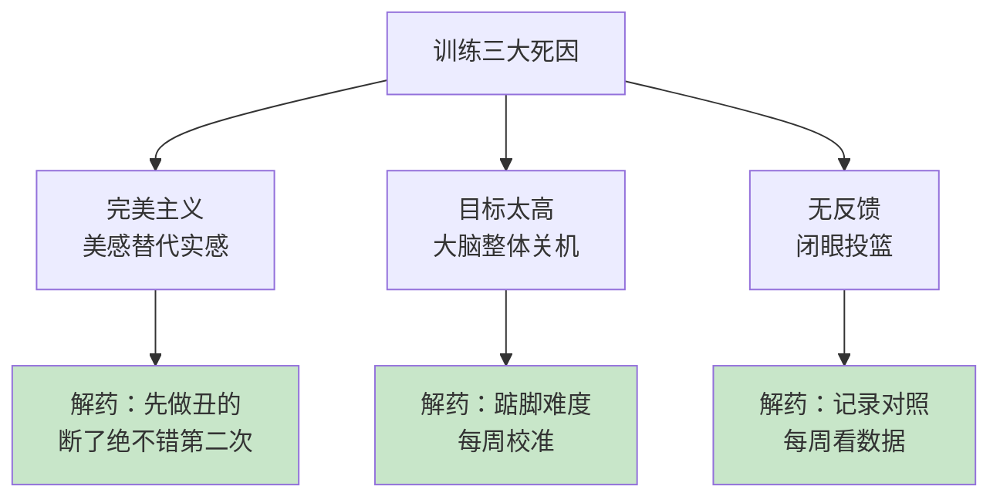
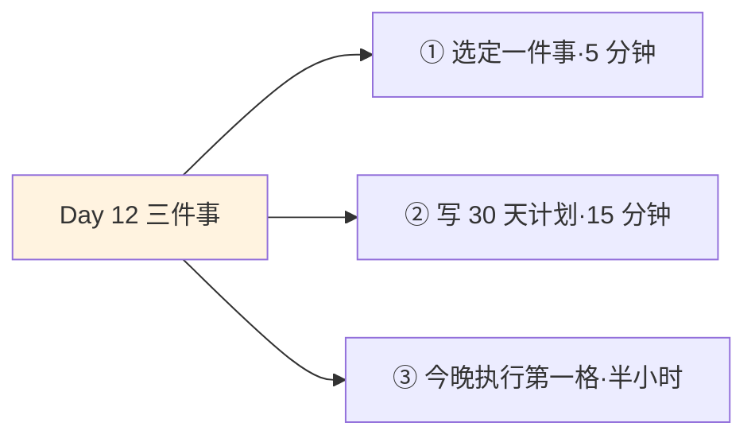
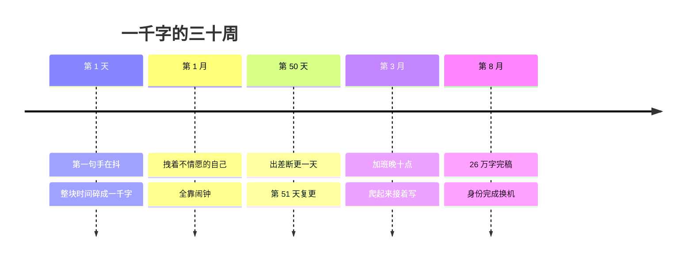

## Day 12·艰苦训练计划：把大目标翻译成今天

- [01.看一个真实案例](#01看一个真实案例)
- [02.什么是训练计划](#02什么是训练计划)
- [03.原则一：可量化，紧贴现状](#03原则一可量化紧贴现状)
- [04.原则二：拆分到每一天](#04原则二拆分到每一天)
- [05.原则三：稍高一点，踮踮脚](#05原则三稍高一点踮踮脚)
- [06.原则四与五：趁手的工具，参与的教练](#06原则四与五趁手的工具参与的教练)
- [07.每天怎么执行：清单法与三件小事法](#07每天怎么执行清单法与三件小事法)
- [08.训练的两种改变](#08训练的两种改变)
- [09.痛苦的时候，以及三个陷阱](#09痛苦的时候以及三个陷阱)
- [10.今天要做的三件事](#10今天要做的三件事)
- [11.总结回顾本章节](#11总结回顾本章节)
- [12.后来发生的改变](#12后来发生的改变)
- [13.今天起改变三点](#13今天起改变三点)
- [14.课后作业思考下](#14课后作业思考下)

---

## 01.看一个真实案例

先讲一位想写书想了十年的人。

她的原话是：等我有整块的时间，我就开始写。这话听起来无比合理，成年人写书，当然需要连续的、安静的、有灵感的几个月。这个等式她验证了十年，十年里整块的时间一次都没有出现，写过的一些开头躺在各种文档的第一页。

转机是一道小学算术。某次聊天，我随手算了给她听：每天一千字，一年三百六十五天，三十六万五千字，超过三本书的体量。她盯着这个数字看了很久，说了一句：**"原来我等的那个整块时间，是每天一千字攒出来的，不是天上掉下来的。"**

第二天她开始写。第八个月完稿，二十六万字。中间断过一次，第五十天出差断更，第六天恢复，这个细节第 09 节再讲。她复盘时说过一句总结：我不是变成了自律的人，我是先把写书人的身份领了，字是跟着身份来的。

这句总结里藏着今天一半的内容，另一半在原稿那句话里：**晋级密码就藏在日复一日的训练之中。**昨天找到了教练，今天写计划。

## 02.什么是训练计划

先破一个误解：训练计划不是愿望清单。把想瘦十斤、想读五十本书、想学英语排成一张表贴墙上，那不是计划，那是许愿。计划也不是日程表：把一周塞满待办事项，那是 Day01 已经解决过的记录问题，不解决方向问题。

训练计划的准确定义：**把一个周期性目标，翻译成每日动作的合同。**重点在翻译二字：目标本身永远是完不成的，你没法直接做掉瘦十斤，你只能做掉今天的那组动作。合同的意思是有约束结构：什么时间、什么地点、做多少、怎么验收。

看专业运动员的一天就明白计划是什么：几点训练、练什么肌群、几组几次、练完测什么指标。他不需要每天早上重新决定今天要不要练、练多少，**计划已经替他把决定的成本归零了**，他只负责执行。这才是计划对普通人最大的价值：不是安排时间，是把每天重新犹豫一遍、重新鼓起勇气一遍的消耗，一次性买断。

原稿说艰苦卓绝的训练计划，艰苦卓绝四个字容易吓退人。先澄清：艰苦的不是每天的动作，是日复一日的持续。每天一千字不难，难的是两百天。所以这套方法的核心，全部围绕怎么让持续变得可执行展开。

## 03.原则一：可量化，紧贴现状

五条原则来自原稿，第一条：可量化的具体目标，紧贴你现阶段的状态和生活。

为什么必须可量化。心理学家洛克和莱瑟姆研究目标设定三十多年，结论在世界五百强和奥运代表队里被反复验证：**具体且有一定难度的目标，显著优于模糊的尽力而为。**差距大到什么程度：给两组人同样的任务，一组说请尽力，一组说请在一小时内完成四十题，后者的完成量稳定高出前者一截。原因不神秘：模糊目标没法给行动导航，你在做每一步时都无法知道自己离目标多远，大脑对看不见终点的路天然吝啬投入。

量化的操作要点是找一个能数的指标。想变好看，量化为九十天腰围减五厘米；想练写作，量化为三十天三万字；想转行，量化为九周内完成三个作品。**能数的才能被追踪，能追踪的才能被完成。**

后半句同样重要：紧贴现阶段。目标必须从你现在的生活里长出来，而不是从别人的生活里抄过来。每周只有五小时空闲的人，抄一份每周训练十五小时的计划，抄的时候热血沸腾，第四天全线崩溃。正确的目标尺寸是：比你现在的实际产出高两三成，而不是高十倍。

## 04.原则二：拆分到每一天

第二条原则，原稿的表述：任务要能倒推拆分到每一天。这是五条里最核心的一条，值得叫它拆分的艺术。

三个示范。写一本书：三十万字，倒推为每天一千字，一个非写作的上班族也可以在通勤和清晨完成。跑一次马拉松：四十二公里，倒推为六个月，再倒推为每周三次跑步，第一次只跑三公里。转行：倒推为读五本行业书、做三个项目、认识十个同行，再倒推为这周读第一章、今晚改简历。

拆分的本质只有一句话：**把未来的大债，换成今天的小账单。**三十万字的债能把人吓瘫，一千字的账单今天就能结清。人不是被大目标压垮的，人是被大目标和大目标与今天之间的距离压垮的，拆分就是把那段距离铺成台阶。

这条原则还有个学术背书。心理学家戈尔维策研究执行意图几十年：把计划写成如果到了某时某地，我就做某事的形式，完成率显著提升。今晚七点半，坐到书桌前，写一千字，这就是一条完整的执行意图，时间、地点、动作三要素齐备。**人不是靠动力行动的，人是靠具体行动的。**动力时有时无，七点半永远准时。

## 05.原则三：稍高一点，踮踮脚

第三条原则，原稿的表述最生动：稍高一点的难点，踮踮脚可以碰到，需要自己摸索和感知适合自己的难度。

这四个字背后是一整套学习科学。发展心理学家维果茨基提出过最近发展区的概念：人在独立能做到的水平，和在指导下能做到的水平之间，存在一段区域，学习就发生在那段区域里。翻译成白话：**太容易的没长进，太难的会放弃，踮踮脚够得着的刚刚好。**

太容易的那端不用多说，舒适区里待一万天也只是熟练。太难得可怕的那端值得展开：难度超标时，大脑的反应不是加倍努力而是整体关机，拖延、逃避、突然对别的事情产生浓厚兴趣，都是关机的症状。很多人骂自己懒，其实是计划把大脑吓退了。

踮踮脚的校准是动态的，给一个可操作的方法：每周日复盘，问一句话。这一周是憋着完成的，还是压根够不着的？憋着完成的，下周加一成；够不着的，砍一成。**难度不是一次定终身，是一条要每周调的弦。**Day24 讲心流时会再遇到这个道理，那时它有个学名叫技能与挑战的平衡。

## 06.原则四与五：趁手的工具，参与的教练

后两条原则一起讲：使用一个得心应手的工具记录，需要教练参与其中。

工具这条，原稿的理由朴素而深刻：看得见的东西，感觉计划就一直在那个地方。计划写在脑子里，是幻觉；写在纸上，是承诺。工具选择只有一个标准：趁手，顺手到不需要学习。一张打印的表格贴在墙上、一个最普通的备忘录，都胜过花三小时配置的精致系统。**判断工具好坏的测试：这周你有几次主动看了它？**看了三次以上的工具在干活，一次没看的只是装饰。

教练这条是昨天的续集。五条原则里放这一条，用意极深：自己定的计划，最大的敌人是自己的感觉。感觉今天状态不好、感觉这个强度不合适、感觉这个方向不对，感觉是世界上最会撒谎的教练。Day11 找来的教练，在计划里的角色就是每周看一次数据，帮你校准难度、砍掉自嗨。**计划给你节奏，教练给你纠偏，两者缺一，都走不远。**

## 07.每天怎么执行：清单法与三件小事法

计划落到每天怎么过，原稿给了两个方法：清单法，或者三件小事法。

清单法的操作：前一晚写下明天最重要的三件事，就三件，按重要性排序，第二天从第一件开始做。三件的科学在于克制：写十件的下场是做到第四件就弃疗，写三件大概率全完成，而**完成感本身就是第二天的燃料**。

三件小事法是清单法在五种时间上的应用，更推荐：每天保证三件小事完成，一件给赚钱时间（Day07 的一小时），一件给好看时间（Day08 的十五分钟），一件给关系或好玩（给重要的人发条认真的消息，或体验清单上的一小格）。三件小事法妙在结构性：它不许你用一天的繁忙掩盖全面的荒废，再崩溃的日子，三块底色还在。

| 方法 | 操作 | 适合谁 |
|:--:|:---|:---|
| 清单法 | 前晚写明日三件事，按序完成 | 有一件主线任务的人 |
| 三件小事法 | 每天三件：赚钱·好看·关系或好玩 | 想同时稳住五种时间的人 |

两个方法可以合并：三件小事就是你的每日清单，主线任务（写一千字）排第一，好看和关系排第二第三。执行的关键动作只有一个：**前一晚写好，第二天只执行，不重新决定。**

## 08.训练的两种改变

现在讲这一章最深的一层。原稿：在成长的过程中，能够带给我们改变的是两种事：第一，行动的改变；第二，认知真正的改变。这其中，**认知真正的改变，才是持久的行为改变**，而行为改变需要我们用足够的时间，去形成新的习性。

两种改变的区别，用一个标准就能分清：驱动来自哪里。行动改变的驱动来自外部：deadline 在追、教练在看、打卡群里有人@你。它有效，但驱动源在外，源一撤，行为就停，这就是为什么考完试的六级书永远停在第三页。认知改变的驱动来自身份：不是我要写作，而是我是写作的人；不是我在坚持跑步，而是我是跑步的人。

行为科学家克利尔把这个机制讲成了一个精妙的比喻：**每一个行动，都是给你想成为的那种人投的一票。**今天写的一千字是一票，今天没写的不是零票，是投给了另一种人的弃权票。票数累积，某个时刻发生质变：写书的身份被选出来了，从那天起，写作不再需要坚持这个动词。

判断你在哪种改变里的自测：做这件事时，你靠的是提醒还是身份？不做这件事时，你的感觉是可惜还是解放？前者还是行动层，后者说明认知已经换了发动机。**行动的改变让你做到，认知的改变让你成为。**三十天的训练计划，前半段买的是行动，后半段等的是那个换机的时刻。

## 09.痛苦的时候，以及三个陷阱

计划执行到中段，痛苦必然来。原稿给的应对只有一句，但分量极重：每当痛苦时，你要追问自己，**今天有没有像运动员一样展开行动**。这句话的妙处在于它把问题从情绪区拽到了事实区：不问我难不难受，问今天做没做。做了，哪怕做得潦草，这一天就算数，痛苦就没有资格推翻它。

配套的配额原则：**允许偷懒百分之二十，拒绝放弃百分之百。**三十天里断六天是正常损耗，不是失败；真正致命的不是断，是断之后的心理叙事：反正断了，索性全弃。行为科学里对付这个有个经典规则，错过一次是意外，错过两次是新习惯的开始。所以铁律只有一条：**never miss twice，绝不错过第二次。**那位写书的朋友第五十天断更，第五十一天复更，她的原话是：我允许自己断一天，但不允许自己变成断更的人。

三个陷阱排在最后。第一个，完美主义：计划的完美程度和执行的概率常常成反比，制作精美计划表的愉悦感本身就是一种麻醉，划掉待办时的快感替代了做掉的实感。第二个，目标太高：心理学家卡尼曼管这个叫计划谬误，人天然低估时间、低估难度，两周瘦二十斤的计划不是雄心，是给自己挖的坑。第三个，无反馈：做了不知道效果，就像闭着眼睛投篮，三天必弃，Day08 的记录对照在这里直接复用。

## 10.今天要做的三件事

动作一，选定一件事。只选一件，这是铁律：三十天只训练一个目标，贪多在这里不是勤奋，是懈怠的伪装。用 Day11 的三问和 Day02 的年度主目标校准选题。

动作二，按五条原则写出三十天计划。格式照抄：量化目标是什么，每天的动作是什么（时间地点动作三要素），难度比现状高几成，记在哪个工具上，教练或见证人是谁。写不满五条的，回对应小节补。

动作三，今晚执行第一格。第一天不需要状态，只需要出现：写满一千字，跑完第一次三公里，读完第一章。然后把计划发给一个人，见证人或者教练，请他一个月后问你要结果。

## 11.总结回顾本章节

训练计划是把周期性目标翻译成每日动作的合同，核心价值是把每天重新决定的成本归零。五条原则：可量化且紧贴现状，具体目标显著优于尽力而为；拆分到每一天，把大债换成小账单，执行意图让完成率翻倍；稍高一点踮踮脚，太易无聊太难关机；工具趁手，看得见的计划才是承诺；教练参与，感觉是最会撒谎的教练。

每日执行靠清单法或三件小事法，前一晚定好，第二天只执行。两种改变里，行动的改变靠外部驱动，认知的改变改写身份，行动让你做到，认知让你成为。中段痛苦时只问一句今天有没有像运动员一样行动，允许偷懒两成，绝不错过第二次。

一句话总结整章：**大目标不需要被完成，需要被拆分。**

## 12.后来发生的改变

回到那位写书的人，补全她的三十周。

第一天她写下第一句时手是抖的，不是激动，是荒诞感：等了十年的整块时间，最后开始于一千字的碎块。第一个月最难，她形容是拽着一个不情愿的自己往前走，全靠七点半那个闹钟。转折在第三个月：有一晚她加班到十点，到家瘫在床上，突然爬了起来，因为她发现躺着的自己在想那一段怎么改。她跟我说，**"那一刻我知道成了：前两个月是我在用意志力写字，那个晚上开始，是不写会难受。"**

第八个月完稿那天，她做的第一件事不是庆祝，是把书稿从头读了一遍。她说读到第三章的时候哭了，不是因为写得好，是认出了那个每天七点半出现的自己。她后来的总结，值得作为本章的结尾：**"我以前以为自律是一种性格，现在知道它是一份合同：每天一千字，签三十天，身份自己会来领人。"**

## 13.今天起改变三点

第一，一个周期只写一份计划。三十天一个周期，周期内不加目标、不换目标。想加的冲动出现时记在本子上，留给下个周期，**克制加目标，是比执行更重要的纪律。**

第二，把绝不错过第二次立为家规。断一次是数据，断两次是方向。这条家规的适用范围超出训练计划：早起、运动、给家人打电话，凡是你在乎的持续，都适用。

第三，每周日做十分钟复盘。三个问题：这周完成了几成，难度是憋着还是够不着，下周加一成还是砍一成。难度是弦，每周调一次，音才是准的。复盘的产出只有一行字：下周的每日动作清单。十分钟，一页纸，坚持四个周日，你对自己这台器材的了解会超过过去一年。

## 14.课后作业思考下

第一，写出你自己的那道算术：你的大目标除以天数，等于每天多少。看着这个数字回答：它吓到你了吗？吓到的话，它是真的难，还是你没拆过？

第二，复盘你上一次放弃的计划，对照五条原则：它死在第几条上？没有量化、没有拆分、难度超标、工具不顺手，还是没人监督？找到死因，这一次绕开它。

第三，用投票的比喻做一次盘点：过去三十天，你把大多数票投给了哪种人？是刷手机的人、忙碌的人，还是写作的人、运动的人？票数不会说谎。

第四，把你今晚写的三十天计划，发给教练或见证人，请他做一件事：像 Day11 砍书单那样，砍一刀你的计划。哪一刀被砍掉，就从砍掉的地方开始。

---

**明日预告 · Day 13 永远对标对手。** 计划有了，明天找对手。为什么对手是最好的镜子、最快的进度条、最强的动力源？好对手的三个条件，还有那句话：运动员的级别越高，对手画像就越清晰，清晰到知道他姓甚名谁、住在哪里、在用什么方式训练。我们明天见。
