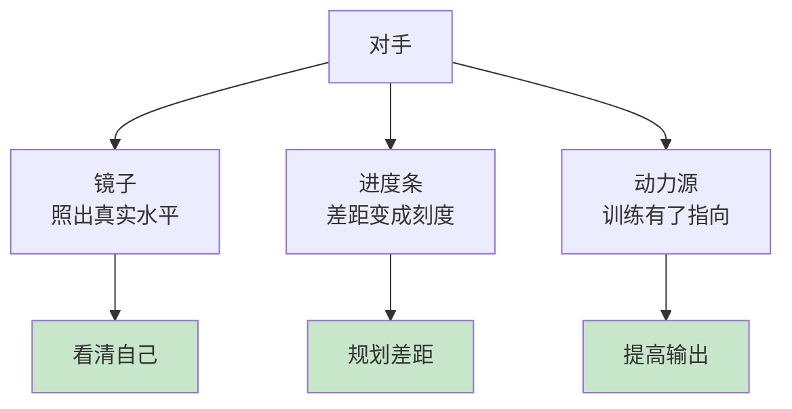
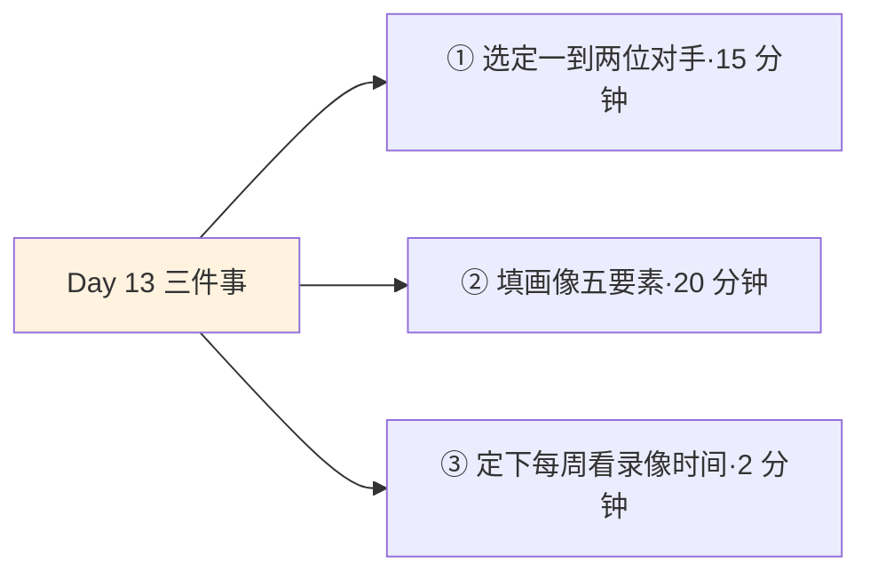
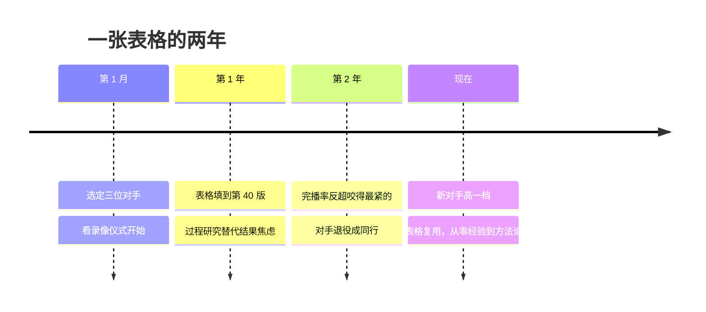

## Day 13·永远对标对手：镜子、进度条与动力源

- [01.看一个真实案例](#01看一个真实案例)
- [02.为什么大多数人没有对手](#02为什么大多数人没有对手)
- [03.班尼斯特与被证伪的上限](#03班尼斯特与被证伪的上限)
- [04.对手的三个身份](#04对手的三个身份)
- [05.对手画像五要素](#05对手画像五要素)
- [06.好对手的三个条件](#06好对手的三个条件)
- [07.结果研究：他做出了什么](#07结果研究他做出了什么)
- [08.过程研究：他每天在做什么](#08过程研究他每天在做什么)
- [09.心态研究：他如何面对失败](#09心态研究他如何面对失败)
- [10.对手是阶段性的](#10对手是阶段性的)
- [11.今天要做的三件事](#11今天要做的三件事)
- [12.总结回顾本章节](#12总结回顾本章节)
- [13.后来发生的改变](#13后来发生的改变)
- [14.今天起改变三点](#14今天起改变三点)
- [15.课后作业思考下](#15课后作业思考下)

---

## 01.看一个真实案例

先讲一位做职场内容自媒体的读者，姓阿柯，和她的每周一仪式。

两年前她的账号数据惨淡，惨到她不好意思让朋友知道。她做了一件后来被证明改变轨迹的事：选定三个对标账号。一个和她同城同赛道，量级相当；一个领先她一大截，是她的目标；一个和她咬得最紧，贴身竞争。然后每周一晚上九点，她雷打不动做一件事，自己叫它看录像：把三个人最新的内容全部过一遍，逐项填进一张表格。更新频率、选题、结构、数据，一格一格填。

填了两年。上个月她告诉我，那个和她咬得最紧的，她反超了一项：某类选题的完播率，她的稳定高于对方。不是全面超越，是一项。但她说了一句我记到今天的话：**"他到现在都不知道我，但他陪了我两年的练。"**

看录像这个词，原稿里有出处：女排运动员的赛前准备。原稿说，至少在你即将逾越的生存时间领域之内，去做像女排运动员看录像一样的准备。今天这一章，讲的就是把这套运动员的看家本领，装进普通人的生活：对手。

## 02.为什么大多数人没有对手

先回答一个前提问题：为什么多数人的成长系统里，根本没有对手这个角色。

第一层原因是文化。我们的处世教育里，对手近乎贬义词：树敌、争强好胜、见不得别人好。礼貌的做法是不比较，高级的说法是只和自己比。第二层原因是结构：学生时代有排名，对手是被制度指定的；毕业那天排名消失，对手也随之消失，从此各自的赛道只剩自己，快慢无人可证。

只和自己比这句话，值得单独审一遍。它作为心态是好的，作为方法是残缺的：**它是温柔的，也是一面没有刻度的镜子。**今天的自己真的比昨天强吗，强多少？没有外部参照的进步，很容易变成自我感动：你觉得在长进，数据纹丝不动。

心理学在这件事上早就下了结论。费斯廷格一九五四年提出社会比较理论：**人有评估自身能力和观点的内在驱力，而在缺乏客观标准时，唯一的评估方式就是与他人比较。**这不是虚荣，这是天性：你连自己的水平都无法独力知道，比较是认知自己的必经之路。堵死比较，等于蒙眼练枪。

所以问题从来不是要不要比较，而是和谁比、怎么比、比完做什么。这三问，就是今天的剩余章节。

## 03.班尼斯特与被证伪的上限

讲清对手的价值，最好的故事发生在七十多年前的跑道上。

一九五四年五月六日之前，四分钟跑完一英里，被医学界和体育界共同认定是人类生理的极限：无数人冲击失败，甚至有论文论证其不可能。当天的牛津，医学院学生班尼斯特跑出三分五十九秒四。接下来的事才是重点：**仅仅四十六天后，另一位选手兰迪跑出三分五十七秒九。**此后十几年，打破四分钟的人从零个变成几百个。人体没变，跑道没变，变的东西只有一个：一个证明了上限是假的的人，出现了。

这个故事揭示了对手最深的价值。对手的作用不是给你压力，不是让你焦虑，是**给你证据**：证据那个你以为的天花板，只是暂时没人碰过。这也解释了为什么第一名后面永远跟着一群人：不是他们抄袭，是那个人的存在改写了所有人的物理可能。

阿柯的故事是班尼斯特的低配版。她两年前不知道一篇职场文可以做到那样的完播率，直到她贴身盯着一个做到了的人。她说：原来我以为的天花板，只是我这一层的地板。**对手在前面跑的意义，是不断告诉你这层楼上面还有一层。**

## 04.对手的三个身份

进入操作之前，把对手的三个身份立起来。原稿的定义打头：**运动员必须永远对标对手，并且观察对手，寻求超越。**

第一个身份，镜子。对手照出你的真实水平。人对自己的评估普遍失真，自评和他评的差距能大到离谱，对手是那面不参与你自我安慰的镜子：数据摆在那里，他更新比你勤，完播率比你高，镜子不说谎。第二个身份，进度条。没有对手时，你的差距是一团雾：我还差得远。有了对手，差距变成刻度：具体差在选题上还是频率上，差三个月还是三个季度。**没有刻度的差距只能叹气，有刻度的差距可以规划。**第三个身份，动力源。训练是漫长的，Day12 的每日动作枯燥而重复，对手让训练有了指向：你不是在完成计划，你是在追一个具体的名字。人在有具体靶子时的输出，和空转时的输出，完全不是一个量级。

三个身份合起来回答一个问题：为什么训练必须有对手。因为**没有对手的训练是盲目的，对手让进步变得可度量、可规划、可持续。**

## 05.对手画像五要素

原稿里有一段描述，是全章最精彩的话：**当运动员的级别越高，对手的画像就会越清晰：他会清楚地知道，这位对手姓甚名谁、有什么必杀绝技、住在哪里、在用什么方式训练、未来哪一天会和他交手。**

这段话反过来读更有用：画像的清晰度，和水平成正比。也就是说，**你的对手画像有多模糊，就说明你的训练方向有多模糊。**说不清对手是谁的人，通常也说不清自己在练什么。

把画像拆成五要素，做成一张可以直接填的表：

| 要素 | 问自己的话 | 阿柯的填法 |
|:--:|:---|:---|
| 姓名与坐标 | 他叫什么，在哪个赛道哪个位置 | 同城同赛道那位，粉丝量级相当 |
| 必杀绝技 | 他最不可替代的长板是什么 | 选题嗅觉，总能踩中情绪 |
| 日常训练 | 他每天在做什么，用什么节奏 | 每周两更，雷打不动，选题周一开会定 |
| 差距所在 | 你们具体差在哪一项，差多少 | 完播率差一个档位，频率差每周一篇 |
| 预计交手 | 你们下一次同台是什么时候 | 季度同类选题的正面比较 |

五格填满，对手从一团模糊的别人家，变成一个可研究、可追赶的具体坐标。填不满的格子，就是你的情报缺口，也正是第 07 至 09 节三种研究要补的东西。

## 06.好对手的三个条件

不是所有领先者都配当你对手。原稿给了三个条件，逐条过。

第一个条件，同一量级。原稿原话：要在同一量级中进行比赛，找到和你相仿的对手很重要。对标高出你十档的人，收获的不是动力是绝望：他的方法建立在他的资源上，你抄不动，抄了也是挫败。对标低于你的，连镜子都算不上。**好对手是同量级里略强于你的那位**：他的方法建立在你够得着的资源上，他的今天就是你的三个月后。这也正是 Day11 教练与对手的分工：教练向上找，高一档；对手平行找，同量级。

第二个条件，有交流的可能，至少找到明确差距的方法。能交流最好，同城同行，一场饭局能换来别人半年的弯路；不能交流也无妨，公开数据就是交流：作品、更新频率、数据面板，都在那里。阿柯的看录像，就是无交流条件下的标准动作。

第三个条件，可量化。差距必须能换算成数字，否则一切比较都会退回感觉。频率差几篇，完播率差几个点，作品量差几件。数字不动感情，也不接受借口。

## 07.结果研究：他做出了什么

三种研究，是本篇的实操核心，对应对手的过去、现在和将来。第一种，结果研究：看他做出了什么。

操作：把对手的代表作逐个列出来，逐个拆。这篇为什么成了，那个作品好在哪，结构、时机、切入点，一样一样标注。结果研究的产出应该是一张清单：**他的成果里，哪些可以被你的方法吸收。**

必须同时挂一个警告：只看结果，会焦虑。因为结果研究天然只显示别人的收成，显示不了别人的耕种。你看到的是他的爆文，看不到爆文之前的一年日更。所以结果研究永远只是入口，它负责让你知道山顶长什么样，不负责告诉你路在哪。**结果是过程的化石**，这句话请刻在结果研究的表格抬头：化石值得研究，但研究化石是为了复原活的动物。

## 08.过程研究：他每天在做什么

第二种研究才是主菜：过程研究，看他每天在做什么。

操作：跟踪对手的日常轨迹。更新节奏是什么，选题从哪来，开头怎么写，什么工具，什么时间段发布，低谷时怎么维持。阿柯的看录像就是标准过程研究：她的表格里记的不是对方的爆款，是对方的动作。过程研究的产出和结果研究完全不同：**它产出的不是可叹的距离，是可抄的动作。**频率可以抄，方法可以抄，勤奋度可以抄，这些是过程，而过程不设版权。

区分两种研究的好坏很简单：做完结果研究，你通常感觉是又酸又丧；做完过程研究，你手里多了一张待办清单。前者是情绪，后者是弹药。**对手值得研究的从来不是他的奖杯，是他的日程表。**

## 09.心态研究：他如何面对失败

第三种研究最贵，最少人做：心态研究，看他如何面对失败。

每个对手都有低谷期：数据滑落的半年、转型的阵痛、公开的失误。这些时刻才是信息密度最高的素材：他停更了还是转型了？是硬扛还是绕道？低谷之后他做的第一个动作是什么？**看一个人强不强，不看他的巅峰，看他的应对。**巅峰人人相似，应对才见真章。

阿柯讲过一个小发现：那位领先她一大截的对手，去年有一波明显的数据滑坡，对方没有停更硬熬，而是公开写了一篇复盘，坦承这批选题判断错了，然后换了打法。她说那篇复盘她读了三遍，读到的不是方法，是一种姿态：**原来那个高度的人，也摔，摔了也认账，认完接着打。**心态研究给不了你可抄的动作，但它给你可抄的活法，在你自己的低谷到来之前，先存一份别人怎么扛的样本。

## 10.对手是阶段性的

最后一条认知：对手不是终身制的。原稿：随着时间和实力的推进，对手是可以阶段性变更的，不断朝向更高的地方，寻找新的对手。

变更的机制给两个。第一个是自然超越：你追平或者反超了，这一位光荣退役，从对手栏挪进教练栏，甚至挪进朋友栏。第二个是主动升档：你的量级变了，原来的同量级不再提供镜面价值，需要换一位新的。阿柯反超那项之后做的第一件事，就是物色新对手：这次的标准，比两年前高了一档。

实操上建议每年做一次对手盘点，问三个问题：这位还是同量级吗，他还照得出我的水平吗，我的画像五要素更新了吗。**保持一到两位跳一跳能追上的对手**，这是长期训练的最佳配置：没有，会盲；太多，会乱。

## 11.今天要做的三件事

动作一，选定一到两位对手。同量级、可量化、最好能交流。判断量级的小窍门：把他的一切除以二，如果那个水平是你一年内够得着的，就是同量级；如果除以二还是望尘莫及，他属于教练栏不属于对手栏。

动作二，填满画像五要素表。姓名坐标、必杀绝技、日常训练、差距所在、预计交手。填不满的格子标出来，那是下周情报采集的任务。

动作三，定下你的每周看录像时间。固定星期、固定钟点、固定动作：过一遍对手的最新动态，更新表格。仪式感在这里不是矫情，是让研究可持续的容器。

## 12.总结回顾本章节

运动员必须永远对标对手，观察对手，寻求超越。只和自己比是温柔的，但是无刻度的镜子；社会比较不是虚荣，是认知自己的必经之路。对手的最深价值是给你证据：证明你以为的上限只是暂无人碰过，班尼斯特之后，四分钟的墙塌成了门。

对手的三个身份：镜子照水平，进度条量差距，动力源给指向。画像五要素：姓名坐标、必杀绝技、日常训练、差距所在、预计交手，画像的清晰度等于训练方向的清晰度。三种研究：结果研究出清单，但结果是过程的化石；过程研究出动作，对手值得研究的是日程表不是奖杯；心态研究最贵，看一个人的强，看他的应对。对手是阶段性的，保持一到两位跳一跳能追上的。

一句话总结整章：**对手不必知道你，他在前面跑，就是陪你练。**

## 13.后来发生的改变

回到阿柯，讲讲反超之后的事。

反超那一项的当周，她做了两个动作：把这位从对手栏挪到了同行栏，对方其实早就注意到她了，两人在一场行业活动上认识，现在每月会通一次电话，交流选题，**互相当对手，也互相当情报站**。然后她物色了新对手，标准高了一档，她说这次不慌，因为她已经知道怎么研究一个对手了：看录像那套表格，直接复用。

她的最新复盘里有句话，是这一章最好的注脚：**"两年前我以为对手是用来赢的，现在知道对手是用来照的：我赢没赢是结果，我照没照清楚自己，才是训练的全部。"**

还有一个小细节。那张看了两年录像的表格，她现在每周还填，只是多了一列：这一周，我在哪一项上，值得被别人研究。她说这一列是她的新镜子。

## 14.今天起改变三点

第一，每周看录像，一次不落。固定的仪式固定的钟点，对手研究靠的不是强度是连续。断两次的研究，和 Day12 断两次的日更一样，等于重启。

第二，把嫉妒翻译成研究。以后每次刷到别人心生酸意，把它当指南针处理：**你酸哪里，说明你想要哪里。**酸他的数据，就去研究他的频率；酸他的自由，就去拆他的结构。嫉妒翻译成研究是情报，停在嫉妒里是内耗。

第三，每年盘点一次对手栏。该退役的退役，该升档的升档，别让两年前的对手评价今天的你。对手系统最怕的不是没有，是过期。

## 15.课后作业思考下

第一，写下你的一到两位对手，填满画像五要素。哪一格最难填？难填的那格，暴露的是你情报的缺口还是方向的模糊？

第二，对你选定的一位对手，各做一次三种研究：列出他的三个代表作和可吸收的点，还原他一周的日常动作，找出他最近一次低谷和他的应对。三种产出分别是什么，差距一目了然。

第三，回想你最嫉妒过一个人的三个时刻。把三次酸意翻译成三次想要，那三个想要连起来，画出来的是什么图形？

第四，用新镜子照一次自己：本周你在哪一项上，做到了值得被别人研究的事？如果没有，别灰心，明天开始的第一天，正好赶得上。

---

**明日预告 · Day 14 看下一个赛点。** 四件套的最后一件：比赛。训练、教练、对手都齐了，还差一个验收的地方。为什么说光芒就在下一个赛点？怎么把日常生活里的一次汇报、一场分享定义成比赛？备赛四步流程，明天见。
